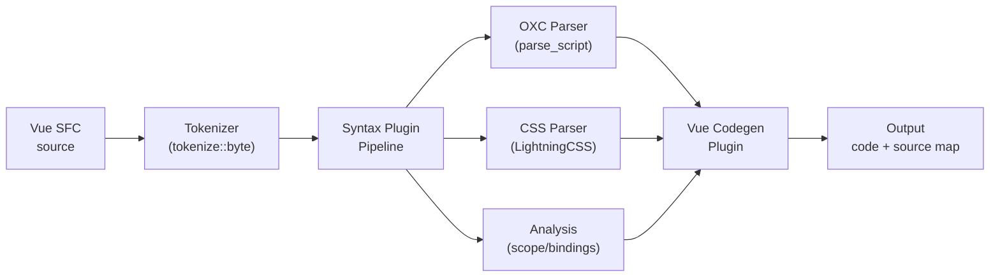
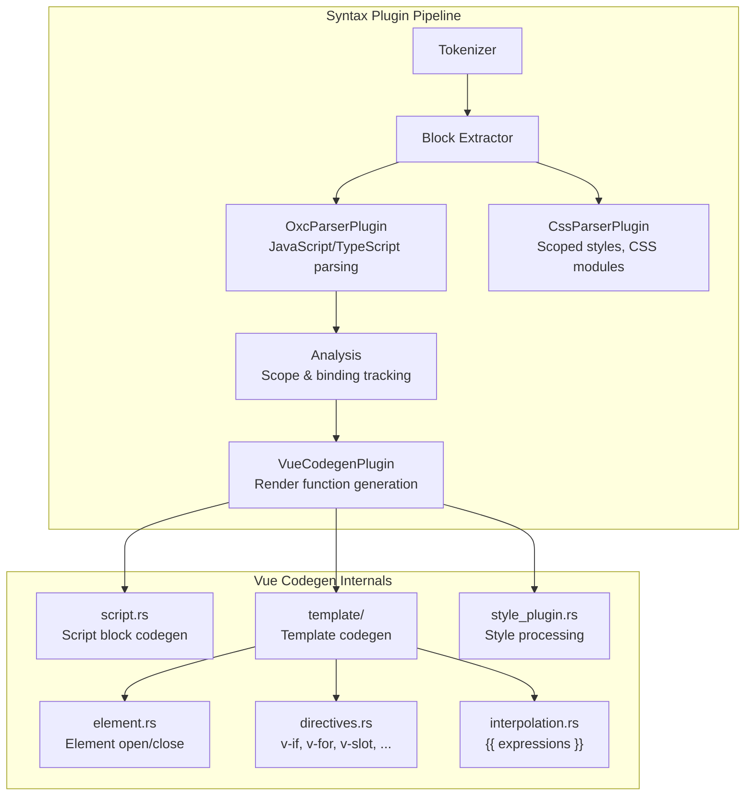

# verter_compiler

> [!WARNING]
> This project is **experimental and under active development**. APIs, architecture, and package boundaries may change without notice.

Core Rust library crate that compiles Vue Single File Component (SFC) templates into optimized JavaScript render functions. This is the future heart of the Verter project -- it currently handles template compilation and will progressively take over more responsibilities from the TypeScript packages.

`verter_compiler` is a **pure Rust library** with no FFI dependencies. It is consumed by [`verter_napi`](../verter_napi/) (Node.js native bindings) and [`verter_wasm`](../verter_wasm/) (browser WASM bindings).

## Vue typed-macro contract

The compiler owns macro syntax and emission; TypeInfo owns typed
`defineProps`, `defineEmits`, and `defineModel` resolution. Callers provide the
requested runtime/TSC bundle through `VueMacroSemanticInput`. Missing,
incomplete, role-mismatched, or structurally invalid bundles fail closed at the
authored macro anchor. Only a structurally valid runtime bundle reaches script
codegen; degraded members retain their typed diagnostic and emit Vue's
`type: null` fallback.

Parser-owned model names are OXC-decoded semantic values; their authored spans
remain the source-map/diagnostic anchors. All typed emit and model public names
are serialized through the canonical JavaScript string escaper.

`CodegenOptions.is_production` and `CodegenOptions.custom_element` select Vue's
runtime-prop rendering profile. `custom_element` is a script policy and is
independent of `custom_elements`, which configures template tag recognition.
Static eligible `withDefaults` objects are embedded per prop; dynamic/spread or
unsupported objects use one `_mergeDefaults` fallback.

## Architecture

### Compilation Pipeline



### Plugin Architecture

The compiler uses a plugin-based pipeline where each stage is a `SyntaxPlugin`. The builder orchestrates execution in order:



### Module Structure

```
src/
  lib.rs                              Public module exports
  builder/
    codegen.rs                        Main pipeline orchestrator, CodegenOptions, CodegenResult
  codegen/
    vue/
      plugin.rs                       VueCodegenPlugin (main codegen entry)
      script.rs                       Script block codegen, extract_binding_metadata
      script_plugin.rs                Script transformation plugin
      style_plugin.rs                 Style block processing (scoped CSS, CSS modules)
      template_plugin.rs              Template compilation plugin
      template/
        element.rs                    Element open/close processing
        directives.rs                 Directive compilation (v-if, v-for, v-slot, v-on, v-bind, ...)
        interpolation.rs              Template interpolation ({{ expr }})
        types.rs                      TemplateCodegenState, BindingMetadata, patch flags
      macros/
        props.rs                      defineProps compilation
        emits.rs                      defineEmits compilation
        model.rs                      defineModel compilation
        slots.rs                      defineSlots compilation
        expose.rs                     defineExpose compilation
        options.rs                    defineOptions compilation
        types.rs                      Macro-related types
  syntax/
    syntax.rs                         Syntax pipeline runner
    plugin.rs                         SyntaxPlugin trait, SyntaxPluginContext
    plugins/
      oxc_parser/                     JavaScript/TypeScript parsing via OXC
      css_parser/                     CSS parsing via LightningCSS (scoped styles, modules)
      analysis/                       Scope analysis, binding tracking
      ast_vue/                        Vue-specific AST types
      block_extractor.rs              SFC block extraction
  tokenizer/                          Lexical analysis (byte-level tokenizer)
  cursor/                             Position tracking, UTF-8/UTF-16 offset resolution
  code_transform/                     Source map generation and code transformation
  analysis/                           Semantic analysis
  common/                             Shared utilities
  utils/                              General utilities, OXC helpers
```

## API

### `generate(input, options, allocator) -> CodegenResult`

Main compilation entry point. Compiles a Vue SFC string into JavaScript with source maps.

```rust
use oxc_allocator::Allocator;
use verter_compiler::builder::codegen::{generate, CodegenOptions, CodegenResult};

let allocator = Allocator::new();
let options = CodegenOptions {
    filename: Some("App.vue".to_string()),
    include_source_content: true,
    ssr: false,
    is_production: false,
    component_id: None,
    features: Default::default(),
};

let result: CodegenResult = generate(input, &options, &allocator);
// result.code              -- compiled JavaScript
// result.source_map        -- source map as JSON string
// result.code_with_source_map -- code with inline base64 source map
```

### `generate_for_vite(input, options, allocator) -> ViteCodegenResult`

Vite-optimized compilation that returns split blocks for virtual module serving.

```rust
use verter_compiler::builder::codegen::{generate_for_vite, ViteCodegenOptions, ViteCodegenResult};

let result: ViteCodegenResult = generate_for_vite(input, &options, &allocator);
// result.script    -- Option<BlockOutput> (component definition)
// result.template  -- Option<BlockOutput> (render function)
// result.styles    -- Vec<StyleBlock> (processed CSS)
// result.duration_ms -- compilation time
```

### Key Types

| Type                   | Description                                                     |
| ---------------------- | --------------------------------------------------------------- |
| `CodegenOptions`       | Compilation configuration (filename, SSR, production, features) |
| `FeatureFlags`         | `options_api`, `props_destructure`                              |
| `CodegenResult`        | Output: `code`, `source_map`, `code_with_source_map`            |
| `ViteCodegenOptions`   | Vite-specific options (filename, SSR, production, sourcemap)    |
| `ViteCodegenResult`    | Split blocks: `script`, `template`, `styles`, `duration_ms`     |
| `BlockOutput`          | Per-block output: `code`, `source_map`, `imports`, `body_start` |
| `TemplateCodegenState` | Internal state for template code generation                     |
| `BindingMetadata`      | Tracks variable scopes for template expression resolution       |

## Key Design Patterns

- **"Store in open, emit in close"** -- Element processing collects data during the opening tag and emits code during the closing tag, enabling proper nesting
- **OXC allocator per call** -- A fresh `oxc_allocator::Allocator` is created for each compilation. The allocator manages memory for the OXC AST and must not cross FFI boundaries
- **SHA-256 component IDs** -- Component IDs are derived from the filename via SHA-256, using the first 4 bytes (8 hex characters)
- **Plugin-based pipeline** -- Each compilation stage (`SyntaxPlugin`) is composable and independently testable
- **Import extraction** -- Generated code imports are parsed and tracked for Vite virtual module splitting

## Development

### Build

```bash
cargo build --package verter_compiler
cargo build --package verter_compiler --release
```

### Examples

```bash
cargo run --package verter_compiler --example codegen
cargo run --package verter_compiler --example ast
cargo run --package verter_compiler --example check
cargo run --package verter_compiler --example expression_validator
```

## Testing

```bash
# Run all tests
cargo test --package verter_compiler --verbose

# Run a specific test
cargo test --package verter_compiler test_name

# Run with truncated output (useful for large test suites)
cargo test --package verter_compiler 2>&1 | tail -60
```

### Test Patterns

- **`gen_and_validate()`** -- All codegen tests MUST validate generated JavaScript syntax via the OXC parser. This ensures the output is syntactically valid.
- **AST comparison** -- End-to-end tests compare output against Vue's official compiler to verify behavioral equivalence.
- **TDD workflow** -- Write failing tests first, then implement the feature.

### Benchmarks

4 benchmark suites are available using [Criterion](https://github.com/bheisler/criterion.rs):

| Benchmark        | Focus                          |
| ---------------- | ------------------------------ |
| `bindings_bench` | Binding metadata extraction    |
| `vfor_bench`     | `v-for` directive compilation  |
| `vslot_bench`    | `v-slot` directive compilation |

```bash
cargo bench --package verter_compiler
cargo bench --package verter_compiler --bench bindings_bench
```

## Dependencies

| Crate                                                                   | Purpose                                       |
| ----------------------------------------------------------------------- | --------------------------------------------- |
| `oxc_allocator`, `oxc_ast`, `oxc_parser`, `oxc_span`, `oxc_diagnostics` | JavaScript/TypeScript parsing (OXC toolchain) |
| `oxc_sourcemap`                                                         | Source map generation                         |
| `lightningcss`                                                          | CSS parsing, scoped styles, CSS modules       |
| `serde`, `serde_json`, `serde_repr`                                     | Serialization for options and results         |
| `bumpalo`                                                               | Bump allocator for collections                |
| `rustc-hash`                                                            | Fast hashing (FxHashMap/FxHashSet)            |
| `smallvec`                                                              | Stack-allocated small vectors                 |
| `sha2`, `hex`                                                           | SHA-256 hashing for component IDs             |
| `base64`                                                                | Base64 encoding for inline source maps        |
| `memchr`                                                                | Fast byte searching                           |

## License

MIT
