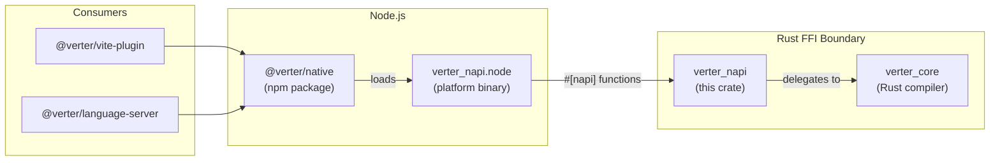
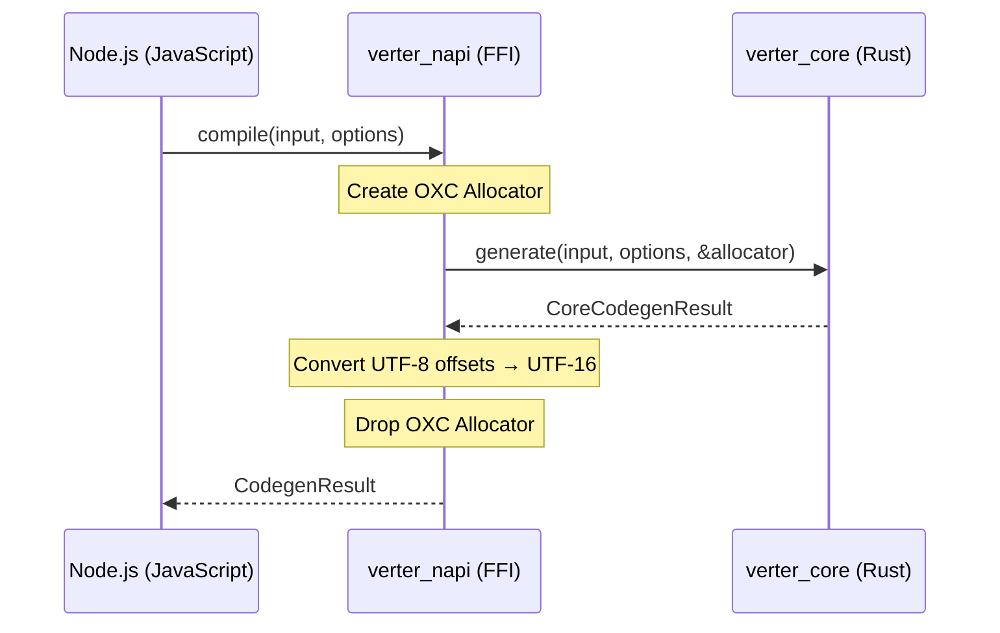

# verter_napi

> [!WARNING]
> This project is **experimental and under active development**. APIs, architecture, and package boundaries may change without notice.

NAPI-RS native binding crate that exposes [`verter_core`](../verter_core/) to Node.js. This is a thin FFI layer that compiles to a platform-specific `.node` binary (cdylib), consumed by the [`@verter/native`](../../packages/native/) npm package.

## Architecture



### FFI Boundary Design



Key constraints at the FFI boundary:

- **OXC allocator lifecycle** -- A fresh `oxc_allocator::Allocator` is created and dropped inside each FFI call. The allocator manages OXC AST memory and cannot safely cross the FFI boundary.
- **UTF-8 to UTF-16 conversion** -- Rust operates on UTF-8 byte offsets internally. At the NAPI boundary, `PositionResolver` converts all offsets to UTF-16 code units for JavaScript string compatibility.
- **NAPI object mapping** -- Rust structs are annotated with `#[napi(object)]` to generate JavaScript-compatible interfaces automatically.

## API

All exported functions are annotated with `#[napi]` and available as synchronous calls from Node.js.

### `compile(input, options?) -> CodegenResult`

Compiles a Vue SFC string into JavaScript with source maps.

```javascript
const { compile } = require('@verter/native');

const result = compile('<template><div>{{ msg }}</div></template>', {
  filename: 'App.vue',
  includeSourceContent: true,
  isProduction: false,
  ssr: false,
  features: {
    optionsApi: true,
    propsDestructure: true,
  },
});

console.log(result.code);       // compiled JavaScript
console.log(result.sourceMap);   // source map JSON string
```

### `compileSync(input, options?) -> CodegenResult`

Identical to `compile` -- kept for API compatibility.

### `compileForVite(input, options?) -> ViteCodegenResult`

Vite-optimized compilation returning split blocks for virtual module serving. Each block includes import metadata with UTF-16 offsets for JavaScript string manipulation.

```javascript
const { compileForVite } = require('@verter/native');

const result = compileForVite(sfcSource, {
  filename: 'App.vue',
  isProduction: false,
  ssr: false,
  sourcemap: true,
});

// result.script   -- { code, sourceMap, imports, bodyStartUtf16 } | null
// result.template -- { code, sourceMap, imports, bodyStartUtf16 } | null
// result.styles   -- [{ code, sourceMap, scoped, isModule, lang, moduleName, moduleClasses }]
// result.durationMs -- compilation time in milliseconds
```

### Type Definitions

| NAPI Type | Fields |
|---|---|
| `FeatureFlags` | `optionsApi?: boolean`, `propsDestructure?: boolean` |
| `CodegenOptions` | `filename?`, `includeSourceContent?`, `ssr?`, `isProduction?`, `componentId?`, `features?` |
| `CodegenResult` | `code`, `sourceMap`, `codeWithSourceMap` |
| `ViteCodegenOptions` | `filename?`, `ssr?`, `isProduction?`, `componentId?`, `sourcemap?` |
| `ViteCodegenResult` | `script?`, `template?`, `styles[]`, `durationMs` |
| `JsBlockOutput` | `code`, `sourceMap?`, `imports[]`, `bodyStartUtf16` |
| `JsBlockImport` | `source`, `specifiers[]`, `startUtf16`, `endUtf16` |
| `JsStyleBlock` | `code`, `sourceMap?`, `scoped`, `isModule`, `lang?`, `moduleName?`, `moduleClasses[]` |

## Build

### Prerequisites

- Rust toolchain (stable)
- Node.js (for NAPI-RS build tools)

### Building the Native Binary

From the `packages/native/` directory (which orchestrates the NAPI build):

```bash
napi build -o dist --platform --release --manifest-path ../../crates/verter_napi/Cargo.toml
```

Or from the repository root:

```bash
pnpm run build:native
```

This produces a platform-specific `.node` file (e.g., `verter_napi.linux-x64-gnu.node`).

### Platform Targets

The CI builds native binaries for 7 platform targets:

| Platform | Target Triple |
|---|---|
| Linux x64 (glibc) | `x86_64-unknown-linux-gnu` |
| Linux x64 (musl) | `x86_64-unknown-linux-musl` |
| Linux arm64 (glibc) | `aarch64-unknown-linux-gnu` |
| Linux arm64 (musl) | `aarch64-unknown-linux-musl` |
| macOS x64 | `x86_64-apple-darwin` |
| macOS arm64 | `aarch64-apple-darwin` |
| Windows x64 | `x86_64-pc-windows-msvc` |

### build.rs

The build script calls `napi_build::setup()` to configure NAPI-RS code generation.

## Dependencies

| Crate | Purpose |
|---|---|
| `verter_core` | Core Rust template compiler |
| `oxc_allocator` | Memory allocator for OXC AST (created per-call) |
| `napi` (v2) | NAPI-RS runtime (features: `napi8`, `serde-json`) |
| `napi-derive` | Procedural macros for `#[napi]` annotations |
| `napi-build` | Build-time NAPI-RS setup |

## License

ISC
