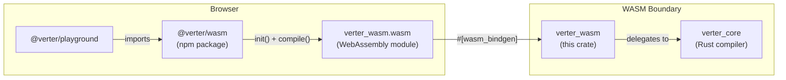
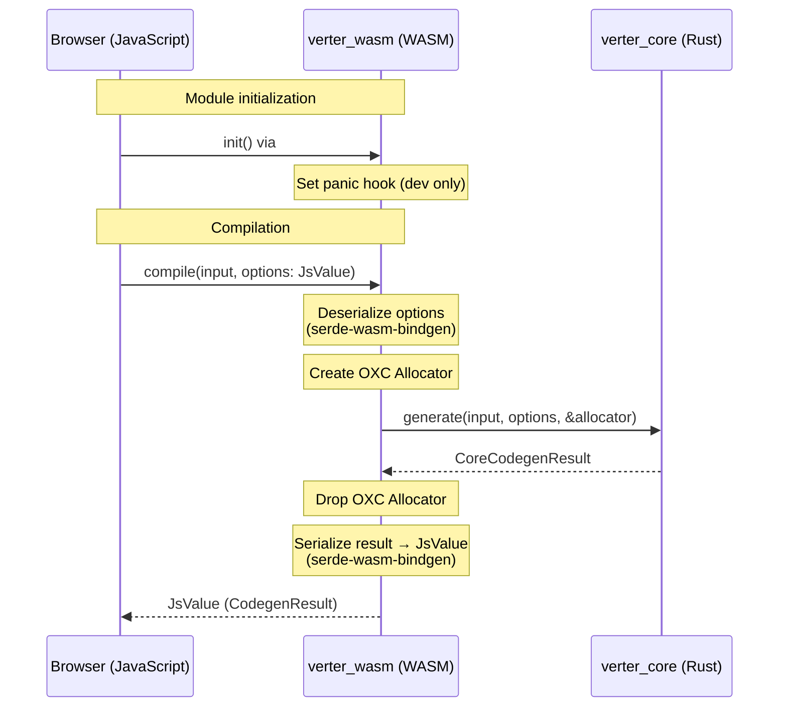

# verter_wasm

> [!WARNING]
> This project is **experimental and under active development**. APIs, architecture, and package boundaries may change without notice.

wasm-bindgen binding crate that exposes [`verter_core`](../verter_core/) for browser and WASM environments. This is a thin FFI layer that compiles to a WebAssembly module, consumed by the [`@verter/wasm`](../../packages/wasm/) npm package and used in the [Verter Playground](../../packages/playground/).

## Architecture



### WASM Boundary Design



Key design decisions:

- **serde-wasm-bindgen** -- Options are deserialized from `JsValue` and results are serialized back to `JsValue` using serde, with `#[serde(rename_all = "camelCase")]` for JavaScript-idiomatic field names.
- **OXC allocator per call** -- Same pattern as the NAPI crate: a fresh allocator is created and dropped within each `compile()` call. The allocator cannot cross the WASM boundary.
- **Panic hook** -- When the `console_error_panic_hook` feature is enabled (default), Rust panics produce readable error messages in the browser console instead of opaque "unreachable" errors.
- **`getrandom` with `wasm_js`** -- Provides a WASM-compatible random number generator source (required by dependencies like `sha2`).

## API

### `init()`

Called automatically on WASM module instantiation via `#[wasm_bindgen(start)]`. Initializes the panic hook for development debugging.

### `compile(input, options?) -> CodegenResult`

Compiles a Vue SFC string into JavaScript with source maps.

```javascript
import init, { compile } from '@verter/wasm';

await init(); // load and instantiate WASM

const result = compile(sfcSource, {
  filename: 'App.vue',
  includeSourceContent: true,
  isProduction: false,
  ssr: false,
  features: {
    optionsApi: true,
    propsDestructure: true,
  },
});

console.log(result.code);             // compiled JavaScript
console.log(result.sourceMap);         // source map JSON string
console.log(result.codeWithSourceMap); // code with inline source map
```

### `compileBytes(input, options?) -> CodegenResult`

Compiles a Vue SFC from UTF-8 bytes (Uint8Array) into JavaScript with source maps.

```javascript
import init, { compileBytes } from '@verter/wasm';

await init(); // load and instantiate WASM

const bytes = new TextEncoder().encode('<template><div>{{ msg }}</div></template>');
const result = compileBytes(bytes, { filename: 'App.vue' });
```

### Serde Types (camelCase for JavaScript)

All types use `#[serde(rename_all = "camelCase")]` for JavaScript-friendly field names:

| Type | Fields |
|---|---|
| `FeatureFlags` | `optionsApi: bool`, `propsDestructure: bool` |
| `CodegenOptions` | `filename?`, `includeSourceContent`, `ssr`, `isProduction`, `componentId?`, `features` |
| `CodegenResult` | `code`, `sourceMap`, `codeWithSourceMap` |

## Build

### Prerequisites

- Rust toolchain (stable)
- [`wasm-pack`](https://rustwasm.github.io/wasm-pack/)

### Building the WASM Module

```bash
wasm-pack build --target web --out-dir ../../packages/wasm/wasm
```

Or from the repository root:

```bash
pnpm run build:wasm
```

This produces the WASM binary and JavaScript glue code in `packages/wasm/wasm/`.

### Size Optimization

The `[profile.release]` in `Cargo.toml` is configured for small binary size:

```toml
[profile.release]
opt-level = "s"   # Optimize for size
lto = true         # Link-time optimization
```

These settings trade a small amount of runtime performance for a significantly smaller `.wasm` file, which is critical for browser loading times.

## Testing

```bash
# Rust unit tests
cargo test --package verter_wasm

# wasm-bindgen integration tests (requires wasm-pack)
wasm-pack test --headless --chrome --firefox
```

## Dependencies

| Crate | Purpose |
|---|---|
| `verter_core` | Core Rust template compiler |
| `oxc_allocator` | Memory allocator for OXC AST (created per-call) |
| `wasm-bindgen` | Rust/WASM interop bindings |
| `serde` | Serialization framework |
| `serde-wasm-bindgen` | JS `JsValue` <-> Rust struct conversion |
| `console_error_panic_hook` | Readable panic messages in browser console (optional, default on) |
| `getrandom` | WASM-compatible random number generation (`wasm_js` feature) |
| `wasm-bindgen-test` | WASM integration test harness (dev) |

## License

ISC
