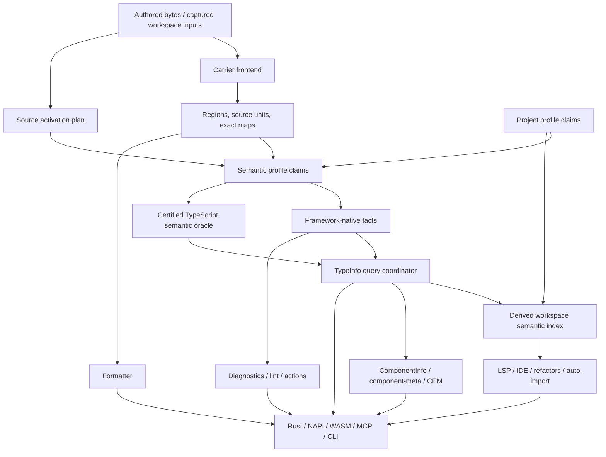
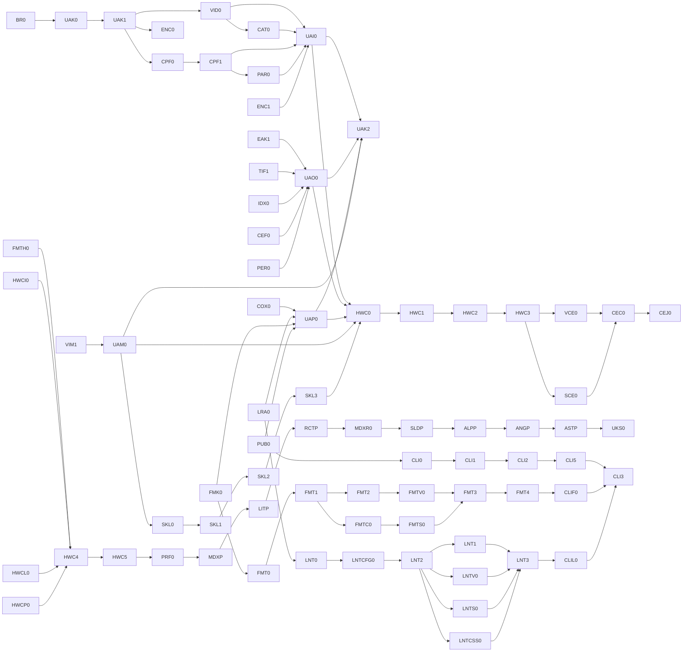

# Unified DAG contract

Root metadata, every file under `authority/dag/`, authoritative charters, catalogs, provenance maps, and activation state are static authority. `program-dag.toml` and `generated/` are outputs and are never read to decide READY. Predecessors encode correctness/authority only; resource capacity is represented by leases. Missing ordinary, conditional, external, or activation requirements refuse dispatch. The graph is one logical DAG with physically modular product/train files and no unrelated global join.

## Transferred source requirement atoms

These clauses are operative only for the exact applicability set shown. Cold packets include the exact applicable subset and its source digest.

### SRC-ORCH-L508-FC07308CAD90

- Kind: `context`
- Source: `orchestration-findings.md:508-508`
- Applicability: `BR0`, `ORC0`
- Exact text SHA-256: `fc07308cad90bf0dfba33622d33e5dc1192b7996f2fd2172c3e6b6575451359d`

~~~~markdown
# 8. D and TCM demonstrate healthier decomposition
~~~~

### SRC-ORCH-L510-7DB4CD5F6DB5

- Kind: `context`
- Source: `orchestration-findings.md:510-510`
- Applicability: `BR0`, `ORC0`
- Exact text SHA-256: `7db4cd5f6db5a10ceb8d07ea01873345c2f09d5d07cf86262c821a938a582c25`

~~~~markdown
Use existing successful structures as precedent.
~~~~

### SRC-ORCH-L512-3D8D433CAD24

- Kind: `requirement`
- Source: `orchestration-findings.md:512-512`
- Applicability: `BR0`, `ORC0`
- Exact text SHA-256: `3d8d433cad240fd81d1c36279cfb33465369d085ca65ed41757ed3bfc752baa3`

~~~~markdown
The D train recognizes that preparation can be decomposed even when the final authority switch must be atomic.
~~~~

### SRC-ORCH-L514-77ECDF562632

- Kind: `context`
- Source: `orchestration-findings.md:514-514`
- Applicability: `BR0`, `ORC0`
- Exact text SHA-256: `77ecdf562632725c41dab270ad4053d6a215cbe824a96ac152d2701d13f83ade`

~~~~markdown
Conceptually:
~~~~

### SRC-ORCH-L516-D7F9D09E571B

- Kind: `context`
- Source: `orchestration-findings.md:516-522`
- Applicability: `BR0`, `ORC0`
- Exact text SHA-256: `d7f9d09e571b58fa083f5ca2dc3850c1c8117ad45699adff97d8f57f154566b2`

~~~~markdown
```text
private foundation
       ↓
atomic public cutover
       ↓
independent follow-up work
```
~~~~

### SRC-ORCH-L524-5405AB00E579

- Kind: `context`
- Source: `orchestration-findings.md:524-524`
- Applicability: `BR0`, `ORC0`
- Exact text SHA-256: `5405ab00e5792d7e92f7a46c7a3abeed1a9a791b3d62b82e36c42670da419f5c`

~~~~markdown
TCM similarly separates:
~~~~

### SRC-ORCH-L526-D854949A43F8

- Kind: `deletion`
- Source: `orchestration-findings.md:526-532`
- Applicability: `BR0`, `ORC0`
- Exact text SHA-256: `d854949a43f8b4bccf59d5b93f1cce2174e02f3d7576f7fc4f8064119808a725`

~~~~markdown
```text
architecture lock
     ↓
independent planes
     ↓
atomic activation/deletion
```
~~~~

### SRC-ORCH-L534-9558793DC0B2

- Kind: `context`
- Source: `orchestration-findings.md:534-534`
- Applicability: `BR0`, `ORC0`
- Exact text SHA-256: `9558793dc0b29fa6b2d0d03497591858d87d231bc6746e07649d4ae627fefca9`

~~~~markdown
This is much healthier than:
~~~~

### SRC-ORCH-L536-17D0EE06C95A

- Kind: `deletion`
- Source: `orchestration-findings.md:536-539`
- Applicability: `BR0`, `ORC0`
- Exact text SHA-256: `17d0ee06c95a613b12a6c4263cd669bbf28a33c133c59652a3d5fb594c1a37a8`

~~~~markdown
```text
everything from design through migration through deletion
inside one giant block
```
~~~~

### SRC-ORCH-L541-FF360881D48F

- Kind: `context`
- Source: `orchestration-findings.md:541-541`
- Applicability: `BR0`, `ORC0`
- Exact text SHA-256: `ff360881d48f4963d51bbce06bd17d788e9856eae6314266a8562c4f34516822`

~~~~markdown
C1/J1-like future work should use the D/TCM pattern.
~~~~

### SRC-ORCH-L543-F52D711103D5

- Kind: `context`
- Source: `orchestration-findings.md:543-543`
- Applicability: `BR0`, `ORC0`
- Exact text SHA-256: `f52d711103d50a437830c6fbcd04fb4bab49a0f82f6d26d1c791c6e8488dd090`

~~~~markdown
---
~~~~

### SRC-ORCH-L662-ADFE2F96D4C6

- Kind: `context`
- Source: `orchestration-findings.md:662-662`
- Applicability: `BR0`, `ORC0`
- Exact text SHA-256: `adfe2f96d4c6a1053e8460089c5bd0f282edc0d6958e41a0958113077792b18f`

~~~~markdown
# 12. Physically modular DAG, logically one DAG
~~~~

### SRC-ORCH-L664-CEF619E2505B

- Kind: `context`
- Source: `orchestration-findings.md:664-664`
- Applicability: `BR0`, `ORC0`
- Exact text SHA-256: `cef619e2505ba567a44e19634cd093f66062334db14015758106d46359ff9a6b`

~~~~markdown
“One DAG” does not need to mean one enormous TOML file that every train edits.
~~~~

### SRC-ORCH-L666-D1842C36AEFA

- Kind: `context`
- Source: `orchestration-findings.md:666-666`
- Applicability: `BR0`, `ORC0`
- Exact text SHA-256: `d1842c36aefa54267cbb9abea52e2b94bedc02ced000f9ce60ffbf5480b3b810`

~~~~markdown
Prefer a modular physical representation if necessary:
~~~~

### SRC-ORCH-L668-A03115D24812

- Kind: `context`
- Source: `orchestration-findings.md:668-676`
- Applicability: `BR0`, `ORC0`
- Exact text SHA-256: `a03115d248126516c0232392d2cf4b93c64c1bea7f5428f9b319d3002f5c1166`

~~~~markdown
```text
dag/root.toml
dag/rev11.toml
dag/compiler.toml
dag/css.toml
dag/typeinfo.toml
dag/expansion.toml
...
```
~~~~

### SRC-ORCH-L678-4F2D7EB4976A

- Kind: `context`
- Source: `orchestration-findings.md:678-678`
- Applicability: `BR0`, `ORC0`
- Exact text SHA-256: `4f2d7eb4976af8e1ee0e5c0a82512771ac24fbdfa9a6dc42785820589ee89108`

~~~~markdown
with a deterministic validator/generator producing the canonical combined graph.
~~~~

### SRC-ORCH-L680-16EF18FC85A6

- Kind: `context`
- Source: `orchestration-findings.md:680-680`
- Applicability: `BR0`, `ORC0`
- Exact text SHA-256: `16ef18fc85a61b5630e266e6856d17bd0474de2ce61ea5a037b34bdac8f79c9c`

~~~~markdown
This reduces central-file merge conflicts while preserving one logical authority graph.
~~~~

### SRC-ORCH-L682-F52D711103D5

- Kind: `context`
- Source: `orchestration-findings.md:682-682`
- Applicability: `BR0`, `ORC0`
- Exact text SHA-256: `f52d711103d50a437830c6fbcd04fb4bab49a0f82f6d26d1c791c6e8488dd090`

~~~~markdown
---
~~~~

### SRC-ORCH-L855-E87FEB8E12BD

- Kind: `acceptance`
- Source: `orchestration-findings.md:855-855`
- Applicability: `BR0`, `ORC0`
- Exact text SHA-256: `e87feb8e12bdc70575c3220eebbba07f793448f32cd748912351f8988e249a32`

~~~~markdown
# 18. WIP commits should be cheap; acceptance identity should be strict
~~~~

### SRC-ORCH-L857-F2BA1DB6F8DA

- Kind: `context`
- Source: `orchestration-findings.md:857-857`
- Applicability: `BR0`, `ORC0`
- Exact text SHA-256: `f2ba1db6f8da39e18448959f41d346eef8c1b2c2dab97fc23f7da1561d4d5172`

~~~~markdown
During implementation:
~~~~

### SRC-ORCH-L859-DE652841CD6D

- Kind: `context`
- Source: `orchestration-findings.md:859-866`
- Applicability: `BR0`, `ORC0`
- Exact text SHA-256: `de652841cd6db0056f08a46e77f70ad4846e203d63edd864b01f88768e31d726`

~~~~markdown
```text
commit
rebase
fix
rebase
review locally
continue
```
~~~~

### SRC-ORCH-L868-1EC3067670CA

- Kind: `context`
- Source: `orchestration-findings.md:868-868`
- Applicability: `BR0`, `ORC0`
- Exact text SHA-256: `1ec3067670ca1c0386e9903279e6b500b539ba78e0898d9a3b3e1b5764968e19`

~~~~markdown
should be normal.
~~~~

### SRC-ORCH-L870-D16209AA2DD5

- Kind: `context`
- Source: `orchestration-findings.md:870-870`
- Applicability: `BR0`, `ORC0`
- Exact text SHA-256: `d16209aa2dd50e5072b6b5b5dcbad854999a1b73f363be98d50890064762e1e2`

~~~~markdown
Do not incur expensive authority/ledger churn for every WIP identity change.
~~~~

### SRC-ORCH-L872-121322340A4D

- Kind: `context`
- Source: `orchestration-findings.md:872-872`
- Applicability: `BR0`, `ORC0`
- Exact text SHA-256: `121322340a4d5508e806dd3f4bb129a0a57664fb6b129fb7967ac2a3acd61a8e`

~~~~markdown
At:
~~~~

### SRC-ORCH-L874-B7F66573743C

- Kind: `acceptance`
- Source: `orchestration-findings.md:874-877`
- Applicability: `BR0`, `ORC0`
- Exact text SHA-256: `b7f66573743cbde4229166f3f05afb698ad41360feb11e50fcba1994fb04ae8a`

~~~~markdown
```text
READY FOR ACCEPTANCE
candidate = exact SHA
```
~~~~

### SRC-ORCH-L879-A1E37A19EAEA

- Kind: `context`
- Source: `orchestration-findings.md:879-879`
- Applicability: `BR0`, `ORC0`
- Exact text SHA-256: `a1e37a19eaeab4d127d5ad5b262ed90b16f547ae717f14fe988618b4d5e5baff`

~~~~markdown
freeze the candidate.
~~~~

### SRC-ORCH-L881-89B73682B2BE

- Kind: `context`
- Source: `orchestration-findings.md:881-881`
- Applicability: `BR0`, `ORC0`
- Exact text SHA-256: `89b73682b2be8a96f972c84a2d41ffe26a87b92c969dc59c77ede4de883e34fa`

~~~~markdown
From that point:
~~~~

### SRC-ORCH-L883-DB1F6B54C036

- Kind: `context`
- Source: `orchestration-findings.md:883-883`
- Applicability: `BR0`, `ORC0`
- Exact text SHA-256: `db1f6b54c0363912cc74fd3648a0c72d55cb448177583f0ec102a41a8b705a9f`

~~~~markdown
- reviewers review exactly that candidate;
~~~~

### SRC-ORCH-L884-DCA4B2EF1652

- Kind: `context`
- Source: `orchestration-findings.md:884-884`
- Applicability: `BR0`, `ORC0`
- Exact text SHA-256: `dca4b2ef165218b1fb0d125cd1ae470906b4a33f97b41b6165e431134da9f5e8`

~~~~markdown
- modifications invalidate relevant verdicts;
~~~~

### SRC-ORCH-L885-17FAB4B89AEE

- Kind: `context`
- Source: `orchestration-findings.md:885-885`
- Applicability: `BR0`, `ORC0`
- Exact text SHA-256: `17fab4b89aee74186cb485dcdc69b59af7a49aebee45d1bd5dffc4de8f679119`

~~~~markdown
- do not rebase the frozen candidate;
~~~~

### SRC-ORCH-L886-4CCBF62F12B9

- Kind: `requirement`
- Source: `orchestration-findings.md:886-886`
- Applicability: `BR0`, `ORC0`
- Exact text SHA-256: `4ccbf62f12b9ecc910f5de88b3dd07596a8645a112ba14b9af94b3a6dc7b2f81`

~~~~markdown
- if changes are required, generate a new candidate and re-review affected evidence.
~~~~

### SRC-ORCH-L888-2554BA36FA16

- Kind: `requirement`
- Source: `orchestration-findings.md:888-888`
- Applicability: `BR0`, `ORC0`
- Exact text SHA-256: `2554ba36fa1677d1f151afc50940c0a09b869fec05b03876447472851657283c`

~~~~markdown
This preserves strong exact-candidate guarantees without making ordinary development prohibitively expensive.
~~~~

### SRC-ORCH-L890-F52D711103D5

- Kind: `context`
- Source: `orchestration-findings.md:890-890`
- Applicability: `BR0`, `ORC0`
- Exact text SHA-256: `f52d711103d50a437830c6fbcd04fb4bab49a0f82f6d26d1c791c6e8488dd090`

~~~~markdown
---
~~~~

### SRC-ORCH-L1049-0A0B683CE399

- Kind: `context`
- Source: `orchestration-findings.md:1049-1049`
- Applicability: `BR0`, `ORC0`
- Exact text SHA-256: `0a0b683ce3997ec4ba44a74f702f764e3e77a456c84c5f71873bf5486cfd4eef`

~~~~markdown
# 24. Charters should lock architecture, not become mini implementations
~~~~

### SRC-ORCH-L1051-F5A6311F194A

- Kind: `context`
- Source: `orchestration-findings.md:1051-1051`
- Applicability: `BR0`, `ORC0`
- Exact text SHA-256: `f5a6311f194a5e81677f80a02698a5a6c7bcb950934dcb7fac319f77a59722d7`

~~~~markdown
J1's eleven ratification rounds show another failure mode: the document itself can consume too much of the project.
~~~~

### SRC-ORCH-L1053-772C5AEEF855

- Kind: `context`
- Source: `orchestration-findings.md:1053-1053`
- Applicability: `BR0`, `ORC0`
- Exact text SHA-256: `772c5aeef855b4026323679102a3dbcd2164c3861dd1a2b9dce74b0b4cca7cfa`

~~~~markdown
Charters need enough specificity to distinguish:
~~~~

### SRC-ORCH-L1055-FFA99B61DA32

- Kind: `context`
- Source: `orchestration-findings.md:1055-1055`
- Applicability: `BR0`, `ORC0`
- Exact text SHA-256: `ffa99b61da329857e839c97ba6cb4dc03b4c5851d52b942ef47ea3ddc0b95dda`

~~~~markdown
- correct implementation;
~~~~

### SRC-ORCH-L1056-780A688C30B3

- Kind: `forbidden`
- Source: `orchestration-findings.md:1056-1056`
- Applicability: `BR0`, `ORC0`
- Exact text SHA-256: `780a688c30b389ef00a889089eae9b33330e05a7abddc1e295a2ebdb29a3a316`

~~~~markdown
- forbidden fallback;
~~~~

### SRC-ORCH-L1057-0D7F67B0C23B

- Kind: `context`
- Source: `orchestration-findings.md:1057-1057`
- Applicability: `BR0`, `ORC0`
- Exact text SHA-256: `0d7f67b0c23bca6c22090718e7e7ab6ff16dd81f24f41b188f00a1b0b2187b5d`

~~~~markdown
- authority ownership;
~~~~

### SRC-ORCH-L1058-5795257403E1

- Kind: `acceptance`
- Source: `orchestration-findings.md:1058-1058`
- Applicability: `BR0`, `ORC0`
- Exact text SHA-256: `5795257403e1caaf354a726480458eac9819caf4059115913fc1aeaa9802dc72`

~~~~markdown
- acceptance criteria;
~~~~

### SRC-ORCH-L1059-40CA494E7700

- Kind: `deletion`
- Source: `orchestration-findings.md:1059-1059`
- Applicability: `BR0`, `ORC0`
- Exact text SHA-256: `40ca494e77003f70fc576e9abdd6d5c2435a2b3d5adfd862282dba48a30efea1`

~~~~markdown
- deletion responsibility;
~~~~

### SRC-ORCH-L1060-20FDB8CA6E4E

- Kind: `context`
- Source: `orchestration-findings.md:1060-1060`
- Applicability: `BR0`, `ORC0`
- Exact text SHA-256: `20fdb8ca6e4ee75aa0089da2c6428658ab00370fb31de2629d688acdfb50b6f1`

~~~~markdown
- abort/rescope conditions.
~~~~

### SRC-ORCH-L1062-7D09F5019DE7

- Kind: `context`
- Source: `orchestration-findings.md:1062-1062`
- Applicability: `BR0`, `ORC0`
- Exact text SHA-256: `7d09f5019de74fdf594695f0efeada012a951f1ba5539949d11061cc41b35c9e`

~~~~markdown
But they should avoid duplicated prose and redundant restatement of the same facts.
~~~~

### SRC-ORCH-L1064-1B416303FAD7

- Kind: `context`
- Source: `orchestration-findings.md:1064-1064`
- Applicability: `BR0`, `ORC0`
- Exact text SHA-256: `1b416303fad7d58e03241ebd777bfb47bbc7dbf813c23456eb8534fe9889e7f2`

~~~~markdown
Prefer one machine-readable/source-of-truth inventory with generated views rather than multiple sections manually restating the same classifications.
~~~~

### SRC-ORCH-L1066-F52D711103D5

- Kind: `context`
- Source: `orchestration-findings.md:1066-1066`
- Applicability: `BR0`, `ORC0`
- Exact text SHA-256: `f52d711103d50a437830c6fbcd04fb4bab49a0f82f6d26d1c791c6e8488dd090`

~~~~markdown
---
~~~~

### SRC-ORCH-L1068-7925BFBE1593

- Kind: `requirement`
- Source: `orchestration-findings.md:1068-1068`
- Applicability: `BR0`, `ORC0`
- Exact text SHA-256: `7925bfbe1593079922a9e2a657eda48ebcbfa90bd167773a972b7eb758817823`

~~~~markdown
# 25. Tests must discriminate the architecture, not merely produce green output
~~~~

### SRC-ORCH-L1070-9257AD3AEE36

- Kind: `context`
- Source: `orchestration-findings.md:1070-1070`
- Applicability: `BR0`, `ORC0`
- Exact text SHA-256: `9257ad3aee3606f194077d4943ddc316260d4ea8a47908176f58cd0f210c1fd2`

~~~~markdown
One lesson from J1 is especially important.
~~~~

### SRC-ORCH-L1072-73C9F91DAFD2

- Kind: `acceptance`
- Source: `orchestration-findings.md:1072-1072`
- Applicability: `BR0`, `ORC0`
- Exact text SHA-256: `73c9f91dafd2e50aa906f40c25f5d3c3a79a451e643a45ef6c9030d4a993c382`

~~~~markdown
Bad acceptance test:
~~~~

### SRC-ORCH-L1074-7A567FC5BC55

- Kind: `context`
- Source: `orchestration-findings.md:1074-1076`
- Applicability: `BR0`, `ORC0`
- Exact text SHA-256: `7a567fc5bc558b21a9b590a40b8e16e91b568f159d5f404d3594b89a66952c89`

~~~~markdown
```text
canonical parser was called
```
~~~~

### SRC-ORCH-L1078-3B6B4EE216B0

- Kind: `context`
- Source: `orchestration-findings.md:1078-1078`
- Applicability: `BR0`, `ORC0`
- Exact text SHA-256: `3b6b4ee216b0e86b7bd6859bc4c68bfbd639d7473d0d4d04a760f1fa7648beb4`

~~~~markdown
because this still passes:
~~~~

### SRC-ORCH-L1080-9A84CDF8BFD0

- Kind: `context`
- Source: `orchestration-findings.md:1080-1084`
- Applicability: `BR0`, `ORC0`
- Exact text SHA-256: `9a84cdf8bfd001d2daf03ee5df4dfd5d8550c69232d78d965800dea2168c7a3d`

~~~~markdown
```text
canonical parser called
result ignored
private scanner produces output
```
~~~~

### SRC-ORCH-L1086-BCEC41FE2041

- Kind: `context`
- Source: `orchestration-findings.md:1086-1086`
- Applicability: `BR0`, `ORC0`
- Exact text SHA-256: `bcec41fe2041c4b83843e62219dc1a0eeab1ffc081edd3ae319629dd2da8bdba`

~~~~markdown
Good test/structural gate:
~~~~

### SRC-ORCH-L1088-AC1C6CB10E39

- Kind: `context`
- Source: `orchestration-findings.md:1088-1092`
- Applicability: `BR0`, `ORC0`
- Exact text SHA-256: `ac1c6cb10e3941534a292f68438d052d8d411a9ac15391e35e15eb9745e1faf5`

~~~~markdown
```text
canonical parser called exactly as expected
AND output derives from returned representation
AND alternate scanning implementation is structurally absent
```
~~~~

### SRC-ORCH-L1094-A1C31905727D

- Kind: `context`
- Source: `orchestration-findings.md:1094-1094`
- Applicability: `BR0`, `ORC0`
- Exact text SHA-256: `a1c31905727d3f2567cb508327a465bfa22db9f066288be9351f5c132b23bb66`

~~~~markdown
The same applies throughout Rev11.
~~~~

### SRC-ORCH-L1096-4505D65E2522

- Kind: `context`
- Source: `orchestration-findings.md:1096-1096`
- Applicability: `BR0`, `ORC0`
- Exact text SHA-256: `4505d65e2522855da7bd4d9678c5ccf83cf66c8ea690fb238dc269dc449a6cb7`

~~~~markdown
Tests should answer:
~~~~

### SRC-ORCH-L1098-2E5B157486BE

- Kind: `forbidden`
- Source: `orchestration-findings.md:1098-1098`
- Applicability: `BR0`, `ORC0`
- Exact text SHA-256: `2e5b157486be38917fc7db6438af9c0c8eedcf88b3bc1d4928f624d1c747fa3e`

~~~~markdown
> Would the forbidden architecture also pass this test?
~~~~

### SRC-ORCH-L1100-526CE88B97D5

- Kind: `acceptance`
- Source: `orchestration-findings.md:1100-1100`
- Applicability: `BR0`, `ORC0`
- Exact text SHA-256: `526ce88b97d59b71b35b93f28618e23aa059b34f5f3675c9f6aba494e33449a7`

~~~~markdown
If yes, the test is not an architectural acceptance proof.
~~~~

### SRC-ORCH-L1102-F52D711103D5

- Kind: `context`
- Source: `orchestration-findings.md:1102-1102`
- Applicability: `BR0`, `ORC0`
- Exact text SHA-256: `f52d711103d50a437830c6fbcd04fb4bab49a0f82f6d26d1c791c6e8488dd090`

~~~~markdown
---
~~~~

### SRC-ORCH-L1104-F1F847B57792

- Kind: `context`
- Source: `orchestration-findings.md:1104-1104`
- Applicability: `BR0`, `ORC0`
- Exact text SHA-256: `f1f847b57792f88d0ca0ea58ff921b069b46cb51b651f568172f7636aeafdada`

~~~~markdown
# 26. RED/GREEN testing remains valuable, but should be used selectively
~~~~

### SRC-ORCH-L1106-37027DE1CCFB

- Kind: `context`
- Source: `orchestration-findings.md:1106-1106`
- Applicability: `BR0`, `ORC0`
- Exact text SHA-256: `37027de1ccfbe748b5b566e46b11fd508af7c8b8d360da6f5befd848dc5c3ef9`

~~~~markdown
Keep RED/GREEN where it proves the test genuinely detects the intended failure.
~~~~

### SRC-ORCH-L1108-7E55406DB22A

- Kind: `context`
- Source: `orchestration-findings.md:1108-1108`
- Applicability: `BR0`, `ORC0`
- Exact text SHA-256: `7e55406db22af290ec746180c1ec7dd53f9c68900b9986135b6a75bc7c4b5673`

~~~~markdown
It is particularly useful for:
~~~~

### SRC-ORCH-L1110-F717A6D82DB8

- Kind: `context`
- Source: `orchestration-findings.md:1110-1110`
- Applicability: `BR0`, `ORC0`
- Exact text SHA-256: `f717a6d82db84904896664545e18ed266b9e98d974d36c941959cb91cf3ec50c`

~~~~markdown
- architecture guards;
~~~~

### SRC-ORCH-L1111-6D957574EC4C

- Kind: `context`
- Source: `orchestration-findings.md:1111-1111`
- Applicability: `BR0`, `ORC0`
- Exact text SHA-256: `6d957574ec4cdf0ebebd9c020b3fb467ad7aeef64bb96b26f3e22b0a2b89f393`

~~~~markdown
- regression fixes;
~~~~

### SRC-ORCH-L1112-5D45E177A03D

- Kind: `context`
- Source: `orchestration-findings.md:1112-1112`
- Applicability: `BR0`, `ORC0`
- Exact text SHA-256: `5d45e177a03d1312dd146f86c975e7b83e7b52ad393acfa61c53e08e8b37d350`

~~~~markdown
- negative capability tests;
~~~~

### SRC-ORCH-L1113-B68236F093FA

- Kind: `context`
- Source: `orchestration-findings.md:1113-1113`
- Applicability: `BR0`, `ORC0`
- Exact text SHA-256: `b68236f093fab2bf134e96d56e55884a247a63605e19d09f538d67bbe65ca726`

~~~~markdown
- stale-publication tests;
~~~~

### SRC-ORCH-L1114-36401EBBEFD3

- Kind: `context`
- Source: `orchestration-findings.md:1114-1114`
- Applicability: `BR0`, `ORC0`
- Exact text SHA-256: `36401ebbefd3509d9872ba2018d5fe5d5ebbdc01fb53f8954b4ff30533a70f27`

~~~~markdown
- authority uniqueness;
~~~~

### SRC-ORCH-L1115-C0A774470534

- Kind: `context`
- Source: `orchestration-findings.md:1115-1115`
- Applicability: `BR0`, `ORC0`
- Exact text SHA-256: `c0a7744705345a7e681c2caecb647b9713d96aa3d8b6568f93cc2462b921b3c0`

~~~~markdown
- dependency-firewall compile failures;
~~~~

### SRC-ORCH-L1116-3D56827FE81A

- Kind: `context`
- Source: `orchestration-findings.md:1116-1116`
- Applicability: `BR0`, `ORC0`
- Exact text SHA-256: `3d56827fe81adce42d4620e2412ee4d59f13ffba540448bd37044f107e5c4c19`

~~~~markdown
- deterministic failure cases.
~~~~

### SRC-ORCH-L1118-17846636ED26

- Kind: `context`
- Source: `orchestration-findings.md:1118-1118`
- Applicability: `BR0`, `ORC0`
- Exact text SHA-256: `17846636ed26e7929c7d51161415400650b735f65375a6e28cc13041fbc813e2`

~~~~markdown
Do not blindly require RED/GREEN for:
~~~~

### SRC-ORCH-L1120-FBF54B70FAED

- Kind: `context`
- Source: `orchestration-findings.md:1120-1120`
- Applicability: `BR0`, `ORC0`
- Exact text SHA-256: `fbf54b70faed9c0674be38783605344434939dd8f3fb11ac6b81579a684fe704`

~~~~markdown
- pure documentation;
~~~~

### SRC-ORCH-L1121-F59B8940DA28

- Kind: `context`
- Source: `orchestration-findings.md:1121-1121`
- Applicability: `BR0`, `ORC0`
- Exact text SHA-256: `f59b8940da286f22de4f41350ad71fb74b73bbd41b3c25b14b2a92f4a5998ecd`

~~~~markdown
- trivial generated tables;
~~~~

### SRC-ORCH-L1122-7FE94065DF65

- Kind: `context`
- Source: `orchestration-findings.md:1122-1122`
- Applicability: `BR0`, `ORC0`
- Exact text SHA-256: `7fe94065df65924278b45c4947c0e32f69b9ae2800453e0d34a1d1712eb2b067`

~~~~markdown
- mechanical formatting;
~~~~

### SRC-ORCH-L1123-6BDFB06F907B

- Kind: `context`
- Source: `orchestration-findings.md:1123-1123`
- Applicability: `BR0`, `ORC0`
- Exact text SHA-256: `6bdfb06f907b0f70b2426a2a3b07cfe64b4c177a72023161a42c7b5c67933997`

~~~~markdown
- tests where a meaningful planted failure cannot be constructed.
~~~~

### SRC-ORCH-L1125-78712DE7F327

- Kind: `context`
- Source: `orchestration-findings.md:1125-1125`
- Applicability: `BR0`, `ORC0`
- Exact text SHA-256: `78712de7f327eaba80c4b6a8113d8f9a1c3935e92ea5bdf3fb1d91daebf055ba`

~~~~markdown
The rule should be evidence-driven rather than ritualistic.
~~~~

### SRC-ORCH-L1127-F52D711103D5

- Kind: `context`
- Source: `orchestration-findings.md:1127-1127`
- Applicability: `BR0`, `ORC0`
- Exact text SHA-256: `f52d711103d50a437830c6fbcd04fb4bab49a0f82f6d26d1c791c6e8488dd090`

~~~~markdown
---
~~~~

### SRC-ORCH-L1135-EACDFE7C149A

- Kind: `context`
- Source: `orchestration-findings.md:1135-1135`
- Applicability: `BR0`, `ORC0`
- Exact text SHA-256: `eacdfe7c149a55be9f8d5629d85535512b86df77484ce3f1b823d493e23d8e06`

~~~~markdown
### Highest reasoning tier
~~~~

### SRC-ORCH-L1137-561DC854FF97

- Kind: `context`
- Source: `orchestration-findings.md:1137-1137`
- Applicability: `BR0`, `ORC0`
- Exact text SHA-256: `561dc854ff974759e735052e9d54743e3a2b3b270cfe061205b0bddab00741f6`

~~~~markdown
Use GPT-5.6 PRO/Ultra-class architecture reasoning for:
~~~~

### SRC-ORCH-L1139-A1022299C840

- Kind: `context`
- Source: `orchestration-findings.md:1139-1139`
- Applicability: `BR0`, `ORC0`
- Exact text SHA-256: `a1022299c840de85abfe81f3657f76b6b7953b9c490cbbd9df8d70f1ba8f064a`

~~~~markdown
- block/train prescoping;
~~~~

### SRC-ORCH-L1140-4FD49F1820FE

- Kind: `context`
- Source: `orchestration-findings.md:1140-1140`
- Applicability: `BR0`, `ORC0`
- Exact text SHA-256: `4fd49f1820feac27a0da5b60f02d171f53872e9e06c9bffd852eccf923dd2573`

~~~~markdown
- architecture locks;
~~~~

### SRC-ORCH-L1141-BBBC309B104C

- Kind: `context`
- Source: `orchestration-findings.md:1141-1141`
- Applicability: `BR0`, `ORC0`
- Exact text SHA-256: `bbbc309b104c15d87be6c424788cff807a941e602e05a25676195faf6ed531a8`

~~~~markdown
- hidden-train detection;
~~~~

### SRC-ORCH-L1142-D456E412BC34

- Kind: `context`
- Source: `orchestration-findings.md:1142-1142`
- Applicability: `BR0`, `ORC0`
- Exact text SHA-256: `d456e412bc34d22d9f9290d3269f5777f600e08c8f690dc14a25e9764704f82e`

~~~~markdown
- ownership changes;
~~~~

### SRC-ORCH-L1143-FB0786A32050

- Kind: `context`
- Source: `orchestration-findings.md:1143-1143`
- Applicability: `BR0`, `ORC0`
- Exact text SHA-256: `fb0786a32050b69ca0a5c9981b3bf1b54398f4dd98516d272397d8759ff58a89`

~~~~markdown
- cross-crate dependency moves;
~~~~

### SRC-ORCH-L1144-1CBC921E6D78

- Kind: `context`
- Source: `orchestration-findings.md:1144-1144`
- Applicability: `BR0`, `ORC0`
- Exact text SHA-256: `1cbc921e6d7890bcffdfb3e01af2f606ca7230521be2fe22ac6398f78c78355f`

~~~~markdown
- semantic authority changes;
~~~~

### SRC-ORCH-L1145-BAA5996CEB83

- Kind: `context`
- Source: `orchestration-findings.md:1145-1145`
- Applicability: `BR0`, `ORC0`
- Exact text SHA-256: `baa5996ceb83163d12d0008c005f448c004db8e5a870d7eb20c629c5dfb93ab8`

~~~~markdown
- concurrency/lifecycle design;
~~~~

### SRC-ORCH-L1146-AE2CDB43F06A

- Kind: `context`
- Source: `orchestration-findings.md:1146-1146`
- Applicability: `BR0`, `ORC0`
- Exact text SHA-256: `ae2cdb43f06a4f186270b4d485ad81c8e250b48f4395a74e565bd15c6c4d09a4`

~~~~markdown
- atomic cutovers;
~~~~

### SRC-ORCH-L1147-F01A127AAF17

- Kind: `deletion`
- Source: `orchestration-findings.md:1147-1147`
- Applicability: `BR0`, `ORC0`
- Exact text SHA-256: `f01a127aaf17bc03630a873c8c8e2c2797a4a2927754db212289d599731d6bcc`

~~~~markdown
- large deletion closures;
~~~~

### SRC-ORCH-L1148-FC9B35427C05

- Kind: `context`
- Source: `orchestration-findings.md:1148-1148`
- Applicability: `BR0`, `ORC0`
- Exact text SHA-256: `fc9b35427c0542906933b09d8359dfd2e93839141ecfb33e333a61757500f90c`

~~~~markdown
- amendment impact analysis;
~~~~

### SRC-ORCH-L1149-811DF4105B0D

- Kind: `context`
- Source: `orchestration-findings.md:1149-1149`
- Applicability: `BR0`, `ORC0`
- Exact text SHA-256: `811df4105b0dd9f5c46ddc89bcdfd2b06e5ab03ef930cbb5e623b36b54c8c358`

~~~~markdown
- final architecture review of foundational blocks.
~~~~

### SRC-ORCH-L1151-7C2E4F6EA753

- Kind: `context`
- Source: `orchestration-findings.md:1151-1151`
- Applicability: `BR0`, `ORC0`
- Exact text SHA-256: `7c2e4f6ea753338f57f33ec71a6541ac6d5b987eb0576e46a1bd6015d3e1492a`

~~~~markdown
### Strong implementation models
~~~~

### SRC-ORCH-L1153-465331E9AFF3

- Kind: `context`
- Source: `orchestration-findings.md:1153-1153`
- Applicability: `BR0`, `ORC0`
- Exact text SHA-256: `465331e9aff32ef7cd6e7ed855768b4440456dc5097d2cdc5c58bce05d22c564`

~~~~markdown
Use strong implementers for:
~~~~

### SRC-ORCH-L1155-6C225551A626

- Kind: `context`
- Source: `orchestration-findings.md:1155-1155`
- Applicability: `BR0`, `ORC0`
- Exact text SHA-256: `6c225551a626f16c88a7ca1c9e1b9bede59cef68c9313d8985657edcd087d33a`

~~~~markdown
- C1/J1/H2/H3-type foundational migrations;
~~~~

### SRC-ORCH-L1156-9F85C985B470

- Kind: `context`
- Source: `orchestration-findings.md:1156-1156`
- Applicability: `BR0`, `ORC0`
- Exact text SHA-256: `9f85c985b470b8336bca0beed0d663d670036b16527c58592557c57927555259`

~~~~markdown
- concurrency/state machinery;
~~~~

### SRC-ORCH-L1157-06184C43F508

- Kind: `context`
- Source: `orchestration-findings.md:1157-1157`
- Applicability: `BR0`, `ORC0`
- Exact text SHA-256: `06184c43f5089f158507df3498138f556e0477002e763f61a8ad7bcf9dd7d7ed`

~~~~markdown
- semantic/resolver changes;
~~~~

### SRC-ORCH-L1158-1E6BC44AF53D

- Kind: `context`
- Source: `orchestration-findings.md:1158-1158`
- Applicability: `BR0`, `ORC0`
- Exact text SHA-256: `1e6bc44af53d93b123974d2d09df0da1b888c7bc065a7a56fcc36297a4eb9760`

~~~~markdown
- high-performance parser/compiler internals;
~~~~

### SRC-ORCH-L1159-F7251A823D6C

- Kind: `context`
- Source: `orchestration-findings.md:1159-1159`
- Applicability: `BR0`, `ORC0`
- Exact text SHA-256: `f7251a823d6cd2728ba163a8a98cb9931eb1689321eb162a6a8b614e8bb78f72`

~~~~markdown
- broad migration terminals.
~~~~

### SRC-ORCH-L1161-BB996479BEA9

- Kind: `context`
- Source: `orchestration-findings.md:1161-1161`
- Applicability: `BR0`, `ORC0`
- Exact text SHA-256: `bb996479bea94ee4d5bfaed18135833cccd38053076b9c1b28ff58f1fde5f1ff`

~~~~markdown
### Medium/cheaper models
~~~~

### SRC-ORCH-L1163-3DCE63BE7B60

- Kind: `context`
- Source: `orchestration-findings.md:1163-1163`
- Applicability: `BR0`, `ORC0`
- Exact text SHA-256: `3dce63be7b60a5f58cf3034a4f7f087342fea80f83ed942f7433f52fc60762d2`

~~~~markdown
These can handle well-specified:
~~~~

### SRC-ORCH-L1165-CE91E83BB71E

- Kind: `context`
- Source: `orchestration-findings.md:1165-1165`
- Applicability: `BR0`, `ORC0`
- Exact text SHA-256: `ce91e83bb71e7fdafb50b721aec4a24951b3da06f7127891771e1c8fbe4d94f9`

~~~~markdown
- mechanical consumer migrations;
~~~~

### SRC-ORCH-L1166-122A1BE076F2

- Kind: `context`
- Source: `orchestration-findings.md:1166-1166`
- Applicability: `BR0`, `ORC0`
- Exact text SHA-256: `122a1be076f23036739dd7df0227bccf6d1b98bcc679839d8ab21140cf80d1c0`

~~~~markdown
- repetitive API call-site changes;
~~~~

### SRC-ORCH-L1167-06E48EB019DB

- Kind: `requirement`
- Source: `orchestration-findings.md:1167-1167`
- Applicability: `BR0`, `ORC0`
- Exact text SHA-256: `06e48eb019dba5f4f7e1b5e630b349dcb9cb57c10d83c56a739606f7f7676319`

~~~~markdown
- generated bindings;
~~~~

### SRC-ORCH-L1168-EE3223E04542

- Kind: `context`
- Source: `orchestration-findings.md:1168-1168`
- Applicability: `BR0`, `ORC0`
- Exact text SHA-256: `ee3223e04542d379d64cb614b4f30e924d81bf5db4ccda66141a0142a67199ac`

~~~~markdown
- deterministic fixture additions;
~~~~

### SRC-ORCH-L1169-369BC9D25DBA

- Kind: `context`
- Source: `orchestration-findings.md:1169-1169`
- Applicability: `BR0`, `ORC0`
- Exact text SHA-256: `369bc9d25dba012f1d702486eadb4b776f22828b8df579fe54efa36cc5ef2334`

~~~~markdown
- isolated cleanup;
~~~~

### SRC-ORCH-L1170-C1C73B3CDD31

- Kind: `context`
- Source: `orchestration-findings.md:1170-1170`
- Applicability: `BR0`, `ORC0`
- Exact text SHA-256: `c1c73b3cdd31bfa3ae66e10f18f4b6199c3ae6fe47508647f3c299eef7bc0573`

~~~~markdown
- documentation synchronization;
~~~~

### SRC-ORCH-L1171-8E72758C72E1

- Kind: `context`
- Source: `orchestration-findings.md:1171-1171`
- Applicability: `BR0`, `ORC0`
- Exact text SHA-256: `8e72758c72e1849ba76f5c28072e7025594f6295a7757c6069cbd19bd590dbe0`

~~~~markdown
- narrow RED/GREEN adversarial checks.
~~~~

### SRC-ORCH-L1173-709FCE45D029

- Kind: `requirement`
- Source: `orchestration-findings.md:1173-1173`
- Applicability: `BR0`, `ORC0`
- Exact text SHA-256: `709fce45d029fd88321b956eee90b4aa182c21e1be93b59e300901f4c1529f92`

~~~~markdown
The prerequisite is that the architecture and exact mutation boundary are already locked.
~~~~

### SRC-ORCH-L1175-331AEF74BC7E

- Kind: `context`
- Source: `orchestration-findings.md:1175-1175`
- Applicability: `BR0`, `ORC0`
- Exact text SHA-256: `331aef74bc7ee87a03d408649585c5e414c017d76bdaa2a3c5d2ef1c422af286`

~~~~markdown
Cheap models should not be expected to discover the architecture while implementing it.
~~~~

### SRC-ORCH-L1177-F52D711103D5

- Kind: `context`
- Source: `orchestration-findings.md:1177-1177`
- Applicability: `BR0`, `ORC0`
- Exact text SHA-256: `f52d711103d50a437830c6fbcd04fb4bab49a0f82f6d26d1c791c6e8488dd090`

~~~~markdown
---
~~~~

### SRC-ORCH-L1308-8FCF1C55DDB2

- Kind: `context`
- Source: `orchestration-findings.md:1308-1308`
- Applicability: `BR0`, `ORC0`
- Exact text SHA-256: `8fcf1c55ddb2d6369385cb0f508be0f3252d2561b10f4f9d585ef7df0815c93d`

~~~~markdown
# 32. Accepted history should be immutable; corrections should be new facts
~~~~

### SRC-ORCH-L1310-BEF5CA1DE771

- Kind: `deletion`
- Source: `orchestration-findings.md:1310-1310`
- Applicability: `BR0`, `ORC0`
- Exact text SHA-256: `bef5ca1de7717898357d398094cb0023d96063e215b65cb28ca1272186275a66`

~~~~markdown
If an accepted block later needs to be reverted or superseded:
~~~~

### SRC-ORCH-L1312-EEC570C12F01

- Kind: `context`
- Source: `orchestration-findings.md:1312-1312`
- Applicability: `BR0`, `ORC0`
- Exact text SHA-256: `eec570c12f018bb8b1d52e8d3b400ca1a4ef50a4dead08caafa8d40ed3b65a9f`

~~~~markdown
Do not rewrite its historical receipt.
~~~~

### SRC-ORCH-L1314-466309A1217B

- Kind: `context`
- Source: `orchestration-findings.md:1314-1314`
- Applicability: `BR0`, `ORC0`
- Exact text SHA-256: `466309a1217bbc9074255e0856763e9dc3202fa0310086b030e985ec136bf7eb`

~~~~markdown
Create:
~~~~

### SRC-ORCH-L1316-5C3860DFC0CB

- Kind: `deletion`
- Source: `orchestration-findings.md:1316-1320`
- Applicability: `BR0`, `ORC0`
- Exact text SHA-256: `5c3860dfc0cb4d51a79ee30c0402a4e2d9097242624a68dc93160033315d1c9d`

~~~~markdown
```text
accepted receipt A
        ↓
superseding/revert receipt B
```
~~~~

### SRC-ORCH-L1322-3C2FE29970D1

- Kind: `context`
- Source: `orchestration-findings.md:1322-1322`
- Applicability: `BR0`, `ORC0`
- Exact text SHA-256: `3c2fe29970d134ccd01604d3dd01d5a445d19840404e17642933783f71c1f22b`

~~~~markdown
History remains auditable.
~~~~

### SRC-ORCH-L1324-34EBDAEC664C

- Kind: `requirement`
- Source: `orchestration-findings.md:1324-1324`
- Applicability: `BR0`, `ORC0`
- Exact text SHA-256: `34ebdaec664c9f94840c60e280dd8e1635d044991f061ef1a1eee53428e10144`

~~~~markdown
Likewise, later charter/DAG changes do not retroactively redefine what an earlier block accepted because the receipt binds its exact `control_basis`.
~~~~

### SRC-ORCH-L1326-F52D711103D5

- Kind: `context`
- Source: `orchestration-findings.md:1326-1326`
- Applicability: `BR0`, `ORC0`
- Exact text SHA-256: `f52d711103d50a437830c6fbcd04fb4bab49a0f82f6d26d1c791c6e8488dd090`

~~~~markdown
---
~~~~

### SRC-ORCH-L1385-8D1252B93F61

- Kind: `context`
- Source: `orchestration-findings.md:1385-1385`
- Applicability: `BR0`, `ORC0`
- Exact text SHA-256: `8d1252b93f61c212a08fdf22b2104b33ae21896c56b4eeb2bf970f257d3b0c8d`

~~~~markdown
# 35. The successor/expansion plan has also learned this lesson
~~~~

### SRC-ORCH-L1387-B27B49B7B888

- Kind: `context`
- Source: `orchestration-findings.md:1387-1387`
- Applicability: `BR0`, `ORC0`
- Exact text SHA-256: `b27b49b7b888a8668eba1f0050a5cf8913ba6c6c5c58e789628a8671b9940283`

~~~~markdown
The newer expansion design explicitly moved away from one enormous all-verticals program and toward independently promotable product/vertical terminals.
~~~~

### SRC-ORCH-L1389-599EA0C5230A

- Kind: `context`
- Source: `orchestration-findings.md:1389-1389`
- Applicability: `BR0`, `ORC0`
- Exact text SHA-256: `599ea0c5230a974d258f70ceb598c49e58d807cfdc3cd3caafaa850e4a83e459`

~~~~markdown
That principle should also apply inside Rev11:
~~~~

### SRC-ORCH-L1391-96DC16C059B1

- Kind: `context`
- Source: `orchestration-findings.md:1391-1395`
- Applicability: `BR0`, `ORC0`
- Exact text SHA-256: `96dc16c059b13dfc5fcf99bd3db7e2c098ca96de9bc6005ea8366ca93ca2d5ae`

~~~~markdown
```text
one authority graph
many independently schedulable trains
few genuine convergence barriers
```
~~~~

### SRC-ORCH-L1397-4FC7405B59CB

- Kind: `context`
- Source: `orchestration-findings.md:1397-1397`
- Applicability: `BR0`, `ORC0`
- Exact text SHA-256: `4fc7405b59cb19832aeacfb7e1004016718a79aa4b896142c57707eefd0083cb`

~~~~markdown
Do not make unrelated products wait for global completion merely because they share one program.
~~~~

### SRC-ORCH-L1399-F52D711103D5

- Kind: `context`
- Source: `orchestration-findings.md:1399-1399`
- Applicability: `BR0`, `ORC0`
- Exact text SHA-256: `f52d711103d50a437830c6fbcd04fb4bab49a0f82f6d26d1c791c6e8488dd090`

~~~~markdown
---
~~~~

### SRC-ORCH-L1401-E49AA4C41924

- Kind: `context`
- Source: `orchestration-findings.md:1401-1401`
- Applicability: `BR0`, `ORC0`
- Exact text SHA-256: `e49aa4c41924ce110f59d4d168f96d6ec0ebb6181d9aa7954a08b281e10e25cd`

~~~~markdown
# 36. Suggested risk audit of remaining Rev11 nodes
~~~~

### SRC-ORCH-L1403-90E3DDD04EC3

- Kind: `context`
- Source: `orchestration-findings.md:1403-1403`
- Applicability: `BR0`, `ORC0`
- Exact text SHA-256: `90e3ddd04ec3b4587908d7f0744081a552bb4d1d4553d8352f147de4985821e3`

~~~~markdown
Before resuming broad dispatch, explicitly audit at least:
~~~~

### SRC-ORCH-L1405-15810F0918C7

- Kind: `context`
- Source: `orchestration-findings.md:1405-1416`
- Applicability: `BR0`, `ORC0`
- Exact text SHA-256: `15810f0918c77676597498a7d75a336810221ee06252003348e2d6c63f1d4685`

~~~~markdown
```text
H2  CRITICAL hidden-train audit
H3  CRITICAL hidden-train audit
G2  HIGH
E2  HIGH
K3  HIGH — preferably shrink into terminal
G4  MEDIUM-HIGH
G5  MEDIUM-HIGH
J4  MEDIUM-HIGH
B4  MEDIUM
C2  confirm cohesive
```
~~~~

### SRC-ORCH-L1418-3EE26B841216

- Kind: `context`
- Source: `orchestration-findings.md:1418-1418`
- Applicability: `BR0`, `ORC0`
- Exact text SHA-256: `3ee26b841216d3e95a74641c005e1287aea3f8f25b2caf29d6fca7f5e97ec340`

~~~~markdown
C3/C4/J2/J3 appear much less concerning from their current framing.
~~~~

### SRC-ORCH-L1420-F52D711103D5

- Kind: `context`
- Source: `orchestration-findings.md:1420-1420`
- Applicability: `BR0`, `ORC0`
- Exact text SHA-256: `f52d711103d50a437830c6fbcd04fb4bab49a0f82f6d26d1c791c6e8488dd090`

~~~~markdown
---
~~~~

### SRC-ORCH-L1465-8BF20AE0DE78

- Kind: `requirement`
- Source: `orchestration-findings.md:1465-1465`
- Applicability: `BR0`, `ORC0`
- Exact text SHA-256: `8bf20ae0de785e3fb57967b89b6012b49e264e6514a0103704dfc14f2369474e`

~~~~markdown
# 38. Core principles Codex PRO should preserve
~~~~

### SRC-ORCH-L1467-3227F4B5AA98

- Kind: `context`
- Source: `orchestration-findings.md:1467-1467`
- Applicability: `BR0`, `ORC0`
- Exact text SHA-256: `3227f4b5aa98f82c1510c6f351847b2615cf792d6708c6231f126a65583ddd90`

~~~~markdown
These are probably the most important sentences to carry into the formal redesign:
~~~~

### SRC-ORCH-L1469-192D61F01217

- Kind: `context`
- Source: `orchestration-findings.md:1469-1469`
- Applicability: `BR0`, `ORC0`
- Exact text SHA-256: `192d61f01217c43efc45474e9f9c7334ea2e32996f6655af11325cf93d52ecde`

~~~~markdown
> **A DAG node represents the smallest independently acceptable architectural mutation. A train groups nodes that collectively achieve a larger architectural outcome.**
~~~~

### SRC-ORCH-L1471-7856F470676C

- Kind: `context`
- Source: `orchestration-findings.md:1471-1471`
- Applicability: `BR0`, `ORC0`
- Exact text SHA-256: `7856f470676c1ae443628664d7f1bce8d595df1ba726036ec82c52e1fee7ee15`

~~~~markdown
> **Atomic cutover does not imply atomic preparation. Prepare independently; converge atomically.**
~~~~

### SRC-ORCH-L1473-18D960CF92F6

- Kind: `context`
- Source: `orchestration-findings.md:1473-1473`
- Applicability: `BR0`, `ORC0`
- Exact text SHA-256: `18d960cf92f6f49ba093df1a3b045e76eb448ea20ecfa3cecc76aa4315d0653b`

~~~~markdown
> **Architecture discovery that materially expands a block should trigger DAG rescoping, not merely a larger charter.**
~~~~

### SRC-ORCH-L1475-1A8D70D2A726

- Kind: `context`
- Source: `orchestration-findings.md:1475-1475`
- Applicability: `BR0`, `ORC0`
- Exact text SHA-256: `1a8d70d2a726a769a54fc655965e6318ceca5888b9f4228946db0cf28fb7b628`

~~~~markdown
> **The DAG represents correctness dependencies. Resource contention and machine availability belong to the scheduler, not to dependency edges.**
~~~~

### SRC-ORCH-L1477-F92F73D2E349

- Kind: `context`
- Source: `orchestration-findings.md:1477-1477`
- Applicability: `BR0`, `ORC0`
- Exact text SHA-256: `f92f73d2e3493079eebc48e224ef35b009ea25a7a6ec17b404bfed8760111dc5`

~~~~markdown
> **The orchestrator schedules the entire READY frontier, not a single “next block.”**
~~~~

### SRC-ORCH-L1479-49F68A860747

- Kind: `forbidden`
- Source: `orchestration-findings.md:1479-1479`
- Applicability: `BR0`, `ORC0`
- Exact text SHA-256: `49f68a860747f4236ab829a4ad3a5b9a83644df8845a1cd7f87dd9d06e85666d`

~~~~markdown
> **The DAG is authority. Immutable receipts are history. Git commits are implementation identity. Leases are runtime state. Generated state must not become another authority.**
~~~~

### SRC-ORCH-L1481-D70A4562F50B

- Kind: `acceptance`
- Source: `orchestration-findings.md:1481-1481`
- Applicability: `BR0`, `ORC0`
- Exact text SHA-256: `d70a4562f50b11d716de3c49e8490368845a2eaf1ee3d2b89450cebd7a90c238`

~~~~markdown
> **Exact candidate identity matters at acceptance, not during every WIP iteration.**
~~~~

### SRC-ORCH-L1483-CD963D9B1082

- Kind: `context`
- Source: `orchestration-findings.md:1483-1483`
- Applicability: `BR0`, `ORC0`
- Exact text SHA-256: `cd963d9b108271d74e8dd8b35a92299478410d41e07b92306c11cf6082ae043f`

~~~~markdown
> **Convergence nodes should validate and close previously implemented architecture, not become surprise implementation trains.**
~~~~

### SRC-ORCH-L1485-54A6522B3427

- Kind: `context`
- Source: `orchestration-findings.md:1485-1485`
- Applicability: `BR0`, `ORC0`
- Exact text SHA-256: `54a6522b3427b2b39b68727e58bcf232bb1f83e8acef98be3e1e54731d417eea`

~~~~markdown
> **Use the strongest models where architectural mistakes have multiplicative cost; use cheaper models for bounded mechanical work after architecture has been locked.**
~~~~

### SRC-ORCH-L1487-A662652975ED

- Kind: `context`
- Source: `orchestration-findings.md:1487-1487`
- Applicability: `BR0`, `ORC0`
- Exact text SHA-256: `a662652975edeb0c3f733885e11a020cbdd5089d833a5017414558c2840049fa`

~~~~markdown
> **C1 and J1 are lessons in execution decomposition, not arguments for weaker architecture.**
~~~~

### SRC-ORCH-L1489-4A264476E696

- Kind: `context`
- Source: `orchestration-findings.md:1489-1489`
- Applicability: `BR0`, `ORC0`
- Exact text SHA-256: `4a264476e696b5809978ddfe5f8a66071b88f3d32e81e8e5656f09cb7f165d85`

~~~~markdown
> **Keep** **`program/architecture-lock`** **as the canonical integration/control branch. Independent branches merge into it; do not invert this authority relationship.**
~~~~

### SRC-ORCH-L1491-F52D711103D5

- Kind: `context`
- Source: `orchestration-findings.md:1491-1491`
- Applicability: `BR0`, `ORC0`
- Exact text SHA-256: `f52d711103d50a437830c6fbcd04fb4bab49a0f82f6d26d1c791c6e8488dd090`

~~~~markdown
---
~~~~

### SRC-ORCH-L1493-5D1021970C5C

- Kind: `context`
- Source: `orchestration-findings.md:1493-1493`
- Applicability: `BR0`, `ORC0`
- Exact text SHA-256: `5d1021970c5cbfcd418ec9da3e790202b8119b7f79f28fbdfea04394c0e8c09c`

~~~~markdown
## Final assessment to carry into the PRO planning pass
~~~~

### SRC-ORCH-L1495-A04FBA5D9A5F

- Kind: `context`
- Source: `orchestration-findings.md:1495-1495`
- Applicability: `BR0`, `ORC0`
- Exact text SHA-256: `a04fba5d9a5fe67eef916f67bd0125e7819a8838737e242d80946abf517a3c67`

~~~~markdown
C1 and J1 are both genuinely valuable and point toward excellent long-term architecture.
~~~~

### SRC-ORCH-L1497-BB9D107DA0D1

- Kind: `context`
- Source: `orchestration-findings.md:1497-1497`
- Applicability: `BR0`, `ORC0`
- Exact text SHA-256: `bb9d107da0d186001c68ed7f7007a2abced8bde8e4c9773162ec0718276a4f77`

~~~~markdown
Their main failure was **execution granularity**.
~~~~

### SRC-ORCH-L1499-5F6A81C2017C

- Kind: `context`
- Source: `orchestration-findings.md:1499-1499`
- Applicability: `BR0`, `ORC0`
- Exact text SHA-256: `5f6a81c2017c66fe15b276ffba3355879e7da6537f37e8dda8096f9299e918db`

~~~~markdown
C1 became a train after architecture discovery expanded it, but the DAG was not amended accordingly.
~~~~

### SRC-ORCH-L1501-7332080CBE4A

- Kind: `acceptance`
- Source: `orchestration-findings.md:1501-1501`
- Applicability: `BR0`, `ORC0`
- Exact text SHA-256: `7332080cbe4a527e1c116c7e71db9eee064cc6ac74de0359963c0055621c8794`

~~~~markdown
J1 was fundamentally a broad convergence train whose many independent consumer migrations were represented under a single acceptance node.
~~~~

### SRC-ORCH-L1503-BCD1220D126A

- Kind: `context`
- Source: `orchestration-findings.md:1503-1503`
- Applicability: `BR0`, `ORC0`
- Exact text SHA-256: `bcd1220d126a3fe7a5ffee04d4bc842f4408332b537995ca42f9c4c0205e7298`

~~~~markdown
The same mistake is currently most likely to recur in **H2, H3, G2, E2 and potentially K3/G4/G5**.
~~~~

### SRC-ORCH-L1505-1BFA181E9A93

- Kind: `context`
- Source: `orchestration-findings.md:1505-1505`
- Applicability: `BR0`, `ORC0`
- Exact text SHA-256: `1bfa181e9a93e7d900bf269e36cabd6eb5d1fb11c25db1cf2d9c074effd04caf`

~~~~markdown
The solution is not smaller ambition.
~~~~

### SRC-ORCH-L1507-25B76D002ED4

- Kind: `context`
- Source: `orchestration-findings.md:1507-1507`
- Applicability: `BR0`, `ORC0`
- Exact text SHA-256: `25b76d002ed4ad4a21106f41c69d607bd85a6fe1a23cb2c7cad090e168e9e73c`

~~~~markdown
It is:
~~~~

### SRC-ORCH-L1509-5ADEE232BACB

- Kind: `context`
- Source: `orchestration-findings.md:1509-1510`
- Applicability: `BR0`, `ORC0`
- Exact text SHA-256: `5adee232bacb3efb95813c009dad77726d6967eaf869e8bbea4ba46ea43f0ead`

~~~~markdown
```text
better prescoping
~~~~

### SRC-ORCH-L1511-E8FA8EEC3AA2

- Kind: `context`
- Source: `orchestration-findings.md:1511-1511`
- Applicability: `BR0`, `ORC0`
- Exact text SHA-256: `e8fa8eec3aa24256285a9a39917f8b926f5c04b4974755751c47383a67f72a6c`

~~~~markdown
+ explicit trains
~~~~

### SRC-ORCH-L1512-282DA523D020

- Kind: `acceptance`
- Source: `orchestration-findings.md:1512-1512`
- Applicability: `BR0`, `ORC0`
- Exact text SHA-256: `282da523d02046c73bef090278a69be310f96990331ad33946365c1f505a7e92`

~~~~markdown
+ smaller acceptance nodes
~~~~

### SRC-ORCH-L1513-C9096EA1B2C0

- Kind: `context`
- Source: `orchestration-findings.md:1513-1513`
- Applicability: `BR0`, `ORC0`
- Exact text SHA-256: `c9096ea1b2c0052051f3263bf1b9708a5c6e02dd7477386c67c417e85d2322da`

~~~~markdown
+ atomic convergence terminals
~~~~

### SRC-ORCH-L1514-1CD343535960

- Kind: `context`
- Source: `orchestration-findings.md:1514-1514`
- Applicability: `BR0`, `ORC0`
- Exact text SHA-256: `1cd3435359608c279543860dbba55a4143f00f0bb41bd614b6c65025953e1c9f`

~~~~markdown
+ one canonical DAG
~~~~

### SRC-ORCH-L1515-30F6F3F82160

- Kind: `context`
- Source: `orchestration-findings.md:1515-1515`
- Applicability: `BR0`, `ORC0`
- Exact text SHA-256: `30f6f3f821604b708e9caa848e539233c0f47a6eef0a0741f8cff350d4d0115a`

~~~~markdown
+ full READY-frontier scheduling
~~~~

### SRC-ORCH-L1516-422F37BB5275

- Kind: `context`
- Source: `orchestration-findings.md:1516-1516`
- Applicability: `BR0`, `ORC0`
- Exact text SHA-256: `422f37bb5275bbb3dc6fb5463a72262afb6386deedaf5651883fbb6114e048a3`

~~~~markdown
+ conflict-domain scheduling
~~~~

### SRC-ORCH-L1517-7480219BE0BA

- Kind: `context`
- Source: `orchestration-findings.md:1517-1517`
- Applicability: `BR0`, `ORC0`
- Exact text SHA-256: `7480219be0ba203baa6e8ea875d3d5705638f5b5327213dfc07b79146290bb54`

~~~~markdown
+ multiple machines
~~~~

### SRC-ORCH-L1518-5DE556DDB53F

- Kind: `acceptance`
- Source: `orchestration-findings.md:1518-1518`
- Applicability: `BR0`, `ORC0`
- Exact text SHA-256: `5de556ddb53f9ffb442e84c2673d087a85932bbfa0e885e69de02119516b4df3`

~~~~markdown
+ immutable acceptance receipts
~~~~

### SRC-ORCH-L1519-783A3A7057CE

- Kind: `context`
- Source: `orchestration-findings.md:1519-1519`
- Applicability: `BR0`, `ORC0`
- Exact text SHA-256: `783a3a7057ce3c4e808bddaa4e6f513d05d8c838b546d366297417e667960070`

~~~~markdown
+ ephemeral runtime leases
~~~~

### SRC-ORCH-L1520-2A08305ABDC3

- Kind: `context`
- Source: `orchestration-findings.md:1520-1520`
- Applicability: `BR0`, `ORC0`
- Exact text SHA-256: `2a08305abdc3bc692b5332365ad574b7ab7291a23274fa3a001d42f2e79c2ad2`

~~~~markdown
+ generated state
~~~~

### SRC-ORCH-L1521-4BCDDD299DC1

- Kind: `context`
- Source: `orchestration-findings.md:1521-1521`
- Applicability: `BR0`, `ORC0`
- Exact text SHA-256: `4bcddd299dc12ba29c02e7f067d707b2f82036dac083661ed3900ce9952333a8`

~~~~markdown
+ less SHA/ledger busywork
~~~~

### SRC-ORCH-L1522-E1B43ABE9E1C

- Kind: `context`
- Source: `orchestration-findings.md:1522-1522`
- Applicability: `BR0`, `ORC0`
- Exact text SHA-256: `e1b43abe9e1c7c00965cbac1f69c5a24c28d8b68b3354ba993759c9dee06f68f`

~~~~markdown
+ stronger models at architectural choke points
~~~~

### SRC-ORCH-L1523-9CD4F1EBDD9F

- Kind: `context`
- Source: `orchestration-findings.md:1523-1523`
- Applicability: `BR0`, `ORC0`
- Exact text SHA-256: `9cd4f1ebdd9fbbbd602170f0c4f32d3884f6187507fe1bf58d844086e0150792`

~~~~markdown
+ cheaper models for bounded mechanical work
~~~~

### SRC-ORCH-L1524-47C06C561D5C

- Kind: `context`
- Source: `orchestration-findings.md:1524-1524`
- Applicability: `BR0`, `ORC0`
- Exact text SHA-256: `47c06c561d5c327343685268a46b3391f3998eee890d2be51f0d21cc4a53ae6d`

~~~~markdown
```
~~~~

### SRC-ORCH-L1526-E5CEB0A242C5

- Kind: `context`
- Source: `orchestration-findings.md:1526-1526`
- Applicability: `BR0`, `ORC0`
- Exact text SHA-256: `e5ceb0a242c505751fe9e4106dbb52528b25e81f1a659a83a520c8ebbd70a5d5`

~~~~markdown
That should be the basis on which Codex PRO revises the orchestration architecture and then asks the higher-level planning pass to produce the final DAG/charters.
~~~~

### SRC-EXP-L1-0161BF289F43

- Kind: `context`
- Source: `successor-expansion.md:1-1`
- Applicability: `B4R0`
- Exact text SHA-256: `0161bf289f43eefa3390ef1a0f6cca2b7e6e6ba9bb5cce016f75040839899bad`

~~~~markdown
# Verter Universal Frontend Tooling — Architecture-First Successor Program
~~~~

### SRC-EXP-L3-B1741EC7E529

- Kind: `deletion`
- Source: `successor-expansion.md:3-8`
- Applicability: `B4R0`
- Exact text SHA-256: `b1741ec7e529c12c7c9fb4b18d17d860f01e89f3848a2850906507584a7a6e14`

~~~~markdown
**Status:** architecture proposal; not execution authority
**Revision:** 4 — supersedes the 251-charter all-verticals proposal
**Prepared:** 2026-08-26
**Repository basis:** `program/architecture-lock` at `d1f3d50a948597f036868543b9bb21acacd730ff`
**Current-program condition:** maintainer work freeze; `TCM0 = RESCOPE_REQUIRED`; `TCM1`–`TCM4 = LOCKED`
**Scope:** source tooling only—parsing, semantic analysis, TypeInfo, diagnostics, lint/fixes, formatting, IDE/LSP, component information, maps, index/graph, and Rust/NAPI/WASM/MCP/CLI surfaces. No browser, Node, server, hydration, rendering, or framework runtime.
~~~~

### SRC-EXP-L10-60E89EAD3FD3

- Kind: `context`
- Source: `successor-expansion.md:10-10`
- Applicability: `B4R0`
- Exact text SHA-256: `60e89ead3fd326462e4e5b74f1b4bf9435abfbbbac71a3e9a3c84b73c6ed4bb9`

~~~~markdown
## 1. Decision
~~~~

### SRC-EXP-L12-EE772D19E8B8

- Kind: `context`
- Source: `successor-expansion.md:12-12`
- Applicability: `B4R0`
- Exact text SHA-256: `ee772d19e8b852664f5b40fad33852e9fde58b39c671936d77e75edbc2873bd1`

~~~~markdown
The previous proposal had a strong target architecture but the wrong execution shape. It attempted to lock formatter, lint, CLI, fifteen language/framework verticals, Web Components, and project profiles in one 251-block program. That would freeze immature assumptions, couple unrelated releases, and make a late Qwik, Glimmer, or SvelteKit problem capable of withholding an otherwise production-ready Verter CLI.
~~~~

### SRC-EXP-L14-6C5BA165F585

- Kind: `context`
- Source: `successor-expansion.md:14-14`
- Applicability: `B4R0`
- Exact text SHA-256: `6c5ba165f585cc11640f6d373591eaf39749393fc665324de10381a1cfce42c3`

~~~~markdown
This revision replaces that shape with five independent layers:
~~~~

### SRC-EXP-L16-690B240347BD

- Kind: `acceptance`
- Source: `successor-expansion.md:16-16`
- Applicability: `B4R0`
- Exact text SHA-256: `690b240347bd02019d619e603702d7d4db31cb964a162628a5e36915ac45c5c0`

~~~~markdown
1. **Repair and finish Rev11/TCM honestly.** The missing DAG edges, rejected TCM0 acceptance basis, stale ADR evidence, and live `SourceUnitId` conformance defect must be repaired before the successor program can claim an accepted foundation.
~~~~

### SRC-EXP-L17-4CEF5BB29341

- Kind: `requirement`
- Source: `successor-expansion.md:17-17`
- Applicability: `B4R0`
- Exact text SHA-256: `4cef5bb293413ee9f931579074ab82a00a3c46fe95ead7335f986c5c09559271`

~~~~markdown
2. **Ratify a bounded universal-tooling kernel through scoped locks.** Identity/parser, observation/TypeInfo, capability/public, and manifest/governance contracts close independently; a read-only convergence block makes the provisional universal claim. The kernel does not implement every framework or gate unrelated product work.
~~~~

### SRC-EXP-L18-241915BC3EE6

- Kind: `context`
- Source: `successor-expansion.md:18-18`
- Applicability: `B4R0`
- Exact text SHA-256: `241915bc3ee68217852072961e759a17c03854fad73412c98bc31e39c2c69d7e`

~~~~markdown
3. **Ratify repository workflow skills.** Agents receive one planning skill and one implementation skill backed by a deterministic repository validator. A skill cannot invent architecture or ratify its own output.
~~~~

### SRC-EXP-L19-603F52F2B8C9

- Kind: `context`
- Source: `successor-expansion.md:19-19`
- Applicability: `B4R0`
- Exact text SHA-256: `603f52f2b8c999cf866696a46857b29cc10399a09a433ccca6626bed123dddb8`

~~~~markdown
4. **Implement HTML + standards Custom Elements first.** It is the highest-unlock architectural project and the correct place to prove independent parser ownership, neutral HTML semantics, cross-framework component information, and Vue/Svelte Custom Element integration.
~~~~

### SRC-EXP-L20-0EA0AED0FC38

- Kind: `requirement`
- Source: `successor-expansion.md:20-20`
- Applicability: `B4R0`
- Exact text SHA-256: `0ea0aed0fc380116fcb588439532d701f317c0d9aa25e6985f06a0dd69c9911c`

~~~~markdown
5. **Falsify the kernel sequentially with small representative slices.** MDX, Lit, React then Solid, Alpine, Angular, and Astro exercise different source geometries. Only after these slices pass does the architecture become a stable basis for independently promoted full verticals.
~~~~

### SRC-EXP-L22-79240D82B05B

- Kind: `requirement`
- Source: `successor-expansion.md:22-22`
- Applicability: `B4R0`
- Exact text SHA-256: `79240d82b05bcdf3e039db4563e1bb99b81e75c59b2021959a67afe557cfbe3b`

~~~~markdown
The resulting active proposal has **89 provisional, copy-ready charter specifications**, rather than a global 251-charter release. They are not ratified charters until their lock block supplies exact paths, corpus revisions, numeric gates, candidate basis, authority digest, and reviewers. Large mutation domains are split into independently state-tracked blocks. No full Marko, Ember/Glimmer, Angular, React, Solid, Qwik, Preact, Stencil, Astro, or project-profile vertical is placed on the kernel’s release-critical path. Those remain explicit portfolio entries generated and ratified one at a time.
~~~~

### SRC-EXP-L24-6321C4ECC677

- Kind: `requirement`
- Source: `successor-expansion.md:24-24`
- Applicability: `B4R0`
- Exact text SHA-256: `6321c4ecc67737d2ef0c3ae3159e2b725cef71d53dec8bb09d795b4e91439831`

~~~~markdown
Universality is a property of the extension architecture, not a requirement that every ecosystem ship in one program. The kernel is credible only if radically different geometries can extend it without changing semantic authorities; the number of framework badges is not an architecture metric.
~~~~

### SRC-EXP-L26-5BED88B3D121

- Kind: `forbidden`
- Source: `successor-expansion.md:26-26`
- Applicability: `B4R0`
- Exact text SHA-256: `5bed88b3d121caa3c16c00ade858ab338106f7ab2ae364d555d42ef83589b87e`

~~~~markdown
This is intentionally breaking-change friendly. Existing names, traits, wire schemas, registries, and package surfaces survive only when they remain the best authority. Compatibility is never allowed to preserve a second resolver, parser registry, type schema, cache, map family, or command implementation.
~~~~

### SRC-EXP-L28-5FAE72D83DF1

- Kind: `requirement`
- Source: `successor-expansion.md:28-28`
- Applicability: `B4R0`
- Exact text SHA-256: `5fae72d83df1c12c5b8753a88db5075058d4d6c8956beba859185e3674aeb9d9`

~~~~markdown
## 2. What is binding, provisional, and deferred
~~~~

### SRC-EXP-L30-8C662E110C79

- Kind: `requirement`
- Source: `successor-expansion.md:30-30`
- Applicability: `B4R0`
- Exact text SHA-256: `8c662e110c79b1e15f2b4a03c0f634a370ad703e840acbc1102bb88896eabccc`

~~~~markdown
### 2.1 Binding target
~~~~

### SRC-EXP-L32-6C144AF314C2

- Kind: `context`
- Source: `successor-expansion.md:32-32`
- Applicability: `B4R0`
- Exact text SHA-256: `6c144af314c2e77a705dcc93e2a3755fc02815215bfdf9ada391e4c74c91974a`

~~~~markdown
- Verter is a universal **frontend source-tooling** system, not a universal runtime.
~~~~

### SRC-EXP-L33-0BF1A2016405

- Kind: `context`
- Source: `successor-expansion.md:33-33`
- Applicability: `B4R0`
- Exact text SHA-256: `0bf1a2016405bf57ddcebdac217f681a53244abfbeb23c7dd7fe963584a3e151`

~~~~markdown
- Vue and Svelte compilation remain admitted Verter products. A future Astro compiler may be proposed separately; it is not a prerequisite for Astro tooling.
~~~~

### SRC-EXP-L34-E28F72854E25

- Kind: `requirement`
- Source: `successor-expansion.md:34-34`
- Applicability: `B4R0`
- Exact text SHA-256: `e28f72854e25aca5dcaa5c0b933556a6229a49f02783d08561d399a97476132f`

~~~~markdown
- Each admitted vertical can own parsing, semantic facts, TypeInfo contributions, component views, diagnostics, lint/fixes, formatting, LSP/IDE behavior, exact maps, indexing, and public Rust/NAPI/WASM/MCP/CLI access without owning runtime compilation.
~~~~

### SRC-EXP-L35-C5A97CF60E00

- Kind: `forbidden`
- Source: `successor-expansion.md:35-35`
- Applicability: `B4R0`
- Exact text SHA-256: `c5a97cf60e00f893aa17e265d2dcd9a8cc25a9ec34f310264a269776d9ea426f`

~~~~markdown
- `verter typecheck`, `verter tsc`, and `verter compile` have different semantics. `typecheck` never emits; `tsc` is the TypeScript-compatible driver over admitted source projections; `compile` invokes only an admitted Verter compiler backend.
~~~~

### SRC-EXP-L36-FF179E79F25C

- Kind: `requirement`
- Source: `successor-expansion.md:36-36`
- Applicability: `B4R0`
- Exact text SHA-256: `ff179e79f25c61c0a41440dfab646daa67ea79493ceae85b1fd023ca97202ee0`

~~~~markdown
- Rust core coordinates are typed UTF-8 byte offsets. All other encodings exist only in tagged boundary adapters.
~~~~

### SRC-EXP-L37-1680EFA806D0

- Kind: `context`
- Source: `successor-expansion.md:37-37`
- Applicability: `B4R0`
- Exact text SHA-256: `1680efa806d0f028e82ae8470e7e2221b96d5ca862e9a7d6248b5b57a6daeec6`

~~~~markdown
- Full public support is capability truthful. An inapplicable operation is explicitly `NotApplicable`; an unimplemented operation is `Unsupported`; missing inputs are `NeedInputs`; ambiguity is not an empty success.
~~~~

### SRC-EXP-L39-F6ED18063A3C

- Kind: `context`
- Source: `successor-expansion.md:39-39`
- Applicability: `B4R0`
- Exact text SHA-256: `f6ed18063a3c41b74e70b55372d34bc0c59c37e4e4bd3c86b012ef9fdb5c88fe`

~~~~markdown
### 2.2 Provisional until evidence passes
~~~~

### SRC-EXP-L41-BE46BD5B3ABD

- Kind: `requirement`
- Source: `successor-expansion.md:41-41`
- Applicability: `B4R0`
- Exact text SHA-256: `be46bd5b3abd991b6bf14ea0c43d0744315fea00aa0267c65df069ae3c3209a3`

~~~~markdown
- The exact public TypeInfo schema epoch.
~~~~

### SRC-EXP-L42-826734B78AD5

- Kind: `context`
- Source: `successor-expansion.md:42-42`
- Applicability: `B4R0`
- Exact text SHA-256: `826734b78ad5645e3bee85f22cade7f9ca89b204102558e4ae23650f736f1ccc`

~~~~markdown
- Whether any parser implementation is later shared across HTML-family carriers.
~~~~

### SRC-EXP-L43-EE02FFC7CA2A

- Kind: `requirement`
- Source: `successor-expansion.md:43-43`
- Applicability: `B4R0`
- Exact text SHA-256: `ee02ffc7ca2aec542cdf541221e8e6b16c4324f93d4e93a5065e1982206a6ee8`

~~~~markdown
- The exact corpus and numeric performance thresholds for a future vertical.
~~~~

### SRC-EXP-L44-6AF69AD13031

- Kind: `context`
- Source: `successor-expansion.md:44-44`
- Applicability: `B4R0`
- Exact text SHA-256: `6af69ad13031324fcbcf7fb99e5bc5b6637c2412689179477b7183dc016d6566`

~~~~markdown
- The priority score of a future vertical at the time its lock is opened.
~~~~

### SRC-EXP-L45-E6A0DC7F6603

- Kind: `context`
- Source: `successor-expansion.md:45-45`
- Applicability: `B4R0`
- Exact text SHA-256: `e6a0dc7f6603fe0667adc79a3a3733e750d7e156e0701f80aa109405eeae33d8`

~~~~markdown
- Any project-profile vocabulary beyond the identity and contribution seams needed to prevent a retrofit.
~~~~

### SRC-EXP-L47-95E6C67B7967

- Kind: `context`
- Source: `successor-expansion.md:47-47`
- Applicability: `B4R0`
- Exact text SHA-256: `95e6c67b7967047932c647bd091edec9740c1599e7859a858b532455c201e7f0`

~~~~markdown
### 2.3 Explicitly deferred
~~~~

### SRC-EXP-L49-15997D5AE826

- Kind: `context`
- Source: `successor-expansion.md:49-49`
- Applicability: `B4R0`
- Exact text SHA-256: `15997d5ae8267226faf9fece541bdd537c7e6dc354409efece26e515cfefe8df`

~~~~markdown
- Astro runtime compiler or an `@astrojs/compiler-rs` replacement.
~~~~

### SRC-EXP-L50-09C6EBC7FFF3

- Kind: `context`
- Source: `successor-expansion.md:50-50`
- Applicability: `B4R0`
- Exact text SHA-256: `09c6ebc7fff351146e5bf671b3eb524825909c97c4565b8d6a2a2d1ed9e9b573`

~~~~markdown
- Runtime/rendering/hydration/server ownership for every framework.
~~~~

### SRC-EXP-L51-66C68A55B133

- Kind: `requirement`
- Source: `successor-expansion.md:51-51`
- Applicability: `B4R0`
- Exact text SHA-256: `66c68a55b1331e6c5c8ca876f8792191c618013f649325e1f4b16164d691bae8`

~~~~markdown
- Qwik 1.x. Only a separately locked Qwik 2 semantic epoch may ever be admitted.
~~~~

### SRC-EXP-L52-4A2BB9FD296F

- Kind: `context`
- Source: `successor-expansion.md:52-52`
- Applicability: `B4R0`
- Exact text SHA-256: `4a2bb9fd296fd70da7321541137461cfa3509fa994445ffdbc51775afa69f682`

~~~~markdown
- Dynamic native/WASM parser or framework plugins.
~~~~

### SRC-EXP-L53-A744FEAD7D5B

- Kind: `context`
- Source: `successor-expansion.md:53-53`
- Applicability: `B4R0`
- Exact text SHA-256: `a744fead7d5b825de15021bacce2d070cc9ee704bca276462e8675c25c343b3a`

~~~~markdown
- An omni parser or universal framework IR.
~~~~

### SRC-EXP-L54-6F3A3FE1EA4D

- Kind: `context`
- Source: `successor-expansion.md:54-54`
- Applicability: `B4R0`
- Exact text SHA-256: `6f3a3fe1ea4d03569097afa7d0817a1e598e95122d6a2b5fbb22a76ffabb3149`

~~~~markdown
- Persistent semantic caches until a separate ADR proves an actual consumer, invalidation law, corruption recovery, privacy boundary, and performance win.
~~~~

### SRC-EXP-L55-122985604D7F

- Kind: `context`
- Source: `successor-expansion.md:55-55`
- Applicability: `B4R0`
- Exact text SHA-256: `122985604d7f26f0e71b438e55bbffd7ca73915065eb1371cce9e8bdce6f8e03`

~~~~markdown
- Full project-profile implementations until the language/framework kernel and at least one full new vertical are accepted.
~~~~

### SRC-EXP-L57-98787AB72B69

- Kind: `context`
- Source: `successor-expansion.md:57-57`
- Applicability: `B4R0`
- Exact text SHA-256: `98787ab72b695a919c5229b3912ecf8e6d52e31d4d47b87417edf930cbf15d01`

~~~~markdown
## 3. Current-source correction and mandatory Rev11 bridge
~~~~

### SRC-EXP-L59-2F00E0753848

- Kind: `forbidden`
- Source: `successor-expansion.md:59-59`
- Applicability: `B4R0`
- Exact text SHA-256: `2f00e075384849e7ae1193330acc19a6dabce2d022718f20625d71ebe34b9f3e`

~~~~markdown
The old proposal was based on `323bc7f…`. The live branch is now `d1f3d50…`, and its TCM state materially changes the architecture. The successor program must not rewrite that history as accepted.
~~~~

### SRC-EXP-L61-A876682F9AD9

- Kind: `context`
- Source: `successor-expansion.md:61-61`
- Applicability: `B4R0`
- Exact text SHA-256: `a876682f9ad9b1da81902c68e81749ac0e9cef2d513a3976a5d36a436abc99a7`

~~~~markdown
### 3.1 Current TCM facts
~~~~

### SRC-EXP-L63-6FF94463FBA4

- Kind: `requirement`
- Source: `successor-expansion.md:63-63`
- Applicability: `B4R0`
- Exact text SHA-256: `6ff94463fba4b172f28421f3e2890fb67a36793e70322ac0245f4fdb0f59c611`

~~~~markdown
- `TCM0` is `RESCOPE_REQUIRED`. All three exact-candidate review mandates failed: 36 findings total. The stored 2026-08-26 remediation ruling is not ratified while the maintainer freeze is in force.
~~~~

### SRC-EXP-L64-A4667E0B9AD1

- Kind: `context`
- Source: `successor-expansion.md:64-64`
- Applicability: `B4R0`
- Exact text SHA-256: `a4667e0b9ad17e2c9b1277a712563064005f60d2c2a91bdb080adb7fef287045`

~~~~markdown
- `TCM1` owns typed `SourceProjectionMap` geometry within `CodeTransform`; placement maps, TypeScript projection maps, runtime source maps, and encoded source maps remain distinct products.
~~~~

### SRC-EXP-L65-41B0AAE717A2

- Kind: `context`
- Source: `successor-expansion.md:65-65`
- Applicability: `B4R0`
- Exact text SHA-256: `41b0aae717a2a4f5a9380728e51e7368279d3a80a62ae79a5f0b615bd3f08e27`

~~~~markdown
- `TCM2` owns exactly one TypeScript content-mapper transport/codec and terminal TypeScript span-feature serialization. It is a projection plane, not a parser host or semantic-query channel.
~~~~

### SRC-EXP-L66-0523FDA95FE7

- Kind: `context`
- Source: `successor-expansion.md:66-66`
- Applicability: `B4R0`
- Exact text SHA-256: `0523fda95fe79f28dc87bda1b6006eccec1d2594013c98bc9fc981dd7c8bd4ae`

~~~~markdown
- `TCM3` owns the narrow, snapshot-bound `TypeSemanticOracle` for Verter-owned operations that need certified TypeScript semantics. Native framework facts remain independent; neither source silently overwrites the other.
~~~~

### SRC-EXP-L67-5477A531793A

- Kind: `deletion`
- Source: `successor-expansion.md:67-67`
- Applicability: `B4R0`
- Exact text SHA-256: `5477a531793a62b1ff0a62a90d8c4b1c92ee9769ca9ca210702b808cf173a7fa`

~~~~markdown
- `TCM4` alone may atomically activate the new planes and delete the legacy relay.
~~~~

### SRC-EXP-L68-05D5F6A9A9D9

- Kind: `forbidden`
- Source: `successor-expansion.md:68-68`
- Applicability: `B4R0`
- Exact text SHA-256: `05d5f6a9a9d9bd1ad0028dbdeb83cdc09cf0730f1f92082250877dadebc788e1`

~~~~markdown
- Legal order is strictly: TypeScript requests transform → Verter returns output/maps → TypeScript commits a snapshot → Verter may query the semantic oracle. A mapper callback never calls the oracle, LSP, or a TypeScript snapshot.
~~~~

### SRC-EXP-L70-B16F8F904394

- Kind: `requirement`
- Source: `successor-expansion.md:70-70`
- Applicability: `B4R0`
- Exact text SHA-256: `b16f8f904394b21feacce3b5fd9a97a51b82f49db441de745c5a81e189375155`

~~~~markdown
### 3.2 Required `AMD-TCM-PRECONDITIONS` act
~~~~

### SRC-EXP-L72-4E8BE8142013

- Kind: `requirement`
- Source: `successor-expansion.md:72-72`
- Applicability: `B4R0`
- Exact text SHA-256: `4e8be8142013aba042cf82d2669cf7d2362bc8e33db33e299e0c2ec5e60758bf`

~~~~markdown
Before successor `BR0` can be accepted, one ratified Rev11 amendment must:
~~~~

### SRC-EXP-L74-4C5A8B72E72D

- Kind: `requirement`
- Source: `successor-expansion.md:74-74`
- Applicability: `B4R0`
- Exact text SHA-256: `4c5a8b72e72d7a33cfabdaf38aee57da13164beb690ad0b9b8dd1618dacada6c`

~~~~markdown
1. add `G2` as a predecessor of `TCM3`, because TCM3 requires G2’s `FlightCell` and forbids a local duplicate;
~~~~

### SRC-EXP-L75-0D07BDD53BF2

- Kind: `requirement`
- Source: `successor-expansion.md:75-75`
- Applicability: `B4R0`
- Exact text SHA-256: `0d07bdd53bf2d3168e7048bd7e61b2819237f7210643ccff7448a8bd25c982de`

~~~~markdown
2. add `H2` as a predecessor of `TCM4`, because activation consumes H2-owned exact provider binding and applied-generation authority;
~~~~

### SRC-EXP-L76-E898C828E800

- Kind: `deletion`
- Source: `successor-expansion.md:76-76`
- Applicability: `B4R0`
- Exact text SHA-256: `e898c828e800225343e7a6bc21b21d377ece3616a5939a707087699abe01a0f7`

~~~~markdown
3. add `TCM4` as a predecessor of `K3`: TCM4 is the primary deletion owner for the editor/plugin relay cells named by K3, and K3 is their post-activation residual verifier;
~~~~

### SRC-EXP-L77-DB3E4607130D

- Kind: `context`
- Source: `successor-expansion.md:77-77`
- Applicability: `B4R0`
- Exact text SHA-256: `db3e4607130da8eef57ea12d9da074427d31a49c1a1fa35c543d6824ad795b7c`

~~~~markdown
4. retain the existing `H3 → K3 → L1 → L2 → L4` path, making a direct `TCM4 → L1` edge redundant;
~~~~

### SRC-EXP-L78-7B0E4069AD06

- Kind: `deletion`
- Source: `successor-expansion.md:78-78`
- Applicability: `B4R0`
- Exact text SHA-256: `7b0e4069ad06439d5cb8fd19f094c68fd9b03edc732b3ab79474784c621f9dbd`

~~~~markdown
5. reopen and revalidate `K3`/`L1`/`L2` if any was accepted on a pre-TCM tree—a paper edge cannot certify stale deletion, soak, or performance evidence;
~~~~

### SRC-EXP-L79-11AD86A09F60

- Kind: `context`
- Source: `successor-expansion.md:79-79`
- Applicability: `B4R0`
- Exact text SHA-256: `11ad86a09f60d9bef058520bbf6a2eec205d0d8a680a184cd5678fc73063e0e3`

~~~~markdown
6. re-authorize and re-pin every affected charter, authority-registry entry, program-state record, and DAG digest;
~~~~

### SRC-EXP-L80-F302CD3A5E6D

- Kind: `requirement`
- Source: `successor-expansion.md:80-80`
- Applicability: `B4R0`
- Exact text SHA-256: `f302cd3a5e6d4870ee8a21ded598134484eb663d7dbd59ba2fb760b41cd11536`

~~~~markdown
7. complete TCM0’s derive-not-declare remediation and re-run all three independent review mandates on one exact candidate;
~~~~

### SRC-EXP-L81-EB872CD00E8E

- Kind: `requirement`
- Source: `successor-expansion.md:81-81`
- Applicability: `B4R0`
- Exact text SHA-256: `eb872cd00e8e4b47175110292dd29afc5e40799d9007fa09bbc06c5341cdf2cf`

~~~~markdown
8. replace both stale ADR-021 passages: use the captured mapper `rejectHandler` evidence for acyclicity and probe 7’s `initialize → openProject → transform → closeProject` transcript for exact lifecycle/method isolation;
~~~~

### SRC-EXP-L82-5A5B9FF98482

- Kind: `requirement`
- Source: `successor-expansion.md:82-82`
- Applicability: `B4R0`
- Exact text SHA-256: `5a5b9ff9848207232ae955a0862266b7ffb12761bbe93171a31c1460cbdf39f8`

~~~~markdown
9. ratify one canonical Rev11 observation-identity contract—`CertifiedTypeEngineBinding`, `InputBasisId`/`TypeObservationBasis`, generic `QueryIdentity`, `ResultContractId`, and `SemanticFlightKey`—consumed by H2/TCM3/TCM4 and later successor queries: engine binding includes provider contract, executable/package/artifact identity, provider/process epoch, bound project, trust, and advertised capabilities; input basis contains only operation-relevant source/map/project/config/resolver/lib/program generations and positive/negative reads; result contract contains required exactness/completeness plus unsupported/degradation policy; actual completeness exists only in result provenance;
~~~~

### SRC-EXP-L83-F3BCD86E53F9

- Kind: `deletion`
- Source: `successor-expansion.md:83-83`
- Applicability: `B4R0`
- Exact text SHA-256: `f3bcd86e53f92d64311931e1dd22f367a0b66a91cd0feceee42e1471eb6cc1bc`

~~~~markdown
10. complete every TCM1/TCM2/TCM3/H2 coordinate migration, deletion, Unicode test, and owner criterion before TCM4 activation: TCM2 owns mapper-wire conversion, TCM3 owns semantic-oracle conversion/mapping, H2 owns only core-UTF-8↔direct-provider-wire conversion, and the client-LSP boundary remains distinct;
~~~~

### SRC-EXP-L84-74FA0D106029

- Kind: `context`
- Source: `successor-expansion.md:84-84`
- Applicability: `B4R0`
- Exact text SHA-256: `74fa0d1060295a0e51b7c23eb215d75b5668b226be901d8c0290058d9b8ca0db`

~~~~markdown
11. state explicitly that one mapper protocol may dispatch to multiple statically linked carrier frontends but creates neither a parser authority nor a dynamic plugin ABI.
~~~~

### SRC-EXP-L85-7E7E0CA117DE

- Kind: `requirement`
- Source: `successor-expansion.md:85-85`
- Applicability: `B4R0`
- Exact text SHA-256: `7e7e0ca117dee08ff8e0260768cbbbc284e5da09caff893b8aba61732ac145ac`

~~~~markdown
12. reopen B4 identity closure or add a bounded Rev11 repair upstream of TCM4/L4 that makes `SourceUnitId` stable logical lineage, migrates revision/content-hashing consumers, computes the exact invalidation/revalidation closure, and records its accepted receipt for successor genesis.
~~~~

### SRC-EXP-L87-9492B3882F48

- Kind: `context`
- Source: `successor-expansion.md:87-87`
- Applicability: `B4R0`
- Exact text SHA-256: `9492b3882f48c030df0a4b79aa82abc3568dff5591cec91a7009bedab4b1a719`

~~~~markdown
These changes belong in Rev11 because retrofitting backend identity, observation provenance, coordinate geometry, or final performance evidence after activation would make cache and correctness claims unsound. New parsers, new framework semantics, TypeInfo CLI expansion, Custom Elements, coexistence UX, and workflow skills remain post-Rev11.
~~~~

### SRC-EXP-L89-C4757160EF80

- Kind: `context`
- Source: `successor-expansion.md:89-89`
- Applicability: `B4R0`
- Exact text SHA-256: `c4757160ef803de1a27891da924a7b577ed20e66af87e8720fe0d95458c8c3ba`

~~~~markdown
### 3.3 Type authority correction
~~~~

### SRC-EXP-L91-0510881ECF63

- Kind: `context`
- Source: `successor-expansion.md:91-91`
- Applicability: `B4R0`
- Exact text SHA-256: `0510881ecf63c205e0e73028fbb5b278f9d67a94dafc59fe51cc6e2750956e2b`

~~~~markdown
There is no single universal type solver.
~~~~

### SRC-EXP-L93-E97C5F14BAF9

- Kind: `context`
- Source: `successor-expansion.md:93-93`
- Applicability: `B4R0`
- Exact text SHA-256: `e97c5f14baf924d920cf8ed9eb8222d448ab872aa3be019c706ae215e1b29316`

~~~~markdown
- `TypeInfoService` is the canonical public query façade and composition coordinator.
~~~~

### SRC-EXP-L94-60398DFF82C3

- Kind: `requirement`
- Source: `successor-expansion.md:94-94`
- Applicability: `B4R0`
- Exact text SHA-256: `60398dff82c3bfff4eb49573ff877adbbc49c513d1bd3ccdd4108f09c0632fd0`

~~~~markdown
- Verter’s native TypeInfo resolver is authoritative only for the native facts it owns.
~~~~

### SRC-EXP-L95-54B21D9D1A50

- Kind: `context`
- Source: `successor-expansion.md:95-95`
- Applicability: `B4R0`
- Exact text SHA-256: `54b21d9d1a50593de2ba642387d9f238b5fa9963367b710abf5ffd0afb3973ad`

~~~~markdown
- For a selected certified TypeScript project/snapshot, the official TypeScript semantic API is authoritative for TypeScript-compatible checker facts.
~~~~

### SRC-EXP-L96-5C1AA318F2F5

- Kind: `context`
- Source: `successor-expansion.md:96-96`
- Applicability: `B4R0`
- Exact text SHA-256: `5c1aa318f2f5d7b1167c768f15bf09967d189e2b881aed6d54412021ca7adfe4`

~~~~markdown
- Framework verticals own their framework-native semantic facts.
~~~~

### SRC-EXP-L97-7922C50BB3B4

- Kind: `forbidden`
- Source: `successor-expansion.md:97-97`
- Applicability: `B4R0`
- Exact text SHA-256: `7922c50bb3b4b4aeb55b46c3b623dc8be01b5a3cda44fa8c3eaafba71b2e03c7`

~~~~markdown
- A query plan may compose these facts only with explicit authority, backend, project, snapshot, map, completeness, and read-set provenance. It never chooses a field-wise winner, silently falls back, or republishes a recreated TypeScript fact as native.
~~~~

### SRC-EXP-L98-8513030A0EDD

- Kind: `context`
- Source: `successor-expansion.md:98-98`
- Applicability: `B4R0`
- Exact text SHA-256: `8513030a0eddedb93275fb38d7c858a81209b12ed26650e888fe61f938d39328`

~~~~markdown
- The workspace graph is a derived index of admitted facts, not a checker or type authority.
~~~~

### SRC-EXP-L100-854FAEEBF39A

- Kind: `context`
- Source: `successor-expansion.md:100-100`
- Applicability: `B4R0`
- Exact text SHA-256: `854faeebf39a1172afc85e87beb5d7d3a732eddcf371912d6d44c0c758a19674`

~~~~markdown
`component-meta` therefore becomes a thin TypeInfo query/projection/serialization surface. It owns no parser, resolver, project selection, checker, type lowering, graph, or cache. Custom Elements Manifest is another eligible serializer over standards-level facts, not Verter’s internal component model.
~~~~

### SRC-EXP-L102-2BF88DC8EA9A

- Kind: `context`
- Source: `successor-expansion.md:102-102`
- Applicability: `B4R0`
- Exact text SHA-256: `2bf88dc8ea9a8da0385e04672448b0a5ec14f6d1ee881a680626b4b0277964eb`

~~~~markdown
## 4. Target architecture
~~~~

### SRC-EXP-L104-0372ED3CD43C

- Kind: `requirement`
- Source: `successor-expansion.md:104-127`
- Applicability: `B4R0`
- Exact text SHA-256: `0372ed3cd43c4815285ac93f9686b89610a83ea6efea225017a43ba7b230440f`

~~~~markdown

~~~~

### SRC-EXP-L129-C91D1371F7B2

- Kind: `context`
- Source: `successor-expansion.md:129-129`
- Applicability: `B4R0`
- Exact text SHA-256: `c91d1371f7b2e64d7b0dccd05933375c0ff213add8da78b45d5b7beae08b752f`

~~~~markdown
The arrows are dependency directions, not permission for downstream products to become upstream authorities.
~~~~

### SRC-EXP-L131-90419A84EB1F

- Kind: `context`
- Source: `successor-expansion.md:131-131`
- Applicability: `B4R0`
- Exact text SHA-256: `90419a84eb1f34c186ed262031a729c8e83dabf3103e7b5478d7cbdfe914b0a2`

~~~~markdown
### 4.1 Orthogonal identities
~~~~

### SRC-EXP-L133-50AC4A4FF4D5

- Kind: `context`
- Source: `successor-expansion.md:133-133`
- Applicability: `B4R0`
- Exact text SHA-256: `50ac4a4ff4d562bc15212eb0acaeafcdb8602051526cd169d2693e532e35a230`

~~~~markdown
The current `FileLanguage::Framework { adapter_id, language_id }` shape conflates syntax carrier and framework semantics. The successor model separates at least:
~~~~

### SRC-EXP-L135-04D65CF11C43

- Kind: `context`
- Source: `successor-expansion.md:135-135`
- Applicability: `B4R0`
- Exact text SHA-256: `04d65cf11c43d44eef2124e9e2107d3182c4b3e95c06d2a062ed67a60d9a2506`

~~~~markdown
| Identity | Meaning |
~~~~

### SRC-EXP-L136-AC92D1B091B2

- Kind: `context`
- Source: `successor-expansion.md:136-136`
- Applicability: `B4R0`
- Exact text SHA-256: `ac92d1b091b25afced4265ab8cc2f40af0ad8ffa13d3ba560710a1caa14bfa06`

~~~~markdown
|---|---|
~~~~

### SRC-EXP-L137-CB6AD251B3DE

- Kind: `context`
- Source: `successor-expansion.md:137-137`
- Applicability: `B4R0`
- Exact text SHA-256: `cb6ad251b3de286bbe5b9506f8aee6f991e5b511bce9547076180022fb5e8a07`

~~~~markdown
| `SourceUnitId` | Stable logical authored/generated unit lineage, independent of revision/content |
~~~~

### SRC-EXP-L138-EB184824121E

- Kind: `context`
- Source: `successor-expansion.md:138-138`
- Applicability: `B4R0`
- Exact text SHA-256: `eb184824121e779d20d3cdf86e5762912a7411f7abf718d222fbf5ec7355758d`

~~~~markdown
| `CarrierProfileId` | Syntax/recovery contract for the bytes being parsed |
~~~~

### SRC-EXP-L139-1F7FF2CB2B51

- Kind: `requirement`
- Source: `successor-expansion.md:139-139`
- Applicability: `B4R0`
- Exact text SHA-256: `1f7ff2cb2b51222f4fff8cdff4e59bd83555cf9c2a08916ffa1339a98e315c7d`

~~~~markdown
| `ParserGrammarEpoch` | Exact grammar and recovery epoch owned by that carrier frontend |
~~~~

### SRC-EXP-L140-0F036B14800D

- Kind: `context`
- Source: `successor-expansion.md:140-140`
- Applicability: `B4R0`
- Exact text SHA-256: `0f036b14800da981c02f101b12fa30c2e642465b51bfdee59a069b5761a9c4aa`

~~~~markdown
| `RegionId` / `AttachmentId` | Stable nested or attached authored region identity |
~~~~

### SRC-EXP-L141-65EC75742DEC

- Kind: `requirement`
- Source: `successor-expansion.md:141-141`
- Applicability: `B4R0`
- Exact text SHA-256: `65ec75742decb091fe4fbadcc32064f27759377b3cd305d1d93b5e80f2db3601`

~~~~markdown
| `FrameworkReleaseId` | One exact supported semantic release/epoch, such as `vue2_6` or `vue3` |
~~~~

### SRC-EXP-L142-C5914A481DF4

- Kind: `context`
- Source: `successor-expansion.md:142-142`
- Applicability: `B4R0`
- Exact text SHA-256: `c5914a481df4b22ca66c5a2f3a9c17468d4f73e25efe77db4ada8aa7b160b236`

~~~~markdown
| `SemanticClaimId` | Proven region/symbol-level activation and its evidence |
~~~~

### SRC-EXP-L143-A0D8B7509775

- Kind: `context`
- Source: `successor-expansion.md:143-143`
- Applicability: `B4R0`
- Exact text SHA-256: `a0d8b75097755ebc21a17f6ff4fcea70400f49f604e557e4ee68c3816ed34a3d`

~~~~markdown
| `ProjectProfileInstanceId` | Next/Nuxt/SvelteKit/etc. project semantics, independent of TS configured ownership |
~~~~

### SRC-EXP-L144-57616D5702A7

- Kind: `requirement`
- Source: `successor-expansion.md:144-144`
- Applicability: `B4R0`
- Exact text SHA-256: `57616d5702a7326947f91cefc8c0d950dda5b22f36066bc0a5bb02cc7ba974fe`

~~~~markdown
| `ProjectBindingId` | Existing configured TypeScript project ownership/binding |
~~~~

### SRC-EXP-L145-2B19E0D94F09

- Kind: `requirement`
- Source: `successor-expansion.md:145-145`
- Applicability: `B4R0`
- Exact text SHA-256: `2b19e0d94f093b1d0e6aa61b64e203529bc4e8f2164beee660e4a20d0aa8fbf9`

~~~~markdown
| `CertifiedTypeEngineBinding` *(imported)* | Accepted Rev11 binding and sole owner of semantic-backend contract, artifact, provider/process epoch, bound project, trust, and capabilities |
~~~~

### SRC-EXP-L146-2AFAB0CDD162

- Kind: `context`
- Source: `successor-expansion.md:146-146`
- Applicability: `B4R0`
- Exact text SHA-256: `2afab0cdd1620a954a15a7bd8d7da59bf169f5496a9a8cabf3a029a74683c62c`

~~~~markdown
| `CapabilityId` | Operation and maturity advertised on a public surface |
~~~~

### SRC-EXP-L148-771C41DDF5F5

- Kind: `forbidden`
- Source: `successor-expansion.md:148-148`
- Applicability: `B4R0`
- Exact text SHA-256: `771c41ddf5f57473ffb7f551bb917dec71d6ac6d5c849a301f0200526d73550e`

~~~~markdown
A file may have several semantic claims and several project memberships. A region has one resolved parser owner for one grammar contract. Versioned products key explicit tuples such as `(SourceUnitId, SourceRevision, ContentId, MapRevision)`; revision/content is never smuggled into the stable lineage identity. The current implementation’s revision/content-derived `SourceUnitId` is a live Rev11 conformance defect that must be repaired before L4/`BR0`, not normalized or deferred into the successor. The successor never defines a second backend/process identity: it consumes the accepted `CertifiedTypeEngineBinding` and its provider/process epoch. A project profile never creates or selects a TypeScript program; it partitions semantic demands and uses the existing configured-owner resolution to obtain a certified bound project.
~~~~

### SRC-EXP-L150-4F986574B853

- Kind: `context`
- Source: `successor-expansion.md:150-150`
- Applicability: `B4R0`
- Exact text SHA-256: `4f986574b853214f5ef463a8ec81a8a5c7f5aaff2db1b60626edea7f00731db2`

~~~~markdown
### 4.2 Framework version law
~~~~

### SRC-EXP-L152-203B8A95C962

- Kind: `forbidden`
- Source: `successor-expansion.md:152-152`
- Applicability: `B4R0`
- Exact text SHA-256: `203b8a95c96239c77936ac8797a7999e01801154046c50d48868d66a9f5b76dd`

~~~~markdown
One vertical manifest represents one exact supported framework release or ratified semantic epoch. It never contains a `versions = […]` switch.
~~~~

### SRC-EXP-L154-2046358D913E

- Kind: `context`
- Source: `successor-expansion.md:154-154`
- Applicability: `B4R0`
- Exact text SHA-256: `2046358d913ec3982b9c140a0b278abafac34e365b9552ffaf58e96fe2c95ae6`

~~~~markdown
- Vue 2.6 and Vue 3 are distinct `FrameworkReleaseId`s, manifests, activation rules, cache epochs, rule matrices, oracles, and maturity rows.
~~~~

### SRC-EXP-L155-EFC5FDC39E58

- Kind: `requirement`
- Source: `successor-expansion.md:155-155`
- Applicability: `B4R0`
- Exact text SHA-256: `efc5fdc39e58067a1983fc550a2a9faf6778bf9af8b24b871ce53736d8151de9`

~~~~markdown
- Multiple installed releases may coexist only as different vertical identities proven by package resolution. One region resolves to one final identity or a typed ambiguity.
~~~~

### SRC-EXP-L156-A5FCA0BE443C

- Kind: `requirement`
- Source: `successor-expansion.md:156-156`
- Applicability: `B4R0`
- Exact text SHA-256: `a5fca0be443cf20eec6ff775b8900431b417f37cb51c2d2a96a7a09c3e306954`

~~~~markdown
- Additional patch builds may share an identity only if an independently ratified conformance proof shows no semantic branch is required.
~~~~

### SRC-EXP-L157-AD0FAD038D35

- Kind: `forbidden`
- Source: `successor-expansion.md:157-157`
- Applicability: `B4R0`
- Exact text SHA-256: `ad0fad038d358a67e596d98c3f5a476d6b7a283870a114cc1a318461a5682a32`

~~~~markdown
- “Latest” is not an identity and never keys a cache.
~~~~

### SRC-EXP-L158-916490A0D7C3

- Kind: `requirement`
- Source: `successor-expansion.md:158-158`
- Applicability: `B4R0`
- Exact text SHA-256: `916490a0d7c3c435740e0db65def7e30e8fc51aeac5c7103cba92b171df5f211`

~~~~markdown
- Qwik 1 has no profile. A Qwik 2 profile remains dormant until an exact Qwik 2 release/epoch is deliberately accepted; current official Qwik 2 releases are still marked prerelease.
~~~~

### SRC-EXP-L160-9A2F5486656B

- Kind: `context`
- Source: `successor-expansion.md:160-160`
- Applicability: `B4R0`
- Exact text SHA-256: `9a2f5486656b375eacdb08f368d236740422ae1cf017756f7a936c187a145940`

~~~~markdown
### 4.3 Catalog and registration
~~~~

### SRC-EXP-L162-0CD4B458DF5D

- Kind: `context`
- Source: `successor-expansion.md:162-162`
- Applicability: `B4R0`
- Exact text SHA-256: `0cd4b458df5d646b5384b9ea5c4067a7861c3b2e28be7c06b095bf7a1b5a913a`

~~~~markdown
Keep one immutable `FrontendCatalogSnapshot` construction authority with typed tables rather than flattening unrelated things into one framework enum:
~~~~

### SRC-EXP-L164-E41B545DE4FB

- Kind: `context`
- Source: `successor-expansion.md:164-173`
- Applicability: `B4R0`
- Exact text SHA-256: `e41b545de4fbd12013a48a429da3dd6215d27e4dd17f0cf7d2d741e92b2d87e5`

~~~~markdown
```text
FrontendCatalogSnapshot
  carrier_frontends
  semantic_profiles
  project_profiles
  embedded_language_roles
  interoperability_schemas
  public_capabilities
  rule_and_action_manifests
```
~~~~

### SRC-EXP-L175-1BCC2B54F95C

- Kind: `context`
- Source: `successor-expansion.md:175-175`
- Applicability: `B4R0`
- Exact text SHA-256: `1bcc2b54f95c65d4055fc775a173f9a91ccd68be1c92024dd93e932d978ea794`

~~~~markdown
The existing framework registry, carrier registry, descriptor-generated client manifest, and generic LSP routing are migrated into this authority. There is no parallel “universal” registry and no per-framework VS Code wiring. Registration is static at build time for Rust/NAPI/WASM reproducibility; a vertical manifest is not a dynamic plugin ABI.
~~~~

### SRC-EXP-L177-5EE4F3F26C18

- Kind: `context`
- Source: `successor-expansion.md:177-177`
- Applicability: `B4R0`
- Exact text SHA-256: `5ee4f3f26c18b63cecd25f2a66e44d0c77e3344d02a5fb838de0db3a89665897`

~~~~markdown
### 4.4 Carrier frontend versus compiler backend
~~~~

### SRC-EXP-L179-B4924B12B06C

- Kind: `forbidden`
- Source: `successor-expansion.md:179-179`
- Applicability: `B4R0`
- Exact text SHA-256: `b4924b12b06c0c138e94cfb513ba5c99333575ab8134c2ef5dcfbfc58c6dd6c2`

~~~~markdown
The current compiler-shaped carrier trait must not force tooling-only languages to pretend they compile. Split it conceptually into:
~~~~

### SRC-EXP-L181-DA504C544E4A

- Kind: `context`
- Source: `successor-expansion.md:181-181`
- Applicability: `B4R0`
- Exact text SHA-256: `da504c544e4a8b332e3d4451ae128eedd3bbbd2e72d45df84c78c3fb796da8a5`

~~~~markdown
- `CarrierFrontend`: parse, recovery, source units, authored maps, tooling projections, syntax facts, and optional format views;
~~~~

### SRC-EXP-L182-45EFA8C03457

- Kind: `context`
- Source: `successor-expansion.md:182-182`
- Applicability: `B4R0`
- Exact text SHA-256: `45efa8c03457028da9ab323db2733db26280f003a57f11c58572d4cf9b7e3792`

~~~~markdown
- `CarrierCompilerBackend`: optional admitted runtime/SSR/IDE compilation products for a carrier that Verter deliberately compiles.
~~~~

### SRC-EXP-L184-98FF0E3375A1

- Kind: `context`
- Source: `successor-expansion.md:184-184`
- Applicability: `B4R0`
- Exact text SHA-256: `98ff0e3375a19ba25fc25cabcc94b4ecaeda2c9e82203fec2cc4b87b167ae7f1`

~~~~markdown
Vue and Svelte migrate behavior-preservingly. Astro, MDX, HTML, Marko, or Glimmer can become complete tooling verticals without an `Unsupported` compiler stub being their architectural identity. Compiler capability remains an explicit independent catalog row.
~~~~

### SRC-EXP-L186-6C99431ACB08

- Kind: `context`
- Source: `successor-expansion.md:186-186`
- Applicability: `B4R0`
- Exact text SHA-256: `6c99431acb08f05a0cd3adf6075c4a784f1fe1b1cc9bf6bdd427d1df29b6cb9a`

~~~~markdown
### 4.5 Parser policy: no omni parser
~~~~

### SRC-EXP-L188-1766C14F98E7

- Kind: `context`
- Source: `successor-expansion.md:188-188`
- Applicability: `B4R0`
- Exact text SHA-256: `1766c14f98e7470e8294814ef50cd8a7c5a5c504958cfdf0d2e46234403823a3`

~~~~markdown
“One parser authority” means one owner for `(CarrierProfileId, ParserGrammarEpoch)`, not one implementation for all frontend syntax.
~~~~

### SRC-EXP-L190-4B1226528FC4

- Kind: `context`
- Source: `successor-expansion.md:190-190`
- Applicability: `B4R0`
- Exact text SHA-256: `4b1226528fc4f543901145c4db782b73f65f42c103a10d2f6b5a0448f701dbe3`

~~~~markdown
Every vertical lock records `ParserDecision = Reuse | ForkAndSpecialize | NewParser` with evidence:
~~~~

### SRC-EXP-L192-2497799CF268

- Kind: `context`
- Source: `successor-expansion.md:192-192`
- Applicability: `B4R0`
- Exact text SHA-256: `2497799cf268914b22a1f1241bd273fa589bdedf8885e391ac8734936fed7471`

~~~~markdown
- OXC remains the parser for genuine JS/TS/JSX/TSX bytes.
~~~~

### SRC-EXP-L193-0464BE701CB2

- Kind: `context`
- Source: `successor-expansion.md:193-193`
- Applicability: `B4R0`
- Exact text SHA-256: `0464be701cb2757e465ec49db91c5246c3c55548c8ea0afa8cd7ce5dbd7d5f5c`

~~~~markdown
- Vue and Svelte retain dedicated carrier frontends.
~~~~

### SRC-EXP-L194-908DB19BAFBB

- Kind: `deletion`
- Source: `successor-expansion.md:194-194`
- Applicability: `B4R0`
- Exact text SHA-256: `908db19bafbb38c58d5bd33269a6cd1638bf5489205ee6d3a4c4acf9a7b51a26`

~~~~markdown
- Neutral HTML begins as an exact, license-recorded copy/fork of the Vue template/HTML parser, with Vue behavior removed and independent standards recovery/corpus ownership.
~~~~

### SRC-EXP-L195-BA1D9743335D

- Kind: `context`
- Source: `successor-expansion.md:195-195`
- Applicability: `B4R0`
- Exact text SHA-256: `ba1d9743335d59ffa00549a3bf7db898e185752289831c2ed787a13385683b70`

~~~~markdown
- Angular, Alpine, and HTMX initially attach semantic claims to the neutral HTML product. They do not each receive another HTML parser without grammar evidence.
~~~~

### SRC-EXP-L196-8FF448FFE260

- Kind: `requirement`
- Source: `successor-expansion.md:196-196`
- Applicability: `B4R0`
- Exact text SHA-256: `8ff448ffe260447c7ebd09c4b894b492f1a3990c45ed5cd7b0196c614aaf8f18`

~~~~markdown
- Astro, MDX, Marko, and Glimmer receive dedicated parsers where their carrier grammar actually requires one.
~~~~

### SRC-EXP-L197-F8458529FD36

- Kind: `requirement`
- Source: `successor-expansion.md:197-197`
- Applicability: `B4R0`
- Exact text SHA-256: `f8458529fd369ddfa1a8cdf225484d12dac02a71cc28ae036afbbe800a3f24de`

~~~~markdown
- Equal bytes may reuse a parse only when carrier profile, grammar epoch, parse options, and recovery contract are equal. A content hash alone is insufficient.
~~~~

### SRC-EXP-L199-B3BCBBEB9BDA

- Kind: `forbidden`
- Source: `successor-expansion.md:199-199`
- Applicability: `B4R0`
- Exact text SHA-256: `b3bcbbeb9bdaf985aa4f535489b2e51500479b85a1ad4f28662903391ea37df9`

~~~~markdown
A future `HFC-FUTURE` investigation may begin only after at least three accepted HTML-family parsers and measured duplication exist. It may extract proven-neutral scanning/entity/tree primitives one consumer at a time. It may also conclude that independent parsers remain best. It must never create a growing framework branch matrix, shared invalidation coupling, or semantic leakage.
~~~~

### SRC-EXP-L201-4B43CD90D2B7

- Kind: `context`
- Source: `successor-expansion.md:201-201`
- Applicability: `B4R0`
- Exact text SHA-256: `4b43cd90d2b708a4f13b8b809157fc4b4f0c71d29886c4bd6222f9df40b8bb94`

~~~~markdown
### 4.6 Two-stage activation and demand
~~~~

### SRC-EXP-L203-CE5A84736BD7

- Kind: `context`
- Source: `successor-expansion.md:203-203`
- Applicability: `B4R0`
- Exact text SHA-256: `ce5a84736bd755ac58b9400945446a8ee32480cb9a75786ef58793fd21181e74`

~~~~markdown
Profile selection and capability execution are separate:
~~~~

### SRC-EXP-L205-361343094959

- Kind: `context`
- Source: `successor-expansion.md:205-205`
- Applicability: `B4R0`
- Exact text SHA-256: `361343094959d58542dfa8538e9f8051ffb39e3abb6d1974e1cf523d471e2c1a`

~~~~markdown
1. `SourceActivationPlan` is created from captured source, package, static config, path, and Verter-native provenance. It can affect parse/projection selection and therefore cannot call TypeScript semantics.
~~~~

### SRC-EXP-L206-3F6A5EB34C7B

- Kind: `requirement`
- Source: `successor-expansion.md:206-206`
- Applicability: `B4R0`
- Exact text SHA-256: `3f6a5eb34c7b93f49eaa43ad6c0390946f91e790acae6bd019324b42d7c767ae`

~~~~markdown
2. `SemanticClaimPlan` runs only after an eligible snapshot exists. It may use the certified TypeScript oracle to refine symbol/type meaning, but it cannot retroactively alter the current mapper transform. A projection-affecting change requires a new source generation.
~~~~

### SRC-EXP-L207-264D4119FA01

- Kind: `forbidden`
- Source: `successor-expansion.md:207-207`
- Applicability: `B4R0`
- Exact text SHA-256: `264d4119fa01e8b51c6bf398336fa770cc05f87ee497e35e18ebfc9975cffdc2`

~~~~markdown
3. `CapabilityDemandPlan` names the exact facts/products required for the requested operation. Merely selecting React, Angular, or Vue never runs every lint rule, formatter view, metadata projection, or workspace contributor.
~~~~

### SRC-EXP-L209-F46E885D8135

- Kind: `context`
- Source: `successor-expansion.md:209-209`
- Applicability: `B4R0`
- Exact text SHA-256: `f46e885d8135fd1ef6a2a17be7346da3acba1cbdb90d24ea76066e3a0cc3d933`

~~~~markdown
All three plans are immutable, revision-bound, and included in observable audit evidence. `Disabled` profile participation performs zero parse, index, config, watcher, oracle, or publication work attributable to that profile.
~~~~

### SRC-EXP-L211-6B424E664739

- Kind: `context`
- Source: `successor-expansion.md:211-211`
- Applicability: `B4R0`
- Exact text SHA-256: `6b424e6647397cae0914b9d9a8fcc693cf76462e1030ef872c2a7cf54a56a754`

~~~~markdown
### 4.7 Symbol-proven embedded languages
~~~~

### SRC-EXP-L213-4732EF2B4852

- Kind: `context`
- Source: `successor-expansion.md:213-213`
- Applicability: `B4R0`
- Exact text SHA-256: `4732ef2b48522501f618db48ada1f7b5cbbd8536290f04599428575b6ba9883d`

~~~~markdown
Embedding is generic geometry plus profile-owned activation—not bespoke string searching.
~~~~

### SRC-EXP-L215-0976C89D72E2

- Kind: `context`
- Source: `successor-expansion.md:215-215`
- Applicability: `B4R0`
- Exact text SHA-256: `0976c89d72e2652ed963843a5e57de55fa3d5e97b2cacc2d594441ccc0d8579d`

~~~~markdown
For Vue:
~~~~

### SRC-EXP-L217-CD45ACC5C733

- Kind: `context`
- Source: `successor-expansion.md:217-219`
- Applicability: `B4R0`
- Exact text SHA-256: `cd45acc5c7336754782f3541633f6f01589de44a309be30a0de56cb716543e64`

~~~~markdown
```ts
import { defineComponent as dc } from 'vue'
const defineComponent = dc
~~~~

### SRC-EXP-L221-9FF0AF6A8074

- Kind: `context`
- Source: `successor-expansion.md:221-225`
- Applicability: `B4R0`
- Exact text SHA-256: `9ff0af6a8074511875920458a55bbf6683a80643b0e0f295b8d6c321d9f8b370`

~~~~markdown
defineComponent({
  template: '<div>Hello {{ name }}</div>',
  setup() { return { name: 'Verter' } }
})
```
~~~~

### SRC-EXP-L227-95B037A576D7

- Kind: `requirement`
- Source: `successor-expansion.md:227-227`
- Applicability: `B4R0`
- Exact text SHA-256: `95b037a576d7ee48033f47ae6c4af5dad21c81bddc85f2ba49066af7c4fe0e70`

~~~~markdown
Activation requires a proven chain to the exact admitted Vue export. Direct aliases, namespace access, local barrels/re-exports, destructuring, and immutable local alias chains are supported when provenance is certain. Same-spelled userland functions, mutation, wrappers, conditional aliases, unresolved packages, and ambiguous origin fail closed.
~~~~

### SRC-EXP-L229-2544E5EC7EAD

- Kind: `forbidden`
- Source: `successor-expansion.md:229-229`
- Applicability: `B4R0`
- Exact text SHA-256: `2544e5ec7eadb8befbd4627e138e3d0bf5de0532417596f2fb9ac1d659a1ca2a`

~~~~markdown
`EmbeddedTextCodec` owns raw↔cooked geometry, escapes, delimiters, CRLF, interpolation holes, base URI, and exact map composition. Vue options templates, Angular inline templates, and Lit tagged templates may share that geometry while retaining different activation, grammar, hole, and semantic rules. Dynamic/non-invertible regions return typed partiality or `NeedInputs`; they are never mapped to a nearby token.
~~~~

### SRC-EXP-L231-54136F767A44

- Kind: `requirement`
- Source: `successor-expansion.md:231-231`
- Applicability: `B4R0`
- Exact text SHA-256: `54136f767a449b522093f9675a0461ccc1d418c48404be04cbd918d14ec53b82`

~~~~markdown
Every coordinate that leaves `EmbeddedTextCodec` is a typed UTF-8 byte coordinate. Each profile chooses raw or cooked input explicitly. A cooked JavaScript value is admitted only when it is valid Unicode scalar text and can be encoded as UTF-8 with an exact authored-byte map; lone surrogates, invalid tagged-template escapes, or any non-invertible value return `NonUnicodeCookedLiteral`/typed partiality before an embedded parser runs. No UTF-16-code-unit or WTF-8 offset can enter core/public DTOs, cache identities, diagnostics, edits, or indexes. Required tests include lone surrogates, surrogate pairs, invalid tagged escapes, line continuations/CRLF, escaped delimiters, and interpolation holes.
~~~~

### SRC-EXP-L233-E46496229062

- Kind: `context`
- Source: `successor-expansion.md:233-233`
- Applicability: `B4R0`
- Exact text SHA-256: `e464962290624d186d7017b7e58af98ad3955824040e5c8c99dff3d815e32702`

~~~~markdown
Ordinary `.ts`/`.tsx` remains TypeScript-owned and is not sent through the content mapper. Post-snapshot embedded semantics may use TCM3; no mapper callback does so, and no second TypeScript program is created.
~~~~

### SRC-EXP-L235-2F03906B2C04

- Kind: `context`
- Source: `successor-expansion.md:235-235`
- Applicability: `B4R0`
- Exact text SHA-256: `2f03906b2c04fb3792a8dc8d6d4ecd1bca6e29155f3c257b585e52a857289e4a`

~~~~markdown
### 4.8 TypeInfo and component information
~~~~

### SRC-EXP-L237-A7F33F9D6604

- Kind: `context`
- Source: `successor-expansion.md:237-237`
- Applicability: `B4R0`
- Exact text SHA-256: `a7f33f9d6604cc70e3f7598d2fa7ac17cea75df8b9b23b9613d866c11c9206e3`

~~~~markdown
The canonical public request family includes at least:
~~~~

### SRC-EXP-L239-998CA04CEDA7

- Kind: `context`
- Source: `successor-expansion.md:239-239`
- Applicability: `B4R0`
- Exact text SHA-256: `998ca04ceda7f8ecda73822e28345cdb05ef3d7b826c19fd3adee016ce344661`

~~~~markdown
- type at a file position;
~~~~

### SRC-EXP-L240-237184DEEC27

- Kind: `context`
- Source: `successor-expansion.md:240-240`
- Applicability: `B4R0`
- Exact text SHA-256: `237184deec27354ef5088fc150d3eb71451aadd0975055a190e8c6f70d13cfaf`

~~~~markdown
- declared type of a named file symbol;
~~~~

### SRC-EXP-L241-F7D61CCC66B6

- Kind: `context`
- Source: `successor-expansion.md:241-241`
- Applicability: `B4R0`
- Exact text SHA-256: `f7d61ccc66b697a78be6a134b36ad10275cc6747c169f0c7e7b6fc5cb6cae6b0`

~~~~markdown
- bounded workspace/project name search returning a stable candidate set;
~~~~

### SRC-EXP-L242-50C49590BAFE

- Kind: `context`
- Source: `successor-expansion.md:242-242`
- Applicability: `B4R0`
- Exact text SHA-256: `50c49590bafe16a7cc95e61af3835c874d08dc3de32dc11290bd4327bd33cd62`

~~~~markdown
- symbol resolution/relation queries;
~~~~

### SRC-EXP-L243-D44DD6F18C94

- Kind: `context`
- Source: `successor-expansion.md:243-243`
- Applicability: `B4R0`
- Exact text SHA-256: `d44dd6f18c9485652d8c2c8f682e384ede3b9c9e14571bdb27131736d7306aa3`

~~~~markdown
- framework surface and component information views.
~~~~

### SRC-EXP-L245-F1C4C4830C45

- Kind: `forbidden`
- Source: `successor-expansion.md:245-245`
- Applicability: `B4R0`
- Exact text SHA-256: `f1c4c4830c4500012932af4eeef35d2479c3dec629675070c57099fa38ce8faa`

~~~~markdown
Position/file requests carry the exact source revision. Project/workspace name searches instead carry a captured project/workspace view identity plus the complete positive/negative read set; there is no fabricated single source revision. Every request also carries selector, project/binding policy, completeness policy, cancellation, budget, and—when a line/character position is used—an explicit encoding. Name-only ambiguity returns `NeedSelection` plus candidates, never the first result.
~~~~

### SRC-EXP-L247-5E79F8BB1252

- Kind: `requirement`
- Source: `successor-expansion.md:247-247`
- Applicability: `B4R0`
- Exact text SHA-256: `5e79f8bb12526b47ce5175eacb8c27d63fb30e35e0b6ef3c15d150c1e520239f`

~~~~markdown
The accepted Rev11 observation-identity contract remains the sole generic owner of `CertifiedTypeEngineBinding`, `InputBasisId`/`TypeObservationBasis`, generic `QueryIdentity`, `ResultContractId`, and `SemanticFlightKey = (QueryIdentity, InputBasisId)`. `TIF0` consumes those types and solely owns TypeInfo-specific operation descriptors and their canonical equality material; it does not redefine the runtime/G2 flight law. Actual completeness belongs in result provenance. Performance/cache blocks consume and test this partition; they do not redefine it.
~~~~

### SRC-EXP-L249-4C7454C534E9

- Kind: `requirement`
- Source: `successor-expansion.md:249-249`
- Applicability: `B4R0`
- Exact text SHA-256: `4c7454c534e981de32ec465a970cc3f1a6b5b0b859ff3d1673873413fc8d0729`

~~~~markdown
`ComponentInfo` is a versioned view over TypeInfo roots/type-role bindings plus framework-owned facets such as props, attributes, events, slots/children, exposed methods, reactivity, directives, CSS parts/properties, or client/server boundary. It is not a closed universal component IR. Every facet declares owner, schema epoch, applicability, completeness, and provenance. A field may enter the generic surface only when at least two semantically independent framework families need genuinely equivalent semantics and cross-framework interoperability benefits; otherwise it remains an owner-tagged facet.
~~~~

### SRC-EXP-L251-9AA495708B68

- Kind: `context`
- Source: `successor-expansion.md:251-251`
- Applicability: `B4R0`
- Exact text SHA-256: `9aa495708b68b9cf2a2afa3408b7890561f5b0bb4770f22737b00c5f66b56b14`

~~~~markdown
`component-meta` and compatibility renderers query the same service. They may rename or reshape output for vue-component-meta-compatible consumers but cannot own type expansion or cache results independently.
~~~~

### SRC-EXP-L253-614ABAA60DCF

- Kind: `context`
- Source: `successor-expansion.md:253-253`
- Applicability: `B4R0`
- Exact text SHA-256: `614abaa60dcf731964fe68044e03d7eea352c35dd3e34c8c5c86caef299c0ae9`

~~~~markdown
### 4.9 Semantic index and project semantics
~~~~

### SRC-EXP-L255-7BA4B135B78A

- Kind: `forbidden`
- Source: `successor-expansion.md:255-255`
- Applicability: `B4R0`
- Exact text SHA-256: `7ba4b135b78a14e4d5099b3a554cf14d58b17aaa50783594c0972198f56c49de`

~~~~markdown
The workspace index stores derived, snapshot-bound contributions and typed edges. It never resolves a type by itself. At minimum it can relate source units, regions, symbols, components, Custom Element registrations, imports, consumers, assets, links, routes, profiles, and project memberships.
~~~~

### SRC-EXP-L257-DE18FFF70E53

- Kind: `requirement`
- Source: `successor-expansion.md:257-257`
- Applicability: `B4R0`
- Exact text SHA-256: `de18fff70e536bbec8022a34e421c07a1e856402b223b12dbd157dddf4fa5bf9`

~~~~markdown
Contributors stage a complete immutable delta and publish atomically only if their source, activation, backend, and project bases are still current. Cancellation, overflow, missing input, ambiguous project association, or partial enumeration cannot publish a cacheable empty result.
~~~~

### SRC-EXP-L259-D016971849B2

- Kind: `context`
- Source: `successor-expansion.md:259-259`
- Applicability: `B4R0`
- Exact text SHA-256: `d016971849b2bdade3c084e0e30b825ad402aa8b6dc79afc7c69dfd2a3cbe751`

~~~~markdown
The user’s proposed layering is correct and important:
~~~~

### SRC-EXP-L261-90089B7921BD

- Kind: `context`
- Source: `successor-expansion.md:261-263`
- Applicability: `B4R0`
- Exact text SHA-256: `90089b7921bd39fe6e6af5d96ca70d478f0d3f50d95f816282cb57b8650636a5`

~~~~markdown
```text
source language/carrier → framework semantic profile → project profile
```
~~~~

### SRC-EXP-L265-68235AB4D45E

- Kind: `requirement`
- Source: `successor-expansion.md:265-265`
- Applicability: `B4R0`
- Exact text SHA-256: `68235ab4d45e9e6c7630c12afb7371058b7f6634be4d1fcd673c419438985176`

~~~~markdown
Examples are TSX → React → Next, Vue SFC → Vue → Nuxt, and Svelte → Svelte → SvelteKit. The kernel reserves these independent identities and contribution seams now. It does not freeze Next-shaped route vocabulary prematurely. Next is the first intended project-profile implementation, while Nuxt and SvelteKit counterexample fixtures must challenge the generic vocabulary before its stable lock.
~~~~

### SRC-EXP-L267-C1102248C452

- Kind: `context`
- Source: `successor-expansion.md:267-267`
- Applicability: `B4R0`
- Exact text SHA-256: `c1102248c452c157fd6643687472ceb61852774e596a1db60e5dfdd36e9924ea`

~~~~markdown
### 4.10 Custom Elements as interoperability
~~~~

### SRC-EXP-L269-A259176DF4A1

- Kind: `context`
- Source: `successor-expansion.md:269-269`
- Applicability: `B4R0`
- Exact text SHA-256: `a259176df4a173ec4f01358a39be215ca54da64c639ba8ebe8aa2e2616b18ef5`

~~~~markdown
Custom Elements are a standards interop facet, not a super-framework. Every vertical manifest separately dispositions:
~~~~

### SRC-EXP-L271-DD9EF484E085

- Kind: `requirement`
- Source: `successor-expansion.md:271-271`
- Applicability: `B4R0`
- Exact text SHA-256: `dd9ef484e08500e9f0485a5f35036f1034c4eb7a0e1297b23fbcc0f58204ee17`

~~~~markdown
- `ProducesCustomElement = Required | Unsupported(reason) | NotApplicable`;
~~~~

### SRC-EXP-L272-72D3F01C0602

- Kind: `requirement`
- Source: `successor-expansion.md:272-272`
- Applicability: `B4R0`
- Exact text SHA-256: `72d3f01c0602dd30da37514c03e5cbbe00786d786daa8faa63a6292eef9bb0d1`

~~~~markdown
- `ConsumesCustomElement = Required | Unsupported(reason) | NotApplicable`.
~~~~

### SRC-EXP-L274-1118BF632662

- Kind: `requirement`
- Source: `successor-expansion.md:274-274`
- Applicability: `B4R0`
- Exact text SHA-256: `1118bf6326620b6cf8fa75b6283e07166754560955fa6ee0374988c7da67d039`

~~~~markdown
Framework-owned producer detection uses proven symbols, carrier directives/options, captured static config, and registry association. Filename suffix is candidate evidence only. Required cases include Vue `.ce.vue`/`defineCustomElement`, Svelte custom-element mode, Lit, Stencil, vanilla `customElements.define`, and separately admitted Angular Elements or wrappers.
~~~~

### SRC-EXP-L276-AB049D987618

- Kind: `forbidden`
- Source: `successor-expansion.md:276-276`
- Applicability: `B4R0`
- Exact text SHA-256: `ab049d9876187c28f9b3735e9ff1c542af6904191346792fc2a3e60054479f20`

~~~~markdown
`CEF0` owns the standards/CEM contract only. `HWC3` implements standards-fact projection, registry analysis, and CEM import/export against that contract. A framework owns its producer/consumer evidence and how it binds or consumes the resulting standards facts; it never serializes a private CEM dialect. Registry scope, declaration, registration, framework component identity, and runtime reachability remain separate; static uncertainty returns `Ambiguous` or `Incomplete`.
~~~~

### SRC-EXP-L278-A7EFE25A9F9F

- Kind: `context`
- Source: `successor-expansion.md:278-278`
- Applicability: `B4R0`
- Exact text SHA-256: `a7efe25a9f9f51aa1cc3256aff36e9abb3f7c9830c7de5c280ad7a5ce1246699`

~~~~markdown
### 4.11 Coordinates and map families
~~~~

### SRC-EXP-L280-28474C39EBAE

- Kind: `requirement`
- Source: `successor-expansion.md:280-280`
- Applicability: `B4R0`
- Exact text SHA-256: `28474c39ebae5fe5f0f1623536efea18b4e50071beb2e4662b6f9b502be27dc8`

~~~~markdown
Rust core uses only typed UTF-8 byte offsets and ranges. Source/generated/embedded offsets are distinct newtypes; unchecked integers and implicit coordinate domains are invalid public contracts.
~~~~

### SRC-EXP-L282-4E8C9C0FCEF3

- Kind: `context`
- Source: `successor-expansion.md:282-282`
- Applicability: `B4R0`
- Exact text SHA-256: `4e8c9c0fcef3655d1050dee69f603cf6653ca10d65a582d05c810dc86dee82f0`

~~~~markdown
- LSP converts the negotiated UTF-8/UTF-16/UTF-32 encoding at ingress/egress.
~~~~

### SRC-EXP-L283-90BD11A44968

- Kind: `context`
- Source: `successor-expansion.md:283-283`
- Applicability: `B4R0`
- Exact text SHA-256: `90bd11a449681e13752523f1d5e6dfb7b75a173a758df0cffd34a8acaab2534b`

~~~~markdown
- NAPI/WASM/FFI/CLI requests carry an explicit tagged encoding or a byte-offset selector.
~~~~

### SRC-EXP-L284-64EC0AA3736D

- Kind: `requirement`
- Source: `successor-expansion.md:284-284`
- Applicability: `B4R0`
- Exact text SHA-256: `64ec0aa3736dd9c201fb6f76e1eb1bd98a1cfabe338c486a67d959468a537f5f`

~~~~markdown
- TypeScript mapper wire conversion happens only in TCM2 terminal serialization.
~~~~

### SRC-EXP-L285-505AA47AF2CC

- Kind: `requirement`
- Source: `successor-expansion.md:285-285`
- Applicability: `B4R0`
- Exact text SHA-256: `505aa47af2cc5c07cf53a5bcd12af4f8554d43a0da9cc8445fca7b8bc8acde39`

~~~~markdown
- TCM3 owns semantic-oracle request/result conversion and generated↔authored mapping against the exact snapshot and `SourceProjectionMap` basis.
~~~~

### SRC-EXP-L286-7DDE6953315A

- Kind: `requirement`
- Source: `successor-expansion.md:286-286`
- Applicability: `B4R0`
- Exact text SHA-256: `7dde6953315a57f76236b7a746634bb8c1d82de5cf5368d291b97e67411d869d`

~~~~markdown
- H2 owns only core-UTF-8↔direct-provider-wire conversion. The client-LSP negotiated-encoding boundary is separately owned by the editor adapter; the successor encoding train audits both without taking over their maps.
~~~~

### SRC-EXP-L287-F8881B617395

- Kind: `context`
- Source: `successor-expansion.md:287-287`
- Applicability: `B4R0`
- Exact text SHA-256: `f8881b61739581b0ea14c6e3d6a76988f71a3cc3bdf62ad4253a8b3ae92177e4`

~~~~markdown
- Prepared parses, projections, native facts, and indexes are not keyed by requested terminal encoding.
~~~~

### SRC-EXP-L288-B7181C8E8287

- Kind: `context`
- Source: `successor-expansion.md:288-288`
- Applicability: `B4R0`
- Exact text SHA-256: `b7181c8e82879c6db17d5300c4fe46af6b9b1cd85c191ed22cb9a132d1983fa8`

~~~~markdown
- Invalid code-point boundaries, overflow, stale line indexes, or non-invertible maps return typed errors/partiality.
~~~~

### SRC-EXP-L290-DFA7C68F0A32

- Kind: `forbidden`
- Source: `successor-expansion.md:290-290`
- Applicability: `B4R0`
- Exact text SHA-256: `dfa7c68f0a32482994612b181da04bf93d0cd334613c3a091ce0027be950973b`

~~~~markdown
`PlacementMap`, `SourceProjectionMap`, runtime source maps, encoded source maps, formatter authored maps, and action/edit maps remain different products. They may share compact primitives but never one universal mask. TCM2 alone materializes TypeScript `SpanMapFeature`; formatter and refactor engines own their authored edit geometry.
~~~~

### SRC-EXP-L292-1C80C344DBA5

- Kind: `context`
- Source: `successor-expansion.md:292-292`
- Applicability: `B4R0`
- Exact text SHA-256: `1c80c344dba502d1b40cae623cc79cb1907e09e15f8f24599b49d9d2a90378b4`

~~~~markdown
### 4.12 Editor coexistence
~~~~

### SRC-EXP-L294-ED075365079E

- Kind: `context`
- Source: `successor-expansion.md:294-294`
- Applicability: `B4R0`
- Exact text SHA-256: `ed075365079ed03bfa9bea80c8fac9128ddd0f0f86d79385e73d6582b8b853ef`

~~~~markdown
Public per-profile policy is:
~~~~

### SRC-EXP-L296-31C18A48B7AF

- Kind: `context`
- Source: `successor-expansion.md:296-296`
- Applicability: `B4R0`
- Exact text SHA-256: `31c18a48b7afa227e200e24e163051b746e49e082c24151841052cfb1fb70449`

~~~~markdown
- `auto`: editor-host policy, resolved before entering Rust;
~~~~

### SRC-EXP-L297-293EAE06F1FA

- Kind: `context`
- Source: `successor-expansion.md:297-297`
- Applicability: `B4R0`
- Exact text SHA-256: `293eae06f1fabde3a127de573d699c7921c2a392a30779a3b38d2edd36a34488`

~~~~markdown
- `disabled`: zero work for that profile;
~~~~

### SRC-EXP-L298-462582C50036

- Kind: `context`
- Source: `successor-expansion.md:298-298`
- Applicability: `B4R0`
- Exact text SHA-256: `462582c500369f29a3366864935818520a271bf92f7d040a8c15b118b80a86c4`

~~~~markdown
- `workspace`: bounded, demand-driven workspace semantics/index contributions, but no document diagnostics, formatting, completion, navigation, actions, or other editor claims;
~~~~

### SRC-EXP-L299-823CC6A06B92

- Kind: `context`
- Source: `successor-expansion.md:299-299`
- Applicability: `B4R0`
- Exact text SHA-256: `823cc6a06b92f8abba9ea8b1ec30aacaf629613b7f4bcaf40ab306aa4af4d50f`

~~~~markdown
- `full`: all applicable interactive and workspace capabilities.
~~~~

### SRC-EXP-L301-D6CA06B9CDD5

- Kind: `forbidden`
- Source: `successor-expansion.md:301-301`
- Applicability: `B4R0`
- Exact text SHA-256: `d6ca06b9cdd5c145d247399ab3eb471b40fb06a5cf966e0fa6b5afda5d84e72b`

~~~~markdown
Internally the effective state is `Disabled | WorkspaceOnly | Full`, used only as a preset. The VS Code host compiles it and observed conflicts into an abstract per-profile, per-document-selector capability ownership mask covering diagnostics, completion, navigation, formatting, actions, and other groups independently. Rust core receives that mask, never extension IDs. Explicit user choice wins. A formatter-only competitor therefore withdraws only formatting. Mode/mask transitions cancel withdrawn work, bump activation/provider epochs, clear withdrawn diagnostics/registrations, and reject stale responses.
~~~~

### SRC-EXP-L303-CC2F6A738BAA

- Kind: `context`
- Source: `successor-expansion.md:303-303`
- Applicability: `B4R0`
- Exact text SHA-256: `cc2f6a738baa2801284456fcee2632a54656fb057bb10eea7df842f90d56cbe9`

~~~~markdown
### 4.13 Diagnostics, lint, fixes, and actions
~~~~

### SRC-EXP-L305-5B7DFAB5F82D

- Kind: `requirement`
- Source: `successor-expansion.md:305-305`
- Applicability: `B4R0`
- Exact text SHA-256: `5b7dfab5f82df552f8d353fb2fce1766091dc4801fd6d171b595a308bf4f36ef`

~~~~markdown
Diagnostics, lint rules, fixes, and refactors are related but not one engine. Rules use namespaced IDs and exact applicability `(carrier, framework release, project profile, fact demands)`. Common rules may consume neutral facts; framework rules remain owner-local. Every fix/action states safety class, applicability, exact basis, conflict policy, and whether it is safe for automatic application.
~~~~

### SRC-EXP-L307-186CAF9018C5

- Kind: `requirement`
- Source: `successor-expansion.md:307-307`
- Applicability: `B4R0`
- Exact text SHA-256: `186caf9018c58eb22bbe3ad66064e9f09f37d3efc1445502f38e0b70b4d1e815`

~~~~markdown
The canonical native configuration is a versioned declarative `verter.config.jsonc`, scoped by file, carrier, framework release, and project profile. The kernel config authority owns only capture, root/extends/override precedence, provenance, read sets, trust, and invalidation. Product-specific rule/option schemas and translators are owned after the lint/formatter contracts exist. Precedence is:
~~~~

### SRC-EXP-L309-225EB2F97F43

- Kind: `context`
- Source: `successor-expansion.md:309-309`
- Applicability: `B4R0`
- Exact text SHA-256: `225eb2f97f43ef1565f507b2173d39f8462663f5bcc11711ca4b5150f667d115`

~~~~markdown
1. explicit API/CLI request;
~~~~

### SRC-EXP-L310-7A9FDD0AC5F4

- Kind: `context`
- Source: `successor-expansion.md:310-310`
- Applicability: `B4R0`
- Exact text SHA-256: `7a9fdd0ac5f4c321688f5000edfb540047a2a5bc61aaa9d37d1254960d9939b4`

~~~~markdown
2. nearest captured Verter config according to the locked root policy;
~~~~

### SRC-EXP-L311-A5E0AD1FB1D3

- Kind: `context`
- Source: `successor-expansion.md:311-311`
- Applicability: `B4R0`
- Exact text SHA-256: `a5e0ad1fb1d363d01269a68322af22bc93551b27fa0fb64ecb0e772abb4418f9`

~~~~markdown
3. captured supported ecosystem configuration;
~~~~

### SRC-EXP-L312-999522D0AC8A

- Kind: `context`
- Source: `successor-expansion.md:312-312`
- Applicability: `B4R0`
- Exact text SHA-256: `999522d0ac8a6856c721a96302c1d49d9e821c985d9adfd14778845de5f4b062`

~~~~markdown
4. built-in defaults.
~~~~

### SRC-EXP-L314-D9200D0890EA

- Kind: `forbidden`
- Source: `successor-expansion.md:314-314`
- Applicability: `B4R0`
- Exact text SHA-256: `d9200d0890ea45ff5f86f59371bb119e50948d8c0f0d27133da919f50de6b6f2`

~~~~markdown
Downstream lint/formatter translators may statically translate admitted ESLint, TypeScript-ESLint, Vue/Svelte lint, Stylelint, and Prettier-compatible settings only after their rule/option schemas are ratified. Arbitrary JavaScript configuration or third-party rule execution never enters Rust/WASM. An optional trusted out-of-process host may execute unsupported ecosystem rules; its results are tagged `External`, never silently treated as Verter-native, never duplicated with a native rule, and its edits enter the authored action transaction only after exact-basis validation.
~~~~

### SRC-EXP-L316-63AA46FEE31B

- Kind: `context`
- Source: `successor-expansion.md:316-316`
- Applicability: `B4R0`
- Exact text SHA-256: `63aa46fee31bfc12fba2a5c30915893272fe9f0a43095990e6930fdbeb4cd137`

~~~~markdown
### 4.14 Formatter
~~~~

### SRC-EXP-L318-65E8AD2E5206

- Kind: `context`
- Source: `successor-expansion.md:318-318`
- Applicability: `B4R0`
- Exact text SHA-256: `65e8ad2e5206c3aa75691f1d2bf2dfa4b97ed1b1ab3445eb67e78d933a92311e`

~~~~markdown
Verter owns a full native formatter, including script/style contents and whole Vue/Svelte/HTML documents. It exposes one Prettier-facing option vocabulary and two behavior profiles:
~~~~

### SRC-EXP-L320-A3493AF94269

- Kind: `context`
- Source: `successor-expansion.md:320-320`
- Applicability: `B4R0`
- Exact text SHA-256: `a3493af94269f5c47af93dde31654f657ffcded482d2a3768d96ffa1a55a9f83`

~~~~markdown
- `prettier-exact`: any admitted divergence is a bug or explicitly unsupported compatibility cell;
~~~~

### SRC-EXP-L321-D25D9AEC23F4

- Kind: `context`
- Source: `successor-expansion.md:321-321`
- Applicability: `B4R0`
- Exact text SHA-256: `d25d9aec23f4120bf8f2b19b7a95ac8b2008deb09dbf96006c185472541b7180`

~~~~markdown
- `verter-default`: may intentionally correct a proven Prettier defect, with a pinned regression and rationale.
~~~~

### SRC-EXP-L323-3EEB1D5EC562

- Kind: `requirement`
- Source: `successor-expansion.md:323-323`
- Applicability: `B4R0`
- Exact text SHA-256: `3eeb1d5ec5622e8e91fb91ac9ea775d2afb6876dd1fabfb485ae7079f8662b29`

~~~~markdown
oxfmt is evidence/oracle material only when it demonstrates or fixes a concrete Prettier bug. Verter exposes no oxfmt configuration surface and has no oxfmt runtime dependency.
~~~~

### SRC-EXP-L325-9A532E3980C8

- Kind: `requirement`
- Source: `successor-expansion.md:325-325`
- Applicability: `B4R0`
- Exact text SHA-256: `9a532e3980c824d114b7f074430ec1c6b1932ba1e2c77edbbb128a72176f2c41`

~~~~markdown
The formatter owns a compact document algebra/printer, stable trivia/recovery views, range expansion, cursor preservation, minimal authored edits, and `FormatPositionMap`. Framework composition delegates JS/TS/JSX/TSX and CSS-family regions to the corresponding Verter printers while each carrier owns outer syntax and embedded boundaries. Lint fixes are not formatting; composition occurs only in an explicit CLI/session transaction.
~~~~

### SRC-EXP-L327-40AC84E6AA7B

- Kind: `context`
- Source: `successor-expansion.md:327-327`
- Applicability: `B4R0`
- Exact text SHA-256: `40ac84e6aa7b29a58dd07dbc0642623dd50443cc5ac9478fa5839269f0ca4381`

~~~~markdown
### 4.15 Public surfaces and CLI
~~~~

### SRC-EXP-L329-549FD4DA9C1A

- Kind: `context`
- Source: `successor-expansion.md:329-329`
- Applicability: `B4R0`
- Exact text SHA-256: `549fd4da9c1ac095c8ee7f4aa331593e61bc393b67772c062f9ff63d19ac81a9`

~~~~markdown
One versioned request/result vocabulary is projected consistently through Rust, NAPI, WASM, LSP, MCP, and CLI. Each surface publishes a generated capability matrix and truthful maturity. WASM returns `NeedInputs` where it lacks filesystem/project inputs; it does not fabricate parity.
~~~~

### SRC-EXP-L331-F755F3AC5F0B

- Kind: `deletion`
- Source: `successor-expansion.md:331-331`
- Applicability: `B4R0`
- Exact text SHA-256: `f755f3ac5f0b229094cf1324bec2e20dee32e6bcec8bcce68332e90bb6b50b2b`

~~~~markdown
The canonical executable is `verter`. The preferred npm package is `@verter/cli`; an unscoped `verter` package may become an alias only if package ownership and the current private root-package name are resolved explicitly. Existing `verter-tsc`, `verter-lsp`, and `verter-mcp` entry points become thin wrappers over the one implementation at cutover, remain for one explicitly named published release, and may be deleted only by a later receipt-backed charter.
~~~~

### SRC-EXP-L333-7680D31627F7

- Kind: `requirement`
- Source: `successor-expansion.md:333-333`
- Applicability: `B4R0`
- Exact text SHA-256: `7680d31627f7b8b2b87a23e523caa5bd38418fc13eb74352dee6880821f6dada`

~~~~markdown
Required commands:
~~~~

### SRC-EXP-L335-0DBCC7AAEEC9

- Kind: `context`
- Source: `successor-expansion.md:335-346`
- Applicability: `B4R0`
- Exact text SHA-256: `0dbcc7aaeec923ef8b0912c4a02e49a29aaa0607f23e5136f0bf868e6a9e4081`

~~~~markdown
```text
verter typecheck
verter tsc
verter compile
verter lint
verter fmt
verter check
verter fix
verter type-info
verter lsp
verter mcp
```
~~~~

### SRC-EXP-L348-7B586A00F1A3

- Kind: `requirement`
- Source: `successor-expansion.md:348-348`
- Applicability: `B4R0`
- Exact text SHA-256: `7b586a00f1a3369025932a97afbca2c46dda7a8a1802a973010f111cddda7fa5`

~~~~markdown
`verter typecheck` is Verter’s composed non-emitting type-diagnostic plan: carrier/framework-native type diagnostics plus the selected certified TypeScript project diagnostics, with lint and formatting excluded. `verter tsc` is the certified TypeScript-compatible command/emit driver over admitted projections; `tsc --noEmit` preserves tsc flag/config/diagnostic semantics and is not an alias for `typecheck`.
~~~~

### SRC-EXP-L350-FBEB07F80FC8

- Kind: `context`
- Source: `successor-expansion.md:350-350`
- Applicability: `B4R0`
- Exact text SHA-256: `fbeb07f80fc8383a53b772ed8f7720df136247b7c868c4d8440d7f9d0da8f735`

~~~~markdown
`verter type-info` supports:
~~~~

### SRC-EXP-L352-7DED0CCD2918

- Kind: `context`
- Source: `successor-expansion.md:352-357`
- Applicability: `B4R0`
- Exact text SHA-256: `7ded0ccd29187a8f9efdb78c0b23f3e5620fb815c66cc6c02f7918cf40047f28`

~~~~markdown
```text
verter type-info --file FILE --at LINE:CHAR --position-encoding utf-8|utf-16|utf-32
verter type-info --file FILE --offset UTF8_BYTE
verter type-info --file FILE --name NAME
verter type-info --name NAME [--project ROOT]
```
~~~~

### SRC-EXP-L359-01636F64715D

- Kind: `forbidden`
- Source: `successor-expansion.md:359-359`
- Applicability: `B4R0`
- Exact text SHA-256: `01636f64715d7e5e9aba64188b35db68a20731f1e798a7771452172334d7e586`

~~~~markdown
Human CLI `LINE:CHAR` is 1-based; `CHAR` counts code units in the explicitly selected encoding. `--offset` is a 0-based UTF-8 byte offset. Machine requests use a structured 0-based tagged position and never inherit the human convention implicitly.
~~~~

### SRC-EXP-L361-E74FE7166190

- Kind: `context`
- Source: `successor-expansion.md:361-361`
- Applicability: `B4R0`
- Exact text SHA-256: `e74fe7166190d67f34e8ec39158ea564bea5c91343cb7fd6cf1eef3234325110`

~~~~markdown
Machine output is schema-versioned and stable within its declared epoch. Human reporters are presentation-only.
~~~~

### SRC-EXP-L363-8B50CDC757F8

- Kind: `context`
- Source: `successor-expansion.md:363-363`
- Applicability: `B4R0`
- Exact text SHA-256: `8b50cdc757f839f2483ecf999d19c7522e2ec0616bc3f924cb0464b268eed09d`

~~~~markdown
### 4.16 Performance, security, and longevity
~~~~

### SRC-EXP-L365-68883CD3EEFC

- Kind: `context`
- Source: `successor-expansion.md:365-365`
- Applicability: `B4R0`
- Exact text SHA-256: `68883cd3eefc9a9c41b76b2f61ffe3ed4b33eea0d94f6e97786753a430619451`

~~~~markdown
Performance is part of correctness:
~~~~

### SRC-EXP-L367-D024A7BE2780

- Kind: `requirement`
- Source: `successor-expansion.md:367-367`
- Applicability: `B4R0`
- Exact text SHA-256: `d024a7be2780c3685e2fbb07e14fbcf37443ad372ef1a5f94bc6219f294a7483`

~~~~markdown
- parse at most once per source revision and exact parser contract;
~~~~

### SRC-EXP-L368-76AA9819331B

- Kind: `context`
- Source: `successor-expansion.md:368-368`
- Applicability: `B4R0`
- Exact text SHA-256: `76aa9819331b090bb6db8a0cd29bdaf711f12747a65777194b4c68dc09bd98b6`

~~~~markdown
- zero profile work when disabled and zero unrequested capability work when merely selected;
~~~~

### SRC-EXP-L369-98299056F0A7

- Kind: `context`
- Source: `successor-expansion.md:369-369`
- Applicability: `B4R0`
- Exact text SHA-256: `98299056f0a7c60431484b17278aa170b7d298406fcace1914456394f6741ae6`

~~~~markdown
- work proportional to changed facts, candidates, requested results, and bounded project partitions;
~~~~

### SRC-EXP-L370-41400F2388B4

- Kind: `context`
- Source: `successor-expansion.md:370-370`
- Applicability: `B4R0`
- Exact text SHA-256: `41400f2388b4da4f5d6d3d2fc99eafb885d81a8b0ed696847e86a6a810dc2569`

~~~~markdown
- G2-owned same-key coalescing; no per-vertical singleflight system;
~~~~

### SRC-EXP-L371-D709E8F9BB57

- Kind: `context`
- Source: `successor-expansion.md:371-371`
- Applicability: `B4R0`
- Exact text SHA-256: `d709e8f9bb57f708f25a5cc06a77b7ed207dd15e4b949edb88a3b394733795d0`

~~~~markdown
- cancellation and stale-basis rejection at every async boundary;
~~~~

### SRC-EXP-L372-9FCB59ACF0F8

- Kind: `context`
- Source: `successor-expansion.md:372-372`
- Applicability: `B4R0`
- Exact text SHA-256: `9fcb59acf0f8e5fbefa6c5489fd4346ae08d051b903fc9ae1d18fb91ebe3fb87`

~~~~markdown
- incremental=fresh equivalence and long-session RSS plateau;
~~~~

### SRC-EXP-L373-5312AD2A9ACC

- Kind: `context`
- Source: `successor-expansion.md:373-373`
- Applicability: `B4R0`
- Exact text SHA-256: `5312ad2a9accfe22651a6f7a709ed77c66d907e3223222f88ac3225463d91944`

~~~~markdown
- explicit file, region, recursion, queue, candidate, result, map, and external-process budgets;
~~~~

### SRC-EXP-L374-D3530FF87D78

- Kind: `context`
- Source: `successor-expansion.md:374-374`
- Applicability: `B4R0`
- Exact text SHA-256: `d3530ff87d7894bf5c128a9678e0d1c755ccce52e7b9e0d91de6e2a3eb48f678`

~~~~markdown
- no ambient filesystem/network/process access in reusable core;
~~~~

### SRC-EXP-L375-EBEC85D65659

- Kind: `context`
- Source: `successor-expansion.md:375-375`
- Applicability: `B4R0`
- Exact text SHA-256: `ebec85d6565975f4af0d3f55384839ff01e958f259fa685e71ded600e83742a5`

~~~~markdown
- no executable config or third-party plugin inside Rust/WASM;
~~~~

### SRC-EXP-L376-8142A1DABD8A

- Kind: `context`
- Source: `successor-expansion.md:376-376`
- Applicability: `B4R0`
- Exact text SHA-256: `8142a1dabd8ae57a64a88ac7f7873139a749d838179327a48f3ad5c4005a49aa`

~~~~markdown
- prepared native artifacts are independent of a TypeScript backend when they contain no TypeScript-derived observation;
~~~~

### SRC-EXP-L377-7D86CE007218

- Kind: `context`
- Source: `successor-expansion.md:377-377`
- Applicability: `B4R0`
- Exact text SHA-256: `7d86ce0072184d1baf10196bfbc8f5cc05ef57143785c0aca550374f35a26374`

~~~~markdown
- cached-candidate lookup uses the accepted snapshot-independent `QueryIdentity` only;
~~~~

### SRC-EXP-L378-4E4A066C1A7E

- Kind: `requirement`
- Source: `successor-expansion.md:378-378`
- Applicability: `B4R0`
- Exact text SHA-256: `4e4a066c1a7e44c8e2dd006007b12aa3ec97ad1f1a8ac7ccf0efa26575ed49be`

~~~~markdown
- in-flight TypeScript observation production is coalesced only by the G2-owned `SemanticFlightKey = (QueryIdentity, InputBasisId)`;
~~~~

### SRC-EXP-L379-6B2867B4A0A2

- Kind: `requirement`
- Source: `successor-expansion.md:379-379`
- Applicability: `B4R0`
- Exact text SHA-256: `6b2867b4a0a273ed70ae39a51e50e8f1b0cd0d81a872e4e56c7cabf77d276fb8`

~~~~markdown
- each candidate/result carries its complete `InputBasisId`/read facts and backend/project/snapshot/map provenance value-side, and reuse requires revalidation of that provenance against the captured request basis; the lookup key is neither a completeness claim nor a reconstruction of the observation basis.
~~~~

### SRC-EXP-L381-40BC41FC97C3

- Kind: `requirement`
- Source: `successor-expansion.md:381-381`
- Applicability: `B4R0`
- Exact text SHA-256: `40bc41fc97c382c1dbe841b78cdb87e012c4b5e911e2cbcbd4f9bf7177ab448e`

~~~~markdown
Numeric gates are locked before implementation against an immutable corpus and equivalent-work baseline. “Faster” claims without exact revisions, work, cache state, machine class, result validation, and RSS are inadmissible.
~~~~

### SRC-EXP-L383-44A882917EC6

- Kind: `context`
- Source: `successor-expansion.md:383-383`
- Applicability: `B4R0`
- Exact text SHA-256: `44a882917ec6a8ab607b45c81d9a57e2a660cb347a7796488a8f22c70a1618c5`

~~~~markdown
## 5. Governance and release model
~~~~

### SRC-EXP-L385-AFC06C97B6BC

- Kind: `context`
- Source: `successor-expansion.md:385-385`
- Applicability: `B4R0`
- Exact text SHA-256: `afc06c97b6bc970321a5277a102359822495aeee4b3777ec70c81a1a3be0ae8f`

~~~~markdown
### 5.1 Independent locks and terminals
~~~~

### SRC-EXP-L387-02DDFC788B78

- Kind: `requirement`
- Source: `successor-expansion.md:387-387`
- Applicability: `B4R0`
- Exact text SHA-256: `02ddfc788b784899a20d706d1e27d2455a35a6933a5abfe92743d61e1a3f60ee`

~~~~markdown
- Four independently usable scoped kernel contract locks plus one non-release read-only convergence claim.
~~~~

### SRC-EXP-L388-38FDF028CD4C

- Kind: `requirement`
- Source: `successor-expansion.md:388-388`
- Applicability: `B4R0`
- Exact text SHA-256: `38fdf028cd4c55c119e1fb7fef50600b261b2a6ef72075945fda9ecb488ca020`

~~~~markdown
- One exact implementation lock per vertical release.
~~~~

### SRC-EXP-L389-E8F8AA1AF8FA

- Kind: `context`
- Source: `successor-expansion.md:389-389`
- Applicability: `B4R0`
- Exact text SHA-256: `e8f8aa1af8fa645e43a09c7b0a55a7dbb60fcc22cbaef9901fab86dfa74bfbb1`

~~~~markdown
- Independent formatter, lint, CLI, language/framework, and project-profile terminals.
~~~~

### SRC-EXP-L390-08AE67D62419

- Kind: `context`
- Source: `successor-expansion.md:390-390`
- Applicability: `B4R0`
- Exact text SHA-256: `08ae67d624192a2a2e7f3c481634f70070655b26265cc413a0638de0c67369f3`

~~~~markdown
- Cross-vertical and cross-project suites are continuous soak/quality joins, not global release serialization gates.
~~~~

### SRC-EXP-L391-B5E236A70D5B

- Kind: `context`
- Source: `successor-expansion.md:391-391`
- Applicability: `B4R0`
- Exact text SHA-256: `b5e236a70d5b8a8f8eabc97f1540449625aea66f816aadb495937b277fb5d0fa`

~~~~markdown
- Capability maturity is per operation and surface: `Experimental | Preview | Supported | Stable`.
~~~~

### SRC-EXP-L393-A819343294A9

- Kind: `context`
- Source: `successor-expansion.md:393-393`
- Applicability: `B4R0`
- Exact text SHA-256: `a819343294a9dcdc5dc547671325ce00568a2f948c98280b0fb9354468ae5ee3`

~~~~markdown
No vertical implementation chooses its oracle, corpus, unsupported cells, performance gates, or pass criteria after seeing its output.
~~~~

### SRC-EXP-L395-16D3690BEE5C

- Kind: `context`
- Source: `successor-expansion.md:395-395`
- Applicability: `B4R0`
- Exact text SHA-256: `16d3690bee5cd7a18c2c99a69b2ccb84278d4ed4311a5f82ddca694b0494c226`

~~~~markdown
### 5.2 Codex Architect authority
~~~~

### SRC-EXP-L397-BBD17A7B560A

- Kind: `context`
- Source: `successor-expansion.md:397-397`
- Applicability: `B4R0`
- Exact text SHA-256: `bbd17a7b560abdc3f676780cadda29de425bd179c3d3031f58b05e937f5e5d63`

~~~~markdown
“Codex Architect” is a mandatory independent architecture-review seat. It produces an exact-digest receipt containing model/runtime identity, candidate SHA/tree, charter and manifest digests, findings, fixes, and re-review verdict. The author or implementing agent cannot be the sole architect reviewer.
~~~~

### SRC-EXP-L399-3824EB85DC00

- Kind: `context`
- Source: `successor-expansion.md:399-399`
- Applicability: `B4R0`
- Exact text SHA-256: `3824eb85dc00f36ed836bca086a158f0293e2027c1387b841a946ca8f6cdcdfd`

~~~~markdown
Under current governance, a model does not unilaterally create repository authority. The designated maintainer still adopts the amendment and authorizes landing unless a separate governance amendment explicitly delegates that power. Calling Codex the sole authority without that amendment would be weaker governance, not stronger architecture.
~~~~

### SRC-EXP-L401-942A89699790

- Kind: `context`
- Source: `successor-expansion.md:401-401`
- Applicability: `B4R0`
- Exact text SHA-256: `942a89699790533104f50425f5b3fd35946edce42bbfcc754ffccf55f93c4333`

~~~~markdown
### 5.3 Vertical workflow
~~~~

### SRC-EXP-L403-7945019039B2

- Kind: `context`
- Source: `successor-expansion.md:403-403`
- Applicability: `B4R0`
- Exact text SHA-256: `7945019039b2001dd4bba79ead0406f27e9f2b3f66a836047afbe2ccf089e413`

~~~~markdown
Every future vertical follows:
~~~~

### SRC-EXP-L405-8F996022283B

- Kind: `context`
- Source: `successor-expansion.md:405-414`
- Applicability: `B4R0`
- Exact text SHA-256: `8f996022283b7015565ed603c63cfbc64ffa42a68a43ec3b255705252de1c064`

~~~~markdown
```text
feasibility/oracle dossier
  → exact-release vertical lock
  → parser/activation/map slice
  → native facts + TypeInfo slice
  → diagnostics/lint/actions slice
  → formatter + LSP/IDE slice
  → public-surface parity slice
  → performance/conformance/adversarial terminal
```
~~~~

### SRC-EXP-L416-7910DDE40F5C

- Kind: `forbidden`
- Source: `successor-expansion.md:416-416`
- Applicability: `BR0`
- Exact text SHA-256: `7910dde40f5c3e39affe4f34fdbcd47ac74b1b4cf2fd4fd1aa1bdb30f6e39162`

~~~~markdown
Each slice is independently reviewable and has explicit deletion and abort criteria. Compiler work, if any, is a separate optional train and never a tooling-terminal predecessor.
~~~~

### SRC-EXP-L418-BBA2523B81D9

- Kind: `context`
- Source: `successor-expansion.md:418-418`
- Applicability: `BR0`
- Exact text SHA-256: `bba2523b81d9b89e8e5673c404731d57c343d37a94d58cf2125f9488915aa58c`

~~~~markdown
### 5.4 Successor program ledger
~~~~

### SRC-EXP-L420-1A67D7EFFC63

- Kind: `deletion`
- Source: `successor-expansion.md:420-420`
- Applicability: `BR0`
- Exact text SHA-256: `1a67d7effc630acbb92747691a3dc75d82f233459ccbf79262e4c23fb48535dd`

~~~~markdown
One repository-owned schema and validator governs every block state. Each record contains: schema epoch; charter ID and exact predecessor list; freeze scope/state; candidate commit/tree; accepted commit/tree; charter, manifest, authority-registry, DAG, corpus, and gate digests; reviewer identity/verdict receipts; maintainer decision; implementation and deletion receipts; landing-equivalence proof; and amendment impact closure.
~~~~

### SRC-EXP-L422-885F9DFFF524

- Kind: `requirement`
- Source: `successor-expansion.md:422-422`
- Applicability: `BR0`
- Exact text SHA-256: `885f9dfff524260d957e83b2cc8f17e196ca9844ac7590d98fc2763d31d91728`

~~~~markdown
State recognizes two different events. An **invalidating amendment** changes an accepted basis and mechanically computes every affected downstream receipt; nothing in that closure remains accepted without an explicit revalidation. A **non-invalidating follow-up/version proposal** leaves the accepted contract/version and existing release receipts immutable and may gate only future work. A soak join such as `CEJ0` emits the latter by default; reopening `CEF0` or another accepted owner requires a separate maintainer impact decision naming the invalidation closure.
~~~~

### SRC-EXP-L424-9ABF27390259

- Kind: `requirement`
- Source: `successor-expansion.md:424-424`
- Applicability: `BR0`
- Exact text SHA-256: `9abf273902592827f124a491dfc0b35cce2641c978ca7e351b3e9e974afa2bf0`

~~~~markdown
The validator rejects READY/ACCEPTED when a predecessor, digest, reviewer separation, final-tree equivalence, or required external genesis field is absent. A convergence block re-runs its declared invariants on one cumulative candidate; it cannot infer final-tree correctness by concatenating receipts from earlier candidate SHAs. The canonical node set/predecessors must equal generated tables, charter predecessor headers, dispatch manifests, and state records; node metadata must equal generated tables, dispatch/state records, and materialized charter front matter. An explicitly labeled non-normative diagram is excluded from equality and may draw only canonical direct edges or visibly labeled transitive summaries.
~~~~

### SRC-EXP-L426-7536279969B6

- Kind: `context`
- Source: `successor-expansion.md:426-426`
- Applicability: `BR0`
- Exact text SHA-256: `7536279969b60095cf5c2b4eef0b546b8eef29e660682256d3424052a5e7333f`

~~~~markdown
## 6. Priority model and execution waves
~~~~

### SRC-EXP-L428-2BA13C8A5F6C

- Kind: `context`
- Source: `successor-expansion.md:428-428`
- Applicability: `BR0`
- Exact text SHA-256: `2ba13c8a5f6c5172975bd36fb440849905ae8d8ace8fbd04a693ea16ecb0949d`

~~~~markdown
At each vertical feasibility lock, recalculate this ordinal hypothesis:
~~~~

### SRC-EXP-L430-4CBA5265E252

- Kind: `context`
- Source: `successor-expansion.md:430-430`
- Applicability: `BR0`
- Exact text SHA-256: `4cba5265e2526a18f52475a22420242679d606d4f7c172e54a4dae1477e6d953`

~~~~markdown
`Priority = 30% marginal DX opportunity + 20% implementation economy + 20% ecosystem reach + 30% architectural unlockability`
~~~~

### SRC-EXP-L432-910D447C0231

- Kind: `forbidden`
- Source: `successor-expansion.md:432-432`
- Applicability: `BR0`
- Exact text SHA-256: `910d447c0231d2dcb644af659dabf7332a5a99fef4dbdb42077344589f9ce693`

~~~~markdown
The score never overrides prerequisites or correctness. “Marginal DX” measures improvement over the strongest incumbent tooling, not raw feature count. Popularity surveys are self-selected and are evidence, not truth.
~~~~

### SRC-EXP-L434-53F9AE1C055E

- Kind: `requirement`
- Source: `successor-expansion.md:434-434`
- Applicability: `BR0`
- Exact text SHA-256: `53f9ae1c055e7b6f044037c2618627edb75a755c8bc9f0f050ec7b0afd5583b0`

~~~~markdown
All factors use a 1–5 ordinal scale. `Economy` is high when implementation/support cost is low. Confidence is the quality of present evidence, not the probability of success. Scores are dated 2026-08-26 and must be rerun at the exact-release lock.
~~~~

### SRC-EXP-L436-5CDA6949EEF8

- Kind: `context`
- Source: `successor-expansion.md:436-436`
- Applicability: `BR0`
- Exact text SHA-256: `5cda6949eef8e584f11994ec11e88a4a32498b14c5634c64e0d8a0263592c0e3`

~~~~markdown
| Target | DX | Economy | Reach | Unlock | Weighted | Confidence | Effort/support band | Hard prerequisites |
~~~~

### SRC-EXP-L437-03C55AE42B90

- Kind: `context`
- Source: `successor-expansion.md:437-437`
- Applicability: `BR0`
- Exact text SHA-256: `03c55ae42b90245e456b0cb22eb5eb849a8c1d9510ee856fcd04ca66feb21da4`

~~~~markdown
|---|---:|---:|---:|---:|---:|---|---|---|
~~~~

### SRC-EXP-L438-89EBABB3A071

- Kind: `context`
- Source: `successor-expansion.md:438-438`
- Applicability: `BR0`
- Exact text SHA-256: `89ebabb3a0715c2eda45ae2a7a96f1aab382a29ba70edfbf30596b2b3f34b6d2`

~~~~markdown
| MDX | 5 | 3 | 4 | 5 | **4.4** | Medium | M / M | kernel; bounded generic component provider; `MDXR0` is evidence and React-specific production waits `RCP2-FUTURE` |
~~~~

### SRC-EXP-L439-45DCAEE4DCDA

- Kind: `context`
- Source: `successor-expansion.md:439-439`
- Applicability: `BR0`
- Exact text SHA-256: `45dcaee4dcda45cdc740bedf83d5dc260babec1200ec6e5debd7ccb9031e2028`

~~~~markdown
| HTML + Custom Elements | 3 | 4 | 5 | 5 | **4.2** | High | M / M | kernel; independent HTML parser proof |
~~~~

### SRC-EXP-L440-CBA6A0499B85

- Kind: `context`
- Source: `successor-expansion.md:440-440`
- Applicability: `BR0`
- Exact text SHA-256: `cba6a0499b854e04237a6f041a78ebcbd3fd05f56ae755ab92d500f04d018675`

~~~~markdown
| React | 3 | 4 | 5 | 5 | **4.2** | Medium | M / H | TSX overlay/TypeInfo; no new parser |
~~~~

### SRC-EXP-L441-DD3D217FC370

- Kind: `context`
- Source: `successor-expansion.md:441-441`
- Applicability: `BR0`
- Exact text SHA-256: `dd3d217fc3704339f74f520fbad6b126fd0875a21df2da1f4c13d54c171f43f6`

~~~~markdown
| Lit | 4 | 4 | 3 | 5 | **4.1** | Medium | S–M / M | embedding + HTML/WC |
~~~~

### SRC-EXP-L442-74532F742DCD

- Kind: `context`
- Source: `successor-expansion.md:442-442`
- Applicability: `BR0`
- Exact text SHA-256: `74532f742dcd22ffc20b8850a6d4a55f036f1d3714eb6dd6bc4f00e4b6ebec2c`

~~~~markdown
| Alpine | 5 | 4 | 3 | 4 | **4.1** | Medium | M / M | neutral HTML + attribute claims |
~~~~

### SRC-EXP-L443-A82F904A7398

- Kind: `context`
- Source: `successor-expansion.md:443-443`
- Applicability: `BR0`
- Exact text SHA-256: `a82f904a7398f54e0a0a3cd1a58dce49b4ed36d8fcd333587c707be342312805`

~~~~markdown
| HTMX | 5 | 5 | 3 | 3 | **4.0** | Medium | S / M | HTML + selector/route input seams |
~~~~

### SRC-EXP-L444-8DA1844210AB

- Kind: `context`
- Source: `successor-expansion.md:444-444`
- Applicability: `BR0`
- Exact text SHA-256: `8da1844210ab7b1fc3562810771bb972231a5306d15a4f5094d91c9cbf1ea1dc`

~~~~markdown
| Solid | 4 | 4 | 3 | 4 | **3.8** | Medium | M / M | React proof immediately before it |
~~~~

### SRC-EXP-L445-59E11A769528

- Kind: `context`
- Source: `successor-expansion.md:445-445`
- Applicability: `BR0`
- Exact text SHA-256: `59e11a769528fd8ec55c9e31b6d76048ca884b9248e8d4a96ec449e6c607603a`

~~~~markdown
| Astro tooling | 3 | 2 | 4 | 5 | **3.6** | Medium | L / H | dedicated-carrier proof; no compiler dependency |
~~~~

### SRC-EXP-L446-C028892F8ADF

- Kind: `context`
- Source: `successor-expansion.md:446-446`
- Applicability: `BR0`
- Exact text SHA-256: `c028892f8adfa93d445f4912ab5ba986aa8ced9bc42cb3c3a896c027d781562d`

~~~~markdown
| Angular | 2 | 2 | 5 | 5 | **3.5** | High | XL / H | HTML, embedding, project association, grammar decision |
~~~~

### SRC-EXP-L447-44CA5D7BA666

- Kind: `context`
- Source: `successor-expansion.md:447-447`
- Applicability: `BR0`
- Exact text SHA-256: `44ca5d7ba666452aac77ea6066afe7ba48b36cfd54a7737e05f1e8dd6514d74a`

~~~~markdown
| Preact | 3 | 5 | 3 | 3 | **3.4** | Medium | S / M | React; separate native/compat evidence |
~~~~

### SRC-EXP-L448-5847DA6E38CB

- Kind: `context`
- Source: `successor-expansion.md:448-448`
- Applicability: `BR0`
- Exact text SHA-256: `5847da6e38cbec9e7f88ca94511969285d3116ef02282e204abc51628ac9dba3`

~~~~markdown
| Stencil | 3 | 3 | 2 | 4 | **3.1** | Medium | M / M | TSX + Custom Elements |
~~~~

### SRC-EXP-L449-3FC9B02B3C61

- Kind: `context`
- Source: `successor-expansion.md:449-449`
- Applicability: `BR0`
- Exact text SHA-256: `3fc9b02b3c610be366b8ff0f807bf3358c24306e0ded49f425d2166fed9536ae`

~~~~markdown
| Ember/Glimmer | 3 | 1 | 2 | 4 | **2.7** | Low–medium | XL / H | dedicated/attached grammar and project layout |
~~~~

### SRC-EXP-L450-54E8541E9F55

- Kind: `requirement`
- Source: `successor-expansion.md:450-450`
- Applicability: `BR0`
- Exact text SHA-256: `54e8541e9f5595b2e148ce28f7b77e303d463458b060c87933c1fe1cfbe80eab`

~~~~markdown
| Qwik 2 | 4 | 2 | 1 | 3 | **2.7, blocked** | Low | L / H | exact accepted Qwik 2 epoch; React/Solid overlay seams |
~~~~

### SRC-EXP-L451-1353FAFAB948

- Kind: `context`
- Source: `successor-expansion.md:451-451`
- Applicability: `BR0`
- Exact text SHA-256: `1353fafab948dbde464354e059461b8f5787c897078a7dc7850d4412edbb09a2`

~~~~markdown
| Marko | 3 | 2 | 2 | 3 | **2.6** | Medium | L / M | dedicated-carrier proof |
~~~~

### SRC-EXP-L453-D0A3EB2084ED

- Kind: `forbidden`
- Source: `successor-expansion.md:453-453`
- Applicability: `BR0`
- Exact text SHA-256: `d0a3eb2084ed0b9105477f6d6854ad8fe0db8380b0df3ffcab97818ab1ebdcea`

~~~~markdown
Project-profile hypotheses currently exist only for Next 4.2, Nuxt 4 3.3, and SvelteKit 3.1. Every other named project profile is explicitly unscored and deferred until its prerequisite vertical and independent feasibility evidence exist; table position must not be read as rank.
~~~~

### SRC-EXP-L455-BB9C793F7EB5

- Kind: `context`
- Source: `successor-expansion.md:455-455`
- Applicability: `BR0`
- Exact text SHA-256: `bb9c793f7eb56df20367a10af0d86bace396e11e2ccd62d9e1fa025683da6820`

~~~~markdown
Architecture-falsification order is based on geometry, not the weighted market score:
~~~~

### SRC-EXP-L457-9D64328B50F0

- Kind: `context`
- Source: `successor-expansion.md:457-457`
- Applicability: `BR0`
- Exact text SHA-256: `9d64328b50f0ea6fe3fe44f11caa3496f28bfcea65ef8d703ae0c12a56ea53da`

~~~~markdown
`HTML/WC → generic MDX → Lit → React → MDX/React provider → Solid → Alpine → Angular → Astro`
~~~~

### SRC-EXP-L459-DA79AB2B9ADF

- Kind: `context`
- Source: `successor-expansion.md:459-459`
- Applicability: `BR0`
- Exact text SHA-256: `da79ab2b9adf6feabc54cd753daf7d4ca751e3933e67243b583fa405264efa4a`

~~~~markdown
Product-investment order after stable-kernel proof, applying hard prerequisites first and then non-increasing score with effort/support risk as the tie-breaker, is currently:
~~~~

### SRC-EXP-L461-E990218D2C81

- Kind: `context`
- Source: `successor-expansion.md:461-461`
- Applicability: `BR0`
- Exact text SHA-256: `e990218d2c81b4f629ae405caeec4cbb598feaeb623b38909ac84ba126d095d4`

~~~~markdown
`HTML/WC foundation → bounded React provider → MDX → React → Lit → Alpine → HTMX → Solid → Astro → Angular → Preact → Stencil → niche/volatile`
~~~~

### SRC-EXP-L463-A14686F77F7A

- Kind: `context`
- Source: `successor-expansion.md:463-463`
- Applicability: `BR0`
- Exact text SHA-256: `a14686f77f7a35539200f07fed4d1b6bf90294f043b6359063fc92161c2319dd`

~~~~markdown
The dated exception ledger is exhaustive:
~~~~

### SRC-EXP-L465-D7E4CAC6E57F

- Kind: `context`
- Source: `successor-expansion.md:465-465`
- Applicability: `BR0`
- Exact text SHA-256: `d7e4cac6e57f5de9b0398003e87b8427a9599416f079d87a2f64376cb91fbeba`

~~~~markdown
| Sequence | Lower-scored work before higher-scored work | Why it is permitted | Expiry |
~~~~

### SRC-EXP-L466-831FE3C04DF7

- Kind: `context`
- Source: `successor-expansion.md:466-466`
- Applicability: `BR0`
- Exact text SHA-256: `831fe3c04df7a9636704897ab8a76cc59f773c34bfa6860f2a2c02e60a033832`

~~~~markdown
|---|---|---|---|
~~~~

### SRC-EXP-L467-3E0B166B0917

- Kind: `context`
- Source: `successor-expansion.md:467-467`
- Applicability: `BR0`
- Exact text SHA-256: `3e0b166b09171edcfc6a4b7cec7653c1e1626b74c8b3f1f6ae81098877c4f13e`

~~~~markdown
| Architecture proof | HTML/WC before MDX; Lit before React; Solid before Alpine; Angular before Astro | bounded geometry falsification only: neutral carrier/CE substrate, embedding/hole geometry, TSX anti-React counterproof, then external/inline attachment; these are not product promotions | each exception disappears when its named proof receipt is accepted |
~~~~

### SRC-EXP-L468-33D43C914D5D

- Kind: `requirement`
- Source: `successor-expansion.md:468-468`
- Applicability: `BR0`
- Exact text SHA-256: `33d43c914d5d0c2f3b8db3a1709659683fb394a545b221c9ef7dc9df94ec3573`

~~~~markdown
| Product investment | HTML/WC 4.2 before MDX 4.4 | hard substrate/unlock for neutral HTML, CE interchange, Lit, Alpine, HTMX, and Angular; only the minimum foundation/Supported closure is admitted | HWC foundation/terminal receipt |
~~~~

### SRC-EXP-L469-2B42ED265AB2

- Kind: `context`
- Source: `successor-expansion.md:469-469`
- Applicability: `BR0`
- Exact text SHA-256: `2b42ed265ab2259978287f49a8b423f504bddd4453c6828d968352851068c1a3`

~~~~markdown
| Product investment | bounded React-provider work before MDX 4.4 | the requested React-specific MDX auto-import/navigation contract cannot truthfully promote before `RCP2-FUTURE`; this does not pull the full React vertical ahead of MDX | `RCP2-FUTURE` receipt |
~~~~

### SRC-EXP-L471-7A9368921FF8

- Kind: `requirement`
- Source: `successor-expansion.md:471-471`
- Applicability: `BR0`
- Exact text SHA-256: `7a9368921ff80e56d6302dc1186ae03ff4ce88643531a6fed532abef599cf442`

~~~~markdown
There is no popularity or preference override beyond this ledger. After those prerequisites, the product list is score-monotonic; Lit wins the 4.1 tie over Alpine on its smaller present effort band. A new inversion requires a dated amendment naming evidence, bounded scope, and expiry.
~~~~

### SRC-EXP-L473-BE45CFD2B30F

- Kind: `context`
- Source: `successor-expansion.md:473-473`
- Applicability: `BR0`
- Exact text SHA-256: `be45cfd2b30fd171b1cd6fed8b1636462321546fce878ccfe9284b44f2dd5d25`

~~~~markdown
Recommended waves:
~~~~

### SRC-EXP-L475-63636FCE5096

- Kind: `context`
- Source: `successor-expansion.md:475-475`
- Applicability: `BR0`
- Exact text SHA-256: `63636fce50966a84d0fdc83a8dc50d85eed9d6d565b13193bda44c716f3f440f`

~~~~markdown
1. **Wave 0:** obtain the repair-scoped freeze lift, ratify the Rev11 amendment, finish TCM/identity repairs and L4, then obtain a separate successor-genesis authorization.
~~~~

### SRC-EXP-L476-ECFE37F3A34D

- Kind: `requirement`
- Source: `successor-expansion.md:476-476`
- Applicability: `BR0`
- Exact text SHA-256: `ecfe37f3a34d090bca922c7806c957e40a6ab5117c9973c023649c9af65dda5f`

~~~~markdown
2. **Wave 0.5:** close scoped kernel contracts as they become ready; start workflow skills from the manifest/governance lock and formatter, lint, and CLI from their own smallest contract locks. `UAK2` is read-only convergence, not their gate.
~~~~

### SRC-EXP-L477-4DED536E4614

- Kind: `context`
- Source: `successor-expansion.md:477-477`
- Applicability: `BR0`
- Exact text SHA-256: `4ded536e461493e7d091067417054f87f430e821b65947028fc656b006f862dd`

~~~~markdown
3. **Wave 1:** HTML + Custom Elements, including explicit Vue and Svelte producer/consumer retrofits and the Vue embedded-template canary.
~~~~

### SRC-EXP-L478-B101F4E69AC6

- Kind: `context`
- Source: `successor-expansion.md:478-478`
- Applicability: `BR0`
- Exact text SHA-256: `b101f4e69ac6c6b68781ab6c287ea9e612d25e04322f76dc015d88a1fe5b4510`

~~~~markdown
4. **Wave 2:** sequential architecture falsification slices: generic MDX → Lit → React → React-in-MDX provider → Solid → Alpine → Angular → Astro.
~~~~

### SRC-EXP-L479-EE958BCEA3B0

- Kind: `context`
- Source: `successor-expansion.md:479-479`
- Applicability: `BR0`
- Exact text SHA-256: `ee958bcea3b04b9b1b686ee6d7bb2d3486d4e3fdef898412434e32661d82348b`

~~~~markdown
5. **Wave 3:** finish the HTML/WC public foundation/Supported closure, promote the bounded React component provider, then implement the full MDX vertical; generic MDX can advance earlier, but React-specific auto-import/navigation cannot promote before `RCP2-FUTURE`.
~~~~

### SRC-EXP-L480-957524B4B633

- Kind: `context`
- Source: `successor-expansion.md:480-480`
- Applicability: `BR0`
- Exact text SHA-256: `957524b4b6336a2a081345e733ff5b1c9fa45f313c9b637129dd6ca9e37b75a6`

~~~~markdown
6. **Wave 4:** React, Lit, Alpine, HTMX, Solid, Astro tooling, Angular, Preact, and Stencil in current score/tie-break order after their prerequisites. Astro remains a first-class tooling vertical; this ordering makes no compiler commitment.
~~~~

### SRC-EXP-L481-B1A64EDEFEE5

- Kind: `context`
- Source: `successor-expansion.md:481-481`
- Applicability: `BR0`
- Exact text SHA-256: `b1a64edefee521e4b3f671ef8628ed4a66669a0adddb1e5753fab1c6bf242723`

~~~~markdown
7. **Wave 5:** project profiles beginning with Next. Nuxt and SvelteKit counterexample fixtures precede stable project-vocabulary ratification.
~~~~

### SRC-EXP-L482-00557DAC4B84

- Kind: `requirement`
- Source: `successor-expansion.md:482-482`
- Applicability: `BR0`
- Exact text SHA-256: `00557dac4b8405109a91d8bc1aea04157d95d98e17fb3bb64b94d35e9f69579e`

~~~~markdown
8. **Wave 6:** Marko, Ember/Glimmer, and Qwik 2 when its exact release gate is satisfied.
~~~~

### SRC-EXP-L484-5D039D44EA60

- Kind: `context`
- Source: `successor-expansion.md:484-484`
- Applicability: `BR0`
- Exact text SHA-256: `5d039d44ea60309eeed9106ce7c71831dc4633c6cfe79dcb9c6701f7522c2c75`

~~~~markdown
The sequence is deliberately revisable at each lock using measured support burden, preview telemetry, incumbent-tool gaps, and implementation evidence. Architecture and correctness gates are not revisable by popularity.
~~~~

### SRC-EXP-L486-B016D008188F

- Kind: `context`
- Source: `successor-expansion.md:486-486`
- Applicability: `BR0`
- Exact text SHA-256: `b016d008188ffb8c712c314c24a31a6569deda73794e5729e6578f474538859f`

~~~~markdown
## 7. Active successor DAG
~~~~

### SRC-EXP-L488-CFB601BB77C9

- Kind: `requirement`
- Source: `successor-expansion.md:488-488`
- Applicability: `BR0`
- Exact text SHA-256: `cfb601bb77c9d3ff866030fce6733a25d9172ddc217e2eb451b7d735b7672b76`

~~~~markdown
`BR0` is the only in-program entry, but it is not creatable or READY merely because it has no in-program predecessor. The successor ledger must validate two external authorities described in `BR0`: the repair-scoped freeze lift and, after accepted L4, a distinct successor-genesis authorization. The graph has no dependency on a future full vertical or project profile.
~~~~

### SRC-EXP-L490-2D8539A4DD02

- Kind: `context`
- Source: `successor-expansion.md:490-490`
- Applicability: `BR0`
- Exact text SHA-256: `2d8539a4dd02d26fcf71f2e472617c4a9d4d1cedfbd79b43de1dc545071e45b8`

~~~~markdown
The following diagram is explicitly **non-normative**. Every solid arrow shown is a canonical direct edge; omitted edges remain authoritative in TOML.
~~~~

### SRC-EXP-L492-253E08811C46

- Kind: `context`
- Source: `successor-expansion.md:492-541`
- Applicability: `BR0`
- Exact text SHA-256: `253e08811c46abc9432d08356fd48ec583ae6daf2ac988cd0e3abd461ae5089e`

~~~~markdown

~~~~

### SRC-EXP-L543-3CC83E4286AB

- Kind: `requirement`
- Source: `successor-expansion.md:543-543`
- Applicability: `BR0`
- Exact text SHA-256: `3cc83e4286ab866db9ae248b41130f05f07eb62af4d29a01044728db7728c052`

~~~~markdown
The TOML below is the sole canonical graph and node-classification ledger. Charter headers, dispatch plans, generated tables, and state files are generated or validated against it. Wildcards and prose-only predecessor aliases are invalid.
~~~~

### SRC-EXP-L545-644F6ECD1F79

- Kind: `context`
- Source: `successor-expansion.md:545-546`
- Applicability: `BR0`
- Exact text SHA-256: `644f6ecd1f7900a7cc5061a6218e013a56e2fc20d1aa288b174abefbe32bdac1`

~~~~markdown
```toml
schema = 2
~~~~

### SRC-EXP-L548-FB8CB5A084FA

- Kind: `context`
- Source: `successor-expansion.md:548-637`
- Applicability: `BR0`
- Exact text SHA-256: `fb8cb5a084fa81d7a1da799147a7b9b7dbe8c397901b8d5917845eefad7e0b0f`

~~~~markdown
[predecessors]
BR0 = []
UAK0 = ["BR0"]
UAK1 = ["UAK0"]
VID0 = ["UAK1"]
CAT0 = ["UAK1", "VID0"]
CPF0 = ["UAK1", "VID0"]
CPF1 = ["CPF0", "CAT0"]
PAR0 = ["CPF1", "VID0"]
ENC0 = ["UAK1"]
ENCL0 = ["ENC0"]
ENCT0 = ["ENC0"]
ENCF0 = ["ENC0"]
ENC1 = ["ENCL0", "ENCT0", "ENCF0"]
CFG0 = ["CAT0"]
DEM0 = ["CAT0", "VID0", "CFG0"]
EAK0 = ["PAR0", "DEM0"]
EMB0 = ["EAK0", "ENC1"]
TIF0 = ["DEM0", "ENC1"]
TIF1 = ["TIF0", "CAT0"]
IDX0 = ["TIF1", "DEM0"]
CEF0 = ["TIF1", "IDX0", "VID0"]
COX0 = ["DEM0", "IDX0"]
LRA0 = ["CFG0", "TIF1", "IDX0"]
FMK0 = ["PAR0", "EMB0", "ENC1", "CFG0"]
PER0 = ["DEM0", "ENC1", "TIF0", "IDX0", "PAR0"]
PUB0 = ["ENC1", "TIF1", "LRA0", "FMK0", "COX0", "PER0"]
VIM0 = ["CAT0", "PAR0", "DEM0"]
VIM1 = ["VIM0", "CEF0", "COX0", "LRA0", "FMK0", "PUB0", "PER0"]
EAK1 = ["EMB0", "TIF0"]
UAI0 = ["VID0", "CAT0", "CPF1", "PAR0", "ENC1"]
UAO0 = ["CFG0", "DEM0", "EAK1", "TIF1", "IDX0", "CEF0", "PER0"]
UAP0 = ["COX0", "LRA0", "FMK0", "PUB0"]
UAM0 = ["VIM1"]
UAK2 = ["UAI0", "UAO0", "UAP0", "UAM0"]
SKL0 = ["UAM0"]
SKL1 = ["SKL0", "VIM1"]
SKL2 = ["SKL1"]
SKL3 = ["SKL2"]
FMT0 = ["FMK0"]
FMT1 = ["FMT0"]
FCFG0 = ["FMT0", "FMK0", "CFG0"]
FMT2 = ["FMT1", "FCFG0"]
FMTC0 = ["FMT1", "FCFG0"]
HWC0 = ["UAI0", "UAO0", "UAP0", "UAM0", "SKL3"]
HWC1 = ["HWC0", "PAR0", "ENC1"]
HWC2 = ["HWC1", "TIF1", "IDX0"]
HWC3 = ["HWC2", "CEF0"]
FMTH0 = ["FMT1", "FCFG0", "HWC2", "PUB0", "PER0"]
HWCI0 = ["HWC2", "HWC3", "COX0", "PUB0"]
HWCL0 = ["HWC2", "HWC3", "LRA0"]
HWCP0 = ["HWC2", "HWC3", "PUB0"]
HWC4 = ["FMTH0", "HWCI0", "HWCL0", "HWCP0"]
HWC5 = ["HWC4", "PER0", "VIM1"]
VCE0 = ["HWC3", "EAK1", "SKL3"]
SCE0 = ["HWC3", "CPF1", "SKL3"]
CEC0 = ["VCE0", "SCE0"]
CEJ0 = ["CEC0"]
FMTV0 = ["FMT2", "FMTC0", "CPF1"]
FMTS0 = ["FMT2", "FMTC0", "CPF1"]
FMT3 = ["FMTH0", "FMTV0", "FMTS0"]
FMT4 = ["FMT3", "PUB0", "PER0"]
PRF0 = ["HWC5", "CEJ0", "UAK2", "FMT1", "PUB0"]
MDXP = ["PRF0"]
LITP = ["MDXP", "EMB0", "HWC3"]
RCTP = ["LITP", "TIF1"]
MDXR0 = ["RCTP", "MDXP", "IDX0"]
SLDP = ["MDXR0"]
ALPP = ["SLDP", "HWC2"]
ANGP = ["ALPP", "HWC2", "EMB0", "PAR0"]
ASTP = ["ANGP", "PAR0", "EMB0"]
UKS0 = ["MDXP", "LITP", "RCTP", "MDXR0", "SLDP", "ALPP", "ANGP", "ASTP", "HWC5", "CEJ0"]
LNT0 = ["LRA0", "CFG0"]
LNTCFG0 = ["LNT0", "LRA0", "CFG0"]
LNT2 = ["LNTCFG0"]
LNT1 = ["LNT2"]
LNTV0 = ["LNT2"]
LNTS0 = ["LNT2"]
LNTCSS0 = ["LNT2"]
LNT3 = ["LNT1", "LNTV0", "LNTS0", "LNTCSS0", "PUB0", "PER0"]
CLI0 = ["PUB0"]
CLI1 = ["CLI0"]
CLI2 = ["CLI1", "TIF0"]
CLITS0 = ["CLI1"]
CLIC0 = ["CLI1", "CPF1"]
CLI4 = ["CLI1", "TIF1"]
CLI5 = ["CLI2", "CLITS0", "CLIC0", "CLI4", "PER0"]
CLIF0 = ["CLI1", "FMT4"]
CLIL0 = ["CLI1", "LNT3"]
CLI3 = ["CLI5", "CLIF0", "CLIL0"]
~~~~

### SRC-EXP-L639-3936BBB694E5

- Kind: `context`
- Source: `successor-expansion.md:639-729`
- Applicability: `BR0`
- Exact text SHA-256: `3936bbb694e5ee574e73886c119fea703ce4669bbaa6288275cfdd6eb39216f5`

~~~~markdown
[node]
BR0 = { kind = "genesis", product = "governance", release_gating = "external" }
UAK0 = { kind = "audit", product = "kernel", release_gating = "none" }
UAK1 = { kind = "constitution", product = "kernel", release_gating = "none" }
VID0 = { kind = "contract", product = "kernel", release_gating = "none" }
CAT0 = { kind = "contract", product = "kernel", release_gating = "none" }
CPF0 = { kind = "proof", product = "kernel", release_gating = "none" }
CPF1 = { kind = "cutover", product = "kernel", release_gating = "none" }
PAR0 = { kind = "contract", product = "kernel", release_gating = "none" }
ENC0 = { kind = "contract", product = "kernel", release_gating = "none" }
ENCL0 = { kind = "cutover", product = "kernel", release_gating = "none" }
ENCT0 = { kind = "verifier", product = "kernel", release_gating = "none" }
ENCF0 = { kind = "cutover", product = "kernel", release_gating = "none" }
ENC1 = { kind = "convergence", product = "kernel", release_gating = "none" }
CFG0 = { kind = "contract", product = "kernel", release_gating = "none" }
DEM0 = { kind = "contract", product = "kernel", release_gating = "none" }
EAK0 = { kind = "contract", product = "kernel", release_gating = "none" }
EMB0 = { kind = "contract", product = "kernel", release_gating = "none" }
TIF0 = { kind = "contract", product = "kernel", release_gating = "none" }
TIF1 = { kind = "cutover", product = "kernel", release_gating = "none" }
IDX0 = { kind = "implementation", product = "kernel", release_gating = "none" }
CEF0 = { kind = "contract", product = "kernel", release_gating = "none" }
COX0 = { kind = "cutover", product = "kernel", release_gating = "none" }
LRA0 = { kind = "contract", product = "kernel", release_gating = "none" }
FMK0 = { kind = "contract", product = "kernel", release_gating = "none" }
PER0 = { kind = "verification", product = "kernel", release_gating = "none" }
PUB0 = { kind = "contract", product = "kernel", release_gating = "none" }
VIM0 = { kind = "contract", product = "kernel", release_gating = "none" }
VIM1 = { kind = "implementation", product = "kernel", release_gating = "none" }
EAK1 = { kind = "canary", product = "kernel", release_gating = "none" }
UAI0 = { kind = "convergence", product = "kernel", release_gating = "contract" }
UAO0 = { kind = "convergence", product = "kernel", release_gating = "contract" }
UAP0 = { kind = "convergence", product = "kernel", release_gating = "contract" }
UAM0 = { kind = "convergence", product = "kernel", release_gating = "contract" }
UAK2 = { kind = "convergence", product = "kernel", release_gating = "non_release" }
SKL0 = { kind = "audit", product = "skills", release_gating = "none" }
SKL1 = { kind = "implementation", product = "skills", release_gating = "none" }
SKL2 = { kind = "verification", product = "skills", release_gating = "none" }
SKL3 = { kind = "cutover", product = "skills", release_gating = "workflow" }
FMT0 = { kind = "lock", product = "formatter", release_gating = "none" }
FMT1 = { kind = "implementation", product = "formatter", release_gating = "none" }
FCFG0 = { kind = "translator", product = "formatter", release_gating = "none" }
FMT2 = { kind = "implementation", product = "formatter", release_gating = "none" }
FMTC0 = { kind = "implementation", product = "formatter", release_gating = "none" }
HWC0 = { kind = "lock", product = "html_wc", release_gating = "none" }
HWC1 = { kind = "implementation", product = "html_wc", release_gating = "none" }
HWC2 = { kind = "implementation", product = "html_wc", release_gating = "none" }
HWC3 = { kind = "implementation", product = "html_wc", release_gating = "none" }
FMTH0 = { kind = "implementation", product = "formatter", release_gating = "none" }
HWCI0 = { kind = "implementation", product = "html_wc", release_gating = "none" }
HWCL0 = { kind = "implementation", product = "html_wc", release_gating = "none" }
HWCP0 = { kind = "adapter", product = "html_wc", release_gating = "none" }
HWC4 = { kind = "convergence", product = "html_wc", release_gating = "none" }
HWC5 = { kind = "terminal", product = "html_wc", release_gating = "product" }
VCE0 = { kind = "terminal", product = "vue_ce", release_gating = "product" }
SCE0 = { kind = "terminal", product = "svelte_ce", release_gating = "product" }
CEC0 = { kind = "cutover", product = "custom_elements", release_gating = "none" }
CEJ0 = { kind = "soak", product = "custom_elements", release_gating = "non_release" }
FMTV0 = { kind = "cutover", product = "formatter", release_gating = "none" }
FMTS0 = { kind = "cutover", product = "formatter", release_gating = "none" }
FMT3 = { kind = "cutover", product = "formatter", release_gating = "none" }
FMT4 = { kind = "terminal", product = "formatter", release_gating = "product" }
PRF0 = { kind = "lock", product = "architecture_proof", release_gating = "none" }
MDXP = { kind = "proof", product = "architecture_proof", release_gating = "none" }
LITP = { kind = "proof", product = "architecture_proof", release_gating = "none" }
RCTP = { kind = "proof", product = "architecture_proof", release_gating = "none" }
MDXR0 = { kind = "proof", product = "architecture_proof", release_gating = "none" }
SLDP = { kind = "proof", product = "architecture_proof", release_gating = "none" }
ALPP = { kind = "proof", product = "architecture_proof", release_gating = "none" }
ANGP = { kind = "proof", product = "architecture_proof", release_gating = "none" }
ASTP = { kind = "proof", product = "architecture_proof", release_gating = "none" }
UKS0 = { kind = "convergence", product = "architecture_proof", release_gating = "non_release" }
LNT0 = { kind = "lock", product = "lint", release_gating = "none" }
LNTCFG0 = { kind = "translator", product = "lint", release_gating = "none" }
LNT2 = { kind = "implementation", product = "lint", release_gating = "none" }
LNT1 = { kind = "implementation", product = "lint", release_gating = "none" }
LNTV0 = { kind = "implementation", product = "lint", release_gating = "none" }
LNTS0 = { kind = "implementation", product = "lint", release_gating = "none" }
LNTCSS0 = { kind = "implementation", product = "lint", release_gating = "none" }
LNT3 = { kind = "terminal", product = "lint", release_gating = "product" }
CLI0 = { kind = "lock", product = "cli", release_gating = "none" }
CLI1 = { kind = "implementation", product = "cli", release_gating = "none" }
CLI2 = { kind = "adapter", product = "cli", release_gating = "none" }
CLITS0 = { kind = "adapter", product = "cli", release_gating = "none" }
CLIC0 = { kind = "adapter", product = "cli", release_gating = "none" }
CLI4 = { kind = "adapter", product = "cli", release_gating = "none" }
CLI5 = { kind = "terminal", product = "cli", release_gating = "product" }
CLIF0 = { kind = "adapter", product = "cli", release_gating = "none" }
CLIL0 = { kind = "adapter", product = "cli", release_gating = "none" }
CLI3 = { kind = "terminal", product = "cli", release_gating = "product" }
```
~~~~

### SRC-EXP-L731-5A72EBAE9C05

- Kind: `context`
- Source: `successor-expansion.md:731-731`
- Applicability: `BR0`
- Exact text SHA-256: `5a72ebae9c05ff9a040de8974407d7579cf4d1a0d195294042907b44b43edb63`

~~~~markdown
`release_gating` is closed vocabulary: `external` means genesis authority, `contract` means a scoped architecture lock usable by downstream work, `workflow` means repository workflow activation, `product` means independently promotable user-facing terminal, `non_release` means soak/convergence only, and `none` means no promotion decision.
~~~~

### SRC-EXP-L733-33427606613B

- Kind: `requirement`
- Source: `successor-expansion.md:733-733`
- Applicability: `BR0`
- Exact text SHA-256: `33427606613b9a85ac74f81b1dc7bcb40233e1a99b6c349c4bce7ec73689eb29`

~~~~markdown
The graph has two structural sinks, `CLI3` and `UKS0`, but no node joins them. Structural sink count is not release policy: the metadata makes `HWC5`, `VCE0`, `SCE0`, `FMT4`, `LNT3`, `CLI5`, and `CLI3` independently promotable product terminals even when downstream adapters or soak tests consume them. `CEJ0` and `UKS0` are non-release joins. `CLI5` packages the base CLI without formatter or lint; `CLI3` can promote the installed aggregate commands only after base packaging plus formatter/lint adapters.
~~~~

### SRC-EXP-L735-E2F07B345F21

- Kind: `context`
- Source: `successor-expansion.md:735-735`
- Applicability: `BR0`
- Exact text SHA-256: `e2f07b345f2162b40589b30e1bed89c63286bf4b38e96d29b3ade126180604fa`

~~~~markdown
## 8. Charter specification rules
~~~~

### SRC-EXP-L737-6A367A0EBE55

- Kind: `requirement`
- Source: `successor-expansion.md:737-737`
- Applicability: `BR0`
- Exact text SHA-256: `6a367a0ebe5557f822ce552b0f679beaf4eaa6d8b3c49309e62fb86366913e44`

~~~~markdown
Every charter below is a copy-ready specification for a future `charters/<ID>.md`. Materialization imports `kind`, `product`, `release_gating`, and exact predecessors from canonical TOML front matter. Before dispatch it must additionally pin exact paths, corpus revisions, numeric gates, candidate base, authority digest, and reviewer identities. Those values may not be invented by the implementer.
~~~~

### SRC-EXP-L739-716F1C0C19F4

- Kind: `context`
- Source: `successor-expansion.md:739-739`
- Applicability: `BR0`
- Exact text SHA-256: `716f1c0c19f48c03a402094b7fa58edde2f69204a94c8736e8781a43bea08957`

~~~~markdown
Each charter contains:
~~~~

### SRC-EXP-L741-20A567595F61

- Kind: `context`
- Source: `successor-expansion.md:741-741`
- Applicability: `BR0`
- Exact text SHA-256: `20a567595f61ca18aed6707cf86f9841cfcb057eb0786b2c0e7f60a33f59eb31`

~~~~markdown
- **Intent** — the one authority or observable outcome it owns;
~~~~

### SRC-EXP-L742-9890D8E9BDE9

- Kind: `acceptance`
- Source: `successor-expansion.md:742-742`
- Applicability: `BR0`
- Exact text SHA-256: `9890d8e9bde96e32227aebca6c61d6f2a5a379d49c7c49c295a77b68b057d9de`

~~~~markdown
- **Predecessors** — acceptance dependencies, not suggestions;
~~~~

### SRC-EXP-L743-8116971A4C3B

- Kind: `context`
- Source: `successor-expansion.md:743-743`
- Applicability: `BR0`
- Exact text SHA-256: `8116971a4c3ba6df8715107bf039bf7dee599658c1cca767966d3b17532c3af8`

~~~~markdown
- **Subblocks** — PR-sized, reviewable units; each subblock has one coherent mutation surface;
~~~~

### SRC-EXP-L744-87BE5F4B18F5

- Kind: `acceptance`
- Source: `successor-expansion.md:744-744`
- Applicability: `BR0`
- Exact text SHA-256: `87be5f4b18f5acfaad02d6aac72d53648553cb6b99f147dd8d31bcd3c72ccf74`

~~~~markdown
- **Acceptance** — externally observable proof required to close;
~~~~

### SRC-EXP-L745-1BC43EC5D4FF

- Kind: `forbidden`
- Source: `successor-expansion.md:745-745`
- Applicability: `BR0`
- Exact text SHA-256: `1bc43ec5d4ffeb66a06bb4c5bbc2fa5776cf63e1cfd32c25994f092372cc3e79`

~~~~markdown
- **Forbidden** — attractive but invalid shortcuts;
~~~~

### SRC-EXP-L746-A3500067A520

- Kind: `deletion`
- Source: `successor-expansion.md:746-746`
- Applicability: `BR0`
- Exact text SHA-256: `a3500067a5206e01240815bf2fb5c35014404f0c3e4b10e8264e7bbca2cb2f4c`

~~~~markdown
- **Deletion/abort** — displaced authority to delete, and evidence that requires rescope rather than compromise.
~~~~

### SRC-EXP-L748-6CC848649358

- Kind: `requirement`
- Source: `successor-expansion.md:748-748`
- Applicability: `BR0`
- Exact text SHA-256: `6cc848649358ec806e2010ada120ac34d74c50728e111af3aee9d3eb76a96a6c`

~~~~markdown
The default review cycle is author → mechanical gates → conformance reviewer → architecture reviewer → adversarial reviewer → fixes → all three re-review the same exact candidate. A review that edits the candidate invalidates its own verdict.
~~~~

### SRC-EXP-L750-02C3F91A59ED

- Kind: `context`
- Source: `successor-expansion.md:750-750`
- Applicability: `BR0`
- Exact text SHA-256: `02c3f91a59ed19c84026867a9a392668de6bb6e3a66799374d0494c3ff6732fe`

~~~~markdown
## 9. Bridge and kernel charters
~~~~
