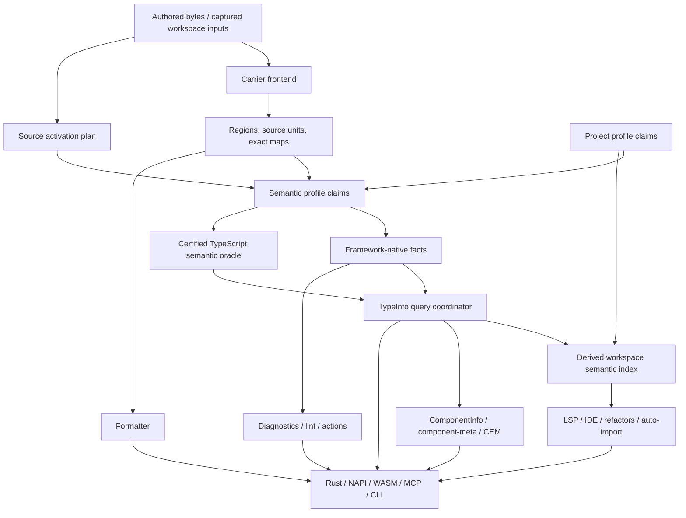

# Exact operative source-clause attachment — B4R0

Schema: 1. Node: `B4R0`. Clause count: 221. Generated from `provenance/source-coverage.toml`; every clause below is exact, operative, and applicable to this node.

### SRC-EXP-L1-0161BF289F43

- Kind: `context`; source: `successor-expansion.md:1-1`; target: `contract:contracts/dag.md`; text SHA-256: `0161bf289f43eefa3390ef1a0f6cca2b7e6e6ba9bb5cce016f75040839899bad`.

~~~~markdown
# Verter Universal Frontend Tooling — Architecture-First Successor Program
~~~~

### SRC-EXP-L10-60E89EAD3FD3

- Kind: `context`; source: `successor-expansion.md:10-10`; target: `contract:contracts/dag.md`; text SHA-256: `60e89ead3fd326462e4e5b74f1b4bf9435abfbbbac71a3e9a3c84b73c6ed4bb9`.

~~~~markdown
## 1. Decision
~~~~

### SRC-EXP-L100-854FAEEBF39A

- Kind: `context`; source: `successor-expansion.md:100-100`; target: `contract:contracts/dag.md`; text SHA-256: `854faeebf39a1172afc85e87beb5d7d3a732eddcf371912d6d44c0c758a19674`.

~~~~markdown
`component-meta` therefore becomes a thin TypeInfo query/projection/serialization surface. It owns no parser, resolver, project selection, checker, type lowering, graph, or cache. Custom Elements Manifest is another eligible serializer over standards-level facts, not Verter’s internal component model.
~~~~

### SRC-EXP-L102-2BF88DC8EA9A

- Kind: `context`; source: `successor-expansion.md:102-102`; target: `contract:contracts/dag.md`; text SHA-256: `2bf88dc8ea9a8da0385e04672448b0a5ec14f6d1ee881a680626b4b0277964eb`.

~~~~markdown
## 4. Target architecture
~~~~

### SRC-EXP-L104-0372ED3CD43C

- Kind: `requirement`; source: `successor-expansion.md:104-127`; target: `contract:contracts/dag.md`; text SHA-256: `0372ed3cd43c4815285ac93f9686b89610a83ea6efea225017a43ba7b230440f`.

~~~~markdown

~~~~

### SRC-EXP-L12-EE772D19E8B8

- Kind: `context`; source: `successor-expansion.md:12-12`; target: `contract:contracts/dag.md`; text SHA-256: `ee772d19e8b852664f5b40fad33852e9fde58b39c671936d77e75edbc2873bd1`.

~~~~markdown
The previous proposal had a strong target architecture but the wrong execution shape. It attempted to lock formatter, lint, CLI, fifteen language/framework verticals, Web Components, and project profiles in one 251-block program. That would freeze immature assumptions, couple unrelated releases, and make a late Qwik, Glimmer, or SvelteKit problem capable of withholding an otherwise production-ready Verter CLI.
~~~~

### SRC-EXP-L129-C91D1371F7B2

- Kind: `context`; source: `successor-expansion.md:129-129`; target: `contract:contracts/dag.md`; text SHA-256: `c91d1371f7b2e64d7b0dccd05933375c0ff213add8da78b45d5b7beae08b752f`.

~~~~markdown
The arrows are dependency directions, not permission for downstream products to become upstream authorities.
~~~~

### SRC-EXP-L131-90419A84EB1F

- Kind: `context`; source: `successor-expansion.md:131-131`; target: `contract:contracts/dag.md`; text SHA-256: `90419a84eb1f34c186ed262031a729c8e83dabf3103e7b5478d7cbdfe914b0a2`.

~~~~markdown
### 4.1 Orthogonal identities
~~~~

### SRC-EXP-L133-50AC4A4FF4D5

- Kind: `context`; source: `successor-expansion.md:133-133`; target: `contract:contracts/dag.md`; text SHA-256: `50ac4a4ff4d562bc15212eb0acaeafcdb8602051526cd169d2693e532e35a230`.

~~~~markdown
The current `FileLanguage::Framework { adapter_id, language_id }` shape conflates syntax carrier and framework semantics. The successor model separates at least:
~~~~

### SRC-EXP-L135-04D65CF11C43

- Kind: `context`; source: `successor-expansion.md:135-135`; target: `contract:contracts/dag.md`; text SHA-256: `04d65cf11c43d44eef2124e9e2107d3182c4b3e95c06d2a062ed67a60d9a2506`.

~~~~markdown
| Identity | Meaning |
~~~~

### SRC-EXP-L136-AC92D1B091B2

- Kind: `context`; source: `successor-expansion.md:136-136`; target: `contract:contracts/dag.md`; text SHA-256: `ac92d1b091b25afced4265ab8cc2f40af0ad8ffa13d3ba560710a1caa14bfa06`.

~~~~markdown
|---|---|
~~~~

### SRC-EXP-L137-CB6AD251B3DE

- Kind: `context`; source: `successor-expansion.md:137-137`; target: `contract:contracts/dag.md`; text SHA-256: `cb6ad251b3de286bbe5b9506f8aee6f991e5b511bce9547076180022fb5e8a07`.

~~~~markdown
| `SourceUnitId` | Stable logical authored/generated unit lineage, independent of revision/content |
~~~~

### SRC-EXP-L138-EB184824121E

- Kind: `context`; source: `successor-expansion.md:138-138`; target: `contract:contracts/dag.md`; text SHA-256: `eb184824121e779d20d3cdf86e5762912a7411f7abf718d222fbf5ec7355758d`.

~~~~markdown
| `CarrierProfileId` | Syntax/recovery contract for the bytes being parsed |
~~~~

### SRC-EXP-L139-1F7FF2CB2B51

- Kind: `requirement`; source: `successor-expansion.md:139-139`; target: `contract:contracts/dag.md`; text SHA-256: `1f7ff2cb2b51222f4fff8cdff4e59bd83555cf9c2a08916ffa1339a98e315c7d`.

~~~~markdown
| `ParserGrammarEpoch` | Exact grammar and recovery epoch owned by that carrier frontend |
~~~~

### SRC-EXP-L14-6C5BA165F585

- Kind: `context`; source: `successor-expansion.md:14-14`; target: `contract:contracts/dag.md`; text SHA-256: `6c5ba165f585cc11640f6d373591eaf39749393fc665324de10381a1cfce42c3`.

~~~~markdown
This revision replaces that shape with five independent layers:
~~~~

### SRC-EXP-L140-0F036B14800D

- Kind: `context`; source: `successor-expansion.md:140-140`; target: `contract:contracts/dag.md`; text SHA-256: `0f036b14800da981c02f101b12fa30c2e642465b51bfdee59a069b5761a9c4aa`.

~~~~markdown
| `RegionId` / `AttachmentId` | Stable nested or attached authored region identity |
~~~~

### SRC-EXP-L141-65EC75742DEC

- Kind: `requirement`; source: `successor-expansion.md:141-141`; target: `contract:contracts/dag.md`; text SHA-256: `65ec75742decb091fe4fbadcc32064f27759377b3cd305d1d93b5e80f2db3601`.

~~~~markdown
| `FrameworkReleaseId` | One exact supported semantic release/epoch, such as `vue2_6` or `vue3` |
~~~~

### SRC-EXP-L142-C5914A481DF4

- Kind: `context`; source: `successor-expansion.md:142-142`; target: `contract:contracts/dag.md`; text SHA-256: `c5914a481df4b22ca66c5a2f3a9c17468d4f73e25efe77db4ada8aa7b160b236`.

~~~~markdown
| `SemanticClaimId` | Proven region/symbol-level activation and its evidence |
~~~~

### SRC-EXP-L143-A0D8B7509775

- Kind: `context`; source: `successor-expansion.md:143-143`; target: `contract:contracts/dag.md`; text SHA-256: `a0d8b75097755ebc21a17f6ff4fcea70400f49f604e557e4ee68c3816ed34a3d`.

~~~~markdown
| `ProjectProfileInstanceId` | Next/Nuxt/SvelteKit/etc. project semantics, independent of TS configured ownership |
~~~~

### SRC-EXP-L144-57616D5702A7

- Kind: `requirement`; source: `successor-expansion.md:144-144`; target: `contract:contracts/dag.md`; text SHA-256: `57616d5702a7326947f91cefc8c0d950dda5b22f36066bc0a5bb02cc7ba974fe`.

~~~~markdown
| `ProjectBindingId` | Existing configured TypeScript project ownership/binding |
~~~~

### SRC-EXP-L145-2B19E0D94F09

- Kind: `requirement`; source: `successor-expansion.md:145-145`; target: `contract:contracts/dag.md`; text SHA-256: `2b19e0d94f093b1d0e6aa61b64e203529bc4e8f2164beee660e4a20d0aa8fbf9`.

~~~~markdown
| `CertifiedTypeEngineBinding` *(imported)* | Accepted Rev11 binding and sole owner of semantic-backend contract, artifact, provider/process epoch, bound project, trust, and capabilities |
~~~~

### SRC-EXP-L146-2AFAB0CDD162

- Kind: `context`; source: `successor-expansion.md:146-146`; target: `contract:contracts/dag.md`; text SHA-256: `2afab0cdd1620a954a15a7bd8d7da59bf169f5496a9a8cabf3a029a74683c62c`.

~~~~markdown
| `CapabilityId` | Operation and maturity advertised on a public surface |
~~~~

### SRC-EXP-L148-771C41DDF5F5

- Kind: `forbidden`; source: `successor-expansion.md:148-148`; target: `contract:contracts/dag.md`; text SHA-256: `771c41ddf5f57473ffb7f551bb917dec71d6ac6d5c849a301f0200526d73550e`.

~~~~markdown
A file may have several semantic claims and several project memberships. A region has one resolved parser owner for one grammar contract. Versioned products key explicit tuples such as `(SourceUnitId, SourceRevision, ContentId, MapRevision)`; revision/content is never smuggled into the stable lineage identity. The current implementation’s revision/content-derived `SourceUnitId` is a live Rev11 conformance defect that must be repaired before L4/`BR0`, not normalized or deferred into the successor. The successor never defines a second backend/process identity: it consumes the accepted `CertifiedTypeEngineBinding` and its provider/process epoch. A project profile never creates or selects a TypeScript program; it partitions semantic demands and uses the existing configured-owner resolution to obtain a certified bound project.
~~~~

### SRC-EXP-L150-4F986574B853

- Kind: `context`; source: `successor-expansion.md:150-150`; target: `contract:contracts/dag.md`; text SHA-256: `4f986574b853214f5ef463a8ec81a8a5c7f5aaff2db1b60626edea7f00731db2`.

~~~~markdown
### 4.2 Framework version law
~~~~

### SRC-EXP-L152-203B8A95C962

- Kind: `forbidden`; source: `successor-expansion.md:152-152`; target: `contract:contracts/dag.md`; text SHA-256: `203b8a95c96239c77936ac8797a7999e01801154046c50d48868d66a9f5b76dd`.

~~~~markdown
One vertical manifest represents one exact supported framework release or ratified semantic epoch. It never contains a `versions = […]` switch.
~~~~

### SRC-EXP-L154-2046358D913E

- Kind: `context`; source: `successor-expansion.md:154-154`; target: `contract:contracts/dag.md`; text SHA-256: `2046358d913ec3982b9c140a0b278abafac34e365b9552ffaf58e96fe2c95ae6`.

~~~~markdown
- Vue 2.6 and Vue 3 are distinct `FrameworkReleaseId`s, manifests, activation rules, cache epochs, rule matrices, oracles, and maturity rows.
~~~~

### SRC-EXP-L155-EFC5FDC39E58

- Kind: `requirement`; source: `successor-expansion.md:155-155`; target: `contract:contracts/dag.md`; text SHA-256: `efc5fdc39e58067a1983fc550a2a9faf6778bf9af8b24b871ce53736d8151de9`.

~~~~markdown
- Multiple installed releases may coexist only as different vertical identities proven by package resolution. One region resolves to one final identity or a typed ambiguity.
~~~~

### SRC-EXP-L156-A5FCA0BE443C

- Kind: `requirement`; source: `successor-expansion.md:156-156`; target: `contract:contracts/dag.md`; text SHA-256: `a5fca0be443cf20eec6ff775b8900431b417f37cb51c2d2a96a7a09c3e306954`.

~~~~markdown
- Additional patch builds may share an identity only if an independently ratified conformance proof shows no semantic branch is required.
~~~~

### SRC-EXP-L157-AD0FAD038D35

- Kind: `forbidden`; source: `successor-expansion.md:157-157`; target: `contract:contracts/dag.md`; text SHA-256: `ad0fad038d358a67e596d98c3f5a476d6b7a283870a114cc1a318461a5682a32`.

~~~~markdown
- “Latest” is not an identity and never keys a cache.
~~~~

### SRC-EXP-L158-916490A0D7C3

- Kind: `requirement`; source: `successor-expansion.md:158-158`; target: `contract:contracts/dag.md`; text SHA-256: `916490a0d7c3c435740e0db65def7e30e8fc51aeac5c7103cba92b171df5f211`.

~~~~markdown
- Qwik 1 has no profile. A Qwik 2 profile remains dormant until an exact Qwik 2 release/epoch is deliberately accepted; current official Qwik 2 releases are still marked prerelease.
~~~~

### SRC-EXP-L16-690B240347BD

- Kind: `acceptance`; source: `successor-expansion.md:16-16`; target: `contract:contracts/dag.md`; text SHA-256: `690b240347bd02019d619e603702d7d4db31cb964a162628a5e36915ac45c5c0`.

~~~~markdown
1. **Repair and finish Rev11/TCM honestly.** The missing DAG edges, rejected TCM0 acceptance basis, stale ADR evidence, and live `SourceUnitId` conformance defect must be repaired before the successor program can claim an accepted foundation.
~~~~

### SRC-EXP-L160-9A2F5486656B

- Kind: `context`; source: `successor-expansion.md:160-160`; target: `contract:contracts/dag.md`; text SHA-256: `9a2f5486656b375eacdb08f368d236740422ae1cf017756f7a936c187a145940`.

~~~~markdown
### 4.3 Catalog and registration
~~~~

### SRC-EXP-L162-0CD4B458DF5D

- Kind: `context`; source: `successor-expansion.md:162-162`; target: `contract:contracts/dag.md`; text SHA-256: `0cd4b458df5d646b5384b9ea5c4067a7861c3b2e28be7c06b095bf7a1b5a913a`.

~~~~markdown
Keep one immutable `FrontendCatalogSnapshot` construction authority with typed tables rather than flattening unrelated things into one framework enum:
~~~~

### SRC-EXP-L164-E41B545DE4FB

- Kind: `context`; source: `successor-expansion.md:164-173`; target: `contract:contracts/dag.md`; text SHA-256: `e41b545de4fbd12013a48a429da3dd6215d27e4dd17f0cf7d2d741e92b2d87e5`.

~~~~markdown
```text
FrontendCatalogSnapshot
  carrier_frontends
  semantic_profiles
  project_profiles
  embedded_language_roles
  interoperability_schemas
  public_capabilities
  rule_and_action_manifests
```
~~~~

### SRC-EXP-L17-4CEF5BB29341

- Kind: `requirement`; source: `successor-expansion.md:17-17`; target: `contract:contracts/dag.md`; text SHA-256: `4cef5bb293413ee9f931579074ab82a00a3c46fe95ead7335f986c5c09559271`.

~~~~markdown
2. **Ratify a bounded universal-tooling kernel through scoped locks.** Identity/parser, observation/TypeInfo, capability/public, and manifest/governance contracts close independently; a read-only convergence block makes the provisional universal claim. The kernel does not implement every framework or gate unrelated product work.
~~~~

### SRC-EXP-L175-1BCC2B54F95C

- Kind: `context`; source: `successor-expansion.md:175-175`; target: `contract:contracts/dag.md`; text SHA-256: `1bcc2b54f95c65d4055fc775a173f9a91ccd68be1c92024dd93e932d978ea794`.

~~~~markdown
The existing framework registry, carrier registry, descriptor-generated client manifest, and generic LSP routing are migrated into this authority. There is no parallel “universal” registry and no per-framework VS Code wiring. Registration is static at build time for Rust/NAPI/WASM reproducibility; a vertical manifest is not a dynamic plugin ABI.
~~~~

### SRC-EXP-L177-5EE4F3F26C18

- Kind: `context`; source: `successor-expansion.md:177-177`; target: `contract:contracts/dag.md`; text SHA-256: `5ee4f3f26c18b63cecd25f2a66e44d0c77e3344d02a5fb838de0db3a89665897`.

~~~~markdown
### 4.4 Carrier frontend versus compiler backend
~~~~

### SRC-EXP-L179-B4924B12B06C

- Kind: `forbidden`; source: `successor-expansion.md:179-179`; target: `contract:contracts/dag.md`; text SHA-256: `b4924b12b06c0c138e94cfb513ba5c99333575ab8134c2ef5dcfbfc58c6dd6c2`.

~~~~markdown
The current compiler-shaped carrier trait must not force tooling-only languages to pretend they compile. Split it conceptually into:
~~~~

### SRC-EXP-L18-241915BC3EE6

- Kind: `context`; source: `successor-expansion.md:18-18`; target: `contract:contracts/dag.md`; text SHA-256: `241915bc3ee68217852072961e759a17c03854fad73412c98bc31e39c2c69d7e`.

~~~~markdown
3. **Ratify repository workflow skills.** Agents receive one planning skill and one implementation skill backed by a deterministic repository validator. A skill cannot invent architecture or ratify its own output.
~~~~

### SRC-EXP-L181-DA504C544E4A

- Kind: `context`; source: `successor-expansion.md:181-181`; target: `contract:contracts/dag.md`; text SHA-256: `da504c544e4a8b332e3d4451ae128eedd3bbbd2e72d45df84c78c3fb796da8a5`.

~~~~markdown
- `CarrierFrontend`: parse, recovery, source units, authored maps, tooling projections, syntax facts, and optional format views;
~~~~

### SRC-EXP-L182-45EFA8C03457

- Kind: `context`; source: `successor-expansion.md:182-182`; target: `contract:contracts/dag.md`; text SHA-256: `45efa8c03457028da9ab323db2733db26280f003a57f11c58572d4cf9b7e3792`.

~~~~markdown
- `CarrierCompilerBackend`: optional admitted runtime/SSR/IDE compilation products for a carrier that Verter deliberately compiles.
~~~~

### SRC-EXP-L184-98FF0E3375A1

- Kind: `context`; source: `successor-expansion.md:184-184`; target: `contract:contracts/dag.md`; text SHA-256: `98ff0e3375a19ba25fc25cabcc94b4ecaeda2c9e82203fec2cc4b87b167ae7f1`.

~~~~markdown
Vue and Svelte migrate behavior-preservingly. Astro, MDX, HTML, Marko, or Glimmer can become complete tooling verticals without an `Unsupported` compiler stub being their architectural identity. Compiler capability remains an explicit independent catalog row.
~~~~

### SRC-EXP-L186-6C99431ACB08

- Kind: `context`; source: `successor-expansion.md:186-186`; target: `contract:contracts/dag.md`; text SHA-256: `6c99431acb08f05a0cd3adf6075c4a784f1fe1b1cc9bf6bdd427d1df29b6cb9a`.

~~~~markdown
### 4.5 Parser policy: no omni parser
~~~~

### SRC-EXP-L188-1766C14F98E7

- Kind: `context`; source: `successor-expansion.md:188-188`; target: `contract:contracts/dag.md`; text SHA-256: `1766c14f98e7470e8294814ef50cd8a7c5a5c504958cfdf0d2e46234403823a3`.

~~~~markdown
“One parser authority” means one owner for `(CarrierProfileId, ParserGrammarEpoch)`, not one implementation for all frontend syntax.
~~~~

### SRC-EXP-L19-603F52F2B8C9

- Kind: `context`; source: `successor-expansion.md:19-19`; target: `contract:contracts/dag.md`; text SHA-256: `603f52f2b8c999cf866696a46857b29cc10399a09a433ccca6626bed123dddb8`.

~~~~markdown
4. **Implement HTML + standards Custom Elements first.** It is the highest-unlock architectural project and the correct place to prove independent parser ownership, neutral HTML semantics, cross-framework component information, and Vue/Svelte Custom Element integration.
~~~~

### SRC-EXP-L190-4B1226528FC4

- Kind: `context`; source: `successor-expansion.md:190-190`; target: `contract:contracts/dag.md`; text SHA-256: `4b1226528fc4f543901145c4db782b73f65f42c103a10d2f6b5a0448f701dbe3`.

~~~~markdown
Every vertical lock records `ParserDecision = Reuse | ForkAndSpecialize | NewParser` with evidence:
~~~~

### SRC-EXP-L192-2497799CF268

- Kind: `context`; source: `successor-expansion.md:192-192`; target: `contract:contracts/dag.md`; text SHA-256: `2497799cf268914b22a1f1241bd273fa589bdedf8885e391ac8734936fed7471`.

~~~~markdown
- OXC remains the parser for genuine JS/TS/JSX/TSX bytes.
~~~~

### SRC-EXP-L193-0464BE701CB2

- Kind: `context`; source: `successor-expansion.md:193-193`; target: `contract:contracts/dag.md`; text SHA-256: `0464be701cb2757e465ec49db91c5246c3c55548c8ea0afa8cd7ce5dbd7d5f5c`.

~~~~markdown
- Vue and Svelte retain dedicated carrier frontends.
~~~~

### SRC-EXP-L194-908DB19BAFBB

- Kind: `deletion`; source: `successor-expansion.md:194-194`; target: `contract:contracts/dag.md`; text SHA-256: `908db19bafbb38c58d5bd33269a6cd1638bf5489205ee6d3a4c4acf9a7b51a26`.

~~~~markdown
- Neutral HTML begins as an exact, license-recorded copy/fork of the Vue template/HTML parser, with Vue behavior removed and independent standards recovery/corpus ownership.
~~~~

### SRC-EXP-L195-BA1D9743335D

- Kind: `context`; source: `successor-expansion.md:195-195`; target: `contract:contracts/dag.md`; text SHA-256: `ba1d9743335d59ffa00549a3bf7db898e185752289831c2ed787a13385683b70`.

~~~~markdown
- Angular, Alpine, and HTMX initially attach semantic claims to the neutral HTML product. They do not each receive another HTML parser without grammar evidence.
~~~~

### SRC-EXP-L196-8FF448FFE260

- Kind: `requirement`; source: `successor-expansion.md:196-196`; target: `contract:contracts/dag.md`; text SHA-256: `8ff448ffe260447c7ebd09c4b894b492f1a3990c45ed5cd7b0196c614aaf8f18`.

~~~~markdown
- Astro, MDX, Marko, and Glimmer receive dedicated parsers where their carrier grammar actually requires one.
~~~~

### SRC-EXP-L197-F8458529FD36

- Kind: `requirement`; source: `successor-expansion.md:197-197`; target: `contract:contracts/dag.md`; text SHA-256: `f8458529fd369ddfa1a8cdf225484d12dac02a71cc28ae036afbbe800a3f24de`.

~~~~markdown
- Equal bytes may reuse a parse only when carrier profile, grammar epoch, parse options, and recovery contract are equal. A content hash alone is insufficient.
~~~~

### SRC-EXP-L199-B3BCBBEB9BDA

- Kind: `forbidden`; source: `successor-expansion.md:199-199`; target: `contract:contracts/dag.md`; text SHA-256: `b3bcbbeb9bdaf985aa4f535489b2e51500479b85a1ad4f28662903391ea37df9`.

~~~~markdown
A future `HFC-FUTURE` investigation may begin only after at least three accepted HTML-family parsers and measured duplication exist. It may extract proven-neutral scanning/entity/tree primitives one consumer at a time. It may also conclude that independent parsers remain best. It must never create a growing framework branch matrix, shared invalidation coupling, or semantic leakage.
~~~~

### SRC-EXP-L20-0EA0AED0FC38

- Kind: `requirement`; source: `successor-expansion.md:20-20`; target: `contract:contracts/dag.md`; text SHA-256: `0ea0aed0fc380116fcb588439532d701f317c0d9aa25e6985f06a0dd69c9911c`.

~~~~markdown
5. **Falsify the kernel sequentially with small representative slices.** MDX, Lit, React then Solid, Alpine, Angular, and Astro exercise different source geometries. Only after these slices pass does the architecture become a stable basis for independently promoted full verticals.
~~~~

### SRC-EXP-L201-4B43CD90D2B7

- Kind: `context`; source: `successor-expansion.md:201-201`; target: `contract:contracts/dag.md`; text SHA-256: `4b43cd90d2b708a4f13b8b809157fc4b4f0c71d29886c4bd6222f9df40b8bb94`.

~~~~markdown
### 4.6 Two-stage activation and demand
~~~~

### SRC-EXP-L203-CE5A84736BD7

- Kind: `context`; source: `successor-expansion.md:203-203`; target: `contract:contracts/dag.md`; text SHA-256: `ce5a84736bd755ac58b9400945446a8ee32480cb9a75786ef58793fd21181e74`.

~~~~markdown
Profile selection and capability execution are separate:
~~~~

### SRC-EXP-L205-361343094959

- Kind: `context`; source: `successor-expansion.md:205-205`; target: `contract:contracts/dag.md`; text SHA-256: `361343094959d58542dfa8538e9f8051ffb39e3abb6d1974e1cf523d471e2c1a`.

~~~~markdown
1. `SourceActivationPlan` is created from captured source, package, static config, path, and Verter-native provenance. It can affect parse/projection selection and therefore cannot call TypeScript semantics.
~~~~

### SRC-EXP-L206-3F6A5EB34C7B

- Kind: `requirement`; source: `successor-expansion.md:206-206`; target: `contract:contracts/dag.md`; text SHA-256: `3f6a5eb34c7b93f49eaa43ad6c0390946f91e790acae6bd019324b42d7c767ae`.

~~~~markdown
2. `SemanticClaimPlan` runs only after an eligible snapshot exists. It may use the certified TypeScript oracle to refine symbol/type meaning, but it cannot retroactively alter the current mapper transform. A projection-affecting change requires a new source generation.
~~~~

### SRC-EXP-L207-264D4119FA01

- Kind: `forbidden`; source: `successor-expansion.md:207-207`; target: `contract:contracts/dag.md`; text SHA-256: `264d4119fa01e8b51c6bf398336fa770cc05f87ee497e35e18ebfc9975cffdc2`.

~~~~markdown
3. `CapabilityDemandPlan` names the exact facts/products required for the requested operation. Merely selecting React, Angular, or Vue never runs every lint rule, formatter view, metadata projection, or workspace contributor.
~~~~

### SRC-EXP-L209-F46E885D8135

- Kind: `context`; source: `successor-expansion.md:209-209`; target: `contract:contracts/dag.md`; text SHA-256: `f46e885d8135fd1ef6a2a17be7346da3acba1cbdb90d24ea76066e3a0cc3d933`.

~~~~markdown
All three plans are immutable, revision-bound, and included in observable audit evidence. `Disabled` profile participation performs zero parse, index, config, watcher, oracle, or publication work attributable to that profile.
~~~~

### SRC-EXP-L211-6B424E664739

- Kind: `context`; source: `successor-expansion.md:211-211`; target: `contract:contracts/dag.md`; text SHA-256: `6b424e6647397cae0914b9d9a8fcc693cf76462e1030ef872c2a7cf54a56a754`.

~~~~markdown
### 4.7 Symbol-proven embedded languages
~~~~

### SRC-EXP-L213-4732EF2B4852

- Kind: `context`; source: `successor-expansion.md:213-213`; target: `contract:contracts/dag.md`; text SHA-256: `4732ef2b48522501f618db48ada1f7b5cbbd8536290f04599428575b6ba9883d`.

~~~~markdown
Embedding is generic geometry plus profile-owned activation—not bespoke string searching.
~~~~

### SRC-EXP-L215-0976C89D72E2

- Kind: `context`; source: `successor-expansion.md:215-215`; target: `contract:contracts/dag.md`; text SHA-256: `0976c89d72e2652ed963843a5e57de55fa3d5e97b2cacc2d594441ccc0d8579d`.

~~~~markdown
For Vue:
~~~~

### SRC-EXP-L217-CD45ACC5C733

- Kind: `context`; source: `successor-expansion.md:217-219`; target: `contract:contracts/dag.md`; text SHA-256: `cd45acc5c7336754782f3541633f6f01589de44a309be30a0de56cb716543e64`.

~~~~markdown
```ts
import { defineComponent as dc } from 'vue'
const defineComponent = dc
~~~~

### SRC-EXP-L22-79240D82B05B

- Kind: `requirement`; source: `successor-expansion.md:22-22`; target: `contract:contracts/dag.md`; text SHA-256: `79240d82b05bcdf3e039db4563e1bb99b81e75c59b2021959a67afe557cfbe3b`.

~~~~markdown
The resulting active proposal has **89 provisional, copy-ready charter specifications**, rather than a global 251-charter release. They are not ratified charters until their lock block supplies exact paths, corpus revisions, numeric gates, candidate basis, authority digest, and reviewers. Large mutation domains are split into independently state-tracked blocks. No full Marko, Ember/Glimmer, Angular, React, Solid, Qwik, Preact, Stencil, Astro, or project-profile vertical is placed on the kernel’s release-critical path. Those remain explicit portfolio entries generated and ratified one at a time.
~~~~

### SRC-EXP-L221-9FF0AF6A8074

- Kind: `context`; source: `successor-expansion.md:221-225`; target: `contract:contracts/dag.md`; text SHA-256: `9ff0af6a8074511875920458a55bbf6683a80643b0e0f295b8d6c321d9f8b370`.

~~~~markdown
defineComponent({
  template: '<div>Hello {{ name }}</div>',
  setup() { return { name: 'Verter' } }
})
```
~~~~

### SRC-EXP-L227-95B037A576D7

- Kind: `requirement`; source: `successor-expansion.md:227-227`; target: `contract:contracts/dag.md`; text SHA-256: `95b037a576d7ee48033f47ae6c4af5dad21c81bddc85f2ba49066af7c4fe0e70`.

~~~~markdown
Activation requires a proven chain to the exact admitted Vue export. Direct aliases, namespace access, local barrels/re-exports, destructuring, and immutable local alias chains are supported when provenance is certain. Same-spelled userland functions, mutation, wrappers, conditional aliases, unresolved packages, and ambiguous origin fail closed.
~~~~

### SRC-EXP-L229-2544E5EC7EAD

- Kind: `forbidden`; source: `successor-expansion.md:229-229`; target: `contract:contracts/dag.md`; text SHA-256: `2544e5ec7eadb8befbd4627e138e3d0bf5de0532417596f2fb9ac1d659a1ca2a`.

~~~~markdown
`EmbeddedTextCodec` owns raw↔cooked geometry, escapes, delimiters, CRLF, interpolation holes, base URI, and exact map composition. Vue options templates, Angular inline templates, and Lit tagged templates may share that geometry while retaining different activation, grammar, hole, and semantic rules. Dynamic/non-invertible regions return typed partiality or `NeedInputs`; they are never mapped to a nearby token.
~~~~

### SRC-EXP-L231-54136F767A44

- Kind: `requirement`; source: `successor-expansion.md:231-231`; target: `contract:contracts/dag.md`; text SHA-256: `54136f767a449b522093f9675a0461ccc1d418c48404be04cbd918d14ec53b82`.

~~~~markdown
Every coordinate that leaves `EmbeddedTextCodec` is a typed UTF-8 byte coordinate. Each profile chooses raw or cooked input explicitly. A cooked JavaScript value is admitted only when it is valid Unicode scalar text and can be encoded as UTF-8 with an exact authored-byte map; lone surrogates, invalid tagged-template escapes, or any non-invertible value return `NonUnicodeCookedLiteral`/typed partiality before an embedded parser runs. No UTF-16-code-unit or WTF-8 offset can enter core/public DTOs, cache identities, diagnostics, edits, or indexes. Required tests include lone surrogates, surrogate pairs, invalid tagged escapes, line continuations/CRLF, escaped delimiters, and interpolation holes.
~~~~

### SRC-EXP-L233-E46496229062

- Kind: `context`; source: `successor-expansion.md:233-233`; target: `contract:contracts/dag.md`; text SHA-256: `e464962290624d186d7017b7e58af98ad3955824040e5c8c99dff3d815e32702`.

~~~~markdown
Ordinary `.ts`/`.tsx` remains TypeScript-owned and is not sent through the content mapper. Post-snapshot embedded semantics may use TCM3; no mapper callback does so, and no second TypeScript program is created.
~~~~

### SRC-EXP-L235-2F03906B2C04

- Kind: `context`; source: `successor-expansion.md:235-235`; target: `contract:contracts/dag.md`; text SHA-256: `2f03906b2c04fb3792a8dc8d6d4ecd1bca6e29155f3c257b585e52a857289e4a`.

~~~~markdown
### 4.8 TypeInfo and component information
~~~~

### SRC-EXP-L237-A7F33F9D6604

- Kind: `context`; source: `successor-expansion.md:237-237`; target: `contract:contracts/dag.md`; text SHA-256: `a7f33f9d6604cc70e3f7598d2fa7ac17cea75df8b9b23b9613d866c11c9206e3`.

~~~~markdown
The canonical public request family includes at least:
~~~~

### SRC-EXP-L239-998CA04CEDA7

- Kind: `context`; source: `successor-expansion.md:239-239`; target: `contract:contracts/dag.md`; text SHA-256: `998ca04ceda7f8ecda73822e28345cdb05ef3d7b826c19fd3adee016ce344661`.

~~~~markdown
- type at a file position;
~~~~

### SRC-EXP-L24-6321C4ECC677

- Kind: `requirement`; source: `successor-expansion.md:24-24`; target: `contract:contracts/dag.md`; text SHA-256: `6321c4ecc67737d2ef0c3ae3159e2b725cef71d53dec8bb09d795b4e91439831`.

~~~~markdown
Universality is a property of the extension architecture, not a requirement that every ecosystem ship in one program. The kernel is credible only if radically different geometries can extend it without changing semantic authorities; the number of framework badges is not an architecture metric.
~~~~

### SRC-EXP-L240-237184DEEC27

- Kind: `context`; source: `successor-expansion.md:240-240`; target: `contract:contracts/dag.md`; text SHA-256: `237184deec27354ef5088fc150d3eb71451aadd0975055a190e8c6f70d13cfaf`.

~~~~markdown
- declared type of a named file symbol;
~~~~

### SRC-EXP-L241-F7D61CCC66B6

- Kind: `context`; source: `successor-expansion.md:241-241`; target: `contract:contracts/dag.md`; text SHA-256: `f7d61ccc66b697a78be6a134b36ad10275cc6747c169f0c7e7b6fc5cb6cae6b0`.

~~~~markdown
- bounded workspace/project name search returning a stable candidate set;
~~~~

### SRC-EXP-L242-50C49590BAFE

- Kind: `context`; source: `successor-expansion.md:242-242`; target: `contract:contracts/dag.md`; text SHA-256: `50c49590bafe16a7cc95e61af3835c874d08dc3de32dc11290bd4327bd33cd62`.

~~~~markdown
- symbol resolution/relation queries;
~~~~

### SRC-EXP-L243-D44DD6F18C94

- Kind: `context`; source: `successor-expansion.md:243-243`; target: `contract:contracts/dag.md`; text SHA-256: `d44dd6f18c9485652d8c2c8f682e384ede3b9c9e14571bdb27131736d7306aa3`.

~~~~markdown
- framework surface and component information views.
~~~~

### SRC-EXP-L245-F1C4C4830C45

- Kind: `forbidden`; source: `successor-expansion.md:245-245`; target: `contract:contracts/dag.md`; text SHA-256: `f1c4c4830c4500012932af4eeef35d2479c3dec629675070c57099fa38ce8faa`.

~~~~markdown
Position/file requests carry the exact source revision. Project/workspace name searches instead carry a captured project/workspace view identity plus the complete positive/negative read set; there is no fabricated single source revision. Every request also carries selector, project/binding policy, completeness policy, cancellation, budget, and—when a line/character position is used—an explicit encoding. Name-only ambiguity returns `NeedSelection` plus candidates, never the first result.
~~~~

### SRC-EXP-L247-5E79F8BB1252

- Kind: `requirement`; source: `successor-expansion.md:247-247`; target: `contract:contracts/dag.md`; text SHA-256: `5e79f8bb12526b47ce5175eacb8c27d63fb30e35e0b6ef3c15d150c1e520239f`.

~~~~markdown
The accepted Rev11 observation-identity contract remains the sole generic owner of `CertifiedTypeEngineBinding`, `InputBasisId`/`TypeObservationBasis`, generic `QueryIdentity`, `ResultContractId`, and `SemanticFlightKey = (QueryIdentity, InputBasisId)`. `TIF0` consumes those types and solely owns TypeInfo-specific operation descriptors and their canonical equality material; it does not redefine the runtime/G2 flight law. Actual completeness belongs in result provenance. Performance/cache blocks consume and test this partition; they do not redefine it.
~~~~

### SRC-EXP-L249-4C7454C534E9

- Kind: `requirement`; source: `successor-expansion.md:249-249`; target: `contract:contracts/dag.md`; text SHA-256: `4c7454c534e981de32ec465a970cc3f1a6b5b0b859ff3d1673873413fc8d0729`.

~~~~markdown
`ComponentInfo` is a versioned view over TypeInfo roots/type-role bindings plus framework-owned facets such as props, attributes, events, slots/children, exposed methods, reactivity, directives, CSS parts/properties, or client/server boundary. It is not a closed universal component IR. Every facet declares owner, schema epoch, applicability, completeness, and provenance. A field may enter the generic surface only when at least two semantically independent framework families need genuinely equivalent semantics and cross-framework interoperability benefits; otherwise it remains an owner-tagged facet.
~~~~

### SRC-EXP-L251-9AA495708B68

- Kind: `context`; source: `successor-expansion.md:251-251`; target: `contract:contracts/dag.md`; text SHA-256: `9aa495708b68b9cf2a2afa3408b7890561f5b0bb4770f22737b00c5f66b56b14`.

~~~~markdown
`component-meta` and compatibility renderers query the same service. They may rename or reshape output for vue-component-meta-compatible consumers but cannot own type expansion or cache results independently.
~~~~

### SRC-EXP-L253-614ABAA60DCF

- Kind: `context`; source: `successor-expansion.md:253-253`; target: `contract:contracts/dag.md`; text SHA-256: `614abaa60dcf731964fe68044e03d7eea352c35dd3e34c8c5c86caef299c0ae9`.

~~~~markdown
### 4.9 Semantic index and project semantics
~~~~

### SRC-EXP-L255-7BA4B135B78A

- Kind: `forbidden`; source: `successor-expansion.md:255-255`; target: `contract:contracts/dag.md`; text SHA-256: `7ba4b135b78a14e4d5099b3a554cf14d58b17aaa50783594c0972198f56c49de`.

~~~~markdown
The workspace index stores derived, snapshot-bound contributions and typed edges. It never resolves a type by itself. At minimum it can relate source units, regions, symbols, components, Custom Element registrations, imports, consumers, assets, links, routes, profiles, and project memberships.
~~~~

### SRC-EXP-L257-DE18FFF70E53

- Kind: `requirement`; source: `successor-expansion.md:257-257`; target: `contract:contracts/dag.md`; text SHA-256: `de18fff70e536bbec8022a34e421c07a1e856402b223b12dbd157dddf4fa5bf9`.

~~~~markdown
Contributors stage a complete immutable delta and publish atomically only if their source, activation, backend, and project bases are still current. Cancellation, overflow, missing input, ambiguous project association, or partial enumeration cannot publish a cacheable empty result.
~~~~

### SRC-EXP-L259-D016971849B2

- Kind: `context`; source: `successor-expansion.md:259-259`; target: `contract:contracts/dag.md`; text SHA-256: `d016971849b2bdade3c084e0e30b825ad402aa8b6dc79afc7c69dfd2a3cbe751`.

~~~~markdown
The user’s proposed layering is correct and important:
~~~~

### SRC-EXP-L26-5BED88B3D121

- Kind: `forbidden`; source: `successor-expansion.md:26-26`; target: `contract:contracts/dag.md`; text SHA-256: `5bed88b3d121caa3c16c00ade858ab338106f7ab2ae364d555d42ef83589b87e`.

~~~~markdown
This is intentionally breaking-change friendly. Existing names, traits, wire schemas, registries, and package surfaces survive only when they remain the best authority. Compatibility is never allowed to preserve a second resolver, parser registry, type schema, cache, map family, or command implementation.
~~~~

### SRC-EXP-L261-90089B7921BD

- Kind: `context`; source: `successor-expansion.md:261-263`; target: `contract:contracts/dag.md`; text SHA-256: `90089b7921bd39fe6e6af5d96ca70d478f0d3f50d95f816282cb57b8650636a5`.

~~~~markdown
```text
source language/carrier → framework semantic profile → project profile
```
~~~~

### SRC-EXP-L265-68235AB4D45E

- Kind: `requirement`; source: `successor-expansion.md:265-265`; target: `contract:contracts/dag.md`; text SHA-256: `68235ab4d45e9e6c7630c12afb7371058b7f6634be4d1fcd673c419438985176`.

~~~~markdown
Examples are TSX → React → Next, Vue SFC → Vue → Nuxt, and Svelte → Svelte → SvelteKit. The kernel reserves these independent identities and contribution seams now. It does not freeze Next-shaped route vocabulary prematurely. Next is the first intended project-profile implementation, while Nuxt and SvelteKit counterexample fixtures must challenge the generic vocabulary before its stable lock.
~~~~

### SRC-EXP-L267-C1102248C452

- Kind: `context`; source: `successor-expansion.md:267-267`; target: `contract:contracts/dag.md`; text SHA-256: `c1102248c452c157fd6643687472ceb61852774e596a1db60e5dfdd36e9924ea`.

~~~~markdown
### 4.10 Custom Elements as interoperability
~~~~

### SRC-EXP-L269-A259176DF4A1

- Kind: `context`; source: `successor-expansion.md:269-269`; target: `contract:contracts/dag.md`; text SHA-256: `a259176df4a173ec4f01358a39be215ca54da64c639ba8ebe8aa2e2616b18ef5`.

~~~~markdown
Custom Elements are a standards interop facet, not a super-framework. Every vertical manifest separately dispositions:
~~~~

### SRC-EXP-L271-DD9EF484E085

- Kind: `requirement`; source: `successor-expansion.md:271-271`; target: `contract:contracts/dag.md`; text SHA-256: `dd9ef484e08500e9f0485a5f35036f1034c4eb7a0e1297b23fbcc0f58204ee17`.

~~~~markdown
- `ProducesCustomElement = Required | Unsupported(reason) | NotApplicable`;
~~~~

### SRC-EXP-L272-72D3F01C0602

- Kind: `requirement`; source: `successor-expansion.md:272-272`; target: `contract:contracts/dag.md`; text SHA-256: `72d3f01c0602dd30da37514c03e5cbbe00786d786daa8faa63a6292eef9bb0d1`.

~~~~markdown
- `ConsumesCustomElement = Required | Unsupported(reason) | NotApplicable`.
~~~~

### SRC-EXP-L274-1118BF632662

- Kind: `requirement`; source: `successor-expansion.md:274-274`; target: `contract:contracts/dag.md`; text SHA-256: `1118bf6326620b6cf8fa75b6283e07166754560955fa6ee0374988c7da67d039`.

~~~~markdown
Framework-owned producer detection uses proven symbols, carrier directives/options, captured static config, and registry association. Filename suffix is candidate evidence only. Required cases include Vue `.ce.vue`/`defineCustomElement`, Svelte custom-element mode, Lit, Stencil, vanilla `customElements.define`, and separately admitted Angular Elements or wrappers.
~~~~

### SRC-EXP-L276-AB049D987618

- Kind: `forbidden`; source: `successor-expansion.md:276-276`; target: `contract:contracts/dag.md`; text SHA-256: `ab049d9876187c28f9b3735e9ff1c542af6904191346792fc2a3e60054479f20`.

~~~~markdown
`CEF0` owns the standards/CEM contract only. `HWC3` implements standards-fact projection, registry analysis, and CEM import/export against that contract. A framework owns its producer/consumer evidence and how it binds or consumes the resulting standards facts; it never serializes a private CEM dialect. Registry scope, declaration, registration, framework component identity, and runtime reachability remain separate; static uncertainty returns `Ambiguous` or `Incomplete`.
~~~~

### SRC-EXP-L278-A7EFE25A9F9F

- Kind: `context`; source: `successor-expansion.md:278-278`; target: `contract:contracts/dag.md`; text SHA-256: `a7efe25a9f9f51aa1cc3256aff36e9abb3f7c9830c7de5c280ad7a5ce1246699`.

~~~~markdown
### 4.11 Coordinates and map families
~~~~

### SRC-EXP-L28-5FAE72D83DF1

- Kind: `requirement`; source: `successor-expansion.md:28-28`; target: `contract:contracts/dag.md`; text SHA-256: `5fae72d83df1c12c5b8753a88db5075058d4d6c8956beba859185e3674aeb9d9`.

~~~~markdown
## 2. What is binding, provisional, and deferred
~~~~

### SRC-EXP-L280-28474C39EBAE

- Kind: `requirement`; source: `successor-expansion.md:280-280`; target: `contract:contracts/dag.md`; text SHA-256: `28474c39ebae5fe5f0f1623536efea18b4e50071beb2e4662b6f9b502be27dc8`.

~~~~markdown
Rust core uses only typed UTF-8 byte offsets and ranges. Source/generated/embedded offsets are distinct newtypes; unchecked integers and implicit coordinate domains are invalid public contracts.
~~~~

### SRC-EXP-L282-4E8C9C0FCEF3

- Kind: `context`; source: `successor-expansion.md:282-282`; target: `contract:contracts/dag.md`; text SHA-256: `4e8c9c0fcef3655d1050dee69f603cf6653ca10d65a582d05c810dc86dee82f0`.

~~~~markdown
- LSP converts the negotiated UTF-8/UTF-16/UTF-32 encoding at ingress/egress.
~~~~

### SRC-EXP-L283-90BD11A44968

- Kind: `context`; source: `successor-expansion.md:283-283`; target: `contract:contracts/dag.md`; text SHA-256: `90bd11a449681e13752523f1d5e6dfb7b75a173a758df0cffd34a8acaab2534b`.

~~~~markdown
- NAPI/WASM/FFI/CLI requests carry an explicit tagged encoding or a byte-offset selector.
~~~~

### SRC-EXP-L284-64EC0AA3736D

- Kind: `requirement`; source: `successor-expansion.md:284-284`; target: `contract:contracts/dag.md`; text SHA-256: `64ec0aa3736dd9c201fb6f76e1eb1bd98a1cfabe338c486a67d959468a537f5f`.

~~~~markdown
- TypeScript mapper wire conversion happens only in TCM2 terminal serialization.
~~~~

### SRC-EXP-L285-505AA47AF2CC

- Kind: `requirement`; source: `successor-expansion.md:285-285`; target: `contract:contracts/dag.md`; text SHA-256: `505aa47af2cc5c07cf53a5bcd12af4f8554d43a0da9cc8445fca7b8bc8acde39`.

~~~~markdown
- TCM3 owns semantic-oracle request/result conversion and generated↔authored mapping against the exact snapshot and `SourceProjectionMap` basis.
~~~~

### SRC-EXP-L286-7DDE6953315A

- Kind: `requirement`; source: `successor-expansion.md:286-286`; target: `contract:contracts/dag.md`; text SHA-256: `7dde6953315a57f76236b7a746634bb8c1d82de5cf5368d291b97e67411d869d`.

~~~~markdown
- H2 owns only core-UTF-8↔direct-provider-wire conversion. The client-LSP negotiated-encoding boundary is separately owned by the editor adapter; the successor encoding train audits both without taking over their maps.
~~~~

### SRC-EXP-L287-F8881B617395

- Kind: `context`; source: `successor-expansion.md:287-287`; target: `contract:contracts/dag.md`; text SHA-256: `f8881b61739581b0ea14c6e3d6a76988f71a3cc3bdf62ad4253a8b3ae92177e4`.

~~~~markdown
- Prepared parses, projections, native facts, and indexes are not keyed by requested terminal encoding.
~~~~

### SRC-EXP-L288-B7181C8E8287

- Kind: `context`; source: `successor-expansion.md:288-288`; target: `contract:contracts/dag.md`; text SHA-256: `b7181c8e82879c6db17d5300c4fe46af6b9b1cd85c191ed22cb9a132d1983fa8`.

~~~~markdown
- Invalid code-point boundaries, overflow, stale line indexes, or non-invertible maps return typed errors/partiality.
~~~~

### SRC-EXP-L290-DFA7C68F0A32

- Kind: `forbidden`; source: `successor-expansion.md:290-290`; target: `contract:contracts/dag.md`; text SHA-256: `dfa7c68f0a32482994612b181da04bf93d0cd334613c3a091ce0027be950973b`.

~~~~markdown
`PlacementMap`, `SourceProjectionMap`, runtime source maps, encoded source maps, formatter authored maps, and action/edit maps remain different products. They may share compact primitives but never one universal mask. TCM2 alone materializes TypeScript `SpanMapFeature`; formatter and refactor engines own their authored edit geometry.
~~~~

### SRC-EXP-L292-1C80C344DBA5

- Kind: `context`; source: `successor-expansion.md:292-292`; target: `contract:contracts/dag.md`; text SHA-256: `1c80c344dba502d1b40cae623cc79cb1907e09e15f8f24599b49d9d2a90378b4`.

~~~~markdown
### 4.12 Editor coexistence
~~~~

### SRC-EXP-L294-ED075365079E

- Kind: `context`; source: `successor-expansion.md:294-294`; target: `contract:contracts/dag.md`; text SHA-256: `ed075365079ed03bfa9bea80c8fac9128ddd0f0f86d79385e73d6582b8b853ef`.

~~~~markdown
Public per-profile policy is:
~~~~

### SRC-EXP-L296-31C18A48B7AF

- Kind: `context`; source: `successor-expansion.md:296-296`; target: `contract:contracts/dag.md`; text SHA-256: `31c18a48b7afa227e200e24e163051b746e49e082c24151841052cfb1fb70449`.

~~~~markdown
- `auto`: editor-host policy, resolved before entering Rust;
~~~~

### SRC-EXP-L297-293EAE06F1FA

- Kind: `context`; source: `successor-expansion.md:297-297`; target: `contract:contracts/dag.md`; text SHA-256: `293eae06f1fabde3a127de573d699c7921c2a392a30779a3b38d2edd36a34488`.

~~~~markdown
- `disabled`: zero work for that profile;
~~~~

### SRC-EXP-L298-462582C50036

- Kind: `context`; source: `successor-expansion.md:298-298`; target: `contract:contracts/dag.md`; text SHA-256: `462582c500369f29a3366864935818520a271bf92f7d040a8c15b118b80a86c4`.

~~~~markdown
- `workspace`: bounded, demand-driven workspace semantics/index contributions, but no document diagnostics, formatting, completion, navigation, actions, or other editor claims;
~~~~

### SRC-EXP-L299-823CC6A06B92

- Kind: `context`; source: `successor-expansion.md:299-299`; target: `contract:contracts/dag.md`; text SHA-256: `823cc6a06b92f8abba9ea8b1ec30aacaf629613b7f4bcaf40ab306aa4af4d50f`.

~~~~markdown
- `full`: all applicable interactive and workspace capabilities.
~~~~

### SRC-EXP-L3-B1741EC7E529

- Kind: `deletion`; source: `successor-expansion.md:3-8`; target: `contract:contracts/dag.md`; text SHA-256: `b1741ec7e529c12c7c9fb4b18d17d860f01e89f3848a2850906507584a7a6e14`.

~~~~markdown
**Status:** architecture proposal; not execution authority
**Revision:** 4 — supersedes the 251-charter all-verticals proposal
**Prepared:** 2026-08-26
**Repository basis:** `program/architecture-lock` at `d1f3d50a948597f036868543b9bb21acacd730ff`
**Current-program condition:** maintainer work freeze; `TCM0 = RESCOPE_REQUIRED`; `TCM1`–`TCM4 = LOCKED`
**Scope:** source tooling only—parsing, semantic analysis, TypeInfo, diagnostics, lint/fixes, formatting, IDE/LSP, component information, maps, index/graph, and Rust/NAPI/WASM/MCP/CLI surfaces. No browser, Node, server, hydration, rendering, or framework runtime.
~~~~

### SRC-EXP-L30-8C662E110C79

- Kind: `requirement`; source: `successor-expansion.md:30-30`; target: `contract:contracts/dag.md`; text SHA-256: `8c662e110c79b1e15f2b4a03c0f634a370ad703e840acbc1102bb88896eabccc`.

~~~~markdown
### 2.1 Binding target
~~~~

### SRC-EXP-L301-D6CA06B9CDD5

- Kind: `forbidden`; source: `successor-expansion.md:301-301`; target: `contract:contracts/dag.md`; text SHA-256: `d6ca06b9cdd5c145d247399ab3eb471b40fb06a5cf966e0fa6b5afda5d84e72b`.

~~~~markdown
Internally the effective state is `Disabled | WorkspaceOnly | Full`, used only as a preset. The VS Code host compiles it and observed conflicts into an abstract per-profile, per-document-selector capability ownership mask covering diagnostics, completion, navigation, formatting, actions, and other groups independently. Rust core receives that mask, never extension IDs. Explicit user choice wins. A formatter-only competitor therefore withdraws only formatting. Mode/mask transitions cancel withdrawn work, bump activation/provider epochs, clear withdrawn diagnostics/registrations, and reject stale responses.
~~~~

### SRC-EXP-L303-CC2F6A738BAA

- Kind: `context`; source: `successor-expansion.md:303-303`; target: `contract:contracts/dag.md`; text SHA-256: `cc2f6a738baa2801284456fcee2632a54656fb057bb10eea7df842f90d56cbe9`.

~~~~markdown
### 4.13 Diagnostics, lint, fixes, and actions
~~~~

### SRC-EXP-L305-5B7DFAB5F82D

- Kind: `requirement`; source: `successor-expansion.md:305-305`; target: `contract:contracts/dag.md`; text SHA-256: `5b7dfab5f82df552f8d353fb2fce1766091dc4801fd6d171b595a308bf4f36ef`.

~~~~markdown
Diagnostics, lint rules, fixes, and refactors are related but not one engine. Rules use namespaced IDs and exact applicability `(carrier, framework release, project profile, fact demands)`. Common rules may consume neutral facts; framework rules remain owner-local. Every fix/action states safety class, applicability, exact basis, conflict policy, and whether it is safe for automatic application.
~~~~

### SRC-EXP-L307-186CAF9018C5

- Kind: `requirement`; source: `successor-expansion.md:307-307`; target: `contract:contracts/dag.md`; text SHA-256: `186caf9018c58eb22bbe3ad66064e9f09f37d3efc1445502f38e0b70b4d1e815`.

~~~~markdown
The canonical native configuration is a versioned declarative `verter.config.jsonc`, scoped by file, carrier, framework release, and project profile. The kernel config authority owns only capture, root/extends/override precedence, provenance, read sets, trust, and invalidation. Product-specific rule/option schemas and translators are owned after the lint/formatter contracts exist. Precedence is:
~~~~

### SRC-EXP-L309-225EB2F97F43

- Kind: `context`; source: `successor-expansion.md:309-309`; target: `contract:contracts/dag.md`; text SHA-256: `225eb2f97f43ef1565f507b2173d39f8462663f5bcc11711ca4b5150f667d115`.

~~~~markdown
1. explicit API/CLI request;
~~~~

### SRC-EXP-L310-7A9FDD0AC5F4

- Kind: `context`; source: `successor-expansion.md:310-310`; target: `contract:contracts/dag.md`; text SHA-256: `7a9fdd0ac5f4c321688f5000edfb540047a2a5bc61aaa9d37d1254960d9939b4`.

~~~~markdown
2. nearest captured Verter config according to the locked root policy;
~~~~

### SRC-EXP-L311-A5E0AD1FB1D3

- Kind: `context`; source: `successor-expansion.md:311-311`; target: `contract:contracts/dag.md`; text SHA-256: `a5e0ad1fb1d363d01269a68322af22bc93551b27fa0fb64ecb0e772abb4418f9`.

~~~~markdown
3. captured supported ecosystem configuration;
~~~~

### SRC-EXP-L312-999522D0AC8A

- Kind: `context`; source: `successor-expansion.md:312-312`; target: `contract:contracts/dag.md`; text SHA-256: `999522d0ac8a6856c721a96302c1d49d9e821c985d9adfd14778845de5f4b062`.

~~~~markdown
4. built-in defaults.
~~~~

### SRC-EXP-L314-D9200D0890EA

- Kind: `forbidden`; source: `successor-expansion.md:314-314`; target: `contract:contracts/dag.md`; text SHA-256: `d9200d0890ea45ff5f86f59371bb119e50948d8c0f0d27133da919f50de6b6f2`.

~~~~markdown
Downstream lint/formatter translators may statically translate admitted ESLint, TypeScript-ESLint, Vue/Svelte lint, Stylelint, and Prettier-compatible settings only after their rule/option schemas are ratified. Arbitrary JavaScript configuration or third-party rule execution never enters Rust/WASM. An optional trusted out-of-process host may execute unsupported ecosystem rules; its results are tagged `External`, never silently treated as Verter-native, never duplicated with a native rule, and its edits enter the authored action transaction only after exact-basis validation.
~~~~

### SRC-EXP-L316-63AA46FEE31B

- Kind: `context`; source: `successor-expansion.md:316-316`; target: `contract:contracts/dag.md`; text SHA-256: `63aa46fee31bfc12fba2a5c30915893272fe9f0a43095990e6930fdbeb4cd137`.

~~~~markdown
### 4.14 Formatter
~~~~

### SRC-EXP-L318-65E8AD2E5206

- Kind: `context`; source: `successor-expansion.md:318-318`; target: `contract:contracts/dag.md`; text SHA-256: `65e8ad2e5206c3aa75691f1d2bf2dfa4b97ed1b1ab3445eb67e78d933a92311e`.

~~~~markdown
Verter owns a full native formatter, including script/style contents and whole Vue/Svelte/HTML documents. It exposes one Prettier-facing option vocabulary and two behavior profiles:
~~~~

### SRC-EXP-L32-6C144AF314C2

- Kind: `context`; source: `successor-expansion.md:32-32`; target: `contract:contracts/dag.md`; text SHA-256: `6c144af314c2e77a705dcc93e2a3755fc02815215bfdf9ada391e4c74c91974a`.

~~~~markdown
- Verter is a universal **frontend source-tooling** system, not a universal runtime.
~~~~

### SRC-EXP-L320-A3493AF94269

- Kind: `context`; source: `successor-expansion.md:320-320`; target: `contract:contracts/dag.md`; text SHA-256: `a3493af94269f5c47af93dde31654f657ffcded482d2a3768d96ffa1a55a9f83`.

~~~~markdown
- `prettier-exact`: any admitted divergence is a bug or explicitly unsupported compatibility cell;
~~~~

### SRC-EXP-L321-D25D9AEC23F4

- Kind: `context`; source: `successor-expansion.md:321-321`; target: `contract:contracts/dag.md`; text SHA-256: `d25d9aec23f4120bf8f2b19b7a95ac8b2008deb09dbf96006c185472541b7180`.

~~~~markdown
- `verter-default`: may intentionally correct a proven Prettier defect, with a pinned regression and rationale.
~~~~

### SRC-EXP-L323-3EEB1D5EC562

- Kind: `requirement`; source: `successor-expansion.md:323-323`; target: `contract:contracts/dag.md`; text SHA-256: `3eeb1d5ec5622e8e91fb91ac9ea775d2afb6876dd1fabfb485ae7079f8662b29`.

~~~~markdown
oxfmt is evidence/oracle material only when it demonstrates or fixes a concrete Prettier bug. Verter exposes no oxfmt configuration surface and has no oxfmt runtime dependency.
~~~~

### SRC-EXP-L325-9A532E3980C8

- Kind: `requirement`; source: `successor-expansion.md:325-325`; target: `contract:contracts/dag.md`; text SHA-256: `9a532e3980c824d114b7f074430ec1c6b1932ba1e2c77edbbb128a72176f2c41`.

~~~~markdown
The formatter owns a compact document algebra/printer, stable trivia/recovery views, range expansion, cursor preservation, minimal authored edits, and `FormatPositionMap`. Framework composition delegates JS/TS/JSX/TSX and CSS-family regions to the corresponding Verter printers while each carrier owns outer syntax and embedded boundaries. Lint fixes are not formatting; composition occurs only in an explicit CLI/session transaction.
~~~~

### SRC-EXP-L327-40AC84E6AA7B

- Kind: `context`; source: `successor-expansion.md:327-327`; target: `contract:contracts/dag.md`; text SHA-256: `40ac84e6aa7b29a58dd07dbc0642623dd50443cc5ac9478fa5839269f0ca4381`.

~~~~markdown
### 4.15 Public surfaces and CLI
~~~~

### SRC-EXP-L329-549FD4DA9C1A

- Kind: `context`; source: `successor-expansion.md:329-329`; target: `contract:contracts/dag.md`; text SHA-256: `549fd4da9c1ac095c8ee7f4aa331593e61bc393b67772c062f9ff63d19ac81a9`.

~~~~markdown
One versioned request/result vocabulary is projected consistently through Rust, NAPI, WASM, LSP, MCP, and CLI. Each surface publishes a generated capability matrix and truthful maturity. WASM returns `NeedInputs` where it lacks filesystem/project inputs; it does not fabricate parity.
~~~~

### SRC-EXP-L33-0BF1A2016405

- Kind: `context`; source: `successor-expansion.md:33-33`; target: `contract:contracts/dag.md`; text SHA-256: `0bf1a2016405bf57ddcebdac217f681a53244abfbeb23c7dd7fe963584a3e151`.

~~~~markdown
- Vue and Svelte compilation remain admitted Verter products. A future Astro compiler may be proposed separately; it is not a prerequisite for Astro tooling.
~~~~

### SRC-EXP-L331-F755F3AC5F0B

- Kind: `deletion`; source: `successor-expansion.md:331-331`; target: `contract:contracts/dag.md`; text SHA-256: `f755f3ac5f0b229094cf1324bec2e20dee32e6bcec8bcce68332e90bb6b50b2b`.

~~~~markdown
The canonical executable is `verter`. The preferred npm package is `@verter/cli`; an unscoped `verter` package may become an alias only if package ownership and the current private root-package name are resolved explicitly. Existing `verter-tsc`, `verter-lsp`, and `verter-mcp` entry points become thin wrappers over the one implementation at cutover, remain for one explicitly named published release, and may be deleted only by a later receipt-backed charter.
~~~~

### SRC-EXP-L333-7680D31627F7

- Kind: `requirement`; source: `successor-expansion.md:333-333`; target: `contract:contracts/dag.md`; text SHA-256: `7680d31627f7b8b2b87a23e523caa5bd38418fc13eb74352dee6880821f6dada`.

~~~~markdown
Required commands:
~~~~

### SRC-EXP-L335-0DBCC7AAEEC9

- Kind: `context`; source: `successor-expansion.md:335-346`; target: `contract:contracts/dag.md`; text SHA-256: `0dbcc7aaeec923ef8b0912c4a02e49a29aaa0607f23e5136f0bf868e6a9e4081`.

~~~~markdown
```text
verter typecheck
verter tsc
verter compile
verter lint
verter fmt
verter check
verter fix
verter type-info
verter lsp
verter mcp
```
~~~~

### SRC-EXP-L34-E28F72854E25

- Kind: `requirement`; source: `successor-expansion.md:34-34`; target: `contract:contracts/dag.md`; text SHA-256: `e28f72854e25aca5dcaa5c0b933556a6229a49f02783d08561d399a97476132f`.

~~~~markdown
- Each admitted vertical can own parsing, semantic facts, TypeInfo contributions, component views, diagnostics, lint/fixes, formatting, LSP/IDE behavior, exact maps, indexing, and public Rust/NAPI/WASM/MCP/CLI access without owning runtime compilation.
~~~~

### SRC-EXP-L348-7B586A00F1A3

- Kind: `requirement`; source: `successor-expansion.md:348-348`; target: `contract:contracts/dag.md`; text SHA-256: `7b586a00f1a3369025932a97afbca2c46dda7a8a1802a973010f111cddda7fa5`.

~~~~markdown
`verter typecheck` is Verter’s composed non-emitting type-diagnostic plan: carrier/framework-native type diagnostics plus the selected certified TypeScript project diagnostics, with lint and formatting excluded. `verter tsc` is the certified TypeScript-compatible command/emit driver over admitted projections; `tsc --noEmit` preserves tsc flag/config/diagnostic semantics and is not an alias for `typecheck`.
~~~~

### SRC-EXP-L35-C5A97CF60E00

- Kind: `forbidden`; source: `successor-expansion.md:35-35`; target: `contract:contracts/dag.md`; text SHA-256: `c5a97cf60e00f893aa17e265d2dcd9a8cc25a9ec34f310264a269776d9ea426f`.

~~~~markdown
- `verter typecheck`, `verter tsc`, and `verter compile` have different semantics. `typecheck` never emits; `tsc` is the TypeScript-compatible driver over admitted source projections; `compile` invokes only an admitted Verter compiler backend.
~~~~

### SRC-EXP-L350-FBEB07F80FC8

- Kind: `context`; source: `successor-expansion.md:350-350`; target: `contract:contracts/dag.md`; text SHA-256: `fbeb07f80fc8383a53b772ed8f7720df136247b7c868c4d8440d7f9d0da8f735`.

~~~~markdown
`verter type-info` supports:
~~~~

### SRC-EXP-L352-7DED0CCD2918

- Kind: `context`; source: `successor-expansion.md:352-357`; target: `contract:contracts/dag.md`; text SHA-256: `7ded0ccd29187a8f9efdb78c0b23f3e5620fb815c66cc6c02f7918cf40047f28`.

~~~~markdown
```text
verter type-info --file FILE --at LINE:CHAR --position-encoding utf-8|utf-16|utf-32
verter type-info --file FILE --offset UTF8_BYTE
verter type-info --file FILE --name NAME
verter type-info --name NAME [--project ROOT]
```
~~~~

### SRC-EXP-L359-01636F64715D

- Kind: `forbidden`; source: `successor-expansion.md:359-359`; target: `contract:contracts/dag.md`; text SHA-256: `01636f64715d7e5e9aba64188b35db68a20731f1e798a7771452172334d7e586`.

~~~~markdown
Human CLI `LINE:CHAR` is 1-based; `CHAR` counts code units in the explicitly selected encoding. `--offset` is a 0-based UTF-8 byte offset. Machine requests use a structured 0-based tagged position and never inherit the human convention implicitly.
~~~~

### SRC-EXP-L36-FF179E79F25C

- Kind: `requirement`; source: `successor-expansion.md:36-36`; target: `contract:contracts/dag.md`; text SHA-256: `ff179e79f25c61c0a41440dfab646daa67ea79493ceae85b1fd023ca97202ee0`.

~~~~markdown
- Rust core coordinates are typed UTF-8 byte offsets. All other encodings exist only in tagged boundary adapters.
~~~~

### SRC-EXP-L361-E74FE7166190

- Kind: `context`; source: `successor-expansion.md:361-361`; target: `contract:contracts/dag.md`; text SHA-256: `e74fe7166190d67f34e8ec39158ea564bea5c91343cb7fd6cf1eef3234325110`.

~~~~markdown
Machine output is schema-versioned and stable within its declared epoch. Human reporters are presentation-only.
~~~~

### SRC-EXP-L363-8B50CDC757F8

- Kind: `context`; source: `successor-expansion.md:363-363`; target: `contract:contracts/dag.md`; text SHA-256: `8b50cdc757f839f2483ecf999d19c7522e2ec0616bc3f924cb0464b268eed09d`.

~~~~markdown
### 4.16 Performance, security, and longevity
~~~~

### SRC-EXP-L365-68883CD3EEFC

- Kind: `context`; source: `successor-expansion.md:365-365`; target: `contract:contracts/dag.md`; text SHA-256: `68883cd3eefc9a9c41b76b2f61ffe3ed4b33eea0d94f6e97786753a430619451`.

~~~~markdown
Performance is part of correctness:
~~~~

### SRC-EXP-L367-D024A7BE2780

- Kind: `requirement`; source: `successor-expansion.md:367-367`; target: `contract:contracts/dag.md`; text SHA-256: `d024a7be2780c3685e2fbb07e14fbcf37443ad372ef1a5f94bc6219f294a7483`.

~~~~markdown
- parse at most once per source revision and exact parser contract;
~~~~

### SRC-EXP-L368-76AA9819331B

- Kind: `context`; source: `successor-expansion.md:368-368`; target: `contract:contracts/dag.md`; text SHA-256: `76aa9819331b090bb6db8a0cd29bdaf711f12747a65777194b4c68dc09bd98b6`.

~~~~markdown
- zero profile work when disabled and zero unrequested capability work when merely selected;
~~~~

### SRC-EXP-L369-98299056F0A7

- Kind: `context`; source: `successor-expansion.md:369-369`; target: `contract:contracts/dag.md`; text SHA-256: `98299056f0a7c60431484b17278aa170b7d298406fcace1914456394f6741ae6`.

~~~~markdown
- work proportional to changed facts, candidates, requested results, and bounded project partitions;
~~~~

### SRC-EXP-L37-1680EFA806D0

- Kind: `context`; source: `successor-expansion.md:37-37`; target: `contract:contracts/dag.md`; text SHA-256: `1680efa806d0f028e82ae8470e7e2221b96d5ca862e9a7d6248b5b57a6daeec6`.

~~~~markdown
- Full public support is capability truthful. An inapplicable operation is explicitly `NotApplicable`; an unimplemented operation is `Unsupported`; missing inputs are `NeedInputs`; ambiguity is not an empty success.
~~~~

### SRC-EXP-L370-41400F2388B4

- Kind: `context`; source: `successor-expansion.md:370-370`; target: `contract:contracts/dag.md`; text SHA-256: `41400f2388b4da4f5d6d3d2fc99eafb885d81a8b0ed696847e86a6a810dc2569`.

~~~~markdown
- G2-owned same-key coalescing; no per-vertical singleflight system;
~~~~

### SRC-EXP-L371-D709E8F9BB57

- Kind: `context`; source: `successor-expansion.md:371-371`; target: `contract:contracts/dag.md`; text SHA-256: `d709e8f9bb57f708f25a5cc06a77b7ed207dd15e4b949edb88a3b394733795d0`.

~~~~markdown
- cancellation and stale-basis rejection at every async boundary;
~~~~

### SRC-EXP-L372-9FCB59ACF0F8

- Kind: `context`; source: `successor-expansion.md:372-372`; target: `contract:contracts/dag.md`; text SHA-256: `9fcb59acf0f8e5fbefa6c5489fd4346ae08d051b903fc9ae1d18fb91ebe3fb87`.

~~~~markdown
- incremental=fresh equivalence and long-session RSS plateau;
~~~~

### SRC-EXP-L373-5312AD2A9ACC

- Kind: `context`; source: `successor-expansion.md:373-373`; target: `contract:contracts/dag.md`; text SHA-256: `5312ad2a9accfe22651a6f7a709ed77c66d907e3223222f88ac3225463d91944`.

~~~~markdown
- explicit file, region, recursion, queue, candidate, result, map, and external-process budgets;
~~~~

### SRC-EXP-L374-D3530FF87D78

- Kind: `context`; source: `successor-expansion.md:374-374`; target: `contract:contracts/dag.md`; text SHA-256: `d3530ff87d7894bf5c128a9678e0d1c755ccce52e7b9e0d91de6e2a3eb48f678`.

~~~~markdown
- no ambient filesystem/network/process access in reusable core;
~~~~

### SRC-EXP-L375-EBEC85D65659

- Kind: `context`; source: `successor-expansion.md:375-375`; target: `contract:contracts/dag.md`; text SHA-256: `ebec85d6565975f4af0d3f55384839ff01e958f259fa685e71ded600e83742a5`.

~~~~markdown
- no executable config or third-party plugin inside Rust/WASM;
~~~~

### SRC-EXP-L376-8142A1DABD8A

- Kind: `context`; source: `successor-expansion.md:376-376`; target: `contract:contracts/dag.md`; text SHA-256: `8142a1dabd8ae57a64a88ac7f7873139a749d838179327a48f3ad5c4005a49aa`.

~~~~markdown
- prepared native artifacts are independent of a TypeScript backend when they contain no TypeScript-derived observation;
~~~~

### SRC-EXP-L377-7D86CE007218

- Kind: `context`; source: `successor-expansion.md:377-377`; target: `contract:contracts/dag.md`; text SHA-256: `7d86ce0072184d1baf10196bfbc8f5cc05ef57143785c0aca550374f35a26374`.

~~~~markdown
- cached-candidate lookup uses the accepted snapshot-independent `QueryIdentity` only;
~~~~

### SRC-EXP-L378-4E4A066C1A7E

- Kind: `requirement`; source: `successor-expansion.md:378-378`; target: `contract:contracts/dag.md`; text SHA-256: `4e4a066c1a7e44c8e2dd006007b12aa3ec97ad1f1a8ac7ccf0efa26575ed49be`.

~~~~markdown
- in-flight TypeScript observation production is coalesced only by the G2-owned `SemanticFlightKey = (QueryIdentity, InputBasisId)`;
~~~~

### SRC-EXP-L379-6B2867B4A0A2

- Kind: `requirement`; source: `successor-expansion.md:379-379`; target: `contract:contracts/dag.md`; text SHA-256: `6b2867b4a0a273ed70ae39a51e50e8f1b0cd0d81a872e4e56c7cabf77d276fb8`.

~~~~markdown
- each candidate/result carries its complete `InputBasisId`/read facts and backend/project/snapshot/map provenance value-side, and reuse requires revalidation of that provenance against the captured request basis; the lookup key is neither a completeness claim nor a reconstruction of the observation basis.
~~~~

### SRC-EXP-L381-40BC41FC97C3

- Kind: `requirement`; source: `successor-expansion.md:381-381`; target: `contract:contracts/dag.md`; text SHA-256: `40bc41fc97c382c1dbe841b78cdb87e012c4b5e911e2cbcbd4f9bf7177ab448e`.

~~~~markdown
Numeric gates are locked before implementation against an immutable corpus and equivalent-work baseline. “Faster” claims without exact revisions, work, cache state, machine class, result validation, and RSS are inadmissible.
~~~~

### SRC-EXP-L383-44A882917EC6

- Kind: `context`; source: `successor-expansion.md:383-383`; target: `contract:contracts/dag.md`; text SHA-256: `44a882917ec6a8ab607b45c81d9a57e2a660cb347a7796488a8f22c70a1618c5`.

~~~~markdown
## 5. Governance and release model
~~~~

### SRC-EXP-L385-AFC06C97B6BC

- Kind: `context`; source: `successor-expansion.md:385-385`; target: `contract:contracts/dag.md`; text SHA-256: `afc06c97b6bc970321a5277a102359822495aeee4b3777ec70c81a1a3be0ae8f`.

~~~~markdown
### 5.1 Independent locks and terminals
~~~~

### SRC-EXP-L387-02DDFC788B78

- Kind: `requirement`; source: `successor-expansion.md:387-387`; target: `contract:contracts/dag.md`; text SHA-256: `02ddfc788b784899a20d706d1e27d2455a35a6933a5abfe92743d61e1a3f60ee`.

~~~~markdown
- Four independently usable scoped kernel contract locks plus one non-release read-only convergence claim.
~~~~

### SRC-EXP-L388-38FDF028CD4C

- Kind: `requirement`; source: `successor-expansion.md:388-388`; target: `contract:contracts/dag.md`; text SHA-256: `38fdf028cd4c55c119e1fb7fef50600b261b2a6ef72075945fda9ecb488ca020`.

~~~~markdown
- One exact implementation lock per vertical release.
~~~~

### SRC-EXP-L389-E8F8AA1AF8FA

- Kind: `context`; source: `successor-expansion.md:389-389`; target: `contract:contracts/dag.md`; text SHA-256: `e8f8aa1af8fa645e43a09c7b0a55a7dbb60fcc22cbaef9901fab86dfa74bfbb1`.

~~~~markdown
- Independent formatter, lint, CLI, language/framework, and project-profile terminals.
~~~~

### SRC-EXP-L39-F6ED18063A3C

- Kind: `context`; source: `successor-expansion.md:39-39`; target: `contract:contracts/dag.md`; text SHA-256: `f6ed18063a3c41b74e70b55372d34bc0c59c37e4e4bd3c86b012ef9fdb5c88fe`.

~~~~markdown
### 2.2 Provisional until evidence passes
~~~~

### SRC-EXP-L390-08AE67D62419

- Kind: `context`; source: `successor-expansion.md:390-390`; target: `contract:contracts/dag.md`; text SHA-256: `08ae67d624192a2a2e7f3c481634f70070655b26265cc413a0638de0c67369f3`.

~~~~markdown
- Cross-vertical and cross-project suites are continuous soak/quality joins, not global release serialization gates.
~~~~

### SRC-EXP-L391-B5E236A70D5B

- Kind: `context`; source: `successor-expansion.md:391-391`; target: `contract:contracts/dag.md`; text SHA-256: `b5e236a70d5b8a8f8eabc97f1540449625aea66f816aadb495937b277fb5d0fa`.

~~~~markdown
- Capability maturity is per operation and surface: `Experimental | Preview | Supported | Stable`.
~~~~

### SRC-EXP-L393-A819343294A9

- Kind: `context`; source: `successor-expansion.md:393-393`; target: `contract:contracts/dag.md`; text SHA-256: `a819343294a9dcdc5dc547671325ce00568a2f948c98280b0fb9354468ae5ee3`.

~~~~markdown
No vertical implementation chooses its oracle, corpus, unsupported cells, performance gates, or pass criteria after seeing its output.
~~~~

### SRC-EXP-L395-16D3690BEE5C

- Kind: `context`; source: `successor-expansion.md:395-395`; target: `contract:contracts/dag.md`; text SHA-256: `16d3690bee5cd7a18c2c99a69b2ccb84278d4ed4311a5f82ddca694b0494c226`.

~~~~markdown
### 5.2 Codex Architect authority
~~~~

### SRC-EXP-L397-BBD17A7B560A

- Kind: `context`; source: `successor-expansion.md:397-397`; target: `contract:contracts/dag.md`; text SHA-256: `bbd17a7b560abdc3f676780cadda29de425bd179c3d3031f58b05e937f5e5d63`.

~~~~markdown
“Codex Architect” is a mandatory independent architecture-review seat. It produces an exact-digest receipt containing model/runtime identity, candidate SHA/tree, charter and manifest digests, findings, fixes, and re-review verdict. The author or implementing agent cannot be the sole architect reviewer.
~~~~

### SRC-EXP-L399-3824EB85DC00

- Kind: `context`; source: `successor-expansion.md:399-399`; target: `contract:contracts/dag.md`; text SHA-256: `3824eb85dc00f36ed836bca086a158f0293e2027c1387b841a946ca8f6cdcdfd`.

~~~~markdown
Under current governance, a model does not unilaterally create repository authority. The designated maintainer still adopts the amendment and authorizes landing unless a separate governance amendment explicitly delegates that power. Calling Codex the sole authority without that amendment would be weaker governance, not stronger architecture.
~~~~

### SRC-EXP-L401-942A89699790

- Kind: `context`; source: `successor-expansion.md:401-401`; target: `contract:contracts/dag.md`; text SHA-256: `942a89699790533104f50425f5b3fd35946edce42bbfcc754ffccf55f93c4333`.

~~~~markdown
### 5.3 Vertical workflow
~~~~

### SRC-EXP-L403-7945019039B2

- Kind: `context`; source: `successor-expansion.md:403-403`; target: `contract:contracts/dag.md`; text SHA-256: `7945019039b2001dd4bba79ead0406f27e9f2b3f66a836047afbe2ccf089e413`.

~~~~markdown
Every future vertical follows:
~~~~

### SRC-EXP-L405-8F996022283B

- Kind: `context`; source: `successor-expansion.md:405-414`; target: `contract:contracts/dag.md`; text SHA-256: `8f996022283b7015565ed603c63cfbc64ffa42a68a43ec3b255705252de1c064`.

~~~~markdown
```text
feasibility/oracle dossier
  → exact-release vertical lock
  → parser/activation/map slice
  → native facts + TypeInfo slice
  → diagnostics/lint/actions slice
  → formatter + LSP/IDE slice
  → public-surface parity slice
  → performance/conformance/adversarial terminal
```
~~~~

### SRC-EXP-L41-BE46BD5B3ABD

- Kind: `requirement`; source: `successor-expansion.md:41-41`; target: `contract:contracts/dag.md`; text SHA-256: `be46bd5b3abd991b6bf14ea0c43d0744315fea00aa0267c65df069ae3c3209a3`.

~~~~markdown
- The exact public TypeInfo schema epoch.
~~~~

### SRC-EXP-L42-826734B78AD5

- Kind: `context`; source: `successor-expansion.md:42-42`; target: `contract:contracts/dag.md`; text SHA-256: `826734b78ad5645e3bee85f22cade7f9ca89b204102558e4ae23650f736f1ccc`.

~~~~markdown
- Whether any parser implementation is later shared across HTML-family carriers.
~~~~

### SRC-EXP-L43-EE02FFC7CA2A

- Kind: `requirement`; source: `successor-expansion.md:43-43`; target: `contract:contracts/dag.md`; text SHA-256: `ee02ffc7ca2aec542cdf541221e8e6b16c4324f93d4e93a5065e1982206a6ee8`.

~~~~markdown
- The exact corpus and numeric performance thresholds for a future vertical.
~~~~

### SRC-EXP-L44-6AF69AD13031

- Kind: `context`; source: `successor-expansion.md:44-44`; target: `contract:contracts/dag.md`; text SHA-256: `6af69ad13031324fcbcf7fb99e5bc5b6637c2412689179477b7183dc016d6566`.

~~~~markdown
- The priority score of a future vertical at the time its lock is opened.
~~~~

### SRC-EXP-L45-E6A0DC7F6603

- Kind: `context`; source: `successor-expansion.md:45-45`; target: `contract:contracts/dag.md`; text SHA-256: `e6a0dc7f6603fe0667adc79a3a3733e750d7e156e0701f80aa109405eeae33d8`.

~~~~markdown
- Any project-profile vocabulary beyond the identity and contribution seams needed to prevent a retrofit.
~~~~

### SRC-EXP-L47-95E6C67B7967

- Kind: `context`; source: `successor-expansion.md:47-47`; target: `contract:contracts/dag.md`; text SHA-256: `95e6c67b7967047932c647bd091edec9740c1599e7859a858b532455c201e7f0`.

~~~~markdown
### 2.3 Explicitly deferred
~~~~

### SRC-EXP-L49-15997D5AE826

- Kind: `context`; source: `successor-expansion.md:49-49`; target: `contract:contracts/dag.md`; text SHA-256: `15997d5ae8267226faf9fece541bdd537c7e6dc354409efece26e515cfefe8df`.

~~~~markdown
- Astro runtime compiler or an `@astrojs/compiler-rs` replacement.
~~~~

### SRC-EXP-L50-09C6EBC7FFF3

- Kind: `context`; source: `successor-expansion.md:50-50`; target: `contract:contracts/dag.md`; text SHA-256: `09c6ebc7fff351146e5bf671b3eb524825909c97c4565b8d6a2a2d1ed9e9b573`.

~~~~markdown
- Runtime/rendering/hydration/server ownership for every framework.
~~~~

### SRC-EXP-L51-66C68A55B133

- Kind: `requirement`; source: `successor-expansion.md:51-51`; target: `contract:contracts/dag.md`; text SHA-256: `66c68a55b1331e6c5c8ca876f8792191c618013f649325e1f4b16164d691bae8`.

~~~~markdown
- Qwik 1.x. Only a separately locked Qwik 2 semantic epoch may ever be admitted.
~~~~

### SRC-EXP-L52-4A2BB9FD296F

- Kind: `context`; source: `successor-expansion.md:52-52`; target: `contract:contracts/dag.md`; text SHA-256: `4a2bb9fd296fd70da7321541137461cfa3509fa994445ffdbc51775afa69f682`.

~~~~markdown
- Dynamic native/WASM parser or framework plugins.
~~~~

### SRC-EXP-L53-A744FEAD7D5B

- Kind: `context`; source: `successor-expansion.md:53-53`; target: `contract:contracts/dag.md`; text SHA-256: `a744fead7d5b825de15021bacce2d070cc9ee704bca276462e8675c25c343b3a`.

~~~~markdown
- An omni parser or universal framework IR.
~~~~

### SRC-EXP-L54-6F3A3FE1EA4D

- Kind: `context`; source: `successor-expansion.md:54-54`; target: `contract:contracts/dag.md`; text SHA-256: `6f3a3fe1ea4d03569097afa7d0817a1e598e95122d6a2b5fbb22a76ffabb3149`.

~~~~markdown
- Persistent semantic caches until a separate ADR proves an actual consumer, invalidation law, corruption recovery, privacy boundary, and performance win.
~~~~

### SRC-EXP-L55-122985604D7F

- Kind: `context`; source: `successor-expansion.md:55-55`; target: `contract:contracts/dag.md`; text SHA-256: `122985604d7f26f0e71b438e55bbffd7ca73915065eb1371cce9e8bdce6f8e03`.

~~~~markdown
- Full project-profile implementations until the language/framework kernel and at least one full new vertical are accepted.
~~~~

### SRC-EXP-L57-98787AB72B69

- Kind: `context`; source: `successor-expansion.md:57-57`; target: `contract:contracts/dag.md`; text SHA-256: `98787ab72b695a919c5229b3912ecf8e6d52e31d4d47b87417edf930cbf15d01`.

~~~~markdown
## 3. Current-source correction and mandatory Rev11 bridge
~~~~

### SRC-EXP-L59-2F00E0753848

- Kind: `forbidden`; source: `successor-expansion.md:59-59`; target: `contract:contracts/dag.md`; text SHA-256: `2f00e075384849e7ae1193330acc19a6dabce2d022718f20625d71ebe34b9f3e`.

~~~~markdown
The old proposal was based on `323bc7f…`. The live branch is now `d1f3d50…`, and its TCM state materially changes the architecture. The successor program must not rewrite that history as accepted.
~~~~

### SRC-EXP-L61-A876682F9AD9

- Kind: `context`; source: `successor-expansion.md:61-61`; target: `contract:contracts/dag.md`; text SHA-256: `a876682f9ad9b1da81902c68e81749ac0e9cef2d513a3976a5d36a436abc99a7`.

~~~~markdown
### 3.1 Current TCM facts
~~~~

### SRC-EXP-L63-6FF94463FBA4

- Kind: `requirement`; source: `successor-expansion.md:63-63`; target: `contract:contracts/dag.md`; text SHA-256: `6ff94463fba4b172f28421f3e2890fb67a36793e70322ac0245f4fdb0f59c611`.

~~~~markdown
- `TCM0` is `RESCOPE_REQUIRED`. All three exact-candidate review mandates failed: 36 findings total. The stored 2026-08-26 remediation ruling is not ratified while the maintainer freeze is in force.
~~~~

### SRC-EXP-L64-A4667E0B9AD1

- Kind: `context`; source: `successor-expansion.md:64-64`; target: `contract:contracts/dag.md`; text SHA-256: `a4667e0b9ad17e2c9b1277a712563064005f60d2c2a91bdb080adb7fef287045`.

~~~~markdown
- `TCM1` owns typed `SourceProjectionMap` geometry within `CodeTransform`; placement maps, TypeScript projection maps, runtime source maps, and encoded source maps remain distinct products.
~~~~

### SRC-EXP-L65-41B0AAE717A2

- Kind: `context`; source: `successor-expansion.md:65-65`; target: `contract:contracts/dag.md`; text SHA-256: `41b0aae717a2a4f5a9380728e51e7368279d3a80a62ae79a5f0b615bd3f08e27`.

~~~~markdown
- `TCM2` owns exactly one TypeScript content-mapper transport/codec and terminal TypeScript span-feature serialization. It is a projection plane, not a parser host or semantic-query channel.
~~~~

### SRC-EXP-L66-0523FDA95FE7

- Kind: `context`; source: `successor-expansion.md:66-66`; target: `contract:contracts/dag.md`; text SHA-256: `0523fda95fe79f28dc87bda1b6006eccec1d2594013c98bc9fc981dd7c8bd4ae`.

~~~~markdown
- `TCM3` owns the narrow, snapshot-bound `TypeSemanticOracle` for Verter-owned operations that need certified TypeScript semantics. Native framework facts remain independent; neither source silently overwrites the other.
~~~~

### SRC-EXP-L67-5477A531793A

- Kind: `deletion`; source: `successor-expansion.md:67-67`; target: `contract:contracts/dag.md`; text SHA-256: `5477a531793a62b1ff0a62a90d8c4b1c92ee9769ca9ca210702b808cf173a7fa`.

~~~~markdown
- `TCM4` alone may atomically activate the new planes and delete the legacy relay.
~~~~

### SRC-EXP-L68-05D5F6A9A9D9

- Kind: `forbidden`; source: `successor-expansion.md:68-68`; target: `contract:contracts/dag.md`; text SHA-256: `05d5f6a9a9d9bd1ad0028dbdeb83cdc09cf0730f1f92082250877dadebc788e1`.

~~~~markdown
- Legal order is strictly: TypeScript requests transform → Verter returns output/maps → TypeScript commits a snapshot → Verter may query the semantic oracle. A mapper callback never calls the oracle, LSP, or a TypeScript snapshot.
~~~~

### SRC-EXP-L70-B16F8F904394

- Kind: `requirement`; source: `successor-expansion.md:70-70`; target: `contract:contracts/dag.md`; text SHA-256: `b16f8f904394b21feacce3b5fd9a97a51b82f49db441de745c5a81e189375155`.

~~~~markdown
### 3.2 Required `AMD-TCM-PRECONDITIONS` act
~~~~

### SRC-EXP-L72-4E8BE8142013

- Kind: `requirement`; source: `successor-expansion.md:72-72`; target: `contract:contracts/dag.md`; text SHA-256: `4e8be8142013aba042cf82d2669cf7d2362bc8e33db33e299e0c2ec5e60758bf`.

~~~~markdown
Before successor `BR0` can be accepted, one ratified Rev11 amendment must:
~~~~

### SRC-EXP-L74-4C5A8B72E72D

- Kind: `requirement`; source: `successor-expansion.md:74-74`; target: `contract:contracts/dag.md`; text SHA-256: `4c5a8b72e72d7a33cfabdaf38aee57da13164beb690ad0b9b8dd1618dacada6c`.

~~~~markdown
1. add `G2` as a predecessor of `TCM3`, because TCM3 requires G2’s `FlightCell` and forbids a local duplicate;
~~~~

### SRC-EXP-L75-0D07BDD53BF2

- Kind: `requirement`; source: `successor-expansion.md:75-75`; target: `contract:contracts/dag.md`; text SHA-256: `0d07bdd53bf2d3168e7048bd7e61b2819237f7210643ccff7448a8bd25c982de`.

~~~~markdown
2. add `H2` as a predecessor of `TCM4`, because activation consumes H2-owned exact provider binding and applied-generation authority;
~~~~

### SRC-EXP-L76-E898C828E800

- Kind: `deletion`; source: `successor-expansion.md:76-76`; target: `contract:contracts/dag.md`; text SHA-256: `e898c828e800225343e7a6bc21b21d377ece3616a5939a707087699abe01a0f7`.

~~~~markdown
3. add `TCM4` as a predecessor of `K3`: TCM4 is the primary deletion owner for the editor/plugin relay cells named by K3, and K3 is their post-activation residual verifier;
~~~~

### SRC-EXP-L77-DB3E4607130D

- Kind: `context`; source: `successor-expansion.md:77-77`; target: `contract:contracts/dag.md`; text SHA-256: `db3e4607130da8eef57ea12d9da074427d31a49c1a1fa35c543d6824ad795b7c`.

~~~~markdown
4. retain the existing `H3 → K3 → L1 → L2 → L4` path, making a direct `TCM4 → L1` edge redundant;
~~~~

### SRC-EXP-L78-7B0E4069AD06

- Kind: `deletion`; source: `successor-expansion.md:78-78`; target: `contract:contracts/dag.md`; text SHA-256: `7b0e4069ad06439d5cb8fd19f094c68fd9b03edc732b3ab79474784c621f9dbd`.

~~~~markdown
5. reopen and revalidate `K3`/`L1`/`L2` if any was accepted on a pre-TCM tree—a paper edge cannot certify stale deletion, soak, or performance evidence;
~~~~

### SRC-EXP-L79-11AD86A09F60

- Kind: `context`; source: `successor-expansion.md:79-79`; target: `contract:contracts/dag.md`; text SHA-256: `11ad86a09f60d9bef058520bbf6a2eec205d0d8a680a184cd5678fc73063e0e3`.

~~~~markdown
6. re-authorize and re-pin every affected charter, authority-registry entry, program-state record, and DAG digest;
~~~~

### SRC-EXP-L80-F302CD3A5E6D

- Kind: `requirement`; source: `successor-expansion.md:80-80`; target: `contract:contracts/dag.md`; text SHA-256: `f302cd3a5e6d4870ee8a21ded598134484eb663d7dbd59ba2fb760b41cd11536`.

~~~~markdown
7. complete TCM0’s derive-not-declare remediation and re-run all three independent review mandates on one exact candidate;
~~~~

### SRC-EXP-L81-EB872CD00E8E

- Kind: `requirement`; source: `successor-expansion.md:81-81`; target: `contract:contracts/dag.md`; text SHA-256: `eb872cd00e8e4b47175110292dd29afc5e40799d9007fa09bbc06c5341cdf2cf`.

~~~~markdown
8. replace both stale ADR-021 passages: use the captured mapper `rejectHandler` evidence for acyclicity and probe 7’s `initialize → openProject → transform → closeProject` transcript for exact lifecycle/method isolation;
~~~~

### SRC-EXP-L82-5A5B9FF98482

- Kind: `requirement`; source: `successor-expansion.md:82-82`; target: `contract:contracts/dag.md`; text SHA-256: `5a5b9ff9848207232ae955a0862266b7ffb12761bbe93171a31c1460cbdf39f8`.

~~~~markdown
9. ratify one canonical Rev11 observation-identity contract—`CertifiedTypeEngineBinding`, `InputBasisId`/`TypeObservationBasis`, generic `QueryIdentity`, `ResultContractId`, and `SemanticFlightKey`—consumed by H2/TCM3/TCM4 and later successor queries: engine binding includes provider contract, executable/package/artifact identity, provider/process epoch, bound project, trust, and advertised capabilities; input basis contains only operation-relevant source/map/project/config/resolver/lib/program generations and positive/negative reads; result contract contains required exactness/completeness plus unsupported/degradation policy; actual completeness exists only in result provenance;
~~~~

### SRC-EXP-L83-F3BCD86E53F9

- Kind: `deletion`; source: `successor-expansion.md:83-83`; target: `contract:contracts/dag.md`; text SHA-256: `f3bcd86e53f92d64311931e1dd22f367a0b66a91cd0feceee42e1471eb6cc1bc`.

~~~~markdown
10. complete every TCM1/TCM2/TCM3/H2 coordinate migration, deletion, Unicode test, and owner criterion before TCM4 activation: TCM2 owns mapper-wire conversion, TCM3 owns semantic-oracle conversion/mapping, H2 owns only core-UTF-8↔direct-provider-wire conversion, and the client-LSP boundary remains distinct;
~~~~

### SRC-EXP-L84-74FA0D106029

- Kind: `context`; source: `successor-expansion.md:84-84`; target: `contract:contracts/dag.md`; text SHA-256: `74fa0d1060295a0e51b7c23eb215d75b5668b226be901d8c0290058d9b8ca0db`.

~~~~markdown
11. state explicitly that one mapper protocol may dispatch to multiple statically linked carrier frontends but creates neither a parser authority nor a dynamic plugin ABI.
~~~~

### SRC-EXP-L85-7E7E0CA117DE

- Kind: `requirement`; source: `successor-expansion.md:85-85`; target: `contract:contracts/dag.md`; text SHA-256: `7e7e0ca117dee08ff8e0260768cbbbc284e5da09caff893b8aba61732ac145ac`.

~~~~markdown
12. reopen B4 identity closure or add a bounded Rev11 repair upstream of TCM4/L4 that makes `SourceUnitId` stable logical lineage, migrates revision/content-hashing consumers, computes the exact invalidation/revalidation closure, and records its accepted receipt for successor genesis.
~~~~

### SRC-EXP-L87-9492B3882F48

- Kind: `context`; source: `successor-expansion.md:87-87`; target: `contract:contracts/dag.md`; text SHA-256: `9492b3882f48c030df0a4b79aa82abc3568dff5591cec91a7009bedab4b1a719`.

~~~~markdown
These changes belong in Rev11 because retrofitting backend identity, observation provenance, coordinate geometry, or final performance evidence after activation would make cache and correctness claims unsound. New parsers, new framework semantics, TypeInfo CLI expansion, Custom Elements, coexistence UX, and workflow skills remain post-Rev11.
~~~~

### SRC-EXP-L89-C4757160EF80

- Kind: `context`; source: `successor-expansion.md:89-89`; target: `contract:contracts/dag.md`; text SHA-256: `c4757160ef803de1a27891da924a7b577ed20e66af87e8720fe0d95458c8c3ba`.

~~~~markdown
### 3.3 Type authority correction
~~~~

### SRC-EXP-L91-0510881ECF63

- Kind: `context`; source: `successor-expansion.md:91-91`; target: `contract:contracts/dag.md`; text SHA-256: `0510881ecf63c205e0e73028fbb5b278f9d67a94dafc59fe51cc6e2750956e2b`.

~~~~markdown
There is no single universal type solver.
~~~~

### SRC-EXP-L93-E97C5F14BAF9

- Kind: `context`; source: `successor-expansion.md:93-93`; target: `contract:contracts/dag.md`; text SHA-256: `e97c5f14baf924d920cf8ed9eb8222d448ab872aa3be019c706ae215e1b29316`.

~~~~markdown
- `TypeInfoService` is the canonical public query façade and composition coordinator.
~~~~

### SRC-EXP-L94-60398DFF82C3

- Kind: `requirement`; source: `successor-expansion.md:94-94`; target: `contract:contracts/dag.md`; text SHA-256: `60398dff82c3bfff4eb49573ff877adbbc49c513d1bd3ccdd4108f09c0632fd0`.

~~~~markdown
- Verter’s native TypeInfo resolver is authoritative only for the native facts it owns.
~~~~

### SRC-EXP-L95-54B21D9D1A50

- Kind: `context`; source: `successor-expansion.md:95-95`; target: `contract:contracts/dag.md`; text SHA-256: `54b21d9d1a50593de2ba642387d9f238b5fa9963367b710abf5ffd0afb3973ad`.

~~~~markdown
- For a selected certified TypeScript project/snapshot, the official TypeScript semantic API is authoritative for TypeScript-compatible checker facts.
~~~~

### SRC-EXP-L96-5C1AA318F2F5

- Kind: `context`; source: `successor-expansion.md:96-96`; target: `contract:contracts/dag.md`; text SHA-256: `5c1aa318f2f5d7b1167c768f15bf09967d189e2b881aed6d54412021ca7adfe4`.

~~~~markdown
- Framework verticals own their framework-native semantic facts.
~~~~

### SRC-EXP-L97-7922C50BB3B4

- Kind: `forbidden`; source: `successor-expansion.md:97-97`; target: `contract:contracts/dag.md`; text SHA-256: `7922c50bb3b4b4aeb55b46c3b623dc8be01b5a3cda44fa8c3eaafba71b2e03c7`.

~~~~markdown
- A query plan may compose these facts only with explicit authority, backend, project, snapshot, map, completeness, and read-set provenance. It never chooses a field-wise winner, silently falls back, or republishes a recreated TypeScript fact as native.
~~~~

### SRC-EXP-L98-8513030A0EDD

- Kind: `context`; source: `successor-expansion.md:98-98`; target: `contract:contracts/dag.md`; text SHA-256: `8513030a0eddedb93275fb38d7c858a81209b12ed26650e888fe61f938d39328`.

~~~~markdown
- The workspace graph is a derived index of admitted facts, not a checker or type authority.
~~~~
