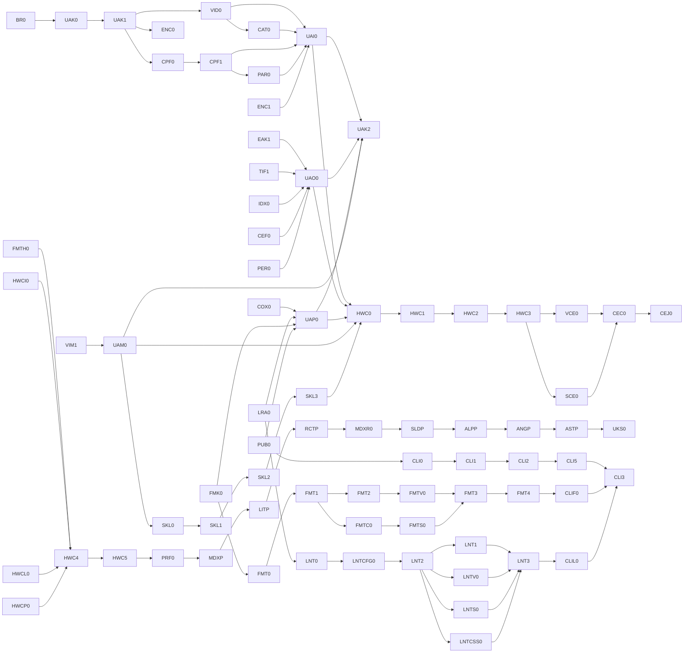

# Exact operative source-clause attachment — BR0

Schema: 1. Node: `BR0`. Clause count: 510. Generated from `provenance/source-coverage.toml`; every clause below is exact, operative, and applicable to this node.

### SRC-EXP-L416-7910DDE40F5C

- Kind: `forbidden`; source: `successor-expansion.md:416-416`; target: `contract:contracts/dag.md`; text SHA-256: `7910dde40f5c3e39affe4f34fdbcd47ac74b1b4cf2fd4fd1aa1bdb30f6e39162`.

~~~~markdown
Each slice is independently reviewable and has explicit deletion and abort criteria. Compiler work, if any, is a separate optional train and never a tooling-terminal predecessor.
~~~~

### SRC-EXP-L418-BBA2523B81D9

- Kind: `context`; source: `successor-expansion.md:418-418`; target: `contract:contracts/dag.md`; text SHA-256: `bba2523b81d9b89e8e5673c404731d57c343d37a94d58cf2125f9488915aa58c`.

~~~~markdown
### 5.4 Successor program ledger
~~~~

### SRC-EXP-L420-1A67D7EFFC63

- Kind: `deletion`; source: `successor-expansion.md:420-420`; target: `contract:contracts/dag.md`; text SHA-256: `1a67d7effc630acbb92747691a3dc75d82f233459ccbf79262e4c23fb48535dd`.

~~~~markdown
One repository-owned schema and validator governs every block state. Each record contains: schema epoch; charter ID and exact predecessor list; freeze scope/state; candidate commit/tree; accepted commit/tree; charter, manifest, authority-registry, DAG, corpus, and gate digests; reviewer identity/verdict receipts; maintainer decision; implementation and deletion receipts; landing-equivalence proof; and amendment impact closure.
~~~~

### SRC-EXP-L422-885F9DFFF524

- Kind: `requirement`; source: `successor-expansion.md:422-422`; target: `contract:contracts/dag.md`; text SHA-256: `885f9dfff524260d957e83b2cc8f17e196ca9844ac7590d98fc2763d31d91728`.

~~~~markdown
State recognizes two different events. An **invalidating amendment** changes an accepted basis and mechanically computes every affected downstream receipt; nothing in that closure remains accepted without an explicit revalidation. A **non-invalidating follow-up/version proposal** leaves the accepted contract/version and existing release receipts immutable and may gate only future work. A soak join such as `CEJ0` emits the latter by default; reopening `CEF0` or another accepted owner requires a separate maintainer impact decision naming the invalidation closure.
~~~~

### SRC-EXP-L424-9ABF27390259

- Kind: `requirement`; source: `successor-expansion.md:424-424`; target: `contract:contracts/dag.md`; text SHA-256: `9abf273902592827f124a491dfc0b35cce2641c978ca7e351b3e9e974afa2bf0`.

~~~~markdown
The validator rejects READY/ACCEPTED when a predecessor, digest, reviewer separation, final-tree equivalence, or required external genesis field is absent. A convergence block re-runs its declared invariants on one cumulative candidate; it cannot infer final-tree correctness by concatenating receipts from earlier candidate SHAs. The canonical node set/predecessors must equal generated tables, charter predecessor headers, dispatch manifests, and state records; node metadata must equal generated tables, dispatch/state records, and materialized charter front matter. An explicitly labeled non-normative diagram is excluded from equality and may draw only canonical direct edges or visibly labeled transitive summaries.
~~~~

### SRC-EXP-L426-7536279969B6

- Kind: `context`; source: `successor-expansion.md:426-426`; target: `contract:contracts/dag.md`; text SHA-256: `7536279969b60095cf5c2b4eef0b546b8eef29e660682256d3424052a5e7333f`.

~~~~markdown
## 6. Priority model and execution waves
~~~~

### SRC-EXP-L428-2BA13C8A5F6C

- Kind: `context`; source: `successor-expansion.md:428-428`; target: `contract:contracts/dag.md`; text SHA-256: `2ba13c8a5f6c5172975bd36fb440849905ae8d8ace8fbd04a693ea16ecb0949d`.

~~~~markdown
At each vertical feasibility lock, recalculate this ordinal hypothesis:
~~~~

### SRC-EXP-L430-4CBA5265E252

- Kind: `context`; source: `successor-expansion.md:430-430`; target: `contract:contracts/dag.md`; text SHA-256: `4cba5265e2526a18f52475a22420242679d606d4f7c172e54a4dae1477e6d953`.

~~~~markdown
`Priority = 30% marginal DX opportunity + 20% implementation economy + 20% ecosystem reach + 30% architectural unlockability`
~~~~

### SRC-EXP-L432-910D447C0231

- Kind: `forbidden`; source: `successor-expansion.md:432-432`; target: `contract:contracts/dag.md`; text SHA-256: `910d447c0231d2dcb644af659dabf7332a5a99fef4dbdb42077344589f9ce693`.

~~~~markdown
The score never overrides prerequisites or correctness. “Marginal DX” measures improvement over the strongest incumbent tooling, not raw feature count. Popularity surveys are self-selected and are evidence, not truth.
~~~~

### SRC-EXP-L434-53F9AE1C055E

- Kind: `requirement`; source: `successor-expansion.md:434-434`; target: `contract:contracts/dag.md`; text SHA-256: `53f9ae1c055e7b6f044037c2618627edb75a755c8bc9f0f050ec7b0afd5583b0`.

~~~~markdown
All factors use a 1–5 ordinal scale. `Economy` is high when implementation/support cost is low. Confidence is the quality of present evidence, not the probability of success. Scores are dated 2026-08-26 and must be rerun at the exact-release lock.
~~~~

### SRC-EXP-L436-5CDA6949EEF8

- Kind: `context`; source: `successor-expansion.md:436-436`; target: `contract:contracts/dag.md`; text SHA-256: `5cda6949eef8e584f11994ec11e88a4a32498b14c5634c64e0d8a0263592c0e3`.

~~~~markdown
| Target | DX | Economy | Reach | Unlock | Weighted | Confidence | Effort/support band | Hard prerequisites |
~~~~

### SRC-EXP-L437-03C55AE42B90

- Kind: `context`; source: `successor-expansion.md:437-437`; target: `contract:contracts/dag.md`; text SHA-256: `03c55ae42b90245e456b0cb22eb5eb849a8c1d9510ee856fcd04ca66feb21da4`.

~~~~markdown
|---|---:|---:|---:|---:|---:|---|---|---|
~~~~

### SRC-EXP-L438-89EBABB3A071

- Kind: `context`; source: `successor-expansion.md:438-438`; target: `contract:contracts/dag.md`; text SHA-256: `89ebabb3a0715c2eda45ae2a7a96f1aab382a29ba70edfbf30596b2b3f34b6d2`.

~~~~markdown
| MDX | 5 | 3 | 4 | 5 | **4.4** | Medium | M / M | kernel; bounded generic component provider; `MDXR0` is evidence and React-specific production waits `RCP2-FUTURE` |
~~~~

### SRC-EXP-L439-45DCAEE4DCDA

- Kind: `context`; source: `successor-expansion.md:439-439`; target: `contract:contracts/dag.md`; text SHA-256: `45dcaee4dcda45cdc740bedf83d5dc260babec1200ec6e5debd7ccb9031e2028`.

~~~~markdown
| HTML + Custom Elements | 3 | 4 | 5 | 5 | **4.2** | High | M / M | kernel; independent HTML parser proof |
~~~~

### SRC-EXP-L440-CBA6A0499B85

- Kind: `context`; source: `successor-expansion.md:440-440`; target: `contract:contracts/dag.md`; text SHA-256: `cba6a0499b854e04237a6f041a78ebcbd3fd05f56ae755ab92d500f04d018675`.

~~~~markdown
| React | 3 | 4 | 5 | 5 | **4.2** | Medium | M / H | TSX overlay/TypeInfo; no new parser |
~~~~

### SRC-EXP-L441-DD3D217FC370

- Kind: `context`; source: `successor-expansion.md:441-441`; target: `contract:contracts/dag.md`; text SHA-256: `dd3d217fc3704339f74f520fbad6b126fd0875a21df2da1f4c13d54c171f43f6`.

~~~~markdown
| Lit | 4 | 4 | 3 | 5 | **4.1** | Medium | S–M / M | embedding + HTML/WC |
~~~~

### SRC-EXP-L442-74532F742DCD

- Kind: `context`; source: `successor-expansion.md:442-442`; target: `contract:contracts/dag.md`; text SHA-256: `74532f742dcd22ffc20b8850a6d4a55f036f1d3714eb6dd6bc4f00e4b6ebec2c`.

~~~~markdown
| Alpine | 5 | 4 | 3 | 4 | **4.1** | Medium | M / M | neutral HTML + attribute claims |
~~~~

### SRC-EXP-L443-A82F904A7398

- Kind: `context`; source: `successor-expansion.md:443-443`; target: `contract:contracts/dag.md`; text SHA-256: `a82f904a7398f54e0a0a3cd1a58dce49b4ed36d8fcd333587c707be342312805`.

~~~~markdown
| HTMX | 5 | 5 | 3 | 3 | **4.0** | Medium | S / M | HTML + selector/route input seams |
~~~~

### SRC-EXP-L444-8DA1844210AB

- Kind: `context`; source: `successor-expansion.md:444-444`; target: `contract:contracts/dag.md`; text SHA-256: `8da1844210ab7b1fc3562810771bb972231a5306d15a4f5094d91c9cbf1ea1dc`.

~~~~markdown
| Solid | 4 | 4 | 3 | 4 | **3.8** | Medium | M / M | React proof immediately before it |
~~~~

### SRC-EXP-L445-59E11A769528

- Kind: `context`; source: `successor-expansion.md:445-445`; target: `contract:contracts/dag.md`; text SHA-256: `59e11a769528fd8ec55c9e31b6d76048ca884b9248e8d4a96ec449e6c607603a`.

~~~~markdown
| Astro tooling | 3 | 2 | 4 | 5 | **3.6** | Medium | L / H | dedicated-carrier proof; no compiler dependency |
~~~~

### SRC-EXP-L446-C028892F8ADF

- Kind: `context`; source: `successor-expansion.md:446-446`; target: `contract:contracts/dag.md`; text SHA-256: `c028892f8adfa93d445f4912ab5ba986aa8ced9bc42cb3c3a896c027d781562d`.

~~~~markdown
| Angular | 2 | 2 | 5 | 5 | **3.5** | High | XL / H | HTML, embedding, project association, grammar decision |
~~~~

### SRC-EXP-L447-44CA5D7BA666

- Kind: `context`; source: `successor-expansion.md:447-447`; target: `contract:contracts/dag.md`; text SHA-256: `44ca5d7ba666452aac77ea6066afe7ba48b36cfd54a7737e05f1e8dd6514d74a`.

~~~~markdown
| Preact | 3 | 5 | 3 | 3 | **3.4** | Medium | S / M | React; separate native/compat evidence |
~~~~

### SRC-EXP-L448-5847DA6E38CB

- Kind: `context`; source: `successor-expansion.md:448-448`; target: `contract:contracts/dag.md`; text SHA-256: `5847da6e38cbec9e7f88ca94511969285d3116ef02282e204abc51628ac9dba3`.

~~~~markdown
| Stencil | 3 | 3 | 2 | 4 | **3.1** | Medium | M / M | TSX + Custom Elements |
~~~~

### SRC-EXP-L449-3FC9B02B3C61

- Kind: `context`; source: `successor-expansion.md:449-449`; target: `contract:contracts/dag.md`; text SHA-256: `3fc9b02b3c610be366b8ff0f807bf3358c24306e0ded49f425d2166fed9536ae`.

~~~~markdown
| Ember/Glimmer | 3 | 1 | 2 | 4 | **2.7** | Low–medium | XL / H | dedicated/attached grammar and project layout |
~~~~

### SRC-EXP-L450-54E8541E9F55

- Kind: `requirement`; source: `successor-expansion.md:450-450`; target: `contract:contracts/dag.md`; text SHA-256: `54e8541e9f5595b2e148ce28f7b77e303d463458b060c87933c1fe1cfbe80eab`.

~~~~markdown
| Qwik 2 | 4 | 2 | 1 | 3 | **2.7, blocked** | Low | L / H | exact accepted Qwik 2 epoch; React/Solid overlay seams |
~~~~

### SRC-EXP-L451-1353FAFAB948

- Kind: `context`; source: `successor-expansion.md:451-451`; target: `contract:contracts/dag.md`; text SHA-256: `1353fafab948dbde464354e059461b8f5787c897078a7dc7850d4412edbb09a2`.

~~~~markdown
| Marko | 3 | 2 | 2 | 3 | **2.6** | Medium | L / M | dedicated-carrier proof |
~~~~

### SRC-EXP-L453-D0A3EB2084ED

- Kind: `forbidden`; source: `successor-expansion.md:453-453`; target: `contract:contracts/dag.md`; text SHA-256: `d0a3eb2084ed0b9105477f6d6854ad8fe0db8380b0df3ffcab97818ab1ebdcea`.

~~~~markdown
Project-profile hypotheses currently exist only for Next 4.2, Nuxt 4 3.3, and SvelteKit 3.1. Every other named project profile is explicitly unscored and deferred until its prerequisite vertical and independent feasibility evidence exist; table position must not be read as rank.
~~~~

### SRC-EXP-L455-BB9C793F7EB5

- Kind: `context`; source: `successor-expansion.md:455-455`; target: `contract:contracts/dag.md`; text SHA-256: `bb9c793f7eb56df20367a10af0d86bace396e11e2ccd62d9e1fa025683da6820`.

~~~~markdown
Architecture-falsification order is based on geometry, not the weighted market score:
~~~~

### SRC-EXP-L457-9D64328B50F0

- Kind: `context`; source: `successor-expansion.md:457-457`; target: `contract:contracts/dag.md`; text SHA-256: `9d64328b50f0ea6fe3fe44f11caa3496f28bfcea65ef8d703ae0c12a56ea53da`.

~~~~markdown
`HTML/WC → generic MDX → Lit → React → MDX/React provider → Solid → Alpine → Angular → Astro`
~~~~

### SRC-EXP-L459-DA79AB2B9ADF

- Kind: `context`; source: `successor-expansion.md:459-459`; target: `contract:contracts/dag.md`; text SHA-256: `da79ab2b9adf6feabc54cd753daf7d4ca751e3933e67243b583fa405264efa4a`.

~~~~markdown
Product-investment order after stable-kernel proof, applying hard prerequisites first and then non-increasing score with effort/support risk as the tie-breaker, is currently:
~~~~

### SRC-EXP-L461-E990218D2C81

- Kind: `context`; source: `successor-expansion.md:461-461`; target: `contract:contracts/dag.md`; text SHA-256: `e990218d2c81b4f629ae405caeec4cbb598feaeb623b38909ac84ba126d095d4`.

~~~~markdown
`HTML/WC foundation → bounded React provider → MDX → React → Lit → Alpine → HTMX → Solid → Astro → Angular → Preact → Stencil → niche/volatile`
~~~~

### SRC-EXP-L463-A14686F77F7A

- Kind: `context`; source: `successor-expansion.md:463-463`; target: `contract:contracts/dag.md`; text SHA-256: `a14686f77f7a35539200f07fed4d1b6bf90294f043b6359063fc92161c2319dd`.

~~~~markdown
The dated exception ledger is exhaustive:
~~~~

### SRC-EXP-L465-D7E4CAC6E57F

- Kind: `context`; source: `successor-expansion.md:465-465`; target: `contract:contracts/dag.md`; text SHA-256: `d7e4cac6e57f5de9b0398003e87b8427a9599416f079d87a2f64376cb91fbeba`.

~~~~markdown
| Sequence | Lower-scored work before higher-scored work | Why it is permitted | Expiry |
~~~~

### SRC-EXP-L466-831FE3C04DF7

- Kind: `context`; source: `successor-expansion.md:466-466`; target: `contract:contracts/dag.md`; text SHA-256: `831fe3c04df7a9636704897ab8a76cc59f773c34bfa6860f2a2c02e60a033832`.

~~~~markdown
|---|---|---|---|
~~~~

### SRC-EXP-L467-3E0B166B0917

- Kind: `context`; source: `successor-expansion.md:467-467`; target: `contract:contracts/dag.md`; text SHA-256: `3e0b166b09171edcfc6a4b7cec7653c1e1626b74c8b3f1f6ae81098877c4f13e`.

~~~~markdown
| Architecture proof | HTML/WC before MDX; Lit before React; Solid before Alpine; Angular before Astro | bounded geometry falsification only: neutral carrier/CE substrate, embedding/hole geometry, TSX anti-React counterproof, then external/inline attachment; these are not product promotions | each exception disappears when its named proof receipt is accepted |
~~~~

### SRC-EXP-L468-33D43C914D5D

- Kind: `requirement`; source: `successor-expansion.md:468-468`; target: `contract:contracts/dag.md`; text SHA-256: `33d43c914d5d0c2f3b8db3a1709659683fb394a545b221c9ef7dc9df94ec3573`.

~~~~markdown
| Product investment | HTML/WC 4.2 before MDX 4.4 | hard substrate/unlock for neutral HTML, CE interchange, Lit, Alpine, HTMX, and Angular; only the minimum foundation/Supported closure is admitted | HWC foundation/terminal receipt |
~~~~

### SRC-EXP-L469-2B42ED265AB2

- Kind: `context`; source: `successor-expansion.md:469-469`; target: `contract:contracts/dag.md`; text SHA-256: `2b42ed265ab2259978287f49a8b423f504bddd4453c6828d968352851068c1a3`.

~~~~markdown
| Product investment | bounded React-provider work before MDX 4.4 | the requested React-specific MDX auto-import/navigation contract cannot truthfully promote before `RCP2-FUTURE`; this does not pull the full React vertical ahead of MDX | `RCP2-FUTURE` receipt |
~~~~

### SRC-EXP-L471-7A9368921FF8

- Kind: `requirement`; source: `successor-expansion.md:471-471`; target: `contract:contracts/dag.md`; text SHA-256: `7a9368921ff80e56d6302dc1186ae03ff4ce88643531a6fed532abef599cf442`.

~~~~markdown
There is no popularity or preference override beyond this ledger. After those prerequisites, the product list is score-monotonic; Lit wins the 4.1 tie over Alpine on its smaller present effort band. A new inversion requires a dated amendment naming evidence, bounded scope, and expiry.
~~~~

### SRC-EXP-L473-BE45CFD2B30F

- Kind: `context`; source: `successor-expansion.md:473-473`; target: `contract:contracts/dag.md`; text SHA-256: `be45cfd2b30fd171b1cd6fed8b1636462321546fce878ccfe9284b44f2dd5d25`.

~~~~markdown
Recommended waves:
~~~~

### SRC-EXP-L475-63636FCE5096

- Kind: `context`; source: `successor-expansion.md:475-475`; target: `contract:contracts/dag.md`; text SHA-256: `63636fce50966a84d0fdc83a8dc50d85eed9d6d565b13193bda44c716f3f440f`.

~~~~markdown
1. **Wave 0:** obtain the repair-scoped freeze lift, ratify the Rev11 amendment, finish TCM/identity repairs and L4, then obtain a separate successor-genesis authorization.
~~~~

### SRC-EXP-L476-ECFE37F3A34D

- Kind: `requirement`; source: `successor-expansion.md:476-476`; target: `contract:contracts/dag.md`; text SHA-256: `ecfe37f3a34d090bca922c7806c957e40a6ab5117c9973c023649c9af65dda5f`.

~~~~markdown
2. **Wave 0.5:** close scoped kernel contracts as they become ready; start workflow skills from the manifest/governance lock and formatter, lint, and CLI from their own smallest contract locks. `UAK2` is read-only convergence, not their gate.
~~~~

### SRC-EXP-L477-4DED536E4614

- Kind: `context`; source: `successor-expansion.md:477-477`; target: `contract:contracts/dag.md`; text SHA-256: `4ded536e461493e7d091067417054f87f430e821b65947028fc656b006f862dd`.

~~~~markdown
3. **Wave 1:** HTML + Custom Elements, including explicit Vue and Svelte producer/consumer retrofits and the Vue embedded-template canary.
~~~~

### SRC-EXP-L478-B101F4E69AC6

- Kind: `context`; source: `successor-expansion.md:478-478`; target: `contract:contracts/dag.md`; text SHA-256: `b101f4e69ac6c6b68781ab6c287ea9e612d25e04322f76dc015d88a1fe5b4510`.

~~~~markdown
4. **Wave 2:** sequential architecture falsification slices: generic MDX → Lit → React → React-in-MDX provider → Solid → Alpine → Angular → Astro.
~~~~

### SRC-EXP-L479-EE958BCEA3B0

- Kind: `context`; source: `successor-expansion.md:479-479`; target: `contract:contracts/dag.md`; text SHA-256: `ee958bcea3b04b9b1b686ee6d7bb2d3486d4e3fdef898412434e32661d82348b`.

~~~~markdown
5. **Wave 3:** finish the HTML/WC public foundation/Supported closure, promote the bounded React component provider, then implement the full MDX vertical; generic MDX can advance earlier, but React-specific auto-import/navigation cannot promote before `RCP2-FUTURE`.
~~~~

### SRC-EXP-L480-957524B4B633

- Kind: `context`; source: `successor-expansion.md:480-480`; target: `contract:contracts/dag.md`; text SHA-256: `957524b4b6336a2a081345e733ff5b1c9fa45f313c9b637129dd6ca9e37b75a6`.

~~~~markdown
6. **Wave 4:** React, Lit, Alpine, HTMX, Solid, Astro tooling, Angular, Preact, and Stencil in current score/tie-break order after their prerequisites. Astro remains a first-class tooling vertical; this ordering makes no compiler commitment.
~~~~

### SRC-EXP-L481-B1A64EDEFEE5

- Kind: `context`; source: `successor-expansion.md:481-481`; target: `contract:contracts/dag.md`; text SHA-256: `b1a64edefee521e4b3f671ef8628ed4a66669a0adddb1e5753fab1c6bf242723`.

~~~~markdown
7. **Wave 5:** project profiles beginning with Next. Nuxt and SvelteKit counterexample fixtures precede stable project-vocabulary ratification.
~~~~

### SRC-EXP-L482-00557DAC4B84

- Kind: `requirement`; source: `successor-expansion.md:482-482`; target: `contract:contracts/dag.md`; text SHA-256: `00557dac4b8405109a91d8bc1aea04157d95d98e17fb3bb64b94d35e9f69579e`.

~~~~markdown
8. **Wave 6:** Marko, Ember/Glimmer, and Qwik 2 when its exact release gate is satisfied.
~~~~

### SRC-EXP-L484-5D039D44EA60

- Kind: `context`; source: `successor-expansion.md:484-484`; target: `contract:contracts/dag.md`; text SHA-256: `5d039d44ea60309eeed9106ce7c71831dc4633c6cfe79dcb9c6701f7522c2c75`.

~~~~markdown
The sequence is deliberately revisable at each lock using measured support burden, preview telemetry, incumbent-tool gaps, and implementation evidence. Architecture and correctness gates are not revisable by popularity.
~~~~

### SRC-EXP-L486-B016D008188F

- Kind: `context`; source: `successor-expansion.md:486-486`; target: `contract:contracts/dag.md`; text SHA-256: `b016d008188ffb8c712c314c24a31a6569deda73794e5729e6578f474538859f`.

~~~~markdown
## 7. Active successor DAG
~~~~

### SRC-EXP-L488-CFB601BB77C9

- Kind: `requirement`; source: `successor-expansion.md:488-488`; target: `contract:contracts/dag.md`; text SHA-256: `cfb601bb77c9d3ff866030fce6733a25d9172ddc217e2eb451b7d735b7672b76`.

~~~~markdown
`BR0` is the only in-program entry, but it is not creatable or READY merely because it has no in-program predecessor. The successor ledger must validate two external authorities described in `BR0`: the repair-scoped freeze lift and, after accepted L4, a distinct successor-genesis authorization. The graph has no dependency on a future full vertical or project profile.
~~~~

### SRC-EXP-L490-2D8539A4DD02

- Kind: `context`; source: `successor-expansion.md:490-490`; target: `contract:contracts/dag.md`; text SHA-256: `2d8539a4dd02d26fcf71f2e472617c4a9d4d1cedfbd79b43de1dc545071e45b8`.

~~~~markdown
The following diagram is explicitly **non-normative**. Every solid arrow shown is a canonical direct edge; omitted edges remain authoritative in TOML.
~~~~

### SRC-EXP-L492-253E08811C46

- Kind: `context`; source: `successor-expansion.md:492-541`; target: `contract:contracts/dag.md`; text SHA-256: `253e08811c46abc9432d08356fd48ec583ae6daf2ac988cd0e3abd461ae5089e`.

~~~~markdown

~~~~

### SRC-EXP-L543-3CC83E4286AB

- Kind: `requirement`; source: `successor-expansion.md:543-543`; target: `contract:contracts/dag.md`; text SHA-256: `3cc83e4286ab866db9ae248b41130f05f07eb62af4d29a01044728db7728c052`.

~~~~markdown
The TOML below is the sole canonical graph and node-classification ledger. Charter headers, dispatch plans, generated tables, and state files are generated or validated against it. Wildcards and prose-only predecessor aliases are invalid.
~~~~

### SRC-EXP-L545-644F6ECD1F79

- Kind: `context`; source: `successor-expansion.md:545-546`; target: `contract:contracts/dag.md`; text SHA-256: `644f6ecd1f7900a7cc5061a6218e013a56e2fc20d1aa288b174abefbe32bdac1`.

~~~~markdown
```toml
schema = 2
~~~~

### SRC-EXP-L548-FB8CB5A084FA

- Kind: `context`; source: `successor-expansion.md:548-637`; target: `contract:contracts/dag.md`; text SHA-256: `fb8cb5a084fa81d7a1da799147a7b9b7dbe8c397901b8d5917845eefad7e0b0f`.

~~~~markdown
[predecessors]
BR0 = []
UAK0 = ["BR0"]
UAK1 = ["UAK0"]
VID0 = ["UAK1"]
CAT0 = ["UAK1", "VID0"]
CPF0 = ["UAK1", "VID0"]
CPF1 = ["CPF0", "CAT0"]
PAR0 = ["CPF1", "VID0"]
ENC0 = ["UAK1"]
ENCL0 = ["ENC0"]
ENCT0 = ["ENC0"]
ENCF0 = ["ENC0"]
ENC1 = ["ENCL0", "ENCT0", "ENCF0"]
CFG0 = ["CAT0"]
DEM0 = ["CAT0", "VID0", "CFG0"]
EAK0 = ["PAR0", "DEM0"]
EMB0 = ["EAK0", "ENC1"]
TIF0 = ["DEM0", "ENC1"]
TIF1 = ["TIF0", "CAT0"]
IDX0 = ["TIF1", "DEM0"]
CEF0 = ["TIF1", "IDX0", "VID0"]
COX0 = ["DEM0", "IDX0"]
LRA0 = ["CFG0", "TIF1", "IDX0"]
FMK0 = ["PAR0", "EMB0", "ENC1", "CFG0"]
PER0 = ["DEM0", "ENC1", "TIF0", "IDX0", "PAR0"]
PUB0 = ["ENC1", "TIF1", "LRA0", "FMK0", "COX0", "PER0"]
VIM0 = ["CAT0", "PAR0", "DEM0"]
VIM1 = ["VIM0", "CEF0", "COX0", "LRA0", "FMK0", "PUB0", "PER0"]
EAK1 = ["EMB0", "TIF0"]
UAI0 = ["VID0", "CAT0", "CPF1", "PAR0", "ENC1"]
UAO0 = ["CFG0", "DEM0", "EAK1", "TIF1", "IDX0", "CEF0", "PER0"]
UAP0 = ["COX0", "LRA0", "FMK0", "PUB0"]
UAM0 = ["VIM1"]
UAK2 = ["UAI0", "UAO0", "UAP0", "UAM0"]
SKL0 = ["UAM0"]
SKL1 = ["SKL0", "VIM1"]
SKL2 = ["SKL1"]
SKL3 = ["SKL2"]
FMT0 = ["FMK0"]
FMT1 = ["FMT0"]
FCFG0 = ["FMT0", "FMK0", "CFG0"]
FMT2 = ["FMT1", "FCFG0"]
FMTC0 = ["FMT1", "FCFG0"]
HWC0 = ["UAI0", "UAO0", "UAP0", "UAM0", "SKL3"]
HWC1 = ["HWC0", "PAR0", "ENC1"]
HWC2 = ["HWC1", "TIF1", "IDX0"]
HWC3 = ["HWC2", "CEF0"]
FMTH0 = ["FMT1", "FCFG0", "HWC2", "PUB0", "PER0"]
HWCI0 = ["HWC2", "HWC3", "COX0", "PUB0"]
HWCL0 = ["HWC2", "HWC3", "LRA0"]
HWCP0 = ["HWC2", "HWC3", "PUB0"]
HWC4 = ["FMTH0", "HWCI0", "HWCL0", "HWCP0"]
HWC5 = ["HWC4", "PER0", "VIM1"]
VCE0 = ["HWC3", "EAK1", "SKL3"]
SCE0 = ["HWC3", "CPF1", "SKL3"]
CEC0 = ["VCE0", "SCE0"]
CEJ0 = ["CEC0"]
FMTV0 = ["FMT2", "FMTC0", "CPF1"]
FMTS0 = ["FMT2", "FMTC0", "CPF1"]
FMT3 = ["FMTH0", "FMTV0", "FMTS0"]
FMT4 = ["FMT3", "PUB0", "PER0"]
PRF0 = ["HWC5", "CEJ0", "UAK2", "FMT1", "PUB0"]
MDXP = ["PRF0"]
LITP = ["MDXP", "EMB0", "HWC3"]
RCTP = ["LITP", "TIF1"]
MDXR0 = ["RCTP", "MDXP", "IDX0"]
SLDP = ["MDXR0"]
ALPP = ["SLDP", "HWC2"]
ANGP = ["ALPP", "HWC2", "EMB0", "PAR0"]
ASTP = ["ANGP", "PAR0", "EMB0"]
UKS0 = ["MDXP", "LITP", "RCTP", "MDXR0", "SLDP", "ALPP", "ANGP", "ASTP", "HWC5", "CEJ0"]
LNT0 = ["LRA0", "CFG0"]
LNTCFG0 = ["LNT0", "LRA0", "CFG0"]
LNT2 = ["LNTCFG0"]
LNT1 = ["LNT2"]
LNTV0 = ["LNT2"]
LNTS0 = ["LNT2"]
LNTCSS0 = ["LNT2"]
LNT3 = ["LNT1", "LNTV0", "LNTS0", "LNTCSS0", "PUB0", "PER0"]
CLI0 = ["PUB0"]
CLI1 = ["CLI0"]
CLI2 = ["CLI1", "TIF0"]
CLITS0 = ["CLI1"]
CLIC0 = ["CLI1", "CPF1"]
CLI4 = ["CLI1", "TIF1"]
CLI5 = ["CLI2", "CLITS0", "CLIC0", "CLI4", "PER0"]
CLIF0 = ["CLI1", "FMT4"]
CLIL0 = ["CLI1", "LNT3"]
CLI3 = ["CLI5", "CLIF0", "CLIL0"]
~~~~

### SRC-EXP-L639-3936BBB694E5

- Kind: `context`; source: `successor-expansion.md:639-729`; target: `contract:contracts/dag.md`; text SHA-256: `3936bbb694e5ee574e73886c119fea703ce4669bbaa6288275cfdd6eb39216f5`.

~~~~markdown
[node]
BR0 = { kind = "genesis", product = "governance", release_gating = "external" }
UAK0 = { kind = "audit", product = "kernel", release_gating = "none" }
UAK1 = { kind = "constitution", product = "kernel", release_gating = "none" }
VID0 = { kind = "contract", product = "kernel", release_gating = "none" }
CAT0 = { kind = "contract", product = "kernel", release_gating = "none" }
CPF0 = { kind = "proof", product = "kernel", release_gating = "none" }
CPF1 = { kind = "cutover", product = "kernel", release_gating = "none" }
PAR0 = { kind = "contract", product = "kernel", release_gating = "none" }
ENC0 = { kind = "contract", product = "kernel", release_gating = "none" }
ENCL0 = { kind = "cutover", product = "kernel", release_gating = "none" }
ENCT0 = { kind = "verifier", product = "kernel", release_gating = "none" }
ENCF0 = { kind = "cutover", product = "kernel", release_gating = "none" }
ENC1 = { kind = "convergence", product = "kernel", release_gating = "none" }
CFG0 = { kind = "contract", product = "kernel", release_gating = "none" }
DEM0 = { kind = "contract", product = "kernel", release_gating = "none" }
EAK0 = { kind = "contract", product = "kernel", release_gating = "none" }
EMB0 = { kind = "contract", product = "kernel", release_gating = "none" }
TIF0 = { kind = "contract", product = "kernel", release_gating = "none" }
TIF1 = { kind = "cutover", product = "kernel", release_gating = "none" }
IDX0 = { kind = "implementation", product = "kernel", release_gating = "none" }
CEF0 = { kind = "contract", product = "kernel", release_gating = "none" }
COX0 = { kind = "cutover", product = "kernel", release_gating = "none" }
LRA0 = { kind = "contract", product = "kernel", release_gating = "none" }
FMK0 = { kind = "contract", product = "kernel", release_gating = "none" }
PER0 = { kind = "verification", product = "kernel", release_gating = "none" }
PUB0 = { kind = "contract", product = "kernel", release_gating = "none" }
VIM0 = { kind = "contract", product = "kernel", release_gating = "none" }
VIM1 = { kind = "implementation", product = "kernel", release_gating = "none" }
EAK1 = { kind = "canary", product = "kernel", release_gating = "none" }
UAI0 = { kind = "convergence", product = "kernel", release_gating = "contract" }
UAO0 = { kind = "convergence", product = "kernel", release_gating = "contract" }
UAP0 = { kind = "convergence", product = "kernel", release_gating = "contract" }
UAM0 = { kind = "convergence", product = "kernel", release_gating = "contract" }
UAK2 = { kind = "convergence", product = "kernel", release_gating = "non_release" }
SKL0 = { kind = "audit", product = "skills", release_gating = "none" }
SKL1 = { kind = "implementation", product = "skills", release_gating = "none" }
SKL2 = { kind = "verification", product = "skills", release_gating = "none" }
SKL3 = { kind = "cutover", product = "skills", release_gating = "workflow" }
FMT0 = { kind = "lock", product = "formatter", release_gating = "none" }
FMT1 = { kind = "implementation", product = "formatter", release_gating = "none" }
FCFG0 = { kind = "translator", product = "formatter", release_gating = "none" }
FMT2 = { kind = "implementation", product = "formatter", release_gating = "none" }
FMTC0 = { kind = "implementation", product = "formatter", release_gating = "none" }
HWC0 = { kind = "lock", product = "html_wc", release_gating = "none" }
HWC1 = { kind = "implementation", product = "html_wc", release_gating = "none" }
HWC2 = { kind = "implementation", product = "html_wc", release_gating = "none" }
HWC3 = { kind = "implementation", product = "html_wc", release_gating = "none" }
FMTH0 = { kind = "implementation", product = "formatter", release_gating = "none" }
HWCI0 = { kind = "implementation", product = "html_wc", release_gating = "none" }
HWCL0 = { kind = "implementation", product = "html_wc", release_gating = "none" }
HWCP0 = { kind = "adapter", product = "html_wc", release_gating = "none" }
HWC4 = { kind = "convergence", product = "html_wc", release_gating = "none" }
HWC5 = { kind = "terminal", product = "html_wc", release_gating = "product" }
VCE0 = { kind = "terminal", product = "vue_ce", release_gating = "product" }
SCE0 = { kind = "terminal", product = "svelte_ce", release_gating = "product" }
CEC0 = { kind = "cutover", product = "custom_elements", release_gating = "none" }
CEJ0 = { kind = "soak", product = "custom_elements", release_gating = "non_release" }
FMTV0 = { kind = "cutover", product = "formatter", release_gating = "none" }
FMTS0 = { kind = "cutover", product = "formatter", release_gating = "none" }
FMT3 = { kind = "cutover", product = "formatter", release_gating = "none" }
FMT4 = { kind = "terminal", product = "formatter", release_gating = "product" }
PRF0 = { kind = "lock", product = "architecture_proof", release_gating = "none" }
MDXP = { kind = "proof", product = "architecture_proof", release_gating = "none" }
LITP = { kind = "proof", product = "architecture_proof", release_gating = "none" }
RCTP = { kind = "proof", product = "architecture_proof", release_gating = "none" }
MDXR0 = { kind = "proof", product = "architecture_proof", release_gating = "none" }
SLDP = { kind = "proof", product = "architecture_proof", release_gating = "none" }
ALPP = { kind = "proof", product = "architecture_proof", release_gating = "none" }
ANGP = { kind = "proof", product = "architecture_proof", release_gating = "none" }
ASTP = { kind = "proof", product = "architecture_proof", release_gating = "none" }
UKS0 = { kind = "convergence", product = "architecture_proof", release_gating = "non_release" }
LNT0 = { kind = "lock", product = "lint", release_gating = "none" }
LNTCFG0 = { kind = "translator", product = "lint", release_gating = "none" }
LNT2 = { kind = "implementation", product = "lint", release_gating = "none" }
LNT1 = { kind = "implementation", product = "lint", release_gating = "none" }
LNTV0 = { kind = "implementation", product = "lint", release_gating = "none" }
LNTS0 = { kind = "implementation", product = "lint", release_gating = "none" }
LNTCSS0 = { kind = "implementation", product = "lint", release_gating = "none" }
LNT3 = { kind = "terminal", product = "lint", release_gating = "product" }
CLI0 = { kind = "lock", product = "cli", release_gating = "none" }
CLI1 = { kind = "implementation", product = "cli", release_gating = "none" }
CLI2 = { kind = "adapter", product = "cli", release_gating = "none" }
CLITS0 = { kind = "adapter", product = "cli", release_gating = "none" }
CLIC0 = { kind = "adapter", product = "cli", release_gating = "none" }
CLI4 = { kind = "adapter", product = "cli", release_gating = "none" }
CLI5 = { kind = "terminal", product = "cli", release_gating = "product" }
CLIF0 = { kind = "adapter", product = "cli", release_gating = "none" }
CLIL0 = { kind = "adapter", product = "cli", release_gating = "none" }
CLI3 = { kind = "terminal", product = "cli", release_gating = "product" }
```
~~~~

### SRC-EXP-L731-5A72EBAE9C05

- Kind: `context`; source: `successor-expansion.md:731-731`; target: `contract:contracts/dag.md`; text SHA-256: `5a72ebae9c05ff9a040de8974407d7579cf4d1a0d195294042907b44b43edb63`.

~~~~markdown
`release_gating` is closed vocabulary: `external` means genesis authority, `contract` means a scoped architecture lock usable by downstream work, `workflow` means repository workflow activation, `product` means independently promotable user-facing terminal, `non_release` means soak/convergence only, and `none` means no promotion decision.
~~~~

### SRC-EXP-L733-33427606613B

- Kind: `requirement`; source: `successor-expansion.md:733-733`; target: `contract:contracts/dag.md`; text SHA-256: `33427606613b9a85ac74f81b1dc7bcb40233e1a99b6c349c4bce7ec73689eb29`.

~~~~markdown
The graph has two structural sinks, `CLI3` and `UKS0`, but no node joins them. Structural sink count is not release policy: the metadata makes `HWC5`, `VCE0`, `SCE0`, `FMT4`, `LNT3`, `CLI5`, and `CLI3` independently promotable product terminals even when downstream adapters or soak tests consume them. `CEJ0` and `UKS0` are non-release joins. `CLI5` packages the base CLI without formatter or lint; `CLI3` can promote the installed aggregate commands only after base packaging plus formatter/lint adapters.
~~~~

### SRC-EXP-L735-E2F07B345F21

- Kind: `context`; source: `successor-expansion.md:735-735`; target: `contract:contracts/dag.md`; text SHA-256: `e2f07b345f2162b40589b30e1bed89c63286bf4b38e96d29b3ade126180604fa`.

~~~~markdown
## 8. Charter specification rules
~~~~

### SRC-EXP-L737-6A367A0EBE55

- Kind: `requirement`; source: `successor-expansion.md:737-737`; target: `contract:contracts/dag.md`; text SHA-256: `6a367a0ebe5557f822ce552b0f679beaf4eaa6d8b3c49309e62fb86366913e44`.

~~~~markdown
Every charter below is a copy-ready specification for a future `charters/<ID>.md`. Materialization imports `kind`, `product`, `release_gating`, and exact predecessors from canonical TOML front matter. Before dispatch it must additionally pin exact paths, corpus revisions, numeric gates, candidate base, authority digest, and reviewer identities. Those values may not be invented by the implementer.
~~~~

### SRC-EXP-L739-716F1C0C19F4

- Kind: `context`; source: `successor-expansion.md:739-739`; target: `contract:contracts/dag.md`; text SHA-256: `716f1c0c19f48c03a402094b7fa58edde2f69204a94c8736e8781a43bea08957`.

~~~~markdown
Each charter contains:
~~~~

### SRC-EXP-L741-20A567595F61

- Kind: `context`; source: `successor-expansion.md:741-741`; target: `contract:contracts/dag.md`; text SHA-256: `20a567595f61ca18aed6707cf86f9841cfcb057eb0786b2c0e7f60a33f59eb31`.

~~~~markdown
- **Intent** — the one authority or observable outcome it owns;
~~~~

### SRC-EXP-L742-9890D8E9BDE9

- Kind: `acceptance`; source: `successor-expansion.md:742-742`; target: `contract:contracts/dag.md`; text SHA-256: `9890d8e9bde96e32227aebca6c61d6f2a5a379d49c7c49c295a77b68b057d9de`.

~~~~markdown
- **Predecessors** — acceptance dependencies, not suggestions;
~~~~

### SRC-EXP-L743-8116971A4C3B

- Kind: `context`; source: `successor-expansion.md:743-743`; target: `contract:contracts/dag.md`; text SHA-256: `8116971a4c3ba6df8715107bf039bf7dee599658c1cca767966d3b17532c3af8`.

~~~~markdown
- **Subblocks** — PR-sized, reviewable units; each subblock has one coherent mutation surface;
~~~~

### SRC-EXP-L744-87BE5F4B18F5

- Kind: `acceptance`; source: `successor-expansion.md:744-744`; target: `contract:contracts/dag.md`; text SHA-256: `87be5f4b18f5acfaad02d6aac72d53648553cb6b99f147dd8d31bcd3c72ccf74`.

~~~~markdown
- **Acceptance** — externally observable proof required to close;
~~~~

### SRC-EXP-L745-1BC43EC5D4FF

- Kind: `forbidden`; source: `successor-expansion.md:745-745`; target: `contract:contracts/dag.md`; text SHA-256: `1bc43ec5d4ffeb66a06bb4c5bbc2fa5776cf63e1cfd32c25994f092372cc3e79`.

~~~~markdown
- **Forbidden** — attractive but invalid shortcuts;
~~~~

### SRC-EXP-L746-A3500067A520

- Kind: `deletion`; source: `successor-expansion.md:746-746`; target: `contract:contracts/dag.md`; text SHA-256: `a3500067a5206e01240815bf2fb5c35014404f0c3e4b10e8264e7bbca2cb2f4c`.

~~~~markdown
- **Deletion/abort** — displaced authority to delete, and evidence that requires rescope rather than compromise.
~~~~

### SRC-EXP-L748-6CC848649358

- Kind: `requirement`; source: `successor-expansion.md:748-748`; target: `contract:contracts/dag.md`; text SHA-256: `6cc848649358ec806e2010ada120ac34d74c50728e111af3aee9d3eb76a96a6c`.

~~~~markdown
The default review cycle is author → mechanical gates → conformance reviewer → architecture reviewer → adversarial reviewer → fixes → all three re-review the same exact candidate. A review that edits the candidate invalidates its own verdict.
~~~~

### SRC-EXP-L750-02C3F91A59ED

- Kind: `context`; source: `successor-expansion.md:750-750`; target: `contract:contracts/dag.md`; text SHA-256: `02c3f91a59ed19c84026867a9a392668de6bb6e3a66799374d0494c3ff6732fe`.

~~~~markdown
## 9. Bridge and kernel charters
~~~~

### SRC-EXP-L752-AF4390650776

- Kind: `context`; source: `successor-expansion.md:752-752`; target: `node:BR0`; text SHA-256: `af439065077685814b7b84c2b5b799b867da289b3acc9f31a38074fd7a49730e`.

~~~~markdown
### `BR0.md` — Accepted Rev11/TCM successor handoff
~~~~

### SRC-EXP-L754-2541E7577AE5

- Kind: `forbidden`; source: `successor-expansion.md:754-759`; target: `node:BR0`; text SHA-256: `2541e7577ae5c9fdb20cf649f32536832e148caa73ed64c57f4b504f4c9b5093`.

~~~~markdown
**Intent:** create the only legal, immutable basis for the successor through two machine-validated external authorities; `BR0` cannot exist or become READY under only the repair-scoped freeze lift.
**Predecessors:** none inside this proposal. Receipt A names the maintainer’s Rev11 repair-scoped freeze lift and accepted amendment. Receipt B is a distinct post-L4 maintainer decision authorizing creation, ratification, and dispatch of the successor genesis block plus the named successor scope. The genesis record also names accepted TCM0–TCM4, SourceUnitId repair, K3/L1/L2 revalidation, L4, final commit/tree, and clean-state identities.
**Subblocks:** (1) define `successor-genesis.toml` with separate repair and successor-authority receipts; (2) validate amendment/TCM/SourceUnitId/ADR/UTF-8 observation-identity receipts and live edges; (3) verify `TCM4→K3→L1→L2→L4` plus every identity-repair invalidation/revalidation edge; (4) bind activation/deletion, backend, coordinate, performance, charter, ADR, and ruling digests; (5) after L4, capture successor authorization, re-hash the final commit/tree, and publish the authority index; (6) make the ledger reject creation/READY when either authority or any field/digest is absent, overbroad, or stale.
**Acceptance:** the validator reconstructs every cited identity from the accepted tree, proves TCM/identity repairs upstream of L4, distinguishes the two maintainer decisions, and records exact amendment invalidation closure; no blocking/open claim is presented as accepted.
**Forbidden:** using repair authority to dispatch successor work, treating a stored ruling as ratified, manually setting `BR0` READY, or using a worktree/branch other than the accepted integration identity.
**Deletion/abort:** supersede every old proposal premise tied to `323bc7f…`; abort if the freeze is not explicitly lifted for this amendment or Rev11 reaches L4 without activated-TCM soak/performance evidence.
~~~~

### SRC-LEGACY-TRANSFER-4D55354FFACC

- Kind: `requirement`; source: `legacy-architecture-transfers.md:306-311`; target: `node:UAK0`; text SHA-256: `e9e6a68bdb6ed42098ee6710019da276f3233dda3d235b981c3b7abcaf7437c7`.

~~~~markdown
### LEGACY-TRANSFER-4D55354FFACC

- Original path: `docs/arch/memos/release-candidate-merge-review.md`; Git blob: `4d55354ffacc3dd3e9e67a61abfccfd69f6a58d2`; exact source SHA-256: `f98eb2e9e60857cdb38be00aa6d49a66adb62f7944d779be2bedbd55ac1ef27b`.
- Exact retained source: `sources/legacy-architecture-transfers/memos/release-candidate-merge-review.md`.
- Applicable authority: `UAK0`, `BR0`.
- Binding: every durable requirement in the exact retained source remains operative for the applicable authority. Text that explicitly records implementation archaeology, a rejected alternative, or a superseded observation is non-operative.
~~~~

### SRC-LEGACY-TRANSFER-A57450E4B7D4

- Kind: `requirement`; source: `legacy-architecture-transfers.md:460-465`; target: `node:BR0`; text SHA-256: `18f448b4e290684fb32916db700b07a407f4cfd126b73c9b9aeb101a40b020b7`.

~~~~markdown
### LEGACY-TRANSFER-A57450E4B7D4

- Original path: `docs/arch/release-state.md`; Git blob: `a57450e4b7d4125ad0f11a1cf76d925022bcca23`; exact source SHA-256: `1187d2acf0a99b0447227f8e05c863a3e2630333ac7f1f9c2b18f7430b12a3aa`.
- Exact retained source: `sources/legacy-architecture-transfers/release-state.md`.
- Applicable authority: `BR0`.
- Binding: every durable requirement in the exact retained source remains operative for the applicable authority. Text that explicitly records implementation archaeology, a rejected alternative, or a superseded observation is non-operative.
~~~~

### SRC-ORCH-L1-0B3D2393E277

- Kind: `context`; source: `orchestration-findings.md:1-1`; target: `contract:contracts/reviews.md`; text SHA-256: `0b3d2393e277386d153e4090d311912f9334d791fc621d923369d56b86c291ee`.

~~~~markdown
# Rev11 orchestration / rescoping findings for Codex PRO
~~~~

### SRC-ORCH-L1001-390A25757D23

- Kind: `context`; source: `orchestration-findings.md:1001-1001`; target: `contract:contracts/orchestration.md`; text SHA-256: `390a25757d23a278689ae5bb91673342dd5f0bd2d5090342351ea8a03a58587b`.

~~~~markdown
A conflict-free Git merge does not guarantee semantic compatibility.
~~~~

### SRC-ORCH-L1003-5B4AFA0BA728

- Kind: `context`; source: `orchestration-findings.md:1003-1003`; target: `contract:contracts/orchestration.md`; text SHA-256: `5b4afa0ba728bb8c074ae08a93bddaa81060144b28d476f40d14982ccce023e8`.

~~~~markdown
Therefore after combining independently accepted candidates, run an integration gate appropriate to the touched conflict domains.
~~~~

### SRC-ORCH-L1005-9217670C254C

- Kind: `context`; source: `orchestration-findings.md:1005-1005`; target: `contract:contracts/orchestration.md`; text SHA-256: `9217670c254cb269147bd0bc7290dfb677e023ebc50c4de19809bde1a6210647`.

~~~~markdown
It does not necessarily need to rerun every expensive block-specific test.
~~~~

### SRC-ORCH-L1007-F90A0FE2093D

- Kind: `context`; source: `orchestration-findings.md:1007-1007`; target: `contract:contracts/orchestration.md`; text SHA-256: `f90a0fe2093d6a3a57fbc0a765b83f8648600b160c87ff8497277dd11f83b2ff`.

~~~~markdown
Think:
~~~~

### SRC-ORCH-L1009-2F696ADD730B

- Kind: `acceptance`; source: `orchestration-findings.md:1009-1013`; target: `contract:contracts/orchestration.md`; text SHA-256: `2f696add730b7dcb7054532414e7b3ebec92ed43e730225402dfb97b0fa76f9d`.

~~~~markdown
```text
block-specific acceptance gate
        +
cross-block integration gate
```
~~~~

### SRC-ORCH-L1015-ABFAECFAF38C

- Kind: `context`; source: `orchestration-findings.md:1015-1015`; target: `contract:contracts/orchestration.md`; text SHA-256: `abfaecfaf38cd7e27acf2204cf5de35b940809be270ef6e815df08947b5aeb20`.

~~~~markdown
The latter checks what could have changed because of concurrent integration.
~~~~

### SRC-ORCH-L1017-F52D711103D5

- Kind: `context`; source: `orchestration-findings.md:1017-1017`; target: `contract:contracts/orchestration.md`; text SHA-256: `f52d711103d50a437830c6fbcd04fb4bab49a0f82f6d26d1c791c6e8488dd090`.

~~~~markdown
---
~~~~

### SRC-ORCH-L1019-2330412FC4E5

- Kind: `context`; source: `orchestration-findings.md:1019-1019`; target: `contract:contracts/orchestration.md`; text SHA-256: `2330412fc4e554e0e2ca75205efaedc2ddb9e23ed81fdb30341f838d8bf43b5a`.

~~~~markdown
# 23. Avoid landing-time ledger work becoming the critical path
~~~~

### SRC-ORCH-L1021-A3E0FB72BD48

- Kind: `context`; source: `orchestration-findings.md:1021-1021`; target: `contract:contracts/orchestration.md`; text SHA-256: `a3e0fb72bd48f2a8c4e3f7d0044b7271de7e2b8fca7b491fd33ddc007b23df83`.

~~~~markdown
The landing path should be short:
~~~~

### SRC-ORCH-L1023-8425307C16CA

- Kind: `context`; source: `orchestration-findings.md:1023-1033`; target: `contract:contracts/orchestration.md`; text SHA-256: `8425307c16cada1f8d4597fc14fdffd7f7b7745e0d34106f1a692e0ea69fb55a`.

~~~~markdown
```text
candidate accepted
      ↓
integration compatibility check
      ↓
merge into architecture-lock
      ↓
tiny immutable receipt
      ↓
READY frontier recomputed
```
~~~~

### SRC-ORCH-L1035-46961CDE2D61

- Kind: `context`; source: `orchestration-findings.md:1035-1035`; target: `contract:contracts/orchestration.md`; text SHA-256: `46961cde2d61623a9e7dff42aa3e0eb0134aec4414a659ea4cf8170d6e748e5a`.

~~~~markdown
Avoid:
~~~~

### SRC-ORCH-L1037-D93E30A9AA73

- Kind: `context`; source: `orchestration-findings.md:1037-1043`; target: `contract:contracts/orchestration.md`; text SHA-256: `d93e30a9aa73bdb50565bff3aaffcb0352eb212e912d7754edbf7eaa59f791b1`.

~~~~markdown
```text
rewrite several central docs
recalculate hand-maintained SHAs
change duplicated state tables
repair generated-but-manually-edited summaries
rerun document ratification
```
~~~~

### SRC-ORCH-L1045-8A0305F31FEB

- Kind: `context`; source: `orchestration-findings.md:1045-1045`; target: `contract:contracts/orchestration.md`; text SHA-256: `8a0305f31feb116d501a041b52be18b3d01988ab12f88d8b7402deb0c7755aac`.

~~~~markdown
for ordinary accepted blocks.
~~~~

### SRC-ORCH-L1047-F52D711103D5

- Kind: `context`; source: `orchestration-findings.md:1047-1047`; target: `contract:contracts/orchestration.md`; text SHA-256: `f52d711103d50a437830c6fbcd04fb4bab49a0f82f6d26d1c791c6e8488dd090`.

~~~~markdown
---
~~~~

### SRC-ORCH-L1049-0A0B683CE399

- Kind: `context`; source: `orchestration-findings.md:1049-1049`; target: `contract:contracts/dag.md`; text SHA-256: `0a0b683ce3997ec4ba44a74f702f764e3e77a456c84c5f71873bf5486cfd4eef`.

~~~~markdown
# 24. Charters should lock architecture, not become mini implementations
~~~~

### SRC-ORCH-L1051-F5A6311F194A

- Kind: `context`; source: `orchestration-findings.md:1051-1051`; target: `contract:contracts/dag.md`; text SHA-256: `f5a6311f194a5e81677f80a02698a5a6c7bcb950934dcb7fac319f77a59722d7`.

~~~~markdown
J1's eleven ratification rounds show another failure mode: the document itself can consume too much of the project.
~~~~

### SRC-ORCH-L1053-772C5AEEF855

- Kind: `context`; source: `orchestration-findings.md:1053-1053`; target: `contract:contracts/dag.md`; text SHA-256: `772c5aeef855b4026323679102a3dbcd2164c3861dd1a2b9dce74b0b4cca7cfa`.

~~~~markdown
Charters need enough specificity to distinguish:
~~~~

### SRC-ORCH-L1055-FFA99B61DA32

- Kind: `context`; source: `orchestration-findings.md:1055-1055`; target: `contract:contracts/dag.md`; text SHA-256: `ffa99b61da329857e839c97ba6cb4dc03b4c5851d52b942ef47ea3ddc0b95dda`.

~~~~markdown
- correct implementation;
~~~~

### SRC-ORCH-L1056-780A688C30B3

- Kind: `forbidden`; source: `orchestration-findings.md:1056-1056`; target: `contract:contracts/dag.md`; text SHA-256: `780a688c30b389ef00a889089eae9b33330e05a7abddc1e295a2ebdb29a3a316`.

~~~~markdown
- forbidden fallback;
~~~~

### SRC-ORCH-L1057-0D7F67B0C23B

- Kind: `context`; source: `orchestration-findings.md:1057-1057`; target: `contract:contracts/dag.md`; text SHA-256: `0d7f67b0c23bca6c22090718e7e7ab6ff16dd81f24f41b188f00a1b0b2187b5d`.

~~~~markdown
- authority ownership;
~~~~

### SRC-ORCH-L1058-5795257403E1

- Kind: `acceptance`; source: `orchestration-findings.md:1058-1058`; target: `contract:contracts/dag.md`; text SHA-256: `5795257403e1caaf354a726480458eac9819caf4059115913fc1aeaa9802dc72`.

~~~~markdown
- acceptance criteria;
~~~~

### SRC-ORCH-L1059-40CA494E7700

- Kind: `deletion`; source: `orchestration-findings.md:1059-1059`; target: `contract:contracts/dag.md`; text SHA-256: `40ca494e77003f70fc576e9abdd6d5c2435a2b3d5adfd862282dba48a30efea1`.

~~~~markdown
- deletion responsibility;
~~~~

### SRC-ORCH-L1060-20FDB8CA6E4E

- Kind: `context`; source: `orchestration-findings.md:1060-1060`; target: `contract:contracts/dag.md`; text SHA-256: `20fdb8ca6e4ee75aa0089da2c6428658ab00370fb31de2629d688acdfb50b6f1`.

~~~~markdown
- abort/rescope conditions.
~~~~

### SRC-ORCH-L1062-7D09F5019DE7

- Kind: `context`; source: `orchestration-findings.md:1062-1062`; target: `contract:contracts/dag.md`; text SHA-256: `7d09f5019de74fdf594695f0efeada012a951f1ba5539949d11061cc41b35c9e`.

~~~~markdown
But they should avoid duplicated prose and redundant restatement of the same facts.
~~~~

### SRC-ORCH-L1064-1B416303FAD7

- Kind: `context`; source: `orchestration-findings.md:1064-1064`; target: `contract:contracts/dag.md`; text SHA-256: `1b416303fad7d58e03241ebd777bfb47bbc7dbf813c23456eb8534fe9889e7f2`.

~~~~markdown
Prefer one machine-readable/source-of-truth inventory with generated views rather than multiple sections manually restating the same classifications.
~~~~

### SRC-ORCH-L1066-F52D711103D5

- Kind: `context`; source: `orchestration-findings.md:1066-1066`; target: `contract:contracts/dag.md`; text SHA-256: `f52d711103d50a437830c6fbcd04fb4bab49a0f82f6d26d1c791c6e8488dd090`.

~~~~markdown
---
~~~~

### SRC-ORCH-L1068-7925BFBE1593

- Kind: `requirement`; source: `orchestration-findings.md:1068-1068`; target: `contract:contracts/dag.md`; text SHA-256: `7925bfbe1593079922a9e2a657eda48ebcbfa90bd167773a972b7eb758817823`.

~~~~markdown
# 25. Tests must discriminate the architecture, not merely produce green output
~~~~

### SRC-ORCH-L1070-9257AD3AEE36

- Kind: `context`; source: `orchestration-findings.md:1070-1070`; target: `contract:contracts/dag.md`; text SHA-256: `9257ad3aee3606f194077d4943ddc316260d4ea8a47908176f58cd0f210c1fd2`.

~~~~markdown
One lesson from J1 is especially important.
~~~~

### SRC-ORCH-L1072-73C9F91DAFD2

- Kind: `acceptance`; source: `orchestration-findings.md:1072-1072`; target: `contract:contracts/dag.md`; text SHA-256: `73c9f91dafd2e50aa906f40c25f5d3c3a79a451e643a45ef6c9030d4a993c382`.

~~~~markdown
Bad acceptance test:
~~~~

### SRC-ORCH-L1074-7A567FC5BC55

- Kind: `context`; source: `orchestration-findings.md:1074-1076`; target: `contract:contracts/dag.md`; text SHA-256: `7a567fc5bc558b21a9b590a40b8e16e91b568f159d5f404d3594b89a66952c89`.

~~~~markdown
```text
canonical parser was called
```
~~~~

### SRC-ORCH-L1078-3B6B4EE216B0

- Kind: `context`; source: `orchestration-findings.md:1078-1078`; target: `contract:contracts/dag.md`; text SHA-256: `3b6b4ee216b0e86b7bd6859bc4c68bfbd639d7473d0d4d04a760f1fa7648beb4`.

~~~~markdown
because this still passes:
~~~~

### SRC-ORCH-L1080-9A84CDF8BFD0

- Kind: `context`; source: `orchestration-findings.md:1080-1084`; target: `contract:contracts/dag.md`; text SHA-256: `9a84cdf8bfd001d2daf03ee5df4dfd5d8550c69232d78d965800dea2168c7a3d`.

~~~~markdown
```text
canonical parser called
result ignored
private scanner produces output
```
~~~~

### SRC-ORCH-L1086-BCEC41FE2041

- Kind: `context`; source: `orchestration-findings.md:1086-1086`; target: `contract:contracts/dag.md`; text SHA-256: `bcec41fe2041c4b83843e62219dc1a0eeab1ffc081edd3ae319629dd2da8bdba`.

~~~~markdown
Good test/structural gate:
~~~~

### SRC-ORCH-L1088-AC1C6CB10E39

- Kind: `context`; source: `orchestration-findings.md:1088-1092`; target: `contract:contracts/dag.md`; text SHA-256: `ac1c6cb10e3941534a292f68438d052d8d411a9ac15391e35e15eb9745e1faf5`.

~~~~markdown
```text
canonical parser called exactly as expected
AND output derives from returned representation
AND alternate scanning implementation is structurally absent
```
~~~~

### SRC-ORCH-L1094-A1C31905727D

- Kind: `context`; source: `orchestration-findings.md:1094-1094`; target: `contract:contracts/dag.md`; text SHA-256: `a1c31905727d3f2567cb508327a465bfa22db9f066288be9351f5c132b23bb66`.

~~~~markdown
The same applies throughout Rev11.
~~~~

### SRC-ORCH-L1096-4505D65E2522

- Kind: `context`; source: `orchestration-findings.md:1096-1096`; target: `contract:contracts/dag.md`; text SHA-256: `4505d65e2522855da7bd4d9678c5ccf83cf66c8ea690fb238dc269dc449a6cb7`.

~~~~markdown
Tests should answer:
~~~~

### SRC-ORCH-L1098-2E5B157486BE

- Kind: `forbidden`; source: `orchestration-findings.md:1098-1098`; target: `contract:contracts/dag.md`; text SHA-256: `2e5b157486be38917fc7db6438af9c0c8eedcf88b3bc1d4928f624d1c747fa3e`.

~~~~markdown
> Would the forbidden architecture also pass this test?
~~~~

### SRC-ORCH-L11-A9261FD846C2

- Kind: `context`; source: `orchestration-findings.md:11-11`; target: `contract:contracts/sizing.md`; text SHA-256: `a9261fd846c293b1f5d21c311605073005e0d0cbe464676c04eef10d2b653963`.

~~~~markdown
## 1. Primary diagnosis: Rev11 sometimes confuses an architectural outcome with an executable DAG block
~~~~

### SRC-ORCH-L1100-526CE88B97D5

- Kind: `acceptance`; source: `orchestration-findings.md:1100-1100`; target: `contract:contracts/dag.md`; text SHA-256: `526ce88b97d59b71b35b93f28618e23aa059b34f5f3675c9f6aba494e33449a7`.

~~~~markdown
If yes, the test is not an architectural acceptance proof.
~~~~

### SRC-ORCH-L1102-F52D711103D5

- Kind: `context`; source: `orchestration-findings.md:1102-1102`; target: `contract:contracts/dag.md`; text SHA-256: `f52d711103d50a437830c6fbcd04fb4bab49a0f82f6d26d1c791c6e8488dd090`.

~~~~markdown
---
~~~~

### SRC-ORCH-L1104-F1F847B57792

- Kind: `context`; source: `orchestration-findings.md:1104-1104`; target: `contract:contracts/dag.md`; text SHA-256: `f1f847b57792f88d0ca0ea58ff921b069b46cb51b651f568172f7636aeafdada`.

~~~~markdown
# 26. RED/GREEN testing remains valuable, but should be used selectively
~~~~

### SRC-ORCH-L1106-37027DE1CCFB

- Kind: `context`; source: `orchestration-findings.md:1106-1106`; target: `contract:contracts/dag.md`; text SHA-256: `37027de1ccfbe748b5b566e46b11fd508af7c8b8d360da6f5befd848dc5c3ef9`.

~~~~markdown
Keep RED/GREEN where it proves the test genuinely detects the intended failure.
~~~~

### SRC-ORCH-L1108-7E55406DB22A

- Kind: `context`; source: `orchestration-findings.md:1108-1108`; target: `contract:contracts/dag.md`; text SHA-256: `7e55406db22af290ec746180c1ec7dd53f9c68900b9986135b6a75bc7c4b5673`.

~~~~markdown
It is particularly useful for:
~~~~

### SRC-ORCH-L1110-F717A6D82DB8

- Kind: `context`; source: `orchestration-findings.md:1110-1110`; target: `contract:contracts/dag.md`; text SHA-256: `f717a6d82db84904896664545e18ed266b9e98d974d36c941959cb91cf3ec50c`.

~~~~markdown
- architecture guards;
~~~~

### SRC-ORCH-L1111-6D957574EC4C

- Kind: `context`; source: `orchestration-findings.md:1111-1111`; target: `contract:contracts/dag.md`; text SHA-256: `6d957574ec4cdf0ebebd9c020b3fb467ad7aeef64bb96b26f3e22b0a2b89f393`.

~~~~markdown
- regression fixes;
~~~~

### SRC-ORCH-L1112-5D45E177A03D

- Kind: `context`; source: `orchestration-findings.md:1112-1112`; target: `contract:contracts/dag.md`; text SHA-256: `5d45e177a03d1312dd146f86c975e7b83e7b52ad393acfa61c53e08e8b37d350`.

~~~~markdown
- negative capability tests;
~~~~

### SRC-ORCH-L1113-B68236F093FA

- Kind: `context`; source: `orchestration-findings.md:1113-1113`; target: `contract:contracts/dag.md`; text SHA-256: `b68236f093fab2bf134e96d56e55884a247a63605e19d09f538d67bbe65ca726`.

~~~~markdown
- stale-publication tests;
~~~~

### SRC-ORCH-L1114-36401EBBEFD3

- Kind: `context`; source: `orchestration-findings.md:1114-1114`; target: `contract:contracts/dag.md`; text SHA-256: `36401ebbefd3509d9872ba2018d5fe5d5ebbdc01fb53f8954b4ff30533a70f27`.

~~~~markdown
- authority uniqueness;
~~~~

### SRC-ORCH-L1115-C0A774470534

- Kind: `context`; source: `orchestration-findings.md:1115-1115`; target: `contract:contracts/dag.md`; text SHA-256: `c0a7744705345a7e681c2caecb647b9713d96aa3d8b6568f93cc2462b921b3c0`.

~~~~markdown
- dependency-firewall compile failures;
~~~~

### SRC-ORCH-L1116-3D56827FE81A

- Kind: `context`; source: `orchestration-findings.md:1116-1116`; target: `contract:contracts/dag.md`; text SHA-256: `3d56827fe81adce42d4620e2412ee4d59f13ffba540448bd37044f107e5c4c19`.

~~~~markdown
- deterministic failure cases.
~~~~

### SRC-ORCH-L1118-17846636ED26

- Kind: `context`; source: `orchestration-findings.md:1118-1118`; target: `contract:contracts/dag.md`; text SHA-256: `17846636ed26e7929c7d51161415400650b735f65375a6e28cc13041fbc813e2`.

~~~~markdown
Do not blindly require RED/GREEN for:
~~~~

### SRC-ORCH-L1120-FBF54B70FAED

- Kind: `context`; source: `orchestration-findings.md:1120-1120`; target: `contract:contracts/dag.md`; text SHA-256: `fbf54b70faed9c0674be38783605344434939dd8f3fb11ac6b81579a684fe704`.

~~~~markdown
- pure documentation;
~~~~

### SRC-ORCH-L1121-F59B8940DA28

- Kind: `context`; source: `orchestration-findings.md:1121-1121`; target: `contract:contracts/dag.md`; text SHA-256: `f59b8940da286f22de4f41350ad71fb74b73bbd41b3c25b14b2a92f4a5998ecd`.

~~~~markdown
- trivial generated tables;
~~~~

### SRC-ORCH-L1122-7FE94065DF65

- Kind: `context`; source: `orchestration-findings.md:1122-1122`; target: `contract:contracts/dag.md`; text SHA-256: `7fe94065df65924278b45c4947c0e32f69b9ae2800453e0d34a1d1712eb2b067`.

~~~~markdown
- mechanical formatting;
~~~~

### SRC-ORCH-L1123-6BDFB06F907B

- Kind: `context`; source: `orchestration-findings.md:1123-1123`; target: `contract:contracts/dag.md`; text SHA-256: `6bdfb06f907b0f70b2426a2a3b07cfe64b4c177a72023161a42c7b5c67933997`.

~~~~markdown
- tests where a meaningful planted failure cannot be constructed.
~~~~

### SRC-ORCH-L1125-78712DE7F327

- Kind: `context`; source: `orchestration-findings.md:1125-1125`; target: `contract:contracts/dag.md`; text SHA-256: `78712de7f327eaba80c4b6a8113d8f9a1c3935e92ea5bdf3fb1d91daebf055ba`.

~~~~markdown
The rule should be evidence-driven rather than ritualistic.
~~~~

### SRC-ORCH-L1127-F52D711103D5

- Kind: `context`; source: `orchestration-findings.md:1127-1127`; target: `contract:contracts/dag.md`; text SHA-256: `f52d711103d50a437830c6fbcd04fb4bab49a0f82f6d26d1c791c6e8488dd090`.

~~~~markdown
---
~~~~

### SRC-ORCH-L1129-D2E20071F132

- Kind: `context`; source: `orchestration-findings.md:1129-1129`; target: `contract:contracts/reviews.md`; text SHA-256: `d2e20071f132e536771c76027b1322140c85d9cdb272f32a5b7e1e1dff169b90`.

~~~~markdown
# 27. Model effort should be allocated by architectural risk
~~~~

### SRC-ORCH-L1131-C28193D449AB

- Kind: `context`; source: `orchestration-findings.md:1131-1131`; target: `contract:contracts/reviews.md`; text SHA-256: `c28193d449ab23f2108bbf563a985f56e0809ca2cbb9dba553a3be4cde41d750`.

~~~~markdown
Do not use maximum reasoning effort everywhere.
~~~~

### SRC-ORCH-L1133-D311414C88D0

- Kind: `context`; source: `orchestration-findings.md:1133-1133`; target: `contract:contracts/reviews.md`; text SHA-256: `d311414c88d03b36dbe3667c255901ff94406ee659a1c0cfd56222df66754446`.

~~~~markdown
Use the expensive models where mistakes multiply downstream cost.
~~~~

### SRC-ORCH-L1135-EACDFE7C149A

- Kind: `context`; source: `orchestration-findings.md:1135-1135`; target: `contract:contracts/dag.md`; text SHA-256: `eacdfe7c149a55be9f8d5629d85535512b86df77484ce3f1b823d493e23d8e06`.

~~~~markdown
### Highest reasoning tier
~~~~

### SRC-ORCH-L1137-561DC854FF97

- Kind: `context`; source: `orchestration-findings.md:1137-1137`; target: `contract:contracts/dag.md`; text SHA-256: `561dc854ff974759e735052e9d54743e3a2b3b270cfe061205b0bddab00741f6`.

~~~~markdown
Use GPT-5.6 PRO/Ultra-class architecture reasoning for:
~~~~

### SRC-ORCH-L1139-A1022299C840

- Kind: `context`; source: `orchestration-findings.md:1139-1139`; target: `contract:contracts/dag.md`; text SHA-256: `a1022299c840de85abfe81f3657f76b6b7953b9c490cbbd9df8d70f1ba8f064a`.

~~~~markdown
- block/train prescoping;
~~~~

### SRC-ORCH-L1140-4FD49F1820FE

- Kind: `context`; source: `orchestration-findings.md:1140-1140`; target: `contract:contracts/dag.md`; text SHA-256: `4fd49f1820feac27a0da5b60f02d171f53872e9e06c9bffd852eccf923dd2573`.

~~~~markdown
- architecture locks;
~~~~

### SRC-ORCH-L1141-BBBC309B104C

- Kind: `context`; source: `orchestration-findings.md:1141-1141`; target: `contract:contracts/dag.md`; text SHA-256: `bbbc309b104c15d87be6c424788cff807a941e602e05a25676195faf6ed531a8`.

~~~~markdown
- hidden-train detection;
~~~~

### SRC-ORCH-L1142-D456E412BC34

- Kind: `context`; source: `orchestration-findings.md:1142-1142`; target: `contract:contracts/dag.md`; text SHA-256: `d456e412bc34d22d9f9290d3269f5777f600e08c8f690dc14a25e9764704f82e`.

~~~~markdown
- ownership changes;
~~~~

### SRC-ORCH-L1143-FB0786A32050

- Kind: `context`; source: `orchestration-findings.md:1143-1143`; target: `contract:contracts/dag.md`; text SHA-256: `fb0786a32050b69ca0a5c9981b3bf1b54398f4dd98516d272397d8759ff58a89`.

~~~~markdown
- cross-crate dependency moves;
~~~~

### SRC-ORCH-L1144-1CBC921E6D78

- Kind: `context`; source: `orchestration-findings.md:1144-1144`; target: `contract:contracts/dag.md`; text SHA-256: `1cbc921e6d7890bcffdfb3e01af2f606ca7230521be2fe22ac6398f78c78355f`.

~~~~markdown
- semantic authority changes;
~~~~

### SRC-ORCH-L1145-BAA5996CEB83

- Kind: `context`; source: `orchestration-findings.md:1145-1145`; target: `contract:contracts/dag.md`; text SHA-256: `baa5996ceb83163d12d0008c005f448c004db8e5a870d7eb20c629c5dfb93ab8`.

~~~~markdown
- concurrency/lifecycle design;
~~~~

### SRC-ORCH-L1146-AE2CDB43F06A

- Kind: `context`; source: `orchestration-findings.md:1146-1146`; target: `contract:contracts/dag.md`; text SHA-256: `ae2cdb43f06a4f186270b4d485ad81c8e250b48f4395a74e565bd15c6c4d09a4`.

~~~~markdown
- atomic cutovers;
~~~~

### SRC-ORCH-L1147-F01A127AAF17

- Kind: `deletion`; source: `orchestration-findings.md:1147-1147`; target: `contract:contracts/dag.md`; text SHA-256: `f01a127aaf17bc03630a873c8c8e2c2797a4a2927754db212289d599731d6bcc`.

~~~~markdown
- large deletion closures;
~~~~

### SRC-ORCH-L1148-FC9B35427C05

- Kind: `context`; source: `orchestration-findings.md:1148-1148`; target: `contract:contracts/dag.md`; text SHA-256: `fc9b35427c0542906933b09d8359dfd2e93839141ecfb33e333a61757500f90c`.

~~~~markdown
- amendment impact analysis;
~~~~

### SRC-ORCH-L1149-811DF4105B0D

- Kind: `context`; source: `orchestration-findings.md:1149-1149`; target: `contract:contracts/dag.md`; text SHA-256: `811df4105b0dd9f5c46ddc89bcdfd2b06e5ab03ef930cbb5e623b36b54c8c358`.

~~~~markdown
- final architecture review of foundational blocks.
~~~~

### SRC-ORCH-L1151-7C2E4F6EA753

- Kind: `context`; source: `orchestration-findings.md:1151-1151`; target: `contract:contracts/dag.md`; text SHA-256: `7c2e4f6ea753338f57f33ec71a6541ac6d5b987eb0576e46a1bd6015d3e1492a`.

~~~~markdown
### Strong implementation models
~~~~

### SRC-ORCH-L1153-465331E9AFF3

- Kind: `context`; source: `orchestration-findings.md:1153-1153`; target: `contract:contracts/dag.md`; text SHA-256: `465331e9aff32ef7cd6e7ed855768b4440456dc5097d2cdc5c58bce05d22c564`.

~~~~markdown
Use strong implementers for:
~~~~

### SRC-ORCH-L1155-6C225551A626

- Kind: `context`; source: `orchestration-findings.md:1155-1155`; target: `contract:contracts/dag.md`; text SHA-256: `6c225551a626f16c88a7ca1c9e1b9bede59cef68c9313d8985657edcd087d33a`.

~~~~markdown
- C1/J1/H2/H3-type foundational migrations;
~~~~

### SRC-ORCH-L1156-9F85C985B470

- Kind: `context`; source: `orchestration-findings.md:1156-1156`; target: `contract:contracts/dag.md`; text SHA-256: `9f85c985b470b8336bca0beed0d663d670036b16527c58592557c57927555259`.

~~~~markdown
- concurrency/state machinery;
~~~~

### SRC-ORCH-L1157-06184C43F508

- Kind: `context`; source: `orchestration-findings.md:1157-1157`; target: `contract:contracts/dag.md`; text SHA-256: `06184c43f5089f158507df3498138f556e0477002e763f61a8ad7bcf9dd7d7ed`.

~~~~markdown
- semantic/resolver changes;
~~~~

### SRC-ORCH-L1158-1E6BC44AF53D

- Kind: `context`; source: `orchestration-findings.md:1158-1158`; target: `contract:contracts/dag.md`; text SHA-256: `1e6bc44af53d93b123974d2d09df0da1b888c7bc065a7a56fcc36297a4eb9760`.

~~~~markdown
- high-performance parser/compiler internals;
~~~~

### SRC-ORCH-L1159-F7251A823D6C

- Kind: `context`; source: `orchestration-findings.md:1159-1159`; target: `contract:contracts/dag.md`; text SHA-256: `f7251a823d6cd2728ba163a8a98cb9931eb1689321eb162a6a8b614e8bb78f72`.

~~~~markdown
- broad migration terminals.
~~~~

### SRC-ORCH-L1161-BB996479BEA9

- Kind: `context`; source: `orchestration-findings.md:1161-1161`; target: `contract:contracts/dag.md`; text SHA-256: `bb996479bea94ee4d5bfaed18135833cccd38053076b9c1b28ff58f1fde5f1ff`.

~~~~markdown
### Medium/cheaper models
~~~~

### SRC-ORCH-L1163-3DCE63BE7B60

- Kind: `context`; source: `orchestration-findings.md:1163-1163`; target: `contract:contracts/dag.md`; text SHA-256: `3dce63be7b60a5f58cf3034a4f7f087342fea80f83ed942f7433f52fc60762d2`.

~~~~markdown
These can handle well-specified:
~~~~

### SRC-ORCH-L1165-CE91E83BB71E

- Kind: `context`; source: `orchestration-findings.md:1165-1165`; target: `contract:contracts/dag.md`; text SHA-256: `ce91e83bb71e7fdafb50b721aec4a24951b3da06f7127891771e1c8fbe4d94f9`.

~~~~markdown
- mechanical consumer migrations;
~~~~

### SRC-ORCH-L1166-122A1BE076F2

- Kind: `context`; source: `orchestration-findings.md:1166-1166`; target: `contract:contracts/dag.md`; text SHA-256: `122a1be076f23036739dd7df0227bccf6d1b98bcc679839d8ab21140cf80d1c0`.

~~~~markdown
- repetitive API call-site changes;
~~~~

### SRC-ORCH-L1167-06E48EB019DB

- Kind: `requirement`; source: `orchestration-findings.md:1167-1167`; target: `contract:contracts/dag.md`; text SHA-256: `06e48eb019dba5f4f7e1b5e630b349dcb9cb57c10d83c56a739606f7f7676319`.

~~~~markdown
- generated bindings;
~~~~

### SRC-ORCH-L1168-EE3223E04542

- Kind: `context`; source: `orchestration-findings.md:1168-1168`; target: `contract:contracts/dag.md`; text SHA-256: `ee3223e04542d379d64cb614b4f30e924d81bf5db4ccda66141a0142a67199ac`.

~~~~markdown
- deterministic fixture additions;
~~~~

### SRC-ORCH-L1169-369BC9D25DBA

- Kind: `context`; source: `orchestration-findings.md:1169-1169`; target: `contract:contracts/dag.md`; text SHA-256: `369bc9d25dba012f1d702486eadb4b776f22828b8df579fe54efa36cc5ef2334`.

~~~~markdown
- isolated cleanup;
~~~~

### SRC-ORCH-L1170-C1C73B3CDD31

- Kind: `context`; source: `orchestration-findings.md:1170-1170`; target: `contract:contracts/dag.md`; text SHA-256: `c1c73b3cdd31bfa3ae66e10f18f4b6199c3ae6fe47508647f3c299eef7bc0573`.

~~~~markdown
- documentation synchronization;
~~~~

### SRC-ORCH-L1171-8E72758C72E1

- Kind: `context`; source: `orchestration-findings.md:1171-1171`; target: `contract:contracts/dag.md`; text SHA-256: `8e72758c72e1849ba76f5c28072e7025594f6295a7757c6069cbd19bd590dbe0`.

~~~~markdown
- narrow RED/GREEN adversarial checks.
~~~~

### SRC-ORCH-L1173-709FCE45D029

- Kind: `requirement`; source: `orchestration-findings.md:1173-1173`; target: `contract:contracts/dag.md`; text SHA-256: `709fce45d029fd88321b956eee90b4aa182c21e1be93b59e300901f4c1529f92`.

~~~~markdown
The prerequisite is that the architecture and exact mutation boundary are already locked.
~~~~

### SRC-ORCH-L1175-331AEF74BC7E

- Kind: `context`; source: `orchestration-findings.md:1175-1175`; target: `contract:contracts/dag.md`; text SHA-256: `331aef74bc7ee87a03d408649585c5e414c017d76bdaa2a3c5d2ef1c422af286`.

~~~~markdown
Cheap models should not be expected to discover the architecture while implementing it.
~~~~

### SRC-ORCH-L1177-F52D711103D5

- Kind: `context`; source: `orchestration-findings.md:1177-1177`; target: `contract:contracts/dag.md`; text SHA-256: `f52d711103d50a437830c6fbcd04fb4bab49a0f82f6d26d1c791c6e8488dd090`.

~~~~markdown
---
~~~~

### SRC-ORCH-L1179-3772DB79EFAD

- Kind: `context`; source: `orchestration-findings.md:1179-1179`; target: `contract:contracts/sizing.md`; text SHA-256: `3772db79efad785bc82abf702593ac9091740820ce67ce1302e6765af63678e7`.

~~~~markdown
# 28. Pre-scope every serious block before dispatch
~~~~

### SRC-ORCH-L1181-A108CB4B9B7B

- Kind: `context`; source: `orchestration-findings.md:1181-1181`; target: `contract:contracts/sizing.md`; text SHA-256: `a108cb4b9b7b63cf551b8db33cea77b3ec09ee1c077164e4ac6e1405c683b8db`.

~~~~markdown
The already-added architect prescope step should be strengthened into an explicit **block-or-train decision gate**.
~~~~

### SRC-ORCH-L1183-5DEA3EB8EC7C

- Kind: `context`; source: `orchestration-findings.md:1183-1183`; target: `contract:contracts/sizing.md`; text SHA-256: `5dea3eb8ec7c6bd3282abb5579b7f6e15210f7fdf0ce2e8368097d00807138e1`.

~~~~markdown
Before dispatch, the architect should produce:
~~~~

### SRC-ORCH-L1185-D6F1FA7B5733

- Kind: `context`; source: `orchestration-findings.md:1185-1185`; target: `contract:contracts/sizing.md`; text SHA-256: `d6f1fa7b57337afbb66754f2ed1e7eb7c1afb830e9efef50b338105bf948bac6`.

~~~~markdown
```text
~~~~

### SRC-ORCH-L1186-16593AF3EB11

- Kind: `context`; source: `orchestration-findings.md:1186-1186`; target: `contract:contracts/sizing.md`; text SHA-256: `16593af3eb119c3910c00bff2ae45dea4cadd9e9748c4079e90f9e34e9e8f863`.

~~~~markdown
1. mutation surfaces
~~~~

### SRC-ORCH-L1187-21D2F2EB61BB

- Kind: `context`; source: `orchestration-findings.md:1187-1187`; target: `contract:contracts/sizing.md`; text SHA-256: `21d2f2eb61bb6a79a2f0791ea719fb6d2c5318a788fd83ab8df87480cd5a3d9c`.

~~~~markdown
2. current owners
~~~~

### SRC-ORCH-L1188-63FA7468E122

- Kind: `context`; source: `orchestration-findings.md:1188-1188`; target: `contract:contracts/sizing.md`; text SHA-256: `63fa7468e122cce86b9d65cddff07ec321068e6c17ac157c87e6bf46ba98150c`.

~~~~markdown
3. final owners
~~~~

### SRC-ORCH-L1189-83669DDC6898

- Kind: `context`; source: `orchestration-findings.md:1189-1189`; target: `contract:contracts/sizing.md`; text SHA-256: `83669ddc6898eac85285bf8ca7eb367241db860afefd7ad36df11daf9030cf3e`.

~~~~markdown
4. migration populations
~~~~

### SRC-ORCH-L1190-1E7CB3BF47BC

- Kind: `context`; source: `orchestration-findings.md:1190-1190`; target: `contract:contracts/sizing.md`; text SHA-256: `1e7cb3bf47bcf8342d8c6b7c2483d3d66e3e7c2e10e82df0a95a8e9d7236d89e`.

~~~~markdown
5. true atomic cutovers
~~~~

### SRC-ORCH-L1191-1C94592FAB10

- Kind: `context`; source: `orchestration-findings.md:1191-1191`; target: `contract:contracts/sizing.md`; text SHA-256: `1c94592fab10774ad8eb691f52fe532e8120dcf45993a86724bcd23f3f7d8f5c`.

~~~~markdown
6. independently acceptable slices
~~~~

### SRC-ORCH-L1192-0FB8181B7140

- Kind: `context`; source: `orchestration-findings.md:1192-1192`; target: `contract:contracts/sizing.md`; text SHA-256: `0fb8181b71409614ad621c358623dcc9b2a7ce3d83d0d06f46594715aadefe07`.

~~~~markdown
7. conflict domains
~~~~

### SRC-ORCH-L1193-E83A9E083FEF

- Kind: `context`; source: `orchestration-findings.md:1193-1193`; target: `contract:contracts/sizing.md`; text SHA-256: `e83a9e083fef978eef83ae6b88009d0dffa506ffb70fd98224aa98256bb7fafc`.

~~~~markdown
8. downstream unlock opportunities
~~~~

### SRC-ORCH-L1194-4CAF1CFD2E25

- Kind: `deletion`; source: `orchestration-findings.md:1194-1194`; target: `contract:contracts/sizing.md`; text SHA-256: `4caf1cfd2e250df17cbfa878f542092796e0407631f29c4227806c37c0619233`.

~~~~markdown
9. deletion closure
~~~~

### SRC-ORCH-L1195-355BC70FE74A

- Kind: `context`; source: `orchestration-findings.md:1195-1195`; target: `contract:contracts/sizing.md`; text SHA-256: `355bc70fe74a3aa2eccd68870f5c47e255103d278f350b1d1c9598f3280fe75f`.

~~~~markdown
10. model/effort recommendation
~~~~

### SRC-ORCH-L1196-47C06C561D5C

- Kind: `context`; source: `orchestration-findings.md:1196-1196`; target: `contract:contracts/sizing.md`; text SHA-256: `47c06c561d5c327343685268a46b3391f3998eee890d2be51f0d21cc4a53ae6d`.

~~~~markdown
```
~~~~

### SRC-ORCH-L1198-131E87FD95CF

- Kind: `context`; source: `orchestration-findings.md:1198-1198`; target: `contract:contracts/sizing.md`; text SHA-256: `131e87fd95cf62057d399b258e84bee51884f704ef4ba0484d75ba20b3e440fd`.

~~~~markdown
Then explicitly conclude:
~~~~

### SRC-ORCH-L1200-E1120E70CF29

- Kind: `context`; source: `orchestration-findings.md:1200-1202`; target: `contract:contracts/sizing.md`; text SHA-256: `e1120e70cf29e2313b06b959e7a45da933e744902ed8a6743835884d66f274b8`.

~~~~markdown
```text
BLOCK
```
~~~~

### SRC-ORCH-L1204-F74469761F8B

- Kind: `context`; source: `orchestration-findings.md:1204-1204`; target: `contract:contracts/sizing.md`; text SHA-256: `f74469761f8b59fd979e0b5c1e601ccfa20639eac5f3a4a60e95de524cd9a45f`.

~~~~markdown
or:
~~~~

### SRC-ORCH-L1206-6E00B3D764E7

- Kind: `context`; source: `orchestration-findings.md:1206-1212`; target: `contract:contracts/sizing.md`; text SHA-256: `6e00b3d764e712df8ac2fec46d5f716bfe18f1c61037ae83a69587425cbbafbc`.

~~~~markdown
```text
TRAIN
  A
  B
  C
  X
```
~~~~

### SRC-ORCH-L1214-A7787143C393

- Kind: `context`; source: `orchestration-findings.md:1214-1214`; target: `contract:contracts/sizing.md`; text SHA-256: `a7787143c393b0f446432246ed96affda17240179b3e7c9cc737e69de3ff1721`.

~~~~markdown
A charter should not proceed until this classification has been reviewed.
~~~~

### SRC-ORCH-L1216-ED4D3E5F260E

- Kind: `context`; source: `orchestration-findings.md:1216-1216`; target: `contract:contracts/sizing.md`; text SHA-256: `ed4d3e5f260e49733e68952e2c6910a92895d4b50cbd98564dbd60c7dd47dcd5`.

~~~~markdown
This would probably have caught C1/J1 before they became multi-day monoliths.
~~~~

### SRC-ORCH-L1218-F52D711103D5

- Kind: `context`; source: `orchestration-findings.md:1218-1218`; target: `contract:contracts/sizing.md`; text SHA-256: `f52d711103d50a437830c6fbcd04fb4bab49a0f82f6d26d1c791c6e8488dd090`.

~~~~markdown
---
~~~~

### SRC-ORCH-L1220-AB5FDF63E3A7

- Kind: `context`; source: `orchestration-findings.md:1220-1220`; target: `contract:contracts/amendments.md`; text SHA-256: `ab5fdf63e3a76e791d62d62952ec6365e640d6e598485e7d7aae3bc5252c8037`.

~~~~markdown
# 29. Architecture discovery may legitimately enlarge scope — but that should trigger DAG amendment
~~~~

### SRC-ORCH-L1222-1BB59C607536

- Kind: `context`; source: `orchestration-findings.md:1222-1222`; target: `contract:contracts/amendments.md`; text SHA-256: `1bb59c607536776d036f7083cdd01c120a681c123a174120d0744a715a60c4b2`.

~~~~markdown
C1 demonstrates this perfectly.
~~~~

### SRC-ORCH-L1224-46C36438AB35

- Kind: `context`; source: `orchestration-findings.md:1224-1224`; target: `contract:contracts/amendments.md`; text SHA-256: `46c36438ab351a8af60fc91dcb78ce43128199276786142e5c83e969f9808243`.

~~~~markdown
Initial plan:
~~~~

### SRC-ORCH-L1226-E47FAC184AED

- Kind: `context`; source: `orchestration-findings.md:1226-1228`; target: `contract:contracts/amendments.md`; text SHA-256: `e47fac184aed71b5c7420a636240c7e879856e8d56cfcf20a39383b9e8278143`.

~~~~markdown
```text
small-ish convergence
```
~~~~

### SRC-ORCH-L1230-3204B07E534B

- Kind: `context`; source: `orchestration-findings.md:1230-1230`; target: `contract:contracts/amendments.md`; text SHA-256: `3204b07e534bd8b93e8d694391828fc9e74494367439d9f87709aa7ee26a752d`.

~~~~markdown
Architecture review:
~~~~

### SRC-ORCH-L1232-4C9912A24B60

- Kind: `requirement`; source: `orchestration-findings.md:1232-1233`; target: `contract:contracts/amendments.md`; text SHA-256: `4c9912a24b6095760f8b7899436c150a5b7c4c090c61411c803d8dfe85c7fa5b`.

~~~~markdown
```text
this actually requires crate extraction
~~~~

### SRC-ORCH-L1234-BD96DB889FD6

- Kind: `context`; source: `orchestration-findings.md:1234-1234`; target: `contract:contracts/amendments.md`; text SHA-256: `bd96db889fd66ff9fc265a0fcb656a461558c70b8b1636ae8fc295bfe101a8f8`.

~~~~markdown
+ full NeedInputs closure
~~~~

### SRC-ORCH-L1235-8448616DC431

- Kind: `context`; source: `orchestration-findings.md:1235-1235`; target: `contract:contracts/amendments.md`; text SHA-256: `8448616dc43166246989b7973e3c921a37a1282eee0df331fb627ca4815a2fe6`.

~~~~markdown
+ lifecycle convergence
~~~~

### SRC-ORCH-L1236-0664235C96CB

- Kind: `context`; source: `orchestration-findings.md:1236-1236`; target: `contract:contracts/amendments.md`; text SHA-256: `0664235c96cb33e0a02170f9b41fb819b469a86cacb352d42d18ae829d39f50c`.

~~~~markdown
+ dependency firewall
~~~~

### SRC-ORCH-L1237-47C06C561D5C

- Kind: `context`; source: `orchestration-findings.md:1237-1237`; target: `contract:contracts/amendments.md`; text SHA-256: `47c06c561d5c327343685268a46b3391f3998eee890d2be51f0d21cc4a53ae6d`.

~~~~markdown
```
~~~~

### SRC-ORCH-L1239-92077A1962F5

- Kind: `context`; source: `orchestration-findings.md:1239-1239`; target: `contract:contracts/amendments.md`; text SHA-256: `92077a1962f50c568924554e868129839acc790ea679946366b063d69d7d00c3`.

~~~~markdown
The correct response should have been:
~~~~

### SRC-ORCH-L1241-1B068E574C94

- Kind: `context`; source: `orchestration-findings.md:1241-1247`; target: `contract:contracts/amendments.md`; text SHA-256: `1b068e574c945f523749725076328c624a8418898f464177443953b0d161fb27`.

~~~~markdown
```text
scope grew materially
→ stop
→ amend DAG
→ split C1 into train
→ resume
```
~~~~

### SRC-ORCH-L1249-ACED49324E47

- Kind: `context`; source: `orchestration-findings.md:1249-1249`; target: `contract:contracts/amendments.md`; text SHA-256: `aced49324e4746e5c9017017b4ebb6492e677d4260cde25dc9babcba80560bab`.

~~~~markdown
not:
~~~~

### SRC-ORCH-L1251-D87A162722BD

- Kind: `context`; source: `orchestration-findings.md:1251-1255`; target: `contract:contracts/amendments.md`; text SHA-256: `d87a162722bde028efdfde888a9371c0a1bc5b9cffe90ac5cfb394a3b9061314`.

~~~~markdown
```text
scope grew materially
→ make C1 charter enormous
→ still call it one block
```
~~~~

### SRC-ORCH-L1257-5A8AB3CFF979

- Kind: `context`; source: `orchestration-findings.md:1257-1257`; target: `contract:contracts/amendments.md`; text SHA-256: `5a8ab3cff97976f0310eab57997a566d08a72a6b43c1d34e26a15413e18b17b4`.

~~~~markdown
Introduce a threshold where architectural discovery automatically triggers **rescope review**.
~~~~

### SRC-ORCH-L1259-F52D711103D5

- Kind: `context`; source: `orchestration-findings.md:1259-1259`; target: `contract:contracts/amendments.md`; text SHA-256: `f52d711103d50a437830c6fbcd04fb4bab49a0f82f6d26d1c791c6e8488dd090`.

~~~~markdown
---
~~~~

### SRC-ORCH-L1261-A7FFFA076153

- Kind: `context`; source: `orchestration-findings.md:1261-1261`; target: `contract:contracts/sizing.md`; text SHA-256: `a7fffa0761530e639064929a666d7caacdc158046f311e16609e494c25d24d13`.

~~~~markdown
# 30. A block becoming larger is not itself a failure
~~~~

### SRC-ORCH-L1263-2FDB87F63814

- Kind: `context`; source: `orchestration-findings.md:1263-1263`; target: `contract:contracts/sizing.md`; text SHA-256: `2fdb87f638142bebb33ffdd0b3115d7c336c23455e4751af7b30e2888d56d90b`.

~~~~markdown
Some work is legitimately large.
~~~~

### SRC-ORCH-L1265-5863B6CA319D

- Kind: `context`; source: `orchestration-findings.md:1265-1265`; target: `contract:contracts/sizing.md`; text SHA-256: `5863b6ca319d422c7ba808b36abe033e934ae52d5d90dbb86152d72c5f5e31b2`.

~~~~markdown
Do not optimize for number of lines or elapsed hours.
~~~~

### SRC-ORCH-L1267-E2F63F1A63FB

- Kind: `context`; source: `orchestration-findings.md:1267-1267`; target: `contract:contracts/sizing.md`; text SHA-256: `e2f63f1a63fb356471e9d928095c15d28b520a639b62db814b327b56b605f743`.

~~~~markdown
The important questions are:
~~~~

### SRC-ORCH-L1269-837DF51EB67B

- Kind: `acceptance`; source: `orchestration-findings.md:1269-1273`; target: `contract:contracts/sizing.md`; text SHA-256: `837df51eb67b98aec1d1d82ff8cec832b0e984f5572186c6c688bdb74b9abb29`.

~~~~markdown
```text
Is there one coherent authority mutation?
Is there one genuine acceptance boundary?
Would splitting create invalid intermediate architecture?
```
~~~~

### SRC-ORCH-L1275-B9406E47E8CA

- Kind: `context`; source: `orchestration-findings.md:1275-1275`; target: `contract:contracts/sizing.md`; text SHA-256: `b9406e47e8ca0e710c7113989520c10d99718939b5ca41b3e1362a6fed16e264`.

~~~~markdown
A large but cohesive atomic cutover may remain one block.
~~~~

### SRC-ORCH-L1277-F4D554692816

- Kind: `context`; source: `orchestration-findings.md:1277-1277`; target: `contract:contracts/sizing.md`; text SHA-256: `f4d55469281696cc7c47b33ec6010ad150cad812750953c6cadfdcbbc6de7138`.

~~~~markdown
D2 is the kind of thing that should remain atomic.
~~~~

### SRC-ORCH-L1279-33A578D69760

- Kind: `context`; source: `orchestration-findings.md:1279-1279`; target: `contract:contracts/sizing.md`; text SHA-256: `33a578d69760eefee169e55879393ee69056f2e21dbd43d204fec9fa84d365ed`.

~~~~markdown
Large validation/soak terminals can also remain blocks.
~~~~

### SRC-ORCH-L1281-E1ECFF0AA602

- Kind: `context`; source: `orchestration-findings.md:1281-1281`; target: `contract:contracts/sizing.md`; text SHA-256: `e1ecff0aa602e543a2464ac566aa22df6782798922c083679d689f6655ac788c`.

~~~~markdown
The anti-pattern is **multiple independently acceptable ownership/migration surfaces bundled together merely because they support one broad architectural objective**.
~~~~

### SRC-ORCH-L1283-F52D711103D5

- Kind: `context`; source: `orchestration-findings.md:1283-1283`; target: `contract:contracts/sizing.md`; text SHA-256: `f52d711103d50a437830c6fbcd04fb4bab49a0f82f6d26d1c791c6e8488dd090`.

~~~~markdown
---
~~~~

### SRC-ORCH-L1285-F18F25F01956

- Kind: `context`; source: `orchestration-findings.md:1285-1285`; target: `contract:contracts/sizing.md`; text SHA-256: `f18f25f019565be4ae32c0670848677db6e843881268f8c227e541d1033a43ac`.

~~~~markdown
# 31. Convergence nodes should generally be cheap
~~~~

### SRC-ORCH-L1287-00D3CB6A2606

- Kind: `context`; source: `orchestration-findings.md:1287-1287`; target: `contract:contracts/sizing.md`; text SHA-256: `00d3cb6a2606022d3154bf396d9bcb320cbc1914f64c4cb43a792abcad4a5721`.

~~~~markdown
A convergence node should preferably:
~~~~

### SRC-ORCH-L1289-BF609A80E06A

- Kind: `deletion`; source: `orchestration-findings.md:1289-1294`; target: `contract:contracts/sizing.md`; text SHA-256: `bf609a80e06a1772b54329e0c41db6067a2faa3d53ee0636297d5cffec8fc1e3`.

~~~~markdown
```text
consume previously accepted mutations
verify system-level invariants
perform tiny remaining deletion
close terminal
```
~~~~

### SRC-ORCH-L1296-245A5A4FFA92

- Kind: `context`; source: `orchestration-findings.md:1296-1296`; target: `contract:contracts/sizing.md`; text SHA-256: `245a5a4ffa92f720bd0d658c8257fb8adab7b502bc851a88f9e317dca2a4cc14`.

~~~~markdown
It should not unexpectedly become:
~~~~

### SRC-ORCH-L1298-EDE275F4238C

- Kind: `context`; source: `orchestration-findings.md:1298-1300`; target: `contract:contracts/sizing.md`; text SHA-256: `ede275f4238c23ef5cb7463c35662ea70dbc94547462163acdd550c787528a47`.

~~~~markdown
```text
implement another 30% of the train
```
~~~~

### SRC-ORCH-L13-BAEDE17E063B

- Kind: `context`; source: `orchestration-findings.md:13-13`; target: `contract:contracts/sizing.md`; text SHA-256: `baede17e063bc98391f1b911faefe25a698a887752dd15db05b48034907e11a4`.

~~~~markdown
The main problem discovered through C1 and J1 is not that the architecture is too ambitious.
~~~~

### SRC-ORCH-L1302-70006F78C31D

- Kind: `context`; source: `orchestration-findings.md:1302-1302`; target: `contract:contracts/sizing.md`; text SHA-256: `70006f78c31d107ede08d3cac7d01d7717274aaa4e4b241146165e3ca24ed5be`.

~~~~markdown
If substantial implementation remains, upstream ownership/decomposition was wrong.
~~~~

### SRC-ORCH-L1304-5887C3D3F434

- Kind: `context`; source: `orchestration-findings.md:1304-1304`; target: `contract:contracts/sizing.md`; text SHA-256: `5887c3d3f434903f62b65a9940660b8ea6a088d45153f46e9ce979fa3f93aa92`.

~~~~markdown
Apply this particularly to K3 and future compiler/tooling convergence nodes.
~~~~

### SRC-ORCH-L1306-F52D711103D5

- Kind: `context`; source: `orchestration-findings.md:1306-1306`; target: `contract:contracts/sizing.md`; text SHA-256: `f52d711103d50a437830c6fbcd04fb4bab49a0f82f6d26d1c791c6e8488dd090`.

~~~~markdown
---
~~~~

### SRC-ORCH-L1308-8FCF1C55DDB2

- Kind: `context`; source: `orchestration-findings.md:1308-1308`; target: `contract:contracts/dag.md`; text SHA-256: `8fcf1c55ddb2d6369385cb0f508be0f3252d2561b10f4f9d585ef7df0815c93d`.

~~~~markdown
# 32. Accepted history should be immutable; corrections should be new facts
~~~~

### SRC-ORCH-L1310-BEF5CA1DE771

- Kind: `deletion`; source: `orchestration-findings.md:1310-1310`; target: `contract:contracts/dag.md`; text SHA-256: `bef5ca1de7717898357d398094cb0023d96063e215b65cb28ca1272186275a66`.

~~~~markdown
If an accepted block later needs to be reverted or superseded:
~~~~

### SRC-ORCH-L1312-EEC570C12F01

- Kind: `context`; source: `orchestration-findings.md:1312-1312`; target: `contract:contracts/dag.md`; text SHA-256: `eec570c12f018bb8b1d52e8d3b400ca1a4ef50a4dead08caafa8d40ed3b65a9f`.

~~~~markdown
Do not rewrite its historical receipt.
~~~~

### SRC-ORCH-L1314-466309A1217B

- Kind: `context`; source: `orchestration-findings.md:1314-1314`; target: `contract:contracts/dag.md`; text SHA-256: `466309a1217bbc9074255e0856763e9dc3202fa0310086b030e985ec136bf7eb`.

~~~~markdown
Create:
~~~~

### SRC-ORCH-L1316-5C3860DFC0CB

- Kind: `deletion`; source: `orchestration-findings.md:1316-1320`; target: `contract:contracts/dag.md`; text SHA-256: `5c3860dfc0cb4d51a79ee30c0402a4e2d9097242624a68dc93160033315d1c9d`.

~~~~markdown
```text
accepted receipt A
        ↓
superseding/revert receipt B
```
~~~~

### SRC-ORCH-L1322-3C2FE29970D1

- Kind: `context`; source: `orchestration-findings.md:1322-1322`; target: `contract:contracts/dag.md`; text SHA-256: `3c2fe29970d134ccd01604d3dd01d5a445d19840404e17642933783f71c1f22b`.

~~~~markdown
History remains auditable.
~~~~

### SRC-ORCH-L1324-34EBDAEC664C

- Kind: `requirement`; source: `orchestration-findings.md:1324-1324`; target: `contract:contracts/dag.md`; text SHA-256: `34ebdaec664c9f94840c60e280dd8e1635d044991f061ef1a1eee53428e10144`.

~~~~markdown
Likewise, later charter/DAG changes do not retroactively redefine what an earlier block accepted because the receipt binds its exact `control_basis`.
~~~~

### SRC-ORCH-L1326-F52D711103D5

- Kind: `context`; source: `orchestration-findings.md:1326-1326`; target: `contract:contracts/dag.md`; text SHA-256: `f52d711103d50a437830c6fbcd04fb4bab49a0f82f6d26d1c791c6e8488dd090`.

~~~~markdown
---
~~~~

### SRC-ORCH-L1328-5D8D10795EFB

- Kind: `context`; source: `orchestration-findings.md:1328-1328`; target: `contract:contracts/amendments.md`; text SHA-256: `5d8d10795efb4c9027cc4258a25d8cede717d60d76b7cd3d0d891bc51fd9c346`.

~~~~markdown
# 33. Amendments should compute impact closure mechanically
~~~~

### SRC-ORCH-L1330-9A40EB2E9787

- Kind: `context`; source: `orchestration-findings.md:1330-1330`; target: `contract:contracts/amendments.md`; text SHA-256: `9a40eb2e9787ca82f9b545d4d359b3bc5c45aa8ed1aef798d904fadb96614f5a`.

~~~~markdown
When architecture changes:
~~~~

### SRC-ORCH-L1332-F6A650572045

- Kind: `context`; source: `orchestration-findings.md:1332-1334`; target: `contract:contracts/amendments.md`; text SHA-256: `f6a650572045f8de68eb28d94c24ecc361b1909f4e6784a2e9fa24f168406b63`.

~~~~markdown
```text
A → B → C → D
```
~~~~

### SRC-ORCH-L1336-0914EF45588B

- Kind: `context`; source: `orchestration-findings.md:1336-1336`; target: `contract:contracts/amendments.md`; text SHA-256: `0914ef45588bb8d9abbb1fdad986bd65dfb25c3ad80e04fef5baa51f5009ebab`.

~~~~markdown
and A's accepted basis is invalidated, the system should mechanically determine which downstream evidence is potentially stale.
~~~~

### SRC-ORCH-L1338-79C0187B4B53

- Kind: `context`; source: `orchestration-findings.md:1338-1338`; target: `contract:contracts/amendments.md`; text SHA-256: `79c0187b4b53284a48a69b2b22050e2cb3db8e8fe6cb7fc58e4fe7b9eb2ce1b9`.

~~~~markdown
Do not rely on humans manually updating dozens of ledger fields.
~~~~

### SRC-ORCH-L1340-412B8E3F9AD3

- Kind: `context`; source: `orchestration-findings.md:1340-1340`; target: `contract:contracts/amendments.md`; text SHA-256: `412b8e3f9ad3096c1058bc6c1cd78c52f49420fee7da66bb215bc336dc99105b`.

~~~~markdown
The DAG and receipts should make this computable.
~~~~

### SRC-ORCH-L1342-F52D711103D5

- Kind: `context`; source: `orchestration-findings.md:1342-1342`; target: `contract:contracts/amendments.md`; text SHA-256: `f52d711103d50a437830c6fbcd04fb4bab49a0f82f6d26d1c791c6e8488dd090`.

~~~~markdown
---
~~~~

### SRC-ORCH-L1344-A75B1C4A89BB

- Kind: `context`; source: `orchestration-findings.md:1344-1344`; target: `contract:contracts/orchestration.md`; text SHA-256: `a75b1c4a89bbac6fc6da70fc1918ab21adcbd8110fe9d1c19872b19f42f97327`.

~~~~markdown
# 34. The Compiler proposal already demonstrates better execution decomposition
~~~~

### SRC-ORCH-L1346-7C1ECB6E9984

- Kind: `context`; source: `orchestration-findings.md:1346-1346`; target: `contract:contracts/orchestration.md`; text SHA-256: `7c1ecb6e9984b76710e3096a1122e5cc362802d93e037236266a97c7d24fa6cb`.

~~~~markdown
The new compiler architecture proposal is structurally healthier than C1/J1.
~~~~

### SRC-ORCH-L1348-F9EAD8044284

- Kind: `context`; source: `orchestration-findings.md:1348-1348`; target: `contract:contracts/orchestration.md`; text SHA-256: `f9ead804428420cd3e553f962950e1de47f509bd3d45e1ca2d223a5b42faea19`.

~~~~markdown
It separates common work into nodes such as:
~~~~

### SRC-ORCH-L1350-BC190FBEE92D

- Kind: `context`; source: `orchestration-findings.md:1350-1357`; target: `contract:contracts/orchestration.md`; text SHA-256: `bc190fbee92d8716749239d58078c639ddfe0b337a10641ff43e59a9b87d52ae`.

~~~~markdown
```text
CMP0 request/policy/identity
CMP1 demand + semantic admission
CMP2 data-oriented structure
CMP3 target planning
CMP4 emission/artifacts
CMP5 convergence
```
~~~~

### SRC-ORCH-L1359-8B21781739A7

- Kind: `context`; source: `orchestration-findings.md:1359-1359`; target: `contract:contracts/orchestration.md`; text SHA-256: `8b21781739a7fd693bdf5d34be06e64c40bf28a0ae2931f2b586789a36609612`.

~~~~markdown
and then creates independent Vue and Svelte compiler trains.
~~~~

### SRC-ORCH-L1361-18A05F5BA46D

- Kind: `context`; source: `orchestration-findings.md:1361-1361`; target: `contract:contracts/orchestration.md`; text SHA-256: `18a05f5ba46db78802fc2a8f2a22f477ca488ac2de420bb195ca0910ad7b7cb5`.

~~~~markdown
That should be treated as a useful template:
~~~~

### SRC-ORCH-L1363-B2B4DBFCC819

- Kind: `context`; source: `orchestration-findings.md:1363-1363`; target: `contract:contracts/orchestration.md`; text SHA-256: `b2b4dbfcc819d630488592120f6265e136c3f31fc17834bbeff84ff6d953d8b0`.

~~~~markdown
> ambitious architecture can be decomposed without weakening it.
~~~~

### SRC-ORCH-L1365-AF2BA00870E0

- Kind: `context`; source: `orchestration-findings.md:1365-1365`; target: `contract:contracts/orchestration.md`; text SHA-256: `af2ba00870e0f1f9a022693ac1e01516a51c2822f8a08d61099bfd3c3426646d`.

~~~~markdown
The proposed bounded bridge around:
~~~~

### SRC-ORCH-L1367-C6C6711185F9

- Kind: `context`; source: `orchestration-findings.md:1367-1377`; target: `contract:contracts/orchestration.md`; text SHA-256: `c6c6711185f961730ce0e0da6951171a559bb920c75f5fb4fb129489b2b3a6f4`.

~~~~markdown
```text
C1
 ↓
CCA0
 ↓
CCA1
 ↓
CCA2
 ↓
C2
```
~~~~

### SRC-ORCH-L1379-AEC97DC559AA

- Kind: `context`; source: `orchestration-findings.md:1379-1379`; target: `contract:contracts/orchestration.md`; text SHA-256: `aec97dc559aa4916a9f5cdbb35960264a6c4918e81b4278b1798afba89612a91`.

~~~~markdown
is also preferable to injecting the entire future compiler architecture into C2.
~~~~

### SRC-ORCH-L1381-5738962EDCB6

- Kind: `context`; source: `orchestration-findings.md:1381-1381`; target: `contract:contracts/orchestration.md`; text SHA-256: `5738962edcb6b12245a120dfb616e02bb41e08e14dfde9c131a91343f1999664`.

~~~~markdown
Keep C2 bounded.
~~~~

### SRC-ORCH-L1383-F52D711103D5

- Kind: `context`; source: `orchestration-findings.md:1383-1383`; target: `contract:contracts/orchestration.md`; text SHA-256: `f52d711103d50a437830c6fbcd04fb4bab49a0f82f6d26d1c791c6e8488dd090`.

~~~~markdown
---
~~~~

### SRC-ORCH-L1385-8D1252B93F61

- Kind: `context`; source: `orchestration-findings.md:1385-1385`; target: `contract:contracts/dag.md`; text SHA-256: `8d1252b93f61c212a08fdf22b2104b33ae21896c56b4eeb2bf970f257d3b0c8d`.

~~~~markdown
# 35. The successor/expansion plan has also learned this lesson
~~~~

### SRC-ORCH-L1387-B27B49B7B888

- Kind: `context`; source: `orchestration-findings.md:1387-1387`; target: `contract:contracts/dag.md`; text SHA-256: `b27b49b7b888a8668eba1f0050a5cf8913ba6c6c5c58e789628a8671b9940283`.

~~~~markdown
The newer expansion design explicitly moved away from one enormous all-verticals program and toward independently promotable product/vertical terminals.
~~~~

### SRC-ORCH-L1389-599EA0C5230A

- Kind: `context`; source: `orchestration-findings.md:1389-1389`; target: `contract:contracts/dag.md`; text SHA-256: `599ea0c5230a974d258f70ceb598c49e58d807cfdc3cd3caafaa850e4a83e459`.

~~~~markdown
That principle should also apply inside Rev11:
~~~~

### SRC-ORCH-L1391-96DC16C059B1

- Kind: `context`; source: `orchestration-findings.md:1391-1395`; target: `contract:contracts/dag.md`; text SHA-256: `96dc16c059b13dfc5fcf99bd3db7e2c098ca96de9bc6005ea8366ca93ca2d5ae`.

~~~~markdown
```text
one authority graph
many independently schedulable trains
few genuine convergence barriers
```
~~~~

### SRC-ORCH-L1397-4FC7405B59CB

- Kind: `context`; source: `orchestration-findings.md:1397-1397`; target: `contract:contracts/dag.md`; text SHA-256: `4fc7405b59cb19832aeacfb7e1004016718a79aa4b896142c57707eefd0083cb`.

~~~~markdown
Do not make unrelated products wait for global completion merely because they share one program.
~~~~

### SRC-ORCH-L1399-F52D711103D5

- Kind: `context`; source: `orchestration-findings.md:1399-1399`; target: `contract:contracts/dag.md`; text SHA-256: `f52d711103d50a437830c6fbcd04fb4bab49a0f82f6d26d1c791c6e8488dd090`.

~~~~markdown
---
~~~~

### SRC-ORCH-L1401-E49AA4C41924

- Kind: `context`; source: `orchestration-findings.md:1401-1401`; target: `contract:contracts/dag.md`; text SHA-256: `e49aa4c41924ce110f59d4d168f96d6ec0ebb6181d9aa7954a08b281e10e25cd`.

~~~~markdown
# 36. Suggested risk audit of remaining Rev11 nodes
~~~~

### SRC-ORCH-L1403-90E3DDD04EC3

- Kind: `context`; source: `orchestration-findings.md:1403-1403`; target: `contract:contracts/dag.md`; text SHA-256: `90e3ddd04ec3b4587908d7f0744081a552bb4d1d4553d8352f147de4985821e3`.

~~~~markdown
Before resuming broad dispatch, explicitly audit at least:
~~~~

### SRC-ORCH-L1405-15810F0918C7

- Kind: `context`; source: `orchestration-findings.md:1405-1416`; target: `contract:contracts/dag.md`; text SHA-256: `15810f0918c77676597498a7d75a336810221ee06252003348e2d6c63f1d4685`.

~~~~markdown
```text
H2  CRITICAL hidden-train audit
H3  CRITICAL hidden-train audit
G2  HIGH
E2  HIGH
K3  HIGH — preferably shrink into terminal
G4  MEDIUM-HIGH
G5  MEDIUM-HIGH
J4  MEDIUM-HIGH
B4  MEDIUM
C2  confirm cohesive
```
~~~~

### SRC-ORCH-L1418-3EE26B841216

- Kind: `context`; source: `orchestration-findings.md:1418-1418`; target: `contract:contracts/dag.md`; text SHA-256: `3ee26b841216d3e95a74641c005e1287aea3f8f25b2caf29d6fca7f5e97ec340`.

~~~~markdown
C3/C4/J2/J3 appear much less concerning from their current framing.
~~~~

### SRC-ORCH-L1420-F52D711103D5

- Kind: `context`; source: `orchestration-findings.md:1420-1420`; target: `contract:contracts/dag.md`; text SHA-256: `f52d711103d50a437830c6fbcd04fb4bab49a0f82f6d26d1c791c6e8488dd090`.

~~~~markdown
---
~~~~

### SRC-ORCH-L1465-8BF20AE0DE78

- Kind: `requirement`; source: `orchestration-findings.md:1465-1465`; target: `contract:contracts/dag.md`; text SHA-256: `8bf20ae0de785e3fb57967b89b6012b49e264e6514a0103704dfc14f2369474e`.

~~~~markdown
# 38. Core principles Codex PRO should preserve
~~~~

### SRC-ORCH-L1467-3227F4B5AA98

- Kind: `context`; source: `orchestration-findings.md:1467-1467`; target: `contract:contracts/dag.md`; text SHA-256: `3227f4b5aa98f82c1510c6f351847b2615cf792d6708c6231f126a65583ddd90`.

~~~~markdown
These are probably the most important sentences to carry into the formal redesign:
~~~~

### SRC-ORCH-L1469-192D61F01217

- Kind: `context`; source: `orchestration-findings.md:1469-1469`; target: `contract:contracts/dag.md`; text SHA-256: `192d61f01217c43efc45474e9f9c7334ea2e32996f6655af11325cf93d52ecde`.

~~~~markdown
> **A DAG node represents the smallest independently acceptable architectural mutation. A train groups nodes that collectively achieve a larger architectural outcome.**
~~~~

### SRC-ORCH-L1471-7856F470676C

- Kind: `context`; source: `orchestration-findings.md:1471-1471`; target: `contract:contracts/dag.md`; text SHA-256: `7856f470676c1ae443628664d7f1bce8d595df1ba726036ec82c52e1fee7ee15`.

~~~~markdown
> **Atomic cutover does not imply atomic preparation. Prepare independently; converge atomically.**
~~~~

### SRC-ORCH-L1473-18D960CF92F6

- Kind: `context`; source: `orchestration-findings.md:1473-1473`; target: `contract:contracts/dag.md`; text SHA-256: `18d960cf92f6f49ba093df1a3b045e76eb448ea20ecfa3cecc76aa4315d0653b`.

~~~~markdown
> **Architecture discovery that materially expands a block should trigger DAG rescoping, not merely a larger charter.**
~~~~

### SRC-ORCH-L1475-1A8D70D2A726

- Kind: `context`; source: `orchestration-findings.md:1475-1475`; target: `contract:contracts/dag.md`; text SHA-256: `1a8d70d2a726a769a54fc655965e6318ceca5888b9f4228946db0cf28fb7b628`.

~~~~markdown
> **The DAG represents correctness dependencies. Resource contention and machine availability belong to the scheduler, not to dependency edges.**
~~~~

### SRC-ORCH-L1477-F92F73D2E349

- Kind: `context`; source: `orchestration-findings.md:1477-1477`; target: `contract:contracts/dag.md`; text SHA-256: `f92f73d2e3493079eebc48e224ef35b009ea25a7a6ec17b404bfed8760111dc5`.

~~~~markdown
> **The orchestrator schedules the entire READY frontier, not a single “next block.”**
~~~~

### SRC-ORCH-L1479-49F68A860747

- Kind: `forbidden`; source: `orchestration-findings.md:1479-1479`; target: `contract:contracts/dag.md`; text SHA-256: `49f68a860747f4236ab829a4ad3a5b9a83644df8845a1cd7f87dd9d06e85666d`.

~~~~markdown
> **The DAG is authority. Immutable receipts are history. Git commits are implementation identity. Leases are runtime state. Generated state must not become another authority.**
~~~~

### SRC-ORCH-L1481-D70A4562F50B

- Kind: `acceptance`; source: `orchestration-findings.md:1481-1481`; target: `contract:contracts/dag.md`; text SHA-256: `d70a4562f50b11d716de3c49e8490368845a2eaf1ee3d2b89450cebd7a90c238`.

~~~~markdown
> **Exact candidate identity matters at acceptance, not during every WIP iteration.**
~~~~

### SRC-ORCH-L1483-CD963D9B1082

- Kind: `context`; source: `orchestration-findings.md:1483-1483`; target: `contract:contracts/dag.md`; text SHA-256: `cd963d9b108271d74e8dd8b35a92299478410d41e07b92306c11cf6082ae043f`.

~~~~markdown
> **Convergence nodes should validate and close previously implemented architecture, not become surprise implementation trains.**
~~~~

### SRC-ORCH-L1485-54A6522B3427

- Kind: `context`; source: `orchestration-findings.md:1485-1485`; target: `contract:contracts/dag.md`; text SHA-256: `54a6522b3427b2b39b68727e58bcf232bb1f83e8acef98be3e1e54731d417eea`.

~~~~markdown
> **Use the strongest models where architectural mistakes have multiplicative cost; use cheaper models for bounded mechanical work after architecture has been locked.**
~~~~

### SRC-ORCH-L1487-A662652975ED

- Kind: `context`; source: `orchestration-findings.md:1487-1487`; target: `contract:contracts/dag.md`; text SHA-256: `a662652975edeb0c3f733885e11a020cbdd5089d833a5017414558c2840049fa`.

~~~~markdown
> **C1 and J1 are lessons in execution decomposition, not arguments for weaker architecture.**
~~~~

### SRC-ORCH-L1489-4A264476E696

- Kind: `context`; source: `orchestration-findings.md:1489-1489`; target: `contract:contracts/dag.md`; text SHA-256: `4a264476e696b5809978ddfe5f8a66071b88f3d32e81e8e5656f09cb7f165d85`.

~~~~markdown
> **Keep** **`program/architecture-lock`** **as the canonical integration/control branch. Independent branches merge into it; do not invert this authority relationship.**
~~~~

### SRC-ORCH-L1491-F52D711103D5

- Kind: `context`; source: `orchestration-findings.md:1491-1491`; target: `contract:contracts/dag.md`; text SHA-256: `f52d711103d50a437830c6fbcd04fb4bab49a0f82f6d26d1c791c6e8488dd090`.

~~~~markdown
---
~~~~

### SRC-ORCH-L1493-5D1021970C5C

- Kind: `context`; source: `orchestration-findings.md:1493-1493`; target: `contract:contracts/dag.md`; text SHA-256: `5d1021970c5cbfcd418ec9da3e790202b8119b7f79f28fbdfea04394c0e8c09c`.

~~~~markdown
## Final assessment to carry into the PRO planning pass
~~~~

### SRC-ORCH-L1495-A04FBA5D9A5F

- Kind: `context`; source: `orchestration-findings.md:1495-1495`; target: `contract:contracts/dag.md`; text SHA-256: `a04fba5d9a5fe67eef916f67bd0125e7819a8838737e242d80946abf517a3c67`.

~~~~markdown
C1 and J1 are both genuinely valuable and point toward excellent long-term architecture.
~~~~

### SRC-ORCH-L1497-BB9D107DA0D1

- Kind: `context`; source: `orchestration-findings.md:1497-1497`; target: `contract:contracts/dag.md`; text SHA-256: `bb9d107da0d186001c68ed7f7007a2abced8bde8e4c9773162ec0718276a4f77`.

~~~~markdown
Their main failure was **execution granularity**.
~~~~

### SRC-ORCH-L1499-5F6A81C2017C

- Kind: `context`; source: `orchestration-findings.md:1499-1499`; target: `contract:contracts/dag.md`; text SHA-256: `5f6a81c2017c66fe15b276ffba3355879e7da6537f37e8dda8096f9299e918db`.

~~~~markdown
C1 became a train after architecture discovery expanded it, but the DAG was not amended accordingly.
~~~~

### SRC-ORCH-L15-FBFB36A8387F

- Kind: `context`; source: `orchestration-findings.md:15-15`; target: `contract:contracts/sizing.md`; text SHA-256: `fbfb36a8387f8a5addae94a30715cfeb454ccebbc5dacf28c90fd4e79d1ef2af`.

~~~~markdown
The problem is that Rev11 sometimes treats:
~~~~

### SRC-ORCH-L1501-7332080CBE4A

- Kind: `acceptance`; source: `orchestration-findings.md:1501-1501`; target: `contract:contracts/dag.md`; text SHA-256: `7332080cbe4a527e1c116c7e71db9eee064cc6ac74de0359963c0055621c8794`.

~~~~markdown
J1 was fundamentally a broad convergence train whose many independent consumer migrations were represented under a single acceptance node.
~~~~

### SRC-ORCH-L1503-BCD1220D126A

- Kind: `context`; source: `orchestration-findings.md:1503-1503`; target: `contract:contracts/dag.md`; text SHA-256: `bcd1220d126a3fe7a5ffee04d4bc842f4408332b537995ca42f9c4c0205e7298`.

~~~~markdown
The same mistake is currently most likely to recur in **H2, H3, G2, E2 and potentially K3/G4/G5**.
~~~~

### SRC-ORCH-L1505-1BFA181E9A93

- Kind: `context`; source: `orchestration-findings.md:1505-1505`; target: `contract:contracts/dag.md`; text SHA-256: `1bfa181e9a93e7d900bf269e36cabd6eb5d1fb11c25db1cf2d9c074effd04caf`.

~~~~markdown
The solution is not smaller ambition.
~~~~

### SRC-ORCH-L1507-25B76D002ED4

- Kind: `context`; source: `orchestration-findings.md:1507-1507`; target: `contract:contracts/dag.md`; text SHA-256: `25b76d002ed4ad4a21106f41c69d607bd85a6fe1a23cb2c7cad090e168e9e73c`.

~~~~markdown
It is:
~~~~

### SRC-ORCH-L1509-5ADEE232BACB

- Kind: `context`; source: `orchestration-findings.md:1509-1510`; target: `contract:contracts/dag.md`; text SHA-256: `5adee232bacb3efb95813c009dad77726d6967eaf869e8bbea4ba46ea43f0ead`.

~~~~markdown
```text
better prescoping
~~~~

### SRC-ORCH-L1511-E8FA8EEC3AA2

- Kind: `context`; source: `orchestration-findings.md:1511-1511`; target: `contract:contracts/dag.md`; text SHA-256: `e8fa8eec3aa24256285a9a39917f8b926f5c04b4974755751c47383a67f72a6c`.

~~~~markdown
+ explicit trains
~~~~

### SRC-ORCH-L1512-282DA523D020

- Kind: `acceptance`; source: `orchestration-findings.md:1512-1512`; target: `contract:contracts/dag.md`; text SHA-256: `282da523d02046c73bef090278a69be310f96990331ad33946365c1f505a7e92`.

~~~~markdown
+ smaller acceptance nodes
~~~~

### SRC-ORCH-L1513-C9096EA1B2C0

- Kind: `context`; source: `orchestration-findings.md:1513-1513`; target: `contract:contracts/dag.md`; text SHA-256: `c9096ea1b2c0052051f3263bf1b9708a5c6e02dd7477386c67c417e85d2322da`.

~~~~markdown
+ atomic convergence terminals
~~~~

### SRC-ORCH-L1514-1CD343535960

- Kind: `context`; source: `orchestration-findings.md:1514-1514`; target: `contract:contracts/dag.md`; text SHA-256: `1cd3435359608c279543860dbba55a4143f00f0bb41bd614b6c65025953e1c9f`.

~~~~markdown
+ one canonical DAG
~~~~

### SRC-ORCH-L1515-30F6F3F82160

- Kind: `context`; source: `orchestration-findings.md:1515-1515`; target: `contract:contracts/dag.md`; text SHA-256: `30f6f3f821604b708e9caa848e539233c0f47a6eef0a0741f8cff350d4d0115a`.

~~~~markdown
+ full READY-frontier scheduling
~~~~

### SRC-ORCH-L1516-422F37BB5275

- Kind: `context`; source: `orchestration-findings.md:1516-1516`; target: `contract:contracts/dag.md`; text SHA-256: `422f37bb5275bbb3dc6fb5463a72262afb6386deedaf5651883fbb6114e048a3`.

~~~~markdown
+ conflict-domain scheduling
~~~~

### SRC-ORCH-L1517-7480219BE0BA

- Kind: `context`; source: `orchestration-findings.md:1517-1517`; target: `contract:contracts/dag.md`; text SHA-256: `7480219be0ba203baa6e8ea875d3d5705638f5b5327213dfc07b79146290bb54`.

~~~~markdown
+ multiple machines
~~~~

### SRC-ORCH-L1518-5DE556DDB53F

- Kind: `acceptance`; source: `orchestration-findings.md:1518-1518`; target: `contract:contracts/dag.md`; text SHA-256: `5de556ddb53f9ffb442e84c2673d087a85932bbfa0e885e69de02119516b4df3`.

~~~~markdown
+ immutable acceptance receipts
~~~~

### SRC-ORCH-L1519-783A3A7057CE

- Kind: `context`; source: `orchestration-findings.md:1519-1519`; target: `contract:contracts/dag.md`; text SHA-256: `783a3a7057ce3c4e808bddaa4e6f513d05d8c838b546d366297417e667960070`.

~~~~markdown
+ ephemeral runtime leases
~~~~

### SRC-ORCH-L1520-2A08305ABDC3

- Kind: `context`; source: `orchestration-findings.md:1520-1520`; target: `contract:contracts/dag.md`; text SHA-256: `2a08305abdc3bc692b5332365ad574b7ab7291a23274fa3a001d42f2e79c2ad2`.

~~~~markdown
+ generated state
~~~~

### SRC-ORCH-L1521-4BCDDD299DC1

- Kind: `context`; source: `orchestration-findings.md:1521-1521`; target: `contract:contracts/dag.md`; text SHA-256: `4bcddd299dc12ba29c02e7f067d707b2f82036dac083661ed3900ce9952333a8`.

~~~~markdown
+ less SHA/ledger busywork
~~~~

### SRC-ORCH-L1522-E1B43ABE9E1C

- Kind: `context`; source: `orchestration-findings.md:1522-1522`; target: `contract:contracts/dag.md`; text SHA-256: `e1b43abe9e1c7c00965cbac1f69c5a24c28d8b68b3354ba993759c9dee06f68f`.

~~~~markdown
+ stronger models at architectural choke points
~~~~

### SRC-ORCH-L1523-9CD4F1EBDD9F

- Kind: `context`; source: `orchestration-findings.md:1523-1523`; target: `contract:contracts/dag.md`; text SHA-256: `9cd4f1ebdd9fbbbd602170f0c4f32d3884f6187507fe1bf58d844086e0150792`.

~~~~markdown
+ cheaper models for bounded mechanical work
~~~~

### SRC-ORCH-L1524-47C06C561D5C

- Kind: `context`; source: `orchestration-findings.md:1524-1524`; target: `contract:contracts/dag.md`; text SHA-256: `47c06c561d5c327343685268a46b3391f3998eee890d2be51f0d21cc4a53ae6d`.

~~~~markdown
```
~~~~

### SRC-ORCH-L1526-E5CEB0A242C5

- Kind: `context`; source: `orchestration-findings.md:1526-1526`; target: `contract:contracts/dag.md`; text SHA-256: `e5ceb0a242c505751fe9e4106dbb52528b25e81f1a659a83a520c8ebbd70a5d5`.

~~~~markdown
That should be the basis on which Codex PRO revises the orchestration architecture and then asks the higher-level planning pass to produce the final DAG/charters.
~~~~

### SRC-ORCH-L17-F082C63CF565

- Kind: `context`; source: `orchestration-findings.md:17-17`; target: `contract:contracts/sizing.md`; text SHA-256: `f082c63cf565d8670b5107a768fcd76ec52316898c97daa8c4570193cee57c87`.

~~~~markdown
> “one architectural outcome”
~~~~

### SRC-ORCH-L19-4B2AEA298857

- Kind: `context`; source: `orchestration-findings.md:19-19`; target: `contract:contracts/sizing.md`; text SHA-256: `4b2aea29885741ee2f8fa258b3a150dfad0d4a5d20b169d28c76016024542683`.

~~~~markdown
as equivalent to:
~~~~

### SRC-ORCH-L21-453D40AEA0DE

- Kind: `context`; source: `orchestration-findings.md:21-21`; target: `contract:contracts/sizing.md`; text SHA-256: `453d40aea0de1f968ce836e920eb50ee9fb1263572908f392b9f243831ee9186`.

~~~~markdown
> “one independently dispatched, reviewed, accepted and landed DAG node.”
~~~~

### SRC-ORCH-L23-91BFB4E57B60

- Kind: `context`; source: `orchestration-findings.md:23-23`; target: `contract:contracts/sizing.md`; text SHA-256: `91bfb4e57b60d054cefd54af941f2e63def398af6338bd54519846856a901c19`.

~~~~markdown
Those are not necessarily equivalent.
~~~~

### SRC-ORCH-L25-B352B5A85B8A

- Kind: `context`; source: `orchestration-findings.md:25-25`; target: `contract:contracts/sizing.md`; text SHA-256: `b352b5a85b8afe18a8beda4a23068177e4f55a592f32739f677fee82b4a7e40b`.

~~~~markdown
A block should ideally represent the **smallest independently acceptable architectural mutation**.
~~~~

### SRC-ORCH-L27-760ED45BC83C

- Kind: `context`; source: `orchestration-findings.md:27-27`; target: `contract:contracts/sizing.md`; text SHA-256: `760ed45bc83c9526c977f662540816b2292347c4d67b16b4b064a98d01f45848`.

~~~~markdown
A train is a logical grouping of several such mutations that collectively achieve a larger architectural outcome.
~~~~

### SRC-ORCH-L29-BFCBE4D5BA39

- Kind: `context`; source: `orchestration-findings.md:29-29`; target: `contract:contracts/sizing.md`; text SHA-256: `bfcbe4d5ba39718bd4b32667586943be24b8ac57be57a808cd62e4e92cfcc65f`.

~~~~markdown
The current pattern sometimes produces:
~~~~

### SRC-ORCH-L3-D1EF91F2621F

- Kind: `context`; source: `orchestration-findings.md:3-3`; target: `contract:contracts/reviews.md`; text SHA-256: `d1ef91f2621f170a40335d4992e154131724888f63c8afaa2fdfd45668d23dde`.

~~~~markdown
Use the following as architectural input when revisiting the Rev11 plan, DAG, charters, and orchestration model.
~~~~

### SRC-ORCH-L306-C6A7EB179D8D

- Kind: `context`; source: `orchestration-findings.md:306-306`; target: `contract:contracts/sizing.md`; text SHA-256: `c6a7eb179d8ddacc42f731f3497e2c5d0f774fbc0488a11ad0c3550fe766e919`.

~~~~markdown
# 6. Remaining hidden trains that should be audited before dispatch
~~~~

### SRC-ORCH-L308-17D37D4BA908

- Kind: `context`; source: `orchestration-findings.md:308-308`; target: `contract:contracts/sizing.md`; text SHA-256: `17d37d4ba90837e4a9bad3f0ab918b150754e1f00118f194a5e53f014ab80f14`.

~~~~markdown
The following blocks should be treated as **high-risk hidden trains** unless source-level prescoping proves otherwise.
~~~~

### SRC-ORCH-L31-23823061BC5D

- Kind: `context`; source: `orchestration-findings.md:31-33`; target: `contract:contracts/sizing.md`; text SHA-256: `23823061bc5dd4d72842e990603f380fe9d861f34fe19ad6c76ff6c0887692cc`.

~~~~markdown
```text
GIANT BLOCK
  architecture investigation
~~~~

### SRC-ORCH-L34-73804148A914

- Kind: `context`; source: `orchestration-findings.md:34-34`; target: `contract:contracts/sizing.md`; text SHA-256: `73804148a914d5440ec3980198b70f72eb03f63603fc809a137020a1b14c0fc9`.

~~~~markdown
+ new primitives
~~~~

### SRC-ORCH-L35-ABB0B393FC97

- Kind: `context`; source: `orchestration-findings.md:35-35`; target: `contract:contracts/sizing.md`; text SHA-256: `abb0b393fc9782ccf3734bc535828af5d6c22d13177d42818d3a882d224f8f55`.

~~~~markdown
+ multiple consumer migrations
~~~~

### SRC-ORCH-L36-273A4F26AABF

- Kind: `context`; source: `orchestration-findings.md:36-36`; target: `contract:contracts/sizing.md`; text SHA-256: `273a4f26aabf4040239dcee460c82e844c0d10b7376b6302b4bfd24db356c07e`.

~~~~markdown
+ multiple ownership relocations
~~~~

### SRC-ORCH-L37-F3FEE0B0442B

- Kind: `context`; source: `orchestration-findings.md:37-37`; target: `contract:contracts/sizing.md`; text SHA-256: `f3fee0b0442b588862ac2352774fb2b36514873a4b7fc329e4b11b8abaa8b937`.

~~~~markdown
+ compatibility transition
~~~~

### SRC-ORCH-L38-A3D97F834979

- Kind: `deletion`; source: `orchestration-findings.md:38-38`; target: `contract:contracts/sizing.md`; text SHA-256: `a3d97f834979591582c0a493febe03f18f2ca34fad4b88d99866a90d1ce83a69`.

~~~~markdown
+ old-path deletion
~~~~

### SRC-ORCH-L39-C4F96B1B2B93

- Kind: `context`; source: `orchestration-findings.md:39-39`; target: `contract:contracts/sizing.md`; text SHA-256: `c4f96b1b2b9319e0fa1e073a31d0b8ba02c49437f22dc744a5483f7a272ec361`.

~~~~markdown
+ final convergence proof
~~~~

### SRC-ORCH-L40-47C06C561D5C

- Kind: `context`; source: `orchestration-findings.md:40-40`; target: `contract:contracts/sizing.md`; text SHA-256: `47c06c561d5c327343685268a46b3391f3998eee890d2be51f0d21cc4a53ae6d`.

~~~~markdown
```
~~~~

### SRC-ORCH-L42-2B434E0AFB40

- Kind: `context`; source: `orchestration-findings.md:42-42`; target: `contract:contracts/sizing.md`; text SHA-256: `2b434e0afb4000c221070cead96e1065f75ef82c4e41c6a131132264b4261f1c`.

~~~~markdown
even when several of those phases are independently implementable and independently reviewable.
~~~~

### SRC-ORCH-L44-82889CA6C5C4

- Kind: `requirement`; source: `orchestration-findings.md:44-44`; target: `contract:contracts/sizing.md`; text SHA-256: `82889ca6c5c4419159c72c703c90ae8c7531a63e99e2b36b2ca94a72f6c6d0f1`.

~~~~markdown
Internally dividing this giant block into “subblocks” or “slices” does not fully solve the problem if the DAG still sees only one node.
~~~~

### SRC-ORCH-L46-5B79D3B4D452

- Kind: `context`; source: `orchestration-findings.md:46-46`; target: `contract:contracts/sizing.md`; text SHA-256: `5b79d3b4d452d13f9f0a873ff1a37f943ef5983fac6b044fb2b2c5786f17cb73`.

~~~~markdown
The DAG then still gets:
~~~~

### SRC-ORCH-L48-5539471CBD05

- Kind: `context`; source: `orchestration-findings.md:48-55`; target: `contract:contracts/sizing.md`; text SHA-256: `5539471cbd0537bb982bc8143d2a4006a34ce9339f64f982bfe412cea55229c4`.

~~~~markdown
```text
C1
 │
 │ days of work
 │
 ▼
ACCEPTED
```
~~~~

### SRC-ORCH-L5-0ED8FFAEDDC0

- Kind: `acceptance`; source: `orchestration-findings.md:5-5`; target: `contract:contracts/reviews.md`; text SHA-256: `0ed8ffaeddc07f20bd81489b57447a37fadb0f7b00cb0350f85c5ccedf0e44fb`.

~~~~markdown
The goal is **not to weaken Rev11, C1, J1, or any other ambitious architectural work**. The goal is to preserve the architecture while fixing the execution shape that turned some nominal “blocks” into multi-day trains with unnecessarily large acceptance surfaces, excessive governance churn, poor parallelism, and avoidable model/token cost.
~~~~

### SRC-ORCH-L508-FC07308CAD90

- Kind: `context`; source: `orchestration-findings.md:508-508`; target: `contract:contracts/dag.md`; text SHA-256: `fc07308cad90bf0dfba33622d33e5dc1192b7996f2fd2172c3e6b6575451359d`.

~~~~markdown
# 8. D and TCM demonstrate healthier decomposition
~~~~

### SRC-ORCH-L510-7DB4CD5F6DB5

- Kind: `context`; source: `orchestration-findings.md:510-510`; target: `contract:contracts/dag.md`; text SHA-256: `7db4cd5f6db5a10ceb8d07ea01873345c2f09d5d07cf86262c821a938a582c25`.

~~~~markdown
Use existing successful structures as precedent.
~~~~

### SRC-ORCH-L512-3D8D433CAD24

- Kind: `requirement`; source: `orchestration-findings.md:512-512`; target: `contract:contracts/dag.md`; text SHA-256: `3d8d433cad240fd81d1c36279cfb33465369d085ca65ed41757ed3bfc752baa3`.

~~~~markdown
The D train recognizes that preparation can be decomposed even when the final authority switch must be atomic.
~~~~

### SRC-ORCH-L514-77ECDF562632

- Kind: `context`; source: `orchestration-findings.md:514-514`; target: `contract:contracts/dag.md`; text SHA-256: `77ecdf562632725c41dab270ad4053d6a215cbe824a96ac152d2701d13f83ade`.

~~~~markdown
Conceptually:
~~~~

### SRC-ORCH-L516-D7F9D09E571B

- Kind: `context`; source: `orchestration-findings.md:516-522`; target: `contract:contracts/dag.md`; text SHA-256: `d7f9d09e571b58fa083f5ca2dc3850c1c8117ad45699adff97d8f57f154566b2`.

~~~~markdown
```text
private foundation
       ↓
atomic public cutover
       ↓
independent follow-up work
```
~~~~

### SRC-ORCH-L524-5405AB00E579

- Kind: `context`; source: `orchestration-findings.md:524-524`; target: `contract:contracts/dag.md`; text SHA-256: `5405ab00e5792d7e92f7a46c7a3abeed1a9a791b3d62b82e36c42670da419f5c`.

~~~~markdown
TCM similarly separates:
~~~~

### SRC-ORCH-L526-D854949A43F8

- Kind: `deletion`; source: `orchestration-findings.md:526-532`; target: `contract:contracts/dag.md`; text SHA-256: `d854949a43f8b4bccf59d5b93f1cce2174e02f3d7576f7fc4f8064119808a725`.

~~~~markdown
```text
architecture lock
     ↓
independent planes
     ↓
atomic activation/deletion
```
~~~~

### SRC-ORCH-L534-9558793DC0B2

- Kind: `context`; source: `orchestration-findings.md:534-534`; target: `contract:contracts/dag.md`; text SHA-256: `9558793dc0b29fa6b2d0d03497591858d87d231bc6746e07649d4ae627fefca9`.

~~~~markdown
This is much healthier than:
~~~~

### SRC-ORCH-L536-17D0EE06C95A

- Kind: `deletion`; source: `orchestration-findings.md:536-539`; target: `contract:contracts/dag.md`; text SHA-256: `17d0ee06c95a613b12a6c4263cd669bbf28a33c133c59652a3d5fb594c1a37a8`.

~~~~markdown
```text
everything from design through migration through deletion
inside one giant block
```
~~~~

### SRC-ORCH-L541-FF360881D48F

- Kind: `context`; source: `orchestration-findings.md:541-541`; target: `contract:contracts/dag.md`; text SHA-256: `ff360881d48f4963d51bbce06bd17d788e9856eae6314266a8562c4f34516822`.

~~~~markdown
C1/J1-like future work should use the D/TCM pattern.
~~~~

### SRC-ORCH-L543-F52D711103D5

- Kind: `context`; source: `orchestration-findings.md:543-543`; target: `contract:contracts/dag.md`; text SHA-256: `f52d711103d50a437830c6fbcd04fb4bab49a0f82f6d26d1c791c6e8488dd090`.

~~~~markdown
---
~~~~

### SRC-ORCH-L545-8CEBF4F146FD

- Kind: `context`; source: `orchestration-findings.md:545-545`; target: `contract:contracts/sizing.md`; text SHA-256: `8cebf4f146fdd0f90a83d29f948363419332eedc497caaa5d3cf415cc1a0d449`.

~~~~markdown
# 9. Formal rule for determining whether something is a block or a train
~~~~

### SRC-ORCH-L547-E266FB6A44DD

- Kind: `context`; source: `orchestration-findings.md:547-547`; target: `contract:contracts/sizing.md`; text SHA-256: `e266fb6a44ddaa44f77302e6c12c1df51542494fbe7be6a38e3e5dc6966ef7eb`.

~~~~markdown
Adopt a mechanical prescope test.
~~~~

### SRC-ORCH-L549-8E1336FB44A0

- Kind: `context`; source: `orchestration-findings.md:549-549`; target: `contract:contracts/sizing.md`; text SHA-256: `8e1336fb44a0022b4338ae27c72bfda177326f2996ac0c9206955463aa6d93d1`.

~~~~markdown
A candidate node should be split when it contains **two or more independently acceptable mutation surfaces**.
~~~~

### SRC-ORCH-L551-D81D5E1BF267

- Kind: `context`; source: `orchestration-findings.md:551-551`; target: `contract:contracts/sizing.md`; text SHA-256: `d81d5e1bf2671e25ad3252279b09afef726fdfcb0268ebd989a50288a648a09b`.

~~~~markdown
Questions to ask before dispatch:
~~~~

### SRC-ORCH-L553-49A086357D97

- Kind: `context`; source: `orchestration-findings.md:553-553`; target: `contract:contracts/sizing.md`; text SHA-256: `49a086357d97eb9f7e825c27fa196d629b084fb106a5f3df2379accfc37998d3`.

~~~~markdown
1. Can part A land without part B while preserving all currently admitted behavior?
~~~~

### SRC-ORCH-L554-A1E2189DCE1D

- Kind: `requirement`; source: `orchestration-findings.md:554-554`; target: `contract:contracts/sizing.md`; text SHA-256: `a1e2189dce1d64ea8cc82e911fa121a4777c810fe65705e5cb43813d8c07ae28`.

~~~~markdown
2. Can A be independently reviewed against an exact contract?
~~~~

### SRC-ORCH-L555-9783BEA7CFD5

- Kind: `context`; source: `orchestration-findings.md:555-555`; target: `contract:contracts/sizing.md`; text SHA-256: `9783bea7cfd56d28c17991b13be720af66328abd8d1e06d1a3cf0f0c9d22b2bf`.

~~~~markdown
3. Does completing A unlock useful downstream work?
~~~~

### SRC-ORCH-L556-C611DE90A0C6

- Kind: `context`; source: `orchestration-findings.md:556-556`; target: `contract:contracts/sizing.md`; text SHA-256: `c611de90a0c617689c41edf67581149d962c49bbc05e54b83de536eaf5706380`.

~~~~markdown
4. Does A touch a different ownership domain from B?
~~~~

### SRC-ORCH-L557-5D6FDABE7D16

- Kind: `context`; source: `orchestration-findings.md:557-557`; target: `contract:contracts/sizing.md`; text SHA-256: `5d6fdabe7d166538e4af5c927268b147e910b842ab8d3cc7210e54b85f2d4c8d`.

~~~~markdown
5. Does A have distinct failure/recovery semantics?
~~~~

### SRC-ORCH-L558-B67C51E717E5

- Kind: `context`; source: `orchestration-findings.md:558-558`; target: `contract:contracts/sizing.md`; text SHA-256: `b67c51e717e5f5e5f8a2be78fabc3d8d717023eb0a85ffffc755bb219877b73a`.

~~~~markdown
6. Does A require a different reviewer specialization?
~~~~

### SRC-ORCH-L559-7CC38BA399E1

- Kind: `context`; source: `orchestration-findings.md:559-559`; target: `contract:contracts/sizing.md`; text SHA-256: `7cc38ba399e1ed9c9caebc6f57c995c74592830c68567acac6b9df93b3630c58`.

~~~~markdown
7. Could A and B execute safely in parallel?
~~~~

### SRC-ORCH-L560-A3CAAF8E6D64

- Kind: `context`; source: `orchestration-findings.md:560-560`; target: `contract:contracts/sizing.md`; text SHA-256: `a3caaf8e6d64a04881c4695d25ed408309faad754f5030e06971788b5f307e88`.

~~~~markdown
8. Would rebasing or repairing B unnecessarily invalidate a correct A?
~~~~

### SRC-ORCH-L561-3840CAD0FC68

- Kind: `requirement`; source: `orchestration-findings.md:561-561`; target: `contract:contracts/sizing.md`; text SHA-256: `3840cad0fc68e86b7163d94b3524968f4e50f3288b799968a10e001f2dcca77d`.

~~~~markdown
9. Is the only reason they are together “they belong to the same architectural outcome”?
~~~~

### SRC-ORCH-L562-9BC4D5379169

- Kind: `deletion`; source: `orchestration-findings.md:562-562`; target: `contract:contracts/sizing.md`; text SHA-256: `9bc4d5379169d196605d22bf6f4c23e475a1da693d164b15ea34063c330bd968`.

~~~~markdown
10. Is the real atomic requirement only the final deletion/cutover?
~~~~

### SRC-ORCH-L564-4952BD86C619

- Kind: `context`; source: `orchestration-findings.md:564-564`; target: `contract:contracts/sizing.md`; text SHA-256: `4952bd86c6198a53c178ef8b9ac27ebca1904feb8785aa076a18d76bed1ce38c`.

~~~~markdown
If several answers indicate independence, create separate DAG nodes.
~~~~

### SRC-ORCH-L566-A7A7E66D383A

- Kind: `context`; source: `orchestration-findings.md:566-566`; target: `contract:contracts/sizing.md`; text SHA-256: `a7a7e66d383a7cf1940e04ad49027bb8fc2ffc074f1ee232bfe9849ecf06f969`.

~~~~markdown
The preferred pattern is:
~~~~

### SRC-ORCH-L568-620CFAA866A4

- Kind: `context`; source: `orchestration-findings.md:568-578`; target: `contract:contracts/sizing.md`; text SHA-256: `620cfaa866a41731de85255d98240a97e58a180ae03e3d9f6bfe17139d8cc7c9`.

~~~~markdown
```text
contract / architecture lock
          ↓
     preparation
    ↙    ↓    ↘
   A     B     C
    \    |    /
    atomic cutover
          ↓
       terminal
```
~~~~

### SRC-ORCH-L57-7520BAB10E13

- Kind: `context`; source: `orchestration-findings.md:57-57`; target: `contract:contracts/sizing.md`; text SHA-256: `7520bab10e13d5cc8703da8cef09b77725924ec066799cbcf97bfc65946f7bda`.

~~~~markdown
rather than:
~~~~

### SRC-ORCH-L580-F52D711103D5

- Kind: `context`; source: `orchestration-findings.md:580-580`; target: `contract:contracts/sizing.md`; text SHA-256: `f52d711103d50a437830c6fbcd04fb4bab49a0f82f6d26d1c791c6e8488dd090`.

~~~~markdown
---
~~~~

### SRC-ORCH-L582-934D84B49266

- Kind: `context`; source: `orchestration-findings.md:582-582`; target: `contract:contracts/sizing.md`; text SHA-256: `934d84b492663276ab186ebf13c98542ed1a0d07c920b5daec312c6890c5620e`.

~~~~markdown
# 10. Atomic cutover does not justify a giant block
~~~~

### SRC-ORCH-L584-CCD1ACF21B46

- Kind: `context`; source: `orchestration-findings.md:584-584`; target: `contract:contracts/sizing.md`; text SHA-256: `ccd1acf21b4613e74f82368616feb6807db69fde05ac76d9105c59636103154e`.

~~~~markdown
This should become an explicit orchestration principle.
~~~~

### SRC-ORCH-L586-CD52A783D2B1

- Kind: `context`; source: `orchestration-findings.md:586-586`; target: `contract:contracts/sizing.md`; text SHA-256: `cd52a783d2b1f8f353a55c5efad7cc0b96c2399269d9c4b221a881b51c9634af`.

~~~~markdown
Sometimes the final authority transition really is atomic:
~~~~

### SRC-ORCH-L588-39F2A4DF98C6

- Kind: `context`; source: `orchestration-findings.md:588-590`; target: `contract:contracts/sizing.md`; text SHA-256: `39f2a4df98c6ff704e6267ff502a1f08c9d8cee187b9bec7ced887de71d51734`.

~~~~markdown
```text
OldAuthority → NewAuthority
```
~~~~

### SRC-ORCH-L59-06D91227A743

- Kind: `context`; source: `orchestration-findings.md:59-63`; target: `contract:contracts/sizing.md`; text SHA-256: `06d91227a7434c91068a586c59af85b79644571f5329bd0c4c8053f1ccf3e8f2`.

~~~~markdown
```text
C1A ──┐
C1B ──┼── C1X
C1C ──┘
```
~~~~

### SRC-ORCH-L592-4DD02D9D8AA6

- Kind: `forbidden`; source: `orchestration-findings.md:592-592`; target: `contract:contracts/sizing.md`; text SHA-256: `4dd02d9d8aa61f50e970c3c4f49579ee4e4392514e4e489aad5e9b08b535b8e0`.

~~~~markdown
There must never be an accepted intermediate state with two competing authorities.
~~~~

### SRC-ORCH-L594-CEA2830D74C3

- Kind: `requirement`; source: `orchestration-findings.md:594-594`; target: `contract:contracts/sizing.md`; text SHA-256: `cea2830d74c3502fe5ad163edbbe8afdea95cb08d6dc3f1b2f877f580d6e016c`.

~~~~markdown
That does **not** mean all preparatory implementation must happen inside the same DAG node.
~~~~

### SRC-ORCH-L596-B66963ED8485

- Kind: `context`; source: `orchestration-findings.md:596-596`; target: `contract:contracts/sizing.md`; text SHA-256: `b66963ed848579328e3c346fbc52202b1e669da441eea3ba16ccd3fa0d1ef219`.

~~~~markdown
The correct structure is:
~~~~

### SRC-ORCH-L598-83BB7C0E1ED5

- Kind: `deletion`; source: `orchestration-findings.md:598-610`; target: `contract:contracts/sizing.md`; text SHA-256: `83bb7c0e1ed596fc482093699d1fec7a91fc21b70a4637483d07ee3fbae2a46e`.

~~~~markdown
```text
new primitives
consumer migration preparation
representation work
tests
compatibility preparation
       │
       ▼
final atomic cutover
       │
       ▼
old authority deleted
```
~~~~

### SRC-ORCH-L612-2BE3503ABFF0

- Kind: `context`; source: `orchestration-findings.md:612-612`; target: `contract:contracts/sizing.md`; text SHA-256: `2be3503abff0907c9cafdb257b42888d2b8e83ff67d7a585d95102f3d6d54e45`.

~~~~markdown
Preparatory nodes may be independently acceptable while the final cutover remains indivisible.
~~~~

### SRC-ORCH-L614-F52D711103D5

- Kind: `context`; source: `orchestration-findings.md:614-614`; target: `contract:contracts/sizing.md`; text SHA-256: `f52d711103d50a437830c6fbcd04fb4bab49a0f82f6d26d1c791c6e8488dd090`.

~~~~markdown
---
~~~~

### SRC-ORCH-L616-89077BAC944F

- Kind: `context`; source: `orchestration-findings.md:616-616`; target: `contract:contracts/orchestration.md`; text SHA-256: `89077bac944f2e9c57080fa2e9557974d4b661046ee6c03ca54aa82ebc707ead`.

~~~~markdown
# 11. One canonical DAG, but not one giant release train
~~~~

### SRC-ORCH-L618-718533B408F9

- Kind: `context`; source: `orchestration-findings.md:618-618`; target: `contract:contracts/orchestration.md`; text SHA-256: `718533b408f94b47d19f1469d9e9dbe7727addfc5bcf7da44cc1c133cb86bbbe`.

~~~~markdown
Keep one canonical authority graph.
~~~~

### SRC-ORCH-L620-4D0A3A847FCB

- Kind: `context`; source: `orchestration-findings.md:620-620`; target: `contract:contracts/orchestration.md`; text SHA-256: `4d0a3a847fcb8a8c8aa6a40d3e96d1b0c6f055e4ce2055e5af0ab9e9f36f9539`.

~~~~markdown
However:
~~~~

### SRC-ORCH-L622-597FC0828D76

- Kind: `forbidden`; source: `orchestration-findings.md:622-622`; target: `contract:contracts/orchestration.md`; text SHA-256: `597fc0828d7615e04e0f9af9e7ddfd8c93ccefd7b6f40c338f4c72727b200fc1`.

~~~~markdown
> **One DAG must not mean one serialized train.**
~~~~

### SRC-ORCH-L624-5203C84924EC

- Kind: `context`; source: `orchestration-findings.md:624-624`; target: `contract:contracts/orchestration.md`; text SHA-256: `5203c84924ecab9acfa11727e49afc563dce6c5955b8588e90570b611060265d`.

~~~~markdown
The graph should represent many logical subtrains:
~~~~

### SRC-ORCH-L626-6CABCAECE0C8

- Kind: `context`; source: `orchestration-findings.md:626-639`; target: `contract:contracts/orchestration.md`; text SHA-256: `6cabcaece0c88c81d3b830191264fcb6bac32a0c77fe243caa69576efe0bda76`.

~~~~markdown
```text
Rev11 core
compiler bridge
compiler common
Vue compiler
Svelte compiler
CSS/style
TypeInfo
formatter
lint
CLI
future verticals
...
```
~~~~

### SRC-ORCH-L641-974134A5E575

- Kind: `acceptance`; source: `orchestration-findings.md:641-641`; target: `contract:contracts/orchestration.md`; text SHA-256: `974134a5e5752e100bedc5f15327451d070f401fc088d3bb44cc3d2568c9405e`.

~~~~markdown
A train should be metadata/grouping, not an acceptance boundary.
~~~~

### SRC-ORCH-L643-A66C7C58870F

- Kind: `context`; source: `orchestration-findings.md:643-643`; target: `contract:contracts/orchestration.md`; text SHA-256: `a66c7c58870f4d3cecf9ef45527232aab72a347ba308c30e07b7312523e1e929`.

~~~~markdown
Useful node metadata:
~~~~

### SRC-ORCH-L645-21B47E19E882

- Kind: `context`; source: `orchestration-findings.md:645-654`; target: `contract:contracts/orchestration.md`; text SHA-256: `21b47e19e88229fafd5945bc9ae1e15d8b87728141b5bb6b0345d858d5848ed8`.

~~~~markdown
```toml
id = "..."
train = "compiler.vue"
phase = "rev11" # or successor
product = "vue_compiler"
kind = "implementation"
conflict_domains = ["vue_semantics", "vue_compiler"]
resource_class = "rust-heavy"
release_gating = "none"
```
~~~~

### SRC-ORCH-L65-E4F058CCF56E

- Kind: `context`; source: `orchestration-findings.md:65-65`; target: `contract:contracts/sizing.md`; text SHA-256: `e4f058ccf56e6d1122cac0b9bba434783d4f72b2208f759e0c26a8cb5c12e8f0`.

~~~~markdown
The latter permits partial convergence, independent review, parallel work, shorter context lifetimes, smaller recovery surfaces and potentially earlier downstream unlocks.
~~~~

### SRC-ORCH-L656-BD3FF2FABEF4

- Kind: `context`; source: `orchestration-findings.md:656-656`; target: `contract:contracts/orchestration.md`; text SHA-256: `bd3ff2fabef436392ca3b90e7c064b795b0fdb73fe1d2f02cac2226a06817552`.

~~~~markdown
The DAG should encode **correctness dependencies**.
~~~~

### SRC-ORCH-L658-52E08A20BAB3

- Kind: `context`; source: `orchestration-findings.md:658-658`; target: `contract:contracts/orchestration.md`; text SHA-256: `52e08a20bab3f27c5e8165c4c6c420e179ca430ace3e0d8ff788ef4269bb971b`.

~~~~markdown
It should not encode machine availability or scheduling convenience as fake dependency edges.
~~~~

### SRC-ORCH-L660-F52D711103D5

- Kind: `context`; source: `orchestration-findings.md:660-660`; target: `contract:contracts/orchestration.md`; text SHA-256: `f52d711103d50a437830c6fbcd04fb4bab49a0f82f6d26d1c791c6e8488dd090`.

~~~~markdown
---
~~~~

### SRC-ORCH-L662-ADFE2F96D4C6

- Kind: `context`; source: `orchestration-findings.md:662-662`; target: `contract:contracts/dag.md`; text SHA-256: `adfe2f96d4c6a1053e8460089c5bd0f282edc0d6958e41a0958113077792b18f`.

~~~~markdown
# 12. Physically modular DAG, logically one DAG
~~~~

### SRC-ORCH-L664-CEF619E2505B

- Kind: `context`; source: `orchestration-findings.md:664-664`; target: `contract:contracts/dag.md`; text SHA-256: `cef619e2505ba567a44e19634cd093f66062334db14015758106d46359ff9a6b`.

~~~~markdown
“One DAG” does not need to mean one enormous TOML file that every train edits.
~~~~

### SRC-ORCH-L666-D1842C36AEFA

- Kind: `context`; source: `orchestration-findings.md:666-666`; target: `contract:contracts/dag.md`; text SHA-256: `d1842c36aefa54267cbb9abea52e2b94bedc02ced000f9ce60ffbf5480b3b810`.

~~~~markdown
Prefer a modular physical representation if necessary:
~~~~

### SRC-ORCH-L668-A03115D24812

- Kind: `context`; source: `orchestration-findings.md:668-676`; target: `contract:contracts/dag.md`; text SHA-256: `a03115d248126516c0232392d2cf4b93c64c1bea7f5428f9b319d3002f5c1166`.

~~~~markdown
```text
dag/root.toml
dag/rev11.toml
dag/compiler.toml
dag/css.toml
dag/typeinfo.toml
dag/expansion.toml
...
```
~~~~

### SRC-ORCH-L67-F52D711103D5

- Kind: `context`; source: `orchestration-findings.md:67-67`; target: `contract:contracts/sizing.md`; text SHA-256: `f52d711103d50a437830c6fbcd04fb4bab49a0f82f6d26d1c791c6e8488dd090`.

~~~~markdown
---
~~~~

### SRC-ORCH-L678-4F2D7EB4976A

- Kind: `context`; source: `orchestration-findings.md:678-678`; target: `contract:contracts/dag.md`; text SHA-256: `4f2d7eb4976af8e1ee0e5c0a82512771ac24fbdfa9a6dc42785820589ee89108`.

~~~~markdown
with a deterministic validator/generator producing the canonical combined graph.
~~~~

### SRC-ORCH-L680-16EF18FC85A6

- Kind: `context`; source: `orchestration-findings.md:680-680`; target: `contract:contracts/dag.md`; text SHA-256: `16ef18fc85a61b5630e266e6856d17bd0474de2ce61ea5a037b34bdac8f79c9c`.

~~~~markdown
This reduces central-file merge conflicts while preserving one logical authority graph.
~~~~

### SRC-ORCH-L682-F52D711103D5

- Kind: `context`; source: `orchestration-findings.md:682-682`; target: `contract:contracts/dag.md`; text SHA-256: `f52d711103d50a437830c6fbcd04fb4bab49a0f82f6d26d1c791c6e8488dd090`.

~~~~markdown
---
~~~~

### SRC-ORCH-L684-CD9600941B0D

- Kind: `context`; source: `orchestration-findings.md:684-684`; target: `contract:contracts/orchestration.md`; text SHA-256: `cd9600941b0ddeedc76144f72c0921b8ba50c2158b0da2d9da05b75caec1aa74`.

~~~~markdown
# 13. Schedule the full READY frontier
~~~~

### SRC-ORCH-L686-A6CEC5DB297C

- Kind: `context`; source: `orchestration-findings.md:686-686`; target: `contract:contracts/orchestration.md`; text SHA-256: `a6cec5db297c750ebd301a6461df91efc477432e02c40f4aa49c569d49f5fb63`.

~~~~markdown
The orchestrator should stop thinking primarily in terms of:
~~~~

### SRC-ORCH-L688-B686368E1B56

- Kind: `context`; source: `orchestration-findings.md:688-690`; target: `contract:contracts/orchestration.md`; text SHA-256: `b686368e1b5605aa1af8ca19640c55f3fe7353b75574e94b36ccbed590cb4396`.

~~~~markdown
```text
what is the next block?
```
~~~~

### SRC-ORCH-L692-21CB2DAF2ADE

- Kind: `context`; source: `orchestration-findings.md:692-692`; target: `contract:contracts/orchestration.md`; text SHA-256: `21cb2daf2ade8199e587f0725d82279eee398bc79210ba7c931e86363f44284b`.

~~~~markdown
and instead compute:
~~~~

### SRC-ORCH-L694-E76D1B2FFB1F

- Kind: `context`; source: `orchestration-findings.md:694-696`; target: `contract:contracts/orchestration.md`; text SHA-256: `e76d1b2ffb1fc8478a3e7df2b1d53c63f91b8ccf6a122a30370f61901bc172c5`.

~~~~markdown
```text
READY = all DAG nodes whose authority predecessors are accepted
```
~~~~

### SRC-ORCH-L698-2C108915278C

- Kind: `context`; source: `orchestration-findings.md:698-698`; target: `contract:contracts/orchestration.md`; text SHA-256: `2c108915278cf487647a0a102e9f11494d99567371e9a627fb6710d1a7110e5b`.

~~~~markdown
Then schedule across the complete READY frontier according to:
~~~~

### SRC-ORCH-L7-B337B543D6B7

- Kind: `context`; source: `orchestration-findings.md:7-7`; target: `contract:contracts/reviews.md`; text SHA-256: `b337b543d6b7af6725c8f3d9f3edfeb405fd777ac5695b2e9405c18b99bfad50`.

~~~~markdown
One important correction to earlier discussion: **keep** **`program/architecture-lock`** **as the canonical integration/control branch. Do not redesign the system so that** **`architecture-lock`** **consumes** **`refactor/product-branch`****.** Independent trains/blocks may execute on their own branches and merge into `program/architecture-lock`. If a clean code-only/product branch is retained, it should be downstream/derived from accepted architecture-lock work, not the authority that architecture-lock follows.
~~~~

### SRC-ORCH-L700-E22EC10087FF

- Kind: `context`; source: `orchestration-findings.md:700-700`; target: `contract:contracts/orchestration.md`; text SHA-256: `e22ec10087ff4f7781fadfe9bd35e7d0fdcc497061c94f9bd49169c7a25d54ac`.

~~~~markdown
- machine availability;
~~~~

### SRC-ORCH-L701-D98C6DDB8301

- Kind: `context`; source: `orchestration-findings.md:701-701`; target: `contract:contracts/orchestration.md`; text SHA-256: `d98c6ddb8301aa86099f7c38d60658ab320910c5f1c45cbedb5398aba3d48831`.

~~~~markdown
- conflict domains;
~~~~

### SRC-ORCH-L702-D9D2E53EDA47

- Kind: `context`; source: `orchestration-findings.md:702-702`; target: `contract:contracts/orchestration.md`; text SHA-256: `d9d2e53eda478d6a09e26a4d91d0337049050a32a0479c3c0c87e54b68ddbce1`.

~~~~markdown
- model requirements;
~~~~

### SRC-ORCH-L703-21F9D32D6B01

- Kind: `context`; source: `orchestration-findings.md:703-703`; target: `contract:contracts/orchestration.md`; text SHA-256: `21f9d32d6b01b80b935bcc41c203fda4714641bbd0c0225c03b829428bf556d2`.

~~~~markdown
- resource class;
~~~~

### SRC-ORCH-L704-1AD660604303

- Kind: `context`; source: `orchestration-findings.md:704-704`; target: `contract:contracts/orchestration.md`; text SHA-256: `1ad660604303ad3161c04f72fe798166f58355ea65cebc5b4ae5a250b3ebaea3`.

~~~~markdown
- critical-path importance;
~~~~

### SRC-ORCH-L705-5D540D7C9E63

- Kind: `context`; source: `orchestration-findings.md:705-705`; target: `contract:contracts/orchestration.md`; text SHA-256: `5d540d7c9e638d661e9feff735b932624092a73b4320c14ba2617ecba7fe82ef`.

~~~~markdown
- fairness/age;
~~~~

### SRC-ORCH-L706-1870E6725AD9

- Kind: `context`; source: `orchestration-findings.md:706-706`; target: `contract:contracts/orchestration.md`; text SHA-256: `1870e6725ad9ecbdccaa142701935fb48426659ebacc5cab75f9e6175ad7e7c3`.

~~~~markdown
- expected integration conflict.
~~~~

### SRC-ORCH-L708-135DCFE9031F

- Kind: `context`; source: `orchestration-findings.md:708-708`; target: `contract:contracts/orchestration.md`; text SHA-256: `135dcfe9031fe5cbd18d7e824f8bef8e510f312f8e295953ff31321d06df2631`.

~~~~markdown
Machine constraints should not become DAG edges.
~~~~

### SRC-ORCH-L710-8596B59069F5

- Kind: `context`; source: `orchestration-findings.md:710-710`; target: `contract:contracts/orchestration.md`; text SHA-256: `8596b59069f59c6b643e3d5650cec72f466152aa3069a8aeec88cd6e7b841b53`.

~~~~markdown
Example:
~~~~

### SRC-ORCH-L712-0F8F150C5B62

- Kind: `context`; source: `orchestration-findings.md:712-718`; target: `contract:contracts/orchestration.md`; text SHA-256: `0f8f150c5b62f77dde87e83eb7f937f25762df5d4ee1bbd84c9eaebb4b079ea6`.

~~~~markdown
```text
READY:
  C3
  J2
  G2B
  formatter-lock
  compiler-contract
~~~~

### SRC-ORCH-L720-AF1435DB76D9

- Kind: `context`; source: `orchestration-findings.md:720-724`; target: `contract:contracts/orchestration.md`; text SHA-256: `af1435db76d9b8e7e4fb16fc77bac1c77f02198890e270a8dfc2e46d283edbd8`.

~~~~markdown
Machines:
  M1 rust-heavy
  M2 rust-heavy
  M3 docs/architecture
```
~~~~

### SRC-ORCH-L726-02EF2F99962F

- Kind: `context`; source: `orchestration-findings.md:726-726`; target: `contract:contracts/orchestration.md`; text SHA-256: `02ef2f99962fb311b239d37942f1c0c2ec80292bbe4b29520d4f5899c3e4a1f5`.

~~~~markdown
The scheduler assigns leases.
~~~~

### SRC-ORCH-L728-061BD062C6F8

- Kind: `context`; source: `orchestration-findings.md:728-728`; target: `contract:contracts/orchestration.md`; text SHA-256: `061bd062c6f87f43b1fd0ecf4a572a0d62c871fb2dc158b124ca4646c6777815`.

~~~~markdown
The DAG remains unchanged.
~~~~

### SRC-ORCH-L730-F52D711103D5

- Kind: `context`; source: `orchestration-findings.md:730-730`; target: `contract:contracts/orchestration.md`; text SHA-256: `f52d711103d50a437830c6fbcd04fb4bab49a0f82f6d26d1c791c6e8488dd090`.

~~~~markdown
---
~~~~

### SRC-ORCH-L732-A096F7592194

- Kind: `context`; source: `orchestration-findings.md:732-732`; target: `contract:contracts/orchestration.md`; text SHA-256: `a096f7592194e581f01a7dafdc83aa350aa26471b868af8273aa7ec7e7645e3b`.

~~~~markdown
# 14. Introduce conflict domains rather than over-serializing
~~~~

### SRC-ORCH-L734-0CB5B4434C6C

- Kind: `context`; source: `orchestration-findings.md:734-734`; target: `contract:contracts/orchestration.md`; text SHA-256: `0cb5b4434c6c75911d51fbb75906dc256bb3bb5eafb503daabd37a7b6d01fe00`.

~~~~markdown
Blocks should declare the subsystems whose simultaneous mutation is unsafe.
~~~~

### SRC-ORCH-L736-9EBF3E43DEAC

- Kind: `context`; source: `orchestration-findings.md:736-736`; target: `contract:contracts/orchestration.md`; text SHA-256: `9ebf3e43deacf2cc0e9c7b70e5f7eb88b57fba467c8a4bc805b6825f5cc390ca`.

~~~~markdown
For example:
~~~~

### SRC-ORCH-L738-79F2D1EC6958

- Kind: `context`; source: `orchestration-findings.md:738-743`; target: `contract:contracts/orchestration.md`; text SHA-256: `79f2d1ec69585fac9b6670899f2e47f27fc5587b30c3904ae30fccfebf8506f0`.

~~~~markdown
```toml
conflict_domains = [
  "resolver_core",
  "semantic_authority"
]
```
~~~~

### SRC-ORCH-L745-8C1D35B02E18

- Kind: `context`; source: `orchestration-findings.md:745-745`; target: `contract:contracts/orchestration.md`; text SHA-256: `8c1d35b02e180f733df7fe8c3bf24653232e86778d38c02f6d56d4feb87b854c`.

~~~~markdown
Two READY blocks with disjoint conflict domains can proceed concurrently.
~~~~

### SRC-ORCH-L747-3E23D3E67C70

- Kind: `context`; source: `orchestration-findings.md:747-747`; target: `contract:contracts/orchestration.md`; text SHA-256: `3e23d3e67c70d27552e85066ec3cbb70cd8d1e8e262e313fe63454daea93ed2a`.

~~~~markdown
Two blocks that both modify `semantic_authority` may need serialization even if there is no conceptual DAG dependency.
~~~~

### SRC-ORCH-L749-0789D501198A

- Kind: `context`; source: `orchestration-findings.md:749-749`; target: `contract:contracts/orchestration.md`; text SHA-256: `0789d501198a27b26bf2a1c0369145cb33f2898a833ca06476d1192f1607fb3b`.

~~~~markdown
This distinction prevents the DAG from becoming polluted with false ordering edges.
~~~~

### SRC-ORCH-L751-F52D711103D5

- Kind: `context`; source: `orchestration-findings.md:751-751`; target: `contract:contracts/orchestration.md`; text SHA-256: `f52d711103d50a437830c6fbcd04fb4bab49a0f82f6d26d1c791c6e8488dd090`.

~~~~markdown
---
~~~~

### SRC-ORCH-L753-AB32D5C95D96

- Kind: `context`; source: `orchestration-findings.md:753-753`; target: `contract:contracts/orchestration.md`; text SHA-256: `ab32d5c95d9695b1e579bdd131c3e0cdb5afc8b3c9428a22e56844db8a0a2592`.

~~~~markdown
# 15. Separate static authority, historical evidence, runtime state and derived state
~~~~

### SRC-ORCH-L755-90CD9852A427

- Kind: `context`; source: `orchestration-findings.md:755-755`; target: `contract:contracts/orchestration.md`; text SHA-256: `90cd9852a4279e68279b0744260d0c821252bc96e483427361ebf8b5cbcf1422`.

~~~~markdown
The current orchestration model carries too much mutable information in central state.
~~~~

### SRC-ORCH-L757-FCAD5535D21D

- Kind: `context`; source: `orchestration-findings.md:757-757`; target: `contract:contracts/orchestration.md`; text SHA-256: `fcad5535d21dc5974f39b4fdc996cd4b5403ccdcc28dc5324ed7742a19f35852`.

~~~~markdown
Move toward:
~~~~

### SRC-ORCH-L759-763E236AE74A

- Kind: `context`; source: `orchestration-findings.md:759-763`; target: `contract:contracts/orchestration.md`; text SHA-256: `763e236ae74aea966728eb0a03dad4bf5c8235e7fe16863d95268b041f88dd7e`.

~~~~markdown
```text
AUTHORITATIVE STATIC STATE
    DAG
    charters
    architecture decisions
~~~~

### SRC-ORCH-L765-83B1F67D49E1

- Kind: `acceptance`; source: `orchestration-findings.md:765-766`; target: `contract:contracts/orchestration.md`; text SHA-256: `83b1f67d49e17a962ca778b2d3959905524345ba55495c8a1c5db742214b42ea`.

~~~~markdown
AUTHORITATIVE HISTORICAL STATE
    immutable acceptance receipts
~~~~

### SRC-ORCH-L768-4B6EB7264EFE

- Kind: `context`; source: `orchestration-findings.md:768-773`; target: `contract:contracts/orchestration.md`; text SHA-256: `4b6eb7264efeaa8ba24207a897d64cfc2f53bb0f18f77182a85c843690a0c333`.

~~~~markdown
OPERATIONAL / EPHEMERAL STATE
    leases
    active machines
    worktree/ref
    heartbeat
    current implementation slice
~~~~

### SRC-ORCH-L775-7A7129AD28FE

- Kind: `context`; source: `orchestration-findings.md:775-777`; target: `contract:contracts/orchestration.md`; text SHA-256: `7a7129ad28feb38bf874d33e4516c399f2b539bc05f6601de6d46d9a10171fcc`.

~~~~markdown
DERIVED STATE
    generated status/program view
```
~~~~

### SRC-ORCH-L779-0956198306CB

- Kind: `context`; source: `orchestration-findings.md:779-779`; target: `contract:contracts/orchestration.md`; text SHA-256: `0956198306cb36d4495b634d4fa4dbf2d12086325090296b8aacebf6b0800f6f`.

~~~~markdown
Core rule:
~~~~

### SRC-ORCH-L781-CC53D68E85CD

- Kind: `forbidden`; source: `orchestration-findings.md:781-781`; target: `contract:contracts/orchestration.md`; text SHA-256: `cc53d68e85cd777dac6b5eab769da28c44c7b48797b6bce6ad4d8742338fe686`.

~~~~markdown
> **Derived state must not become another authority.**
~~~~

### SRC-ORCH-L783-F52D711103D5

- Kind: `context`; source: `orchestration-findings.md:783-783`; target: `contract:contracts/orchestration.md`; text SHA-256: `f52d711103d50a437830c6fbcd04fb4bab49a0f82f6d26d1c791c6e8488dd090`.

~~~~markdown
---
~~~~

### SRC-ORCH-L785-A1EB59F96764

- Kind: `context`; source: `orchestration-findings.md:785-785`; target: `contract:contracts/orchestration.md`; text SHA-256: `a1eb59f9676422319cdfe83d970dc6b055dbcc01935475ea99571399cd1e5a84`.

~~~~markdown
# 16. Replace central mutable ledger churn with immutable receipts
~~~~

### SRC-ORCH-L787-2A64F70EBBB6

- Kind: `context`; source: `orchestration-findings.md:787-787`; target: `contract:contracts/orchestration.md`; text SHA-256: `2a64f70ebbb69856b3206927cb9c4ad485a35ea24e20422140fcc8d5e40dfc1f`.

~~~~markdown
Do not continuously rewrite a giant `program-state.toml` with information that Git or immutable evidence can already prove.
~~~~

### SRC-ORCH-L789-5CC1BD2A9DA2

- Kind: `context`; source: `orchestration-findings.md:789-789`; target: `contract:contracts/orchestration.md`; text SHA-256: `5cc1bd2a9da28910b4a8168bc999d6b4ff1463a874ef6cbcb86ed449a1cfb53b`.

~~~~markdown
An accepted block could have a small receipt approximately like:
~~~~

### SRC-ORCH-L791-E6034DF11E7D

- Kind: `context`; source: `orchestration-findings.md:791-798`; target: `contract:contracts/orchestration.md`; text SHA-256: `e6034df11e7d7b1eb8eaccdad34651fc6a4c19485d92c572d50fcebf18a0eaed`.

~~~~markdown
```toml
schema = 2
block = "J2"
control_basis = "..."
candidate = "..."
accepted_integration_commit = "..."
charter = "docs/.../J2.md"
predecessors = ["J1"]
~~~~

### SRC-ORCH-L800-A41DA2B4DE86

- Kind: `context`; source: `orchestration-findings.md:800-804`; target: `contract:contracts/orchestration.md`; text SHA-256: `a41da2b4de861bfa473524aef0dd798536d0e42dea64315013d7386b02168fe7`.

~~~~markdown
reviews = [
  "evidence/J2/conformance.receipt",
  "evidence/J2/architecture.receipt",
  "evidence/J2/adversarial.receipt",
]
~~~~

### SRC-ORCH-L806-1CDDA2DDB3CD

- Kind: `context`; source: `orchestration-findings.md:806-808`; target: `contract:contracts/orchestration.md`; text SHA-256: `1cdda2ddb3cdb5be896fdf33816f73a53260f0bc5f932ffcf2086e3b55cc3a25`.

~~~~markdown
gate = "evidence/J2/gate.receipt"
decision = "accepted"
```
~~~~

### SRC-ORCH-L810-944816635D0B

- Kind: `context`; source: `orchestration-findings.md:810-810`; target: `contract:contracts/orchestration.md`; text SHA-256: `944816635d0b09fb01a7c68a24930b8b46bcd2b63f8494ae964f5843250bb686`.

~~~~markdown
Do not store redundant facts merely because they can be stored.
~~~~

### SRC-ORCH-L812-3F0A53663CCA

- Kind: `context`; source: `orchestration-findings.md:812-812`; target: `contract:contracts/orchestration.md`; text SHA-256: `3f0a53663ccad7174e1701e2aca43659f9d5155327b709e41a3761947eb5ab2c`.

~~~~markdown
Derive where possible:
~~~~

### SRC-ORCH-L814-F44F3B2CF808

- Kind: `context`; source: `orchestration-findings.md:814-814`; target: `contract:contracts/orchestration.md`; text SHA-256: `f44f3b2cf8085191759402a9701e0186c204c02c4ea0f927d72a6289eb521f24`.

~~~~markdown
- candidate tree from candidate SHA;
~~~~

### SRC-ORCH-L815-C9B550B1BBFB

- Kind: `context`; source: `orchestration-findings.md:815-815`; target: `contract:contracts/orchestration.md`; text SHA-256: `c9b550b1bbfbff1fdef61a8240a118779a88c49b87474b7d82519d151997f5ee`.

~~~~markdown
- accepted tree from integration SHA;
~~~~

### SRC-ORCH-L816-2FD2ED10D6BB

- Kind: `context`; source: `orchestration-findings.md:816-816`; target: `contract:contracts/orchestration.md`; text SHA-256: `2fd2ed10d6bba07979969150bc577ae5b613aae23207f982c4b409fddf375ba0`.

~~~~markdown
- ancestry from Git;
~~~~

### SRC-ORCH-L817-D7E4E2C85226

- Kind: `context`; source: `orchestration-findings.md:817-817`; target: `contract:contracts/orchestration.md`; text SHA-256: `d7e4e2c85226b18e8f34835b5782fbb8c4447d07ea3510e939a3717336c36af3`.

~~~~markdown
- charter content from `control_basis + path`;
~~~~

### SRC-ORCH-L818-9D18C79D6EDA

- Kind: `context`; source: `orchestration-findings.md:818-818`; target: `contract:contracts/orchestration.md`; text SHA-256: `9d18c79d6eda27f92830a8aceb3648fef4506fa29095f1bcf89f400b6612f21f`.

~~~~markdown
- DAG content from `control_basis`;
~~~~

### SRC-ORCH-L819-D389DE371C6A

- Kind: `context`; source: `orchestration-findings.md:819-819`; target: `contract:contracts/orchestration.md`; text SHA-256: `d389de371c6aa714ecf7f9b3479b0d5740c31b87d682c0de4edca569c5be45cd`.

~~~~markdown
- review identity from immutable review receipts;
~~~~

### SRC-ORCH-L820-DDBF2EE219B6

- Kind: `context`; source: `orchestration-findings.md:820-820`; target: `contract:contracts/orchestration.md`; text SHA-256: `ddbf2ee219b6805f27f7731380823a496cc7d2c6c1f08f857b9adbafb9295e26`.

~~~~markdown
- code/tree equivalence mechanically.
~~~~

### SRC-ORCH-L822-012480A0C256

- Kind: `requirement`; source: `orchestration-findings.md:822-822`; target: `contract:contracts/orchestration.md`; text SHA-256: `012480a0c256beec109ee45944229a80a825b8161233a5a328a894ccb1020ca8`.

~~~~markdown
Persist only facts that cannot be reconstructed safely.
~~~~

### SRC-ORCH-L824-F52D711103D5

- Kind: `context`; source: `orchestration-findings.md:824-824`; target: `contract:contracts/orchestration.md`; text SHA-256: `f52d711103d50a437830c6fbcd04fb4bab49a0f82f6d26d1c791c6e8488dd090`.

~~~~markdown
---
~~~~

### SRC-ORCH-L826-1F5CC89B4E44

- Kind: `context`; source: `orchestration-findings.md:826-826`; target: `contract:contracts/orchestration.md`; text SHA-256: `1f5cc89b4e44b2dea07862397ae60de8453dc947a14232f6dd1a23ba121538af`.

~~~~markdown
# 17. Runtime leases should not mutate governance
~~~~

### SRC-ORCH-L828-33F329AD3D6A

- Kind: `context`; source: `orchestration-findings.md:828-828`; target: `contract:contracts/orchestration.md`; text SHA-256: `33f329ad3d6ab5339ba1fdc2a9360bcb3b944885440e764bb93abc742d99add4`.

~~~~markdown
An active agent should obtain operational state such as:
~~~~

### SRC-ORCH-L830-5666AC7505F7

- Kind: `context`; source: `orchestration-findings.md:830-838`; target: `contract:contracts/orchestration.md`; text SHA-256: `5666ac7505f7476aeeee4f6fbb14ae17ac1c8ffcd7b716a527668f8e6e8a53a6`.

~~~~markdown
```text
block
branch/ref
control basis
machine
lease epoch
heartbeat
expiry
```
~~~~

### SRC-ORCH-L840-ECC2C5C2A427

- Kind: `context`; source: `orchestration-findings.md:840-840`; target: `contract:contracts/orchestration.md`; text SHA-256: `ecc2c5c2a427d44fa0dd718372f466f03c8b0ae12a2f423273004b7ee1a86636`.

~~~~markdown
That should not require governance commits every time an agent:
~~~~

### SRC-ORCH-L842-47AEBA1E5614

- Kind: `context`; source: `orchestration-findings.md:842-842`; target: `contract:contracts/orchestration.md`; text SHA-256: `47aeba1e5614d7dd222d9a24a34fa55e3c2d739589c8b0f2acb2d1d015219893`.

~~~~markdown
- starts;
~~~~

### SRC-ORCH-L843-4A5F1B392772

- Kind: `context`; source: `orchestration-findings.md:843-843`; target: `contract:contracts/orchestration.md`; text SHA-256: `4a5f1b3927726e0df426ed69d46c33ce70337e93eecb69ab922daa84f8145b58`.

~~~~markdown
- stops;
~~~~

### SRC-ORCH-L844-050DE0C536FB

- Kind: `context`; source: `orchestration-findings.md:844-844`; target: `contract:contracts/orchestration.md`; text SHA-256: `050de0c536fba1302b670cc2ca2945b9a9968b74d0583d468b2a404a90c518f4`.

~~~~markdown
- changes implementation slice;
~~~~

### SRC-ORCH-L845-70F268783828

- Kind: `context`; source: `orchestration-findings.md:845-845`; target: `contract:contracts/orchestration.md`; text SHA-256: `70f2687838286919ff9a5304c58bcaffd1df0eccba307d4e41a1dd88c5c99600`.

~~~~markdown
- clears context;
~~~~

### SRC-ORCH-L846-E586EA8488F3

- Kind: `context`; source: `orchestration-findings.md:846-846`; target: `contract:contracts/orchestration.md`; text SHA-256: `e586ea8488f3028e8c201781c4e4bbd3796188409f73d48f0f394fa4936c7d95`.

~~~~markdown
- moves between machines;
~~~~

### SRC-ORCH-L847-7680D3F53CCB

- Kind: `context`; source: `orchestration-findings.md:847-847`; target: `contract:contracts/orchestration.md`; text SHA-256: `7680d3f53ccbfe7c9038f76ae1ed2443bd4c1afbbaa3106e380e033c1cdbd778`.

~~~~markdown
- resumes.
~~~~

### SRC-ORCH-L849-3A6E0751E767

- Kind: `context`; source: `orchestration-findings.md:849-849`; target: `contract:contracts/orchestration.md`; text SHA-256: `3a6e0751e76773fda8f8f41da57ebb8bcb8f39252127b2eade2f5d8bcae81fc1`.

~~~~markdown
This state is ephemeral.
~~~~

### SRC-ORCH-L851-024E947C5AF5

- Kind: `acceptance`; source: `orchestration-findings.md:851-851`; target: `contract:contracts/orchestration.md`; text SHA-256: `024e947c5af51eb49834c028d9e5d093b5e395f76cf2a7d3b41ba57950108791`.

~~~~markdown
Only acceptance creates permanent historical evidence.
~~~~

### SRC-ORCH-L853-F52D711103D5

- Kind: `context`; source: `orchestration-findings.md:853-853`; target: `contract:contracts/orchestration.md`; text SHA-256: `f52d711103d50a437830c6fbcd04fb4bab49a0f82f6d26d1c791c6e8488dd090`.

~~~~markdown
---
~~~~

### SRC-ORCH-L855-E87FEB8E12BD

- Kind: `acceptance`; source: `orchestration-findings.md:855-855`; target: `contract:contracts/dag.md`; text SHA-256: `e87feb8e12bdc70575c3220eebbba07f793448f32cd748912351f8988e249a32`.

~~~~markdown
# 18. WIP commits should be cheap; acceptance identity should be strict
~~~~

### SRC-ORCH-L857-F2BA1DB6F8DA

- Kind: `context`; source: `orchestration-findings.md:857-857`; target: `contract:contracts/dag.md`; text SHA-256: `f2ba1db6f8da39e18448959f41d346eef8c1b2c2dab97fc23f7da1561d4d5172`.

~~~~markdown
During implementation:
~~~~

### SRC-ORCH-L859-DE652841CD6D

- Kind: `context`; source: `orchestration-findings.md:859-866`; target: `contract:contracts/dag.md`; text SHA-256: `de652841cd6db0056f08a46e77f70ad4846e203d63edd864b01f88768e31d726`.

~~~~markdown
```text
commit
rebase
fix
rebase
review locally
continue
```
~~~~

### SRC-ORCH-L868-1EC3067670CA

- Kind: `context`; source: `orchestration-findings.md:868-868`; target: `contract:contracts/dag.md`; text SHA-256: `1ec3067670ca1c0386e9903279e6b500b539ba78e0898d9a3b3e1b5764968e19`.

~~~~markdown
should be normal.
~~~~

### SRC-ORCH-L870-D16209AA2DD5

- Kind: `context`; source: `orchestration-findings.md:870-870`; target: `contract:contracts/dag.md`; text SHA-256: `d16209aa2dd50e5072b6b5b5dcbad854999a1b73f363be98d50890064762e1e2`.

~~~~markdown
Do not incur expensive authority/ledger churn for every WIP identity change.
~~~~

### SRC-ORCH-L872-121322340A4D

- Kind: `context`; source: `orchestration-findings.md:872-872`; target: `contract:contracts/dag.md`; text SHA-256: `121322340a4d5508e806dd3f4bb129a0a57664fb6b129fb7967ac2a3acd61a8e`.

~~~~markdown
At:
~~~~

### SRC-ORCH-L874-B7F66573743C

- Kind: `acceptance`; source: `orchestration-findings.md:874-877`; target: `contract:contracts/dag.md`; text SHA-256: `b7f66573743cbde4229166f3f05afb698ad41360feb11e50fcba1994fb04ae8a`.

~~~~markdown
```text
READY FOR ACCEPTANCE
candidate = exact SHA
```
~~~~

### SRC-ORCH-L879-A1E37A19EAEA

- Kind: `context`; source: `orchestration-findings.md:879-879`; target: `contract:contracts/dag.md`; text SHA-256: `a1e37a19eaeab4d127d5ad5b262ed90b16f547ae717f14fe988618b4d5e5baff`.

~~~~markdown
freeze the candidate.
~~~~

### SRC-ORCH-L881-89B73682B2BE

- Kind: `context`; source: `orchestration-findings.md:881-881`; target: `contract:contracts/dag.md`; text SHA-256: `89b73682b2be8a96f972c84a2d41ffe26a87b92c969dc59c77ede4de883e34fa`.

~~~~markdown
From that point:
~~~~

### SRC-ORCH-L883-DB1F6B54C036

- Kind: `context`; source: `orchestration-findings.md:883-883`; target: `contract:contracts/dag.md`; text SHA-256: `db1f6b54c0363912cc74fd3648a0c72d55cb448177583f0ec102a41a8b705a9f`.

~~~~markdown
- reviewers review exactly that candidate;
~~~~

### SRC-ORCH-L884-DCA4B2EF1652

- Kind: `context`; source: `orchestration-findings.md:884-884`; target: `contract:contracts/dag.md`; text SHA-256: `dca4b2ef165218b1fb0d125cd1ae470906b4a33f97b41b6165e431134da9f5e8`.

~~~~markdown
- modifications invalidate relevant verdicts;
~~~~

### SRC-ORCH-L885-17FAB4B89AEE

- Kind: `context`; source: `orchestration-findings.md:885-885`; target: `contract:contracts/dag.md`; text SHA-256: `17fab4b89aee74186cb485dcdc69b59af7a49aebee45d1bd5dffc4de8f679119`.

~~~~markdown
- do not rebase the frozen candidate;
~~~~

### SRC-ORCH-L886-4CCBF62F12B9

- Kind: `requirement`; source: `orchestration-findings.md:886-886`; target: `contract:contracts/dag.md`; text SHA-256: `4ccbf62f12b9ecc910f5de88b3dd07596a8645a112ba14b9af94b3a6dc7b2f81`.

~~~~markdown
- if changes are required, generate a new candidate and re-review affected evidence.
~~~~

### SRC-ORCH-L888-2554BA36FA16

- Kind: `requirement`; source: `orchestration-findings.md:888-888`; target: `contract:contracts/dag.md`; text SHA-256: `2554ba36fa1677d1f151afc50940c0a09b869fec05b03876447472851657283c`.

~~~~markdown
This preserves strong exact-candidate guarantees without making ordinary development prohibitively expensive.
~~~~

### SRC-ORCH-L890-F52D711103D5

- Kind: `context`; source: `orchestration-findings.md:890-890`; target: `contract:contracts/dag.md`; text SHA-256: `f52d711103d50a437830c6fbcd04fb4bab49a0f82f6d26d1c791c6e8488dd090`.

~~~~markdown
---
~~~~

### SRC-ORCH-L892-D31A8FEE88F5

- Kind: `context`; source: `orchestration-findings.md:892-892`; target: `contract:contracts/orchestration.md`; text SHA-256: `d31a8fee88f5db13a26c09d2d8ea53c88273b7940a1fce2f0f8e64adf8a60b2c`.

~~~~markdown
# 19. Keep `program/architecture-lock` as canonical integration
~~~~

### SRC-ORCH-L894-95186B005F10

- Kind: `context`; source: `orchestration-findings.md:894-894`; target: `contract:contracts/orchestration.md`; text SHA-256: `95186b005f10c4d9d5bcbe1cb50e6ffd5b0db51053372e4829bfc5efc495c254`.

~~~~markdown
This is the corrected branch policy.
~~~~

### SRC-ORCH-L896-14111027B370

- Kind: `context`; source: `orchestration-findings.md:896-896`; target: `contract:contracts/orchestration.md`; text SHA-256: `14111027b370120a0061ce52922b44f7dd5b827851636a4e6e61c501954beb48`.

~~~~markdown
Recommended topology:
~~~~

### SRC-ORCH-L898-98C53FA424A3

- Kind: `context`; source: `orchestration-findings.md:898-905`; target: `contract:contracts/orchestration.md`; text SHA-256: `98c53fa424a3f822889a6caadf8e5184bc9d2eb920b018258d5c285c3d1249b4`.

~~~~markdown
```text
                    canonical authority
                program/architecture-lock
                         ↑
                    accepted merges
                  ↗      ↑      ↖
              block/C2 block/J2 block/H2A
```
~~~~

### SRC-ORCH-L9-F52D711103D5

- Kind: `context`; source: `orchestration-findings.md:9-9`; target: `contract:contracts/reviews.md`; text SHA-256: `f52d711103d50a437830c6fbcd04fb4bab49a0f82f6d26d1c791c6e8488dd090`.

~~~~markdown
---
~~~~

### SRC-ORCH-L907-AC051D0ED531

- Kind: `context`; source: `orchestration-findings.md:907-907`; target: `contract:contracts/orchestration.md`; text SHA-256: `ac051d0ed531b0d5853eea72883b1d581891570ccc8322ba6a52f8d598f4ed17`.

~~~~markdown
Independent train branches may exist:
~~~~

### SRC-ORCH-L909-AAD1AEC06866

- Kind: `context`; source: `orchestration-findings.md:909-914`; target: `contract:contracts/orchestration.md`; text SHA-256: `aad1aec06866c1a70bac32f0eb27907d43e88dc9863e81dae84964f4a4781ec1`.

~~~~markdown
```text
train/compiler
train/css
train/typeinfo
...
```
~~~~

### SRC-ORCH-L916-1914F1177A12

- Kind: `context`; source: `orchestration-findings.md:916-916`; target: `contract:contracts/orchestration.md`; text SHA-256: `1914f1177a12d891b209efb7aa413b7eb6d2000dfefe2347cb90f0b84c7f5098`.

~~~~markdown
but their accepted units ultimately merge into `program/architecture-lock`.
~~~~

### SRC-ORCH-L918-7A478E641B2F

- Kind: `context`; source: `orchestration-findings.md:918-918`; target: `contract:contracts/orchestration.md`; text SHA-256: `7a478e641b2f849d135ae67f4194189a934ad8c503130a79ce3c543a532e6761`.

~~~~markdown
Do **not** make `architecture-lock` consume a code/product branch as its upstream authority.
~~~~

### SRC-ORCH-L920-5EE321D38304

- Kind: `context`; source: `orchestration-findings.md:920-920`; target: `contract:contracts/orchestration.md`; text SHA-256: `5ee321d3830407f612c731e4c87e0274f219f23aaa4c17cbdc0450276c06de63`.

~~~~markdown
If a clean `refactor/product-branch` remains useful, treat it as something like:
~~~~

### SRC-ORCH-L922-96455414BFE5

- Kind: `context`; source: `orchestration-findings.md:922-928`; target: `contract:contracts/orchestration.md`; text SHA-256: `96455414bfe58482b01e9f8acd24e5e65dc72e64271d9399b231243ac4bfbbd0`.

~~~~markdown
```text
program/architecture-lock
         │
         │ accepted code projection / cherry-pick / generated sync
         ▼
refactor/product-branch
```
~~~~

### SRC-ORCH-L930-F287AFE25056

- Kind: `context`; source: `orchestration-findings.md:930-930`; target: `contract:contracts/orchestration.md`; text SHA-256: `f287afe25056f8dace285ec5c94c93b1c028a3b5ae294649973de041d2fd64db`.

~~~~markdown
It is a clean derivative/product history, not the canonical program authority.
~~~~

### SRC-ORCH-L932-361554DB4479

- Kind: `requirement`; source: `orchestration-findings.md:932-932`; target: `contract:contracts/orchestration.md`; text SHA-256: `361554db4479858fcd9f8950ed015aa7be92ffbf5634f2ef010fc9ccf5ccc1b3`.

~~~~markdown
The exact mechanics of maintaining that derivative branch should be planned separately so it does not reintroduce SHA/ledger busywork.
~~~~

### SRC-ORCH-L934-F52D711103D5

- Kind: `context`; source: `orchestration-findings.md:934-934`; target: `contract:contracts/orchestration.md`; text SHA-256: `f52d711103d50a437830c6fbcd04fb4bab49a0f82f6d26d1c791c6e8488dd090`.

~~~~markdown
---
~~~~

### SRC-ORCH-L936-89563588DA3D

- Kind: `requirement`; source: `orchestration-findings.md:936-936`; target: `contract:contracts/orchestration.md`; text SHA-256: `89563588da3d46e79a541f0764db561b93379a65bc956f8763bd1ff5075b9b7d`.

~~~~markdown
# 20. Prefer exact candidate preservation through merge commits
~~~~

### SRC-ORCH-L938-D8A58C406C5A

- Kind: `requirement`; source: `orchestration-findings.md:938-938`; target: `contract:contracts/orchestration.md`; text SHA-256: `d8a58c406c5a159cd9535c88fe532a1f3ec440419a13b8d383448ca33095d6b2`.

~~~~markdown
Once a candidate has completed final review, preserve it.
~~~~

### SRC-ORCH-L940-BD1DBB716418

- Kind: `context`; source: `orchestration-findings.md:940-940`; target: `contract:contracts/orchestration.md`; text SHA-256: `bd1dbb71641813ca5854b346620d1dc259444123ed957f00393505ac99711ce7`.

~~~~markdown
If architecture-lock advances while another candidate is under review:
~~~~

### SRC-ORCH-L942-AA3462427E60

- Kind: `context`; source: `orchestration-findings.md:942-942`; target: `contract:contracts/orchestration.md`; text SHA-256: `aa3462427e6085ef4872b6977e91a9bf42661691a78b30aeda72721d9e480ace`.

~~~~markdown
### No conflict
~~~~

### SRC-ORCH-L944-F31427AB9EBA

- Kind: `requirement`; source: `orchestration-findings.md:944-944`; target: `contract:contracts/orchestration.md`; text SHA-256: `f31427ab9eba7bee2073999b72f03e6efc71ce0e6c6ab8f69069d82473208e9f`.

~~~~markdown
Merge the frozen candidate as an exact parent of a new integration commit.
~~~~

### SRC-ORCH-L946-771B0E2F780D

- Kind: `context`; source: `orchestration-findings.md:946-946`; target: `contract:contracts/orchestration.md`; text SHA-256: `771b0e2f780d1fcd7ed6bf710e390804a7ef0d766612601a0431311f7e9a1f08`.

~~~~markdown
Do not rewrite the reviewed candidate purely to retain artificial linear history.
~~~~

### SRC-ORCH-L948-533D4612BA18

- Kind: `context`; source: `orchestration-findings.md:948-948`; target: `contract:contracts/orchestration.md`; text SHA-256: `533d4612ba182bf3de6099302b09a0414b04b7666da65227ed42289fe180e554`.

~~~~markdown
### Conflict
~~~~

### SRC-ORCH-L950-B3D071D8C8EC

- Kind: `context`; source: `orchestration-findings.md:950-950`; target: `contract:contracts/orchestration.md`; text SHA-256: `b3d071d8c8ec471528b768b69f568c967aec0999f811756592d59eddba9dba8a`.

~~~~markdown
Do not let the landing orchestrator creatively resolve significant conflicts.
~~~~

### SRC-ORCH-L952-31EB99E10E51

- Kind: `context`; source: `orchestration-findings.md:952-952`; target: `contract:contracts/orchestration.md`; text SHA-256: `31eb99e10e512128e014e144569731455346acf99bd510f695bab0ba23dab98e`.

~~~~markdown
Return the block to implementation:
~~~~

### SRC-ORCH-L954-ADA0CAE66314

- Kind: `context`; source: `orchestration-findings.md:954-959`; target: `contract:contracts/orchestration.md`; text SHA-256: `ada0cae66314a6e32f40dd9696793969d3734839f5a8d757b4b4db9003c4075d`.

~~~~markdown
```text
update basis
resolve conflict
produce new candidate
re-run affected validation
```
~~~~

### SRC-ORCH-L961-746FA85A78AF

- Kind: `requirement`; source: `orchestration-findings.md:961-961`; target: `contract:contracts/orchestration.md`; text SHA-256: `746fa85a78afbbda49649a2074ee10648475d45876a5533d9d0f8f24b67c2d6b`.

~~~~markdown
This preserves the meaning of exact-candidate review.
~~~~

### SRC-ORCH-L963-F52D711103D5

- Kind: `context`; source: `orchestration-findings.md:963-963`; target: `contract:contracts/orchestration.md`; text SHA-256: `f52d711103d50a437830c6fbcd04fb4bab49a0f82f6d26d1c791c6e8488dd090`.

~~~~markdown
---
~~~~

### SRC-ORCH-L965-E11E4AC25EC1

- Kind: `context`; source: `orchestration-findings.md:965-965`; target: `contract:contracts/orchestration.md`; text SHA-256: `e11e4ac25ec1983749145bdac45d44b99d8691e9db6ed71046a4d641c6cbd2d8`.

~~~~markdown
# 21. Distinguish candidate identity from integration identity
~~~~

### SRC-ORCH-L967-97F9B82C034F

- Kind: `acceptance`; source: `orchestration-findings.md:967-967`; target: `contract:contracts/orchestration.md`; text SHA-256: `97f9b82c034f1f1c5ac8f5eb42ee9a681f94a5387f005caeba5a7cb4d3838bde`.

~~~~markdown
An acceptance receipt should distinguish:
~~~~

### SRC-ORCH-L969-F1A0A04ED407

- Kind: `context`; source: `orchestration-findings.md:969-973`; target: `contract:contracts/orchestration.md`; text SHA-256: `f1a0a04ed407b2f0e1783fe6589341d4bb889c352cbf2f5345834cb7efe0a847`.

~~~~markdown
```text
candidate_sha
integration_sha
control/receipt_sha
```
~~~~

### SRC-ORCH-L975-C37574728E05

- Kind: `context`; source: `orchestration-findings.md:975-975`; target: `contract:contracts/orchestration.md`; text SHA-256: `c37574728e05e39c7152dddceecc73c62737bcbfd3f82fa756941eae4d3fab2c`.

~~~~markdown
These are different concepts.
~~~~

### SRC-ORCH-L977-8FABB6CF5DA3

- Kind: `context`; source: `orchestration-findings.md:977-977`; target: `contract:contracts/orchestration.md`; text SHA-256: `8fabb6cf5da332566c31466df3693880951047b78d1728d994bd6acca0b41468`.

~~~~markdown
`candidate_sha`:
~~~~

### SRC-ORCH-L979-C3A6A21B9291

- Kind: `requirement`; source: `orchestration-findings.md:979-979`; target: `contract:contracts/orchestration.md`; text SHA-256: `c3a6a21b9291becc3eeae8689723da0f5fd135207e3d38c6e9a322322a49fec2`.

~~~~markdown
> exact implementation reviewed.
~~~~

### SRC-ORCH-L981-79C0A07400D1

- Kind: `context`; source: `orchestration-findings.md:981-981`; target: `contract:contracts/orchestration.md`; text SHA-256: `79c0a07400d142feac63132f24f387b7df75f8905f96005e09c83256abc39e9a`.

~~~~markdown
`integration_sha`:
~~~~

### SRC-ORCH-L983-E764CF019F54

- Kind: `context`; source: `orchestration-findings.md:983-983`; target: `contract:contracts/orchestration.md`; text SHA-256: `e764cf019f5473fa9303b639aa050ab25bfa4a01c9bb5c3320b8bf8c538c222d`.

~~~~markdown
> commit on `program/architecture-lock` containing that candidate in the cumulative accepted tree.
~~~~

### SRC-ORCH-L985-E76DB07B4F20

- Kind: `context`; source: `orchestration-findings.md:985-985`; target: `contract:contracts/orchestration.md`; text SHA-256: `e76db07b4f203802139e299ccb64f0d4610b5f2eafee964c960a3bb286facc4e`.

~~~~markdown
`receipt/control_sha`:
~~~~

### SRC-ORCH-L987-6A4790AE5B53

- Kind: `context`; source: `orchestration-findings.md:987-987`; target: `contract:contracts/orchestration.md`; text SHA-256: `6a4790ae5b53bc4750b6242c9aa04549a3482c82d95afd7b2a112bd0ba4c07aa`.

~~~~markdown
> optional tiny subsequent control-state/receipt commit.
~~~~

### SRC-ORCH-L989-0EA2718C763F

- Kind: `context`; source: `orchestration-findings.md:989-989`; target: `contract:contracts/orchestration.md`; text SHA-256: `0ea2718c763faf3968bafd6e134548f95d6fa7d83711c8a43d12984e467192b3`.

~~~~markdown
The invariant can require:
~~~~

### SRC-ORCH-L991-0CFB1412CBB5

- Kind: `context`; source: `orchestration-findings.md:991-993`; target: `contract:contracts/orchestration.md`; text SHA-256: `0cfb1412cbb510ad4a0e23094c74767a7516e9cd10fdc630794f4b5e0489e864`.

~~~~markdown
```text
candidate_sha is ancestor/parent of integration_sha
```
~~~~

### SRC-ORCH-L995-B542CFDF1D80

- Kind: `requirement`; source: `orchestration-findings.md:995-995`; target: `contract:contracts/orchestration.md`; text SHA-256: `b542cfdf1d80e65e646c7ab0803ec44b4b61410d96ac33bf068c22aff6a27776`.

~~~~markdown
rather than pretending all three identities must be identical.
~~~~

### SRC-ORCH-L997-F52D711103D5

- Kind: `context`; source: `orchestration-findings.md:997-997`; target: `contract:contracts/orchestration.md`; text SHA-256: `f52d711103d50a437830c6fbcd04fb4bab49a0f82f6d26d1c791c6e8488dd090`.

~~~~markdown
---
~~~~

### SRC-ORCH-L999-31B4750D709E

- Kind: `context`; source: `orchestration-findings.md:999-999`; target: `contract:contracts/orchestration.md`; text SHA-256: `31b4750d709e797f2055fedf6a5dcb1996ec660f35282b5b23137a86e2420993`.

~~~~markdown
# 22. Integration needs its own semantic safety check
~~~~
