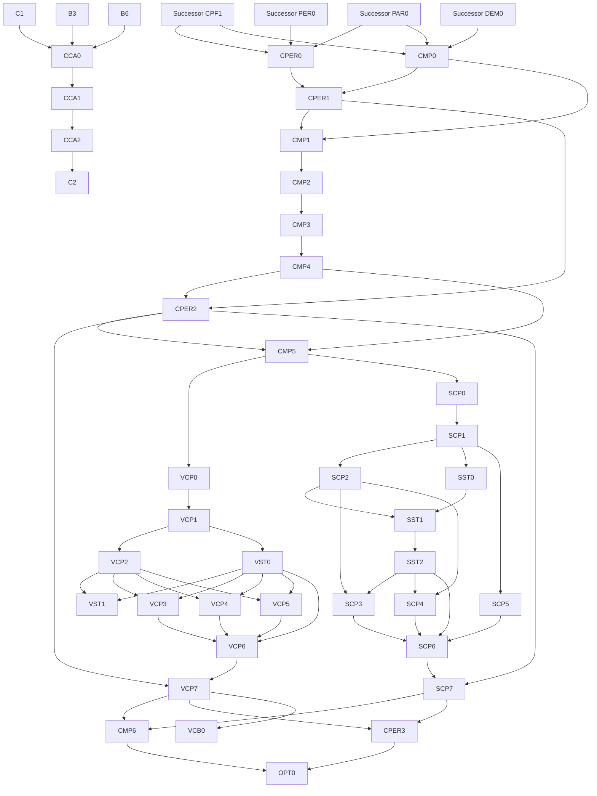

# Verter Compiler Architecture DAG — Merge Proposal

**Status:** final compiler-architecture proposal for merge into Revision 11 plus the successor expansion plan; not execution authority until merged, reviewed, and ratified under the repository governance process.  
**Scope:** Verter-owned runtime compilers, framework compiler semantics, target planning, emission, CSS/compiler integration, compiler performance, and future compiler-only extension seams.  
**Out of scope:** redesigning the universal tooling program; implementing new runtime compilers for every tooling vertical; a public compiler plugin ABI; native Sass/Less/Stylus execution; an externally stable OXC AST ABI; the deferred optimization engine; and immediate custom-block transformation integration.  
**Primary merge targets:** Revision 11 `program-dag.toml`/charters around `C1 → C2`; successor `CPF0`/`CPF1`, `PAR0`, `DEM0`, `PER0`, `VIM0`/`VIM1`, and `CLIC0`.

**Reviewed source basis:**

- `docs/arch/refactor/rev11/program-dag.toml`;
- `docs/arch/refactor/rev11/program.md`;
- `docs/arch/refactor/rev11/charters/C1.md`;
- `docs/arch/refactor/rev11/charters/J1.md`;
- the attached successor expansion proposal;
- the attached final architecture review.

The merge agent must re-pin the exact repository commit/tree and revalidate every cited owner, path, predecessor, and deletion consumer before ratification. This document suggests DAG integration; it does not override newer accepted repository authority.

---

## 1. Decision

Verter should adopt a **framework-compiler-cell architecture**:

```text
Compile request
    ↓
normalized compiler policy + product demand
    ↓
bounded monotonic demand closure
    ↓
carrier/frontend products and parse admission
    ↓
framework-epoch semantic authority
    using shared verter_analysis + type_info machinery
    ↓
semantic admission + compile admission
    ↓
framework-native compiler structure
    logically defined, physically optional where safe
    ↓
target-specific sparse overlay / demanded relation graph / stream
    ↓
segmented emission
    ↓
qualified artifact graph
    ↓
framework-host integration
```

The architectural rule is:

> **Framework meaning remains framework-owned. Compiler machinery is shared aggressively. Compiler semantics move into shared machinery only after genuine equivalence has been demonstrated across independent compilers.**

This proposal deliberately does **not** create:

- a universal cross-framework UI compiler IR;
- a mandatory reactivity IR or reactive AST;
- a runtime-extensible pass manager in hot paths;
- one global framework semantic authority;
- compiler-local duplicates of `verter_analysis` or `type_info` analyses;
- a CSS parser or CSS semantic authority beside the Revision 11 J train;
- an external native-AST compiler contract;
- a native preprocessor runtime;
- a custom-block plugin ABI;
- an optimization engine before the default compilers are correct and measured.

---

## 2. Final architecture decisions

### 2.1 Public compiler policy names

The public policy is:

```rust
pub enum CompilePolicy {
    Default,
    Optimized,
}
```

`CompilePolicy` is preferable to `OptimizationLevel`: the default compiler is already expected to optimize. The distinction is the **admitted evidence and analysis budget**, not whether optimization occurs.

#### `Default`

`Default` is the only initially supported policy. It:

- uses the canonical framework semantic authority;
- performs all component-local semantic work required for correct compilation;
- may use stronger cheap facts than an upstream implementation when Verter can prove them from the admitted component source without loading project or package files;
- may correct a known upstream implementation gap when the behavior is prelocked by the framework contract and runtime/correctness evidence;
- never deliberately reproduces a cheap-analysis weakness merely for output similarity;
- performs no workspace/package/declaration/implementation traversal that is not already part of the admitted component input;
- never changes behavior based on ambient LSP or editor caches;
- remains deterministic for an exact request and captured input basis.

For example, if the component contains source-local framework evidence admitted by the `Default` contract:

```ts
import { reactive as r } from "vue";
const make = r;
const state = make({});
```

and Verter’s canonical component-local analysis preserves that contract evidence through immutable aliases, `Default` should use that fact. This is source-local framework evidence, not a claim that the installed package implementation was transitively verified. It should not reproduce a weaker result solely because another compiler stops earlier.

#### `Optimized`

`Optimized` is a reserved public policy and must remain capability-truthful as `FutureSeparateTrain` or `Unsupported` until `OPT0` is explicitly rescoped and ratified by the maintainer.

Its future analysis may load and inspect workspace/package/declaration/implementation inputs through Verter-native `verter_analysis`, `type_info`, and resolver facilities. No such implementation is authorized by this document.

### 2.2 Default behavior contract, not a strict upstream oracle

Each exact framework semantic epoch owns a versioned:

```text
DefaultCompilationContractId
```

qualified by at least:

```text
FrameworkReleaseId
FrameworkSemanticEpoch
VerterCompilerEpoch
DefaultBehaviorContractEpoch
TargetId
```

The contract states the required equivalence grade per observable product. A typical matrix distinguishes:

| Product | Required contract |
|---|---|
| Runtime behavior | exact observable framework semantics |
| Hydration behavior | exact observable semantics where applicable |
| Public exports/module surface | exact |
| Diagnostics | exact code/severity/range where the locked cell requires it; otherwise explicitly dispositioned |
| CSS scoping/pruning | no semantic divergence |
| Source maps | exact qualified mapping contract |
| Runtime helper topology | equivalent unless the cell is byte-locked |
| Generated temporary identifiers/formatting | not necessarily byte-identical unless the cell is byte-locked |
| Metadata/artifact relations | exact public contract |

The upstream compiler is a primary differential reference, not an unquestionable authority. A Verter divergence is admitted only when it is:

1. named before implementation or opened through a bounded amendment;
2. proven against framework/runtime semantics and adversarial fixtures;
3. represented in the `DefaultCompilationContractId` matrix;
4. covered by fresh, incremental, maps, and runtime tests;
5. included in artifact identity when it changes observable output.

### 2.3 Semantic authority is singular per framework epoch

There is no global framework semantic authority.

```text
shared machinery:
    verter_analysis
    type_info
    resolver/dataflow/scope infrastructure
    symbol and dependency storage

framework-owned interpretation:
    VueSemanticAuthority<VueEpoch>
    SvelteSemanticAuthority<SvelteEpoch>
    FutureFrameworkSemanticAuthority<FutureEpoch>
```

The law is:

> **Each framework semantic epoch has exactly one authoritative Verter-native semantic authority. `verter_analysis` and `type_info` supply shared machinery and generic facts; they do not define universal framework meaning.**

`type_info` may prove that a binding resolves to a particular export or declaration. The framework authority owns the conclusion that this fact has Vue-reactive, Svelte-rune, component, directive, slot, or other framework meaning.

The runtime compiler consumes framework semantic facts. It does not implement a second reactivity, binding, scope, import, dependency, or style-semantic analyzer.

### 2.4 Bounded monotonic demand closure

Demand planning is not a fixed three-pass protocol and not a runtime plugin graph. It is a finite, statically defined, monotonic closure:

```text
DemandSeed
    requested target/products/policy/maps
        ↓
observe admitted carrier/block structure
        ↓
add justified language/style/semantic prerequisites
        ↓
observe admitted syntax/features or external-stage result
        ↓
add justified fact/target prerequisites
        ↓
Stable | NeedInputs | Unsupported
```

Hard properties:

```text
Demand(n + 1) ⊇ Demand(n)
finite capability universe
every added demand has a reason edge
no demanded capability disappears during one execution
no target execution begins before its prerequisite closure is stable
resumption continues the same exact request and input basis
```

“Zero unrequested work” means:

> A capability absent from the final closed demand performs zero attributable work.

An unrequested artifact may still induce prerequisite work required for another requested artifact. For example, a runtime target can require style scoping facts even when a separate CSS output artifact is not requested.

### 2.5 Three admissions

Keep these distinct:

```text
ParseAdmission
    language-frontend-owned structural validity

SemanticAdmission
    framework-semantic-authority-owned fact availability and validity

CompileAdmission
    compiler-boundary composition proof
```

`CompileAdmission` binds:

```text
ParseAdmissionSet
SemanticAdmission
DefaultCompilationContractId / policy
normalized target and option identity
stable demand closure
required external-stage results
exact source/map/fact basis
```

It does not rerun semantic analysis and does not pre-execute target lowering. Target-local unsupported combinations, budget exhaustion, internal invariant failures, or code-generation errors remain typed compiler outcomes.

### 2.6 Losslessness stays outside compiler nodes

The parser/tooling architecture may preserve:

- lexical losslessness;
- explicit recovery/missing/unexpected structure;
- partial semantic coverage.

The admitted runtime compiler consumes only the required structural identities, authored anchors, expressions, and semantic facts. Formatter trivia, recovery narratives, and tooling-only lossless sidecars do not enter compiler nodes or target plans.

A direct strict compile may eventually fuse canonical structural construction with its sole consumer when identities and observable behavior remain equivalent. Full physical `SyntaxCore` or compiler-IR materialization is not an architectural requirement.

### 2.7 `NodeId` is a dense arena index, not a byte offset

The desired property—O(1) node access from a `Vec`—is correct. The best implementation is not to use an authored start offset as the identity.

Use:

```text
SyntaxNodeId     dense snapshot-local index
CompileNodeId    dense compiler-arena index
TemplateNodeId   dense framework-semantic topology index
RegionId         dense region-arena index
ExprId           dense expression-arena index
```

with side tables such as:

```text
CompileNodeId  → AuthoredSpan
TemplateNodeId → AuthoredSpan
TemplateNodeId → parent / first_child / next_sibling / previous_sibling
TemplateNodeId → semantic/style facts
```

Reasons not to make `NodeId = start_offset`:

- O(1) `Vec` access comes from a dense integer index, not from source-offset meaning;
- byte-offset indexing either allocates a source-length-sized sparse table or requires another map;
- several structural/virtual/generated identities can share one source anchor;
- zero-width/missing structures do not have a unique authored start;
- source offsets shift after an edit and are poor cross-revision lineage identities;
- a compiler node can correspond to several authored regions, or several compiler nodes can share an anchor.

When source-position lookup is demanded, build a separate exact index:

```text
small input     sorted span table / binary search
larger input    bucketed offset index + narrow exact scan
special case    measured dense offset table only where justified
```

Cross-revision lineage is a distinct optional identity owned by managed incremental execution. It must not be smuggled into snapshot-local dense IDs.

### 2.8 Compiler structure and target state

Each framework owns its compiler structure:

```text
VueSemanticSnapshot    → VueCompileStructure
SvelteSemanticSnapshot → SvelteCompileStructure
```

Shared machinery may own:

- typed dense IDs;
- region and range arenas;
- compact side-table primitives;
- dependency-set and graph storage;
- scratch/lifetime allocators;
- static schedule machinery;
- emission segments;
- maps, artifacts, diagnostics, provenance, and work accounting.

Target lowering uses the smallest useful physical form:

```text
sparse side-table overlay
compact relation/effect graph
streaming target plan
or a materialized target structure when genuinely required
```

There is no mandatory whole-program reactivity tree.

### 2.9 CSS ownership and preprocessing

Revision 11 J remains the sole CSS-family syntax and framework-neutral style-semantic foundation.

```text
J:
    CSS-family parsing
    StyleSyntaxIr
    selector/declaration/value structure
    neutral style facts
    authored style spans/maps

framework semantic authority:
    framework-specific style meaning
    selector ↔ template meaning
    scope participation
    framework directives/functions
    framework style diagnostics

runtime compiler:
    target-specific style planning and artifact assembly
```

Verter does not implement Sass, Less, Stylus, or arbitrary PostCSS execution in this compiler program. Runtime compilation consumes a stage-qualified external result when a host-owned operation is required:

```text
NeedExternalStyleStage
    ↓
exact named host operation
    ↓
ExternalStyleStageResult
    content + qualified map + dependencies + diagnostics
    processor/config/input basis
    ↓
resume exact compiler transaction
```

The external stage must state exactly what has already run. A complete host pipeline must not be mislabeled as dialect-only preprocessing.

### 2.10 Selector-query functionality for both Vue and Svelte

Both frameworks should have framework-owned selector-to-template query functionality, but not the same semantic implementation and not the same compiler obligation.

- **Svelte:** selector applicability, scope participation, and pruning are default compiler semantics. The style matcher is a core demanded semantic producer.
- **Vue:** selector-to-template facts are valuable for diagnostics, navigation, component information, and a future optimized CSS mode. They are not required by default Vue runtime compilation and therefore perform zero work unless demanded.

Both may use the same proven mechanical ideas:

```text
dense canonical template topology
compiled selector query plan when useful
adaptive DirectMatcher / IndexedMatcher
candidate postings from sound positive anchors
dynamic/maybe candidate buckets
exact framework matcher remains authoritative
Yes / Maybe / No result
only No permits pruning
```

They remain separate framework-owned implementations. Shared primitives may be extracted only when they contain no framework meaning and measurements justify the extraction.

### 2.11 External native AST and extension ABI are deferred

OXC remains an internal implementation detail. The stable compiler boundary is text/bytes, qualified maps, artifacts, relations, diagnostics, and provenance.

A public/native AST handoff and compiler extension ABI each require a separate consumer-driven plan covering ABI/versioning, allocation/lifetime, mutability, spans, trust, cancellation, maps, isolation, and host publication. Neither is designed or implemented here.

### 2.12 Optimization engine is explicitly deferred

`OPT0` exists in the DAG only as a `RESCOPE_REQUIRED` maintainer-ratification gate. It has no implementation successors in this proposal.

It must not be opened until:

- the Vue `Default` compiler is accepted;
- the Svelte `Default` compiler is accepted;
- compiler work ledgers and equivalent-work baselines exist;
- the benefits and costs of project-wide analysis are measured;
- the maintainer supplies or approves a dedicated optimization-engine plan.

---

## 3. Integration strategy

### 3.1 Bounded Revision 11 bridge

Insert only three bounded compiler-architecture bridge blocks into the Revision 11 critical path:

```text
B3 + B6 + C1
      ↓
    CCA0
      ↓
    CCA1
      ↓
    CCA2
      ↓
     C2
```

The J train remains parallel. `CCA0`–`CCA2` may lock and reserve the compiler-facing style boundary, but they must not implement J work or make C2 wait for a CSS matcher rewrite.

Recommended `C2` predecessor change:

```toml
# old
C2 = ["B3", "B6", "C1"]

# recommended
CCA0 = ["B3", "B6", "C1"]
CCA1 = ["CCA0"]
CCA2 = ["CCA1"]
C2   = ["CCA2"]
```

### 3.2 Successor expansion integration

The successor genesis must bind accepted `CCA0`–`CCA2` receipts. Then:

- `CPF0` verifies the five-way capability split rather than redesigning it;
- `CPF1` integrates those capabilities into the successor catalog and removes any temporary bridge adapters assigned to it;
- `PAR0` consumes the multi-view frontend and parse-admission contract;
- `DEM0` supplies general capability-demand machinery that compiler demand closure specializes without duplicating it;
- `PER0` remains the system-wide performance/reuse constitution;
- `CPER*` owns compiler-specific work-ledger and equivalent-work evidence;
- `VIM0`/`VIM1` gain compiler-policy, default-contract, target, artifact, style, performance, and deletion cells;
- `CLIC0` consumes `CompileArtifactSet` and compiler capability truth; it does not wait for Vue/Svelte V2 to expose the existing admitted compiler backends.

### 3.3 Program independence

The post-Revision-11 compiler train is optional and must not become a predecessor of HTML, formatter, lint, TypeInfo, or tooling-only vertical terminals.

Vue and Svelte compiler terminals are independently promotable. The cross-framework convergence and optimization-rescope nodes are non-release joins.

---

## 4. Proposed compiler DAG



`VST1` is a non-release Vue style-query feature and is deliberately not a predecessor of `VCP7`.  
`CMP6`, `CPER3`, `OPT0`, and `VCB0` are non-release or rescope nodes and cannot serialize the independent Vue/Svelte product terminals.

---

## 5. Suggested machine-readable dependency ledger

```toml
# Revision 11 bridge
CCA0 = ["B3", "B6", "C1"]
CCA1 = ["CCA0"]
CCA2 = ["CCA1"]
# Replace C2's prior direct predecessors with the bridge terminal.
C2 = ["CCA2"]

# Successor compiler common train
CPER0 = ["CPF1", "PAR0", "PER0"]
CMP0  = ["CPF1", "PAR0", "DEM0"]
CPER1 = ["CPER0", "CMP0"]
CMP1  = ["CMP0", "CPER1"]
CMP2  = ["CMP1"]
CMP3  = ["CMP2"]
CMP4  = ["CMP3"]
CPER2 = ["CMP4", "CPER1"]
CMP5  = ["CMP4", "CPER2"]

# Vue Default compiler
VCP0 = ["CMP5"]
VCP1 = ["VCP0"]
VCP2 = ["VCP1"]
VST0 = ["VCP1"]
VST1 = ["VCP2", "VST0"]
VCP3 = ["VCP2", "VST0"]
VCP4 = ["VCP2", "VST0"]
VCP5 = ["VCP2", "VST0"]
VCP6 = ["VCP3", "VCP4", "VCP5", "VST0"]
VCP7 = ["VCP6", "CPER2"]

# Svelte Default compiler
SCP0 = ["CMP5"]
SCP1 = ["SCP0"]
SCP2 = ["SCP1"]
SST0 = ["SCP1"]
SST1 = ["SCP2", "SST0"]
SST2 = ["SST1"]
SCP3 = ["SCP2", "SST2"]
SCP4 = ["SCP2", "SST2"]
SCP5 = ["SCP1"]
SCP6 = ["SCP3", "SCP4", "SCP5", "SST2"]
SCP7 = ["SCP6", "CPER2"]

# Non-release convergence and future rescope
CMP6  = ["VCP7", "SCP7"]
CPER3 = ["VCP7", "SCP7"]
OPT0  = ["CMP6", "CPER3"]
VCB0  = ["VCP7"]
```

Suggested metadata:

```toml
CCA0  = { kind = "contract",   product = "compiler_bridge", release_gating = "none" }
CCA1  = { kind = "cutover",    product = "compiler_bridge", release_gating = "none" }
CCA2  = { kind = "contract",   product = "compiler_bridge", release_gating = "none" }
CPER0 = { kind = "lock",       product = "compiler_perf",   release_gating = "none" }
CPER1 = { kind = "implementation", product = "compiler_perf", release_gating = "none" }
CPER2 = { kind = "verification",   product = "compiler_perf", release_gating = "contract" }
CMP0  = { kind = "contract",   product = "compiler_core",   release_gating = "none" }
CMP1  = { kind = "implementation", product = "compiler_core", release_gating = "none" }
CMP2  = { kind = "implementation", product = "compiler_core", release_gating = "none" }
CMP3  = { kind = "implementation", product = "compiler_core", release_gating = "none" }
CMP4  = { kind = "cutover",    product = "compiler_core",   release_gating = "none" }
CMP5  = { kind = "convergence", product = "compiler_core",  release_gating = "contract" }
VCP0  = { kind = "lock",       product = "vue_compiler",    release_gating = "none" }
VCP1  = { kind = "implementation", product = "vue_compiler", release_gating = "none" }
VCP2  = { kind = "implementation", product = "vue_compiler", release_gating = "none" }
VST0  = { kind = "implementation", product = "vue_style",    release_gating = "none" }
VST1  = { kind = "implementation", product = "vue_style_query", release_gating = "non_release" }
VCP3  = { kind = "implementation", product = "vue_compiler", release_gating = "none" }
VCP4  = { kind = "implementation", product = "vue_compiler", release_gating = "none" }
VCP5  = { kind = "implementation", product = "vue_compiler", release_gating = "none" }
VCP6  = { kind = "cutover",    product = "vue_compiler",    release_gating = "none" }
VCP7  = { kind = "terminal",   product = "vue_compiler",    release_gating = "product" }
SCP0  = { kind = "lock",       product = "svelte_compiler", release_gating = "none" }
SCP1  = { kind = "implementation", product = "svelte_compiler", release_gating = "none" }
SCP2  = { kind = "implementation", product = "svelte_compiler", release_gating = "none" }
SST0  = { kind = "implementation", product = "svelte_style", release_gating = "none" }
SST1  = { kind = "implementation", product = "svelte_style", release_gating = "none" }
SST2  = { kind = "cutover",    product = "svelte_style",    release_gating = "none" }
SCP3  = { kind = "implementation", product = "svelte_compiler", release_gating = "none" }
SCP4  = { kind = "implementation", product = "svelte_compiler", release_gating = "none" }
SCP5  = { kind = "implementation", product = "svelte_compiler", release_gating = "none" }
SCP6  = { kind = "cutover",    product = "svelte_compiler", release_gating = "none" }
SCP7  = { kind = "terminal",   product = "svelte_compiler", release_gating = "product" }
CMP6  = { kind = "convergence", product = "compiler_core", release_gating = "non_release" }
CPER3 = { kind = "soak",       product = "compiler_perf", release_gating = "non_release" }
OPT0  = { kind = "rescope",    product = "compiler_optimization", release_gating = "non_release", state = "RESCOPE_REQUIRED" }
VCB0  = { kind = "rescope",    product = "vue_custom_blocks", release_gating = "non_release", state = "RESCOPE_REQUIRED" }
```

---

# 6. Revision 11 bridge charters

## `CCA0.md` — Compiler authority, policy, demand, and admission constitution

**Intent:** lock the compiler authority boundaries and policy semantics before C2 seals the staged compile facade.

**Problem:** the current carrier/compiler seam can still conflate parsing, framework semantics, IDE projection, runtime compilation, module assembly, and host integration. The compiler policy lacks a stable meaning, and the demand/admission order can allow duplicate analysis or late discovery of required facts.

**Solution and architecture decisions:**

- ratify the five authorities:
  - `CarrierFrontend`;
  - `FrameworkSemanticAuthority<FrameworkEpoch>`;
  - `ProjectionBackend`;
  - `RuntimeCompilerBackend<FrameworkEpoch>` with statically selected targets;
  - `FrameworkHostIntegrationBackend<FrameworkEpoch, HostEpoch>`;
- ratify `CompilePolicy::{Default, Optimized}` with only `Default` initially supported;
- ratify `DefaultCompilationContractId` and per-product equivalence grades;
- state that `Default` may use stronger cheap component-local facts and may correct prelocked upstream gaps;
- reserve `Optimized` as a future separate train;
- ratify bounded monotonic demand closure;
- ratify `ParseAdmission`, `SemanticAdmission`, and `CompileAdmission` ownership;
- ratify that each framework semantic epoch has one authority built on shared `verter_analysis`/`type_info` machinery;
- ratify that J owns CSS-family syntax/neutral facts and framework authorities own framework style meaning;
- ratify dense snapshot-local IDs and separate authored offsets/lineage;
- ratify no universal compiler IR, mandatory reactivity IR, compiler ABI, native preprocessor, or external OXC artifact.

**Suggested predecessors:** `B3`, `B6`, `C1`.

**Suggested subblocks:**

1. **CCA0-A — Current authority inventory.** Map every carrier/compiler/projection/semantic/module-assembly/style/host caller to one final owner; identify duplicate analyses and cross-framework option fields.
2. **CCA0-B — Policy and compatibility contract.** Define `CompilePolicy`, `DefaultCompilationContractId`, equivalence matrix, intentional-divergence records, and truthful unsupported `Optimized` capability.
3. **CCA0-C — Demand and admission contract.** Define the finite demand universe, reason edges, resumption basis, and the three admission tokens.
4. **CCA0-D — Semantic authority contract.** Define per-framework authority namespaces and the `type_info` versus framework-interpretation boundary.
5. **CCA0-E — Identity and representation laws.** Lock dense IDs, source anchors, optional lineage, lossless-sidecar exclusion, and optional physical materialization.
6. **CCA0-F — Architecture guards and exact-candidate review.** Add compile-time/dependency tests proving the generic compiler layer cannot import framework semantic types and the runtime compiler cannot own a second analyzer.

**Acceptance:**

- every current method/caller has exactly one final authority;
- `Default` has a versioned behavior contract and can admit a planted cheap local alias-proven reactivity case without project I/O;
- `Optimized` is present only as truthful future capability;
- no global framework semantic authority or type-info-as-framework-authority exists;
- J ownership is preserved;
- no compiler hot-path contract contains tooling recovery/trivia;
- all negative architecture fixtures fail structurally.

**Forbidden:** implementation of Vue/Svelte V2, CSS matcher changes, native preprocessors, project-wide optimization, dynamic plugin/ABI design, or preserving the combined authority behind aliases.

**Deletion/abort:** no broad deletion; reject/rescope if the authority split requires two active semantic answers or changes accepted compiler output in this lock block.

---

## `CCA1.md` — Five-way compiler capability and registration cutover

**Intent:** atomically install the authority split with behavior-preserving adapters so C2 builds on the final seam rather than the combined carrier compiler abstraction.

**Problem:** a tooling-only carrier must not pretend to compile, IDE projection must not be a runtime compiler product, generic sessions must not understand framework module topology, and framework/target dispatch must not occur dynamically per node.

**Solution and architecture decisions:**

- add typed catalog/registry tables for:
  - carrier frontends;
  - framework semantic authorities/profiles;
  - projection backends;
  - optional runtime compilers;
  - framework-host integrations;
- migrate Vue and Svelte through behavior-preserving adapters;
- keep target selection coarse and static inside each framework runtime compiler;
- keep multi-target prerequisite sharing inside one framework compiler cell;
- retain one immutable catalog construction authority;
- delete the combined carrier compiler trait/registry and cross-framework option bucket in the atomic cutover.

**Suggested predecessor:** `CCA0`.

**Suggested subblocks:**

1. **CCA1-A — Type and registry skeleton.** Land typed traits/tables and compile-time capability truth with no route cutover.
2. **CCA1-B — Frontend and semantic migration.** Move parse/source-unit/fact routes while preserving bytes, recovery, identities, and caches.
3. **CCA1-C — Projection migration.** Move IDE/checkable projection into `ProjectionBackend`; prove no runtime compiler dependency.
4. **CCA1-D — Runtime compiler migration.** Move Vue/Svelte compile routes and owner-local typed requests; preserve direct/prepared/managed behavior.
5. **CCA1-E — Host-integration migration.** Move existing framework-host behavior behind the explicit integration authority without changing semantics.
6. **CCA1-F — Atomic deletion and parity.** Delete combined traits/registries/options and generated guards only after all consumers move.

**Acceptance:**

- tooling-only test carriers compile without runtime-backend stubs;
- Vue/Svelte parse, projection, compile, maps, cache, diagnostics, and public outputs remain equivalent on pinned corpora;
- one framework can request multiple targets while sharing prerequisites;
- target dispatch occurs outside per-node loops;
- zero combined-registry/combined-options consumers remain.

**Forbidden:** dual-running registries, erased `Any` artifacts, one backend per target that duplicates framework prerequisites, public compatibility aliases that remain authorities, or framework branches in the generic session.

**Deletion/abort:** delete the old combined trait/registry and mixed option types atomically; abort on unexplained output/map/performance divergence.

---

## `CCA2.md` — Compiler artifact, assembly, style-stage, and host boundary

**Intent:** establish the stable staged-compile outputs consumed by C2 and later compiler implementations without implementing Compiler V2.

**Problem:** SFC-shaped generic outputs, session-owned framework assembly, opaque CSS preprocessing callbacks, and underspecified custom-block records would freeze the wrong long-term boundary.

**Solution and architecture decisions:**

- define `CompileArtifactSet` with root artifact, artifacts, qualified maps, provenance, and typed relations;
- keep framework-local strongly typed results internally and convert only at the shared product boundary;
- make framework compilers own semantic module assembly;
- make `FrameworkHostIntegrationBackend` own bundler/HMR/virtual-module/manifest policy;
- define a stage-qualified external style continuation compatible with the J-owned boundary; do not create a second preprocessor authority;
- preserve custom blocks through a source-backed `CustomBlockDescriptor` separating role/tag name from `lang`, source reference, attributes, order, region, and content availability;
- unknown custom blocks remain opaque and perform zero semantic/runtime work by default;
- keep OXC internal and stable artifacts text/bytes based;
- install temporary behavior-preserving adapters for current runtime outputs with explicit deletion ownership.

**Suggested predecessor:** `CCA1`.

**Suggested subblocks:**

1. **CCA2-A — Artifact schema and map qualification.** Define artifact IDs, roles, languages, relations, map families, provenance, and terminal serialization.
2. **CCA2-B — Framework assembly boundary.** Move or wrap Vue/Svelte semantic module assembly behind the runtime compiler authority; keep behavior unchanged.
3. **CCA2-C — Host integration boundary.** Define exact framework×host identity, lifecycle, cancellation, and publication responsibilities.
4. **CCA2-D — External style continuation.** Reuse/extend the J-owned preprocessor result shape; add exact stage identity and prevent double transformation.
5. **CCA2-E — Custom-block descriptor.** Preserve source-backed role/language/attrs/src/order/content state; no parser or transform ABI.
6. **CCA2-F — C2 integration and legacy adapter ledger.** Make C2 consume the final contracts and name each temporary output adapter’s deletion owner.

**Acceptance:**

- generic staged compilation no longer requires fixed script/template/style/custom-block fields as its durable contract;
- the generic session contains no framework module topology;
- every style result names the exact stage and input basis;
- unknown custom blocks round-trip as opaque source-backed attachments;
- text-only requests build no native AST artifact;
- existing compiler bytes/maps remain equivalent through adapters.

**Forbidden:** CSS parser work, preprocessor implementation, selector matcher rewrite, Vue/Svelte Compiler V2, custom-block ABI, external OXC AST, or unqualified `processed_css: String` inputs.

**Deletion/abort:** delete only contract shapes and session assembly routes whose consumers are fully migrated; retain short-lived adapters with named VCP/SCP deletion owners; abort if the bridge requires semantic output changes.

---

# 7. Shared compiler architecture and performance charters

## `CPER0.md` — Compiler equivalent-work and oracle genesis lock

**Intent:** freeze correctness-equivalent compiler baselines and measurement methodology before the shared compiler engine or framework compilers mutate the workload.

**Problem:** wall-clock numbers without output/runtime/map equivalence conceal invalid work and cannot distinguish architecture improvement from omitted functionality.

**Solution and architecture decisions:**

- lock exact repository revisions, framework releases, target/options, corpora, runtime validators, map modes, diagnostic contracts, thread counts, machine classes, cold/warm/cache states, and RSS methodology;
- use each framework’s `DefaultCompilationContractId`, not byte similarity alone;
- retain upstream compilers as primary differential references while permitting prelocked Verter default divergences;
- capture current Verter phase/work/allocation/RSS baselines even when correctness is incomplete, but do not rank an invalid result as faster equivalent work;
- define the compiler-work-ledger schema and stable counter names;
- lock benchmark-failure and rebaseline governance before implementation direction is observed.

**Suggested predecessors:** successor `CPF1`, `PAR0`, `PER0`; accepted Revision 11 bridge and J train are external genesis receipts.

**Suggested subblocks:**

1. **CPER0-A — Corpus and behavior matrix.** Pin target/product equivalence cells for Vue and Svelte, including CSS and maps.
2. **CPER0-B — Runtime/hydration/output validators.** Ensure generated code is executed or otherwise semantically validated where applicable.
3. **CPER0-C — Work-ledger schema.** Define parse, semantic, style, planning, emission, maps, reuse, concurrency, and memory counters.
4. **CPER0-D — Baseline capture.** Capture direct, prepared, managed, single-target, multi-target, maps/no-maps, cold/warm and batch data.
5. **CPER0-E — Noise and machine policy.** Lock repetitions, outlier handling, CPU topology, memory collection, and reproducibility metadata.
6. **CPER0-F — Independent review.** Challenge equivalence, hidden work, and corpus representativeness before any numeric gate is accepted.

**Acceptance:** every comparison can prove equivalent requested work; invalid compiler outputs are identified rather than ranked; the baseline can attribute why work ran; no numeric target is invented from architectural optimism.

**Forbidden:** performance claims from microbenchmarks alone, mutable corpora, output-size-only correctness, unrecorded cache/thread state, or changing thresholds after candidate results are known.

**Deletion/abort:** no production deletion; repair a defective baseline and rerun both sides rather than weakening the contract.

---

## `CMP0.md` — Compiler request, policy, compatibility, and identity contract

**Intent:** replace mixed options and ambiguous output identity with typed per-framework requests and stage-specific compiler identities.

**Problem:** cross-framework options, one broad cache key, and an undefined compatibility policy cause over-invalidation, ignored fields, and inconsistent behavior.

**Solution and architecture decisions:**

- canonical request envelope:

  ```text
  CompileRequest
      exact source/content basis
      requested products and targets
      CompilePolicy
      DefaultCompilationContractId
      common execution controls
      typed framework request
  ```

- owner-local `VueCompileRequest`, `SvelteCompileRequest`, and future framework requests;
- normalize public `Default` to an exact versioned internal policy/contract;
- reserve `Optimized`, but return truthful unsupported status until `OPT0` succeeds;
- classify option impact and derive:

  ```text
  ParseKey
  SemanticKey
  CompileStructureKey
  TargetPlanKey
  EmitKey
  TerminalKey
  ```

- reserve the future two-stage optimized identity without implementing analysis:

  ```text
  OptimizationRequestBasis   known before execution
  OptimizationObservationSet discovered during analysis
  ArtifactBasis              request basis + observation digest + decisions
  ```

- candidate reuse validates the old observation set against the captured workspace basis; it does not require the future read set before lookup.

**Suggested predecessors:** successor `CPF1`, `PAR0`, `DEM0`.

**Suggested subblocks:**

1. **CMP0-A — Request and refusal vocabulary.** Typed framework options, products, targets, policy and `NeedInputs`/`Unsupported` outcomes.
2. **CMP0-B — Default contract registry.** Exact framework/target behavior matrices and intentional divergence records.
3. **CMP0-C — Option-impact classifier.** Parse/semantic/structure/target/emit/terminal option partitioning with negative tests.
4. **CMP0-D — Stage identity types.** Stable canonical serialization/hashing, no display strings or ambient “latest”.
5. **CMP0-E — Future optimized basis reservation.** Types only; no project traversal, proof engine, or cache implementation.
6. **CMP0-F — Migration adapters and deletion ledger.** Map old mixed options/output requests and assign deletion owners.

**Acceptance:** changing map encoding does not invalidate semantics; changing one framework option cannot affect another framework; every requested product has one canonical identity; `Default` behavior is exact; `Optimized` cannot execute; no ignored cross-framework fields remain in accepted requests.

**Forbidden:** universal options bag, `HashMap<String, Value>` configuration, family-wide framework version switches, ambient default policy identity, or implementing project optimization.

**Deletion/abort:** delete mixed runtime options when all consumers move; abort any option whose invalidation impact cannot be classified.

---

## `CPER1.md` — Compiler work ledger and lifetime attribution

**Intent:** make compiler work, memory, and reuse mechanically observable with negligible disabled overhead.

**Problem:** time measurements alone cannot catch extra traversals, reparses, allocations, or unrequested semantic/style work.

**Solution and architecture decisions:**

Implement a versioned `CompileWorkLedger` covering at least:

```text
parse.full_source_scans
parse.region_scans[grammar]
parse.bytes[grammar]
parse.expression_attempts
parse.authoritative_expression_parses
parse.downstream_reparses
parse.raw_source_copy_bytes
parse.semantic_normalization_bytes

semantic.fact_families_demanded
semantic.facts_produced
semantic.fact_reads
semantic.binding_lookups
semantic.dependency_sets
semantic.dependency_edges
semantic.provenance_entries

structure.nodes_materialized
structure.regions
structure.topology_nodes
structure.source_sized_visits
structure.regional_visits
structure.graph_visits

style.blocks
style.selector_plans
style.index_builds
style.candidate_nodes
style.predicate_tests
style.combinator_hops
style.match_yes_maybe_no
style.pruned_rules
style.witnesses_materialized

planning.target_entries
planning.effect_nodes
planning.effect_edges
planning.multi_target_shared_prerequisites

emission.segments
emission.source_slice_bytes
emission.generated_bytes
emission.copy_bytes
emission.allocations
emission.map_segments

reuse.candidates
reuse.validated
reuse.rejected_by_basis
reuse.recomputed

memory.allocated_by_lifetime
memory.peak_by_lifetime
memory.retained_by_product
concurrency.tasks_spawned
concurrency.cancellation_waste
```

**Suggested predecessors:** `CPER0`, `CMP0`.

**Suggested subblocks:** instrumentation schema, leaf counters, memory/lifetime hooks, deterministic export, disabled-overhead benchmark, architecture gate integration.

**Acceptance:** counters are deterministic for equivalent single-thread work, attributable to named capabilities, stable-schema versioned, and cheap when disabled; strict valid compilation reports zero lossless-sidecar and downstream-reparse work.

**Forbidden:** counters becoming semantic authority, string-heavy per-node tracing in production, timing-based correctness, or a metric without an owner and definition.

**Deletion/abort:** remove superseded ad hoc compiler telemetry only after parity; abort counters whose disabled cost exceeds the prelocked budget.

---

## `CMP1.md` — Demand-refined semantic consumption and admissions

**Intent:** ensure runtime compilation reuses the canonical framework analysis and computes only demanded fact families.

**Problem:** compiler-local semantic analysis, repeated import/expression parsing, and a demand plan created after semantic work cause disagreement and unnecessary work.

**Solution and architecture decisions:**

- specialize successor `DEM0` into a finite compiler demand closure;
- create exact reason edges from target/product to required parse, semantic, style, map, planning and emission capabilities;
- obtain `ParseAdmission` from each demanded frontend/region;
- ask the exact framework semantic authority for demanded fact families;
- obtain `SemanticAdmission` with exact source/fact basis and coverage;
- compose `CompileAdmission` without rerunning analysis;
- expose policy-restricted read-only compiler views over the same facts;
- allow `Default` component-local provenance through immutable aliases and literal canonical framework imports without loading external files;
- do not use ambient LSP/tsgo state;
- return `NeedInputs` for genuinely required external style stages and resume on the same basis.

**Suggested predecessors:** `CMP0`, `CPER1`.

**Suggested subblocks:** demand universe, closure engine, parse admission, semantic admission/view, compile admission/resume, duplicate-analysis deletion.

**Acceptance:** each exact expression region has one authoritative parsed representation after grammar selection; import/binding/reactivity/dependency facts have one framework owner; the compiler cannot call a second parser/analyzer; capabilities absent from closed demand have zero ledger work; alias-proven local reactivity reaches `Default` target planning.

**Forbidden:** per-node calls into external providers, field-wise fact merging, compiler-specific import scanning, late demand expansion after target execution begins, or a monolithic eager semantic snapshot.

**Deletion/abort:** delete duplicate compiler-local analysis only with fact/output parity; rescope any semantic fact that lacks one framework owner.

---

## `CMP2.md` — Data-oriented compiler structure, regions, topology, and lifetime model

**Intent:** establish compact framework-neutral mechanics while preserving framework-native compiler meaning.

**Problem:** object graphs with per-node `String`, `Vec`, `HashMap`, copied text, and source-offset identities increase allocation/RSS and make repeated structural discovery likely.

**Solution and architecture decisions:**

- dense snapshot-local typed IDs are direct arena indices;
- authored start/end offsets live in side tables and never define compiler identity;
- region-owned control flow normalizes branch/body ownership once;
- compact topology tables provide parent/child/sibling/preorder/region relations where a framework demands them;
- hot classifications use packed/dense tables; rare facts use sparse tables;
- child, attribute, operation, dependency and relation collections use flat arenas plus ranges;
- raw authored slices remain source-backed; only requested decoded/interned/normalized values allocate;
- lifetime classes are explicit (`Frontend`, `Semantic`, `CompilerScratch`, `TargetScratch`, `Emission`) and may be combined only through measurement;
- canonical compiler structures are logical contracts; direct one-shot execution may later stream/fuse portions after materialized parity is proven.

**Suggested predecessor:** `CMP1`.

**Suggested subblocks:** typed ID/arena primitives, span/offset indexes, region storage, topology storage, interning/range migration, lifetime/size verification.

**Acceptance:** `nodes[id.index()]` is O(1) with compact dense storage; source-position lookup remains exact through a separate index; no source-length-sized sparse node arena is required; node-size and bytes/node gates pass; no hot node owns variable-size collections directly unless a measured exception is ratified.

**Forbidden:** `NodeId = authored byte offset`, cross-revision offset identity, one arena by ideology, universal semantic node kinds, or copied source strings for ownership.

**Deletion/abort:** migrate one framework structure at a time; abort any “shared” node/region primitive that requires framework branches.

---

## `CMP3.md` — Framework-native target planning and static physical execution

**Intent:** compile only the relationships required by each requested target without universal lowering or dynamic pass dispatch.

**Problem:** whole target-tree copies, mandatory reactivity IRs, runtime pass registries, and per-node strategy calls waste work and leak framework semantics.

**Solution and architecture decisions:**

- each framework owns a private compiler structure and target executors;
- framework selection and target selection occur once outside hot loops;
- logical operations classify as local synthesized, regional, barrier graph, target planning, emission, or terminal materialization;
- local facts fuse into existing typed visits;
- barrier algorithms operate on compact tables/graphs, not the syntax tree;
- VDOM-like targets use sparse patch/hoist/cache overlays;
- fine-grained client targets request compact dependency/effect/operation graphs;
- server targets request no client effect graph;
- target structure is materialized only when it avoids rediscovery, enables reuse, or is required by a barrier;
- compatible multi-target requests share parse, semantic and structural prerequisites and branch at the minimum target-specific point;
- shared semantic abstractions follow a rule of three; two similarly named framework constructs are insufficient.

**Suggested predecessor:** `CMP2`.

**Suggested subblocks:** execution classes, static target executor pattern, sparse overlay primitives, dependency/effect graph primitives, multi-target branch planner, dynamic-dispatch deletion guards.

**Acceptance:** no accepted hot loop uses per-node dynamic target dispatch; server-only targets produce zero effect-plan ledger entries; target overlays contain only target-specific state; multi-target requests prove shared prerequisites; a synthetic second framework can use the mechanics without importing the first framework’s semantics.

**Forbidden:** universal UI IR, mandatory reactive AST, runtime plugin pass graph, full target tree for symmetry, or speculative build-two-and-discard-one production optimization.

**Deletion/abort:** delete old strategy/walker dispatch only after target parity; move any framework-shaped shared abstraction back to its owner.

---

## `CMP4.md` — Segmented emission, qualified artifacts, assembly, and host integration

**Intent:** install the final shared compiler output path and remove framework topology from generic sessions.

**Problem:** ad hoc string generation, map work on no-map paths, fixed SFC output envelopes, and session-level framework assembly limit performance and extensibility.

**Solution and architecture decisions:**

- define target-owned logical `EmitPlan` segments:

  ```text
  SourceSlice
  GeneratedSlice + optional source anchor
  GeneratedUnmappedSlice
  StructuredInsertion
  ArtifactBoundary
  ```

- flatten once with exact or conservative sizing;
- generate runtime map segments during flattening only when requested;
- keep `NoMap` a physically specialized path with zero attributable map work;
- produce `CompileArtifactSet` with root, artifacts, relations, maps, diagnostics, provenance and exact basis;
- make the framework compiler own semantic module assembly;
- make framework-host integration own Vite/Rollup/HMR/virtual IDs/manifests and external-style stages;
- keep OXC internal;
- keep custom blocks opaque unless an admitted future integration consumes them.

**Suggested predecessor:** `CMP3`.

**Suggested subblocks:** emit segment model, text flatten/map specialization, artifact graph, framework assembly adapter migration, host integration migration, old-output deletion ledger.

**Acceptance:** text-only/no-map requests do not build maps or native ASTs; framework modules are complete before the generic session receives them; host-specific decorations do not alter framework semantic decisions; artifact relations support client/server/CSS/metadata without schema changes; output copies/allocations meet locked budgets.

**Forbidden:** one generic SFC bundle, session knowledge of `_sfc_main` or framework wrappers, raw callback preprocessors, one universal map, or external AST ABI.

**Deletion/abort:** adapters survive only with named VCP/SCP deletion owners; abort if artifact conversion loses map/provenance identity.

---

## `CPER2.md` — Shared compiler physical-execution and zero-work terminal

**Intent:** verify the common compiler substrate before framework V2 trains depend on it.

**Problem:** clean contracts can still produce physically materialized multi-pass implementations, hidden map work, or memory regressions.

**Solution and architecture decisions:** run architecture-budget tests and canaries over the accepted common engine.

**Required laws:**

- no redundant authoritative parse of the same exact region/grammar product;
- no semantic raw-source searching after parse;
- no compiler-local duplicate framework analysis;
- no lossless/recovery allocation in valid strict compilation;
- no per-node dynamic target dispatch;
- no map work when maps are disabled;
- no client effect planning for server-only targets;
- unknown facts cannot enable optimization;
- raw source copy bytes are zero for representation ownership;
- incremental/prepared reuse validates exact basis.

**Budgets:** node sizes, source-sized visits, region/graph visits, allocations, bytes/lifetime, emission copies, map segments, cancellation waste, and disabled instrumentation overhead.

**Suggested predecessors:** `CMP4`, `CPER1`.

**Suggested subblocks:** strict-path canary, maps/no-maps canary, server/client demand canary, multi-target sharing canary, memory/RSS soak, exact-candidate architecture review.

**Acceptance:** all laws pass mechanically; every budget has a pinned value and equivalent-work basis; no implementation fix is made inside the terminal candidate.

**Forbidden:** changing gates after measurement, treating “one pass” as a universal law, or accepting unexplained extra work because wall time remains noisy.

**Deletion/abort:** findings return to `CMP0`–`CMP4` or `CPER1`; this terminal deletes nothing.

---

## `CMP5.md` — Provisional shared compiler-core contract lock

**Intent:** ratify the common compiler machinery as ready for independent framework implementations without claiming universal compiler semantics.

**Problem:** framework trains need a stable substrate, but the substrate must remain falsifiable and must not become a release join for unrelated tooling.

**Solution and architecture decisions:** read-only convergence over `CMP0`–`CMP4` and `CPER2`, including dependency firewalls and shared-mechanics-only review.

**Suggested predecessors:** `CMP4`, `CPER2`.

**Suggested subblocks:** authority graph review, data-layout review, demand/zero-work review, artifact/map review, framework-leakage adversarial fixtures, exact-digest ratification.

**Acceptance:** Vue and Svelte implementation locks can be written without changing common authority boundaries; no shared type contains framework semantics; compiler core remains optional to tooling verticals.

**Forbidden:** implementing framework behavior, promoting a universal IR, or making future compiler support implicit from tooling support.

**Deletion/abort:** findings reopen the smallest common owner; this block deletes nothing.

---

# 8. Vue Default compiler train

## `VCP0.md` — Exact Vue Default compiler lock

**Intent:** freeze the exact Vue semantic epoch, default behavior contracts, targets, corpora, known divergences, and performance gates before implementation.

**Problem:** output similarity is insufficient, upstream behavior is not an infallible oracle, and post-implementation criteria invite compatibility drift.

**Solution and architecture decisions:**

- pin exact Vue release/commits and Verter semantic/compiler epochs;
- define `DefaultCompilationContractId` cells for VDOM, SSR and Vapor;
- lock runtime/hydration/public-export/diagnostic/map/CSS/module behavior grades;
- lock permitted Verter corrections to upstream gaps before implementation;
- lock component-local facts allowed by `Default` and prove no workspace file loading;
- pin official/reference compilers, runtime validators, source-map validators and real-project corpora;
- lock custom blocks as opaque descriptors and `Optimized` as unsupported;
- lock equivalent-work and RSS gates from `CPER0`.

**Suggested predecessor:** `CMP5`.

**Suggested subblocks:** release/oracle dossier, product matrix, divergence ledger, corpus/runtime validator, performance lock, independent challenge reviews.

**Acceptance:** no criterion is selected after implementation; every target/option/CSS/map/diagnostic cell has an owner and observable pass rule; cheap local semantic improvements are either admitted or explicitly forbidden by contract.

**Forbidden:** byte parity as the only oracle, project-wide optimization, custom-block ABI, or scope growth after seeing failures.

**Deletion/abort:** no code; rescope unsupported cells rather than silently weaken them.

---

## `VCP1.md` — Canonical Vue semantic authority convergence

**Intent:** make one Vue semantic authority provide every framework fact used by compiler and tooling.

**Problem:** compiler-local import, binding, reactivity, directive, style, or dependency analysis can disagree with IDE/lint and duplicate expensive work.

**Solution and architecture decisions:**

- implement/extend Vue fact families inside the Vue semantic authority using shared `verter_analysis`/`type_info` machinery;
- scopes, bindings, props/macros, component/element classification, directives, slots, reads/writes/dependencies, mutability, stability, purity and reactivity have one owner;
- component-local framework-origin evidence supports contract-admitted literal framework imports, namespace/destructuring, immutable aliases and local alias chains visible in the SFC; it is distinct from resolved package provenance;
- no node_modules/package/declaration/implementation loading under `Default`;
- hot facts use compact dense summaries; provenance/explanations are sparse and demand-only;
- delete compiler-local reparse/scanner/analyzer paths as consumers migrate.

**Suggested predecessor:** `VCP0`.

**Suggested subblocks:** script/import facts, binding/scope facts, template/directive/slot facts, reactivity/dependency facts, compact storage/provenance, compiler-consumer cutover.

**Acceptance:** planted cheap alias cases produce the stronger correct fact in `Default`; same-spelled user functions and mutable aliases fail closed; compiler/IDE/lint observe one result; expression/import parse counts do not increase.

**Forbidden:** a separate “fast compiler analyzer”, project traversal, tsgo, type-shape-only origin proof, or compiler-owned Vue semantics.

**Deletion/abort:** delete duplicate analysis only after cross-consumer parity; return uncertain dynamic cases as `Unknown`.

---

## `VCP2.md` — Compact Vue compiler structure and canonical template topology

**Intent:** replace repeated AST relationship discovery with a compact Vue-owned structural lowering suitable for all targets.

**Problem:** directives/siblings/slots/control flow can be rediscovered by multiple targets, and object-heavy nodes impede cache locality.

**Solution and architecture decisions:**

- dense `VueCompileNodeId`, `VueTemplateNodeId`, `VueRegionId`, and ranges;
- region-owned `if`, `for`, slot and component-child structures;
- canonical parent/child/sibling/preorder topology where demanded;
- source spans/anchors, semantic references and target decisions in side tables;
- flat attribute/child/directive arenas and interned names;
- logical materialization contract with future streaming permission;
- no target-specific patch/effect/server state in structural nodes.

**Suggested predecessor:** `VCP1`.

**Suggested subblocks:** ID/arena migration, control-flow regions, slot/component regions, topology, side-table/data-layout conversion, dumps/verifiers.

**Acceptance:** all targets can consume one structural authority; node access is O(1) by dense ID; source offsets remain separate; node-size/allocation budgets pass; malformed source never enters admitted lowering.

**Forbidden:** source-offset node IDs, target flags in structural nodes, per-node `Vec`/`String` defaults, or universal UI operations.

**Deletion/abort:** migrate behavior-preservingly and delete old shared walkers only when their final target moves.

---

## `VST0.md` — Vue framework style semantics and scope plan

**Intent:** consume J-owned style products and produce canonical Vue-specific style facts once.

**Problem:** Vue style meaning can be extracted inside compiler/session code, external processing stages can be ambiguous, and template/style scope identity can diverge.

**Solution and architecture decisions:**

- consume `StyleSyntaxIr` and J neutral facts only;
- own Vue meaning for `v-bind()`, `:deep`, `:global`, `:slotted`, scoped selectors/keyframes, CSS Modules semantic exposure, and framework diagnostics;
- convert style expressions to source-backed `ExprId`/binding/dependency facts through the canonical Vue semantic authority;
- create one `VueComponentScopePlan` consumed by template, style, SSR and metadata paths;
- consume exact stage-qualified external preprocessor/PostCSS results and compose maps;
- perform no native Sass/Less/Stylus execution;
- do not implement selector-to-template matching in this block.

**Suggested predecessor:** `VCP1`.

**Suggested subblocks:** J integration, Vue selector/directive facts, CSS-variable expressions, scope/keyframe plan, CSS Modules semantic facts, external-stage/map integration.

**Acceptance:** no compiler/session raw CSS scan remains for migrated facts; template/style scope identity cannot disagree; preprocess-dependent work is exact `NeedInputs`; maps compose across all admitted stages; no second CSS grammar exists.

**Forbidden:** CSS reparsing, compiler-owned style semantics, opaque “processed CSS” strings, native preprocessors, or selector pruning.

**Deletion/abort:** delete replaced Vue style scanners/extractors after parity; stop if stage ordering cannot be proven.

---

## `VST1.md` — Vue selector-to-template query engine

**Intent:** provide a Vue-owned selector applicability service for tooling and future optimization without taxing default runtime compilation.

**Problem:** CSS diagnostics/navigation/component analysis need selector-to-template relationships, but Vue default runtime compilation does not require selector pruning and should not pay for it.

**Solution and architecture decisions:**

- consume J selector structure and `VCP2` Vue template topology;
- derive a compact selector query plan only when demanded and cost-effective;
- use adaptive direct versus indexed matching;
- postings use only sound positive anchors; negated predicates never seed candidates;
- dynamic tags/classes/IDs/attributes and spreads enter explicit maybe buckets;
- exact Vue matcher returns `Yes | Maybe | No` and remains authoritative;
- produce `VueStyleMatchFacts` for diagnostics, navigation, component information and future `Optimized` consideration;
- `Default` runtime targets demand none of this work unless a separately locked correctness cell requires it;
- no pruning behavior is admitted by this block.

**Suggested predecessors:** `VCP2`, `VST0`.

**Suggested subblocks:** semantic contract, direct matcher, topology feature index, selector query plan, adaptive cost model, fact/witness publication and performance gates.

**Acceptance:** direct and indexed paths are semantically identical; candidate reduction has no false negatives; dynamic cases remain `Maybe`; default compiler ledgers show zero VST1 work; tooling consumers can request sparse witnesses without production overhead.

**Forbidden:** making VST1 a VCP7 predecessor, universal selector semantics, always building an index, or using `Maybe` to remove CSS.

**Deletion/abort:** no runtime compiler deletion; move shared mechanics only after measured neutral equivalence.

---

## `VCP3.md` — Vue VDOM Default compiler

**Intent:** implement the primary Vue runtime target on the new semantic and structural authorities.

**Problem:** target code can rediscover semantic facts, dynamically dispatch per node, allocate whole target trees, and mix maps/emission decisions.

**Solution and architecture decisions:**

- monomorphic Vue+VDOM executor;
- sparse target plan for patch classes, dynamic props, hoists, cache slots, helpers and target diagnostics;
- use `Default` canonical component-local facts, including stronger cheap alias-proven reactivity where safe;
- no SSR/Vapor/effect/style-query work;
- segmented emission and map/no-map specialization;
- exact runtime/module/map contract from `VCP0`.

**Suggested predecessors:** `VCP2`, `VST0`.

**Suggested subblocks:** element/text/interpolation, directives/bindings/events, components/slots/control flow, patch/hoist/cache planning, emission/maps, conformance/performance closure.

**Acceptance:** all locked VDOM cells pass runtime and map validators; no compiler-local semantic rederivation; no per-node dynamic dispatch; VDOM/no-map work ledger contains zero SSR/Vapor/VST1 work.

**Forbidden:** cloning the structural tree into a full VDOM AST without evidence, output-only tests, or delaying known correctness defects to later targets.

**Deletion/abort:** delete the old VDOM path atomically only at `VCP6`/`VCP7`; retain adapters until then.

---

## `VCP4.md` — Vue SSR Default compiler

**Intent:** implement server compilation as a distinct target that shares prerequisites but performs zero client-effect planning.

**Problem:** server targets can accidentally inherit client/Vapor structures and unnecessary target materialization.

**Solution and architecture decisions:**

- monomorphic Vue+SSR executor;
- consume structural regions, escaping/staticness facts and style/scope relations;
- segment-oriented server emission; materialize an SSR plan only where it avoids rediscovery;
- zero VDOM patch planning, zero Vapor dependency/effect graph, zero VST1 query work;
- share parse/semantic/structure with VDOM/Vapor in multi-target requests.

**Suggested predecessors:** `VCP2`, `VST0`.

**Suggested subblocks:** text/escaping/static segments, elements/components/slots, control flow, SSR helpers/module surface, maps, multi-target/performance proof.

**Acceptance:** locked SSR behavior/maps pass; client-plan counters are zero; VDOM+SSR shares prerequisites and branches at the locked point; output remains deterministic across direct/prepared/managed paths.

**Forbidden:** reusing client target state merely for symmetry, client effect graph, or whole-tree server IR without measured need.

**Deletion/abort:** old SSR path deleted at framework cutover after parity.

---

## `VCP5.md` — Vue Vapor Default compiler

**Intent:** implement fine-grained Vue compilation using demanded dependency/effect relations rather than a mandatory reactivity AST.

**Problem:** Vapor needs richer relationships than VDOM, but a whole second reactive tree would duplicate structure and impose work on other targets.

**Solution and architecture decisions:**

- consume canonical reactivity/read/write/dependency facts;
- build only demanded dependency sets, effect groups, ordering edges and direct-DOM operations;
- index effect/operation ranges by stable Vue compiler identities;
- keep structure in `VCP2`, target state in sparse/graph arenas;
- use only `Default` component-local evidence; project-wide evidence waits for `OPT0`;
- emit through `CMP4` segmented artifacts/maps.

**Suggested predecessors:** `VCP2`, `VST0`.

**Suggested subblocks:** dependency graph, effect grouping, DOM operation planning, control-flow/region integration, emission/maps, conformance/performance.

**Acceptance:** no reactive AST copy exists; SSR/VDOM requests produce zero Vapor graph work; locked runtime semantics and maps pass; graph sizes/edges are ledger-visible and bounded.

**Forbidden:** project analysis, generic proof engine, target operations stored in shared semantic facts, or production speculative candidate comparison.

**Deletion/abort:** old Vapor path deleted at cutover only after full parity.

---

## `VCP6.md` — Vue module assembly, artifacts, host integration, and atomic cutover

**Intent:** make the Vue compiler produce complete framework artifacts and remove Vue semantics from generic session/host code.

**Problem:** target outputs can remain fragments requiring session-level assembly, style/custom-block handling can be ambiguous, and old/new target routes can coexist.

**Solution and architecture decisions:**

- assemble the complete Vue framework module inside the Vue runtime compiler;
- publish JS/CSS/maps/metadata/opaque custom-block attachments through `CompileArtifactSet`;
- route framework-host behavior through the exact `FrameworkHostIntegrationBackend`;
- compose VDOM/SSR/Vapor multi-target requests from shared prerequisites;
- preserve custom blocks as descriptors/attachments only;
- atomically route public/direct/prepared/managed compiler entry points to V2;
- delete old Vue target walkers, session assembly, mixed outputs and temporary CCA adapters assigned to Vue.

**Suggested predecessors:** `VCP3`, `VCP4`, `VCP5`, `VST0`.

**Suggested subblocks:** framework assembly, style/CSS artifacts, host adapters, custom-block opaque publication, route cutover, deletion and rollback.

**Acceptance:** generic session has no Vue module topology; all targets/maps/artifacts are complete; old and new paths never remain simultaneously authoritative; custom blocks are preserved without execution; host integrations cannot repair semantic output.

**Forbidden:** dynamic custom-block ABI, generic session assembly, hidden CSS pipeline, or per-host compiler semantics.

**Deletion/abort:** this is the sole Vue cutover/deletion owner; abort on any unexplained target/artifact/map divergence.

---

## `VCP7.md` — Vue Default compiler product terminal

**Intent:** decide whether Vue V2 is a correct, production-quality, independently promotable default compiler.

**Problem:** a successful cutover still needs cumulative correctness, performance, memory, failure, and deletion proof on one exact tree.

**Solution and architecture decisions:** read-only terminal over all Vue targets and style integration.

**Suggested predecessors:** `VCP6`, `CPER2`.

**Required evidence:**

- exact `VCP0` contract matrix;
- runtime/hydration/diagnostic/map/CSS/module-artifact validation;
- strict malformed-source refusal with tooling recovery unaffected;
- direct/prepared/managed and incremental/fresh equivalence;
- single and multi-target work-ledger compliance;
- cold/warm/batch/RSS/cancellation gates;
- zero old Vue compiler/session assembly consumers;
- truthful `Default = Supported`, `Optimized = FutureSeparateTrain` capability rows.

**Acceptance:** all locked cells pass on one candidate and old Vue compiler authorities are deleted.

**Forbidden:** implementation fixes in the terminal, waiving a correctness cell for speed, or enabling `Optimized`.

**Deletion/abort:** findings return to the exact Vue owner; terminal deletes nothing beyond verifying `VCP6`’s deletion.

---

# 9. Svelte Default compiler train

## `SCP0.md` — Exact Svelte Default compiler lock

**Intent:** freeze one exact Svelte semantic epoch, target contracts, style semantics, module compilation, corpora and performance gates.

**Problem:** the current experimental compiler cannot define its own acceptance after implementation, and default behavior must distinguish source-language semantics from output cosmetics.

**Solution and architecture decisions:**

- pin exact release/semantic epoch and `DefaultCompilationContractId` for client, server and module targets;
- lock runes/legacy, hydration, diagnostics, CSS pruning/scoping, maps, module surface, and unsupported cells;
- lock `Default` component-local facts and no workspace loading;
- lock official/reference differential, runtime/hydration validators and independent comparator use;
- lock equivalent-work/RSS gates;
- lock deletion scope of the experimental compiler.

**Suggested predecessor:** `CMP5`.

**Suggested subblocks:** release/oracle dossier, behavior matrix, CSS/hydration/module corpus, current-baseline capture, performance lock, independent review.

**Acceptance:** every target/style/diagnostic/map cell has a preimplementation pass rule; unsupported behavior is fail-closed and named.

**Forbidden:** preserving an experimental representation solely because it exists, parser-speed-only goals, or criteria chosen from produced output.

**Deletion/abort:** no code; rescope rather than silently approximate unsupported semantics.

---

## `SCP1.md` — Canonical Svelte semantic authority convergence

**Intent:** make one Svelte semantic authority own all target-independent framework meaning.

**Problem:** client/server/style/compiler paths can duplicate runes, stores, scope, dependency, mutation and template analyses.

**Solution and architecture decisions:**

- one authority for runes/legacy mode, scopes, bindings, references, mutations, stores, runes, read/write/dependency sets, purity/staticness, template scopes, components/elements, actions/transitions/animations/bindings and style cross-language facts;
- shared `verter_analysis`/`type_info` machinery, framework-owned interpretation;
- compact dense hot facts and sparse explanations;
- one authoritative script/expression parse and import analysis;
- client/server/module/style consumers use policy-restricted views, never duplicate analysis;
- `Default` performs all required component-local semantics and no project-wide investigation.

**Suggested predecessor:** `SCP0`.

**Suggested subblocks:** script/rune/store facts, scopes/bindings/dependencies, template/component/directive facts, style cross-language hooks, compact storage, duplicate-analysis deletion.

**Acceptance:** client/server/style agree on every shared fact; no raw source semantic searches or downstream reparses remain; unknown dynamic cases fail open/conservative; work ledger shows one fact production.

**Forbidden:** compiler-owned Svelte semantics, universal reactivity schema, source-string structural scanning, or project optimization.

**Deletion/abort:** delete duplicate facts only after cross-consumer parity.

---

## `SCP2.md` — Compact Svelte compiler structure and canonical template topology

**Intent:** build one source-authoritative Svelte structural/topology product before target lowering erases information.

**Problem:** style matching and target transforms can reconstruct paths from runtime IR, while object-heavy nodes retain repeated strings/vectors and target concerns.

**Solution and architecture decisions:**

- dense Svelte-owned node/region/expression/scope IDs;
- region-owned `if`, `each`, `await`, `key`, snippet and slot/component structures;
- canonical topology side tables:

  ```text
  parent
  first_child
  next_sibling
  previous_sibling
  preorder_start/end
  region/existence class
  static/dynamic tag/id/class/attribute facts
  snippet definition/render-site edges
  ```

- flat child/attribute/operation/range arenas;
- source fragments/anchors retained separately from target state;
- client/server/style consume the same topology;
- no style semantics depend on runtime lowering retaining accidental geometry.

**Suggested predecessor:** `SCP1`.

**Suggested subblocks:** dense ID/data layout, region lowering, topology, dynamic feature facts, snippet edges, old runtime-IR consumer migration.

**Acceptance:** node access is O(1) by dense ID; style/client/server use one topology; source offset is not node identity; object-size/allocation budgets pass; no target helper/code layout lives in structure.

**Forbidden:** source-offset IDs, duplicated client/server trees, compiler-local topology reconstruction, or Vue-shaped structural operations.

**Deletion/abort:** migrate consumers incrementally but keep one authority; abort shared mechanics that require framework semantic branches.

---

## `SST0.md` — Svelte framework style semantics and source-stage integration

**Intent:** consume J-owned CSS products and establish one Svelte style-semantic authority before matching/planning.

**Problem:** a compiler-local CSS grammar/matcher or ambiguous preprocessing stage can create duplicate syntax and incorrect map/scoping behavior.

**Solution and architecture decisions:**

- consume J `StyleSyntaxIr` and neutral facts;
- own Svelte-specific global/local semantics, keyframe meaning, scope-hash inputs, style injection/extraction facts and diagnostics;
- connect processed CSS to authored dialect through exact external-stage maps/read sets;
- no native preprocessors;
- create one style identity and scope basis shared by client/server/CSS emission;
- expose the exact inputs required by selector matching without performing it here.

**Suggested predecessor:** `SCP1`.

**Suggested subblocks:** J integration, framework style facts, scope/hash identity, external-stage/maps, client/server style-demand contract, legacy parser/scanner deletion.

**Acceptance:** one CSS parse per exact style block/grammar product; no compiler-local grammar/scanner; client/server share style identity; preprocessing ambiguity returns `NeedInputs`.

**Forbidden:** raw CSS rescans, runtime-IR-owned style semantics, native preprocessors, or selector pruning before exact matching.

**Deletion/abort:** delete competing CSS grammar/scanners after parity; stop if authored/processed map basis is incomplete.

---

## `SST1.md` — Svelte selector query plan and candidate-index architecture

**Intent:** compile selectors and template topology into a sound, data-oriented query workload without changing semantic answers.

**Problem:** scanning every element for every selector and cloning path structures can dominate large components, while always building an index can regress small components.

**Solution and architecture decisions:**

- exact matcher semantics remain framework-owned and authoritative;
- compile J selector structure into compact steps/subprogram ranges only when useful;
- use `SCP2` canonical topology, never runtime IR;
- define deterministic cost inputs:

  ```text
  template node count
  selector count and step count
  positive-anchor availability
  dynamic/wildcard ratio
  posting cardinalities
  ```

- support `DirectMatcher` and `IndexedMatcher`;
- indexed postings for sound positive tag/id/class/attribute keys;
- choose the rarest sound mandatory positive anchor using actual posting cardinality;
- negated predicates and unsafe pseudo branches never seed candidates;
- dynamic/spread/maybe buckets are explicitly unioned into candidate sets;
- query planning is demand-only and may be skipped for tiny workloads.

**Suggested predecessors:** `SCP2`, `SST0`.

**Suggested subblocks:** selector-step representation, direct matcher baseline, feature postings, candidate rules/dynamic buckets, deterministic cost model, differential/performance tests.

**Acceptance:** candidate selection has no false negatives; direct and indexed paths feed the same exact verifier; small workloads avoid index construction; all candidate/index work is ledger-visible.

**Forbidden:** probabilistic rejection, negated anchors, always-on indexing, universal selector semantics, or pruning from candidate selection alone.

**Deletion/abort:** preserve the exact matcher while replacing only physical execution; abort indexing if equivalent-work benefit is not demonstrated.

---

## `SST2.md` — Svelte style-match facts and adaptive matcher cutover

**Intent:** publish selector applicability/scoping/pruning facts once for compiler, lint, IDE and metadata and delete compiler-local matcher ownership.

**Problem:** multiple consumers can repeat matching or retain heavy witness/path data; uncertain selectors can be pruned unsafely.

**Solution and architecture decisions:**

- produce compact `SvelteStyleMatchFacts`:

  ```text
  selector_use: Yes | Maybe | No
  scoped_template_nodes: dense bitset
  scoped_selector_compounds: dense bitset
  uncertainty reasons: sparse
  witnesses: optional sparse arena
  ```

- choose direct/indexed strategy once per component with the locked cost model;
- exact verifier walks complete selector semantics right-to-left;
- only `No` permits pruning;
- `PruneOnly`, `ScopePlan`, `Diagnostics`, and `ConformanceTrace` demand products materialize different data;
- client and server requested together reuse one style-match product;
- detailed witnesses are absent from production compile unless demanded.

**Suggested predecessor:** `SST1`.

**Suggested subblocks:** fact schema, exact verifier integration, scope/prune products, diagnostic witnesses, consumer cutover, old matcher/index deletion and performance terminal.

**Acceptance:** no pruning false negatives across the locked corpus; `Maybe` always fails open; client/server/lint/IDE share one fact basis; `PruneOnly` materializes zero witnesses; old runtime-IR matcher authority is deleted.

**Forbidden:** `Maybe` pruning, target-specific repeated matching, witness strings in dense facts, or hidden full element scans in indexed mode.

**Deletion/abort:** this is the sole Svelte matcher cutover/deletion owner; revert to direct exact matching rather than weaken correctness.

---

## `SCP3.md` — Svelte client Default compiler

**Intent:** implement client compilation from canonical semantics, topology, and style facts using demanded dependency/effect relations.

**Problem:** transform/code generation can rediscover semantics, build multiple intermediate forms, and allocate broadly distributed object state.

**Solution and architecture decisions:**

- monomorphic Svelte+client executor;
- demand-only dependency sets, effects, DOM operations, hydration, bindings, actions, transitions and animations;
- sparse/graph target state indexed by Svelte compiler identities;
- consume `SST2` match/scope facts once;
- segmented emission and no-map specialization;
- no server plan or module compiler work.

**Suggested predecessors:** `SCP2`, `SST2`.

**Suggested subblocks:** static skeleton/DOM plan, reactive dependency/effects, blocks/snippets/components, directives/runtime operations, hydration, emission/maps/conformance.

**Acceptance:** locked client runtime/hydration/CSS/maps pass; no raw-source structural decisions; no duplicated style matching; target graph sizes and visits meet budgets.

**Forbidden:** source-text transform heuristics, full reactive AST, server target state, or universal target operations.

**Deletion/abort:** old client path deleted only at `SCP6` after parity.

---

## `SCP4.md` — Svelte server Default compiler

**Intent:** implement server compilation with shared semantics/structure/style and zero client-effect work.

**Problem:** server compilation can inherit client data structures or repeat shared analysis.

**Solution and architecture decisions:**

- monomorphic Svelte+server executor;
- consume shared structure and style facts;
- segment-oriented server emission and minimal server plan;
- zero client effects, DOM plan, transitions/actions/hydration work;
- share prerequisites with client when both requested.

**Suggested predecessors:** `SCP2`, `SST2`.

**Suggested subblocks:** server text/escaping, elements/components/slots/blocks, style/head/module relations, maps, client+server sharing, performance proof.

**Acceptance:** server behavior/maps/CSS pass; client target counters are zero; combined client/server requests do not repeat parse/semantic/style/topology work.

**Forbidden:** client graph reuse by convenience, duplicate style matching, or full server target tree without evidence.

**Deletion/abort:** old server path deleted at `SCP6` after parity.

---

## `SCP5.md` — Svelte module compiler for `.svelte.js` and `.svelte.ts`

**Intent:** compile module-rune semantics through the JS/TS frontend without forcing module files through the component carrier.

**Problem:** module compilation is easy to omit or implement with raw-text scanning and does not naturally belong to an SFC frontend.

**Solution and architecture decisions:**

```text
OXC JS/TS frontend
    +
Svelte semantic profile/authority
    ↓
Svelte module semantic facts
    ↓
Svelte module target planning/emission
```

OXC remains internal. Module semantics reuse canonical runes/bindings/dependencies but own their target-specific rewriting and artifacts.

**Suggested predecessor:** `SCP1`.

**Suggested subblocks:** module activation/options, rune/module facts, target plan, emission/maps, diagnostics, differential/performance tests.

**Acceptance:** no component frontend or source-string scanner is used; locked module behavior/maps pass; ordinary JS/TS remains unaffected when the Svelte module profile is inactive.

**Forbidden:** SFC wrappers, filename-only semantic activation without the locked contract, external AST output, or duplicated rune analysis.

**Deletion/abort:** delete old module transform paths after parity; keep unsupported cells explicit.

---

## `SCP6.md` — Svelte assembly, artifacts, host integration, and atomic cutover

**Intent:** publish complete Svelte artifacts and remove framework semantics from generic session/host code.

**Problem:** client/server/module/style outputs can remain separately assembled, and experimental/old paths may coexist.

**Solution and architecture decisions:**

- assemble complete client/server/module artifacts inside the Svelte compiler;
- publish JS/CSS/maps/metadata through `CompileArtifactSet`;
- route CSS injection/extraction, HMR and virtual-module policy through framework-host integration;
- share client/server prerequisites and style facts;
- atomically cut direct/prepared/managed/public routes to V2;
- delete experimental compiler representations, style matcher routes, session assembly and temporary CCA adapters assigned to Svelte.

**Suggested predecessors:** `SCP3`, `SCP4`, `SCP5`, `SST2`.

**Suggested subblocks:** artifact assembly, style publication, host integration, multi-target orchestration, route cutover, deletion/rollback.

**Acceptance:** generic session contains no Svelte module topology; all compiler products are complete and map-qualified; one style-match fact product serves all targets; no old compiler authority remains reachable.

**Forbidden:** compatibility dual-running, host repair of incomplete semantics, native preprocessor, or fixed SFC artifact schema.

**Deletion/abort:** sole Svelte compiler cutover/deletion owner; abort on unexplained target/artifact/map divergence.

---

## `SCP7.md` — Svelte Default compiler product terminal

**Intent:** independently promote the Svelte V2 default compiler after cumulative correctness, maps, CSS, performance, memory and deletion proof.

**Suggested predecessors:** `SCP6`, `CPER2`.

**Required evidence:** exact `SCP0` matrix; client/server/module runtime and hydration; style scoping/pruning with no false negatives; maps; direct/prepared/managed and incremental/fresh equivalence; multi-target sharing; cold/warm/batch/RSS/cancellation; zero old compiler/matcher/session authorities; `Default = Supported`, `Optimized = FutureSeparateTrain`.

**Acceptance:** all cells pass on one exact candidate and the experimental compiler is deleted.

**Forbidden:** terminal implementation fixes, speed waivers, or enabling `Optimized`.

**Deletion/abort:** findings return to exact owners; terminal deletes nothing beyond verification.

---

# 10. Post-framework non-release convergence and future gates

## `CMP6.md` — Cross-framework compiler-engine falsification

**Intent:** attack every supposedly shared compiler abstraction after both default compilers land.

**Problem:** common machinery can silently contain Vue- or Svelte-shaped semantics that were not visible before both implementations existed.

**Solution and architecture decisions:**

- compare authority, data-layout, demand, target, artifact, map and host integration usage;
- move framework-shaped concepts back to their owner;
- retain only semantics-neutral mechanics;
- do not promote shared compiler semantic operations after only two frameworks;
- require a third genuinely different compiler before a semantic operation can become common under the rule of three;
- publish follow-up architecture defects without revoking independently accepted products unless the defect invalidates their correctness basis.

**Suggested predecessors:** `VCP7`, `SCP7`.

**Suggested subblocks:** dependency graph audit, type/enum field audit, hot-path dispatch audit, data-layout comparison, deletion/move-back patches in owner blocks, read-only convergence review.

**Acceptance:** the shared engine contains no target/framework semantics and both compilers remain accepted after any move-back cleanup.

**Forbidden:** creating a universal IR, forcing symmetric representations, or coupling product releases.

**Deletion/abort:** delete false common abstractions through bounded owner amendments; this node is non-release.

---

## `CPER3.md` — Cross-framework compiler soak and equivalent-work study

**Intent:** measure the mature common engine and both compilers under long-running, mixed, multi-target, incremental and concurrent workloads.

**Problem:** independent product benchmarks do not expose shared-engine RSS, allocator, scheduler, cache or mixed-workspace pathologies.

**Solution and architecture decisions:** non-release soak covering:

- mixed Vue/Svelte batches;
- client/server or VDOM/SSR/Vapor multi-target sharing;
- maps/no maps;
- direct/prepared/managed execution;
- edit storms, cancellation and stale-result rejection;
- long-session RSS plateau and idle CPU;
- small-file batching and large-component thresholds;
- selector direct/indexed thresholds;
- output/runtime/map equivalence.

**Suggested predecessors:** `VCP7`, `SCP7`.

**Acceptance:** no unbounded growth, cross-framework cache collision, duplicated prerequisite work, or throughput regression hidden by parallelism; every result retains exact correctness basis.

**Forbidden:** using the soak as a global release gate or changing accepted product criteria in the join.

**Deletion/abort:** findings create bounded owner follow-ups; non-release.

---

## `OPT0.md` — Compiler optimization engine rescope and maintainer ratification

**Status:** `RESCOPE_REQUIRED`; no implementation authority; no `OPT1+` block may be created from this proposal.

**Intent:** reserve the future optimization-engine decision point while explicitly preventing premature implementation.

**Problem:** project-wide provenance, declaration/implementation inspection, proof/evidence storage, cost models and fallback policy may improve generated output, but designing a generalized engine now would be speculative and could delay correct default compilers.

**Suggested predecessors:** `CMP6`, `CPER3`.

**Required input for future rescope:** a maintainer-provided or maintainer-approved dedicated plan that addresses at least:

- precise optimization goals and measurable benefit;
- Verter-native analysis only (`verter_analysis`, `type_info`, resolver);
- internal analysis-depth strategy behind public `Optimized`;
- `OptimizationRequestBasis` versus `OptimizationObservationSet`;
- exact read-set validation, invalidation, cancellation and budgets;
- evidence/provenance representation and whether a generalized proof system is justified;
- deterministic fallback to `Default`;
- artifact identity and reproducibility;
- security, filesystem/package boundaries and RSS;
- per-framework target admission;
- independent benchmarks proving compile-cost versus runtime/code-size benefit.

**Acceptance:** only a newly ratified plan and DAG amendment can close `OPT0` and create successors.

**Forbidden:** code, “temporary” project traversal, enabling `Optimized`, generic certificate/proof engines, or using ambient LSP facts.

**Deletion/abort:** none; remain `RESCOPE_REQUIRED` until maintainer action.

---

## `VCB0.md` — Vue custom-block integration rescope

**Status:** `RESCOPE_REQUIRED`; no implementation authority.

**Intent:** reserve a post-Vue-V2 architecture decision for custom-block semantic/runtime integration.

**Problem:** custom-block transformation requires role/language resolution, host routing, trust, ABI/lifetime, maps, artifacts, failure and publication contracts that should not be guessed before the compiler artifact/host boundaries are proven.

**Suggested predecessor:** `VCP7`.

**Already locked by CCA2/VCP6:**

- exact source-backed descriptor;
- block tag/role and `lang` are separate dimensions;
- unknown blocks are opaque;
- attributes, `src`, order, regions and content availability are preserved;
- no implicit execution.

**Future plan must address:** semantic provider API, runtime transformation API, host integration, isolation/trust, native/WASM ABI if any, map composition, cancellation, artifact publication and versioning.

**Acceptance:** only a separately ratified maintainer plan creates implementation successors.

**Forbidden:** ad hoc `<docs>`/`<i18n>` special cases in the generic compiler, dynamic loading, or using `lang` as the semantic role.

---

# 11. Required amendments to successor expansion blocks

## 11.1 `CPF0`

Change the two-way proof:

```text
CarrierFrontend
CarrierCompilerBackend
```

into verification of the accepted five authorities:

```text
CarrierFrontend
FrameworkSemanticAuthority<FrameworkEpoch>
ProjectionBackend
RuntimeCompilerBackend<FrameworkEpoch>
FrameworkHostIntegrationBackend<FrameworkEpoch, HostEpoch>
```

`CPF0` should consume the accepted CCA receipts through `BR0`; it must not reopen policy, artifact or host boundaries.

Required negative proofs:

- tooling-only carrier requires no runtime compiler;
- runtime compiler requires no projection backend;
- projection backend requires no runtime module topology;
- framework semantic authority imports no target codegen;
- `type_info` cannot issue framework conclusions;
- host integration cannot repair incomplete framework semantics;
- J remains CSS syntax/neutral semantic owner;
- lossless tooling sidecars cannot enter compiler IR.

## 11.2 `CPF1`

Make `CPF1` the successor catalog integration and temporary-bridge deletion owner, not a second carrier split.

Typed tables should include:

```text
carrier_frontends
framework_semantic_authorities
projection_backends
runtime_compilers
framework_host_integrations
```

Only one immutable catalog authority is permitted.

## 11.3 `PAR0`

Add explicit consumption of:

- source-backed lexical surface and recovery sidecars;
- parser-owned `ParseAdmission`;
- direct strict path permitted to avoid full tooling-sidecar materialization;
- at most one authoritative parse per exact region/grammar contract;
- no redundant whole-source rescans;
- raw authored text source-backed;
- dense syntax IDs separate from authored offsets and cross-revision lineage.

`PAR0` must not own `SemanticAdmission` or `CompileAdmission`.

## 11.4 `DEM0`

Expose a finite reasoned demand-closure primitive usable by compiler specialization. Compiler demand may add framework-specific fact/target capabilities but may not create a second generic demand engine.

## 11.5 `PER0`

Keep `PER0` as the system-wide identity/cancellation/budget constitution. Add `CPER0`–`CPER3` as compiler-specific consumers; do not move compiler counters into `PER0` as a giant global schema.

## 11.6 `VIM0` / `VIM1`

Add compiler manifest cells for:

```text
CompilePolicy::Default support
CompilePolicy::Optimized disposition
DefaultCompilationContractId
framework semantic epoch
targets and target-specific options
style prerequisites and external-stage cells
artifact roles/relations
map contracts
strict compile admission
work-ledger and performance budgets
old compiler deletion owner
custom-block disposition
host integration cells
```

The manifest must reject a tooling vertical that implicitly claims compiler support.

## 11.7 `CLIC0`

`CLIC0` consumes the CCA2 `CompileArtifactSet` and exact runtime-compiler capability. It remains able to expose existing Vue/Svelte compilers before V2, through temporary adapters. VCP6/SCP6 later delete those adapters without changing CLI command semantics.

The command exposes:

```text
Supported
FutureSeparateTrain
NotApplicable
```

and exposes `Optimized` only when its capability is actually accepted.

---

# 12. Architecture laws

## 12.1 LAW — correctness and authority

1. Each framework semantic epoch has exactly one framework semantic authority.
2. `verter_analysis` and `type_info` provide shared machinery/facts, not universal framework semantics.
3. The compiler consumes semantic facts and cannot recreate a competing analyzer.
4. `Default` may use all safe component-local canonical facts and may correct prelocked upstream gaps.
5. `Optimized` remains unsupported until `OPT0` is rescoped and successor blocks are ratified.
6. Unknown or incomplete facts never enable a stronger optimization.
7. Parse, semantic and compile admission remain distinct.
8. J owns CSS-family syntax and neutral style facts; framework authorities own framework style meaning.
9. No runtime/compiler CSS preprocessor execution in this program.
10. No semantic decision from raw-source searching after authoritative parsing.
11. No redundant authoritative parse of an exact region/grammar product.
12. Lossless/recovery tooling data does not enter admitted compiler nodes.
13. Framework compiler structures remain framework-native.
14. No universal reactivity AST.
15. No per-node dynamic target dispatch in accepted hot paths.
16. Server-only targets perform zero client-effect planning.
17. Map-disabled requests perform zero attributable map construction.
18. Framework compilers own semantic module assembly.
19. Framework-host integration owns host policy, not framework semantic recovery.
20. Custom blocks remain opaque unless a separately admitted integration owns them.
21. OXC remains internal; no external AST ABI is implied.
22. Dense node IDs are arena indices; authored offsets and incremental lineage are separate.
23. Direct, prepared and managed results are semantically equivalent for the same request/basis.
24. Incremental output is exactly equivalent to fresh output.
25. Performance claims require equivalent requested work, behavior, maps, options, cache/thread state and RSS.

## 12.2 BUDGET — ratified numeric constraints

- full-source and region scan counts;
- source-sized, regional and graph visits;
- expression parses and semantic fact production;
- node/region/overlay sizes;
- allocations and bytes by lifetime class;
- raw source copy bytes;
- target-plan/effect/edge counts;
- selector candidate and predicate work;
- emitted/copy/map bytes and allocations;
- external style-stage file/dependency reads;
- cold/warm/batch latency;
- cancellation waste;
- long-session RSS and idle CPU;
- direct/prepared/managed and multi-target reuse.

A budget may change only through an equivalent-work amendment and maintainer ratification.

## 12.3 METRIC — observed before interpretation

- region visits;
- dependency/effect graph density;
- selector plan/index hit rates;
- direct versus indexed matcher crossover;
- target overlay density;
- multi-target prerequisite reuse;
- intern-table density;
- scratch versus retained memory;
- output segment distribution;
- cache candidate validation rates.

Metrics become gates only through a preimplementation lock.

---

# 13. Recommended execution order

```text
Revision 11:
    CCA0 → CCA1 → CCA2 → continue C2+

Successor compiler foundation:
    CPER0
      ↘
       CMP0 → CPER1 → CMP1 → CMP2 → CMP3 → CMP4 → CPER2 → CMP5

First product train:
    Vue Default + Vue style integration
    Vue selector-query feature may proceed independently after its prerequisites

Second product train:
    Svelte Default + canonical style matcher

After both products:
    CMP6 + CPER3

Explicitly deferred:
    OPT0 RESCOPE_REQUIRED
    VCB0 RESCOPE_REQUIRED
```

Do not run Vue and Svelte implementation as one mega-stack. Within each framework, use short PR-sized subblocks and keep cutover/deletion atomic at the named framework cutover block.

---

# 14. Final ratification recommendation

This compiler architecture should be merged with the following non-negotiable interpretation:

- `Default`, not `Official`, is the supported baseline policy;
- `Default` is correctness-first and may outperform or correct cheap upstream analysis where Verter can prove the result locally;
- upstream compilers remain important differential references but do not define every Verter decision;
- `Optimized` is named but not implemented;
- one semantic authority exists per framework epoch, not globally;
- dense IDs, side tables, region ownership and optional materialization are the data-layout foundation;
- both Vue and Svelte receive framework-owned selector-query capabilities, but only Svelte’s is a default compiler prerequisite;
- CSS syntax/neutral facts stay in J and preprocessors stay external;
- the immediate Rev11 bridge remains only `CCA0`–`CCA2`;
- the full compiler program remains an independent successor train;
- implementation evidence from Vue Default and then Svelte Default is the next authority for further architecture changes.

