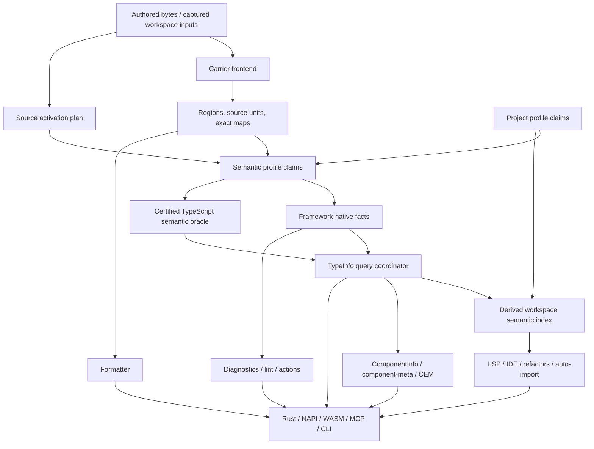
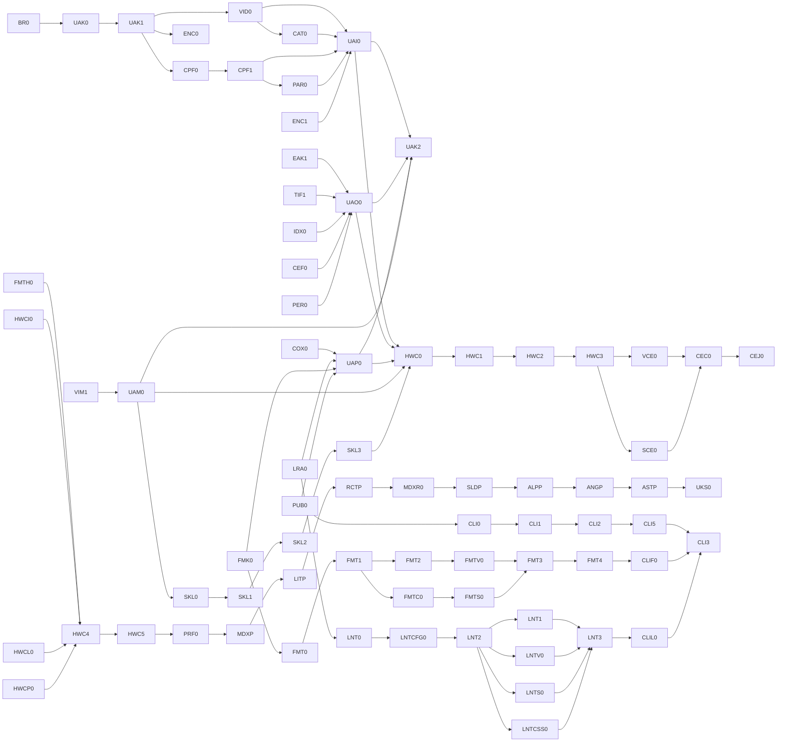

# Verter Universal Frontend Tooling — Architecture-First Successor Program

**Status:** architecture proposal; not execution authority  
**Revision:** 4 — supersedes the 251-charter all-verticals proposal  
**Prepared:** 2026-08-26  
**Repository basis:** `program/architecture-lock` at `d1f3d50a948597f036868543b9bb21acacd730ff`  
**Current-program condition:** maintainer work freeze; `TCM0 = RESCOPE_REQUIRED`; `TCM1`–`TCM4 = LOCKED`  
**Scope:** source tooling only—parsing, semantic analysis, TypeInfo, diagnostics, lint/fixes, formatting, IDE/LSP, component information, maps, index/graph, and Rust/NAPI/WASM/MCP/CLI surfaces. No browser, Node, server, hydration, rendering, or framework runtime.

## 1. Decision

The previous proposal had a strong target architecture but the wrong execution shape. It attempted to lock formatter, lint, CLI, fifteen language/framework verticals, Web Components, and project profiles in one 251-block program. That would freeze immature assumptions, couple unrelated releases, and make a late Qwik, Glimmer, or SvelteKit problem capable of withholding an otherwise production-ready Verter CLI.

This revision replaces that shape with five independent layers:

1. **Repair and finish Rev11/TCM honestly.** The missing DAG edges, rejected TCM0 acceptance basis, stale ADR evidence, and live `SourceUnitId` conformance defect must be repaired before the successor program can claim an accepted foundation.
2. **Ratify a bounded universal-tooling kernel through scoped locks.** Identity/parser, observation/TypeInfo, capability/public, and manifest/governance contracts close independently; a read-only convergence block makes the provisional universal claim. The kernel does not implement every framework or gate unrelated product work.
3. **Ratify repository workflow skills.** Agents receive one planning skill and one implementation skill backed by a deterministic repository validator. A skill cannot invent architecture or ratify its own output.
4. **Implement HTML + standards Custom Elements first.** It is the highest-unlock architectural project and the correct place to prove independent parser ownership, neutral HTML semantics, cross-framework component information, and Vue/Svelte Custom Element integration.
5. **Falsify the kernel sequentially with small representative slices.** MDX, Lit, React then Solid, Alpine, Angular, and Astro exercise different source geometries. Only after these slices pass does the architecture become a stable basis for independently promoted full verticals.

The resulting active proposal has **89 provisional, copy-ready charter specifications**, rather than a global 251-charter release. They are not ratified charters until their lock block supplies exact paths, corpus revisions, numeric gates, candidate basis, authority digest, and reviewers. Large mutation domains are split into independently state-tracked blocks. No full Marko, Ember/Glimmer, Angular, React, Solid, Qwik, Preact, Stencil, Astro, or project-profile vertical is placed on the kernel’s release-critical path. Those remain explicit portfolio entries generated and ratified one at a time.

Universality is a property of the extension architecture, not a requirement that every ecosystem ship in one program. The kernel is credible only if radically different geometries can extend it without changing semantic authorities; the number of framework badges is not an architecture metric.

This is intentionally breaking-change friendly. Existing names, traits, wire schemas, registries, and package surfaces survive only when they remain the best authority. Compatibility is never allowed to preserve a second resolver, parser registry, type schema, cache, map family, or command implementation.

## 2. What is binding, provisional, and deferred

### 2.1 Binding target

- Verter is a universal **frontend source-tooling** system, not a universal runtime.
- Vue and Svelte compilation remain admitted Verter products. A future Astro compiler may be proposed separately; it is not a prerequisite for Astro tooling.
- Each admitted vertical can own parsing, semantic facts, TypeInfo contributions, component views, diagnostics, lint/fixes, formatting, LSP/IDE behavior, exact maps, indexing, and public Rust/NAPI/WASM/MCP/CLI access without owning runtime compilation.
- `verter typecheck`, `verter tsc`, and `verter compile` have different semantics. `typecheck` never emits; `tsc` is the TypeScript-compatible driver over admitted source projections; `compile` invokes only an admitted Verter compiler backend.
- Rust core coordinates are typed UTF-8 byte offsets. All other encodings exist only in tagged boundary adapters.
- Full public support is capability truthful. An inapplicable operation is explicitly `NotApplicable`; an unimplemented operation is `Unsupported`; missing inputs are `NeedInputs`; ambiguity is not an empty success.

### 2.2 Provisional until evidence passes

- The exact public TypeInfo schema epoch.
- Whether any parser implementation is later shared across HTML-family carriers.
- The exact corpus and numeric performance thresholds for a future vertical.
- The priority score of a future vertical at the time its lock is opened.
- Any project-profile vocabulary beyond the identity and contribution seams needed to prevent a retrofit.

### 2.3 Explicitly deferred

- Astro runtime compiler or an `@astrojs/compiler-rs` replacement.
- Runtime/rendering/hydration/server ownership for every framework.
- Qwik 1.x. Only a separately locked Qwik 2 semantic epoch may ever be admitted.
- Dynamic native/WASM parser or framework plugins.
- An omni parser or universal framework IR.
- Persistent semantic caches until a separate ADR proves an actual consumer, invalidation law, corruption recovery, privacy boundary, and performance win.
- Full project-profile implementations until the language/framework kernel and at least one full new vertical are accepted.

## 3. Current-source correction and mandatory Rev11 bridge

The old proposal was based on `323bc7f…`. The live branch is now `d1f3d50…`, and its TCM state materially changes the architecture. The successor program must not rewrite that history as accepted.

### 3.1 Current TCM facts

- `TCM0` is `RESCOPE_REQUIRED`. All three exact-candidate review mandates failed: 36 findings total. The stored 2026-08-26 remediation ruling is not ratified while the maintainer freeze is in force.
- `TCM1` owns typed `SourceProjectionMap` geometry within `CodeTransform`; placement maps, TypeScript projection maps, runtime source maps, and encoded source maps remain distinct products.
- `TCM2` owns exactly one TypeScript content-mapper transport/codec and terminal TypeScript span-feature serialization. It is a projection plane, not a parser host or semantic-query channel.
- `TCM3` owns the narrow, snapshot-bound `TypeSemanticOracle` for Verter-owned operations that need certified TypeScript semantics. Native framework facts remain independent; neither source silently overwrites the other.
- `TCM4` alone may atomically activate the new planes and delete the legacy relay.
- Legal order is strictly: TypeScript requests transform → Verter returns output/maps → TypeScript commits a snapshot → Verter may query the semantic oracle. A mapper callback never calls the oracle, LSP, or a TypeScript snapshot.

### 3.2 Required `AMD-TCM-PRECONDITIONS` act

Before successor `BR0` can be accepted, one ratified Rev11 amendment must:

1. add `G2` as a predecessor of `TCM3`, because TCM3 requires G2’s `FlightCell` and forbids a local duplicate;
2. add `H2` as a predecessor of `TCM4`, because activation consumes H2-owned exact provider binding and applied-generation authority;
3. add `TCM4` as a predecessor of `K3`: TCM4 is the primary deletion owner for the editor/plugin relay cells named by K3, and K3 is their post-activation residual verifier;
4. retain the existing `H3 → K3 → L1 → L2 → L4` path, making a direct `TCM4 → L1` edge redundant;
5. reopen and revalidate `K3`/`L1`/`L2` if any was accepted on a pre-TCM tree—a paper edge cannot certify stale deletion, soak, or performance evidence;
6. re-authorize and re-pin every affected charter, authority-registry entry, program-state record, and DAG digest;
7. complete TCM0’s derive-not-declare remediation and re-run all three independent review mandates on one exact candidate;
8. replace both stale ADR-021 passages: use the captured mapper `rejectHandler` evidence for acyclicity and probe 7’s `initialize → openProject → transform → closeProject` transcript for exact lifecycle/method isolation;
9. ratify one canonical Rev11 observation-identity contract—`CertifiedTypeEngineBinding`, `InputBasisId`/`TypeObservationBasis`, generic `QueryIdentity`, `ResultContractId`, and `SemanticFlightKey`—consumed by H2/TCM3/TCM4 and later successor queries: engine binding includes provider contract, executable/package/artifact identity, provider/process epoch, bound project, trust, and advertised capabilities; input basis contains only operation-relevant source/map/project/config/resolver/lib/program generations and positive/negative reads; result contract contains required exactness/completeness plus unsupported/degradation policy; actual completeness exists only in result provenance;
10. complete every TCM1/TCM2/TCM3/H2 coordinate migration, deletion, Unicode test, and owner criterion before TCM4 activation: TCM2 owns mapper-wire conversion, TCM3 owns semantic-oracle conversion/mapping, H2 owns only core-UTF-8↔direct-provider-wire conversion, and the client-LSP boundary remains distinct;
11. state explicitly that one mapper protocol may dispatch to multiple statically linked carrier frontends but creates neither a parser authority nor a dynamic plugin ABI.
12. reopen B4 identity closure or add a bounded Rev11 repair upstream of TCM4/L4 that makes `SourceUnitId` stable logical lineage, migrates revision/content-hashing consumers, computes the exact invalidation/revalidation closure, and records its accepted receipt for successor genesis.

These changes belong in Rev11 because retrofitting backend identity, observation provenance, coordinate geometry, or final performance evidence after activation would make cache and correctness claims unsound. New parsers, new framework semantics, TypeInfo CLI expansion, Custom Elements, coexistence UX, and workflow skills remain post-Rev11.

### 3.3 Type authority correction

There is no single universal type solver.

- `TypeInfoService` is the canonical public query façade and composition coordinator.
- Verter’s native TypeInfo resolver is authoritative only for the native facts it owns.
- For a selected certified TypeScript project/snapshot, the official TypeScript semantic API is authoritative for TypeScript-compatible checker facts.
- Framework verticals own their framework-native semantic facts.
- A query plan may compose these facts only with explicit authority, backend, project, snapshot, map, completeness, and read-set provenance. It never chooses a field-wise winner, silently falls back, or republishes a recreated TypeScript fact as native.
- The workspace graph is a derived index of admitted facts, not a checker or type authority.

`component-meta` therefore becomes a thin TypeInfo query/projection/serialization surface. It owns no parser, resolver, project selection, checker, type lowering, graph, or cache. Custom Elements Manifest is another eligible serializer over standards-level facts, not Verter’s internal component model.

## 4. Target architecture



The arrows are dependency directions, not permission for downstream products to become upstream authorities.

### 4.1 Orthogonal identities

The current `FileLanguage::Framework { adapter_id, language_id }` shape conflates syntax carrier and framework semantics. The successor model separates at least:

| Identity | Meaning |
|---|---|
| `SourceUnitId` | Stable logical authored/generated unit lineage, independent of revision/content |
| `CarrierProfileId` | Syntax/recovery contract for the bytes being parsed |
| `ParserGrammarEpoch` | Exact grammar and recovery epoch owned by that carrier frontend |
| `RegionId` / `AttachmentId` | Stable nested or attached authored region identity |
| `FrameworkReleaseId` | One exact supported semantic release/epoch, such as `vue2_6` or `vue3` |
| `SemanticClaimId` | Proven region/symbol-level activation and its evidence |
| `ProjectProfileInstanceId` | Next/Nuxt/SvelteKit/etc. project semantics, independent of TS configured ownership |
| `ProjectBindingId` | Existing configured TypeScript project ownership/binding |
| `CertifiedTypeEngineBinding` *(imported)* | Accepted Rev11 binding and sole owner of semantic-backend contract, artifact, provider/process epoch, bound project, trust, and capabilities |
| `CapabilityId` | Operation and maturity advertised on a public surface |

A file may have several semantic claims and several project memberships. A region has one resolved parser owner for one grammar contract. Versioned products key explicit tuples such as `(SourceUnitId, SourceRevision, ContentId, MapRevision)`; revision/content is never smuggled into the stable lineage identity. The current implementation’s revision/content-derived `SourceUnitId` is a live Rev11 conformance defect that must be repaired before L4/`BR0`, not normalized or deferred into the successor. The successor never defines a second backend/process identity: it consumes the accepted `CertifiedTypeEngineBinding` and its provider/process epoch. A project profile never creates or selects a TypeScript program; it partitions semantic demands and uses the existing configured-owner resolution to obtain a certified bound project.

### 4.2 Framework version law

One vertical manifest represents one exact supported framework release or ratified semantic epoch. It never contains a `versions = […]` switch.

- Vue 2.6 and Vue 3 are distinct `FrameworkReleaseId`s, manifests, activation rules, cache epochs, rule matrices, oracles, and maturity rows.
- Multiple installed releases may coexist only as different vertical identities proven by package resolution. One region resolves to one final identity or a typed ambiguity.
- Additional patch builds may share an identity only if an independently ratified conformance proof shows no semantic branch is required.
- “Latest” is not an identity and never keys a cache.
- Qwik 1 has no profile. A Qwik 2 profile remains dormant until an exact Qwik 2 release/epoch is deliberately accepted; current official Qwik 2 releases are still marked prerelease.

### 4.3 Catalog and registration

Keep one immutable `FrontendCatalogSnapshot` construction authority with typed tables rather than flattening unrelated things into one framework enum:

```text
FrontendCatalogSnapshot
  carrier_frontends
  semantic_profiles
  project_profiles
  embedded_language_roles
  interoperability_schemas
  public_capabilities
  rule_and_action_manifests
```

The existing framework registry, carrier registry, descriptor-generated client manifest, and generic LSP routing are migrated into this authority. There is no parallel “universal” registry and no per-framework VS Code wiring. Registration is static at build time for Rust/NAPI/WASM reproducibility; a vertical manifest is not a dynamic plugin ABI.

### 4.4 Carrier frontend versus compiler backend

The current compiler-shaped carrier trait must not force tooling-only languages to pretend they compile. Split it conceptually into:

- `CarrierFrontend`: parse, recovery, source units, authored maps, tooling projections, syntax facts, and optional format views;
- `CarrierCompilerBackend`: optional admitted runtime/SSR/IDE compilation products for a carrier that Verter deliberately compiles.

Vue and Svelte migrate behavior-preservingly. Astro, MDX, HTML, Marko, or Glimmer can become complete tooling verticals without an `Unsupported` compiler stub being their architectural identity. Compiler capability remains an explicit independent catalog row.

### 4.5 Parser policy: no omni parser

“One parser authority” means one owner for `(CarrierProfileId, ParserGrammarEpoch)`, not one implementation for all frontend syntax.

Every vertical lock records `ParserDecision = Reuse | ForkAndSpecialize | NewParser` with evidence:

- OXC remains the parser for genuine JS/TS/JSX/TSX bytes.
- Vue and Svelte retain dedicated carrier frontends.
- Neutral HTML begins as an exact, license-recorded copy/fork of the Vue template/HTML parser, with Vue behavior removed and independent standards recovery/corpus ownership.
- Angular, Alpine, and HTMX initially attach semantic claims to the neutral HTML product. They do not each receive another HTML parser without grammar evidence.
- Astro, MDX, Marko, and Glimmer receive dedicated parsers where their carrier grammar actually requires one.
- Equal bytes may reuse a parse only when carrier profile, grammar epoch, parse options, and recovery contract are equal. A content hash alone is insufficient.

A future `HFC-FUTURE` investigation may begin only after at least three accepted HTML-family parsers and measured duplication exist. It may extract proven-neutral scanning/entity/tree primitives one consumer at a time. It may also conclude that independent parsers remain best. It must never create a growing framework branch matrix, shared invalidation coupling, or semantic leakage.

### 4.6 Two-stage activation and demand

Profile selection and capability execution are separate:

1. `SourceActivationPlan` is created from captured source, package, static config, path, and Verter-native provenance. It can affect parse/projection selection and therefore cannot call TypeScript semantics.
2. `SemanticClaimPlan` runs only after an eligible snapshot exists. It may use the certified TypeScript oracle to refine symbol/type meaning, but it cannot retroactively alter the current mapper transform. A projection-affecting change requires a new source generation.
3. `CapabilityDemandPlan` names the exact facts/products required for the requested operation. Merely selecting React, Angular, or Vue never runs every lint rule, formatter view, metadata projection, or workspace contributor.

All three plans are immutable, revision-bound, and included in observable audit evidence. `Disabled` profile participation performs zero parse, index, config, watcher, oracle, or publication work attributable to that profile.

### 4.7 Symbol-proven embedded languages

Embedding is generic geometry plus profile-owned activation—not bespoke string searching.

For Vue:

```ts
import { defineComponent as dc } from 'vue'
const defineComponent = dc

defineComponent({
  template: '<div>Hello {{ name }}</div>',
  setup() { return { name: 'Verter' } }
})
```

Activation requires a proven chain to the exact admitted Vue export. Direct aliases, namespace access, local barrels/re-exports, destructuring, and immutable local alias chains are supported when provenance is certain. Same-spelled userland functions, mutation, wrappers, conditional aliases, unresolved packages, and ambiguous origin fail closed.

`EmbeddedTextCodec` owns raw↔cooked geometry, escapes, delimiters, CRLF, interpolation holes, base URI, and exact map composition. Vue options templates, Angular inline templates, and Lit tagged templates may share that geometry while retaining different activation, grammar, hole, and semantic rules. Dynamic/non-invertible regions return typed partiality or `NeedInputs`; they are never mapped to a nearby token.

Every coordinate that leaves `EmbeddedTextCodec` is a typed UTF-8 byte coordinate. Each profile chooses raw or cooked input explicitly. A cooked JavaScript value is admitted only when it is valid Unicode scalar text and can be encoded as UTF-8 with an exact authored-byte map; lone surrogates, invalid tagged-template escapes, or any non-invertible value return `NonUnicodeCookedLiteral`/typed partiality before an embedded parser runs. No UTF-16-code-unit or WTF-8 offset can enter core/public DTOs, cache identities, diagnostics, edits, or indexes. Required tests include lone surrogates, surrogate pairs, invalid tagged escapes, line continuations/CRLF, escaped delimiters, and interpolation holes.

Ordinary `.ts`/`.tsx` remains TypeScript-owned and is not sent through the content mapper. Post-snapshot embedded semantics may use TCM3; no mapper callback does so, and no second TypeScript program is created.

### 4.8 TypeInfo and component information

The canonical public request family includes at least:

- type at a file position;
- declared type of a named file symbol;
- bounded workspace/project name search returning a stable candidate set;
- symbol resolution/relation queries;
- framework surface and component information views.

Position/file requests carry the exact source revision. Project/workspace name searches instead carry a captured project/workspace view identity plus the complete positive/negative read set; there is no fabricated single source revision. Every request also carries selector, project/binding policy, completeness policy, cancellation, budget, and—when a line/character position is used—an explicit encoding. Name-only ambiguity returns `NeedSelection` plus candidates, never the first result.

The accepted Rev11 observation-identity contract remains the sole generic owner of `CertifiedTypeEngineBinding`, `InputBasisId`/`TypeObservationBasis`, generic `QueryIdentity`, `ResultContractId`, and `SemanticFlightKey = (QueryIdentity, InputBasisId)`. `TIF0` consumes those types and solely owns TypeInfo-specific operation descriptors and their canonical equality material; it does not redefine the runtime/G2 flight law. Actual completeness belongs in result provenance. Performance/cache blocks consume and test this partition; they do not redefine it.

`ComponentInfo` is a versioned view over TypeInfo roots/type-role bindings plus framework-owned facets such as props, attributes, events, slots/children, exposed methods, reactivity, directives, CSS parts/properties, or client/server boundary. It is not a closed universal component IR. Every facet declares owner, schema epoch, applicability, completeness, and provenance. A field may enter the generic surface only when at least two semantically independent framework families need genuinely equivalent semantics and cross-framework interoperability benefits; otherwise it remains an owner-tagged facet.

`component-meta` and compatibility renderers query the same service. They may rename or reshape output for vue-component-meta-compatible consumers but cannot own type expansion or cache results independently.

### 4.9 Semantic index and project semantics

The workspace index stores derived, snapshot-bound contributions and typed edges. It never resolves a type by itself. At minimum it can relate source units, regions, symbols, components, Custom Element registrations, imports, consumers, assets, links, routes, profiles, and project memberships.

Contributors stage a complete immutable delta and publish atomically only if their source, activation, backend, and project bases are still current. Cancellation, overflow, missing input, ambiguous project association, or partial enumeration cannot publish a cacheable empty result.

The user’s proposed layering is correct and important:

```text
source language/carrier → framework semantic profile → project profile
```

Examples are TSX → React → Next, Vue SFC → Vue → Nuxt, and Svelte → Svelte → SvelteKit. The kernel reserves these independent identities and contribution seams now. It does not freeze Next-shaped route vocabulary prematurely. Next is the first intended project-profile implementation, while Nuxt and SvelteKit counterexample fixtures must challenge the generic vocabulary before its stable lock.

### 4.10 Custom Elements as interoperability

Custom Elements are a standards interop facet, not a super-framework. Every vertical manifest separately dispositions:

- `ProducesCustomElement = Required | Unsupported(reason) | NotApplicable`;
- `ConsumesCustomElement = Required | Unsupported(reason) | NotApplicable`.

Framework-owned producer detection uses proven symbols, carrier directives/options, captured static config, and registry association. Filename suffix is candidate evidence only. Required cases include Vue `.ce.vue`/`defineCustomElement`, Svelte custom-element mode, Lit, Stencil, vanilla `customElements.define`, and separately admitted Angular Elements or wrappers.

`CEF0` owns the standards/CEM contract only. `HWC3` implements standards-fact projection, registry analysis, and CEM import/export against that contract. A framework owns its producer/consumer evidence and how it binds or consumes the resulting standards facts; it never serializes a private CEM dialect. Registry scope, declaration, registration, framework component identity, and runtime reachability remain separate; static uncertainty returns `Ambiguous` or `Incomplete`.

### 4.11 Coordinates and map families

Rust core uses only typed UTF-8 byte offsets and ranges. Source/generated/embedded offsets are distinct newtypes; unchecked integers and implicit coordinate domains are invalid public contracts.

- LSP converts the negotiated UTF-8/UTF-16/UTF-32 encoding at ingress/egress.
- NAPI/WASM/FFI/CLI requests carry an explicit tagged encoding or a byte-offset selector.
- TypeScript mapper wire conversion happens only in TCM2 terminal serialization.
- TCM3 owns semantic-oracle request/result conversion and generated↔authored mapping against the exact snapshot and `SourceProjectionMap` basis.
- H2 owns only core-UTF-8↔direct-provider-wire conversion. The client-LSP negotiated-encoding boundary is separately owned by the editor adapter; the successor encoding train audits both without taking over their maps.
- Prepared parses, projections, native facts, and indexes are not keyed by requested terminal encoding.
- Invalid code-point boundaries, overflow, stale line indexes, or non-invertible maps return typed errors/partiality.

`PlacementMap`, `SourceProjectionMap`, runtime source maps, encoded source maps, formatter authored maps, and action/edit maps remain different products. They may share compact primitives but never one universal mask. TCM2 alone materializes TypeScript `SpanMapFeature`; formatter and refactor engines own their authored edit geometry.

### 4.12 Editor coexistence

Public per-profile policy is:

- `auto`: editor-host policy, resolved before entering Rust;
- `disabled`: zero work for that profile;
- `workspace`: bounded, demand-driven workspace semantics/index contributions, but no document diagnostics, formatting, completion, navigation, actions, or other editor claims;
- `full`: all applicable interactive and workspace capabilities.

Internally the effective state is `Disabled | WorkspaceOnly | Full`, used only as a preset. The VS Code host compiles it and observed conflicts into an abstract per-profile, per-document-selector capability ownership mask covering diagnostics, completion, navigation, formatting, actions, and other groups independently. Rust core receives that mask, never extension IDs. Explicit user choice wins. A formatter-only competitor therefore withdraws only formatting. Mode/mask transitions cancel withdrawn work, bump activation/provider epochs, clear withdrawn diagnostics/registrations, and reject stale responses.

### 4.13 Diagnostics, lint, fixes, and actions

Diagnostics, lint rules, fixes, and refactors are related but not one engine. Rules use namespaced IDs and exact applicability `(carrier, framework release, project profile, fact demands)`. Common rules may consume neutral facts; framework rules remain owner-local. Every fix/action states safety class, applicability, exact basis, conflict policy, and whether it is safe for automatic application.

The canonical native configuration is a versioned declarative `verter.config.jsonc`, scoped by file, carrier, framework release, and project profile. The kernel config authority owns only capture, root/extends/override precedence, provenance, read sets, trust, and invalidation. Product-specific rule/option schemas and translators are owned after the lint/formatter contracts exist. Precedence is:

1. explicit API/CLI request;
2. nearest captured Verter config according to the locked root policy;
3. captured supported ecosystem configuration;
4. built-in defaults.

Downstream lint/formatter translators may statically translate admitted ESLint, TypeScript-ESLint, Vue/Svelte lint, Stylelint, and Prettier-compatible settings only after their rule/option schemas are ratified. Arbitrary JavaScript configuration or third-party rule execution never enters Rust/WASM. An optional trusted out-of-process host may execute unsupported ecosystem rules; its results are tagged `External`, never silently treated as Verter-native, never duplicated with a native rule, and its edits enter the authored action transaction only after exact-basis validation.

### 4.14 Formatter

Verter owns a full native formatter, including script/style contents and whole Vue/Svelte/HTML documents. It exposes one Prettier-facing option vocabulary and two behavior profiles:

- `prettier-exact`: any admitted divergence is a bug or explicitly unsupported compatibility cell;
- `verter-default`: may intentionally correct a proven Prettier defect, with a pinned regression and rationale.

oxfmt is evidence/oracle material only when it demonstrates or fixes a concrete Prettier bug. Verter exposes no oxfmt configuration surface and has no oxfmt runtime dependency.

The formatter owns a compact document algebra/printer, stable trivia/recovery views, range expansion, cursor preservation, minimal authored edits, and `FormatPositionMap`. Framework composition delegates JS/TS/JSX/TSX and CSS-family regions to the corresponding Verter printers while each carrier owns outer syntax and embedded boundaries. Lint fixes are not formatting; composition occurs only in an explicit CLI/session transaction.

### 4.15 Public surfaces and CLI

One versioned request/result vocabulary is projected consistently through Rust, NAPI, WASM, LSP, MCP, and CLI. Each surface publishes a generated capability matrix and truthful maturity. WASM returns `NeedInputs` where it lacks filesystem/project inputs; it does not fabricate parity.

The canonical executable is `verter`. The preferred npm package is `@verter/cli`; an unscoped `verter` package may become an alias only if package ownership and the current private root-package name are resolved explicitly. Existing `verter-tsc`, `verter-lsp`, and `verter-mcp` entry points become thin wrappers over the one implementation at cutover, remain for one explicitly named published release, and may be deleted only by a later receipt-backed charter.

Required commands:

```text
verter typecheck
verter tsc
verter compile
verter lint
verter fmt
verter check
verter fix
verter type-info
verter lsp
verter mcp
```

`verter typecheck` is Verter’s composed non-emitting type-diagnostic plan: carrier/framework-native type diagnostics plus the selected certified TypeScript project diagnostics, with lint and formatting excluded. `verter tsc` is the certified TypeScript-compatible command/emit driver over admitted projections; `tsc --noEmit` preserves tsc flag/config/diagnostic semantics and is not an alias for `typecheck`.

`verter type-info` supports:

```text
verter type-info --file FILE --at LINE:CHAR --position-encoding utf-8|utf-16|utf-32
verter type-info --file FILE --offset UTF8_BYTE
verter type-info --file FILE --name NAME
verter type-info --name NAME [--project ROOT]
```

Human CLI `LINE:CHAR` is 1-based; `CHAR` counts code units in the explicitly selected encoding. `--offset` is a 0-based UTF-8 byte offset. Machine requests use a structured 0-based tagged position and never inherit the human convention implicitly.

Machine output is schema-versioned and stable within its declared epoch. Human reporters are presentation-only.

### 4.16 Performance, security, and longevity

Performance is part of correctness:

- parse at most once per source revision and exact parser contract;
- zero profile work when disabled and zero unrequested capability work when merely selected;
- work proportional to changed facts, candidates, requested results, and bounded project partitions;
- G2-owned same-key coalescing; no per-vertical singleflight system;
- cancellation and stale-basis rejection at every async boundary;
- incremental=fresh equivalence and long-session RSS plateau;
- explicit file, region, recursion, queue, candidate, result, map, and external-process budgets;
- no ambient filesystem/network/process access in reusable core;
- no executable config or third-party plugin inside Rust/WASM;
- prepared native artifacts are independent of a TypeScript backend when they contain no TypeScript-derived observation;
- cached-candidate lookup uses the accepted snapshot-independent `QueryIdentity` only;
- in-flight TypeScript observation production is coalesced only by the G2-owned `SemanticFlightKey = (QueryIdentity, InputBasisId)`;
- each candidate/result carries its complete `InputBasisId`/read facts and backend/project/snapshot/map provenance value-side, and reuse requires revalidation of that provenance against the captured request basis; the lookup key is neither a completeness claim nor a reconstruction of the observation basis.

Numeric gates are locked before implementation against an immutable corpus and equivalent-work baseline. “Faster” claims without exact revisions, work, cache state, machine class, result validation, and RSS are inadmissible.

## 5. Governance and release model

### 5.1 Independent locks and terminals

- Four independently usable scoped kernel contract locks plus one non-release read-only convergence claim.
- One exact implementation lock per vertical release.
- Independent formatter, lint, CLI, language/framework, and project-profile terminals.
- Cross-vertical and cross-project suites are continuous soak/quality joins, not global release serialization gates.
- Capability maturity is per operation and surface: `Experimental | Preview | Supported | Stable`.

No vertical implementation chooses its oracle, corpus, unsupported cells, performance gates, or pass criteria after seeing its output.

### 5.2 Codex Architect authority

“Codex Architect” is a mandatory independent architecture-review seat. It produces an exact-digest receipt containing model/runtime identity, candidate SHA/tree, charter and manifest digests, findings, fixes, and re-review verdict. The author or implementing agent cannot be the sole architect reviewer.

Under current governance, a model does not unilaterally create repository authority. The designated maintainer still adopts the amendment and authorizes landing unless a separate governance amendment explicitly delegates that power. Calling Codex the sole authority without that amendment would be weaker governance, not stronger architecture.

### 5.3 Vertical workflow

Every future vertical follows:

```text
feasibility/oracle dossier
  → exact-release vertical lock
  → parser/activation/map slice
  → native facts + TypeInfo slice
  → diagnostics/lint/actions slice
  → formatter + LSP/IDE slice
  → public-surface parity slice
  → performance/conformance/adversarial terminal
```

Each slice is independently reviewable and has explicit deletion and abort criteria. Compiler work, if any, is a separate optional train and never a tooling-terminal predecessor.

### 5.4 Successor program ledger

One repository-owned schema and validator governs every block state. Each record contains: schema epoch; charter ID and exact predecessor list; freeze scope/state; candidate commit/tree; accepted commit/tree; charter, manifest, authority-registry, DAG, corpus, and gate digests; reviewer identity/verdict receipts; maintainer decision; implementation and deletion receipts; landing-equivalence proof; and amendment impact closure.

State recognizes two different events. An **invalidating amendment** changes an accepted basis and mechanically computes every affected downstream receipt; nothing in that closure remains accepted without an explicit revalidation. A **non-invalidating follow-up/version proposal** leaves the accepted contract/version and existing release receipts immutable and may gate only future work. A soak join such as `CEJ0` emits the latter by default; reopening `CEF0` or another accepted owner requires a separate maintainer impact decision naming the invalidation closure.

The validator rejects READY/ACCEPTED when a predecessor, digest, reviewer separation, final-tree equivalence, or required external genesis field is absent. A convergence block re-runs its declared invariants on one cumulative candidate; it cannot infer final-tree correctness by concatenating receipts from earlier candidate SHAs. The canonical node set/predecessors must equal generated tables, charter predecessor headers, dispatch manifests, and state records; node metadata must equal generated tables, dispatch/state records, and materialized charter front matter. An explicitly labeled non-normative diagram is excluded from equality and may draw only canonical direct edges or visibly labeled transitive summaries.

## 6. Priority model and execution waves

At each vertical feasibility lock, recalculate this ordinal hypothesis:

`Priority = 30% marginal DX opportunity + 20% implementation economy + 20% ecosystem reach + 30% architectural unlockability`

The score never overrides prerequisites or correctness. “Marginal DX” measures improvement over the strongest incumbent tooling, not raw feature count. Popularity surveys are self-selected and are evidence, not truth.

All factors use a 1–5 ordinal scale. `Economy` is high when implementation/support cost is low. Confidence is the quality of present evidence, not the probability of success. Scores are dated 2026-08-26 and must be rerun at the exact-release lock.

| Target | DX | Economy | Reach | Unlock | Weighted | Confidence | Effort/support band | Hard prerequisites |
|---|---:|---:|---:|---:|---:|---|---|---|
| MDX | 5 | 3 | 4 | 5 | **4.4** | Medium | M / M | kernel; bounded generic component provider; `MDXR0` is evidence and React-specific production waits `RCP2-FUTURE` |
| HTML + Custom Elements | 3 | 4 | 5 | 5 | **4.2** | High | M / M | kernel; independent HTML parser proof |
| React | 3 | 4 | 5 | 5 | **4.2** | Medium | M / H | TSX overlay/TypeInfo; no new parser |
| Lit | 4 | 4 | 3 | 5 | **4.1** | Medium | S–M / M | embedding + HTML/WC |
| Alpine | 5 | 4 | 3 | 4 | **4.1** | Medium | M / M | neutral HTML + attribute claims |
| HTMX | 5 | 5 | 3 | 3 | **4.0** | Medium | S / M | HTML + selector/route input seams |
| Solid | 4 | 4 | 3 | 4 | **3.8** | Medium | M / M | React proof immediately before it |
| Astro tooling | 3 | 2 | 4 | 5 | **3.6** | Medium | L / H | dedicated-carrier proof; no compiler dependency |
| Angular | 2 | 2 | 5 | 5 | **3.5** | High | XL / H | HTML, embedding, project association, grammar decision |
| Preact | 3 | 5 | 3 | 3 | **3.4** | Medium | S / M | React; separate native/compat evidence |
| Stencil | 3 | 3 | 2 | 4 | **3.1** | Medium | M / M | TSX + Custom Elements |
| Ember/Glimmer | 3 | 1 | 2 | 4 | **2.7** | Low–medium | XL / H | dedicated/attached grammar and project layout |
| Qwik 2 | 4 | 2 | 1 | 3 | **2.7, blocked** | Low | L / H | exact accepted Qwik 2 epoch; React/Solid overlay seams |
| Marko | 3 | 2 | 2 | 3 | **2.6** | Medium | L / M | dedicated-carrier proof |

Project-profile hypotheses currently exist only for Next 4.2, Nuxt 4 3.3, and SvelteKit 3.1. Every other named project profile is explicitly unscored and deferred until its prerequisite vertical and independent feasibility evidence exist; table position must not be read as rank.

Architecture-falsification order is based on geometry, not the weighted market score:

`HTML/WC → generic MDX → Lit → React → MDX/React provider → Solid → Alpine → Angular → Astro`

Product-investment order after stable-kernel proof, applying hard prerequisites first and then non-increasing score with effort/support risk as the tie-breaker, is currently:

`HTML/WC foundation → bounded React provider → MDX → React → Lit → Alpine → HTMX → Solid → Astro → Angular → Preact → Stencil → niche/volatile`

The dated exception ledger is exhaustive:

| Sequence | Lower-scored work before higher-scored work | Why it is permitted | Expiry |
|---|---|---|---|
| Architecture proof | HTML/WC before MDX; Lit before React; Solid before Alpine; Angular before Astro | bounded geometry falsification only: neutral carrier/CE substrate, embedding/hole geometry, TSX anti-React counterproof, then external/inline attachment; these are not product promotions | each exception disappears when its named proof receipt is accepted |
| Product investment | HTML/WC 4.2 before MDX 4.4 | hard substrate/unlock for neutral HTML, CE interchange, Lit, Alpine, HTMX, and Angular; only the minimum foundation/Supported closure is admitted | HWC foundation/terminal receipt |
| Product investment | bounded React-provider work before MDX 4.4 | the requested React-specific MDX auto-import/navigation contract cannot truthfully promote before `RCP2-FUTURE`; this does not pull the full React vertical ahead of MDX | `RCP2-FUTURE` receipt |

There is no popularity or preference override beyond this ledger. After those prerequisites, the product list is score-monotonic; Lit wins the 4.1 tie over Alpine on its smaller present effort band. A new inversion requires a dated amendment naming evidence, bounded scope, and expiry.

Recommended waves:

1. **Wave 0:** obtain the repair-scoped freeze lift, ratify the Rev11 amendment, finish TCM/identity repairs and L4, then obtain a separate successor-genesis authorization.
2. **Wave 0.5:** close scoped kernel contracts as they become ready; start workflow skills from the manifest/governance lock and formatter, lint, and CLI from their own smallest contract locks. `UAK2` is read-only convergence, not their gate.
3. **Wave 1:** HTML + Custom Elements, including explicit Vue and Svelte producer/consumer retrofits and the Vue embedded-template canary.
4. **Wave 2:** sequential architecture falsification slices: generic MDX → Lit → React → React-in-MDX provider → Solid → Alpine → Angular → Astro.
5. **Wave 3:** finish the HTML/WC public foundation/Supported closure, promote the bounded React component provider, then implement the full MDX vertical; generic MDX can advance earlier, but React-specific auto-import/navigation cannot promote before `RCP2-FUTURE`.
6. **Wave 4:** React, Lit, Alpine, HTMX, Solid, Astro tooling, Angular, Preact, and Stencil in current score/tie-break order after their prerequisites. Astro remains a first-class tooling vertical; this ordering makes no compiler commitment.
7. **Wave 5:** project profiles beginning with Next. Nuxt and SvelteKit counterexample fixtures precede stable project-vocabulary ratification.
8. **Wave 6:** Marko, Ember/Glimmer, and Qwik 2 when its exact release gate is satisfied.

The sequence is deliberately revisable at each lock using measured support burden, preview telemetry, incumbent-tool gaps, and implementation evidence. Architecture and correctness gates are not revisable by popularity.

## 7. Active successor DAG

`BR0` is the only in-program entry, but it is not creatable or READY merely because it has no in-program predecessor. The successor ledger must validate two external authorities described in `BR0`: the repair-scoped freeze lift and, after accepted L4, a distinct successor-genesis authorization. The graph has no dependency on a future full vertical or project profile.

The following diagram is explicitly **non-normative**. Every solid arrow shown is a canonical direct edge; omitted edges remain authoritative in TOML.



The TOML below is the sole canonical graph and node-classification ledger. Charter headers, dispatch plans, generated tables, and state files are generated or validated against it. Wildcards and prose-only predecessor aliases are invalid.

```toml
schema = 2

[predecessors]
BR0 = []
UAK0 = ["BR0"]
UAK1 = ["UAK0"]
VID0 = ["UAK1"]
CAT0 = ["UAK1", "VID0"]
CPF0 = ["UAK1", "VID0"]
CPF1 = ["CPF0", "CAT0"]
PAR0 = ["CPF1", "VID0"]
ENC0 = ["UAK1"]
ENCL0 = ["ENC0"]
ENCT0 = ["ENC0"]
ENCF0 = ["ENC0"]
ENC1 = ["ENCL0", "ENCT0", "ENCF0"]
CFG0 = ["CAT0"]
DEM0 = ["CAT0", "VID0", "CFG0"]
EAK0 = ["PAR0", "DEM0"]
EMB0 = ["EAK0", "ENC1"]
TIF0 = ["DEM0", "ENC1"]
TIF1 = ["TIF0", "CAT0"]
IDX0 = ["TIF1", "DEM0"]
CEF0 = ["TIF1", "IDX0", "VID0"]
COX0 = ["DEM0", "IDX0"]
LRA0 = ["CFG0", "TIF1", "IDX0"]
FMK0 = ["PAR0", "EMB0", "ENC1", "CFG0"]
PER0 = ["DEM0", "ENC1", "TIF0", "IDX0", "PAR0"]
PUB0 = ["ENC1", "TIF1", "LRA0", "FMK0", "COX0", "PER0"]
VIM0 = ["CAT0", "PAR0", "DEM0"]
VIM1 = ["VIM0", "CEF0", "COX0", "LRA0", "FMK0", "PUB0", "PER0"]
EAK1 = ["EMB0", "TIF0"]
UAI0 = ["VID0", "CAT0", "CPF1", "PAR0", "ENC1"]
UAO0 = ["CFG0", "DEM0", "EAK1", "TIF1", "IDX0", "CEF0", "PER0"]
UAP0 = ["COX0", "LRA0", "FMK0", "PUB0"]
UAM0 = ["VIM1"]
UAK2 = ["UAI0", "UAO0", "UAP0", "UAM0"]
SKL0 = ["UAM0"]
SKL1 = ["SKL0", "VIM1"]
SKL2 = ["SKL1"]
SKL3 = ["SKL2"]
FMT0 = ["FMK0"]
FMT1 = ["FMT0"]
FCFG0 = ["FMT0", "FMK0", "CFG0"]
FMT2 = ["FMT1", "FCFG0"]
FMTC0 = ["FMT1", "FCFG0"]
HWC0 = ["UAI0", "UAO0", "UAP0", "UAM0", "SKL3"]
HWC1 = ["HWC0", "PAR0", "ENC1"]
HWC2 = ["HWC1", "TIF1", "IDX0"]
HWC3 = ["HWC2", "CEF0"]
FMTH0 = ["FMT1", "FCFG0", "HWC2", "PUB0", "PER0"]
HWCI0 = ["HWC2", "HWC3", "COX0", "PUB0"]
HWCL0 = ["HWC2", "HWC3", "LRA0"]
HWCP0 = ["HWC2", "HWC3", "PUB0"]
HWC4 = ["FMTH0", "HWCI0", "HWCL0", "HWCP0"]
HWC5 = ["HWC4", "PER0", "VIM1"]
VCE0 = ["HWC3", "EAK1", "SKL3"]
SCE0 = ["HWC3", "CPF1", "SKL3"]
CEC0 = ["VCE0", "SCE0"]
CEJ0 = ["CEC0"]
FMTV0 = ["FMT2", "FMTC0", "CPF1"]
FMTS0 = ["FMT2", "FMTC0", "CPF1"]
FMT3 = ["FMTH0", "FMTV0", "FMTS0"]
FMT4 = ["FMT3", "PUB0", "PER0"]
PRF0 = ["HWC5", "CEJ0", "UAK2", "FMT1", "PUB0"]
MDXP = ["PRF0"]
LITP = ["MDXP", "EMB0", "HWC3"]
RCTP = ["LITP", "TIF1"]
MDXR0 = ["RCTP", "MDXP", "IDX0"]
SLDP = ["MDXR0"]
ALPP = ["SLDP", "HWC2"]
ANGP = ["ALPP", "HWC2", "EMB0", "PAR0"]
ASTP = ["ANGP", "PAR0", "EMB0"]
UKS0 = ["MDXP", "LITP", "RCTP", "MDXR0", "SLDP", "ALPP", "ANGP", "ASTP", "HWC5", "CEJ0"]
LNT0 = ["LRA0", "CFG0"]
LNTCFG0 = ["LNT0", "LRA0", "CFG0"]
LNT2 = ["LNTCFG0"]
LNT1 = ["LNT2"]
LNTV0 = ["LNT2"]
LNTS0 = ["LNT2"]
LNTCSS0 = ["LNT2"]
LNT3 = ["LNT1", "LNTV0", "LNTS0", "LNTCSS0", "PUB0", "PER0"]
CLI0 = ["PUB0"]
CLI1 = ["CLI0"]
CLI2 = ["CLI1", "TIF0"]
CLITS0 = ["CLI1"]
CLIC0 = ["CLI1", "CPF1"]
CLI4 = ["CLI1", "TIF1"]
CLI5 = ["CLI2", "CLITS0", "CLIC0", "CLI4", "PER0"]
CLIF0 = ["CLI1", "FMT4"]
CLIL0 = ["CLI1", "LNT3"]
CLI3 = ["CLI5", "CLIF0", "CLIL0"]

[node]
BR0 = { kind = "genesis", product = "governance", release_gating = "external" }
UAK0 = { kind = "audit", product = "kernel", release_gating = "none" }
UAK1 = { kind = "constitution", product = "kernel", release_gating = "none" }
VID0 = { kind = "contract", product = "kernel", release_gating = "none" }
CAT0 = { kind = "contract", product = "kernel", release_gating = "none" }
CPF0 = { kind = "proof", product = "kernel", release_gating = "none" }
CPF1 = { kind = "cutover", product = "kernel", release_gating = "none" }
PAR0 = { kind = "contract", product = "kernel", release_gating = "none" }
ENC0 = { kind = "contract", product = "kernel", release_gating = "none" }
ENCL0 = { kind = "cutover", product = "kernel", release_gating = "none" }
ENCT0 = { kind = "verifier", product = "kernel", release_gating = "none" }
ENCF0 = { kind = "cutover", product = "kernel", release_gating = "none" }
ENC1 = { kind = "convergence", product = "kernel", release_gating = "none" }
CFG0 = { kind = "contract", product = "kernel", release_gating = "none" }
DEM0 = { kind = "contract", product = "kernel", release_gating = "none" }
EAK0 = { kind = "contract", product = "kernel", release_gating = "none" }
EMB0 = { kind = "contract", product = "kernel", release_gating = "none" }
TIF0 = { kind = "contract", product = "kernel", release_gating = "none" }
TIF1 = { kind = "cutover", product = "kernel", release_gating = "none" }
IDX0 = { kind = "implementation", product = "kernel", release_gating = "none" }
CEF0 = { kind = "contract", product = "kernel", release_gating = "none" }
COX0 = { kind = "cutover", product = "kernel", release_gating = "none" }
LRA0 = { kind = "contract", product = "kernel", release_gating = "none" }
FMK0 = { kind = "contract", product = "kernel", release_gating = "none" }
PER0 = { kind = "verification", product = "kernel", release_gating = "none" }
PUB0 = { kind = "contract", product = "kernel", release_gating = "none" }
VIM0 = { kind = "contract", product = "kernel", release_gating = "none" }
VIM1 = { kind = "implementation", product = "kernel", release_gating = "none" }
EAK1 = { kind = "canary", product = "kernel", release_gating = "none" }
UAI0 = { kind = "convergence", product = "kernel", release_gating = "contract" }
UAO0 = { kind = "convergence", product = "kernel", release_gating = "contract" }
UAP0 = { kind = "convergence", product = "kernel", release_gating = "contract" }
UAM0 = { kind = "convergence", product = "kernel", release_gating = "contract" }
UAK2 = { kind = "convergence", product = "kernel", release_gating = "non_release" }
SKL0 = { kind = "audit", product = "skills", release_gating = "none" }
SKL1 = { kind = "implementation", product = "skills", release_gating = "none" }
SKL2 = { kind = "verification", product = "skills", release_gating = "none" }
SKL3 = { kind = "cutover", product = "skills", release_gating = "workflow" }
FMT0 = { kind = "lock", product = "formatter", release_gating = "none" }
FMT1 = { kind = "implementation", product = "formatter", release_gating = "none" }
FCFG0 = { kind = "translator", product = "formatter", release_gating = "none" }
FMT2 = { kind = "implementation", product = "formatter", release_gating = "none" }
FMTC0 = { kind = "implementation", product = "formatter", release_gating = "none" }
HWC0 = { kind = "lock", product = "html_wc", release_gating = "none" }
HWC1 = { kind = "implementation", product = "html_wc", release_gating = "none" }
HWC2 = { kind = "implementation", product = "html_wc", release_gating = "none" }
HWC3 = { kind = "implementation", product = "html_wc", release_gating = "none" }
FMTH0 = { kind = "implementation", product = "formatter", release_gating = "none" }
HWCI0 = { kind = "implementation", product = "html_wc", release_gating = "none" }
HWCL0 = { kind = "implementation", product = "html_wc", release_gating = "none" }
HWCP0 = { kind = "adapter", product = "html_wc", release_gating = "none" }
HWC4 = { kind = "convergence", product = "html_wc", release_gating = "none" }
HWC5 = { kind = "terminal", product = "html_wc", release_gating = "product" }
VCE0 = { kind = "terminal", product = "vue_ce", release_gating = "product" }
SCE0 = { kind = "terminal", product = "svelte_ce", release_gating = "product" }
CEC0 = { kind = "cutover", product = "custom_elements", release_gating = "none" }
CEJ0 = { kind = "soak", product = "custom_elements", release_gating = "non_release" }
FMTV0 = { kind = "cutover", product = "formatter", release_gating = "none" }
FMTS0 = { kind = "cutover", product = "formatter", release_gating = "none" }
FMT3 = { kind = "cutover", product = "formatter", release_gating = "none" }
FMT4 = { kind = "terminal", product = "formatter", release_gating = "product" }
PRF0 = { kind = "lock", product = "architecture_proof", release_gating = "none" }
MDXP = { kind = "proof", product = "architecture_proof", release_gating = "none" }
LITP = { kind = "proof", product = "architecture_proof", release_gating = "none" }
RCTP = { kind = "proof", product = "architecture_proof", release_gating = "none" }
MDXR0 = { kind = "proof", product = "architecture_proof", release_gating = "none" }
SLDP = { kind = "proof", product = "architecture_proof", release_gating = "none" }
ALPP = { kind = "proof", product = "architecture_proof", release_gating = "none" }
ANGP = { kind = "proof", product = "architecture_proof", release_gating = "none" }
ASTP = { kind = "proof", product = "architecture_proof", release_gating = "none" }
UKS0 = { kind = "convergence", product = "architecture_proof", release_gating = "non_release" }
LNT0 = { kind = "lock", product = "lint", release_gating = "none" }
LNTCFG0 = { kind = "translator", product = "lint", release_gating = "none" }
LNT2 = { kind = "implementation", product = "lint", release_gating = "none" }
LNT1 = { kind = "implementation", product = "lint", release_gating = "none" }
LNTV0 = { kind = "implementation", product = "lint", release_gating = "none" }
LNTS0 = { kind = "implementation", product = "lint", release_gating = "none" }
LNTCSS0 = { kind = "implementation", product = "lint", release_gating = "none" }
LNT3 = { kind = "terminal", product = "lint", release_gating = "product" }
CLI0 = { kind = "lock", product = "cli", release_gating = "none" }
CLI1 = { kind = "implementation", product = "cli", release_gating = "none" }
CLI2 = { kind = "adapter", product = "cli", release_gating = "none" }
CLITS0 = { kind = "adapter", product = "cli", release_gating = "none" }
CLIC0 = { kind = "adapter", product = "cli", release_gating = "none" }
CLI4 = { kind = "adapter", product = "cli", release_gating = "none" }
CLI5 = { kind = "terminal", product = "cli", release_gating = "product" }
CLIF0 = { kind = "adapter", product = "cli", release_gating = "none" }
CLIL0 = { kind = "adapter", product = "cli", release_gating = "none" }
CLI3 = { kind = "terminal", product = "cli", release_gating = "product" }
```

`release_gating` is closed vocabulary: `external` means genesis authority, `contract` means a scoped architecture lock usable by downstream work, `workflow` means repository workflow activation, `product` means independently promotable user-facing terminal, `non_release` means soak/convergence only, and `none` means no promotion decision.

The graph has two structural sinks, `CLI3` and `UKS0`, but no node joins them. Structural sink count is not release policy: the metadata makes `HWC5`, `VCE0`, `SCE0`, `FMT4`, `LNT3`, `CLI5`, and `CLI3` independently promotable product terminals even when downstream adapters or soak tests consume them. `CEJ0` and `UKS0` are non-release joins. `CLI5` packages the base CLI without formatter or lint; `CLI3` can promote the installed aggregate commands only after base packaging plus formatter/lint adapters.

## 8. Charter specification rules

Every charter below is a copy-ready specification for a future `charters/<ID>.md`. Materialization imports `kind`, `product`, `release_gating`, and exact predecessors from canonical TOML front matter. Before dispatch it must additionally pin exact paths, corpus revisions, numeric gates, candidate base, authority digest, and reviewer identities. Those values may not be invented by the implementer.

Each charter contains:

- **Intent** — the one authority or observable outcome it owns;
- **Predecessors** — acceptance dependencies, not suggestions;
- **Subblocks** — PR-sized, reviewable units; each subblock has one coherent mutation surface;
- **Acceptance** — externally observable proof required to close;
- **Forbidden** — attractive but invalid shortcuts;
- **Deletion/abort** — displaced authority to delete, and evidence that requires rescope rather than compromise.

The default review cycle is author → mechanical gates → conformance reviewer → architecture reviewer → adversarial reviewer → fixes → all three re-review the same exact candidate. A review that edits the candidate invalidates its own verdict.

## 9. Bridge and kernel charters

### `BR0.md` — Accepted Rev11/TCM successor handoff

**Intent:** create the only legal, immutable basis for the successor through two machine-validated external authorities; `BR0` cannot exist or become READY under only the repair-scoped freeze lift.  
**Predecessors:** none inside this proposal. Receipt A names the maintainer’s Rev11 repair-scoped freeze lift and accepted amendment. Receipt B is a distinct post-L4 maintainer decision authorizing creation, ratification, and dispatch of the successor genesis block plus the named successor scope. The genesis record also names accepted TCM0–TCM4, SourceUnitId repair, K3/L1/L2 revalidation, L4, final commit/tree, and clean-state identities.  
**Subblocks:** (1) define `successor-genesis.toml` with separate repair and successor-authority receipts; (2) validate amendment/TCM/SourceUnitId/ADR/UTF-8 observation-identity receipts and live edges; (3) verify `TCM4→K3→L1→L2→L4` plus every identity-repair invalidation/revalidation edge; (4) bind activation/deletion, backend, coordinate, performance, charter, ADR, and ruling digests; (5) after L4, capture successor authorization, re-hash the final commit/tree, and publish the authority index; (6) make the ledger reject creation/READY when either authority or any field/digest is absent, overbroad, or stale.  
**Acceptance:** the validator reconstructs every cited identity from the accepted tree, proves TCM/identity repairs upstream of L4, distinguishes the two maintainer decisions, and records exact amendment invalidation closure; no blocking/open claim is presented as accepted.  
**Forbidden:** using repair authority to dispatch successor work, treating a stored ruling as ratified, manually setting `BR0` READY, or using a worktree/branch other than the accepted integration identity.  
**Deletion/abort:** supersede every old proposal premise tied to `323bc7f…`; abort if the freeze is not explicitly lifted for this amendment or Rev11 reaches L4 without activated-TCM soak/performance evidence.

### `UAK0.md` — Current-head authority and displacement reconciliation

**Intent:** determine exactly what the successor reuses, amends, replaces, or deletes.  
**Predecessors:** `BR0`.  
**Subblocks:** (1) inventory `FileLanguage`, framework/carrier registries, `CarrierGrammarConfig`, `CarrierCompiler`, TypeInfo wire/graph, component-meta, maps/encodings, configuration, LSP routing, public bindings, CLI binaries, and repository skills; (2) walk producer→consumer paths, not names alone; (3) map the superseded proposal’s `KX/CDX/EMB/CMX/SGX/PJX/ACT/OBS/SEL/RFX/AIX/FCX` ideas to retained owners; (4) assign every deletion unit/row/adapter/schema/generated artifact exactly one cutover owner and enumerate all consumers; (5) produce the machine-readable deletion/retag ledger with no unowned artifact; (6) pin zero-work/performance baselines.  
**Acceptance:** one mechanically complete owner/consumer ledger and an independently reviewed “no parallel authority” proof.  
**Forbidden:** cosmetic catalog renames, assuming an old charter is implemented because prose exists, or preserving a stale DTO for convenience.  
**Deletion/abort:** old global `EXT0/TVG0/PJG0` coupling is superseded; rescope if any current owner cannot be placed without inventing a second authority.

### `UAK1.md` — Universal-tooling constitution and program split

**Intent:** ratify the dependency directions and the boundary between universal kernel, horizontal products, verticals, project profiles, and optional compilers.  
**Predecessors:** `UAK0`.  
**Subblocks:** (1) lock no-runtime/no-compiler-creep rules; (2) lock carrier→semantic-profile→project-profile layering; (3) lock public capability truth and partial outcomes; (4) lock independent vertical/product terminals and continuous soak joins; (5) lock static registration/no dynamic plugin ABI; (6) bind exact-digest Codex Architect review plus maintainer adoption.  
**Acceptance:** dependency-firewall tests reject imports from kernel into vertical, project, editor-host, CLI presentation, or compiler-backend owners; the DAG validator proves acyclicity and no global release join.  
**Forbidden:** universal framework IR, one parser implementation requirement, project profiles selecting TS programs, or a compiler capability inferred from tooling support.  
**Deletion/abort:** supersede the old 251-block release universe; abort if the constitution needs a named future framework to define a supposedly universal core contract.

### `VID0.md` — Orthogonal identities and exact-release law

**Intent:** make syntax carrier, semantic release, attachment, project profile, configured project, snapshot, and capability independent typed identities while importing Rev11’s certified-backend identity unchanged.  
**Predecessors:** `UAK1`.  
**Subblocks:** (1) import and verify the pre-BR0 stable `SourceUnitId` repair/consumer receipt and accepted `CertifiedTypeEngineBinding`; (2) define only the remaining opaque carrier/profile/project/capability IDs and schema epochs; (3) replace conflated `FileLanguage` uses through a producer/consumer migration; (4) define one-release-per-manifest and separate-major rules; (5) define workspace multi-version resolution, Qwik-2-only behavior, and typed ambiguity/unsupported versions; (6) add cache/audit serialization and collision tests for `(SourceUnitId, SourceRevision, ContentId/MapRevision)` and prove backend/process identity remains binding-owned.  
**Acceptance:** the accepted unit lineage survives edits while revision/content keys change and no post-BR0 repair remains; Vue 2.6 and Vue 3 fixtures can coexist without behavior branches or cache collision; the same TSX bytes can carry mutually exclusive React/Solid claims; “latest” and untagged string IDs fail schema validation.  
**Forbidden:** versions arrays, family-wide cache keys, implicit default major, using display-family identity for semantic dispatch, or defining a successor `BackendInstanceEpoch`/provider epoch beside `CertifiedTypeEngineBinding`.  
**Deletion/abort:** delete replaced conflated IDs after all consumers move atomically; rescope if an identity cannot be stable across incremental and fresh execution.

### `CAT0.md` — Immutable typed catalog snapshot and static registration

**Intent:** converge existing registration roots into one immutable typed snapshot without a flat mega-enum or second registry.  
**Predecessors:** `UAK1`, `VID0`.  
**Subblocks:** (1) define typed carrier/profile/project/embedded/interoperability/capability/rule tables; (2) migrate `FrameworkAdapterRegistry` and descriptor data; (3) keep the descriptor-generated client manifest byte-pinned; (4) generate exhaustive registration/capability matrices; (5) prove deterministic construction and duplicate-owner rejection; (6) remove per-framework client wiring.  
**Acceptance:** Vue/Svelte registry, session, LSP, MCP, NAPI, WASM, and client behavior is byte/fact equivalent; adding a dormant test row requires data/manifest changes but no switch in neutral routing.  
**Forbidden:** runtime plugin loading, `Any` in public registration, hardcoded Vue/Svelte branching, or a second “universal” catalog.  
**Deletion/abort:** delete displaced registry constructors/generated mirrors in the same cutover; abort on any period with two active registration authorities.

### `CPF0.md` — Carrier frontend/compiler-backend separation proof

**Intent:** prove the compiler-shaped carrier abstraction can be split without weakening current compilation or tooling.  
**Predecessors:** `UAK1`, `VID0`.  
**Subblocks:** (1) inventory every `CarrierCompiler` method/caller; (2) classify frontend versus optional compiler products; (3) design `CarrierFrontend` and `CarrierCompilerBackend` contracts plus capability rows; (4) map Vue/Svelte migration and all deletion sites; (5) compile representative tooling-only HTML/Astro stubs as type-level proofs without `Unsupported` compiler implementations; (6) benchmark dispatch/allocation impact.  
**Acceptance:** a reviewed migration ledger accounts for every method/type/caller; compiler output bytes/maps remain owned by the optional backend; the frontend can exist without importing runtime codegen.  
**Forbidden:** implementing production behavior, preserving one combined trait behind aliases, or making “no compiler” an error path of normal tooling.  
**Deletion/abort:** no deletion in the proof block; abort if separation requires duplicating parse artifacts or changing accepted Vue/Svelte output semantics.

### `CPF1.md` — Carrier frontend registration and Vue/Svelte cutover

**Intent:** atomically install the frontend/backend split and migrate current carriers.  
**Predecessors:** `CPF0`, `CAT0`.  
**Subblocks:** (1) add `CarrierFrontendRegistry`; (2) add optional `CarrierCompilerBackendRegistry`; (3) migrate Vue/Svelte parse, source-unit, IDE-projection, fact, and compile routes; (4) replace central `CarrierGrammarConfig::{Vue,Svelte}` with owner-local typed configs; (5) update generated client and capability guards; (6) delete the combined registry/trait.  
**Acceptance:** Vue/Svelte authored bytes, parse facts, recovery, IDE projection, maps, compilation, cache hits, and public outputs are equivalent on pinned corpora; “all carriers have a frontend, only compile-capable carriers require a backend” is mechanically exhaustive.  
**Forbidden:** dual-running registries, public erased artifacts, central grammar switches, or a compatibility bridge that becomes an authority.  
**Deletion/abort:** combined compiler registry/trait and stale guards are deleted atomically; abort on unexplained output/map/performance divergence.

### `PAR0.md` — Parser decision, ownership, reuse, and lineage contract

**Intent:** make parser choice evidence-based per carrier while preventing both arbitrary parser proliferation and an omni parser.  
**Predecessors:** `CPF1`, `VID0`.  
**Subblocks:** (1) define `ParserDecision`; (2) key ownership by carrier profile + grammar epoch; (3) define safe reuse equality and cache keys; (4) define fork lineage/license/corpus recording; (5) define lossless recovery, error, fuzz, and budget obligations; (6) reserve evidence-gated HTML-family extraction.  
**Acceptance:** negative fixtures reject content-hash-only reuse, TSX parser copies, framework switches in a neutral parser, and a tooling-only carrier forced through a compiler backend.  
**Forbidden:** global parser family authority, “HTML-like” as a cache key, shared recovery semantics without proof, or parser selection from an unresolved framework name.  
**Deletion/abort:** delete any central grammar match made obsolete by owner-local registration; rescope a vertical when its closest parser fails the pinned grammar/recovery corpus.

### `ENC0.md` — UTF-8 internal coordinate constitution and audit

**Intent:** import the accepted Rev11 UTF-8/TCM law, extend typed coordinate domains to successor-owned products, and audit only non-TCM migration scope.  
**Predecessors:** `UAK1`.  
**Subblocks:** (1) re-hash the accepted TCM1/TCM2/TCM3/H2 coordinate/deletion receipt; (2) define successor source/generated/embedded byte offset/range newtypes; (3) name canonical line-index ownership; (4) inventory remaining LSP, FFI, public, and successor raw/untagged positions; (5) assign each remaining boundary to `ENCL0` or `ENCF0` while `ENCT0` only verifies Rev11; (6) lock checked arithmetic, invalid-boundary, overflow, CRLF, Unicode property, and baseline-cost tests.  
**Acceptance:** accepted TCM code needs no migration; compiler/type checks make successor coordinate-domain mixing impossible; the remaining inventory has zero unknown integer positions.  
**Forbidden:** “UTF-8 unless evidence suggests otherwise,” cached UTF-16 mirrors, ASCII-only generated-source assumptions, or clamp-to-nearest-token recovery.  
**Deletion/abort:** no implementation deletion; abort if a current wire cannot identify its encoding—first fix that boundary contract.

### `ENCL0.md` — LSP and editor coordinate-boundary cutover

**Intent:** make the editor boundary negotiate and convert coordinates exactly once while Rust core remains UTF-8-byte-only.  
**Predecessors:** `ENC0`.  
**Subblocks:** (1) LSP position-encoding handshake and capability truth; (2) ingress validation and UTF-16/UTF-32→UTF-8 conversion; (3) egress range/edit/location conversion; (4) line-index lifetime and incremental update rules; (5) astral/combining/ZWJ/CRLF/overflow property corpus; (6) UTF-8 fast-path allocation and latency benchmarks.  
**Acceptance:** every admitted LSP encoding round-trips exactly; invalid boundaries are typed failures; UTF-8 requests allocate no conversion buffer; editor encoding never enters semantic/cache identity.  
**Forbidden:** conversion inside parsers/resolvers/indexes, implicit UTF-16 defaults, saturation, or cached requester-encoding mirrors.  
**Deletion/abort:** delete fixed-UTF-16 editor contracts only after all callers migrate; abort on an untagged editor range.

### `ENCT0.md` — TCM and certified-TypeScript coordinate-boundary verifier

**Intent:** read-only verify the pre-BR0 TCM coordinate cutover and prevent successor consumers from bypassing its owners.  
**Predecessors:** `ENC0`.  
**Subblocks:** (1) re-hash TCM2 mapper-wire conversion ownership; (2) re-hash TCM3 semantic-oracle conversion/mapping on the exact snapshot/`SourceProjectionMap`; (3) re-hash H2 core-UTF-8↔direct-provider-wire ownership and distinguish client-LSP conversion; (4) audit successor call sites for accepted adapter reuse; (5) rerun Unicode/stale-map/deletion tests without modifying accepted owners; (6) produce an exact no-residual/no-bypass receipt.  
**Acceptance:** each TypeScript coordinate crosses one accepted boundary exactly once; no TCM/H2 migration or deletion remains; changed snapshot/map basis rejects admission rather than remapping approximately.  
**Forbidden:** `ENC1` owning TypeScript maps, mapper callbacks querying semantic APIs, nearest-token mapping, or a second line-index authority.  
**Deletion/abort:** delete nothing; any residual implicit adapter invalidates `BR0` and reopens its Rev11 owner rather than being repaired here.

### `ENCF0.md` — NAPI, WASM, FFI, MCP, and CLI coordinate-boundary cutover

**Intent:** give every non-editor public boundary explicit coordinate and line/column semantics.  
**Predecessors:** `ENC0`.  
**Subblocks:** (1) versioned encoding tags for NAPI/WASM/FFI/MCP; (2) CLI `--offset` and `LINE:CHAR` selectors; (3) lock human CLI line/character as one-based code-unit coordinates in an explicitly selected UTF-8/UTF-16/UTF-32 encoding; (4) convert requests/results/edits/maps at adapters; (5) prepared-input and invalid-boundary behavior; (6) cross-surface differential and allocation tests.  
**Acceptance:** untagged API positions fail schema validation; CLI examples are unambiguous; every surface returns the same authored location after declared conversion; Rust facts remain UTF-8 bytes.  
**Forbidden:** surface-specific semantic positions, hidden zero/one-based defaults, lossy conversion, or requester encoding in native facts.  
**Deletion/abort:** delete fixed-encoding binding fields only after generated consumers migrate; abort when an ABI cannot version its coordinate contract.

### `ENC1.md` — Tagged boundary conversion convergence

**Intent:** act as a read-only convergence gate over all coordinate boundaries and remove residual implicit terminal encodings.  
**Predecessors:** `ENCL0`, `ENCT0`, `ENCF0`.  
**Subblocks:** (1) compare implementation inventory with the `ENC0` owner ledger; (2) run cross-boundary Unicode/property tests; (3) search generated/native/public APIs for raw or untagged positions; (4) revalidate TCM2/TCM3/H2 ownership and map-basis checks; (5) benchmark UTF-8 fast paths; (6) independent exact-candidate review.  
**Acceptance:** zero unknown or duplicate conversion owners remain; round trips are exact for every supported encoding; terminal encoding never changes a prepared-artifact or semantic-flight key; all current implicit UTF-16/ASCII paths are deleted.  
**Forbidden:** fixing boundary code inside this convergence gate, taking over any map authority, or waiving non-invertible cases.  
**Deletion/abort:** the gate deletes nothing itself; any residue returns to its sole boundary owner and invalidates this receipt.

### `DEM0.md` — Selection, two-stage activation, and demand planning

**Intent:** ensure supported profiles remain dormant until proven and requested.  
**Predecessors:** `CAT0`, `VID0`, `CFG0`.  
**Subblocks:** (1) define captured selection inputs; (2) define pre-projection `SourceActivationPlan`; (3) define post-snapshot `SemanticClaimPlan`; (4) define capability-level `CapabilityDemandPlan`; (5) define conflict/ambiguity resolution and epoch transitions; (6) audit zero-work and cancellation.  
**Acceptance:** disabled, selected-but-unrequested, ambiguous, missing-package, and rapid-mode-change fixtures show exact work/audit outcomes; post-snapshot facts cannot mutate the current parse/transform generation.  
**Forbidden:** semantic-oracle calls from activation, eager all-capability execution, ambient package/config reads, or spelling-based framework activation.  
**Deletion/abort:** remove legacy eager/one-framework-per-file selectors after parity; abort if a capability cannot state its exact fact demands.

### `EAK0.md` — Canonical-symbol provenance and role activation

**Intent:** prove framework roles from canonical package exports without consulting TypeScript during projection.  
**Predecessors:** `PAR0`, `DEM0`.  
**Subblocks:** (1) define canonical package/export role registry; (2) capture imports, namespace/destructuring, aliases, immutable const chains, and local barrels/re-exports; (3) define shadowing/mutation/wrapper/conditional failure; (4) bind package-resolution/read-set provenance; (5) expose activation evidence to verticals; (6) build positive and same-spelling negative corpus.  
**Acceptance:** the exact Vue alias example activates; userland `defineComponent`, reassigned aliases, unresolved packages, and ambiguous barrels do not; incremental invalidation follows every provenance read.  
**Forbidden:** name matching, calling TCM3 from this stage, executing packages, or accepting “probably framework” as projection authority.  
**Deletion/abort:** delete duplicated macro/import recognizers after consumers migrate; rescope if a role genuinely requires post-snapshot meaning and keep it out of projection activation.

### `EMB0.md` — Embedded codecs and exact authored map chains

**Intent:** provide reusable authored embedded-region geometry without centralizing language semantics.  
**Predecessors:** `EAK0`, `ENC1`.  
**Subblocks:** (1) consume repaired `SourceUnitId` plus stable `AttachmentId`/`RegionId` for nested lineage without a second embedded-source identity; (2) profile-declared raw-versus-cooked selection; (3) validate cooked values as Unicode scalar text, encode them as UTF-8, and return typed `NonUnicodeCookedLiteral`/missing-cooked-value partiality before parsing otherwise; (4) delimiter, escape, CRLF, indentation, and interpolation-hole policies; (5) exact authored-UTF-8 map-chain composition, attachment, and base-URI identity; (6) incremental splice/fuzz/allocation corpus including lone surrogate, surrogate pair, invalid tagged escape, line continuation, CRLF, escaped delimiter, and holes.  
**Acceptance:** Vue, Angular, and Lit fixtures share codec primitives but produce profile-owned activation/grammar/hole results; JavaScript cooked values containing lone surrogates never acquire a false UTF-8 position and fail with typed partiality before embedded parsing; every admitted returned position maps exactly to authored UTF-8 bytes or declares why it cannot.  
**Forbidden:** nearest-token guesses, a standalone `EmbeddedSourceId`, private UTF-16/WTF-8 offsets escaping the codec, one embedded-language parser, dynamic code execution, unbounded nesting, or a universal projection mask.  
**Deletion/abort:** replace duplicate literal decoders only after byte/map equivalence; abort sharing when a language’s authored semantics cannot be represented without branches in the neutral codec.

### `TIF0.md` — TypeInfo query/selector and authority-composition contract

**Intent:** establish the canonical public TypeInfo façade while consuming—not redefining—the accepted Rev11 observation/runtime identity law.  
**Predecessors:** `DEM0`, `ENC1`.  
**Subblocks:** (1) import `CertifiedTypeEngineBinding`, `InputBasisId`/`TypeObservationBasis`, generic `QueryIdentity`, `ResultContractId`, and `SemanticFlightKey` from the accepted owner; (2) define position/file-name/project-name/workspace-name selectors with source-revision versus captured-view bases; (3) define TypeInfo-specific operation descriptors and canonical equality material; (4) define owner-routed native/TS/composed operation plans; (5) define authority/provenance/completeness/candidate/ambiguity/budget DTOs with actual completeness only in result provenance; (6) bind observation caching/invalidation to the accepted runtime/G2 law.  
**Acceptance:** native-only, TypeScript-authoritative, composed framework+TS, ambiguous, stale-backend, changed-map, and missing-input fixtures produce distinct truthful results; TypeInfo adds no generic flight/key authority and no downstream block redefines it.  
**Forbidden:** field-wise winner merging, native recreation of authoritative TS facts, first-match name search, provider handles in DTOs, or the index acting as checker.  
**Deletion/abort:** supersede broad `TypeProvider`-shaped public requests after all consumers move; abort if an operation lacks exactly one ratified execution owner.

### `TIF1.md` — TypeInfo-first ComponentInfo and component-meta cutover

**Intent:** make component information a versioned TypeInfo view plus framework facets and replace parallel metadata authority.  
**Predecessors:** `TIF0`, `CAT0`.  
**Subblocks:** (1) inventory existing component-meta fields/consumers; (2) define TypeInfo-root/type-role references; (3) define open tagged framework facets and partiality; (4) implement thin component-meta and vue-component-meta-compatible projections; (5) migrate consumers/public bindings to the accepted generic observation identity plus `TIF0` operation descriptors; (6) delete the old resolver/cache/schema authority atomically.  
**Acceptance:** current Vue/Svelte component-meta use cases remain equivalent or receive an explicit breaking-schema disposition; every type-bearing field traces to its exact TypeInfo observation; compat output changes cannot alter semantic caching.  
**Forbidden:** `ComponentContractEnvelope` as another type graph, metadata-owned resolution, type flattening without provenance, or universal required props/events/slots for inapplicable frameworks.  
**Deletion/abort:** delete old resolver/cache/schema authority after cutover; rescope on any consumer that cannot identify whether it needs semantic facts or presentation compatibility.

### `IDX0.md` — Atomic semantic contributions and workspace index

**Intent:** provide bounded cross-file/cross-framework discovery without turning an index into semantic authority.  
**Predecessors:** `TIF1`, `DEM0`.  
**Subblocks:** (1) define contribution identities, typed node/edge tables, and source bases; (2) define staged atomic deltas; (3) define dependency read sets and invalidation; (4) implement bounded candidate/name/component/link/registration indexes; (5) represent set-valued project memberships; (6) test cancellation, incomplete enumeration, incremental/fresh equivalence, and memory plateau.  
**Acceptance:** rename/consumer/search queries obtain stable bounded candidates across Vue/Svelte fixtures while authoritative resolution remains downstream of the owning vertical/TypeInfo operation; cancelled or partial walks publish nothing cacheable.  
**Forbidden:** checker APIs in index storage, global eager workspace crawling, negative admission after budget exhaustion, or opaque unversioned payloads.  
**Deletion/abort:** consolidate displaced framework indexes only with query/result parity; abort if a stored fact cannot name its authority and invalidation basis.

### `CEF0.md` — Custom Element producer/consumer interoperability contract

**Intent:** define the standards-level interchange and CEM contract—without owning its implementation—while keeping producer and consumer evidence vertical-owned.  
**Predecessors:** `TIF1`, `IDX0`, `VID0`.  
**Subblocks:** (1) manifest-required producer/consumer dispositions; (2) declaration/registration/registry-scope identities; (3) standards surface references into TypeInfo; (4) package/source/config provenance and completeness; (5) CEM serialization contract; (6) cross-framework association/ambiguity fixtures.  
**Acceptance:** vanilla, same-tag different-scope, declaration-without-registration, unknown registration, and framework-produced examples remain distinguishable; no result claims runtime reachability.  
**Forbidden:** implementing projection/import/export here, Lit-shaped superclass, filename-only detection, one global registry assumption, framework behavior inside standards core, or CEM as internal authority.  
**Deletion/abort:** replace consumer-only WCP assumptions in the old proposal; rescope when scoped registry reachability cannot be proven and return typed ambiguity.

### `COX0.md` — Per-profile editor participation and coexistence

**Intent:** allow Verter to stand down interactively while retaining explicitly requested workspace semantics.  
**Predecessors:** `DEM0`, `IDX0`.  
**Subblocks:** (1) public `auto|disabled|workspace|full` presets with clearer UI aliases evaluated during implementation; (2) effective `Disabled|WorkspaceOnly|Full`; (3) abstract per-profile, per-document-selector capability ownership mask; (4) editor-host extension observation via generated descriptor data; (5) dynamic register/unregister, diagnostic clearing, cancellation, and epoch transitions; (6) formatter-only, diagnostics-only, navigation-only, workspace-only, and full zero-work/audit tests.  
**Acceptance:** installing/enabling a conflicting test extension under `auto` withdraws only overlapping capabilities while unrelated hover/completion/navigation/formatting remain available; `workspace` contributes only demanded bounded semantics; explicit `full` wins; Rust receives capability masks but no extension IDs.  
**Forbidden:** file-extension heuristics in core, “workspace” publishing diagnostics/actions, mode changes serving stale results, or hidden processing in `disabled`.  
**Deletion/abort:** remove old global on/off gates and per-framework client branches; abort if an LSP capability cannot be dynamically or truthfully withdrawn.

### `CFG0.md` — Declarative Verter and captured ecosystem configuration

**Intent:** establish the hermetic base configuration/read-set authority without depending on downstream lint-rule or formatter-option schemas.  
**Predecessors:** `CAT0`.  
**Subblocks:** (1) versioned `verter.config.jsonc` envelope; (2) root/extends/override/profile precedence and provenance; (3) typed opaque product-config sections whose schemas remain downstream-owned; (4) unknown top-level/cycle/trust/NeedInputs outcomes; (5) config read sets and invalidation; (6) NAPI/WASM prepared-input contracts.  
**Acceptance:** precedence is deterministic across monorepo/nested configs; unknown framework release and top-level fields fail closed; product payloads retain exact source/provenance for later translators; changing irrelevant config does not invalidate unrelated profiles.  
**Forbidden:** arbitrary JS execution in core, ambient home/global config, one flat framework section, silent option dropping, or conflating config translation with external tool execution.  
**Deletion/abort:** migrate only base/profile readers; product readers are deleted by their downstream translator cutovers; rescope executable ecosystem configuration behind the separately trusted host boundary.

### `LRA0.md` — Profile-scoped diagnostics, lint, fixes, and actions

**Intent:** lock rule/action registration and safety without prematurely implementing every ecosystem rule.  
**Predecessors:** `CFG0`, `TIF1`, `IDX0`.  
**Subblocks:** (1) rule/action manifest keyed by exact vertical release; (2) fact-demand and applicability contracts; (3) diagnostic identity/suppression/provenance; (4) safe/suggested/unsafe edit classes and authored transaction basis; (5) common-neutral versus vertical-owned rule separation; (6) migrate representative Vue/Svelte rules and fixes.  
**Acceptance:** inapplicable rules perform zero work; two profiles may use different rule epochs without collision; stale or conflicting edits are rejected; migrated rule diagnostics/fixes remain equivalent on pinned fixtures.  
**Forbidden:** Vue-shaped global rule table, format-as-fix, executing third-party rule code, duplicate native/external diagnostics, or actions without exact source/map basis.  
**Deletion/abort:** delete only the named representative rows/adapters migrated here; profile rows belong to their packs and shared registry deletion belongs solely to `LNT3`; abort if a “common” rule requires framework branching instead of a neutral fact contract.

### `FMK0.md` — Formatter ownership, composition, and compatibility contract

**Intent:** lock full-document native formatting architecture before printer implementation.  
**Predecessors:** `PAR0`, `EMB0`, `ENC1`, `CFG0`.  
**Subblocks:** (1) formatter authority and no-runtime-delegation law; (2) Prettier option vocabulary and compatibility-cell schema; (3) `prettier-exact`/`verter-default` behavior profiles; (4) document algebra, printer-view, recovery-island, composition, range, cursor, edit, and map contracts; (5) oxfmt evidence-only policy; (6) idempotence/stability/performance gates.  
**Acceptance:** architecture fixtures show one ownership path for outer carrier and embedded JS/TS/CSS; incompatible/unknown options are truthful; lint/action maps remain separate.  
**Forbidden:** Prettier and oxfmt configuration matrices, delegating production formatting to either tool, format-on-parse side effects, or reconstructing source from lossy semantic ASTs.  
**Deletion/abort:** supersede the current whitespace-only public formatter claim; abort if exact authored trivia/recovery cannot be preserved by the chosen view.

### `PER0.md` — Cache/backend identity, cancellation, budgets, and zero work

**Intent:** make performance and reuse correctness explicit across every future capability.  
**Predecessors:** `DEM0`, `ENC1`, `TIF0`, `IDX0`, `PAR0`.  
**Subblocks:** (1) consume Rev11/TCM1 plus `VID0/PAR0` prepared-artifact identities and the accepted generic observation identity with `TIF0` operation descriptors; (2) keep snapshot-independent `QueryIdentity` candidate lookup, G2-owned `(QueryIdentity, InputBasisId)` flight identity, and value-side candidate/result basis provenance as three distinct contracts; (3) validate/benchmark backend/artifact/process/project/snapshot/map/parser invalidation by revalidating candidate provenance without redefining any identity; (4) cancellation/stale-generation publication law; (5) per-operation budgets and audit events; (6) equivalent-work benchmark and RSS-soak harness.  
**Acceptance:** candidate lookup remains snapshot-independent; same reported TS version with a different artifact cannot pass value-side reuse validation; process restart, source/map/profile epoch change, cancellation, and overflow reject stale admission; native no-projection artifacts survive backend changes; disabled profiles show zero attributable work.  
**Forbidden:** backend-free type caches, sleep/idle completion inference, per-vertical singleflight, unbounded candidate collection, or performance claims without result equivalence.  
**Deletion/abort:** delete only successor-local duplicate cache/coalescer paths proven displaced; never delete or shadow TCM1/G2 authority; abort when candidate/result provenance cannot carry and revalidate the complete observation basis—never enlarge `QueryIdentity` to make its lookup key reconstruct that basis.

### `PUB0.md` — Versioned public request/result and capability truth

**Intent:** make Rust, NAPI, WASM, LSP, MCP, and CLI consumers observe one semantic vocabulary and honest availability.  
**Predecessors:** `ENC1`, `TIF1`, `LRA0`, `FMK0`, `COX0`, `PER0`.  
**Subblocks:** (1) request/result envelope and schema epochs; (2) typed success/partial/ambiguous/NeedInputs/unsupported/not-applicable/cancelled/stale outcomes; (3) generated per-surface capability/maturity matrix; (4) prepared-input and filesystem boundaries; (5) cancellation/budget/encoding propagation; (6) compatibility and reserved-field policy.  
**Acceptance:** differential fixtures return equivalent semantic facts across available surfaces; WASM reports missing inputs rather than empty success; LSP registers only full-participation applicable capabilities.  
**Forbidden:** surface-specific semantic DTOs, boolean capability lies, implicit encoding, provider handles, or CLI presentation fields in core results.  
**Deletion/abort:** delete duplicate public envelopes only after generated consumer parity; rescope when a surface cannot supply required inputs and mark the capability accordingly.

### `VIM0.md` — Vertical conformance manifest schema

**Intent:** encode all architecture obligations once per exact vertical release.  
**Predecessors:** `CAT0`, `PAR0`, `DEM0`.  
**Subblocks:** (1) `vertical.toml` identity/geometry/ownership/version; (2) `capabilities.toml`; (3) `rules/*.toml`; (4) `oracles.lock`; (5) `fixtures/manifest.toml`; (6) schema for parser lineage, activation stages, embeddings, maps, TypeInfo roles, CE dispositions, coexistence, public surfaces, budgets, compiler state, deletions, and forbidden dependencies.  
**Acceptance:** manifests for current Vue/Svelte and synthetic HTML, React, Lit, Angular, and project-profile cases validate; versions arrays, untyped extension bags, missing CE rows, and compiler/parser conflation fail structurally.  
**Forbidden:** manifest-owned implementation logic, dynamic plugins, prose-only capability rows, or self-selected performance gates.  
**Deletion/abort:** generated artifacts become consumers, not co-authorities; rescope schema when a representative geometry needs an untyped escape hatch.

### `VIM1.md` — Deterministic manifest compiler and conformance generator

**Intent:** make CI and agents enforce the same vertical rules through repository-owned tooling.  
**Predecessors:** `VIM0`, `CEF0`, `COX0`, `LRA0`, `FMK0`, `PUB0`, `PER0`.  
**Subblocks:** (1) `cargo xtask vertical new`; (2) `check`; (3) `matrix`; (4) `charters`; (5) `test-plan`; (6) generated descriptor/client/capability/test registration checks; (7) deterministic output and forbidden-dependency closure.  
**Acceptance:** two clean runs are byte-identical; malformed/negative manifests fail for semantic reasons rather than keyword grep; generated charters contain all required cells but no semantic implementation; CI invokes the same validator API used by skills.  
**Forbidden:** skill-local validation authority, source rewriting outside declared generated files, auto-ratification, or generating framework algorithms.  
**Deletion/abort:** remove hand-maintained mirrors only after freshness guards prove replacement; abort if generation would require executing vertical code.

### `EAK1.md` — Vue `defineComponent` embedded-template canary

**Intent:** prove the hardest reusable embedding seam against a real current framework without routing ordinary TS through the mapper.  
**Predecessors:** `EMB0`, `TIF0`.  
**Subblocks:** (1) exact Vue release/oracle lock; (2) source activation for direct/aliased/barrel/namespace/destructured/immutable alias paths; (3) object `template` extraction and codec maps; (4) Vue template parse/facts/scopes; (5) post-snapshot TypeInfo plus private-harness hover/completion/definition/diagnostic/safe-fix and authored-map feasibility; (6) negative/dynamic/stale/performance tests.  
**Acceptance:** the user’s alias example has exact private-harness IDE behavior; userland/mutated/ambiguous cases remain plain TS; no mapper callback performs an oracle query; no public formatter/CLI authority is created; non-invertible literals report partiality.  
**Forbidden:** name matching, whole-file virtual TSX, a second TS program, post-snapshot mutation of the current transform, or framework logic in `EmbeddedTextCodec`.  
**Deletion/abort:** remove any superseded Vue bespoke literal path; abort if exact provenance or authored mapping cannot be proven.

### `UAI0.md` — Identity, carrier, parser, and coordinate contract lock

**Intent:** independently ratify the identity/parser side of the kernel without waiting for TypeInfo, lint, formatter, public products, or manifests.  
**Predecessors:** `VID0`, `CAT0`, `CPF1`, `PAR0`, `ENC1`.  
**Subblocks:** (1) compare exact owner and predecessor ledgers; (2) revalidate stable source/carrier/profile/release identities; (3) revalidate frontend/backend separation; (4) run parser ownership/reuse/lineage negatives; (5) run Unicode/boundary/map conformance; (6) independent exact-candidate review.  
**Acceptance:** one resolved parser owner exists per exact grammar contract; no compiler requirement, omni parser, conflated identity, implicit encoding, or duplicate coordinate owner remains.  
**Forbidden:** implementation fixes inside the lock, waiting for product engines, or claiming universal semantics.  
**Deletion/abort:** delete nothing; findings return to the exact identity/carrier/parser/encoding owner and invalidate this receipt.

### `UAO0.md` — Activation, observation, TypeInfo, index, and performance contract lock

**Intent:** independently ratify semantic activation and observation/index authority without waiting for formatter, lint, CLI, or manifest workflow completion.  
**Predecessors:** `CFG0`, `DEM0`, `EAK1`, `TIF1`, `IDX0`, `CEF0`, `PER0`.  
**Subblocks:** (1) revalidate two-stage activation and exact symbol provenance; (2) revalidate accepted generic observation identity versus TypeInfo-specific ownership; (3) run native/TS/composed TypeInfo and ComponentInfo cases; (4) run atomic index/CE standards contribution cases; (5) run cancellation, stale-basis, zero-work, budget, and RSS gates; (6) independent exact-candidate review.  
**Acceptance:** no second TS/type/cache/index authority exists; every observation/result names exact basis/read set/completeness; selected-but-unrequested work remains zero.  
**Forbidden:** implementation fixes, field-wise authority merging, or a project/profile first-match.  
**Deletion/abort:** delete nothing; findings return to the precise owner and invalidate this receipt.

### `UAP0.md` — Capability, coexistence, rule/action, formatter, and public contract lock

**Intent:** independently ratify capability semantics and public composition contracts without waiting for their product implementations.  
**Predecessors:** `COX0`, `LRA0`, `FMK0`, `PUB0`.  
**Subblocks:** (1) revalidate per-capability editor ownership masks; (2) revalidate rule/action applicability and edit safety; (3) revalidate formatter authority/profile/map separation; (4) revalidate public outcome/encoding/capability truth; (5) run cross-surface schema/dependency-firewall tests; (6) independent exact-candidate review.  
**Acceptance:** no framework/product implementation is required to lock the contracts; capabilities withdraw independently; formatting and actions remain distinct; unsupported/NeedInputs/partiality stay truthful.  
**Forbidden:** implementation fixes, product-option translation, or a blanket parity claim.  
**Deletion/abort:** delete nothing; findings return to the exact capability/public contract owner.

### `UAM0.md` — Manifest, validator, and governance contract lock

**Intent:** independently ratify the deterministic extension workflow substrate used by skills and future verticals.  
**Predecessors:** `VIM1`.  
**Subblocks:** (1) validate node/predecessor/metadata parity; (2) validate vertical manifest/schema/generator determinism; (3) validate ledger receipts, invalidation closure, and reviewer separation; (4) run forbidden-dependency and malformed-manifest negatives; (5) verify generated artifact freshness/ownership; (6) independent exact-candidate review.  
**Acceptance:** repository tooling deterministically produces and validates bounded work without self-ratification or semantic implementation generation.  
**Forbidden:** changing implementation contracts in the lock, skill-local validation, or prose-only state.  
**Deletion/abort:** delete nothing; findings return to `VIM0/VIM1` or governance schema owners.

### `UAK2.md` — Read-only provisional universal-kernel convergence

**Intent:** make a non-release claim that the four independently usable kernel contract families cohere, while leaving universality falsifiable.  
**Predecessors:** `UAI0`, `UAO0`, `UAP0`, `UAM0`.  
**Subblocks:** (1) compare the exact canonical predecessor/metadata ledger; (2) re-run only cross-family ownership, dependency, deletion, and identity invariants on one cumulative candidate; (3) run current Vue/Svelte regression and public capability truth; (4) prove formatter/lint/CLI/skills do not depend on this aggregate join; (5) independent three-lane exact-candidate review; (6) exact-digest Codex Architect receipt and maintainer adoption.  
**Acceptance:** all cross-family invariants pass on the same candidate; zero undefined owners/references/cycles/global-release joins exist; individual products may already be progressing from scoped contracts; universality remains provisional until `UKS0`.  
**Forbidden:** implementation fixes, becoming a product predecessor except for architecture-falsification work, or freezing project vocabulary.  
**Deletion/abort:** delete nothing; an invalidating finding returns to its scoped lock, while a non-invalidating finding becomes a versioned follow-up.

### `SKL0.md` — Existing skill audit and progressive-reference migration

**Intent:** audit and extract current framework-adapter knowledge without changing the active workflow.  
**Predecessors:** `UAM0`.  
**Subblocks:** (1) classify every section of `.claude/skills/framework-adapters/SKILL.md` as workflow, canonical contract, module map, or stale; (2) move proposed durable details into one-level candidate references; (3) update candidate CarrierFrontend, TCM, TypeInfo, encoding, parser-decision, CE, and performance text; (4) retain registry/generic-LSP/no-hardcoded-Vue guarantees; (5) produce an exact old→new coverage matrix; (6) prove the currently routed skill remains unchanged and active.  
**Acceptance:** candidate references cover every retained invariant and stale claim with a proposed disposition; the old skill remains the sole active routed workflow.  
**Forbidden:** changing AGENTS routing, disabling/deleting the old skill, copying knowledge into competing candidates, or treating Claude-named paths as Claude-only.  
**Deletion/abort:** delete nothing; abort on any lost invariant without a proposed new owner.

### `SKL1.md` — Planning and implementation workflow skills

**Intent:** install disabled candidate workflows split by lifecycle rather than “language” versus “framework.”  
**Predecessors:** `SKL0`, `VIM1`.  
**Subblocks:** (1) create lean disabled `plan-verter-vertical`; (2) create lean disabled `implement-verter-vertical`; (3) add geometry recipes for owned carrier, embedded language, attached language, semantic overlay, HTML attribute overlay, project profile, and CE producer/consumer; (4) bind both to `cargo xtask vertical`; (5) require exact SHA/manifest/charter/authority digests; (6) define false-premise/new-authority stop rules and independent review handoff.  
**Acceptance:** planning is read-only and stops at ready-for-ratification; implementation accepts exactly one ratified bounded subblock and cannot redesign or accept it; neither duplicates validator logic; neither is reachable from AGENTS or normal skill discovery.  
**Forbidden:** one plan-and-write skill, language/framework split, self-ratification, guessed version/oracle, or bypassing a failed manifest check.  
**Deletion/abort:** remove nothing and preserve the old active workflow; abort if a candidate needs repository authority not represented by a ratified manifest/charter.

### `SKL2.md` — Skill forward tests and independent review receipt

**Intent:** prove the skills help fresh agents produce valid architecture rather than scaling mistakes faster.  
**Predecessors:** `SKL1`.  
**Subblocks:** (1) fresh-context planning tests for HTML owned carrier, React overlay, Lit embedding, Angular attachment, and Next project profile; (2) implementation dry run on a bounded synthetic vertical; (3) negative tests for Qwik1, omni parser, spelled-only `defineComponent`, missing CE/LSP/map/performance cells, and self-ratification; (4) review/fix/re-review; (5) exact-digest Codex Architect review receipt; (6) publish unresolved limitations without changing routing.  
**Acceptance:** unseen agents reach the expected manifest/DAG or stop safely; deterministic validation catches every seeded violation; final exact artifacts receive independent PASS while candidates remain disabled.  
**Forbidden:** testing only examples embedded in the skill, reviewer knowledge leakage, or accepting “mostly correct” output.  
**Deletion/abort:** keep candidates disabled; rescope when agents consistently misinterpret a contract instead of weakening the validator.

### `SKL3.md` — Maintainer-ratified atomic workflow activation

**Intent:** switch repository routing to the reviewed skills atomically, with no interval containing zero or two active integration workflows.  
**Predecessors:** `SKL2`.  
**Subblocks:** (1) verify the `SKL2` semantic/test receipt; (2) stage the complete skills+AGENTS+discovery+old-workflow-retirement cutover candidate; (3) run fresh routing/negative tests and independent Codex Architect review on that exact tree; (4) obtain explicit maintainer adoption over the reviewed digest; (5) land one equivalent atomic commit; (6) verify landing equivalence and rollback restoration.  
**Acceptance:** exactly one lifecycle-paired workflow is active before and after cutover; review and adoption both bind the complete cutover tree; any fix invalidates both receipts; rollback restores the old routing atomically.  
**Forbidden:** self-ratification, activation before review, deletion before replacement, two competing active entry points, or manual post-landing edits.  
**Deletion/abort:** retire only the old invocable entry point and duplicate routing after zero-consumer proof; abort and keep the old workflow active on any digest/routing mismatch.

## 10. First architecture implementation: HTML + Custom Elements

### `HWC0.md` — HTML + standards Custom Elements implementation lock

**Intent:** freeze the first architecture project’s exact standards epochs, corpora, capabilities, exclusions, and numeric gates before implementation.  
**Predecessors:** `UAI0`, `UAO0`, `UAP0`, `UAM0`, `SKL3`.  
**Subblocks:** (1) pin HTML living-standard/WPT subset, DOM/tree/recovery oracle, accessibility/reference data, CEM schema, and browser-standards sources; (2) record a corpus-backed `ParserDecision` and exact Vue-fork lineage/license if `ForkAndSpecialize` wins; (3) lock TypeInfo/CE/index/LSP/lint/format/public cells; (4) lock separate neutral HTML, Vue CE, and Svelte CE outcomes; (5) lock performance/zero-work/RSS budgets and surface maturity; (6) obtain exact-digest reviews and ratification.  
**Acceptance:** every cell has an owner, observable oracle, pass/fail rule, unsupported outcome, and fixture; no criterion is chosen after implementation.  
**Forbidden:** calling this “copy and paste,” promising all browser runtime behavior, global-registry assumptions, or using Vue output as the neutral HTML oracle.  
**Deletion/abort:** no code change; abort or rescope when the proposed Vue-parser fork cannot meet standards recovery without becoming a Vue-branch matrix.

### `HWC1.md` — Independent neutral HTML parser and recovery corpus

**Intent:** create an owned HTML syntax frontend by copying/specializing the closest proven parser, not by building an omni parser.  
**Predecessors:** `HWC0`, `PAR0`, `ENC1`.  
**Subblocks:** (1) fork exact Vue parser lineage into the locked owner; (2) remove Vue directives/interpolation/component assumptions; (3) implement admitted HTML tokenization, tree facts, entities, namespaces, raw-text, comments, malformed recovery, and stable IDs; (4) add WPT/differential/fuzz corpus; (5) add incremental/full parity and budgets; (6) prove no dependency back to Vue.  
**Acceptance:** pinned standards cells and malformed corpus pass; a source revision is parsed once; Unicode spans are exact; allocations/latency meet prelocked gates.  
**Forbidden:** parameterizing the Vue parser with `is_vue`, sharing semantic AST types, broad unsupported recovery success, or importing framework semantics.  
**Deletion/abort:** delete copied Vue-only paths and names; abort if independent ownership cannot be obtained without changing Vue behavior.

### `HWC2.md` — HTML facts, TypeInfo, authored maps, and index contributions

**Intent:** turn the syntax product into neutral authored semantics usable by multiple overlays.  
**Predecessors:** `HWC1`, `TIF1`, `IDX0`.  
**Subblocks:** (1) element/attribute/text/comment/namespace/ID/class/selector facts; (2) document symbol and authored-region identities; (3) exact authored syntax/source maps; (4) neutral TypeInfo roles for elements/attributes without pretending DOM runtime values are known; (5) atomic index contributions for IDs/classes/assets/links/components; (6) incremental invalidation and bounded query tests.  
**Acceptance:** Alpine/HTMX/Angular test overlays consume the same neutral facts without parser branches; definitions/renames of static IDs and class/selector relationships are exact where admitted; ambiguous dynamic values remain incomplete.  
**Forbidden:** Angular/Alpine/HTMX rules in neutral facts, TypeScript projection of generic `.html` without project-context proof, runtime DOM inference, or lossy map recovery.  
**Deletion/abort:** remove any copied Vue semantic fact types; rescope facts that require a framework owner.

### `HWC3.md` — Web Component standards model, registry analysis, and CEM

**Intent:** solely implement standards-fact projection, registry analysis, and CEM import/export over TypeInfo and the workspace index, conforming to the `CEF0` contract.  
**Predecessors:** `HWC2`, `CEF0`.  
**Subblocks:** (1) consume the `CEF0` standards/CEM contract; (2) project custom-element declarations, registrations, registry scopes, properties/attributes/events/slots/methods/parts/CSS custom properties from neutral or vertical-owned evidence; (3) implement `customElements.define` and statically admitted registry analysis; (4) implement declaration↔registration↔consumer association; (5) implement CEM import/export with provenance; (6) ambiguity/scoped-registry/package fixtures.  
**Acceptance:** Vue/Svelte/Lit/Stencil-owned evidence can be projected into HWC3-produced standards facts without HWC3 knowing framework semantics; consumers obtain exact/partial/ambiguous results honestly; CEM round-trip preserves admitted facts and provenance under `CEF0`.  
**Forbidden:** runtime execution, global registry certainty, class-inheritance heuristics as authority, or CEM-owned types.  
**Deletion/abort:** migrate only neutral standards rows/adapters; shared legacy WCP schema/registry deletion belongs solely to `CEC0`; abort static reachability claims that cannot survive scoped/dynamic registry counterexamples.

### `FMTH0.md` — Native neutral-HTML formatter

**Intent:** implement the neutral HTML full/range printer on the already-locked formatter substrate before any SFC composition.  
**Predecessors:** `FMT1`, `FCFG0`, `HWC2`, `PUB0`, `PER0`.  
**Subblocks:** (1) HTML format view and authored trivia; (2) element/attribute/text/comment/raw-text printers; (3) malformed/recovery islands; (4) range/cursor/edit/`FormatPositionMap` behavior; (5) Prettier differential and idempotence corpus; (6) Rust/NAPI/WASM service plus performance/cancellation tests.  
**Acceptance:** locked exact cells are byte-equivalent, divergences are predeclared, repeated formatting stabilizes, malformed retained bytes and every edit map exactly, and no Vue/Svelte branch exists.  
**Forbidden:** delegating to Prettier/oxfmt, Vue parser semantics, whole-file replacement when smaller edits are proven, or deleting an SFC formatter path.  
**Deletion/abort:** delete only superseded neutral-HTML formatter code after zero callers; abort a compatibility cell rather than fabricate parity.

### `HWCI0.md` — HTML/WC IDE and LSP capabilities

**Intent:** deliver the applicable interactive language operations without lint, formatter, or public-binding ownership.  
**Predecessors:** `HWC2`, `HWC3`, `COX0`, `PUB0`.  
**Subblocks:** (1) completion/hover/signature/document symbols; (2) definition/references/rename; (3) document links/colors/folding/selection; (4) semantic tokens/inlay/code-lens cells where applicable; (5) component auto-import and consumer navigation from bounded index evidence; (6) positive/negative/stale/cancellation/map/coexistence suites.  
**Acceptance:** every applicable LSP row has exact fixtures and truthful registration; no-op handlers are absent; capability masks withdraw only overlaps; unassociated `.html` receives no TypeScript projection.  
**Forbidden:** fabricated route/runtime results, unbounded workspace search, formatter edits, lint diagnostics, or hidden delegation to another extension.  
**Deletion/abort:** delete displaced HTML IDE handlers after consumer parity; rescope any operation without exact authored mapping.

### `HWCL0.md` — HTML/WC diagnostics, lint, fixes, and code actions

**Intent:** implement the first vertical-specific rule/action pack over neutral facts and standards component facts.  
**Predecessors:** `HWC2`, `HWC3`, `LRA0`.  
**Subblocks:** (1) lock admitted accessibility/security/correctness/style rules; (2) implement fact-demanded diagnostics; (3) implement exact safe/suggested fixes; (4) suppression/config provenance; (5) stale/conflict/transaction tests; (6) zero-work and false-positive differential corpus.  
**Acceptance:** every rule names its fact demands, exact profile applicability, range/provenance, and fix class; inapplicable rules do zero work; fixes never include formatter side effects.  
**Forbidden:** regex where parsed facts are required, browser-runtime claims, arbitrary external plugins, format-as-fix, or global-registry certainty.  
**Deletion/abort:** delete only duplicate HTML/WC rules after parity; return unsafe cells to the lock rather than auto-fixing them.

### `HWCP0.md` — HTML/WC public-surface adapters

**Intent:** expose one semantic implementation across applicable non-CLI surfaces with exact maturity.  
**Predecessors:** `HWC2`, `HWC3`, `PUB0`.  
**Subblocks:** (1) Rust requests/results; (2) NAPI; (3) WASM prepared-input boundary; (4) LSP adapter; (5) MCP resource/tool cells; (6) generated capability matrix and cross-surface differential tests.  
**Acceptance:** available surfaces return equivalent facts/provenance/partiality; filesystem-requiring WASM operations return `NeedInputs`; CLI is explicitly unavailable until its adapter train, not falsely “at parity.”  
**Forbidden:** a surface-specific semantic DTO, implicit encoding, CLI code, compiler stubs, or a blanket first-class claim hiding unavailable cells.  
**Deletion/abort:** remove superseded public adapters only after generated-consumer parity; abort a surface cell that cannot truthfully supply required inputs.

### `HWC4.md` — HTML/WC read-only product convergence

**Intent:** revalidate formatter, IDE, lint/action, and public work on one cumulative candidate without becoming an implementation owner.  
**Predecessors:** `FMTH0`, `HWCI0`, `HWCL0`, `HWCP0`.  
**Subblocks:** (1) regenerate exact capability/test matrices; (2) run cross-operation transaction and map tests; (3) verify one owner per diagnostic/edit/fact; (4) verify per-surface maturity and compiler disposition; (5) run fresh/incremental/cancellation/coexistence suites; (6) independent exact-candidate reviews.  
**Acceptance:** all locked cells pass on the same tree; HTML formatting, fixes, and refactors remain distinct transactions; the gate contains no implementation fix.  
**Forbidden:** repairing code in the join, treating a CLI adapter as available, or lowering an owner’s locked criteria.  
**Deletion/abort:** delete nothing; any finding returns to its exact owner and invalidates convergence.

### `HWC5.md` — Neutral HTML/WC conformance, performance, and Experimental terminal

**Intent:** independently decide whether neutral HTML and standards Web Components are a truthful first-class Experimental vertical.  
**Predecessors:** `HWC4`, `PER0`, `VIM1`.  
**Subblocks:** (1) validate manifest/capability/test matrices; (2) standards/oracle differential; (3) fresh/incremental/cancellation/Unicode/map suite; (4) cold/warm/equivalent-work/RSS/zero-work benchmarks; (5) publish per-operation/per-surface maturity and `NotApplicable` compiler disposition; (6) exact-candidate three-lane review and ratification.  
**Acceptance:** every neutral locked cell passes or retains its originally locked unsupported disposition; HTML/WC can promote without Vue/Svelte CE retrofit completion; no global-release dependency is created.  
**Forbidden:** broad “HTML compatible” claims, scoped/dynamic registry completeness, hidden CLI parity, or fixing implementation in the terminal.  
**Deletion/abort:** unsuccessful cells return to owners; parser-architecture failure reopens `PAR0/HWC1`, not an exception in the terminal.

### `VCE0.md` — Vue Custom Element producer and consumer retrofit

**Intent:** make the accepted Vue release an explicit CE producer and consumer rather than a generic component approximation.  
**Predecessors:** `HWC3`, `EAK1`, `SKL3`.  
**Subblocks:** (1) prove `defineCustomElement`/`defineSSRCustomElement` roles; (2) treat `.ce.vue` and captured plugin config as mode candidates, not tag identity; (3) model CE-specific prop/attribute/event/slot/style/root behavior; (4) associate explicit registrations; (5) contribute Vue-owned evidence to HWC3, which solely projects standards facts and CEM output conforming to `CEF0`, then test TypeInfo/ComponentInfo/CEM results; (6) add template/TS IDE, diagnostic/action, source-map, and performance fixtures.  
**Acceptance:** ordinary Vue component and CE build variants remain distinct; alias/re-export activation works; filename-only and userland same-spelling cases fail closed; Vue consumer `isCustomElement` policy is captured and invalidated correctly.  
**Forbidden:** deriving registration from compile output, claiming runtime registration, treating `.ce.vue` as a tag declaration, vertical-owned CEM serialization, or implementing a private formatter. CE mode does not change formatter semantics; `.ce.vue` is covered by ordinary Vue syntax fixtures in `FMTV0`.  
**Deletion/abort:** delete only named Vue profile rows/adapters after zero-consumer proof; shared schema/registry deletion belongs to `CEC0`; abort if the exact Vue release oracle differs from locked mode semantics.

### `SCE0.md` — Svelte Custom Element producer and consumer retrofit

**Intent:** give the exact accepted Svelte release first-class CE production and consumption facts.  
**Predecessors:** `HWC3`, `CPF1`, `SKL3`.  
**Subblocks:** (1) capture `<svelte:options customElement>` and admitted static compiler-option evidence; (2) model CE class/public surface and observed/reflecting attributes per locked release; (3) associate explicit registrations and consumer bindings; (4) contribute Svelte-owned evidence to HWC3, which solely projects standards facts and CEM output conforming to `CEF0`, then test TypeInfo/ComponentInfo/CEM results; (5) provide diagnostic/action/IDE/source-map cells; (6) test ordinary/CE variants, dynamic options, and scoped registries.  
**Acceptance:** producer mode changes prepared-artifact identity when it changes projection; ordinary and CE variants never collide; unknown/dynamic options are typed incomplete; cross-framework consumers resolve standards facts.  
**Forbidden:** compiler-output inference as source authority, a family-wide Svelte version switch, Vue semantics, vertical-owned CEM serialization, or a private formatter. CE mode does not change formatter semantics; its syntax is covered by ordinary Svelte fixtures in `FMTS0`.  
**Deletion/abort:** delete only named Svelte profile rows/adapters after zero-consumer proof; shared schema/registry deletion belongs to `CEC0`; incompatible release behavior opens a separate release profile.

### `CEC0.md` — Shared legacy Web Component schema/registry cutover

**Intent:** remove the displaced shared WCP authority only after neutral, Vue, and Svelte consumers have migrated to the standards owner.  
**Predecessors:** `VCE0`, `SCE0`.  
**Subblocks:** (1) consume the exact `UAK0` deletion-unit/consumer ledger; (2) verify neutral standards rows use `HWC3`; (3) verify Vue rows use `VCE0`; (4) verify Svelte rows use `SCE0`; (5) search native/generated/public consumers and serialized schema references; (6) atomically delete the old shared schema/registry and run landing-equivalence tests.  
**Acceptance:** zero callers/generated references remain; all supported consumers resolve through the `CEF0` contract, HWC3-produced standards facts, and vertical-owned evidence; deletion lands on the exact reviewed tree.  
**Forbidden:** semantic implementation, fixing profile behavior, deleting before zero-consumer proof, or keeping a compatibility schema as a second authority.  
**Deletion/abort:** this is the sole owner of shared WCP schema/registry deletion; any remaining consumer returns to its profile migration and aborts cutover.

### `CEJ0.md` — Vue/Svelte Custom Element interoperability soak join

**Intent:** continuously falsify standards interoperability across the two existing framework producers without coupling either release to the other.  
**Predecessors:** `CEC0`.  
**Subblocks:** (1) same-tag/different-registry fixtures; (2) Vue producer consumed by Svelte/HTML; (3) Svelte producer consumed by Vue/HTML; (4) props/attrs/events/slots/CSS/CEM differential; (5) incremental/stale/package ambiguity and performance soak; (6) publish findings to exact owners.  
**Acceptance:** both independently accepted terminals interoperate through HWC3-produced facts conforming to `CEF0`, with no framework knowledge in standards implementation; a soak failure creates a non-invalidating follow-up/version proposal by default and does not revoke a released terminal.  
**Forbidden:** implementation fixes in the join, release serialization, shared Vue/Svelte special cases, or runtime-reachability claims.  
**Deletion/abort:** delete nothing; reopening an accepted owner requires a separate maintainer impact decision with mechanically computed affected receipts; otherwise findings block only future stabilization that opts into the follow-up.

## 11. Sequential architecture falsification slices

These blocks are deliberately thin and initially unshipped. Each proves parse/extract, activation, exact authored maps, one TypeInfo contribution, one type-aware IDE request, one safe lint/action, formatter-view/map feasibility through the shared `FMT1` private harness, one `PUB0` surface-neutral path, zero-work behavior, and a vertical-specific counterexample. Proof code cannot register public LSP/CLI capabilities or survive as a second product authority. They do not imply “full support.”

### `PRF0.md` — Sequential representative-slice lock

**Intent:** freeze one minimal, discriminating experiment for each unproven source geometry.  
**Predecessors:** `HWC5`, `CEJ0`, `UAK2`, `FMT1`, `PUB0`.  
**Subblocks:** (1) pin exact releases/oracles/corpora; (2) define falsified invariant per slice; (3) lock one private-harness path per required semantic seam; (4) lock numeric budgets and zero-work controls; (5) require sequential dispatch and learning import between slices; (6) ratify proof-code deletion/promotion and amendment rules.  
**Acceptance:** each slice can fail the kernel rather than merely demonstrate a happy path; later criteria cannot be relaxed based on earlier implementation.  
**Forbidden:** parallel full vertical work, production capability advertisement, shared mutable test infrastructure that hides ownership, or a “universal” assertion from fixtures alone.  
**Deletion/abort:** no code; a failed slice opens a bounded kernel amendment and invalidates downstream proof locks.

### `MDXP.md` — MDX carrier/projection/link-intelligence proof

**Intent:** test a content carrier that combines Markdown, ESM/JSX, components, assets, and file links.  
**Predecessors:** `PRF0`.  
**Subblocks:** (1) dedicated lossless MDX parser decision; (2) embedded ESM/JSX projection/maps through OXC/TCM-safe paths; (3) generic `ComponentInfo` provider-candidate use with no React assumption; (4) link/path index, completion, and file-move update transaction; (5) bounded component auto-import candidate canary; (6) CPU/cancellation/lint/formatter-view/`PUB0` harness proof.  
**Acceptance:** proves generic component auto-import, link completion, file-move link updates, refactor basis, and bounded CPU behavior without executing remark plugins; React-specific activation remains absent; a Vue `<block lang="md">` reuse dossier is produced, not yet shipped.  
**Forbidden:** Volar as runtime architecture, arbitrary plugin execution, whole-workspace crawling, or assuming every JSX component is React.  
**Deletion/abort:** proof code may remain private behind no capability; abort parser sharing if MDX recovery/grammar needs an independent owner.

### `LITP.md` — Lit embedded-template-with-holes proof

**Intent:** falsify embedding, provenance, holes, and Web Component interchange on the smallest valuable TS-hosted case.  
**Predecessors:** `MDXP`, `EMB0`, `HWC3`.  
**Subblocks:** (1) exact Lit `html`/related tag provenance; (2) template raw/cooked/hole maps; (3) neutral HTML parse plus Lit-owned binding semantics; (4) TypeInfo/WC facts; (5) one completion/definition/diagnostic/fix/format path; (6) alias/shadow/dynamic/cancellation/zero-work controls.  
**Acceptance:** alias/re-export tags activate; same-spelling user tags do not; expression holes preserve TS ownership and exact maps; WC consumption works without a `LitSupport` universal abstraction.  
**Forbidden:** regex template parsing, parsing TSX again, swallowing holes into HTML, or Lit-owned standards facts.  
**Deletion/abort:** keep proof dormant if exact tag identity or hole mapping cannot be proven.

### `RCTP.md` — React TSX semantic-overlay proof

**Intent:** prove useful React semantics over unchanged OXC/TypeScript syntax without duplicating TSX tooling.  
**Predecessors:** `LITP`, `TIF1`.  
**Subblocks:** (1) exact React release/package role lock; (2) component/hook/props/ref/children/reactivity/directive facts; (3) framework-owned TypeInfo facets; (4) React Compiler rule canary; (5) one cross-framework consumer/auto-import/navigation path; (6) plain TSX and userland-hook negatives.  
**Acceptance:** ordinary TSX parsing/type ownership stays unchanged; React facts activate from proven package roles; Verter adds semantic value not already supplied by TypeScript; inactive React causes zero overlay work.  
**Forbidden:** a React TSX parser, treating capitalized functions as proven components, Next semantics, or republishing TS checker facts as native.  
**Deletion/abort:** discard overlay abstractions that cannot survive the immediate Solid counterexample.

### `MDXR0.md` — React-specific MDX component-provider proof

**Intent:** prove React-component auto-import and navigation in MDX only after a bounded React semantic provider exists.  
**Predecessors:** `RCTP`, `MDXP`, `IDX0`.  
**Subblocks:** (1) define the bounded React `ComponentInfo` provider contract; (2) join MDX JSX uses with proven React candidates; (3) rank auto-imports from exact package/project/export provenance; (4) produce import edits and definition/navigation maps; (5) reject Solid/Preact/plain-JSX/userland ambiguities; (6) test cancellation, index budgets, stale bases, and zero work.  
**Acceptance:** React auto-import appears only for proven React profile/project candidates; generic MDX functionality remains available without React; no full React vertical or CLI is required.  
**Forbidden:** capitalized-name heuristics, assuming all JSX is React, unbounded workspace scans, duplicate TS programs, or MDX-owned React semantics.  
**Deletion/abort:** all proof-local provider/join code is deleted or remains unreachable after the experiment; no production terminal may depend on `MDXR0`. Its evidence may seed the separately ratified bounded React-provider production train described in §15.4.

### `SLDP.md` — Solid counterexample over identical TSX geometry

**Intent:** prevent React semantics from becoming the generic TSX substrate.  
**Predecessors:** `MDXR0`.  
**Subblocks:** (1) exact Solid release/roles; (2) component/props/signals/effects/control-flow facts; (3) reuse neutral TSX and TypeInfo seams; (4) prove divergent React/Solid semantics for identical syntax shapes; (5) one IDE/lint/action/format/public path; (6) mixed-workspace and ambiguous-package controls.  
**Acceptance:** React-only abstractions fail planted tests; Solid semantics remain profile-owned; caches/diagnostics/actions do not collide; no additional parser or TS program exists.  
**Forbidden:** `JsxFrameworkKind` switches in neutral syntax, React compatibility assumptions, or flattened “reactivity” without owner schema.  
**Deletion/abort:** any React-shaped kernel type is removed or versioned behind the React facet before closing.

### `ALPP.md` — Alpine HTML attribute scope proof

**Intent:** test nested, attribute-level semantic scopes in neutral HTML with high marginal DX opportunity.  
**Predecessors:** `SLDP`, `HWC2`.  
**Subblocks:** (1) exact Alpine directive/modifier roles; (2) `x-data` parent→descendant scope graph; (3) embedded JS expression maps; (4) definition/rename/hover/completion for state and refs; (5) unknown property/modifier/`x-for` key diagnostic plus safe fix; (6) formatting/public/zero-work proof.  
**Acceptance:** `count` resolves and renames from descendant directives to its proven `x-data` declaration; nested shadowing and dynamic scopes return correct partiality; neutral HTML remains Alpine-free.  
**Forbidden:** evaluating Alpine expressions, global state assumptions, attribute-name parsing in the HTML parser, or applying Alpine semantics without activation.  
**Deletion/abort:** rescope generic attribute-claim APIs if HTMX/Angular counterfixtures expose Alpine-shaped vocabulary.

### `ANGP.md` — Angular external/inline attachment proof

**Intent:** test project-associated external HTML and symbol-proven inline template attachments without generic `.html` projection.  
**Predecessors:** `ALPP`, `HWC2`, `EMB0`, `PAR0`.  
**Subblocks:** (1) pin one exact Angular release, decorator roles, grammar, recovery, and template-oracle corpus; (2) produce `Reuse | ForkAndSpecialize | NewParser` from corpus evidence; (3) implement component↔external-template association and inline literal codec; (4) prove template scope/TypeInfo plus one IDE/diagnostic/fix/refactor/formatter-view path after certified project binding; (5) test external template under two candidate projects; (6) stale association/cancellation/zero-work/`PUB0` harness proof.  
**Acceptance:** generic `.html` remains neutral until exact component/project association exists; inline aliases/re-exports activate; ambiguous ownership returns `NeedSelection`/`NeedInputs`; mapper callbacks never query TS; an evidence-justified Angular grammar layer/fork is allowed without Angular branches in neutral HTML.  
**Forbidden:** extension-only activation, Angular LS delegation as Verter authority, unjustified parser duplication, Angular grammar branches in neutral HTML, or first-project selection.  
**Deletion/abort:** abort TypeScript projection for any external template whose context cannot be proven exactly.

### `ASTP.md` — Astro heterogeneous-carrier tooling proof

**Intent:** prove a first-class dedicated carrier containing frontmatter, template HTML, components, scripts, styles, directives, and islands without compiler ownership.  
**Predecessors:** `ANGP`, `PAR0`, `EMB0`.  
**Subblocks:** (1) exact Astro syntax/tooling oracle and owned-parser decision; (2) source units/regions/recovery/exact nested maps; (3) component/directive/island/asset facts and TypeInfo projection; (4) one private-harness IDE/diagnostic/lint/fix/formatter-view/component-info/index operation; (5) `PUB0` surface-neutral Rust/NAPI/WASM conformance path with CLI explicitly absent; (6) no-compiler/zero-work/performance controls.  
**Acceptance:** Astro is represented as a tooling-capable carrier with no compiler-backend stub; cross-framework island navigation reaches React/Vue/Svelte sources; capability truth does not depend on Astro runtime compilation or a premature CLI.  
**Forbidden:** importing Astro’s compiler as a second parser authority without a ratified frontend decision, runtime/island execution, or treating Astro as project profile only.  
**Deletion/abort:** a future compiler remains a separate record; abort this proof if one owned frontend cannot be demonstrated under the kernel’s parser rule.

### `UKS0.md` — Stable kernel falsification/convergence gate

**Intent:** decide whether representative geometries justify a stable extension contract.  
**Predecessors:** `MDXP`, `LITP`, `RCTP`, `MDXR0`, `SLDP`, `ALPP`, `ANGP`, `ASTP`, `HWC5`, `CEJ0`.  
**Subblocks:** (1) compare every proof finding against kernel invariants; (2) verify all amendments were ratified and re-reviewed; (3) run mixed-workspace, Unicode, incremental/fresh, cancellation, zero-work, RSS, and public-capability suites; (4) inspect dependency and authority graphs; (5) independent exact-candidate reviews; (6) publish stable versus still-versioned contracts.  
**Acceptance:** no proof requires an omni parser, universal framework IR, second TS authority, implicit encoding, or release coupling; every finding is closed by its owner on the reviewed candidate.  
**Forbidden:** fixing code in the join, calling proof slices production verticals, or freezing project semantics beyond demonstrated seams.  
**Deletion/abort:** a blocker reopens the smallest owning contract and invalidates this gate; it is not waived for schedule or popularity.

## 12. Full native formatter product train

### `FMT0.md` — Full formatter implementation lock

**Intent:** freeze exact Prettier compatibility, native behavior, corpora, performance, and current formatter deletion before printer work.  
**Predecessors:** `FMK0`.  
**Subblocks:** (1) pin Prettier version/options and Vue/Svelte/HTML/JS/TS/JSX/CSS corpora; (2) enumerate exact/verter-default/unsupported cells; (3) pin recovery/range/cursor/edit/map behavior; (4) record every current whitespace-only formatter route and consumer; (5) lock latency/allocation/idempotence/stability gates; (6) assign one later cutover/deletion owner per carrier.  
**Acceptance:** criteria are immutable and cover full SFC blocks plus embedded contents; every intentional divergence has a preexisting regression and rationale.  
**Forbidden:** oxfmt options, post-implementation compatibility choices, or delegating production output.  
**Deletion/abort:** no implementation; rescope if a syntax view is too lossy for exact authored trivia.

### `FMT1.md` — Document algebra, renderer, edits, cursor, and maps

**Intent:** build the framework-neutral formatting mechanics with exact authored provenance.  
**Predecessors:** `FMT0`.  
**Subblocks:** (1) compact `Doc` algebra and group/break/indent semantics; (2) bounded renderer and line-suffix handling; (3) stable format views/trivia/recovery islands; (4) minimal non-overlapping edits; (5) cursor/range expansion; (6) `FormatPositionMap`, idempotence, fuzz, and budget tests.  
**Acceptance:** renderer is deterministic, linear/bounded under adversarial docs, idempotent on locked neutral fixtures, and maps every retained authored position exactly; malformed islands preserve bytes according to lock.  
**Forbidden:** semantic-AST pretty printing, quadratic group search, action-map reuse, or whole-file replacement when smaller edits are proven.  
**Deletion/abort:** delete prototype formatter primitives after migration; abort on unbounded renderer behavior.

### `FCFG0.md` — Prettier-compatible formatter configuration translator

**Intent:** translate the captured `CFG0` payload into the exact `FMK0/FMT0` option vocabulary without making base configuration depend on formatter schemas.  
**Predecessors:** `FMT0`, `FMK0`, `CFG0`.  
**Subblocks:** (1) map pinned Prettier options; (2) define Verter-only formatter settings in separate namespace; (3) implement overrides/ignore/provenance; (4) classify unknown/inapplicable/unsupported values; (5) generate schema/docs/capability cells; (6) differential config and invalidation tests.  
**Acceptance:** supported Prettier config resolves identically on locked fixtures; unknown or unsupported options fail truthfully; oxfmt contributes bug evidence only and no second option vocabulary.  
**Forbidden:** arbitrary JS config execution in Rust, silent option dropping, formatter rules in `CFG0`, or external formatter invocation.  
**Deletion/abort:** delete old formatter-specific config readers after zero-consumer proof; executable configs remain behind an explicit trusted-host input boundary.

### `FMT2.md` — Native JS/TS/JSX/TSX printers

**Intent:** make Verter format embedded script contents itself using the shared frontend facts.  
**Predecessors:** `FMT1`, `FCFG0`.  
**Subblocks:** (1) JS printer; (2) TypeScript syntax; (3) JSX/TSX; (4) comment/trivia/recovery behavior; (5) range/cursor/edit/maps; (6) Prettier differential plus pinned oxfmt bug-evidence fixtures; (7) performance/allocation profiling.  
**Acceptance:** locked `prettier-exact` cells are byte-equivalent and `verter-default` divergences are individually proven; repeated formatting is stable; OXC remains syntax owner but no external formatter runs in production.  
**Forbidden:** two option vocabularies, subprocess formatting, unsupported syntax silently unchanged under a success result, or framework rules in base printers.  
**Deletion/abort:** abort a compatibility cell rather than fabricate parity; unsupported cells remain truthful.

### `FMTC0.md` — Native CSS-family printers

**Intent:** implement admitted CSS and embedded style-language cells independently of script printer risk.  
**Predecessors:** `FMT1`, `FCFG0`.  
**Subblocks:** (1) CSS format view/printer; (2) SCSS admitted cells; (3) Less admitted cells; (4) comments/recovery/custom properties; (5) range/cursor/edit/maps; (6) Prettier differential, idempotence, and budget corpus.  
**Acceptance:** each admitted language/option cell is exact or explicitly Verter-default; unsupported preprocessors never return false success; framework style scoping is not inferred by this base printer.  
**Forbidden:** Stylelint fixes as formatting, subprocess formatting, framework selectors in base CSS, or claiming all CSS dialects.  
**Deletion/abort:** abort individual dialect cells without withholding proven CSS; delete displaced style formatter code only after carrier cutover.

### `FMTV0.md` — Vue whole-document formatter and atomic cutover

**Intent:** compose the script and style printers with Vue-owned SFC/template syntax and custom blocks.  
**Predecessors:** `FMT2`, `FMTC0`, `CPF1`.  
**Subblocks:** (1) Vue outer/block layout; (2) Vue template/directive/interpolation printing via the Vue owner; (3) script/style/custom-block composition; (4) syntactic `.ce.vue` and generic/custom block fixtures without CE semantic dependency; (5) range/cursor/edit/map/idempotence corpus; (6) atomically route Vue formatting to the new implementation and delete only the old Vue formatter authority.  
**Acceptance:** every admitted Vue block is formatted in one native request; unsupported custom blocks are truthful; full/range output and maps pass locked corpora; zero old Vue formatter consumers remain.  
**Forbidden:** external block formatters, neutral HTML containing Vue branches, deleting Svelte/HTML routes, or temporary dual authority.  
**Deletion/abort:** the Vue cutover owns only Vue formatter deletion; abort on authored-map ambiguity or unexplained Prettier-cell divergence.

### `FMTS0.md` — Svelte whole-document formatter and atomic cutover

**Intent:** compose the script and style printers with Svelte-owned carrier/template syntax and Custom Element mode.  
**Predecessors:** `FMT2`, `FMTC0`, `CPF1`.  
**Subblocks:** (1) Svelte outer layout; (2) Svelte template/block/directive printing via the Svelte owner; (3) script/style composition; (4) syntactic `<svelte:options customElement>` fixtures without resolved CE semantic dependency; (5) range/cursor/edit/map/idempotence corpus; (6) atomically route Svelte formatting and delete only the old Svelte formatter authority.  
**Acceptance:** every admitted Svelte region is formatted in one native request; malformed and unsupported cells remain truthful; zero old Svelte formatter consumers remain.  
**Forbidden:** Vue behavior, neutral HTML branches, external formatters, deleting Vue/HTML routes, or temporary dual authority.  
**Deletion/abort:** the Svelte cutover owns only Svelte formatter deletion; abort on authored-map ambiguity or unexplained Prettier-cell divergence.

### `FMT3.md` — Formatter service composition cutover

**Intent:** install one formatter service/router over independently owned HTML, Vue, and Svelte printers without taking over their syntax.  
**Predecessors:** `FMTH0`, `FMTV0`, `FMTS0`.  
**Subblocks:** (1) typed carrier/profile routing; (2) embedded-language composition and demand planning; (3) request/result/edit/map aggregation; (4) recovery/unsupported propagation; (5) cross-carrier mixed-workspace and incremental tests; (6) delete the shared whitespace-only dispatcher/normalizer after zero-consumer proof.  
**Acceptance:** each source revision reaches exactly one outer-carrier printer; embedded contents are formatted once; range expansion remains safe; old whitespace-only shared output is unreachable.  
**Forbidden:** reimplementing any printer, double formatting, block-gap-only success, or deleting carrier-owned code.  
**Deletion/abort:** this block owns only shared dispatcher/normalizer deletion; findings return to the precise printer owner.

### `FMT4.md` — Formatter LSP/public parity, conformance, and promotion

**Intent:** expose and independently promote the formatter across all applicable surfaces.  
**Predecessors:** `FMT3`, `PUB0`, `PER0`.  
**Subblocks:** (1) Rust/NAPI/WASM request/result; (2) LSP document/range/on-type cells where applicable; (3) MCP formatting service cells; (4) config/ignore/override provenance; (5) cold/warm/large-file/RSS/cancellation/zero-work tests; (6) dogfood and exact-candidate reviews.  
**Acceptance:** Rust/NAPI/WASM/LSP/MCP surfaces agree on output/edits/maps; LSP capability is registered only under its ownership mask; repository dogfood produces a reviewed finite diff; CLI remains explicitly unavailable until `CLIF0`; formatter maturity promotes independently.  
**Forbidden:** waiting for future verticals, hiding unsupported custom blocks, or using lint fixes to make formatter conformance pass.  
**Deletion/abort:** delete only named obsolete public formatter façade APIs/packages assigned to `FMT4` by the `UAK0` ledger after zero-consumer/generated-reference proof; printer and routing deletions remain with their earlier sole owners. Any failing cell returns to its printer/composition owner.

## 13. Native lint product train

### `LNT0.md` — Native lint product and compatibility lock

**Intent:** freeze the native/equivalent/external rule universe and product claims without inventing another lint engine.  
**Predecessors:** `LRA0`, `CFG0`.  
**Subblocks:** (1) inventory current Verter rules and fixes; (2) pin ESLint, TypeScript-ESLint, eslint-plugin-vue, Svelte, Stylelint, and relevant framework rule versions; (3) classify NativeEquivalent/VerterOnly/ExternalOnly/Unsupported cells; (4) lock diagnostic/fix compatibility; (5) lock corpus/performance/zero-work gates; (6) ratify config and external-runner policy.  
**Acceptance:** no blanket “ESLint compatible” claim; every rule ID has exact applicability, owner, fact demand, oracle, and fix safety.  
**Forbidden:** running arbitrary plugins in core, claiming compatibility from similar names, or choosing easy rules after implementation.  
**Deletion/abort:** no code; rescope incompatible semantic rules explicitly.

### `LNTCFG0.md` — Verter lint configuration and ecosystem translators

**Intent:** own the Verter lint schema and translate captured ecosystem configuration after the exact rule vocabulary exists.  
**Predecessors:** `LNT0`, `LRA0`, `CFG0`.  
**Subblocks:** (1) versioned `lint` section in `verter.config.jsonc`; (2) exact per-language/per-framework rule namespaces and overrides; (3) static ESLint/TS-ESLint/Vue/Svelte/Stylelint translators; (4) suppression/severity/fix-policy provenance; (5) unknown/inapplicable/external-only/cycle/trust outcomes; (6) schema generation, invalidation, and differential config corpus.  
**Acceptance:** Verter-only rules configure without pretending to be ecosystem rules; supported ecosystem configs translate deterministically; unknown rule/option fails closed; profile overrides do not leak across framework releases.  
**Forbidden:** arbitrary JS config execution in Rust, silent fallback, a flat cross-framework rules map, translator logic in `CFG0`, or external plugin execution.  
**Deletion/abort:** delete duplicate lint config readers only after all consumers move; executable config remains an explicit trusted-host input.

### `LNT2.md` — Demand-driven lint service and ecosystem fallback

**Intent:** compose native lint and optional trusted external execution without duplication or authority leakage.  
**Predecessors:** `LNTCFG0`.  
**Subblocks:** (1) fact-demand planner and per-profile scheduling; (2) config/suppression read sets; (3) native diagnostic/result cache and cancellation; (4) rule-pack registration/selection; (5) trusted batched external process protocol; (6) Native/External provenance, dedupe, failure, timeout, and WASM capability truth.  
**Acceptance:** unsupported external-only rule can be run only by explicit trusted-host policy; native and external ownership never both execute; process failure is not clean lint; WASM reports the external capability unavailable.  
**Forbidden:** Node/plugin execution in Rust, silent fallback, duplicate fixes, unbounded subprocesses, or external diagnostics cached as native.  
**Deletion/abort:** disable external fallback by default until sandbox/trust/budget gates pass; abort on non-deterministic ownership selection.

### `LNT1.md` — JS/TS and TypeScript-ESLint compatibility pack

**Intent:** close the highest-value pinned host-language rule cells without absorbing framework rules.  
**Predecessors:** `LNT2`.  
**Subblocks:** (1) syntax-only JS correctness/security cells; (2) certified-TypeScript-aware cells; (3) common performance/maintainability cells; (4) suppression/severity/config parity; (5) safe/suggested fix corpus; (6) differential false-positive, zero-work, and allocation/latency tests.  
**Acceptance:** each admitted cell matches locked meaning, range, severity/config, and fix behavior; rules requiring certified TS facts state exact basis; inapplicable rules allocate/do no work.  
**Forbidden:** framework switches, native recreation of TS-authoritative facts, regex where parsed facts are required, or lowering a cell after implementation.  
**Deletion/abort:** delete only named common-rule rows after parity; shared registry deletion belongs to `LNT3`; genuinely different behavior is labeled Verter-only.

### `LNTV0.md` — Vue lint compatibility and Verter-native pack

**Intent:** migrate and extend Vue-specific rules/fixes under one exact Vue release profile.  
**Predecessors:** `LNT2`.  
**Subblocks:** (1) pin eslint-plugin-vue cells; (2) migrate existing native Vue rules; (3) add TypeInfo/template high-value cells while CE-specific rules remain owned by `VCE0`; (4) config/suppression parity; (5) authored-map-safe fixes/actions; (6) SFC/custom-block differential and performance corpus.  
**Acceptance:** admitted cells have exact release applicability and locked parity; Vue-only facts never enter common rules; userland same-spelling APIs do not activate rules.  
**Forbidden:** family-wide Vue rules, HTML-standard authority, formatter side effects, or unproven TypeScript facts.  
**Deletion/abort:** delete only named Vue rule rows after consumer parity; shared registry deletion belongs to `LNT3`; incompatible majors become separate profiles.

### `LNTS0.md` — Svelte lint compatibility and Verter-native pack

**Intent:** migrate and extend Svelte-specific rules/fixes under one exact Svelte release profile.  
**Predecessors:** `LNT2`.  
**Subblocks:** (1) pin Svelte ecosystem cells; (2) migrate existing native Svelte rules; (3) add TypeInfo/template high-value cells while CE-specific rules remain owned by `SCE0`; (4) config/suppression parity; (5) authored-map-safe fixes/actions; (6) SFC differential and performance corpus.  
**Acceptance:** admitted cells have exact release applicability and locked parity; Svelte facts never enter common/Vue rules; inactive Svelte does zero rule work.  
**Forbidden:** family-wide rules, compiler-output authority, formatter side effects, or Vue-shaped schemas.  
**Deletion/abort:** delete only named Svelte rule rows after parity; shared registry deletion belongs to `LNT3`; incompatible majors become separate profiles.

### `LNTCSS0.md` — CSS and Stylelint compatibility pack

**Intent:** close admitted CSS-family/Stylelint rule cells independently from formatter and framework packs.  
**Predecessors:** `LNT2`.  
**Subblocks:** (1) CSS correctness cells; (2) accessibility/security/performance cells; (3) admitted SCSS/Less cells; (4) Stylelint config/suppression parity; (5) safe fixes/actions; (6) differential false-positive, zero-work, and performance corpus.  
**Acceptance:** every rule states exact language applicability; unsupported dialect/plugin rules route only through explicit external policy; fixes remain separate from formatting.  
**Forbidden:** invoking Stylelint in Rust, claiming all plugins, framework-selector semantics in base CSS, or format-as-fix.  
**Deletion/abort:** delete only named CSS rule rows after parity; shared registry deletion belongs to `LNT3`; unsupported cells remain truthful and independent.

### `LNT3.md` — Initial lint packs, public parity, shared cutover, and promotion

**Intent:** promote the initial JS/TS, Vue, Svelte, and CSS rule packs through one public/performance gate and remove the shared legacy registry exactly once.  
**Predecessors:** `LNT1`, `LNTV0`, `LNTS0`, `LNTCSS0`, `PUB0`, `PER0`.  
**Subblocks:** (1) safe/suggested/unsafe exact-basis conflict composition across all initial packs; (2) LSP diagnostics/code actions and Rust/NAPI/WASM/MCP parity; (3) generated rule/capability/config matrices; (4) cold/warm/incremental/RSS/cancellation/external-process soak; (5) consume `UAK0` ledger, prove zero legacy callers/generated rows, and atomically delete the shared registry/invocation path; (6) repository dogfood and exact-candidate reviews.  
**Acceptance:** every initial pack is revalidated on the same public/performance candidate; safe fixes are idempotent; stale/untrusted edits are refused; zero legacy registry callers remain; lint promotes independently of CLI/future verticals.  
**Forbidden:** implementation fixes in the terminal, auto-applying external/unsafe edits, formatter side effects, success on timed-out rules, or future-framework release coupling.  
**Deletion/abort:** this block solely deletes the shared legacy rule registry/invocation path; pack defects return to their exact owner and invalidate promotion. Later framework packs require the same per-pack public/performance terminal pattern.

## 14. Unified `verter` CLI train

### `CLI0.md` — `verter` command/package and semantic lock

**Intent:** freeze one executable surface and distinct command semantics before building the shell.  
**Predecessors:** `PUB0`.  
**Subblocks:** (1) resolve `@verter/cli` package and `verter` binary naming, including private root-package collision; (2) lock command grammar/exit codes/stdout/stderr/machine schemas; (3) distinguish `typecheck`, `tsc`, `compile`, `type-info`, service-host, formatter, and lint command families; (4) normalize compiler disposition to `Supported | FutureSeparateTrain | NotApplicable`; (5) inventory existing binaries/packages and consumers; (6) lock one-release wrapper policy, later deletion receipt, and performance/security gates.  
**Acceptance:** every command maps to an existing or separately planned service owner; no placeholder/no-op command is admitted; package ownership and cutover are explicit.  
**Forbidden:** one “check” semantic hiding emit/mutation, CLI-owned analyzers, indefinite aliases, or unscoped package assumptions.  
**Deletion/abort:** no code; omit any command lacking a truthful engine rather than ship a placeholder.

### `CLI1.md` — Shared application services, selection, invocation, reporters

**Intent:** implement the minimal shell without absorbing product authority.  
**Predecessors:** `CLI0`.  
**Subblocks:** (1) command/service registry; (2) captured workspace/config/target selection; (3) versioned invocation/result envelope; (4) cancellation/signals/concurrency; (5) human, JSON, SARIF where applicable, and quiet reporters; (6) protocol isolation for `lsp`/`mcp`; (7) unit/security/performance tests.  
**Acceptance:** services can register independently; machine stdout is uncontaminated; invalid/missing/ambiguous targets are typed; shell startup and no-work paths meet locked gates.  
**Forbidden:** importing product internals, parsing semantic results in reporters, ambient config, or one process-global mutable session.  
**Deletion/abort:** replace duplicate argument/reporting infrastructure only after parity; abort if a command requires shell-specific semantic logic.

### `CLI2.md` — Verter-native `typecheck` command

**Intent:** expose the composed Verter diagnostic plan as a non-emitting command distinct from the TypeScript-compatible driver.  
**Predecessors:** `CLI1`, `TIF0`.  
**Subblocks:** (1) select exact carrier/framework/project profiles; (2) compose only native/framework type diagnostics and certified TypeScript observations according to their owners; (3) return provenance/completeness/NeedInputs; (4) enforce zero filesystem writes and exclude lint/formatting; (5) project/reference/watch inputs; (6) incremental/fresh/differential/performance tests.  
**Acceptance:** `verter typecheck` means Verter’s composed native/framework/TS diagnostic plan and writes nothing; it is not an alias for `tsc --noEmit`; unavailable owners produce truthful partial/NeedInputs results.  
**Forbidden:** emit, CLI-owned diagnostics, creating a second TS program, silently selecting the first project, or collapsing partiality to success.  
**Deletion/abort:** replace only the old typecheck shell after service parity; abort if any diagnostic lacks an exact owner/basis.

### `CLITS0.md` — TypeScript-compatible `tsc` command

**Intent:** expose a certified TypeScript-compatible driver, including `--noEmit`, without redefining TypeScript semantics.  
**Predecessors:** `CLI1`.  
**Subblocks:** (1) bind the selected certified TypeScript engine; (2) project admitted Verter carriers through the accepted TCM plane; (3) support project/reference/watch selection; (4) preserve TypeScript flags/diagnostics/exit semantics; (5) perform declaration/JS emit through the certified engine with atomic writes; (6) differential and performance corpus.  
**Acceptance:** `tsc --noEmit` follows the certified TypeScript driver rather than Verter’s composed typecheck plan; emitting modes match locked TypeScript behavior; backend/project/snapshot identity is exact.  
**Forbidden:** native reimplementation of TypeScript checks/emit, another TS program, Verter runtime codegen, or partial output commit.  
**Deletion/abort:** convert the old `verter-tsc` entry point to a wrapper only at `CLI5`; abort an emit path lacking atomic commit.

### `CLIC0.md` — Registered carrier `compile` command

**Intent:** route compilation only to optional Verter-owned compiler backends while keeping tooling-only carriers first-class.  
**Predecessors:** `CLI1`, `CPF1`.  
**Subblocks:** (1) resolve exact carrier/backend capability; (2) route Vue/Svelte SFC compilation; (3) return normalized `Supported | FutureSeparateTrain | NotApplicable`; (4) write output/map manifests atomically; (5) project/reference/watch selection; (6) differential/cancellation/performance tests.  
**Acceptance:** Vue/Svelte preserve admitted compiler bytes/maps; Astro returns `FutureSeparateTrain`; HTML/MDX and other non-compiler carriers return `NotApplicable`; tooling availability is unaffected.  
**Forbidden:** compiler stubs for every carrier, runtime ownership, treating tooling support as compilation, or generic “unsupported” that loses disposition.  
**Deletion/abort:** migrate old compile shells only after parity; abort any backend without source-map and atomic-output guarantees.

### `CLI4.md` — `type-info`, `lsp`, and `mcp` command adapters

**Intent:** expose TypeInfo and managed protocols without duplicating their services.  
**Predecessors:** `CLI1`, `TIF1`.  
**Subblocks:** (1) mutually exclusive `type-info` selectors: file+byte offset, file+`LINE:CHAR`, file+name, and bounded project/workspace name; (2) require an explicit UTF-8/UTF-16/UTF-32 encoding for one-based human `LINE:CHAR` and keep machine positions structured/zero-based; (3) stable candidates/NeedSelection human and versioned JSON output; (4) `lsp` stdio/socket lifecycle; (5) `mcp` stdio/HTTP lifecycle as admitted; (6) cancellation/security/protocol-output tests.  
**Acceptance:** every selector calls one TypeInfo service and reports basis/completeness; ambiguous name never picks first; LSP/MCP stdout remains protocol-clean and lifecycle-correct.  
**Forbidden:** CLI-created TS programs, position defaults without a contract, provider handles in JSON, or server semantics inside the shell.  
**Deletion/abort:** old lsp/mcp/type-info shells become wrappers only at `CLI5`; abort on protocol leakage.

### `CLI5.md` — Base packaging, watch mode, compatibility wrappers, and promotion

**Intent:** package and independently promote the base executable without waiting for formatter, lint, or future verticals.  
**Predecessors:** `CLI2`, `CLITS0`, `CLIC0`, `CLI4`, `PER0`.  
**Subblocks:** (1) native platform package matrix and integrity/provenance; (2) npm `@verter/cli` install/dispatch; (3) bounded watch/incremental session reuse; (4) convert named old binaries to thin wrappers over the same executable/service registry; (5) retain wrappers for one explicitly named published release with telemetry/deprecation receipt; (6) cold/warm/RSS/cancellation/signal/CI tests, generated command matrix, docs, and exact-candidate reviews.  
**Acceptance:** clean installs work on every locked platform; commands advertise only available services; watch equals repeated fresh results and plateaus memory; wrappers execute the same implementation; base CLI promotes independently of fmt/lint/Astro/Qwik/project profiles.  
**Forbidden:** downloading unverified binaries, separate alias implementations, hidden daemon state, or withholding CLI release for incomplete Astro/Qwik/project profiles.  
**Deletion/abort:** do not delete compatibility wrappers here; a later charter may delete them only after the named published-release receipt and zero-consumer/generated-reference proof. A failing platform remains explicitly unsupported rather than receiving an unverified fallback.

### `CLIF0.md` — Formatter CLI adapter

**Intent:** add `verter fmt` as a thin adapter over the independently promoted formatter service.  
**Predecessors:** `CLI1`, `FMT4`.  
**Subblocks:** (1) file/project/stdin selection; (2) `--check` and `--write`; (3) range/encoding/config/ignore provenance; (4) human/JSON reporters; (5) atomic multi-file writes and stale validation; (6) watch/performance/cancellation tests.  
**Acceptance:** `fmt --check` never writes; `--write` commits one validated transaction; output/edits/maps match the formatter service; no formatting semantics live in CLI.  
**Forbidden:** external formatter invocation, CLI-owned options, per-file partial commit, lint fixes, or hidden unsupported success.  
**Deletion/abort:** delete standalone formatter shell adapters only after parity and zero consumers; abort without recoverable atomic writes.

### `CLIL0.md` — Lint CLI adapter

**Intent:** add `verter lint` as a thin adapter over the independently promoted lint service and available rule packs.  
**Predecessors:** `CLI1`, `LNT3`.  
**Subblocks:** (1) file/project/stdin selection; (2) report/fix-policy flags; (3) native/external provenance and trust inputs; (4) human/JSON/SARIF reporters; (5) safe-fix preview/atomic write; (6) watch/performance/cancellation/failure tests.  
**Acceptance:** process failure/timeout is not clean lint; `lint` writes only under an explicit safe-fix flag; available pack/capability truth is generated; CLI owns no rules.  
**Forbidden:** arbitrary plugin execution in Rust, implicit fixes, duplicated diagnostics, formatter side effects, or CLI-owned suppression semantics.  
**Deletion/abort:** delete standalone lint shells only after parity and zero consumers; disable external fallback unless its trusted-host gates pass.

### `CLI3.md` — Aggregate `check` and transactional `fix` commands

**Intent:** compose typecheck, formatter-check, and lint into one non-mutating check while keeping transactional fixes limited to lint+format engines.  
**Predecessors:** `CLI5`, `CLIF0`, `CLIL0`.  
**Subblocks:** (1) non-mutating aggregate `check = typecheck + lint + fmt --check`; (2) explicit fix plan/order excluding typecheck mutation; (3) combine safe lint edits and formatting against one exact revision; (4) conflict/stale/rollback behavior; (5) atomic multi-file commit; (6) solely build, hash, sign, republish, and clean-install-test a new aggregate artifact through the platform/package matrix and process established by `CLI5`, with watch/report/performance tests and exact-candidate review.  
**Acceptance:** the aggregate artifact records verified lineage to the accepted `CLI5` base artifact and packaging process but has its own identity/version reflecting the new command registry; `check` never writes and preserves each service’s result/provenance; `fix` previews and validates one transaction; partial failure leaves authored files unchanged.  
**Forbidden:** implicit fixes during check, formatter-as-lint, arbitrary external edit auto-application, or per-file commits that leave a half-updated project.  
**Deletion/abort:** `CLI3` is the sole aggregate republish/version owner; remove duplicate aggregate command adapters only after parity; abort aggregate mutation without recoverable atomicity or any attempt to present the changed binary as byte-identical to `CLI5`.

## 15. Future vertical portfolio—not active kernel charters

### 15.1 Definition of a complete tooling vertical

A future vertical is first-class only when its manifest truthfully covers every applicable cell below. “Full LSP” means all applicable operations, not registered no-op handlers.

| Domain | Required disposition |
|---|---|
| Syntax | Owned carrier parser, admitted shared parser, or explicit host-language reuse |
| Activation | Pre-projection and post-snapshot claims with exact provenance |
| Semantics | Framework-local facts and TypeInfo operation ownership |
| Component information | TypeInfo-backed `ComponentInfo` facets and public projection |
| Maps | Exact authored/generated/embedded/format/action map cells |
| Diagnostics | Parse, framework, type, configuration, and project diagnostics as applicable |
| Lint/actions | Native rules, safe fixes, refactors, and applicability/version matrix |
| Formatter | Outer carrier/embedded composition or explicit host-printer reuse |
| IDE/LSP | Completion, hover, signature help, definition/type-definition/implementation, references, highlights, symbols, rename, code actions, formatting, links, colors, folding, selection, semantic tokens, inlay hints, call/type hierarchy, linked editing, and file operations where applicable |
| Workspace | Index contributions, imports/consumers, auto-import, moves, assets/links/routes as applicable |
| Custom Elements | Separate producer and consumer disposition with evidence |
| Coexistence | `auto|disabled|workspace|full` presets, per-capability ownership mask, and zero-work proof |
| Public products | Rust, NAPI, WASM, LSP, MCP, and CLI capability truth |
| Quality | Immutable oracle/corpus, incremental=fresh, cancellation, Unicode/maps, equivalent-work performance, RSS plateau, security, and three independent exact-candidate reviews |
| Compiler | `Supported`, `FutureSeparateTrain`, or `NotApplicable`; never inferred from tooling |

The two workflow skills instantiate the generic vertical lifecycle from §5.3 only when that vertical becomes the selected next investment. This keeps detailed implementation charters current with the then-accepted kernel and exact framework release.

### 15.2 Portfolio dossiers

| Vertical | Geometry and parser decision hypothesis | Verter-specific product value | Required special cells | Compiler disposition |
|---|---|---|---|---|
| **MDX** | Dedicated Markdown/MDX carrier; reuse OXC for embedded ESM/JSX, not Volar architecture | React-component auto-import, path/link completion, file-move link updates, refactors, bounded CPU, cross-framework component graph; reusable Vue `<block lang="md">` content tooling | Markdown/MDX recovery, ESM/JSX maps, generic provider first and React-specific provider after `RCTP`, assets/links/headings, remark config capture without plugin execution | `NotApplicable` |
| **Astro** | Dedicated heterogeneous `.astro` carrier; owned frontend selected by proof, with embedded OXC/HTML/CSS products | First-class IDE, lint/fixes, formatting, TypeInfo, component metadata, island navigation, assets, cross-framework graph, Rust/NAPI/WASM/CLI | Frontmatter, directives, component kinds, client islands, script/style regions, exact nested maps, all applicable LSP rows, CE consumption | `FutureSeparateTrain` |
| **Lit** | TS/JS host parsed by OXC plus symbol-proven tagged HTML attachments | High-quality embedded HTML/CSS, TypeInfo/WC production, cross-framework consumption | Hole maps, directives, decorators/static properties, reactive fields, events, slots, parts/CSS properties | `NotApplicable` |
| **React** | OXC/TypeScript TSX plus semantic overlay | Component/hook/props/ref/children metadata, React Compiler lint, cross-framework graph; later Next project semantics | Server/client directives remain framework/project scoped; CE consumption and explicit wrapper production only when proven | `NotApplicable` |
| **Solid** | Same OXC/TypeScript TSX geometry, separate semantic profile | Signals/effects/resources/control flow and component semantics; prevents React-shaped kernel | Immediate React counterfixtures, JSX binding/event differences, SolidStart later | `NotApplicable` |
| **Preact** | OXC/TypeScript TSX; separate native and `preact/compat` profiles/evidence | Low-cost reach after React while retaining real semantic differences | Compat resolution, signals where admitted, CE consumption; no claim that React support makes Preact automatic | `NotApplicable` |
| **Qwik 2** | OXC/TypeScript TSX semantic overlay for one exact Qwik 2 epoch only | Resumability/QRL/component semantics and underserved tooling if release stabilizes | QRLs, `$` boundaries, optimizer directives, serializability, Qwik City later; Qwik1 negative fixtures | `NotApplicable` |
| **Stencil** | OXC/TypeScript TSX semantic overlay plus CE producer | Strong standards interoperability and component metadata across consumers | Decorators, props/state/events/methods/watchers, generated declarations/CEM as oracle inputs, CE production | `NotApplicable` |
| **Angular** | Neutral HTML plus TS host roles; external and embedded attachment profiles | Large ecosystem, exact template TypeInfo, metadata, lint/actions, cross-framework CE consumption | Decorators, standalone/modules, signals, directives/pipes, microsyntax/control flow, project association, Angular Elements separately | `NotApplicable` |
| **Alpine** | Neutral HTML with attribute-level claims and embedded JS expressions | High marginal DX: scope-aware definition/rename/hover/completion/diagnostics | `x-data` descendant scopes, refs, loops, modifiers, dynamic uncertainty, CE consumption | `NotApplicable` |
| **HTMX** | Neutral HTML with attribute-level request/target/trigger/swap claims | Low-cost navigation from selectors and captured project routes; underserved HTML-first DX | attribute inheritance, selectors, extensions, route metadata as optional project input, CE consumption | `NotApplicable` |
| **Marko** | Dedicated `.marko` carrier/parser | Native performance, unified metadata/index/public surfaces; cross-framework intelligence beyond incumbent tooling | tag resolution, params/attributes/events, control flow, style/script, exact recovery/maps | `NotApplicable` |
| **Ember/Glimmer** | Dedicated `.gjs/.gts`/template-tag or attached template geometry per exact Glimmer/Ember epoch | Framework-aware TypeInfo, component metadata, layout/resolution, cross-project graph | strict/classic modes, helpers/modifiers, named/positional args, Ember resolver/layouts; CE consumption | `NotApplicable` |
| **HTML** | Independent neutral parser initially forked from Vue and de-Vue’d | Standards source tooling and substrate for Angular/Alpine/HTMX/WC | standards recovery, a11y, links/assets/selectors, formatter, full applicable LSP | `NotApplicable` |
| **Web Components** | Standards semantic/interoperability facet, not a source carrier | Cross-framework props/attrs/events/slots/methods/parts intelligence and CEM | scoped registries, declaration/registration/consumer distinction, producer/consumer dispositions | `NotApplicable` |

The user’s “htmlx” item is interpreted as **HTMX**, consistent with the supplied examples and `hx-*` semantics. If a separate language named HTMLX was intended, it requires its own feasibility dossier rather than silently sharing the HTMX profile.

### 15.3 Astro first-class commitment

Astro is not an adapter around the official language server and is not blocked on a compiler. Its eventual full vertical must own:

- Astro parsing/recovery and exact authored region/source-unit maps;
- frontmatter and all admitted embedded language composition;
- component/directive/island/asset semantics;
- TypeInfo projections and public component information;
- diagnostics plus native Astro-specific lint rules and safe fixes/actions;
- complete applicable IDE/LSP, including cross-framework island navigation, auto-import, rename, and file moves;
- native whole-document and range formatting;
- workspace graph/index contributions;
- Rust, NAPI, WASM, MCP, LSP, and CLI surfaces with capability truth;
- cancellation, incremental=fresh, Unicode/map, performance, RSS, security, and conformance evidence.

A future Astro compiler train may investigate an owned Rust frontend/code generator or an `@astrojs/compiler-rs`-like product. That train has its own oracle, ABI, runtime-output scope, and terminal. Astro tooling neither waits for it nor claims it.

### 15.4 MDX first-wedge commitment

The MDX vertical is intended to replace the Volar-based integration path, while respecting existing MDX syntax/type semantics as oracles rather than importing Volar as Verter architecture. Its full release must specifically close:

- React-component discovery and auto-import intelligence;
- Markdown/MDX path and link completion;
- exact, atomic link updates on file moves;
- component/link/heading-aware refactoring;
- measurable high-CPU and long-session memory regressions;
- TypeInfo/component metadata for MDX exports/props/provided components;
- reusable Markdown/MDX embedded-content service for admitted Vue custom blocks.

`MDXR0` is evidence only. Before full MDX can advertise React-specific discovery/auto-import, the future vertical program must ratify a bounded production train: `RCP0-FUTURE` locks one exact React release, provider API, oracle, maturity, zero-work, and performance gates; `RCP1-FUTURE` implements/promotes the React `ComponentInfo` provider over accepted React facts; `RCP2-FUTURE` migrates or deletes proof code and passes public/index/performance conformance. The full MDX terminal depends on `RCP2-FUTURE`, never on `RCTP` or `MDXR0`. Generic MDX links, moves, refactors, and framework-neutral component candidates remain independently useful.

Arbitrary remark/rehype plugin execution remains outside Rust/WASM. Static captured configuration may select admitted syntax extensions; unsupported executable transforms return `NeedInputs`/`Unsupported` or run only behind a separately trusted host contract.

### 15.5 Project-profile roadmap

Project profiles are semantic overlays over already-resolved carrier/framework facts and captured project structure. They never become TypeScript project owners.

Only Next is selected as an implementation candidate. Every other row below is explicitly deferred and unordered; row position carries no priority. Scored profiles show the dated §6 hypothesis, while `unscored` means a feasibility lock must produce evidence before the profile may enter any investment order.

| Decision | Profile | Score | Required semantic focus | Prerequisites / reason deferred |
|---|---|---:|---|---|
| First candidate | Next.js | 4.2 | App Router file roles, layouts/pages/loading/error/metadata, RSC, client/server directives, Server Functions, route/cache/rendering semantics | React + MDX full prerequisites; generic project identity/index |
| Deferred; counterfixture first | Nuxt 4 | 3.3 | pages/layouts/plugins/middleware/server routes, auto-imports, client/server boundaries, Vue/Nitro associations | Vue accepted; challenge generic project vocabulary before any implementation rank |
| Deferred; counterfixture first | SvelteKit | 3.1 | routes/layouts/load/actions/hooks, universal/server files, Svelte associations | Svelte accepted; challenge generic project vocabulary before any implementation rank |
| Deferred; unranked | Astro project | unscored | file-based routes/endpoints, layouts, content collections, integrations, assets, islands and source-observable build-mode facts | full Astro tooling vertical plus independent feasibility/score lock |
| Deferred; unranked | Angular workspace | unscored | projects/configurations, routes/lazy boundaries, templates/styles/assets, build targets and library/app relationships that are source/config-observable | full Angular semantic vertical plus exact project/config epoch and feasibility/score lock |
| Deferred; unranked | React Router | unscored | route modules, loaders/actions, server/client boundaries, framework-mode conventions | exact release and React prerequisite plus independent feasibility/score lock |
| Deferred; unranked | Remix | unscored | route/file conventions, loaders/actions, server/client data and deployment-visible source semantics | exact release/lineage decision and React prerequisite plus independent feasibility/score lock |
| Deferred; unranked | SolidStart | unscored | routing, server functions, islands/hydration, data/cache boundaries | Solid vertical plus independent feasibility/score lock |
| Deferred; blocked | Qwik City | unscored | routes/layouts/loaders/actions, resumability boundaries and source-observable optimizer facts | accepted exact Qwik 2 profile first; Qwik 1 remains excluded |
| Deferred; unranked | TanStack Start | unscored | file/code routing, server functions, loaders/cache and client/server boundaries | exact stable product/release evidence plus independent feasibility/score lock |
| Deferred; unranked | Docusaurus | unscored | docs routes, MDX component environment, sidebars, links/assets and plugin-config facts | MDX vertical plus independently bounded static-config contract and feasibility/score lock |
| Deferred; unranked | VitePress | unscored | Markdown/Vue content, routes, theme/components, links/assets and static config facts | Vue + Markdown/MDX substrate plus independent feasibility/score lock |

Next is the intended first implementation because it combines reach and high-value semantics TypeScript does not know, not because it defines the generic schema. Before any project-profile contract becomes Stable, Nuxt and SvelteKit adversarial fixtures must demonstrate that route/module/client-server vocabulary is not merely Next renamed. Promotion of Next does not automatically rank any deferred row.

### 15.6 Non-active horizontal semantics ledger

After the architecture and one full new vertical are proven, prioritization should compare new framework work against horizontal semantics that benefit several verticals at once:

- CSS Modules, Sass/SCSS/Less semantic references, custom properties, and later evidence-gated utility-framework semantics;
- Vite/source-module facts such as aliases, assets, query imports, `import.meta.glob`, and environment typing, without bundler/HMR ownership;
- JSON/JSONC/YAML and statically captured configuration projections, without executable configuration in Rust/WASM;
- package exports/imports/workspaces and monorepo cross-package component relationships.

These are portfolio records, not active DAG nodes or hidden vertical prerequisites. Each needs its own authority/reuse dossier and may be selected ahead of a lower-value framework when measured cross-vertical unlock exceeds the next vertical score.

## 16. Superseded-proposal disposition

Useful architecture from revision 3 is migrated rather than lost:

| Revision-3 area | Revision-4 disposition |
|---|---|
| Global `EXT0`, `TVG0`, `PJG0`, `X1` | Superseded by `UAK1`, independent terminals, and continuous soak suites |
| `KX` catalog rename | Replace with `VID0/CAT0`; preserve one snapshot/owner and avoid cosmetic rename |
| `CDX0` activation | Split and strengthen in `VID0`, `DEM0`, `EAK0`, `COX0` |
| `EMB0` | Preserved as the sole embedded codec/authored-map-chain authority, consuming repaired `SourceUnitId` plus stable `AttachmentId`/`RegionId`; defines no independent embedded identity |
| `CMX0/CMX1` | Type-bearing envelope rejected; useful presentation compatibility moves to `TIF1` |
| `SGX0A/B` | Retained conceptually under `IDX0` with TypeInfo/index authority correction |
| `PJX0` | Projection admission/maps go to carrier owners + TCM1/TCM2; formatter/action maps stay distinct |
| `ACT0` | Retained as authored transaction substrate consumed by `LRA0`, formatter, CLI fix/moves |
| `OBS0/SEL0` | Retained as captured-input/selection concepts consumed by `CFG0/DEM0/CLI1` |
| `RFX0/AIX0` | Retained as downstream refactor/auto-import consumers of `IDX0`, TypeInfo, and exact actions |
| `FCX0` | Replaced by explicit optional `CarrierCompilerBackend` and per-vertical compiler disposition |
| `VWC*/SWC*` | Consumer-only framing replaced by `VCE0/SCE0` producer + consumer retrofits |
| Fifteen full vertical charter families | Removed from active DAG; regenerated one at a time after `UKS0` |
| Formatter/lint/CLI mega-terminal chain | Replaced by independent `FMT4`, `LNT3` plus rule packs, base `CLI5`, and optional aggregate `CLI3` promotions |

No revision-3 charter identifier is silently treated as accepted repository authority. `UAK0` must disposition exact current producers/consumers after Rev11 finishes.

## 17. Non-active future HTML-family consolidation record

`HFC-FUTURE` is a reserved investigation, not a promised refactor and not an active DAG predecessor:

1. `HFC0`: after at least three accepted HTML-family parser profiles, measure duplicated mechanics, fuzz/differential behavior, cache invalidation, allocation, latency, and license seams. It may conclude “keep independent.”
2. `HFC1`: only if ratified, extract proven-neutral lexer/entity/span primitives without moving AST, grammar, recovery, or semantic authority.
3. `HFC2.<profile>`: migrate one parser at a time with exact corpus, fuzz, map, performance, and rollback proof; delete replaced code in that slice.
4. `HFCG`: read-only convergence review.

No current kernel/product/vertical terminal waits for this record.

## 18. Evidence, review questions, and candid risks

### 18.1 Primary external evidence

- [Verter repository](https://github.com/pikax/verter) — current public product and architecture context.
- [State of JavaScript 2025 front-end frameworks](https://2025.stateofjs.com/en-US/libraries/front-end-frameworks/) — ecosystem reach and satisfaction signals; self-selected survey evidence only.
- [State of JavaScript 2025 meta-frameworks](https://2025.stateofjs.com/en-US/libraries/meta-frameworks/) — project-profile prioritization evidence; self-selected survey evidence only.
- [MDX Analyzer](https://github.com/mdx-js/mdx-analyzer) — current Volar-based MDX language-service architecture and supported TypeScript integration.
- [Astro editor setup](https://docs.astro.build/en/editor-setup/) — current incumbent editor/LSP capabilities that Verter must exceed, not merely match.
- [Angular Language Service](https://angular.dev/tools/language-service) — incumbent template capabilities and marginal-DX baseline.
- [Custom Elements Manifest](https://github.com/webcomponents/custom-elements-manifest) — interchange schema, not internal semantic authority.
- [Vue custom elements guide](https://vuejs.org/guide/extras/web-components.html) — Vue producer/consumer behavior oracle input.
- [Alpine `x-data`](https://alpinejs.dev/directives/data) — nested scope semantics.
- [HTMX `hx-target`](https://htmx.org/attributes/hx-target/) — selector/inheritance semantics.
- [Qwik releases](https://github.com/QwikDev/qwik/releases) — Qwik 2 remains a prerelease line at this proposal date, so the vertical is blocked rather than weakened to Qwik 1.

### 18.2 Questions every architecture review must attack

1. Does any “shared” abstraction contain a hidden Vue, React, HTML, or Next semantic branch?
2. Can a post-snapshot TypeScript fact influence the transform that created that snapshot?
3. Can two parser, type, config, map, cache, index, or public-schema authorities answer the same question?
4. Can a disabled or selected-but-unrequested profile do observable work?
5. Can two framework releases collide in activation, caches, rules, diagnostics, or metadata?
6. Can an untagged offset cross Rust, FFI, LSP, CLI, or a cache boundary?
7. Can cancellation, overflow, ambiguity, or missing input become an admitted empty success?
8. Can a Custom Element claim confuse declaration, registration, scope, framework component identity, and runtime reachability?
9. Can a project profile select/create a TypeScript program or overwrite framework/TypeScript authority?
10. Can a skill generate or implement work without an exact accepted manifest, charter, authority digest, and independent review?

### 18.3 Candid risks

- “Universal frontend tooling” is credible only after cross-framework operations outperform or materially complement incumbents. A large capability table alone has no market value.
- HTML parser reuse is not free. Standards recovery, namespaces, entities, accessibility, maps, and formatting are substantial; the initial fork is an architectural choice, not an effort estimate.
- React has enormous reach but excellent basic TSX tooling. Verter’s differentiation must be semantic graph, component intelligence, React Compiler rules, cross-framework use, performance, and later Next semantics.
- Angular and Astro already have capable language tooling. Reaching parity is insufficient; Verter needs measurable integration, metadata, lint, cross-framework, public API, or performance wins.
- Alpine and HTMX are smaller ecosystems but offer unusually favorable marginal-DX-to-effort ratios.
- MDX is the best first product wedge, but link/file-move graphs and plugin ecosystems can become unbounded. The locked index and no-plugin-core rules are essential.
- Static Custom Element registry reachability is sometimes unknowable. Typed ambiguity is correct; a fabricated global answer is not.
- A framework release can move faster than Verter’s oracle. One exact supported release per vertical makes this visible and intentionally trades breadth for correctness.
- Rust does not automatically make the system fast. Allocation, cloning, map composition, backend/process lifecycle, workspace invalidation, and overly broad demand plans can erase the advantage; every claim remains measured.

## 19. Ratification recommendation

Do **not** ratify the superseded 251-charter program. Do **not** dispatch any successor implementation under the current freeze.

Recommended decision sequence:

1. obtain an explicit maintainer decision lifting the freeze only for the identified amendment/repair scope;
2. ratify and land `AMD-TCM-PRECONDITIONS` under that authority;
3. complete TCM0 remediation, observation/coordinate/ADR corrections, pre-L4 `SourceUnitId` repair, TCM1–TCM4 activation, activated-tree K3/L1/L2 revalidation, and Rev11 L4;
4. obtain a separate post-L4 maintainer decision authorizing `BR0` creation/ratification/dispatch and the exact successor scope;
5. validate both authorities in `successor-genesis.toml` and create `BR0` from that exact accepted tree;
6. close scoped kernel contracts independently; begin skills from `UAM0`, formatter from `FMK0`, lint from `LRA0/CFG0`, and base CLI from `PUB0`, while `UAK2` remains a read-only architecture convergence claim;
7. implement neutral HTML + Custom Elements as the first architecture project, with Vue/Svelte CE terminals independently releasable;
8. run the sequential representative proof slices and accept non-release `UKS0` only after all findings are closed;
9. select and execute one full vertical at a time—MDX first by current evidence; treat `MDXR0` only as evidence and promote the separately locked bounded React provider before React-specific MDX intelligence;
10. open project-profile implementation only after the language/framework substrate proves itself.

This ordering maximizes longevity and performance because it fixes the expensive authority seams first, forces the architecture to survive genuinely different geometries, and keeps every later vertical removable, reviewable, and independently releasable.
