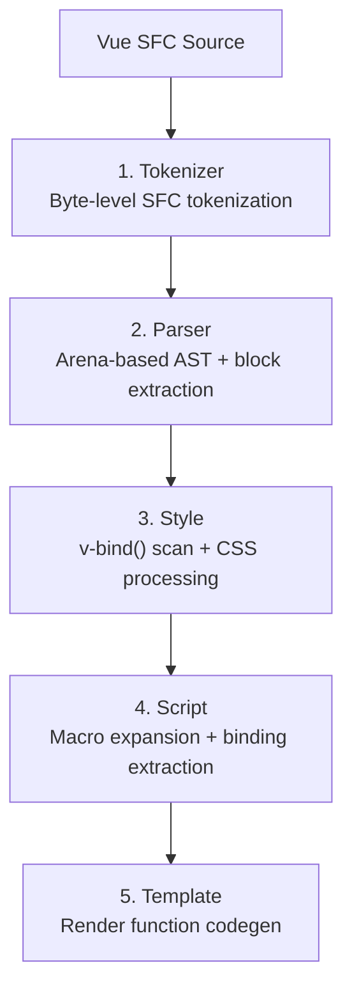
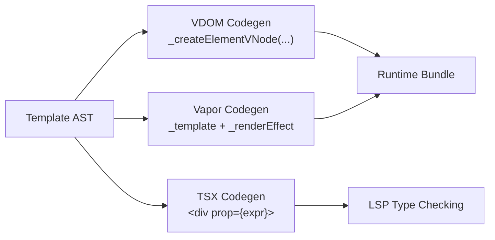

# Template Compilation

::: warning Pre-Release
Verter is pre-release software. APIs may change between releases — see the [API Stability](/api-stability) document.
:::

Verter's Rust template compiler transforms Vue templates into optimized render functions. This page describes the compilation pipeline and output modes.

## Pipeline

The compiler uses a 5-phase linear pipeline:

### Phase 1: Tokenizer
Zero-copy byte-level tokenizer. Processes the raw SFC source into token events without allocating strings for most content.

### Phase 2: Parser
Builds a flat arena-based template AST with O(1) navigation. Structural directives (`v-if`, `v-for`, `v-slot`) are extracted from `el.props` and cached as dedicated fields on `ElementNode`.

### Phase 3: Style Processing
Scans `<style>` blocks for `v-bind()` expressions and processes scoped CSS (inserting `[data-v-xxx]` attribute selectors) and CSS Modules (hashing class names).

### Phase 4: Script Processing
Expands Vue macros (`defineProps`, `defineEmits`, `defineModel`, `defineSlots`, `defineExpose`, `defineOptions`, `withDefaults`), extracts binding information, and generates the component wrapper.

### Phase 5: Template Codegen
Generates render functions using a DFS tree walker shared by all backends.

## Output Modes

### VDOM Mode (Default)
Generates standard Vue 3 render functions using `_createElementVNode`, `_createVNode`, etc. Includes optimization hints (patch flags, hoisted static nodes).

### Vapor Mode (Experimental)
Generates fine-grained reactive code using `_template`, `_renderEffect`, etc. No virtual DOM diffing -- direct DOM updates for each reactive binding.

### TSX Mode (LSP Only)
Generates valid JSX/TSX for type checking by the LSP and TSGO. Not meant for runtime execution.

## Source Maps
All transformations preserve source mapping through a chunk-based deferred mutation engine (similar to MagicString). The engine collects mutations as chunks and applies them in a single O(n+m) pass, generating VLQ-encoded source maps.

## Arena-Based AST
The template AST uses a flat arena (`Vec<AstNode>`) with `NodeId` handles instead of recursive Box/Rc pointers. This provides:
- O(1) access to any node by ID
- Cache-friendly memory layout
- Pre-computed flags (has_dynamic_children, has_v_for, etc.) for fast codegen decisions
