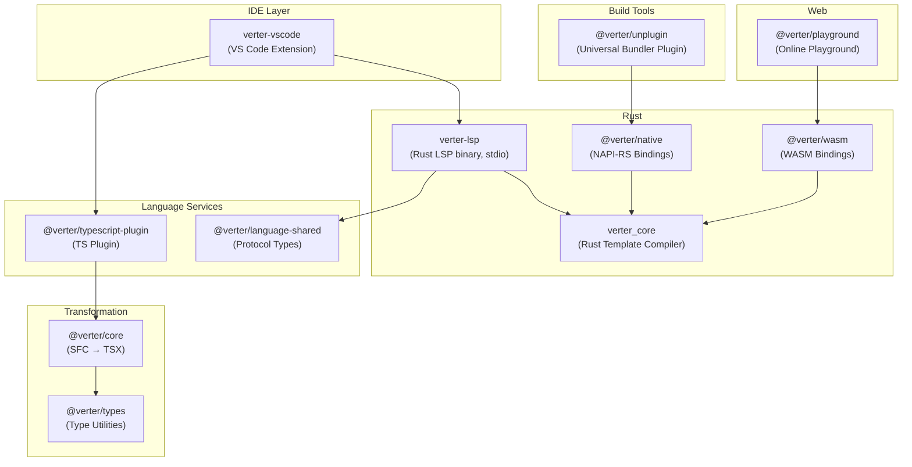
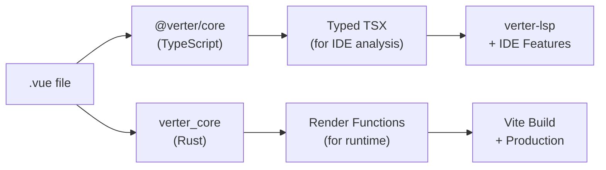
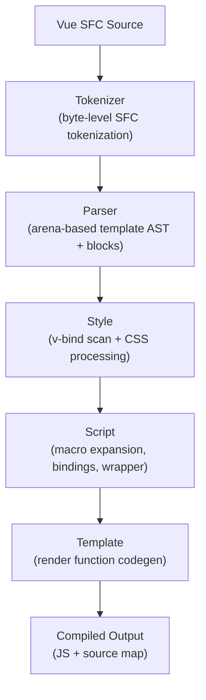

# Architecture

::: warning Experimental
Verter is experimental software at v0.0.1-alpha.3. APIs may change without notice.
:::

Verter is a hybrid Rust + TypeScript monorepo. Rust crates handle template compilation (exposed via NAPI-RS native bindings and wasm-bindgen WASM) and the LSP server, while TypeScript packages handle the SFC-to-TSX transformation, IDE integration, and bundler plugins.

## System Overview

## Dual Compilation Pipeline

Verter has two distinct compilation paths, each optimized for its purpose:

**TypeScript pipeline** (`@verter/core`) -- Transforms `.vue` files into valid TSX using MagicString for sourcemap preservation. This output is consumed by the LSP server and TypeScript plugin to provide IDE features like hover types, completions, go-to-definition, and diagnostics.

**Rust pipeline** (`verter_core`) -- Compiles Vue templates into optimized render functions (VDOM or Vapor mode) for production builds. This runs through `@verter/unplugin` during your Vite/webpack/Rollup build, and also powers the LSP's template analysis.

Both pipelines share the same Vue SFC input and produce consistent results -- the TypeScript path prioritizes type accuracy while the Rust path prioritizes runtime performance.

## Repository Structure

| Directory | Purpose |
|-----------|---------|
| `crates/verter_core/` | Rust template compiler |
| `crates/verter_analysis/` | Static analysis: imports, exports, bindings, types |
| `crates/verter_host/` | In-memory file host: caching, dependencies, multi-file compilation |
| `crates/verter_diagnostics/` | Diagnostic engine: 22+ lint rules, visitor, DiagnosticSet |
| `crates/verter_actions/` | Code actions engine: quick fixes, refactoring |
| `crates/verter_lsp/` | Rust LSP server binary (stdio) |
| `crates/verter_ffi/` | FFI types for NAPI/WASM boundaries |
| `crates/verter_napi/` | Native Node.js bindings (NAPI-RS) |
| `crates/verter_wasm/` | WASM bindings (wasm-bindgen) |
| `packages/core/` | `@verter/core` -- SFC parser & TSX transformer |
| `packages/types/` | `@verter/types` -- TypeScript utility types |
| `packages/native/` | `@verter/native` -- Native binding loader |
| `packages/wasm/` | `@verter/wasm` -- WASM binding wrapper |
| `packages/unplugin/` | `@verter/unplugin` -- Universal bundler plugin |
| `packages/vue-vscode/` | VS Code extension |

## Rust Compilation Pipeline

The Rust compiler uses an AST-based pipeline with five phases. The `compile()` function in `verter_core` orchestrates the entire flow:

### Phase 1: Tokenizer

A zero-copy byte-level tokenizer scans the raw SFC source. It identifies `<template>`, `<script>`, and `<style>` block boundaries, tag names, attributes, and text content. The tokenizer operates directly on bytes without allocating intermediate string copies.

### Phase 2: Parser

The parser consumes tokenizer output and builds an arena-based template AST. Elements, attributes, directives, text nodes, and interpolations are allocated in a flat arena with O(1) parent/child navigation. Structural directives (`v-if`, `v-for`, `v-slot`, `v-once`, `ref`) are extracted from props and cached as dedicated fields on element nodes for efficient access during codegen.

Script and style blocks are extracted as separate root nodes with their content spans and attributes (lang, scoped, module, src).

### Phase 3: Style

The style phase scans `<style>` blocks for `v-bind()` expressions (CSS values bound to reactive data) and processes CSS features:

- **Scoped CSS** -- Inserts `[data-v-xxx]` attribute selectors for style isolation
- **CSS Modules** -- Hashes class names for local scoping
- **`v-bind()` in CSS** -- Extracts expressions for runtime CSS variable injection

### Phase 4: Script

The script phase processes `<script setup>` content:

- **Macro expansion** -- Transforms `defineProps`, `defineEmits`, `defineModel`, `defineSlots`, `defineExpose`, `defineOptions`, and `withDefaults` into their runtime equivalents
- **Binding extraction** -- Identifies all declared variables, imports, and their binding types (setup, data, props, etc.) for template codegen
- **Component wrapper** -- Generates the component definition that wires props, emits, setup function, and render function together
- **Companion script merging** -- If both `<script>` and `<script setup>` exist, merges the companion script's exports into the setup component

### Phase 5: Template

The final phase walks the template AST and generates render function code. Two backends are available:

- **VDOM** -- Generates `_createElementVNode()`, `_createVNode()`, `_createTextVNode()` calls with patch flags for Vue's virtual DOM runtime
- **Vapor** -- Generates `_template()`, `_renderEffect()`, `_setText()` calls for Vue's upcoming Vapor mode (no virtual DOM)

Both backends share a common DFS tree walker and binding resolver that determines whether each template expression references a setup binding, prop, data property, or global.

### Output

The pipeline produces a `CodeTransform` -- a chunk-based deferred mutation engine (similar to MagicString) that tracks original source positions. From this, Verter emits:

- **JavaScript output** -- The compiled component module
- **Source map** -- VLQ-encoded source map mapping compiled output back to the original `.vue` file

## TSX Codegen Path

In addition to the VDOM/Vapor render function backends, the Rust compiler has a separate TSX codegen path (`crates/verter_core/src/tsx/`). This path converts Vue templates into valid JSX that TypeScript can type-check:

- `v-if`/`v-else-if`/`v-else` become ternary expressions
- `v-for` becomes `.map()` calls
- `:prop` bindings become `prop={expression}` JSX attributes
- `@event` handlers become `onEvent={handler}` JSX attributes
- `v-model` becomes the appropriate prop + event pair

The LSP server uses this TSX output for type-checking via TSGO (TypeScript's Go-based type checker), enabling hover types, diagnostics, and completions that reflect the actual template structure.

## Next Steps

- [Features](./features) -- Type safety features overview
- [Performance](./performance) -- Compilation benchmarks
- [Diagnostics & Linting](./linting) -- Built-in diagnostic rules
- [Cross-File Optimization](./cross-file-optimization) -- Whole-program analysis
