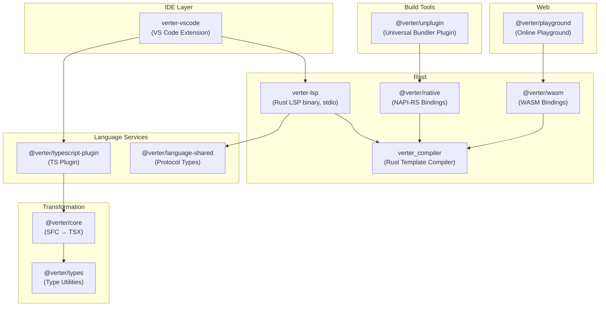
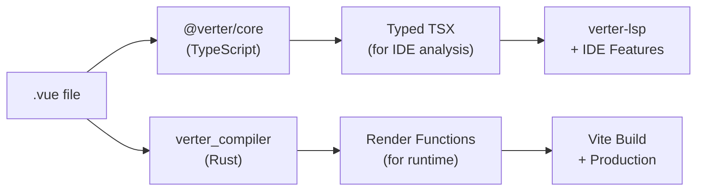

# What is Verter?

::: warning Pre-Release
Verter is pre-release software. APIs may change between releases — see the [API Stability](/api-stability) document.
:::

Verter is a Vue compiler, Language Server Protocol (LSP) implementation, and build tool. It converts Vue Single File Components (SFCs) into valid TSX for type checking and optimized render functions for production -- providing a stricter, more complete TypeScript experience for Vue than existing tools.

The project is a hybrid Rust + TypeScript monorepo: Rust crates handle template compilation (exposed via NAPI-RS native bindings and wasm-bindgen WASM) and the LSP server, while TypeScript packages handle the SFC-to-TSX transformation and IDE integration.

- [GitHub Repository](https://github.com/pikax/verter)
- [Online Playground](https://play.verterjs.dev)

## Why Verter?

Vue's Single File Component format combines `<template>`, `<script>`, and `<style>` blocks into one file. Getting full TypeScript support for this format requires translating Vue-specific syntax (directives, macros, scoped styles) into something TypeScript can understand.

Verter takes a different approach from existing tools:

- **Real TSX output** -- Verter generates actual valid TSX code that TypeScript can type-check directly, rather than relying on virtual file mappings. This means stricter type checking and fewer edge cases where types silently degrade to `any`.
- **Rust-powered compilation** -- Template compilation runs in Rust via NAPI-RS (for Node.js) and WASM (for browsers), delivering fast build times.
- **Unified build and IDE experience** -- The same compiler drives both your production builds (via the universal bundler plugin) and your IDE features (via the LSP server).

## Verter vs Volar

|                       | Verter                    | Volar                   |
| --------------------- | ------------------------- | ----------------------- |
| **Status**            | Pre-release (beta)        | Production-ready        |
| **Approach**          | SFC to real TSX           | Virtual file mapping    |
| **Compiler**          | Rust + TypeScript         | TypeScript only         |
| **Type safety**       | Strict (valid TSX output) | General Vue development |
| **IDE**               | VS Code (Rust LSP binary) | VS Code + other editors |
| **Build integration** | Universal bundler plugin  | Separate (Vite plugin)  |

Volar is the established, production-ready solution for Vue IDE support. Verter is an experimental alternative exploring whether generating real TSX can provide a better TypeScript experience. If you need stability today, use Volar. If you want to experiment with stricter type checking and faster compilation, try Verter.

## Architecture

Verter consists of several packages that work together across two languages:

### Dual Compilation Pipeline

Verter has two distinct compilation paths, each optimized for its purpose:

**TypeScript pipeline** (`@verter/core`) -- Transforms `.vue` files into valid TSX using MagicString for sourcemap preservation. This output is consumed by the LSP server and TypeScript plugin to provide IDE features like hover types, completions, go-to-definition, and diagnostics.

**Rust pipeline** (`verter_compiler`) -- Compiles Vue templates into optimized render functions (VDOM or Vapor mode) for production builds. This runs through `@verter/unplugin` during your Vite/webpack/Rollup build, and also powers the LSP's template analysis.

Both pipelines share the same Vue SFC input and produce consistent results -- the TypeScript path prioritizes type accuracy while the Rust path prioritizes runtime performance.

## Key Packages

| Package                     | Description                                                                             |
| --------------------------- | --------------------------------------------------------------------------------------- |
| `@verter/unplugin`          | Universal bundler plugin for Vite, Rollup, webpack, esbuild, rspack, Rolldown, and Farm |
| `@verter/core`              | SFC parser and TSX transformer (TypeScript)                                             |
| `@verter/native`            | Native Node.js bindings to the Rust compiler via NAPI-RS                                |
| `@verter/wasm`              | WASM bindings to the Rust compiler for browser use                                      |
| `@verter/types`             | TypeScript utility types for Vue component type inference                               |
| `@verter/typescript-plugin` | TypeScript language service plugin for `.vue` import resolution                         |
| `@verter/language-shared`   | Shared protocol types between the VS Code extension and LSP server                      |
| `verter-vscode`             | VS Code extension that launches the Rust LSP binary                                     |

## Next Steps

- [Getting Started](./getting-started) -- Install Verter and set up your first project
- [Vite Integration](./vite) -- Full configuration guide for Vite
- [Other Bundlers](./other-bundlers) -- Rollup, esbuild, rspack, Rolldown, and Farm
