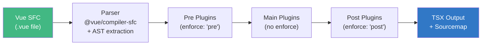
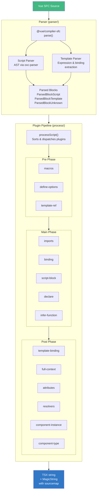
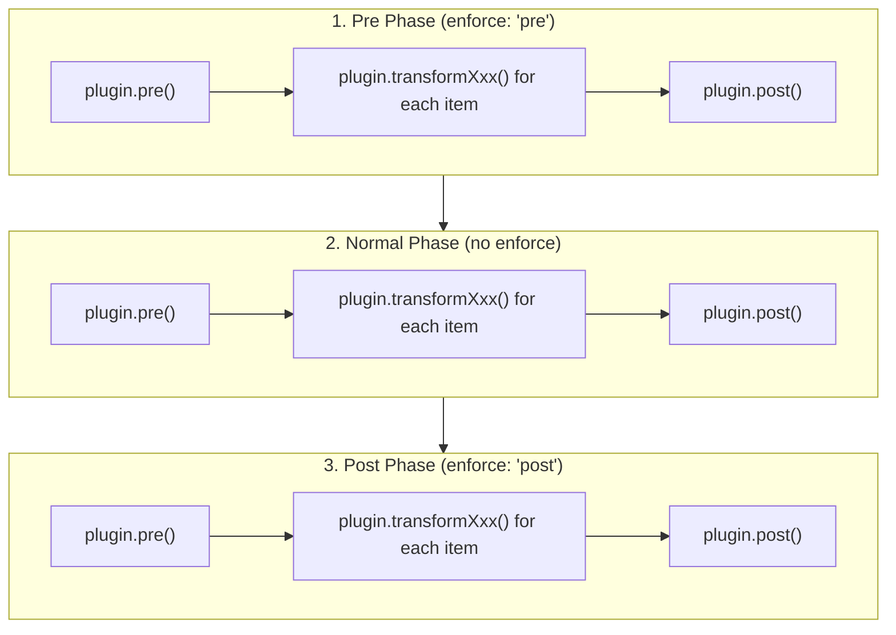

# @verter/core

> [!WARNING]
> **Experimental** -- This package is under active development and APIs may change without notice. It is not yet recommended for production use.

The SFC-to-TSX transformation engine for the [Verter](https://github.com/nickmessing/vue-typescript) project. `@verter/core` parses Vue Single File Components and transforms them into valid, typed TSX representations using a plugin-based architecture. The generated TSX is used for type analysis by the Verter language server and TypeScript plugin -- it is not intended for runtime execution.

## Overview

Unlike Volar, which generates virtual files, Verter produces actual valid TSX code from `.vue` files. This enables standard TypeScript tooling to provide completions, diagnostics, hover information, and go-to-definition support for Vue components.

`@verter/core` handles the TypeScript side of the Verter compiler pipeline. Template compilation to optimized render functions is handled by the Rust crate `verter_core` (exposed via NAPI-RS and wasm-bindgen). Long-term, Rust will take over more of the responsibilities currently handled by this package.

### Key Capabilities

- Parses Vue SFCs using `@vue/compiler-sfc`
- Transforms `<script setup>`, `<script>`, and `<template>` blocks into typed TSX
- Preserves sourcemaps via `MagicString` for accurate IDE position mappings
- Supports all Vue 3 macros: `defineProps`, `defineEmits`, `defineModel`, `defineSlots`, `defineExpose`, `withDefaults`, `defineOptions`
- Handles generics on `<script setup>` via the `generic` attribute
- Extensible plugin system for modular transformation logic
- Dual AST parsing via `oxc-parser` (primary, Rust-based) and `@babel/parser` (fallback)

## Installation

```bash
# pnpm (recommended)
pnpm add @verter/core

# npm
npm install @verter/core

# yarn
yarn add @verter/core
```

## Architecture

### Transformation Pipeline



### Detailed Architecture



### Directory Structure

```
src/
├── index.ts                          # Package entry
└── v5/
    ├── config.ts                     # Configuration
    ├── index.ts                      # v5 entry (re-exports parser + process)
    ├── parser/
    │   ├── parser.ts                 # Main SFC parser using @vue/compiler-sfc
    │   ├── types.ts                  # ParsedBlockScript, ParsedBlockTemplate, ParsedBlockUnknown
    │   ├── script/                   # Script block AST extraction
    │   │   ├── script.ts             # parseScript / parseScriptBetter
    │   │   ├── types.ts              # ScriptItem, ScriptTypes, ScriptItemByType
    │   │   └── generic/              # <script setup generic="T"> parsing
    │   ├── template/                 # Template expression & binding parsing
    │   ├── ast/                      # Unified AST node types (VerterASTNode)
    │   └── walk/                     # AST traversal utilities
    ├── process/
    │   ├── types.ts                  # ProcessContext, ProcessPlugin, ProcessItem
    │   ├── runner.ts                 # Generic plugin runner (used for template plugins)
    │   ├── script/
    │   │   ├── script.ts             # processScript() - plugin orchestration engine
    │   │   ├── types.ts              # ScriptPlugin, ScriptContext, definePlugin()
    │   │   └── plugins/              # All transformation plugins (see table below)
    │   ├── template/                 # Template processing
    │   └── styles/                   # Style block processing
    └── utils/                        # Shared utilities
```

## API / Usage

### Parsing a Vue SFC

```typescript
import { parser } from "@verter/core";

const result = parser(
  `<script setup lang="ts">
import { ref } from 'vue'

const count = ref(0)
const props = defineProps<{ msg: string }>()
</script>

<template>
  <button @click="count++">{{ props.msg }}: {{ count }}</button>
</template>`,
  "MyComponent.vue",
);

// result.s        -> MagicString instance (for sourcemap generation)
// result.blocks   -> Parsed blocks: [ParsedBlockScript, ParsedBlockTemplate]
// result.isTS     -> true  (detected from lang="ts")
// result.isSetup  -> true  (detected from <script setup>)
// result.isAsync  -> false (no top-level await)
// result.generic  -> null  (no generic attribute)
// result.filename -> "MyComponent.vue"
```

The parser returns a `ParserResult` containing:

| Property   | Type                  | Description                                    |
| ---------- | --------------------- | ---------------------------------------------- |
| `s`        | `MagicString`         | Source string with mutation tracking           |
| `blocks`   | `ParsedBlock[]`       | Parsed SFC blocks (script, template, unknown)  |
| `isTS`     | `boolean`             | Whether the script uses TypeScript             |
| `isSetup`  | `boolean`             | Whether `<script setup>` is present            |
| `isAsync`  | `boolean`             | Whether the script has top-level `await`       |
| `generic`  | `GenericInfo \| null` | Generic type parameter info from `generic="T"` |
| `filename` | `string`              | Source filename                                |

### Processing with Plugins

```typescript
import { processScript } from "@verter/core";

// Auto-run mode: executes all phases and returns the result
const { context, s, result } = processScript(
  parsedItems, // ScriptItem[] from the parser
  plugins, // ScriptPlugin[] array
  {
    filename: "MyComponent.vue",
    s: magicString,
    blocks: parsedBlocks,
    block: mainBlock,
    blockNameResolver: (name) => name,
  },
);

// result  -> transformed TSX string
// s       -> MagicString with sourcemap tracking
// context -> ScriptContext with accumulated items
```

You can also use manual mode for fine-grained control:

```typescript
// Manual mode: returns phase functions instead of auto-running
const { context, s, pre, main, post } = processScript(
  parsedItems,
  plugins,
  contextOptions,
  false, // autorun = false
);

pre(); // Run pre-phase plugins
main(); // Run item transforms
post(); // Run post-phase plugins
```

### Parsed Block Types

The parser categorizes SFC blocks into three types:

```typescript
// Script block (<script> or <script setup>)
interface ParsedBlockScript {
  type: "script";
  lang: "js" | "jsx" | "ts" | "tsx";
  block: VerterSFCBlock;
  result: ParsedScriptResult; // { isAsync, items: ScriptItem[] }
  isMain: boolean; // true for the primary script block
}

// Template block (<template>)
interface ParsedBlockTemplate {
  type: "template";
  lang: "vue";
  block: VerterSFCBlock;
  result: ParsedTemplateResult;
}

// Custom or unrecognized block (<style>, <i18n>, etc.)
interface ParsedBlockUnknown {
  type: string;
  lang: string;
  block: VerterSFCBlock;
  result: null;
}
```

### Script Item Types

The script parser extracts categorized AST items from script blocks:

| ScriptType      | Item Type             | Description                                             |
| --------------- | --------------------- | ------------------------------------------------------- |
| `Import`        | `ScriptImport`        | Import declarations with resolved bindings              |
| `Export`        | `ScriptExport`        | Named/re-export declarations                            |
| `DefaultExport` | `ScriptDefaultExport` | Default export declaration                              |
| `Declaration`   | `ScriptDeclaration`   | Variable, function, and class declarations              |
| `FunctionCall`  | `ScriptFunctionCall`  | Standalone function call expressions (including macros) |
| `Binding`       | `ScriptBinding`       | Variable binding identifiers                            |
| `Async`         | `ScriptAsync`         | Async markers / `await` expressions                     |
| `TypeAssertion` | `ScriptTypeAssertion` | TypeScript type assertion expressions                   |

## Plugin System

### Defining a Custom Plugin

```typescript
import { definePlugin } from "@verter/core";
import { ProcessItemType } from "@verter/core";

const MyPlugin = definePlugin({
  name: "my-plugin",
  enforce: "post", // "pre" | "post" | undefined (for normal phase)

  // Runs once before any item transforms
  pre(s, context) {
    // Initialize state, prepend imports, etc.
  },

  // Transform specific script item types
  transformFunctionCall(item, s, context) {
    if (item.name === "myCustomMacro") {
      s.overwrite(item.parent.start, item.parent.end, "/* transformed */");
      context.items.push({
        type: ProcessItemType.Binding,
        name: "myBinding",
        item,
        node: item.node,
      });
    }
  },

  transformDeclaration(item, s, context) {
    // Handle variable/function/class declarations
  },

  transformImport(item, s, context) {
    // Handle import statements
  },

  // Runs once after all item transforms
  post(s, context) {
    // Append generated code, finalize output
  },
});
```

### Plugin Execution Order



Plugins are sorted by their `enforce` value, then within each phase, hooks execute in this order:

1. All `pre()` hooks run first
2. For each `ScriptItem`, matching `transformXxx()` hooks run
3. All `post()` hooks run last

### Transform Hooks

Each plugin can implement hooks that target specific `ScriptTypes`:

| Hook                     | Triggered By                                         |
| ------------------------ | ---------------------------------------------------- |
| `transformImport`        | `import` declarations                                |
| `transformExport`        | Named exports and re-exports                         |
| `transformDefaultExport` | `export default` declarations                        |
| `transformDeclaration`   | Variable, function, and class declarations           |
| `transformFunctionCall`  | Standalone function call expressions                 |
| `transformBinding`       | Binding identifiers                                  |
| `transformAsync`         | Async markers / `await` expressions                  |
| `transformTypeAssertion` | TypeScript type assertion expressions (`<Type>expr`) |
| `transform`              | Catch-all: runs for every item regardless of type    |

### ScriptContext

The context object available to all plugin hooks:

```typescript
interface ScriptContext {
  filename: string; // Source .vue filename
  s: MagicString; // Current MagicString instance
  isTS: boolean; // Whether script uses TypeScript
  isSetup: boolean; // Whether using <script setup>
  isAsync: boolean; // Whether script has top-level await
  generic: GenericInfo | null; // Generic type parameter info
  block: ParsedBlock; // Current block being processed
  blocks: ParsedBlock[]; // All parsed blocks in the SFC
  items: ProcessItem[]; // Accumulated process items (bindings, macros, etc.)
  templateBindings: TemplateBinding[]; // Template binding information
  handledAttributes?: Set<string>; // Attributes already processed
  prefix(name: string): string; // Generates prefixed identifier (e.g. ___VERTER___name)
}
```

## Built-in Plugins

| Plugin                 | Phase | Purpose                                                                                                                                       |
| ---------------------- | ----- | --------------------------------------------------------------------------------------------------------------------------------------------- |
| **macros**             | pre   | Transforms Vue macros (`defineProps`, `defineEmits`, `defineModel`, `defineSlots`, `defineExpose`, `withDefaults`) into typed TSX equivalents |
| **define-options**     | pre   | Handles the `defineOptions()` macro                                                                                                           |
| **template-ref**       | pre   | Handles `useTemplateRef()` for typed template refs                                                                                            |
| **imports**            | main  | Processes and transforms import declarations                                                                                                  |
| **binding**            | main  | Tracks variable declarations for binding context                                                                                              |
| **script-block**       | main  | Wraps `<script setup>` content in proper TSX structure                                                                                        |
| **declare**            | main  | Handles TypeScript `declare` statements                                                                                                       |
| **infer-function**     | main  | Infers function return types for template bindings                                                                                            |
| **sfc-cleaner**        | main  | Cleans up SFC-specific syntax artifacts                                                                                                       |
| **script-default**     | main  | Handles `<script>` (non-setup) default exports                                                                                                |
| **template-binding**   | post  | Generates template binding type information for IDE support                                                                                   |
| **full-context**       | post  | Generates the full component context type                                                                                                     |
| **attributes**         | post  | Processes component `$attrs` type                                                                                                             |
| **resolvers**          | post  | Resolves component references for template usage                                                                                              |
| **component-instance** | post  | Generates component instance type                                                                                                             |
| **component-type**     | post  | Generates component type for parent component usage                                                                                           |
| **current-instance**   | post  | Handles `getCurrentInstance()` typing                                                                                                         |

## Sourcemap Support

All transformations preserve sourcemaps through `MagicString`. This ensures that diagnostics, hover info, and go-to-definition in the IDE map back to the correct positions in the original `.vue` file.

```typescript
const result = processScript(items, plugins, context);

// Generate a v3 sourcemap
const map = result.s.generateMap({
  source: "Component.vue",
  file: "Component.vue.tsx",
  includeContent: true,
});
```

### Internal Prefixes

Generated identifiers use the `___VERTER___` prefix to avoid collisions with user code. These are internal implementation details and should not be relied upon.

## Development

### Building

```bash
pnpm build     # Build with TypeScript compiler
pnpm dev       # Watch mode for development
```

### Testing

```bash
pnpm test                                    # Run all tests (watch mode)
pnpm vitest --run                            # Run all tests once
pnpm vitest --run path/to/test.spec.ts       # Run a specific test file
```

Tests are co-located with source files as `*.spec.ts`. Sourcemap accuracy tests use the `processMacrosForSourcemap()` helper:

```typescript
const { s, source, result } = processMacrosForSourcemap(code);
const map = s.generateMap({ source: "test.vue" });
// Verify sourcemap mappings are correct
```

### Generating Test Fixtures

```bash
pnpm generate:fixtures                # Generate test fixtures
pnpm generate:fixtures:annotations    # Generate annotated fixtures
```

## Dependencies

| Dependency                   | Purpose                                                     |
| ---------------------------- | ----------------------------------------------------------- |
| `@vue/compiler-sfc`          | Vue SFC parsing and MagicString                             |
| `@vue/compiler-core`         | Vue template AST types and compiler utilities               |
| `@babel/parser`              | JavaScript/TypeScript AST parsing (fallback parser)         |
| `oxc-parser`                 | Fast Rust-based JavaScript/TypeScript AST parsing (primary) |
| `acorn` / `acorn-typescript` | Lightweight JS/TS parsing                                   |
| `estree-walker`              | AST traversal                                               |
| `source-map-js`              | Sourcemap manipulation and remapping                        |
| `@verter/types`              | Shared TypeScript utility types                             |
| `deepmerge`                  | Deep object merging for configuration                       |

## License

ISC
