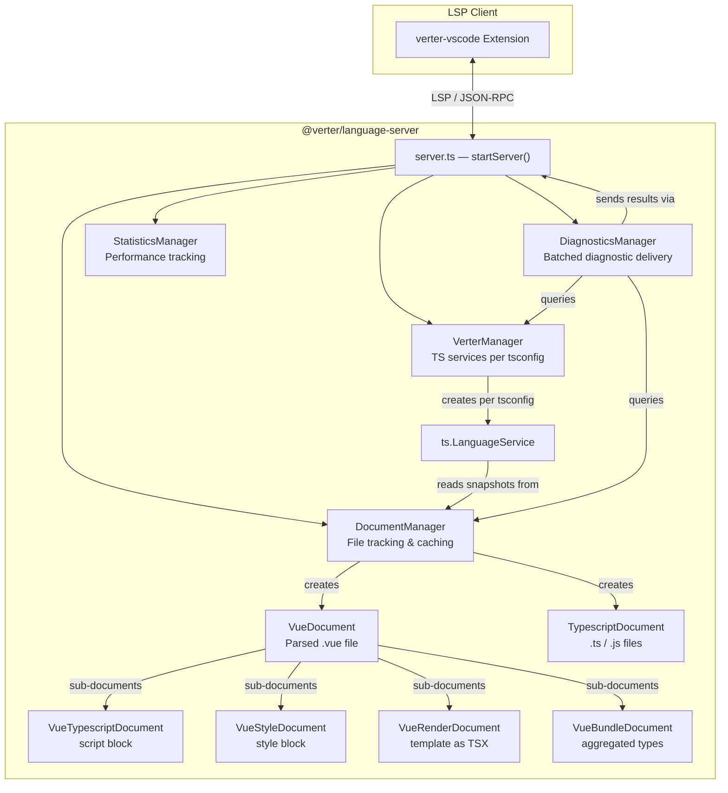
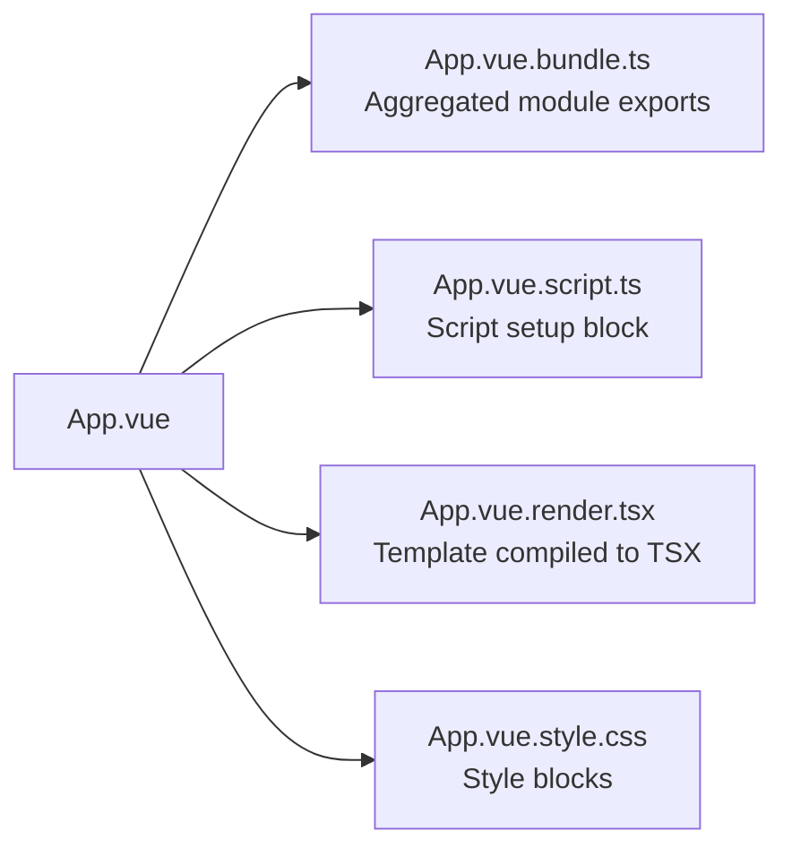
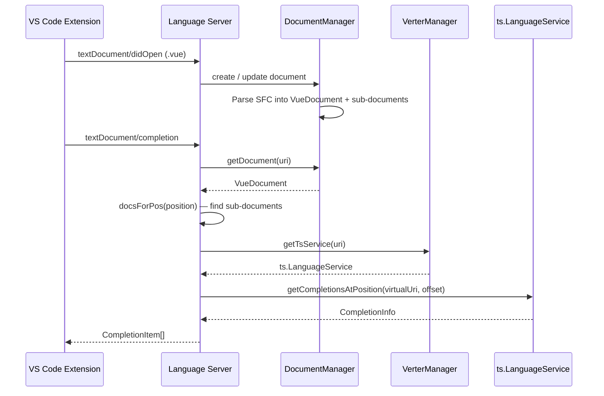

# @verter/language-server

> [!WARNING]
> This project is **experimental and under active development**. APIs, architecture, and package boundaries may change without notice.

The backbone of Verter's IDE support. `@verter/language-server` is a Language Server Protocol (LSP) implementation for Vue Single File Components that provides completions, diagnostics, hover information, go-to-definition, and more -- all powered by TypeScript's language services and Verter's SFC-to-TSX transformation pipeline.

Unlike Volar, which uses virtual file projections, Verter generates actual valid TSX code from `.vue` files. The language server manages one TypeScript `LanguageService` instance per `tsconfig.json`, giving each project scope its own isolated type-checking environment.

## Overview

- Manages TypeScript language services per `tsconfig.json`
- Provides completions, diagnostics, hover, go-to-definition, references, rename, and type definitions for `.vue` files
- Handles document lifecycle (open, change, close) with file caching and snapshot management
- Maps positions and diagnostics between original `.vue` source locations and generated virtual files
- Supports CSS/SCSS/LESS language features inside `<style>` blocks via `vscode-css-languageservice`
- Exposes custom LSP requests for compiled code inspection and performance statistics

## Installation

```bash
npm install @verter/language-server
# or
pnpm add @verter/language-server
```

The package expects the following peer/co-dependencies to be available in the workspace:

| Package | Role |
|---------|------|
| `@verter/core` | SFC parser and TSX transformer |
| `@verter/native` | Rust-based template compiler (NAPI-RS) |
| `@verter/types` | TypeScript utility types injected into the TS environment |
| `@verter/language-shared` | Shared protocol types between client and server |
| `typescript` | TypeScript compiler API |

## Architecture

### Document Manager Architecture



### Core Managers

| Manager | Responsibility |
|---------|---------------|
| **DocumentManager** | Tracks all open files. Creates `VueDocument` or `TypescriptDocument` instances on demand. Caches file contents and `IScriptSnapshot` objects. Handles file create/update/delete notifications. |
| **VerterManager** | Discovers `tsconfig.json` files across workspace folders. Creates and caches one `ts.LanguageService` per tsconfig scope. Routes URI-based queries to the correct service instance. |
| **DiagnosticsManager** | Debounces and batches diagnostic requests (250 ms). Supports cancellation tokens to discard stale results. Collects TypeScript semantic, syntactic, and suggestion diagnostics plus CSS validation. |
| **StatisticsManager** | Records performance events (diagnostics, file reads, parsing). Provides session and global summaries. Optionally persists to disk at `.verter/statistics.json`. |

### Virtual File Mapping

Each `.vue` file is decomposed into multiple virtual files that TypeScript can understand:



| Virtual path pattern | Content |
|---------------------|---------|
| `{path}.vue.bundle.ts` | Bundled TypeScript module -- the entry point for the component as seen by other files |
| `{path}.vue.script.ts` | Extracted `<script setup>` or `<script>` block |
| `{path}.vue.render.tsx` | Template compiled to TSX for type-checked rendering |
| `{path}.vue.style.css` | Extracted `<style>` blocks (CSS / SCSS / LESS) |

### Request Flow



## Usage

### Starting the Server

```typescript
import { startServer } from "@verter/language-server";

// Default: auto-detects --stdio flag or uses IPC
startServer();

// With options:
startServer({
  connection: myConnection,   // provide your own LSP connection
  logErrorsOnly: true,        // suppress non-error logs
});
```

### CLI

```bash
# stdio transport (used by VS Code and other editors)
node dist/server.js --stdio

# IPC transport (Node.js child process)
node dist/server.js
```

### Connection Options

```typescript
interface LsConnectionOption {
  /** Custom LSP connection. If omitted, one is created from --stdio or IPC. */
  connection?: Connection;

  /** When true, only errors are logged. */
  logErrorsOnly?: boolean;
}
```

### LSP Capabilities

The server advertises the following capabilities on `initialize`:

| Capability | Details |
|-----------|---------|
| `textDocumentSync` | `Full` -- entire document sent on each change |
| `completionProvider` | Trigger characters: `.`, `@`, `<`, `:`, ` ` with resolve support |
| `definitionProvider` | Go-to-definition across `.vue` boundaries |
| `hoverProvider` | TypeScript quick info and CSS hover |
| `diagnosticProvider` | For `*.vue` files with `interFileDependencies: true` |
| `referencesProvider` | Find all references |
| `typeDefinitionProvider` | Go-to-type-definition |
| `declarationProvider` | Go-to-declaration |
| `renameProvider` | Symbol rename |
| `workspace` | Workspace folder support with change notifications and file operation tracking |

### Custom Requests

These are defined in `@verter/language-shared` and handled by the server:

| Request | Method | Description |
|---------|--------|-------------|
| `GetCompiledCode` | `$/getCompiledCode` | Returns the compiled JS, CSS, and Rust/WASM output for a `.vue` file URI |
| `GetStatistics` | `$/verter/getStatistics` | Returns performance statistics (session and/or global scope) |

### Protocol Extensions

The server uses `@verter/language-shared` to add type-safe custom protocol methods:

```typescript
import { patchClient, RequestType } from "@verter/language-shared";

const patchedConnection = patchClient(connection);

// Handle a custom request with full type safety
patchedConnection.onRequest(RequestType.GetCompiledCode, async (uri) => {
  // uri is typed as string
  return {
    js:   { code: "...", map: undefined },
    css:  { code: "...", map: undefined },
    wasm: { code: "...", map: undefined },
  };
});
```

## Directory Structure

```
src/
├── server.ts                          # Entry point — startServer(), LSP handler registration
├── logger.ts                          # Logging utilities
├── utils.ts                           # URI / path helpers
├── importPackages.ts                  # Dynamic package loading
└── v5/
    ├── helpers.ts                     # Mapping helpers (diagnostics, completions, hover)
    ├── DiagnosticsManager.ts          # Batched diagnostic collection and delivery
    ├── StatisticsManager.ts           # Performance event recording and persistence
    ├── documents/
    │   ├── manager/
    │   │   └── manager.ts             # DocumentManager — file tracking & caching
    │   └── verter/
    │       ├── manager/
    │       │   └── manager.ts         # VerterManager — TS service per tsconfig
    │       ├── vue/
    │       │   ├── vue.ts             # VueDocument — parsed .vue with sub-documents
    │       │   └── sub/               # VueTypescriptDocument, VueStyleDocument,
    │       │                          #   VueRenderDocument, VueBundleDocument
    │       └── typescript/
    │           └── typescript.ts      # TypescriptDocument — plain .ts / .js files
    └── services/                      # LSP service implementations
```

## Development

### Build

```bash
pnpm --filter @verter/language-server build
```

### Watch (for extension development)

```bash
pnpm dev-extension
```

This watches both the language server and the VS Code extension, enabling F5 debugging.

### Test

```bash
pnpm --filter @verter/language-server test
```

## Dependencies

| Package | Purpose |
|---------|---------|
| `vscode-languageserver` | LSP server framework (connection, capabilities, handlers) |
| `vscode-languageserver-textdocument` | Text document abstraction |
| `vscode-languageserver-protocol` | LSP protocol types |
| `vscode-css-languageservice` | CSS / SCSS / LESS completions, diagnostics, hover |
| `typescript` | TypeScript compiler API (`LanguageService`, `LanguageServiceHost`) |
| `@verter/core` | SFC-to-TSX transformation |
| `@verter/native` | Rust-compiled template compiler (NAPI-RS) |
| `@verter/language-shared` | Shared LSP protocol types and virtual file utilities |
| `@verter/types` | TypeScript utility types injected into the TS environment |
| `oxc-parser` | Fast JavaScript / TypeScript parser |
| `magic-string` | String manipulation with sourcemap preservation |
| `source-map-js` | Source map support |
| `glob` | File globbing for tsconfig discovery |
| `minimatch` | Glob pattern matching for tsconfig-to-file routing |

## License

[MIT](../../LICENSE)
