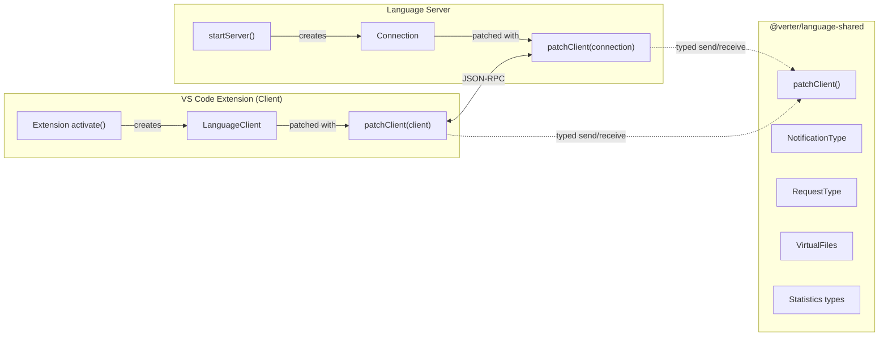

# @verter/language-shared

> [!WARNING]
> This project is **experimental and under active development**. APIs, architecture, and package boundaries may change without notice.

Type-safe communication bridge between the Verter VS Code extension (LSP client) and the language server. `@verter/language-shared` defines custom notification types, request types, virtual file utilities, and statistics data structures -- all as pure TypeScript definitions with zero production dependencies.

## Overview

- Zero production dependencies -- pure TypeScript type definitions and thin runtime helpers
- Provides `patchClient()` to overlay type-safe custom notification and request methods onto any LSP connection
- Defines custom `NotificationType` and `RequestType` enums used by both client and server
- Exports `VirtualFiles` utilities for working with `.vue` sub-document URIs
- Exports `StatisticsSnapshot` and `StatisticsSummary` types for performance telemetry

## Installation

```bash
npm install @verter/language-shared
# or
pnpm add @verter/language-shared
```

## Architecture



Both sides import the same enum values and type definitions, ensuring that notification payloads and request/response shapes stay in sync at compile time.

## API

### `patchClient(connection)`

Wraps an existing LSP connection (client or server) to add type-safe `sendNotification`, `onNotification`, `sendRequest`, and `onRequest` overloads that are constrained to Verter's custom protocol methods.

```typescript
import { patchClient } from "@verter/language-shared";

// Works with any object that has onNotification/sendNotification/onRequest/sendRequest
const typed = patchClient(connection);
```

The return type is `PatchClient<T>`, which replaces the generic notification and request signatures with strongly-typed versions while preserving all other methods on the original connection.

### `NotificationType`

Custom LSP notifications for Verter-specific features:

```typescript
import { NotificationType } from "@verter/language-shared";
```

| Enum Member             | Method String             | Payload                                                           |
| ----------------------- | ------------------------- | ----------------------------------------------------------------- |
| `OnDidChangeTsOrJsFile` | `$/onDidChangeTsOrJsFile` | `{ uri: string; changes: Array<{ text: string; range: Range }> }` |
| `OnFileChanged`         | `$/onFileChanged`         | `{ uri: string; type: "create" \| "update" \| "delete" }`         |

### `RequestType`

Custom LSP request/response pairs:

```typescript
import { RequestType } from "@verter/language-shared";
```

| Enum Member       | Method String            | Params                                 | Response                                                   |
| ----------------- | ------------------------ | -------------------------------------- | ---------------------------------------------------------- |
| `GetCompiledCode` | `$/getCompiledCode`      | `string` (document URI)                | `{ js, css, wasm }` each with `{ code: string; map: any }` |
| `GetStatistics`   | `$/verter/getStatistics` | `StatisticsRequestParams \| undefined` | `StatisticsSnapshot`                                       |

### `VirtualFiles`

Utilities for working with Verter's virtual sub-document URIs:

```typescript
import { VirtualFiles } from "@verter/language-shared";

// Check if a URI points to a virtual sub-document
VirtualFiles.isVirtual(uri); // boolean

// Get the parent .vue file URI from a virtual URI
VirtualFiles.getParentUri(virtualUri); // string

// Create a virtual URI for a sub-document
VirtualFiles.createUri(parentUri, type); // string
```

### Statistics Types

Data structures for performance telemetry, used by the language server's `StatisticsManager` and the `GetStatistics` request:

```typescript
import type {
  StatisticsSnapshot,
  StatisticsSummary,
  StatisticsEvent,
  StatisticsEventType,
  StatisticsRequestParams,
} from "@verter/language-shared";
```

| Type                      | Description                                                                                                                         |
| ------------------------- | ----------------------------------------------------------------------------------------------------------------------------------- |
| `StatisticsEventType`     | Union of known event kinds: `"diagnostics"`, `"diagnostics:document"`, `"diagnostics:style"`, `"read-file"`, `"parse"`, `"process"` |
| `StatisticsEvent`         | A single recorded event with `id`, `type`, `uri`, `durationMs`, `startedAt`, and optional `meta`                                    |
| `StatisticsSummary`       | Aggregated stats: `count`, `totalMs`, `averageMs`, `minMs`, `maxMs`                                                                 |
| `StatisticsSnapshot`      | Full snapshot with `session` (events, byType, byFile) and optional `global` (byType, byFile, path, updatedAt)                       |
| `StatisticsRequestParams` | Request options: `includeEvents?`, `scope?: "session" \| "global" \| "all"`                                                         |

## Usage

### Server-Side

```typescript
import { createConnection, ProposedFeatures } from "vscode-languageserver/node";
import { patchClient, RequestType, NotificationType } from "@verter/language-shared";

const connection = createConnection(ProposedFeatures.all);
const typed = patchClient(connection);

// Handle a custom request -- params and return type are fully typed
typed.onRequest(RequestType.GetCompiledCode, async (uri) => {
  const compiled = await compileVueFile(uri);
  return {
    js: { code: compiled.js, map: compiled.jsMap },
    css: { code: compiled.css, map: compiled.cssMap },
    wasm: { code: compiled.wasm, map: compiled.wasmMap },
  };
});

// Handle a custom notification
typed.onNotification(NotificationType.OnFileChanged, async ({ uri, type }) => {
  // type is "create" | "update" | "delete"
  documentManager.handleFileChange(uri, type);
});
```

### Client-Side (VS Code Extension)

```typescript
import { LanguageClient } from "vscode-languageclient/node";
import { patchClient, RequestType, NotificationType } from "@verter/language-shared";

const client = new LanguageClient(/* ... */);
const typed = patchClient(client);

// Send a typed request
const result = await typed.sendRequest(RequestType.GetCompiledCode, documentUri);
// result is { js: { code, map }, css: { code, map }, wasm: { code, map } }

// Send a typed notification
typed.sendNotification(NotificationType.OnFileChanged, {
  uri: "file:///path/to/Component.vue",
  type: "update",
});
```

## Directory Structure

```
src/
├── index.ts           # Re-exports + patchClient()
├── notifications.ts   # NotificationType enum, NotificationParams, helpers
├── request.ts         # RequestType enum, RequestParams, RequestResponse
├── statistics.ts      # StatisticsSnapshot, StatisticsSummary, StatisticsEvent
└── virtual.ts         # VirtualFiles utilities (isVirtual, getParentUri, createUri)
```

## Development

### Build

```bash
pnpm --filter @verter/language-shared build
```

The package compiles with `tsc -b` to CommonJS (`dist/`).

## Dependencies

**Production**: None. This package is pure TypeScript definitions and lightweight runtime helpers.

**Development only**:

| Package           | Purpose                     |
| ----------------- | --------------------------- |
| `typescript`      | Compilation                 |
| `vite`            | Build tooling               |
| `vite-plugin-dts` | Declaration file generation |

## License

[MIT](../../LICENSE)
