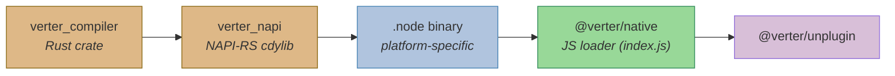
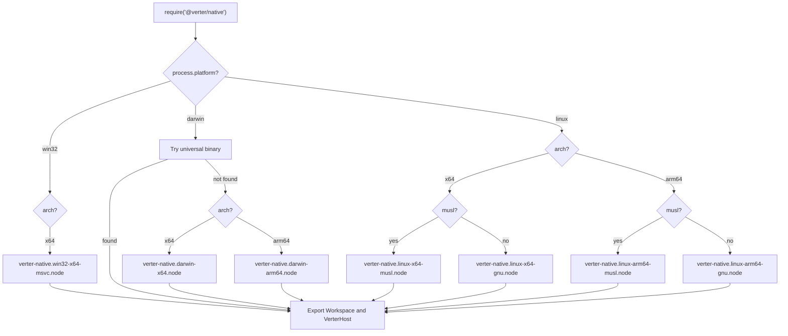

# @verter/native

> [!WARNING]
> This project is **experimental and under active development**. APIs, architecture, and package boundaries may change without notice.

Native Node.js bindings for Verter's framework-carrier compiler host. This package exposes the Rust `verter_compiler` and `verter_session` stack to Node.js via [NAPI-RS](https://napi.rs/), providing near-native Vue SFC compilation and the experimental native Svelte carrier path.

> [!IMPORTANT]
> Svelte support is **experimental — not yet validated in real-world use**. Unsupported runtime surfaces fail closed with typed diagnostics; they are not returned as successful empty modules.

## Overview

`@verter/native` is the bridge between the Rust compiler core and the Node.js ecosystem. It ships pre-built platform-specific `.node` binaries for all major operating systems and architectures, with a JavaScript loader that automatically detects the current platform and loads the correct binary at runtime.

The package exposes compilation through `VerterHost`: typed `compileRequest()`
and `compileRequests()` routes plus the legacy profile-bearing `compileMany()`
route. There are no standalone compile functions.

## Architecture



### Platform Binary Resolution

The loader (`index.js`) detects `process.platform` and `process.arch` at startup and loads the matching `.node` binary from the `dist/` directory. It prefers the canonical `verter-native.*.node` artifact and only falls back to legacy `verter.*.node` filenames if they are still present. On Linux, it further distinguishes between glibc and musl libc.



## Installation

```bash
npm install @verter/native
# or
pnpm add @verter/native
```

The correct platform-specific binary is pulled in automatically via optional dependencies:

| Platform            | Package                           |
| ------------------- | --------------------------------- |
| macOS x64           | `@verter/native-darwin-x64`       |
| macOS ARM64         | `@verter/native-darwin-arm64`     |
| Linux x64 (glibc)   | `@verter/native-linux-x64-gnu`    |
| Linux x64 (musl)    | `@verter/native-linux-x64-musl`   |
| Linux ARM64 (glibc) | `@verter/native-linux-arm64-gnu`  |
| Linux ARM64 (musl)  | `@verter/native-linux-arm64-musl` |
| Windows x64         | `@verter/native-win32-x64-msvc`   |

**Requirements:** Node.js >= 18

## API

### `new Workspace(roots: string[])`

Creates a filesystem-backed workspace rooted at the given directories. The workspace is the **sole authority** for file access — no `node:fs` calls are needed.

All file I/O methods are **async** (Promises, runs on libuv thread pool to avoid blocking the event loop):

```typescript
import { Workspace, VerterHost } from "@verter/native";

const ws = new Workspace(["/path/to/project"]);

// File reads
const content = await ws.readFile("/src/App.vue"); // string | null
const exists = await ws.fileExists("/src/App.vue"); // boolean
const isDir = await ws.isDir("/src"); // boolean
const real = await ws.realpath("/src/link.vue"); // string | null

// Directory listing
const entries = await ws.readDir("/src"); // {path, isDir}[]
const files = await ws.walk("/src", ["node_modules", ".git"], [".vue", ".ts"]);

// File writes
await ws.writeFile("/src/new.ts", "export const x = 1;");
await ws.createDirAll("/src/new/dir");
await ws.deleteFile("/src/old.ts");
await ws.deleteDirAll("/src/old");
await ws.copyFile("/src/a.ts", "/dst/a.ts");

// Context-aware import resolution
const resolved = await ws.resolveImport("/src/App.vue", "./Child.vue");
// phase: "codegen" (default) | "provider"
// kind:  "esm" (default) | "type" | "require" | "src"
const types = await ws.resolveImport("/src/App.vue", "pkg", "provider", "type");

// Project configuration
ws.configureProjects([
  {
    root: "/project",
    workspaceRoot: "/project",
    compilerOptions: {
      baseUrl: ".",
      // NOTE: an ordered array of { pattern, targets } — not a tsconfig-style object map.
      paths: [{ pattern: "@/*", targets: ["src/*"] }],
    },
  },
]);

// Create host backed by workspace
const host = VerterHost.withWorkspace({ devMode: true }, ws);
```

### `host.compileRequest(canonicalId, request): HostCompileResponse`

Executes a typed request against a source already registered with `upsert()`.
The requested products are returned in request order; any refusal throws and
no partial response is published.

```typescript
const source = `<template><h1>Hello</h1></template>`;
const { canonicalId } = host.upsert({
  inputId: "/project/src/App.vue",
  source: Buffer.from(source),
});

const result = host.compileRequest(canonicalId, {
  framework: "vue",
  identity: { filename: canonicalId, isProduction: false, forceJs: false },
  products: [{ kind: "runtimeClient", runtimeSourceMap: true }],
  options: {
    backend: "inferred",
    ssr: false,
    isCustomElement: [],
    babelParserPlugins: [],
  },
});
```

`host.compileRequests(inputs, options?)` is the source-registering batch form.
Each input carries one `Buffer` source beside its typed request. It returns one
ordered entry containing either `response` or a typed `failure`; one refusal
does not suppress valid siblings. Per-entry shape, UTF-8, request decoding, and
canonical construction refusals use the `binding` failure arm. Per-input panic
isolation holds here as it does on `compileMany()`: entries execute on the
host's CPU pool through the same batch coordinator, so a compiler panic becomes
that entry's `host` failure and its siblings keep their responses. An entry's
own `canonicalId` / `source` / `request` fields and the batch options alike are
read as own enumerable properties only — an inherited field or `priority` is
not part of the payload. Invalid batch-level options or a non-array/oversized
outer input throw before execution. The aggregate 64 MiB decoded-payload budget
does not: its counter never resets, so the entry that exhausts it and every
entry after it fail as `binding`, naming the index and the ceiling, while the
entries decoded before it keep their responses. Each entry's own request graph
is separately bounded by a per-request 131,072 decoded-value cap, reset between
entries — there is no separate aggregate decoded-value budget across the batch. Each `canonicalId` is normalized on the
way in (drive-letter case, backslashes, a `?…` query tail, an extended-length
prefix, surrounding whitespace, registered aliases), so an entry's reported
`canonicalId` may differ from the string you passed; correlate by position or
by the reported id.

`compileRequest()` is also available in `@verter/wasm`. The source-registering
`compileRequests()` batch route is native-only and is not exposed by the browser
binding.

### `host.compileMany(files, options?): CompileBatchEntry[]`

Compiles a batch of Vue SFC inputs through the host's shared compile path
(scheduler + dispatch + compile cache). This is the legacy profile-bearing
batch route; there are no standalone `compile` / `compileSync` /
`compileForVite` exports.

Returns one entry per input, **in input order**. Per-input panic isolation: if
codegen fails for one input, only that input's entry carries the error; the rest
of the batch completes normally.

Two lanes are available via `target`:

- `"host-backed"` (default) — the full session wrapper, used for IDE/analysis work.
- `"runtime-render"` — the render-only bundler lane. **Requires `compileProfile`.**

```typescript
import { VerterHost, Workspace } from "@verter/native";

const ws = new Workspace(["/project"]);
ws.configureProjects([{ root: "/project", workspaceRoot: "/project" }]);
const host = VerterHost.withWorkspace({ devMode: true }, ws);

const [entry] = host.compileMany(
  [
    {
      canonicalId: "/project/src/App.vue",
      source: "<template><div>{{ msg }}</div></template>",
    },
  ],
  {
    target: "runtime-render",
    compileProfile: {
      filename: "/project/src/App.vue",
      isProduction: false,
      customElement: false,
      ssr: false,
      forceJs: false,
      forceVapor: false,
      sourceMap: true,
      hmrStrategy: "none",
    },
  },
);

if (entry.errors.length > 0) throw new Error(entry.errors.join("\n"));

console.log(entry.code); // compiled Main module
console.log(entry.sourceMap); // source map, when `sourceMap: true`
console.log(entry.lang); // "ts" | "js" | "jsx"
console.log(entry.cacheHit); // served from a warm cache slot?
```

`source` accepts a `string` or a `Buffer` (UTF-8 bytes). Every field on
`compileProfile` above is required except `filename`, `comments`, and the
optional module/delimiter overrides — `comments` is deliberately tri-state
(omit it to keep the compiler default of `!isProduction`).

### Types

`source` accepts `string | Buffer` on every compile input.

```typescript
interface CompileBatchInput {
  canonicalId: string;
  source: string | Buffer;
  /** Compile cache mode; omit to inherit the batch `defaultMode`. */
  requestedMode?: "stateless" | "content" | "session";
  /** Per-component scoped-style / HMR id; `"runtime-render"` lane only. */
  componentId?: string;
}

interface CompileBatchOptions {
  priority?: "interactive" | "background";
  defaultMode?: "stateless" | "content" | "session";
  target?: "host-backed" | "runtime-render";
  /** Required by the `"runtime-render"` lane, ignored by `"host-backed"`. */
  compileProfile?: CompileBatchRenderProfile;
}

interface CompileBatchRenderProfile {
  /** `"authored-only"` is reserved for a bundler-owned style-module pipeline. */
  styleProcessing?: "complete" | "authored-only";
  filename?: string;
  isProduction: boolean;
  customElement: boolean;
  ssr: boolean;
  forceJs: boolean;
  forceVapor: boolean;
  sourceMap: boolean;
  hmrStrategy: "none" | "vite" | "webpack";
  /** Tri-state: omit to keep the compiler default (`!isProduction`). */
  comments?: boolean;
  runtimeModuleName?: string;
  typesModuleName?: string;
  delimiterOpen?: string;
  delimiterClose?: string;
  customElements?: string[];
}

interface CompileBatchEntry {
  canonicalId: string;
  code: string;
  sourceMap?: string;
  /** "ts" | "js" | "jsx", or undefined on an error outcome. */
  lang?: string;
  /** Fatal compilation errors. Empty on success. */
  errors: string[];
  /** Non-fatal warnings surfaced on a successful compile. */
  diagnostics: HostDiagnostic[];
  durationMs: number;
  cacheHit: boolean;
  requestedMode: "stateless" | "content" | "session";
  actualMode: "stateless" | "content" | "session";
  downgradeReason?: DowngradeReason;
}
```

## Development / Build

### Building from Source

Building requires a Rust toolchain (installed via [rustup](https://rustup.rs/); the version is
pinned in `rust-toolchain.toml` and installed on the first `cargo` invocation in the repo) and
the NAPI-RS CLI:

```bash
# Install the NAPI-RS CLI
npm install -g @napi-rs/cli

# Build the native binary for the current platform (release)
pnpm run build

# Build in debug mode (faster compilation, slower runtime)
pnpm run build:debug
```

The build command runs:

```bash
napi build -o dist --platform --release --manifest-path ../../crates/verter_napi/Cargo.toml
```

Before each build, `pnpm run clean:dist` removes old `.node` files from `dist/` so stale legacy binaries cannot shadow the freshly built canonical artifact. The build then compiles the `verter_napi` Rust crate into a `.node` shared library and places it in `dist/`.

### Publishing

```bash
# Generate platform-specific npm packages
pnpm run prepublishOnly   # runs: pnpm run build && napi prepublish -t npm

# Collect built artifacts for all platforms
pnpm run artifacts        # runs: napi artifacts
```

### Testing

```bash
pnpm test                 # runs: vitest run
```

## Dependencies

| Dependency                    | Purpose                            |
| ----------------------------- | ---------------------------------- |
| `verter_compiler` (Rust)          | Core Vue template compiler         |
| `oxc_allocator` (Rust)        | Memory allocator for OXC AST nodes |
| `napi` / `napi-derive` (Rust) | NAPI-RS bindings framework         |
| `@napi-rs/cli` (dev)          | Build tooling for NAPI-RS          |

## License

ISC
