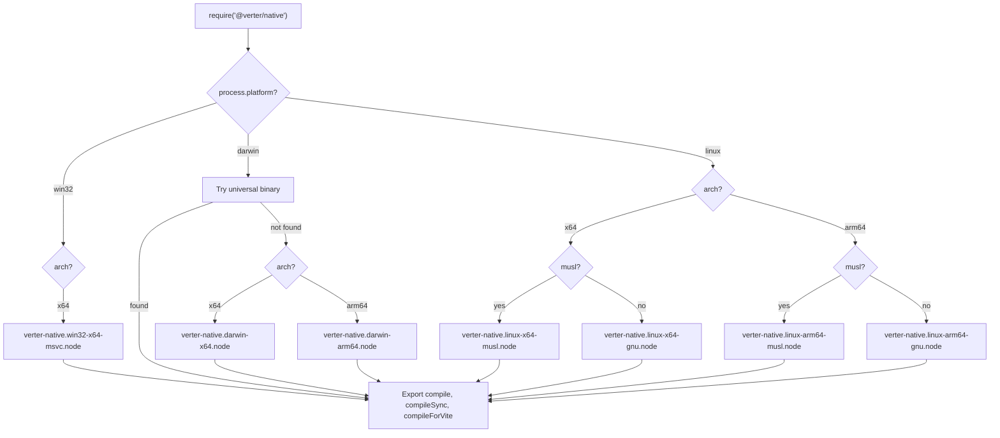

# @verter/native

> [!WARNING]
> This project is **experimental and under active development**. APIs, architecture, and package boundaries may change without notice.

Native Node.js bindings for Verter's framework-carrier compiler host. This package exposes the Rust `verter_compiler` and `verter_session` stack to Node.js via [NAPI-RS](https://napi.rs/), providing near-native Vue SFC compilation and the experimental native Svelte carrier path.

> [!IMPORTANT]
> Svelte support is **experimental — not yet validated in real-world use**. Unsupported runtime surfaces fail closed with typed diagnostics; they are not returned as successful empty modules.

## Overview

`@verter/native` is the bridge between the Rust compiler core and the Node.js ecosystem. It ships pre-built platform-specific `.node` binaries for all major operating systems and architectures, with a JavaScript loader that automatically detects the current platform and loads the correct binary at runtime.

The package provides three compilation functions: a general-purpose async `compile`, its synchronous counterpart `compileSync`, and a Vite-optimized `compileForVite` that returns split blocks (script, template, styles) for virtual module serving.

## Architecture


### Platform Binary Resolution

The loader (`index.js`) detects `process.platform` and `process.arch` at startup and loads the matching `.node` binary from the `dist/` directory. It prefers the canonical `verter-native.*.node` artifact and only falls back to legacy `verter.*.node` filenames if they are still present. On Linux, it further distinguishes between glibc and musl libc.



## Installation

```bash
npm install @verter/native
# or
pnpm add @verter/native
```

The correct platform-specific binary is pulled in automatically via optional dependencies:

| Platform            | Package                           |
| ------------------- | --------------------------------- |
| macOS x64           | `@verter/native-darwin-x64`       |
| macOS ARM64         | `@verter/native-darwin-arm64`     |
| Linux x64 (glibc)   | `@verter/native-linux-x64-gnu`    |
| Linux x64 (musl)    | `@verter/native-linux-x64-musl`   |
| Linux ARM64 (glibc) | `@verter/native-linux-arm64-gnu`  |
| Linux ARM64 (musl)  | `@verter/native-linux-arm64-musl` |
| Windows x64         | `@verter/native-win32-x64-msvc`   |

**Requirements:** Node.js >= 18

## API

### `new Workspace(roots: string[])`

Creates a filesystem-backed workspace rooted at the given directories. The workspace is the **sole authority** for file access — no `node:fs` calls are needed.

All file I/O methods are **async** (Promises, runs on libuv thread pool to avoid blocking the event loop):

```typescript
import { Workspace, VerterHost } from "@verter/native";

const ws = new Workspace(["/path/to/project"]);

// File reads
const content = await ws.readFile("/src/App.vue"); // string | null
const exists = await ws.fileExists("/src/App.vue"); // boolean
const isDir = await ws.isDir("/src"); // boolean
const real = await ws.realpath("/src/link.vue"); // string | null

// Directory listing
const entries = await ws.readDir("/src"); // {path, isDir}[]
const files = await ws.walk("/src", ["node_modules", ".git"], [".vue", ".ts"]);

// File writes
await ws.writeFile("/src/new.ts", "export const x = 1;");
await ws.createDirAll("/src/new/dir");
await ws.deleteFile("/src/old.ts");
await ws.deleteDirAll("/src/old");
await ws.copyFile("/src/a.ts", "/dst/a.ts");

// Context-aware import resolution
const resolved = await ws.resolveImport("/src/App.vue", "./Child.vue");
// phase: "codegen" (default) | "provider"
// kind:  "esm" (default) | "type" | "require" | "src"
const types = await ws.resolveImport("/src/App.vue", "pkg", "provider", "type");

// Project configuration
ws.configureProjects([
  {
    root: "/project",
    workspaceRoot: "/project",
    compilerOptions: { baseUrl: ".", paths: { "@/*": ["src/*"] } },
  },
]);

// Create host backed by workspace
const host = VerterHost.withWorkspace({ devMode: true }, ws);
```

### `compile(input, options?): CodegenResult`

Compiles a Vue SFC template to JavaScript. Accepts `string` or `Buffer` input. Despite the NAPI-RS async signature, compilation is CPU-bound and executes synchronously on the Rust side.

```typescript
import { compile } from "@verter/native";

const result = compile("<template><div>{{ msg }}</div></template>", {
  filename: "App.vue",
  isProduction: false,
});

const bufferResult = compile(Buffer.from("<template><div>{{ msg }}</div></template>"));

console.log(result.code);
console.log(result.sourceMap); // Source map as JSON string
console.log(result.codeWithSourceMap); // Code with inline source map appended
```

### `compileSync(input, options?): CodegenResult`

Synchronous version of `compile`. Identical behavior, provided for API symmetry (accepts `string` or `Buffer`).

```typescript
import { compileSync } from "@verter/native";

const result = compileSync("<template><div>Hello</div></template>");
```

### `compileForVite(input, options?): ViteCodegenResult`

Vite-optimized compilation that returns split blocks instead of a single output string. Each block includes its own code, source map, and import metadata with UTF-16 offsets for JavaScript interop.

```typescript
import { compileForVite } from "@verter/native";

const result = compileForVite(vueSfcSource, {
  filename: "App.vue",
  isProduction: false,
  ssr: false,
  componentId: "abc12345",
  sourcemap: true,
});

// result.script  - JsBlockOutput | null (component definition)
// result.template - JsBlockOutput | null (render function)
// result.styles  - JsStyleBlock[]       (CSS blocks)
// result.duration_ms - number           (compilation time)
```

### Types

All compile entry points accept `input` as `string | Buffer`.

```typescript
interface CodegenOptions {
  filename?: string;
  includeSourceContent?: boolean;
  ssr?: boolean;
  isProduction?: boolean;
  componentId?: string;
  features?: FeatureFlags;
}

interface FeatureFlags {
  optionsApi?: boolean; // default: true
  propsDestructure?: boolean; // default: true
}

interface CodegenResult {
  code: string;
  sourceMap: string;
  codeWithSourceMap: string;
}

interface ViteCodegenOptions {
  filename?: string;
  ssr?: boolean;
  isProduction?: boolean;
  componentId?: string;
  sourcemap?: boolean;
}

interface ViteCodegenResult {
  script: JsBlockOutput | null;
  template: JsBlockOutput | null;
  styles: JsStyleBlock[];
  durationMs: number;
}

interface JsBlockOutput {
  code: string;
  sourceMap: string | null;
  imports: JsBlockImport[];
  bodyStartUtf16: number;
}

interface JsBlockImport {
  source: string;
  specifiers: string[];
  startUtf16: number;
  endUtf16: number;
}

interface JsStyleBlock {
  code: string;
  sourceMap: string | null;
  scoped: boolean;
  isModule: boolean;
  lang: string | null;
  moduleName: string | null;
  moduleClasses: string[][];
}
```

## Development / Build

### Building from Source

Building requires a Rust toolchain (stable) and the NAPI-RS CLI:

```bash
# Install the NAPI-RS CLI
npm install -g @napi-rs/cli

# Build the native binary for the current platform (release)
pnpm run build

# Build in debug mode (faster compilation, slower runtime)
pnpm run build:debug
```

The build command runs:

```bash
napi build -o dist --platform --release --manifest-path ../../crates/verter_napi/Cargo.toml
```

Before each build, `pnpm run clean:dist` removes old `.node` files from `dist/` so stale legacy binaries cannot shadow the freshly built canonical artifact. The build then compiles the `verter_napi` Rust crate into a `.node` shared library and places it in `dist/`.

### Publishing

```bash
# Generate platform-specific npm packages
pnpm run prepublishOnly   # runs: pnpm run build && napi prepublish -t npm

# Collect built artifacts for all platforms
pnpm run artifacts        # runs: napi artifacts
```

### Testing

```bash
pnpm test                 # runs: vitest run
```

## Dependencies

| Dependency                    | Purpose                            |
| ----------------------------- | ---------------------------------- |
| `verter_compiler` (Rust)          | Core Vue template compiler         |
| `oxc_allocator` (Rust)        | Memory allocator for OXC AST nodes |
| `napi` / `napi-derive` (Rust) | NAPI-RS bindings framework         |
| `@napi-rs/cli` (dev)          | Build tooling for NAPI-RS          |

## License

ISC
