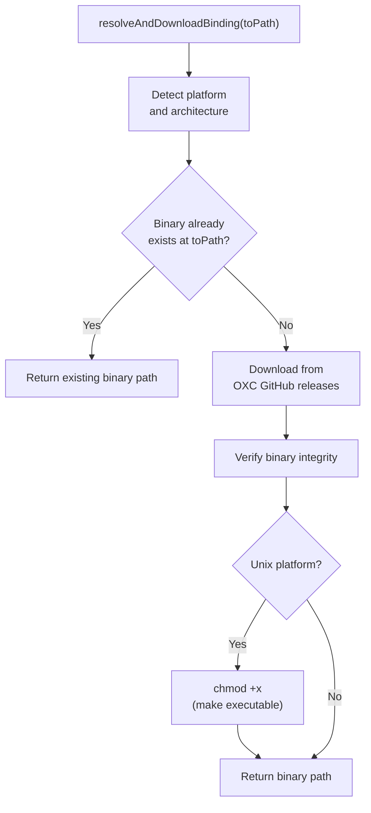
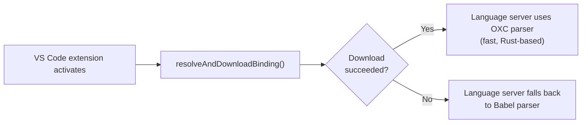
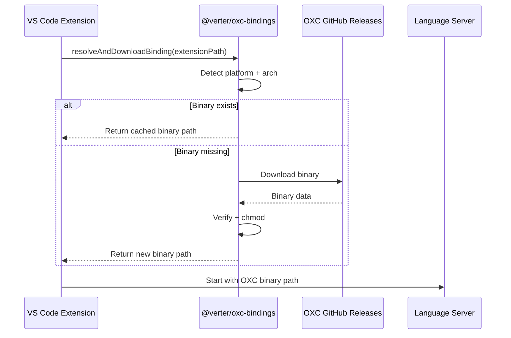

# @verter/oxc-bindings

Helper for downloading platform-specific OXC parser binaries.

> [!WARNING]
> This project is **experimental and under active development**. APIs, architecture, and package boundaries may change without notice.

## Overview

`@verter/oxc-bindings` provides utilities to resolve and download the correct [OXC](https://oxc-project.github.io/) parser binary for the current platform. OXC is a high-performance JavaScript/TypeScript parser written in Rust, and Verter uses it for fast AST parsing in the language server and VS Code extension.

If the OXC binary is unavailable (unsupported platform, network failure, etc.), the language server falls back to using Babel as the parser.

This package has **no production dependencies** — it uses only Node.js built-in modules.

## Installation

```bash
pnpm add -D @verter/oxc-bindings
```

## Architecture

```
src/
├── index.ts           # Main exports (resolveAndDownloadBinding, resolveBinding)
├── download.ts        # Binary download logic (HTTP fetch, verification)
└── resolveBinding.ts  # Platform detection and binary path resolution
```

### Download Flow



### Fallback Behavior



## API / Usage

### `resolveAndDownloadBinding(toPath: string): Promise<string>`

Resolves the correct OXC binary for the current platform and downloads it to `toPath` if it does not already exist. Returns the absolute path to the binary.

```typescript
import { resolveAndDownloadBinding } from "@verter/oxc-bindings";

const binaryPath = await resolveAndDownloadBinding("/path/to/extension");
```

### `resolveBinding(): string`

Resolves the expected binary name for the current platform and architecture without downloading. Useful for checking availability or constructing paths manually.

```typescript
import { resolveBinding } from "@verter/oxc-bindings";

const bindingName = resolveBinding();
// e.g. "oxc-parser-darwin-arm64"
```

### Error Handling

If the download fails or the platform is unsupported, the caller should fall back gracefully:

```typescript
try {
  await resolveAndDownloadBinding(extensionPath);
} catch (error) {
  // Fall back to Babel parser
  console.warn("OXC binding not available, using Babel parser");
}
```

## Platform Support

| Platform | Architecture | Binary Target |
|----------|-------------|---------------|
| macOS | x64 | `darwin-x64` |
| macOS | arm64 (Apple Silicon) | `darwin-arm64` |
| Windows | x64 | `win32-x64` |
| Linux | x64 (glibc) | `linux-x64-gnu` |
| Linux | arm64 (glibc) | `linux-arm64-gnu` |

## Usage in Verter

The VS Code extension (`verter-vscode`) calls `resolveAndDownloadBinding()` during activation to ensure the OXC binary is available before starting the language server. This is the primary consumer of this package.



## Development / Build

```bash
# Build the package
pnpm --filter @verter/oxc-bindings build

# Run tests
pnpm --filter @verter/oxc-bindings test
```

## Dependencies

This package has **no production dependencies**. It relies solely on Node.js built-in modules:

| Module | Purpose |
|--------|---------|
| `node:fs` / `node:fs/promises` | File system operations |
| `node:path` | Path resolution |
| `node:os` | Platform and architecture detection |
| `node:https` | Binary download over HTTPS |
| `node:child_process` | Binary verification |

## License

MIT
