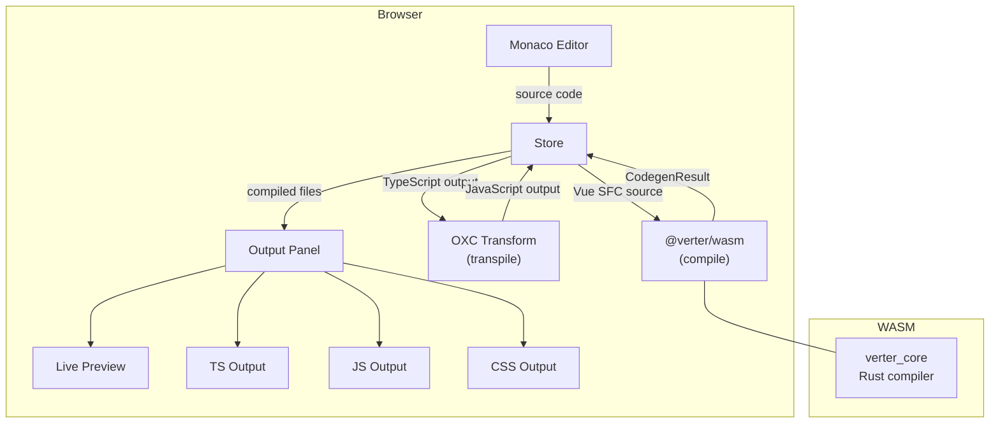
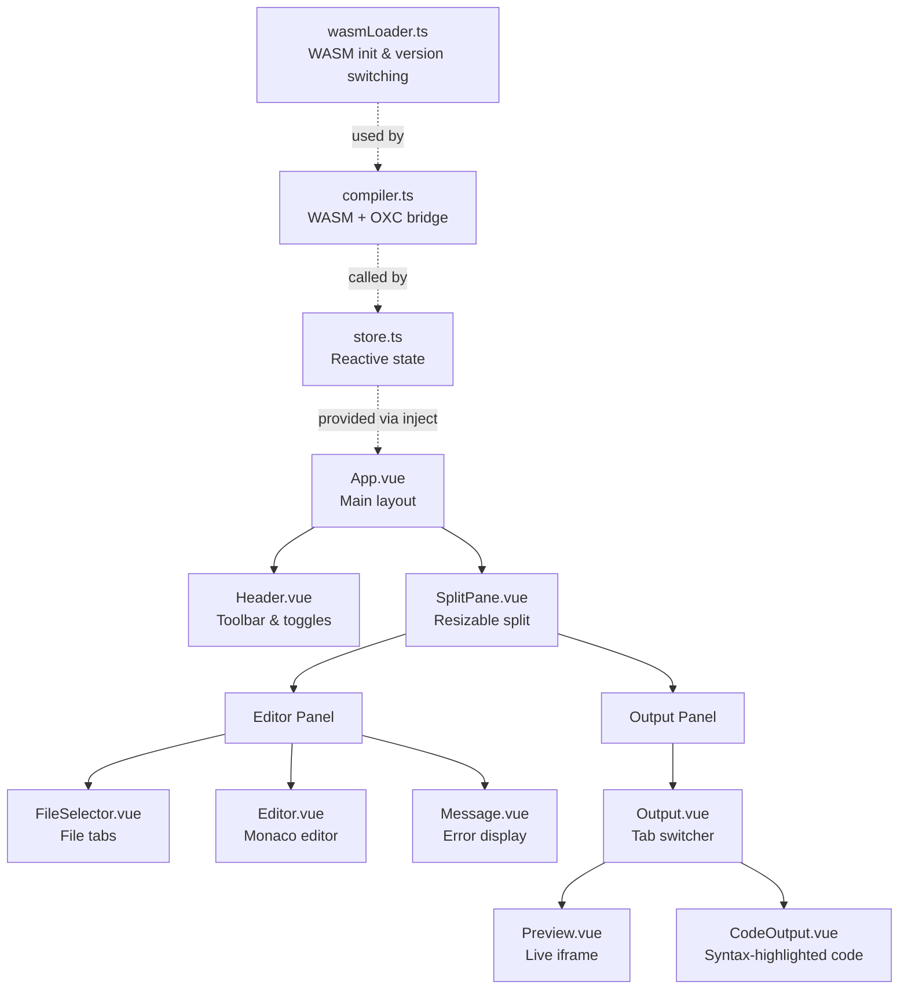

# @verter/playground

> [!WARNING]
> This project is **experimental and under active development**. APIs, architecture, and package boundaries may change without notice.

Online playground for live Vue SFC compilation using Verter. Write Vue Single File Components in a browser-based editor and instantly see the compiled output -- render functions, TypeScript, JavaScript, CSS, and a live preview.

This is a **private** package (not published to npm). It is deployed to Netlify via the release CI workflow.

## Architecture



### Application Structure



### Source Layout

```
src/
  App.vue                    Main application layout with split pane
  main.ts                    Vue app entry point
  style.css                  Global styles (light/dark themes)
  env.d.ts                   TypeScript environment declarations
  components/
    Header.vue               Toolbar: logo, mode toggles, timing, dark mode
    SplitPane.vue            Draggable resizable split pane
    Message.vue              Error message display
    VersionSelect.vue        WASM version switcher dropdown
  editor/
    Editor.vue               Monaco Editor integration
    FileSelector.vue         File tab bar with add/delete
    languageConfigs.ts       Monaco language configuration
    vueLanguage.ts           Vue language tokenizer for Monaco
  output/
    Output.vue               Output tab switcher (Preview / TS / JS / CSS)
    Preview.vue              Live preview via sandboxed iframe
    CodeOutput.vue           Syntax-highlighted code display (Shiki)
    srcdoc.html              Template for the preview iframe
  core/
    store.ts                 Reactive application state (useStore)
    compiler.ts              Compilation bridge (WASM + OXC)
    wasmLoader.ts            WASM module loading and version switching
    types.ts                 File, CompilerOptions, OutputMode, StoreState
    importMap.ts             Import map for the live preview
    versions.ts              Version entry definitions for version switcher
```

## Features

- **Live compilation** -- Vue SFCs are compiled on every keystroke (with auto-save toggle)
- **Multiple output views** -- Preview (live iframe), TypeScript (Verter output), JavaScript (OXC-transpiled), CSS
- **Compilation timing** -- Displays per-stage timing (Verter SFC-to-TS, OXC TS-to-JS) in the header and output tabs
- **Dark mode** -- System-preference-aware with manual toggle
- **Split-pane layout** -- Resizable editor/output panels
- **Multi-file support** -- Add, rename, and delete files; supports `.vue`, `.ts`, `.js`, and `.css`
- **Compiler mode toggles** -- Production mode, SSR mode
- **Version switching** -- Load different WASM builds (local, nightly commit, release) for comparison
- **Monaco Editor** -- Full code editor with Vue syntax highlighting
- **Shiki syntax highlighting** -- In the output panels

## Tech Stack

| Technology                           | Purpose                                     |
| ------------------------------------ | ------------------------------------------- |
| Vue 3                                | Application framework                       |
| Monaco Editor (`monaco-editor-core`) | Code editor                                 |
| Shiki (`shiki`, `@shikijs/monaco`)   | Syntax highlighting                         |
| OXC Transform (`oxc-transform`)      | TypeScript to JavaScript transpilation      |
| `@verter/wasm`                       | Vue SFC compilation (Rust compiled to WASM) |
| Vite                                 | Build tool and dev server                   |
| Netlify                              | Deployment target                           |

## Development

### Prerequisites

The WASM binary must be built before the playground can run. From the repository root:

```bash
pnpm run build:wasm
```

### Local Development

```bash
pnpm --filter @verter/playground dev
```

This starts a Vite dev server with hot module replacement.

### Build

```bash
pnpm --filter @verter/playground build
```

Produces a static SPA in `dist/` ready for deployment.

### Preview Production Build

```bash
pnpm --filter @verter/playground preview
```

## Deployment

The playground is deployed to Netlify. The `netlify.toml` configuration (at workspace root) sets:

- SPA routing (all paths rewrite to `/index.html`)
- Correct build command and publish directory
- COOP/COEP headers for `SharedArrayBuffer` support (configured in `vite.config.ts`)

Deployment happens automatically via:

- **Preview deploys**: When a maintainer adds the `preview` label to a PR
- **Production deploys**: When a release tag is pushed (v\*)

## Dependencies

| Package                       | Purpose                                          |
| ----------------------------- | ------------------------------------------------ |
| `@verter/wasm`                | Rust-based Vue SFC compiler (WASM)               |
| `vue`                         | Application framework                            |
| `monaco-editor-core`          | Code editor component                            |
| `shiki` / `@shikijs/monaco`   | Syntax highlighting                              |
| `oxc-transform`               | TypeScript transpilation in the browser          |
| `@verter/unplugin`            | Universal bundler plugin for Vue SFC compilation |
| `vite` / `@vitejs/plugin-vue` | Build tooling                                    |

## License

ISC
