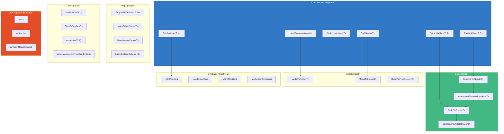
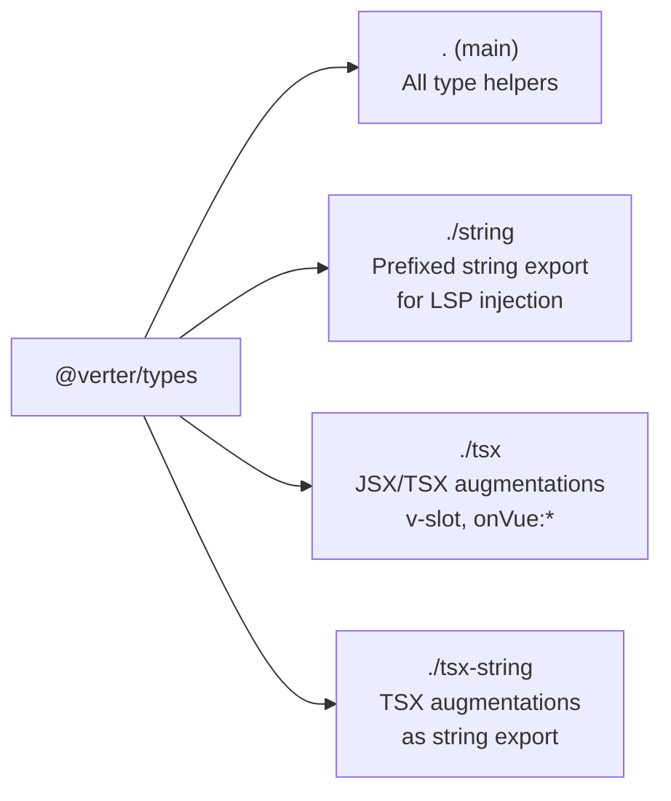

# @verter/types

> [!WARNING]
> **Experimental** -- This package is under active development and APIs may change without notice. It is not yet recommended for production use.

TypeScript utility types and Vue helpers for the [Verter](https://github.com/pikax/verter) project. Provides type-level primitives for SFC-to-TSX transformation, emit/slot/prop inference, directive typing, and a string-export variant designed for safe injection into the language server.

## Overview

`@verter/types` is a types-only package (no runtime side-effects) that serves two purposes:

1. **Type utilities** consumed by Verter's IDE codegen, TypeScript-provider integration, and other packages to correctly type Vue component props, emits, slots, models, directives, and instances.
2. **String export** for the Verter language server, where all type declarations are serialized as a string with `$V_` prefixed identifiers to avoid naming collisions when injected into user projects.

### Key Capabilities

- Hidden metadata attachment via unique symbols (`PatchHidden` / `ExtractHidden`)
- Vue emit function-to-object conversion and emit-to-prop mapping
- Strict slot rendering with type-safe content validation
- Props with defaults handling (`PropsWithDefaults`, `MakePublicProps`, `MakeInternalProps`)
- Model-to-emit and model-to-prop type inference (`ModelToEmits`, `ModelToProps`)
- Directive modifier type checking (`vOnModifiers`, `vModelModifiers`, `vBindModifiers`)
- TSX augmentations for `v-slot`, `v-directive`, and `onVue:*` lifecycle attributes
- Multiple export paths for different consumption contexts
- Benchmark harness for TypeScript checker performance regression testing

## Installation

```bash
# pnpm (recommended)
pnpm add -D @verter/types

# npm
npm install -D @verter/types

# yarn
yarn add -D @verter/types
```

## Architecture

### Type System Overview



### Export Paths



| Export Path    | Entry Point                 | Purpose                                            |
| -------------- | --------------------------- | -------------------------------------------------- |
| `.`            | `dist/index.d.ts`           | All type helpers (PatchHidden, EmitsToProps, etc.) |
| `./string`     | `dist/string-export.js`     | All declarations as a JS string with `$V_` prefix  |
| `./tsx`        | `dist/tsx-export.d.ts`      | JSX `IntrinsicClassAttributes` augmentations       |
| `./tsx-string` | `dist/tsx-string-export.js` | TSX augmentations as a string export               |

### Package Structure

```
src/
├── index.ts                  # Main entry (re-exports all modules)
├── helpers/
│   ├── helpers.ts            # PatchHidden, ExtractHidden, PartialUndefined, etc.
│   └── helpers.spec.ts       # Type tests
├── emits/
│   ├── emits.ts              # FunctionToObject, EmitsToProps, ComponentEmitsToProps
│   └── emits.spec.ts         # Type tests
├── props/
│   ├── props.ts              # PropsWithDefaults, MakePublicProps, MakeInternalProps
│   └── props.spec.ts         # Type tests
├── model/
│   ├── model.ts              # ModelToEmits, ModelToProps, MacroToPropEvents
│   └── model.spec.ts         # Type tests
├── slots/
│   ├── slots.ts              # strictRenderSlot, SlotsToRender, renderSlotJSX
│   └── slots.spec.ts         # Type tests
├── directives/
│   ├── directives.ts         # vOnModifiers, vModelModifiers, runCustomDirective
│   └── (no spec -- tested via integration)
├── render/
│   └── render.ts             # extractArgumentsFromRenderSlot, SlotToRender
├── instance/
│   ├── instance.ts           # Component instance type helpers
│   └── instance.spec.ts      # Type tests
├── components/
│   ├── components.ts         # Component type helpers
│   └── components.spec.ts    # Type tests
├── loops/
│   ├── loops.ts              # v-for loop type helpers
│   └── loops.spec.ts         # Type tests
├── setup/
│   ├── setup.ts              # Setup return type helpers
│   └── setup.spec.ts         # Type tests
├── name/
│   ├── name.ts               # Component name resolution
│   └── name.spec.ts          # Type tests
├── vue/
│   ├── vue.ts                # Vue-specific type overrides
│   ├── vue.macros.ts         # Vue macro type helpers
│   └── vue.macros.spec.ts    # Type tests
├── tsx/
│   ├── tsx.tsx               # JSX IntrinsicClassAttributes augmentation
│   ├── tsx.attributes.ts     # HTML attribute type augmentations
│   ├── components-tsx.ts     # Component TSX helpers
│   └── tsx.spec.tsx          # Type tests
└── exports.spec.ts           # Validates all exports are accessible
```

## API / Usage

### Core Helpers

```typescript
import type {
  PatchHidden,
  ExtractHidden,
  PartialUndefined,
  UnionToIntersection,
  OmitNever,
  PickByValue,
} from "@verter/types";

// Attach hidden metadata to a type via a unique symbol key
type Tagged = PatchHidden<{ id: number }, { __brand: "user" }>;
type Meta = ExtractHidden<Tagged>; // { __brand: "user" }
type Clean = ExtractHidden<{ id: number }>; // never (no hidden data)

// Make undefined-able properties optional
type A = { a: string; b: number | undefined; c: boolean };
type Opt = PartialUndefined<A>; // { a: string; b?: number | undefined; c: boolean }

// Convert a union into an intersection
type U = { x: 1 } | { y: 2 };
type I = UnionToIntersection<U>; // { x: 1 } & { y: 2 }

// Filter out never-valued properties
type WithNever = { a: string; b: never; c: number };
type Cleaned = OmitNever<WithNever>; // { a: string; c: number }

// Pick properties by value type
type Obj = { name: string; age: number; active: boolean };
type Strings = PickByValue<Obj, string>; // { name: string }
```

### Vue Emits Helpers

```typescript
import type {
  FunctionToObject,
  IntersectionFunctionToObject,
  EmitsToProps,
  ComponentEmitsToProps,
} from "@verter/types";

// Convert a single emit function to an event-args object
type EmitFn = (e: "save", id: number) => void;
type AsObject = FunctionToObject<EmitFn>;
// { [UniqueKey]?: { save: [number] } } & ((e: "save", id: number) => void)

// Merge multiple emit overloads into a single event map
type Overloads = ((e: "open", path: string) => void) & ((e: "close") => void);
type Merged = IntersectionFunctionToObject<Overloads>;

// Convert emits to Vue-style onXxx props
type Props = EmitsToProps<Overloads>;
// { onOpen?: (path: string) => void; onClose?: () => void }

// Extract emits from a component constructor and derive props
type CompProps = ComponentEmitsToProps<typeof MyComponent>;
```

### Props Helpers

```typescript
import type {
  PropsWithDefaults,
  MakePublicProps,
  MakeInternalProps,
  MakeBooleanOptional,
} from "@verter/types";

// Mark specific props as having defaults
type Props = { name: string; count: number; active: boolean };
type WithDefs = PropsWithDefaults<Props, "count" | "active">;

// Public API: props with defaults become optional
type Public = MakePublicProps<WithDefs>;
// { name: string; count?: number | undefined; active?: boolean | undefined }

// Internal API: props with defaults are always defined
type Internal = MakeInternalProps<WithDefs>;
// { name: string; count: number; active: boolean }
```

### Model Helpers

```typescript
import type { ModelToEmits, ModelToProps } from "@verter/types";

// Given defineModel() return types, derive emits and props
type Models = {
  modelValue: import("vue").ModelRef<string>;
  count: import("vue").ModelRef<number>;
};

type Emits = ModelToEmits<Models>;
// ((event: "update:modelValue", arg: string) => any)
// & ((event: "update:count", arg: number) => any)

type Props = ModelToProps<Models>;
// { modelValue: string; count: number }
```

### Slots Helpers

```typescript
import type { SlotsToRender, SlotToRender } from "@verter/types";
import { defineComponent, type SlotsType } from "vue";

const MyComponent = defineComponent({
  slots: {} as SlotsType<{
    default: (props: { msg: string }) => any;
    header: (props: { title: string }) => any;
    footer: () => any;
  }>,
});

// Convert slots to renderable component types for JSX
type RenderSlots = SlotsToRender<InstanceType<typeof MyComponent>["$slots"]>;
// {
//   default: { new(): { $props: { msg: string } } };
//   header: { new(): { $props: { title: string } } };
//   footer: { new(): { $props: {} } };
// }
```

### Directive Type Helpers

```typescript
import type { vOnModifiers, vModelModifiers, vBindModifiers } from "@verter/types";

// Type-safe v-on modifier checking
// Returns which modifiers are valid for a given event on a given element
type ClickMods = vOnModifiers<HTMLButtonElement, "onclick">;
// Partial<{ stop: true; prevent: true; self: true; ctrl: true; ... }>

// v-model modifiers
type InputModelMods = vModelModifiers<HTMLInputElement, "value">;
// { lazy?: true; number?: true; trim?: true }

// v-bind modifiers
type BindMods = vBindModifiers<HTMLDivElement, "class">;
// { prop?: true; attr?: true; camel?: true }
```

### TSX Augmentations

The `./tsx` export augments the JSX namespace with Verter-specific attributes:

```typescript
// Automatically available when @verter/types/tsx is imported
// These are added to JSX.IntrinsicClassAttributes<T>:

// v-slot: retrieve component instance type in TSX
<MyComponent v-slot={(instance) => instance.$slots} />

// v-directive: retrieve component instance for directive typing
<MyComponent v-directive={(instance) => instance} />

// onVue:* lifecycle hooks on any component
<MyComponent onVue:mounted={(vnode) => console.log(vnode)} />
<MyComponent onVue:before-unmount={(vnode, old) => cleanup()} />
```

### String Export (for Language Servers)

The `./string` export provides all type declarations as a JavaScript string with `$V_`-prefixed identifiers, suitable for injection into the TypeScript language service:

```typescript
import typeHelpersSource from "@verter/types/string";
import { prefixWith, ExportedTypes } from "@verter/types/string";

// typeHelpersSource contains declarations like:
//   export declare const $V_UniqueKey: unique symbol;
//   export type $V_PatchHidden<T, E> = { [$V_UniqueKey]?: E } & T;
//   export type $V_ExtractHidden<T, R = never> = ...

// Use a custom prefix instead of $V_
const customPrefixed = prefixWith("__MY_PREFIX_");

// Set of originally exported type/interface names (unprefixed)
console.log(ExportedTypes);
// Set { "PatchHidden", "ExtractHidden", "EmitsToProps", ... }
```

The string export process:

1. Reads all source files discovered from `src/index.ts` exports
2. Collects all declaration names (types, interfaces, functions, variables)
3. Rewrites every identifier with the `$V_` prefix via a TypeScript AST transformer
4. Strips comments (unless `--keep-comments` is passed)
5. Inlines all local imports into a single file
6. Outputs a JS module exporting the declaration string

## Development

### Building

```bash
pnpm build              # Full build: string export + TSX build + tsc
pnpm build:string       # Rebuild string export only
pnpm build:tsx          # Rebuild TSX export only
pnpm dev                # Watch mode (tsc only)
```

### Building with comments preserved

```bash
node packages/types/scripts/build-string.mjs --keep-comments
```

### Testing

Tests are type-only and run via Vitest in typecheck mode (no runtime assertions).

```bash
pnpm test               # Run all type tests (vitest --typecheck --run)
```

#### Writing Type Tests

Always include both a positive assertion and a `@ts-expect-error` negative assertion. This prevents `any`, `unknown`, or `never` types from silently passing tests.

```typescript
import { assertType } from "vitest";
import type { PartialUndefined } from "./helpers";

it("makes undefined properties optional", () => {
  type Input = { a: string; b: number | undefined };
  type Result = PartialUndefined<Input>;
  type Expected = { a: string; b?: number | undefined };

  // Positive: result matches expected type
  assertType<Result>({} as Expected);
  assertType<Expected>({} as Result);

  // Negative: result is not any/unknown/never
  // @ts-expect-error - Unrelated type should not match
  assertType<{ unrelated: true }>({} as Result);
});
```

### Benchmarking

Measure TypeScript checker performance to catch regressions in type computation:

```bash
pnpm bench              # Default sizes (10, 50, 100, 200, 500)
pnpm bench:trace        # With TypeScript trace for Chrome DevTools

# Custom sizes
node packages/types/scripts/bench-types.mjs --sizes=10,25,50,75,100
```

The benchmark generates scalable type files with varying numbers of properties and union members, then runs `tsc --extendedDiagnostics` to report total check time, memory usage, node count, and type count.

## Dependencies

This is a types-only package with minimal dependencies:

| Dependency   | Scope | Purpose                                      |
| ------------ | ----- | -------------------------------------------- |
| `typescript` | dev   | Type checking and string export build script |
| `vitest`     | dev   | Type test runner (`--typecheck` mode)        |
| `vue`        | dev   | Vue 3 types for testing compatibility        |

## Compatibility

| Requirement | Version                                      |
| ----------- | -------------------------------------------- |
| TypeScript  | 5.x (tested with 5.8+)                       |
| Vue         | 3.5+                                         |
| Runtime     | None (types-only, zero runtime side-effects) |

## License

MIT
