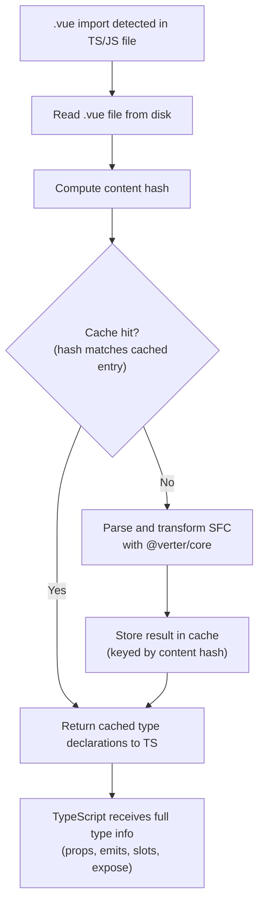
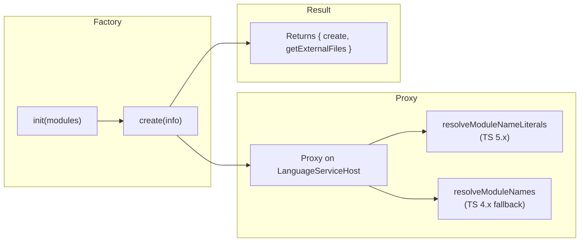

# @verter/typescript-plugin

TypeScript plugin enabling `.vue` import resolution in TS/JS files.

> [!WARNING]
> This project is **experimental and under active development**. APIs, architecture, and package boundaries may change without notice.

## Overview

`@verter/typescript-plugin` intercepts TypeScript's module resolution to handle `.vue` single-file component imports. When a `.vue` import is detected, the plugin reads the file, parses it with `@verter/core`, transforms it to TypeScript, caches the result, and returns type information back to the TypeScript language service.

This enables full type checking, autocompletion, and go-to-definition for `.vue` imports inside `.ts` and `.js` files — without requiring manual type stubs or ambient declarations.

> **Note:** The plugin generates typed representations for TypeScript analysis — the output is used for type-checking and IDE features, not for runtime execution.

## Installation

```bash
pnpm add -D @verter/typescript-plugin
```

Add the plugin to your `tsconfig.json`:

```jsonc
{
  "compilerOptions": {
    "plugins": [
      { "name": "@verter/typescript-plugin" }
    ]
  }
}
```

> If you are using the [Verter VS Code extension](../vue-vscode), the plugin is configured automatically — no manual `tsconfig.json` changes are needed.

## Architecture

```
src/
├── index.ts              # Plugin entry point (factory function)
└── helpers/
    ├── utils.ts          # Utility functions
    └── getDtsSnapshot.ts # SFC parsing, transformation, and caching
```

### Resolution Flow

When a `.vue` import is encountered in any `.ts` or `.js` file, the following pipeline executes:



### Plugin Lifecycle

The plugin follows the standard TypeScript language service plugin factory pattern:



1. **`init()`** — Called once when TypeScript loads the plugin module. Receives the TypeScript module reference.
2. **`create(info)`** — Called per project. Creates a `Proxy` on the `LanguageServiceHost` that intercepts module resolution calls.
3. **Module resolution override** — When a `.vue` module specifier is encountered, the plugin resolves it to a virtual TypeScript snapshot generated from the SFC.
4. **`getExternalFiles()`** — Reports `.vue` files to TypeScript so they are included in the project.

## API / Usage

Once installed and configured, the plugin works transparently. Any `.vue` import in a `.ts` or `.js` file will be resolved with full type information:

```typescript
import MyComponent from "./MyComponent.vue";

// Props, emits, slots, and exposed methods are all fully typed
<MyComponent message="hello" @update="handler" />
```

For a Vue component like:

```vue
<script setup lang="ts">
defineProps<{
  message: string;
  count?: number;
}>();

defineEmits<{
  (e: 'update', value: number): void;
}>();
</script>
```

TypeScript will infer the full component interface — required/optional props, event handlers, slot types, and exposed members — just as it would for a native `.tsx` component.

### Plugin Factory

```typescript
const init: tsModule.server.PluginModuleFactory = ({ typescript: ts }) => {
  return {
    create(info: tsModule.server.PluginCreateInfo) {
      const languageServiceHost = new Proxy(info.languageServiceHost, {
        get(target, key) {
          if (key === 'resolveModuleNameLiterals') {
            return customResolver; // TS 5.x
          }
          if (key === 'resolveModuleNames') {
            return legacyResolver; // TS 4.x
          }
          return target[key];
        }
      });

      return ts.createLanguageService(languageServiceHost);
    },
    getExternalFiles(project) {
      return getVueFilesInProject(project);
    }
  };
};
```

### Caching

The plugin uses content-hash-based cache invalidation to avoid redundant parsing:

- When a `.vue` file is imported, its content is read and hashed.
- If the hash matches a cached entry, the cached TypeScript snapshot is returned immediately.
- If the hash differs (file changed), the SFC is re-parsed and re-transformed, and the cache is updated.
- The cache is cleared on project reload.

### VS Code Integration

The Verter VS Code extension automatically configures this plugin on activation:

```typescript
commands.executeCommand(
  "_typescript.configurePlugin",
  "@verter/typescript-plugin",
  { enable: true }
);
```

## Development / Build

```bash
# Build the plugin
pnpm --filter @verter/typescript-plugin build

# Watch mode for iterative development
pnpm --filter @verter/typescript-plugin dev
```

To test changes inside VS Code, rebuild the plugin and then reload the TypeScript language service via `TypeScript: Restart TS Server` from the command palette.

### Troubleshooting

| Problem | Solution |
|---------|----------|
| Plugin not loading | Ensure `@verter/typescript-plugin` is listed in `tsconfig.json` `compilerOptions.plugins`, then restart the TS server |
| Missing type inference | Verify `@verter/core` is installed; check for SFC parse errors |
| Slow first load | Expected on large projects — subsequent loads use the content-hash cache |

## TypeScript Compatibility

| TypeScript Version | Resolution Hook | Status |
|--------------------|-----------------|--------|
| 5.x | `resolveModuleNameLiterals` | Full support |
| 4.x | `resolveModuleNames` | Supported (legacy path) |

## Dependencies

| Dependency | Purpose |
|------------|---------|
| `typescript` | TypeScript compiler API (peer dependency) |
| `@verter/core` | SFC parsing and TSX transformation |

## License

MIT
