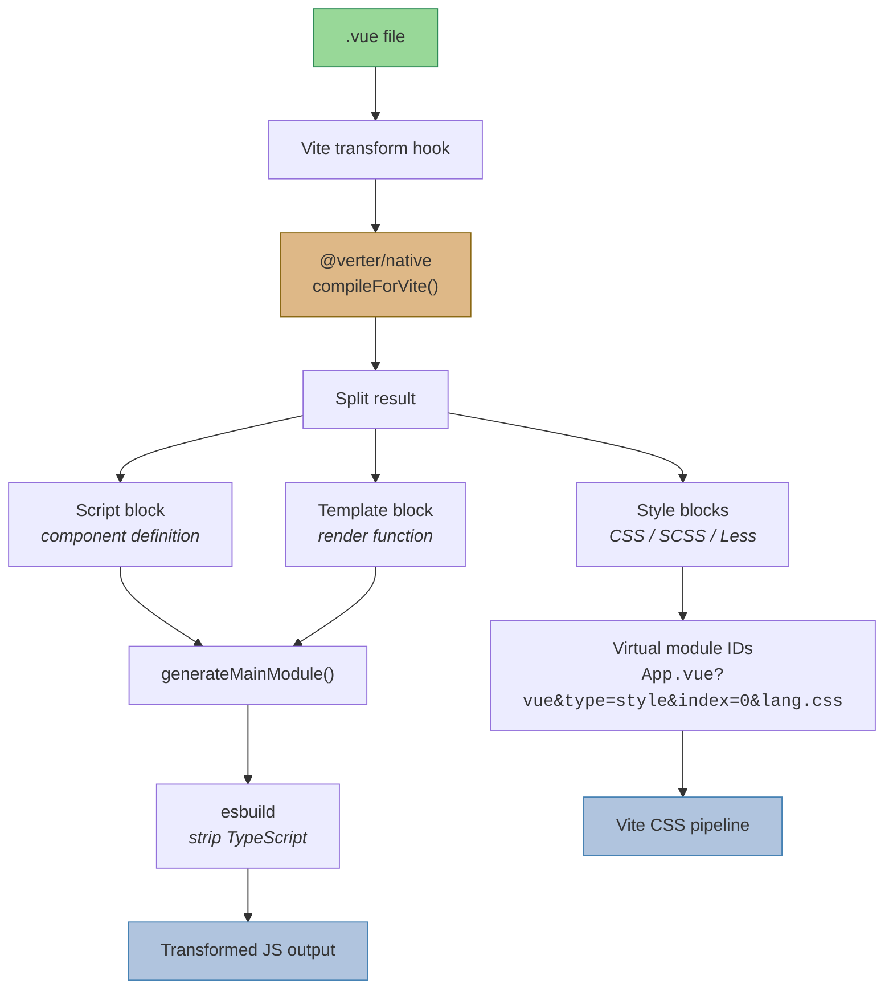
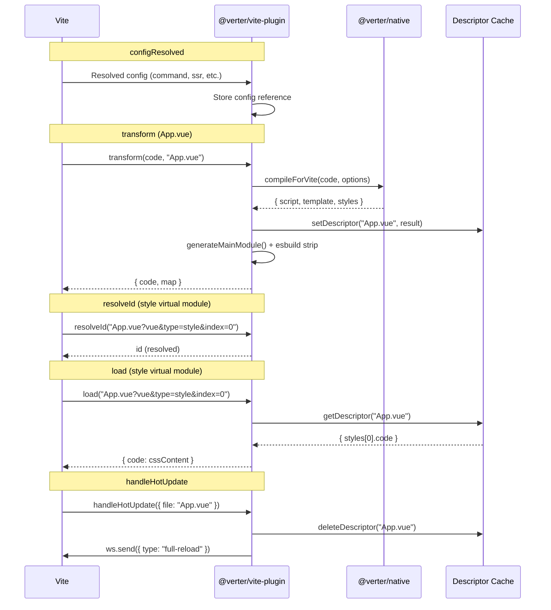

# @verter/vite-plugin

> [!WARNING]
> This project is **experimental and under active development**. APIs, architecture, and package boundaries may change without notice.

Vite plugin for compiling Vue Single File Components with the Verter compiler. Drop-in replacement for `@vitejs/plugin-vue` that uses the Rust-powered Verter template compiler for fast, native-speed SFC transformation.

## Overview

`@verter/vite-plugin` integrates the Verter compiler into the Vite build pipeline. It intercepts `.vue` file requests, compiles them through `@verter/native`'s `compileForVite` API, and serves the result as split virtual modules (script, template, styles) that Vite processes through its standard CSS and TypeScript pipelines.

The plugin handles the full lifecycle: compilation with caching, virtual module resolution for style blocks, TypeScript stripping via esbuild, scoped style IDs, component metadata injection, and Hot Module Replacement (HMR) in development.

## Architecture



### Plugin Hook Flow



## Installation

```bash
npm install @verter/vite-plugin
# or
pnpm add @verter/vite-plugin
```

### Peer Dependencies

| Dependency | Versions |
|------------|----------|
| `vite` | `^4.0.0 \|\| ^5.0.0 \|\| ^6.0.0 \|\| ^7.0.0` |

The `@verter/native` package is a direct dependency and will be installed automatically with the correct platform binary.

## API / Usage

### Basic Setup

```typescript
// vite.config.ts
import { defineConfig } from 'vite';
import { verter } from '@verter/vite-plugin';

export default defineConfig({
  plugins: [verter()],
});
```

### Custom Component ID

By default, Verter generates component IDs by hashing the filename (production) or filename + source content (development). You can override this with a custom generator:

```typescript
import { defineConfig } from 'vite';
import { verter } from '@verter/vite-plugin';

export default defineConfig({
  plugins: [
    verter({
      componentId: (filename, source, isProd) => {
        // Return a unique 8-character string
        return myCustomHash(filename);
      },
    }),
  ],
});
```

### Options

```typescript
interface VerterPluginOptions {
  /**
   * Custom component ID generator.
   * The component ID is used for scoped style attributes (data-v-xxxxxxxx),
   * HMR record tracking, and Vue devtools identification.
   *
   * @param filename - Absolute path to the .vue file
   * @param source   - Raw SFC source code
   * @param isProd   - Whether this is a production build
   * @returns An 8-character identifier string
   */
  componentId?: (filename: string, source: string, isProd: boolean) => string;
}
```

### Plugin Behavior

| Hook | Behavior |
|------|----------|
| `configResolved` | Captures the resolved Vite config (command mode, SSR flag, etc.) |
| `resolveId` | Resolves virtual module IDs for style block requests (`?vue&type=style&index=N`) |
| `load` | Serves cached style block content for virtual module requests |
| `transform` | Compiles `.vue` files: runs `compileForVite`, assembles the main module, strips TypeScript via esbuild |
| `handleHotUpdate` | Clears the descriptor cache and triggers a full reload for changed `.vue` files |

### Main Module Assembly

When a `.vue` file is transformed, the plugin assembles a main module from the split compilation result:

1. **Style imports** -- Virtual module import statements so Vite routes CSS through its pipeline
2. **Script block** -- Component definition (`export default` rewritten to `const _sfc_main =`)
3. **Template block** -- Compiled render function
4. **Render attachment** -- `_sfc_main.render = render`
5. **Metadata** -- `__scopeId` (scoped styles), `__file` (devtools)
6. **HMR setup** -- Development-only `import.meta.hot` handler with `__VUE_HMR_RUNTIME__` integration
7. **Export** -- `export default _sfc_main`

## Development / Build

### Building

```bash
# Build the plugin (CJS + ESM + type declarations)
pnpm run build

# Watch mode for development
pnpm run dev
```

Both commands use `tsdown`:

```bash
# Production build
tsdown src/index.ts --format cjs,esm --dts

# Development watch
tsdown src/index.ts --format cjs,esm --dts --watch
```

### Testing

```bash
pnpm test    # runs: vitest run
```

### Source Structure

```
packages/vite-plugin/src/
  index.ts    # Plugin factory, Vite hooks, compiler integration
  main.ts     # Main module assembler (generateMainModule)
  utils.ts    # Vue request parser, descriptor cache
```

## Dependencies

| Dependency | Type | Purpose |
|------------|------|---------|
| `@verter/native` | runtime | Rust template compiler (provides `compileForVite`) |
| `vite` | peer | Vite build tool (`transformWithEsbuild`, plugin types) |
| `tsdown` | dev | TypeScript bundler |
| `typescript` | dev | Type checking |
| `vitest` | dev | Test runner |

## License

ISC
