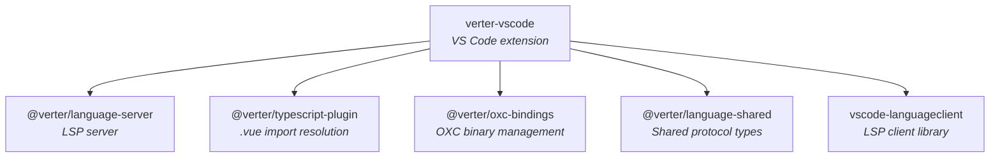
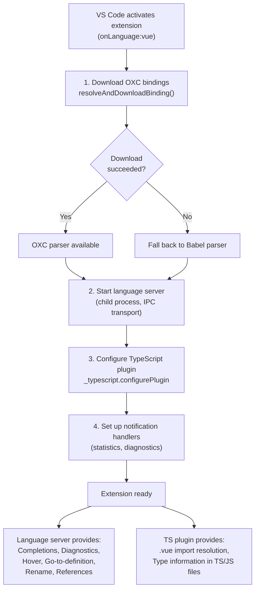
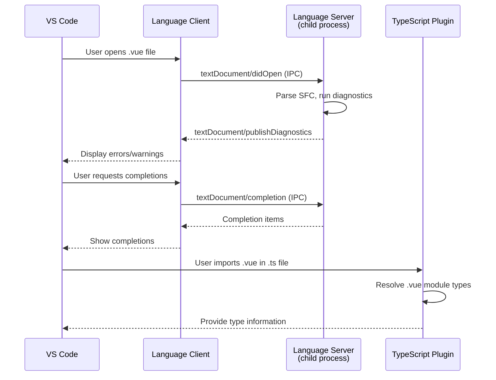

# verter-vscode

The official VS Code extension for Verter — an experimental Vue compiler and language server.

> [!WARNING]
> This project is **experimental and under active development**. APIs, architecture, and package boundaries may change without notice.

## Overview

`verter-vscode` is the VS Code extension that provides full-featured Vue language support powered by the Verter toolchain. It bundles the Verter language server, TypeScript plugin, and OXC parser bindings into a single extension, delivering intelligent completions, type checking, diagnostics, go-to-definition, hover information, and a compiled code viewer for Vue single-file components.

### Features

- **Intelligent Completions** — context-aware autocompletion for templates, scripts, and styles
- **Type Checking** — real-time TypeScript diagnostics in `.vue` files
- **Go-to-Definition** — navigate to component definitions, props, emits, and slots
- **Hover Information** — inline type information and documentation on hover
- **Diagnostics** — template and script error reporting
- **Compiled Code View** — inspect the generated TSX output for any `.vue` file

## Installation

### From VS Code Marketplace

Search for **Verter** in the VS Code Extensions panel, or install from the command line:

```bash
code --install-extension verter.verter-vscode
```

### From Source

```bash
pnpm --filter verter-vscode package
# Produces a .vsix file in packages/vue-vscode/
code --install-extension packages/vue-vscode/verter-vscode-*.vsix
```

### Requirements

- VS Code **1.90.0** or later
- Node.js **18** or later

## Architecture

```
src/
├── extension.ts                    # Extension entry point (activate/deactivate)
└── CompiledCodeContentProvider.ts  # Virtual document provider for compiled code view
```

### Bundled Packages

The extension bundles four internal Verter packages:



### Activation Flow

When VS Code activates the extension (triggered by opening a `.vue` file or a workspace containing Vue files), the following sequence runs:



**Step-by-step:**

1. **Download OXC bindings** — ensures the platform-specific OXC parser binary is available for fast AST parsing. Falls back to Babel if unavailable.
2. **Start language server** — spawns `@verter/language-server` as a child process communicating over IPC transport.
3. **Configure TypeScript plugin** — registers `@verter/typescript-plugin` with TypeScript so `.vue` imports are resolved in `.ts`/`.js` files.
4. **Set up notification handlers** — listens for custom LSP notifications (statistics, diagnostics, etc.).

### Language Server Communication



## API / Usage

### Commands

| Command | ID | Description |
|---------|----|-------------|
| Restart Language Server | `verter.restartLanguageServer` | Restart the Verter LSP server |
| Show Compiled Code to Side | `verter.showCompiledCodeToSide` | View generated TSX for the current `.vue` file in a side panel |
| Write Virtual Files | `verter.writeVirtualFiles` | Write virtual files to disk for debugging |
| Show Statistics | `verter.showStatistics` | Display compilation statistics |

### Settings

| Setting | Type | Default | Description |
|---------|------|---------|-------------|
| `verter.enable` | `boolean` | `true` | Enable or disable the Verter extension |
| `verter.statistics.enabled` | `boolean` | `false` | Enable compilation statistics collection |
| `verter.statistics.persistToFile` | `boolean` | `false` | Persist statistics to a file on disk |
| `verter.statistics.maxSnapshots` | `number` | — | Maximum number of statistics snapshots to retain |
| `verter.statistics.retentionDays` | `number` | — | Number of days to keep statistics snapshots |
| `verter.language-server.port` | `number` | `-1` | Language server debug port (`-1` for automatic) |
| `verter.trace.server` | `string` | `"off"` | LSP message trace level: `"off"`, `"messages"`, or `"verbose"` |

### Compiled Code View

Inspect the TSX that Verter generates for any `.vue` file:

1. Open a `.vue` file in the editor.
2. Run the command **Verter: Show Compiled Code to Side** (or use the command palette).
3. A side panel opens showing the generated TSX output, updated live as you edit.

This is useful for debugging type issues, understanding how Verter transforms your SFC, and learning the TSX equivalents of Vue template syntax.

## Development / Build

### Building

```bash
# Build the extension and all dependencies
pnpm build

# Build only the extension
pnpm --filter verter-vscode build

# Watch mode for iterative development
pnpm --filter verter-vscode watch
```

### Debugging

1. Open the monorepo root in VS Code.
2. Run `pnpm build` to ensure all packages are built.
3. Press **F5** to launch the Extension Development Host.
4. The extension activates in the new VS Code window with full debugging support (breakpoints, step-through, variable inspection).

Alternatively, use `pnpm dev-extension` to watch-build the language server and extension simultaneously.

### Packaging

```bash
# Produce a .vsix file for distribution
pnpm --filter verter-vscode package
```

### Troubleshooting

| Problem | Solution |
|---------|----------|
| Extension not activating | Check the Output panel for "Verter Language Server"; ensure a `.vue` file is open; try reloading the window |
| Type errors not showing | Verify `tsconfig.json` exists; check that `@verter/typescript-plugin` is in the plugins array; restart the TS server |
| Performance issues | Check for very large `.vue` files; ensure `node_modules` is excluded from file watching |

## Dependencies

| Dependency | Purpose |
|------------|---------|
| `@verter/language-server` | LSP server providing completions, diagnostics, hover, go-to-definition |
| `@verter/language-shared` | Shared protocol types between extension client and language server |
| `@verter/typescript-plugin` | TypeScript plugin for `.vue` import resolution in TS/JS files |
| `@verter/oxc-bindings` | Platform-specific OXC parser binary management |
| `vscode-languageclient` | VS Code LSP client library |

## License

MIT
