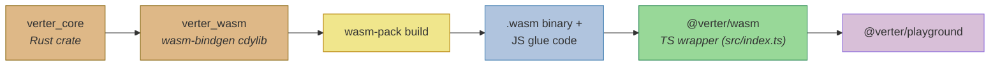
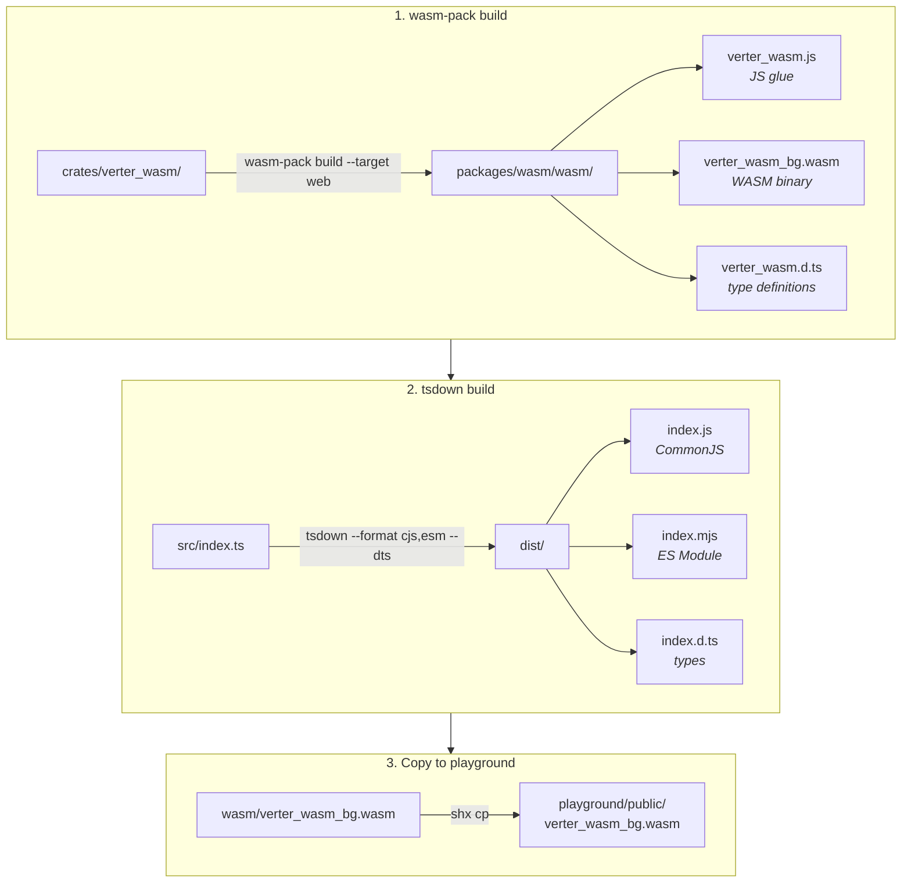
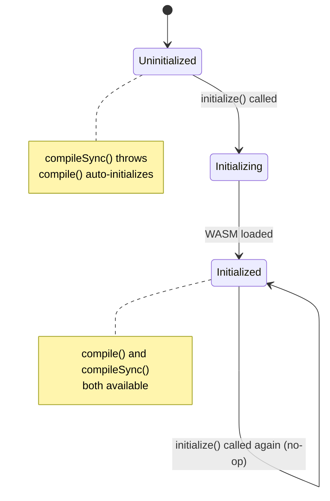

# @verter/wasm

> [!WARNING]
> This project is **experimental and under active development**. APIs, architecture, and package boundaries may change without notice.

WASM bindings for the Verter Vue template compiler. This package exposes the Rust `verter_core` compiler to browser environments via [wasm-bindgen](https://rustwasm.github.io/wasm-bindgen/), enabling client-side Vue SFC compilation in tools like the Verter playground.

## Overview

`@verter/wasm` wraps the same Rust template compiler used by `@verter/native`, but targets WebAssembly instead of native Node.js bindings. The package provides an `initialize()` / `compile()` lifecycle: the WASM module must be loaded asynchronously before compilation can begin, after which both async and sync compilation are available.

The WASM binary is size-optimized with `opt-level = "s"` and LTO enabled in the release profile, keeping the download footprint small for browser delivery.

## Architecture



### Build Pipeline



### Initialization Lifecycle



## Installation

```bash
npm install @verter/wasm
# or
pnpm add @verter/wasm
```

## API / Usage

### `initialize(): Promise<void>`

Loads the WASM module. Must be called before `compileSync()`. Safe to call multiple times -- only initializes once. Subsequent calls return immediately.

```typescript
import { initialize } from '@verter/wasm';

await initialize();
```

### `compile(input, options?): Promise<CodegenResult>`

Async compilation. Accepts `string` or `Uint8Array` input. Automatically calls `initialize()` if the module has not been loaded yet, so it is safe to call without explicit initialization.

```typescript
import { compile } from '@verter/wasm';

const result = await compile('<template><div>{{ msg }}</div></template>', {
  filename: 'App.vue',
  isProduction: false,
});

const bytes = new TextEncoder().encode('<template><div>{{ msg }}</div></template>');
const bytesResult = await compile(bytes, { filename: 'App.vue' });

console.log(result.code);
console.log(result.sourceMap);
console.log(result.codeWithSourceMap);
```

### `compileSync(input, options?): CodegenResult`

Synchronous compilation. Accepts `string` or `Uint8Array`. Requires `initialize()` to have been called and completed beforehand. Throws if the WASM module is not yet loaded.

```typescript
import { initialize, compileSync } from '@verter/wasm';

await initialize();

const result = compileSync('<template><div>Hello</div></template>');
```

### `isInitialized(): boolean`

Returns whether the WASM module has been loaded and is ready for synchronous compilation.

```typescript
import { isInitialized, initialize } from '@verter/wasm';

if (!isInitialized()) {
  await initialize();
}
```

### Types

All compile entry points accept `input` as `string | Uint8Array`.

```typescript
interface CodegenOptions {
  filename?: string;
  includeSourceContent?: boolean;
  ssr?: boolean;
  isProduction?: boolean;
  componentId?: string;
  features?: FeatureFlags;
}

interface FeatureFlags {
  optionsApi?: boolean;       // default: true
  propsDestructure?: boolean; // default: true
}

interface CodegenResult {
  code: string;
  sourceMap: string;
  codeWithSourceMap: string;
}
```

## Development / Build

### Prerequisites

- Rust toolchain (stable)
- [wasm-pack](https://rustwasm.github.io/wasm-pack/installer/)
- Node.js >= 18

### Build Commands

```bash
# Full build (wasm-pack -> tsdown -> copy to playground)
pnpm run build

# Individual steps:
pnpm run build:wasm             # Compile Rust to WASM via wasm-pack
pnpm run build:ts               # Bundle TypeScript wrapper with tsdown
pnpm run build:copy-playground  # Copy .wasm to playground/public/
```

The underlying commands:

```bash
# Step 1: Compile Rust crate to WebAssembly
wasm-pack build ../../crates/verter_wasm --target web --out-dir ../../packages/wasm/wasm

# Step 2: Bundle the TypeScript wrapper
tsdown src/index.ts --format cjs,esm --dts --outDir dist

# Step 3: Copy binary to playground
npx shx cp wasm/verter_wasm_bg.wasm ../playground/public/verter_wasm_bg.wasm
```

### Output Structure

```
packages/wasm/
  wasm/
    verter_wasm.js            # wasm-bindgen JS glue code
    verter_wasm_bg.wasm       # Compiled WASM binary
    verter_wasm.d.ts          # Type definitions from wasm-bindgen
  dist/
    index.js                  # CommonJS entry
    index.mjs                 # ES Module entry
    index.d.ts                # TypeScript declarations
```

### WASM Size Optimization

The `verter_wasm` crate uses an aggressive release profile to minimize binary size:

```toml
[profile.release]
opt-level = "s"   # Optimize for size
lto = true         # Link-time optimization
```

### Testing

```bash
pnpm test    # runs: vitest run
```

## Dependencies

| Dependency | Purpose |
|------------|---------|
| `verter_core` (Rust) | Core Vue template compiler |
| `wasm-bindgen` (Rust) | Rust/WASM interop layer |
| `serde` / `serde-wasm-bindgen` (Rust) | Serialization between Rust structs and JS objects |
| `console_error_panic_hook` (Rust) | Better panic messages in browser console |
| `oxc_allocator` (Rust) | Memory allocator for OXC AST nodes |
| `tsdown` (dev) | TypeScript bundler for the JS wrapper |

## License

ISC
