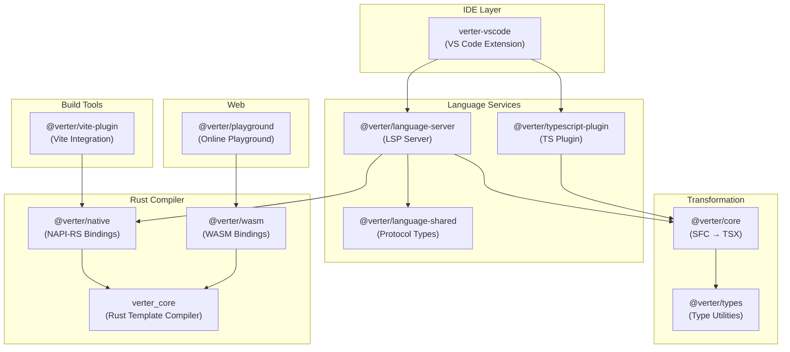
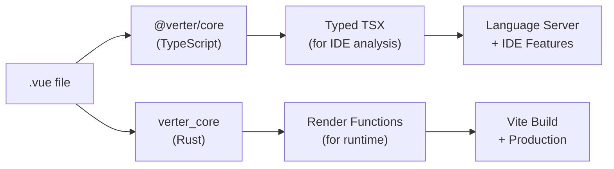

# Verter

A Vue compiler, Language Server Protocol (LSP) implementation, and build tool — built as a hybrid Rust + TypeScript monorepo.

> [!WARNING]
> **This project is experimental and under active development.** APIs, architecture, and package boundaries may change without notice. Use at your own risk and please report any issues you find.

> [!IMPORTANT]
> The generated TSX is syntactically valid TypeScript/TSX used for **type analysis only** — it's not meant to be executed or compiled as actual JSX/TSX code.

## Project Vision

Verter started as a Vue LSP and SFC-to-TSX transformation tool for VS Code, aiming to provide better TypeScript support than [Volar](https://github.com/vuejs/language-tools). The project is now evolving into a **full Vue compiler**:

- **Today**: TypeScript handles SFC-to-TSX transformation (for IDE type analysis), while Rust handles template compilation to optimized render functions (for runtime).
- **Future**: The Rust compiler (`verter_core`) will progressively take over responsibilities currently handled by the TypeScript packages, becoming the single compilation engine for both IDE analysis and runtime output.

## Features

- **Full TypeScript Support**: Converts `.vue` files to typed TSX representations, enabling complete TypeScript type inference
- **Vue 3 Support**: Optimized for Vue 3 with Composition API and Script Setup
- **Options API Support**: While Script Setup receives more attention, Options API is fully supported
- **Strict Type Safety**: Built with a "strict first" approach to type safety
- **JSX/TSX Interoperability**: SFCs can be seamlessly used in JSX/TSX projects
- **Generic Component Handling**: Full support for generic Vue components with proper constructor typing
- **Automatic Event Handler Type Inference**: Infers parameter types for functions used as template event handlers
- **Fully Typed Vue Directives**: Complete type safety for directives with strict modifier, argument, and value validation
- **Rust-Powered Template Compilation**: High-performance template-to-render-function compilation via native bindings or WASM

### Generic Components

Verter provides improved handling for generic Vue components, respecting Vue constructors with proper type inference:

```vue
<!-- Comp.vue -->
<script setup lang="ts" generic="T extends string">
defineProps<{
  name: T;
}>();

defineSlots<
  Record<T & string, (args: { test: T }) => any> & {
    header: (a: { foo: string }) => any;
  }
>();
</script>
```

```typescript
import Comp from "./Comp.vue";

const foo = {} as InstanceType<typeof Comp<"myName">>;
foo.$props.name; // Type: 'myName'
```

### Automatic Event Handler Type Inference

Verter automatically infers types for function parameters used as event handlers in templates:

```vue
<script setup lang="ts">
// No type annotation needed - Verter infers the type automatically
function handleClick(e) {
  // e is inferred as MouseEvent from HTMLElementEventMap["click"]
  console.log(e.clientX, e.clientY);
}
</script>

<template>
  <button @click="handleClick">Click me</button>
</template>
```

This works for native HTML elements (via `HTMLElementEventMap`), Vue components (via emits/props definitions), and multi-parameter event handlers.

### Fully Typed Vue Directives

```vue
<script setup lang="ts">
const vColor: Directive<HTMLElement, string, "red" | "blue"> = (el, binding) => {
  el.style.color = binding.value;
};
</script>

<template>
  <span v-color.blue="'red'" />
  <!-- valid -->
  <span v-color.green="'red'" />
  <!-- type error: invalid modifier -->
  <input v-model.number.trim="count" />
</template>
```

## Why Verter?

Since the Vetur days, Vue has struggled with type safety and tooling quality. Vue 3 and Volar brought significant improvements, but challenges remain. Verter aims to provide the **best possible TypeScript experience for Vue** by converting SFCs into typed TSX representations that TypeScript's language service can analyze directly.

### Verter vs Volar

| Aspect   | Verter                             | Volar                    |
| -------- | ---------------------------------- | ------------------------ |
| Maturity | Experimental / Alpha               | Production-ready         |
| Approach | SFC → Typed TSX representation     | Virtual file mapping     |
| Compiler | Rust (template) + TypeScript (SFC) | TypeScript only          |
| Focus    | Best TypeScript integration        | Feature-rich IDE support |
| Use case | When you need strict type safety   | General Vue development  |

> [!NOTE]
> If you haven't encountered specific issues with Volar, there's no reason to switch. Verter is for developers who need enhanced TypeScript support and are comfortable with experimental software.

## Architecture

Verter is a hybrid Rust + TypeScript monorepo. The Rust crates handle template compilation (exposed via NAPI-RS native bindings and wasm-bindgen WASM), while TypeScript packages handle SFC-to-TSX transformation, the LSP, and IDE integration.

### System Overview



### Dual Compilation Pipeline



### Repository Structure

```
verter/
├── crates/                        # Rust crates
│   ├── verter_core/               # Core template compiler (pure Rust)
│   ├── verter_napi/               # Native Node.js bindings (NAPI-RS)
│   └── verter_wasm/               # WASM bindings (wasm-bindgen)
├── packages/                      # TypeScript packages
│   ├── core/                      # @verter/core — SFC → TSX transformation
│   ├── types/                     # @verter/types — TypeScript utility types
│   ├── native/                    # @verter/native — Native binding loader
│   ├── wasm/                      # @verter/wasm — WASM binding wrapper
│   ├── vite-plugin/               # @verter/vite-plugin — Vite integration
│   ├── language-server/           # @verter/language-server — LSP server
│   ├── language-shared/           # @verter/language-shared — Shared protocol types
│   ├── typescript-plugin/         # @verter/typescript-plugin — TS plugin
│   ├── oxc-bindings/              # @verter/oxc-bindings — OXC parser helper
│   ├── playground/                # @verter/playground — Online playground
│   ├── vue-vscode/                # verter-vscode — VS Code extension
│   └── example/                   # Example project
├── docs/                          # Additional documentation
│   ├── architecture.md            # Architecture deep-dive
│   └── rust-setup.md              # Rust development guide
└── scripts/                       # Build and utility scripts
```

### Package Dependencies

```
verter-vscode (VS Code extension)
├── @verter/language-server (LSP server)
│   ├── @verter/core (SFC → TSX transformation)
│   │   └── @verter/types (type utilities)
│   ├── @verter/native (Rust template compiler, NAPI-RS)
│   └── @verter/language-shared (client/server protocol)
├── @verter/typescript-plugin (IDE .vue import resolution)
│   └── @verter/core
└── @verter/oxc-bindings (OXC parser binary helper)

@verter/vite-plugin (Vite integration)
└── @verter/native

@verter/playground (Netlify-hosted)
└── @verter/wasm (Rust template compiler, wasm-bindgen)
```

## Installation

### VS Code Extension

Install the Verter VS Code extension from the marketplace (coming soon).

### Manual Build (Fresh Machine)

```bash
# 1. Install Rust (if not already installed)
curl --proto '=https' --tlsv1.2 -sSf https://sh.rustup.rs | sh
source "$HOME/.cargo/env"

# 2. Add WASM target and install wasm-pack
rustup target add wasm32-unknown-unknown
cargo install wasm-pack

# 3. Install pnpm (if not already installed, requires Node.js 18+)
corepack enable
corepack prepare pnpm@latest --activate

# 4. Clone and build
git clone https://github.com/pikax/verter.git
cd verter
pnpm install
pnpm build    # Builds: native bindings → WASM bindings → TypeScript packages

# 5. (Optional) Package VS Code extension
pnpm package
```

## Development

### Prerequisites

- **Node.js** 18+
- **pnpm** 10+
- **Rust** toolchain (for building native/WASM bindings) — install via [rustup](https://rustup.rs/)
- **wasm-pack** (for WASM builds) — `cargo install wasm-pack`
- **wasm32 target** — `rustup target add wasm32-unknown-unknown`

### Commands

```bash
# Build everything (sequential: native → wasm → TypeScript)
pnpm build

# Build individual layers
pnpm run build:native         # Rust → .node bindings
pnpm run build:wasm           # Rust → .wasm bindings
pnpm run build:ts             # TypeScript packages

# Watch mode for extension development
pnpm watch

# Watch language-server + vscode extension
pnpm dev-extension

# Clean build artifacts
pnpm clean
```

### Rust Development

```bash
# Run all Rust tests
cargo test --workspace --verbose

# Run specific crate tests
cargo test --package verter_core

# Format and lint
cargo fmt --all
cargo clippy --workspace
```

## Testing

```bash
# TypeScript tests (Vitest)
pnpm test
pnpm vitest --run                          # All tests (non-watch)
pnpm vitest --run path/to/test.spec.ts     # Specific file

# Rust tests
cargo test --workspace --verbose
cargo test --package verter_core test_name  # Specific test
```

Test files are co-located with source files as `*.spec.ts`.

## Documentation

### Project Guides

- **[Architecture Overview](./docs/architecture.md)** — Deep dive into Verter's design
- **[Rust Setup Guide](./docs/rust-setup.md)** — Rust development environment
- **[Contributing Guide](./CONTRIBUTING.md)** — How to contribute
- **[CI/CD Documentation](./.claude/ci-cd.md)** — Workflows and release process

### TypeScript Packages

| Package                     | README                                           | Description                       |
| --------------------------- | ------------------------------------------------ | --------------------------------- |
| `@verter/core`              | [README](./packages/core/README.md)              | SFC → TSX transformation engine   |
| `@verter/types`             | [README](./packages/types/readme.md)             | TypeScript utility types          |
| `@verter/native`            | [README](./packages/native/README.md)            | Native Node.js bindings (NAPI-RS) |
| `@verter/wasm`              | [README](./packages/wasm/README.md)              | WASM bindings for browser         |
| `@verter/vite-plugin`       | [README](./packages/vite-plugin/README.md)       | Vite build integration            |
| `@verter/language-server`   | [README](./packages/language-server/readme.md)   | LSP server                        |
| `@verter/language-shared`   | [README](./packages/language-shared/readme.md)   | Shared protocol types             |
| `@verter/typescript-plugin` | [README](./packages/typescript-plugin/readme.md) | TypeScript plugin                 |
| `@verter/oxc-bindings`      | [README](./packages/oxc-bindings/readme.md)      | OXC parser helper                 |
| `verter-vscode`             | [README](./packages/vue-vscode/readme.md)        | VS Code extension                 |
| `@verter/playground`        | [README](./packages/playground/README.md)        | Online playground                 |

### Rust Crates

| Crate         | README                                   | Description              |
| ------------- | ---------------------------------------- | ------------------------ |
| `verter_core` | [README](./crates/verter_core/README.md) | Core template compiler   |
| `verter_napi` | [README](./crates/verter_napi/README.md) | NAPI-RS Node.js bindings |
| `verter_wasm` | [README](./crates/verter_wasm/README.md) | WASM bindings            |

## Credits

- [Svelte language-tools](https://github.com/sveltejs/language-tools) for proving inspiration
- [Vetur](https://github.com/vuejs/vetur) for providing the base for language support
- [Volar](https://github.com/vuejs/language-tools) for inspiration and testing

## License

MIT
